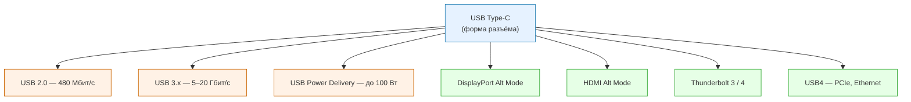
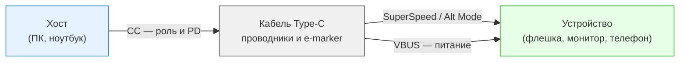

---
tags:
  - all
  - required
  - beginner
title: "USB — стандарты, разъёмы и Type-C"
description: "Что такое USB, как устроены версии протокола и разъёмы Type-A и Type-C, как работают зарядка Power Delivery, видео и Thunderbolt, и как выбрать кабель."
related:
  - title: "Как работает компьютер"
    doc: encyclopedia/1-basics/1-08-kak-rabotaet-kompyuter/intro
  - title: "Мышь и геймпад"
    doc: encyclopedia/1-basics/1-08-kak-rabotaet-kompyuter/714
  - title: "Дисплеи и технологии отображения"
    doc: encyclopedia/1-basics/1-08-kak-rabotaet-kompyuter/716
  - title: "Ноутбуки"
    doc: encyclopedia/1-basics/1-08-kak-rabotaet-kompyuter/711
  - title: "USB (глоссарий)"
    href: /glossary/U#usb
---

# USB — стандарты, разъёмы и Type-C

  ОБЯЗАТЕЛЬНО
  ДЛЯ НОВИЧКОВ

Всем

---

## Что такое USB

**USB** (Universal Serial Bus, универсальная последовательная шина) — набор правил, по которым компьютер, ноутбук или смартфон обменивается данными с внешними устройствами и подаёт на них питание.

В быту под "USB" обычно имеют в виду сразу три вещи:

- **Разъём** — физическая форма отверстия и штекера (Type-A, Micro-USB, Type-C).
- **Протокол** — правила скорости и формата передачи (USB 2.0, USB 3.2, USB4).
- **Кабель** — проводники внутри, которые связывают хост и устройство.

**Хост** — сторона, которая "главная": ПК, ноутбук, зарядный блок. **Устройство** (периферия) — всё, что подключают: мышь, флешка, принтер, телефон. Один и тот же разъём Type-C на телефоне может быть устройством при зарядке от ноутбука и хостом, когда телефон раздаёт файлы на флешку — роль согласуется при подключении.

USB закрывает две задачи:

- **Данные** — файлы, команды, звук, иногда видео.
- **Питание** — питание мыши от ПК, зарядка телефона или ноутбука от блока питания.

Три свойства сделали USB стандартом де‑факто:

- **Горячее подключение** — вставлять и вынимать кабель можно без выключения.
- **Автонастройка (plug-and-play)** — [операционная система](/encyclopedia/2-system-network/2-01-operatsionnaya-sistema/intro) распознаёт тип устройства и подбирает [драйвер](/glossary/Д#драйвер).
- **Общий разъём** для десятков типов техники — хотя кабели при этом бывают разными по начинке.

Клавиатура, [мышь](/encyclopedia/1-basics/1-08-kak-rabotaet-kompyuter/714), флешка, [принтер](/encyclopedia/1-basics/1-08-kak-rabotaet-kompyuter/intro), [веб‑камера](/encyclopedia/1-basics/1-08-kak-rabotaet-kompyuter/715) и зарядка — типичные USB‑сценарии. Обзор всех портов ПК — в [Как работает компьютер](/encyclopedia/1-basics/1-08-kak-rabotaet-kompyuter/intro).

---

## Термины, которые встретятся дальше

| Термин | Простыми словами |
|--------|------------------|
| **Протокол** | Договорённость "как именно передавать биты". Разные версии USB — разные [протоколы](/glossary/П#протокол) поверх одной шины. |
| **Type-A / Type-C** | Форма разъёма. Type-A — классический прямоугольник на ПК. Type-C — овал, вставляется с любой стороны. |
| **SuperSpeed** | Маркетинговое имя линий USB 3.x; на портах часто пишут "SS". |
| **PD (Power Delivery)** | Протокол согласования мощной зарядки через Type-C — до 100 Вт и выше. |
| **Alt Mode** | Режим, когда по USB‑кабелю идёт не только USB, но и видео (DisplayPort, [HDMI](/glossary/H#hdmi)). |
| **Thunderbolt (TB3/TB4)** | Высокоскоростная шина Intel/Apple поверх Type-C; до 40 Гбит/с, шина [PCI](/glossary/P#pci) для внешних дисков и видеокарт. |
| **eGPU** | Внешняя видеокарта в корпусе; нужен Thunderbolt. |
| **e-marker** | Микросхема в кабеле; сообщает, выдержит ли провод большой ток. |
| **D+/D−** | Пара проводов для данных USB 2.0. |
| **VBUS / GND** | Плюс питания и "земля" (общий минус). |

---

## История и версии протокола

Разъём **USB Type-A** на задней панели ПК выглядит почти так же, как в конце 1990‑х. **Протокол** за этим разъёмом за два десятилетия ускорился в сотни раз.

| Поколение | Период | Проводов для данных | Скорость | Ток без PD |
|-----------|--------|---------------------|----------|------------|
| USB 1.0 | 1996 | 2 (D+ и D−) | 12 Мбит/с | 500 мА |
| USB 2.0 | нач. 2000‑х | 2 | **480 Мбит/с** (~60 МБ/с) | 500 мА |
| USB 3.0 (3.1 Gen 1) | ~2008 | +5 (SuperSpeed) | **5 Гбит/с** | 900 мА |
| USB 3.1 Gen 2 | 2013 | +5 или больше* | **10 Гбит/с** | до 100 Вт с PD |
| USB 3.2 | 2017+ | до 24 контактов* | до 20 Гбит/с | до 100 Вт с PD |
| USB4 | 2019+ | 24 (Type-C) | до **40 Гбит/с** | до 100 Вт с PD |

\* С **USB Type-C** в разъёме **24 контакта** — несколько пар SuperSpeed и линии для зарядки PD и альтернативных режимов.

**480 Мбит/с** у USB 2.0 на бумаге — около 60 МБ/с. На практике флешка или телефон с USB 2.0 часто копирует файлы со скоростью 20–35 МБ/с — этого хватает для мыши и клавиатуры, но копирование фильма на 8 ГБ займёт минуты, а не секунды.

В эпоху USB 2.0 смартфоны заряжали через **Micro-USB**. С ростом скорости и мощности зарядки его сменил **Type-C** — один разъём и для данных, и для быстрой зарядки, и для видео на [монитор](/encyclopedia/1-basics/1-08-kak-rabotaet-kompyuter/716).

  
Две оси — версия и форма

  

  <strong>Номер версии</strong> (2.0, 3.0, 3.2, 4) говорит о скорости и возможностях протокола. 
  <strong>Буква Type</strong> (A, B, Micro, C) описывает только форму разъёма. 
  Один и тот же порт Type-C может работать по USB 2.0, по USB4 или по Thunderbolt — это зависит от чипа в ноутбуке и от кабеля, а не от формы отверстия.
  

---

## Форма разъёма и протокол

**USB Type-C** — спецификация **физического** разъёма:

- симметричный овал;
- вставляется любой стороной;
- 24 контакта внутри.

Сам по себе Type-C **не гарантирует** высокую скорость, быструю зарядку или вывод картинки. Какие технологии реально работают, определяют:

- контроллер порта на материнской плате или в процессоре;
- прошивка устройства;
- кабель (число проводников, e-marker, длина).

### Что может работать через один порт Type-C

| Технология | Для чего | Где встречается |
|------------|----------|-----------------|
| USB 2.0 | Мышь, клавиатура, медленная передача файлов | Бюджетные телефоны, дешёвые кабели "только зарядка" |
| USB 3.0 / 3.1 / 3.2 | Быстрые флешки, [SSD](/encyclopedia/1-basics/1-08-kak-rabotaet-kompyuter/3), док‑станции | Большинство [ноутбуков](/encyclopedia/1-basics/1-08-kak-rabotaet-kompyuter/711) и ПК |
| **USB Power Delivery** | Зарядка 45–100 Вт | Блоки питания, [Steam Deck](/encyclopedia/9-spinoff/9-03-igrovaya-industriya/11432), MacBook |
| **DisplayPort Alt Mode** | Монитор по одному кабелю | Ультрабуки, игровые handheld |
| **HDMI Alt Mode** | Телевизор с телефона | Отдельные Android‑модели |
| **Thunderbolt 3 / 4** | 40 Гбит/с, eGPU, цепочка устройств | MacBook Pro, рабочие станции |
| **USB4** | Объединяет USB и Thunderbolt | Современные Intel и Apple Silicon |

Снаружи порты выглядят одинаково. Подсказки:

- значок **молнии** — Thunderbolt;
- надпись **SS** или **10** — SuperSpeed (USB 3.x);
- **инструкция** к ноутбуку — таблица портов слева и справа часто различается;
- **поведение** — флешка на 500 МБ/с сразу показывает, что порт и кабель быстрые.

---

## Как устроены кабель и порт

### USB 2.0 — четыре провода

Внутри простого кабеля USB 2.0:

- **VBUS** — плюс питания (+5 В);
- **GND** — общий минус ("земля");
- **D+** и **D−** — пара для данных (один проводник на передачу, один на приём в полудуплексе).

Этого хватает для [HID](/encyclopedia/1-basics/1-08-kak-rabotaet-kompyuter/714)‑устройств (мышь, клавиатура) и недорогих флешек. Для 4K‑видео и зарядки 65 Вт проводов мало.

### USB 3.x — девять контактов в Type-A

К четырём линиям USB 2.0 добавляют **SuperSpeed**:

- отдельная пара на передачу (TX);
- отдельная пара на приём (RX);
- дополнительная земля.

Итого **девять** контактов в классическом USB‑A. Скорость — 5–20 Гбит/с, ток до 900 мА без PD.

### USB Type-C — 24 контакта

Type-C симметричен: контакты продублированы, поэтому штекер одинаков с двух сторон. Внутри:

- линии USB 2.0 (D+/D−);
- несколько пар SuperSpeed;
- **CC** (Configuration Channel) — "переговорный" провод; по нему устройства договариваются, кто хост, сколько ватт подавать, включать ли Alt Mode;
- линии для DisplayPort, Thunderbolt или USB4.

При вставке штекера микросхемы читают линию CC и решают:

- кто подаёт питание;
- какой профиль PD запросить (5, 9, 15 или 20 В);
- выдерживает ли кабель нужный ток;
- переключиться ли в режим DisplayPort или Thunderbolt.

---

## USB Power Delivery

**USB PD** — протокол мощной зарядки **поверх Type-C**. Он **не привязан** к версии USB 3.x: телефон может заряжаться по PD 25 Вт, e‑mail по USB 2.0.

PD умеет:

- подавать **до 100 Вт** и больше (20 В × 5 А в профилях EPR; для ультрабуков часто 45–65 Вт);
- **менять направление** — телефон заряжает [наушники](/encyclopedia/1-basics/1-08-kak-rabotaet-kompyuter/715) или power bank;
- **ступенчато повышать напряжение** — 5 → 9 → 15 → 20 В, чтобы не греть провод на больших токах.

Цепочка зарядки работает по принципу "самое слабое звено":

- блок питания;
- кабель;
- порт ноутбука или телефона.

Если блок на 100 Вт, а кабель рассчитан на 15 Вт — быстрой зарядки не будет, даже при "правильном" разъёме.

  
Дешёвые кабели и нестандартная зарядка

  

  Тонкий кабель без e-marker при 60–100 Вт может <strong>перегреться</strong> — пластик, контакты, порт. 
  Проприетарные протоколы (VOOC, SuperVOOC и аналоги) требуют <strong>фирменных толстых</strong> кабелей — универсальный Type-C из другого производителя может не выдать заявленную мощность. 
  Подробнее о питании портативных устройств — в [Аккумуляторы и источники питания](/encyclopedia/1-basics/1-08-kak-rabotaet-kompyuter/9111).
  

---

## Видео и Thunderbolt через Type-C

### DisplayPort Alt Mode и HDMI Alt Mode

**Alt Mode** ("альтернативный режим") — часть контактов Type-C временно отдают под другой протокол. **DisplayPort Alt Mode** передаёт видеопоток на [монитор](/encyclopedia/1-basics/1-08-kak-rabotaet-kompyuter/716) по тому же кабелю, что и USB. **HDMI Alt Mode** делает то же для телевизора — встречается реже.

Док‑станция с одним кабелем к [ноутбуку](/encyclopedia/1-basics/1-08-kak-rabotaet-kompyuter/711) — типичный сценарий Alt Mode: зарядка, монитор, USB‑мышь и клавиатура.

### Thunderbolt 3 и USB4

**Thunderbolt 3** использует разъём Type-C, но передаёт:

- **PCIe** — шину расширения, к которой внутри ПК подключены [видеокарта](/encyclopedia/1-basics/1-08-kak-rabotaet-kompyuter/4) и быстрые [NVMe](/glossary/N#nvme)‑диски;
- **DisplayPort** — для мониторов;
- данные USB — параллельно.

Пропускная способность — до **40 Гбит/с**. Этого хватает для внешней видеокарты (**eGPU**), нескольких 4K‑мониторов и быстрого SSD в одном порту.

**USB4** (2019) объединил USB и Thunderbolt: совместимый порт переключается между режимами без смены разъёма. На практике наклейка "USB4" или "Thunderbolt 4" на ноутбуке часто означает один и тот же универсальный порт.

---

## Одинаковые порты на разных ноутбуках

На [MacBook](/encyclopedia/1-basics/1-08-kak-rabotaet-kompyuter/711) все Type-C снаружи похожи, но начинка портов зависит от модели и года.

| Модель | Поддерживает | Не поддерживает |
|--------|--------------|-----------------|
| MacBook 12" (2015–2017) | USB 3.1, PD, DisplayPort 1.2 | Thunderbolt, eGPU |
| MacBook Pro с Thunderbolt 3 | TB3 до 40 Гбит/с, DP, PD, USB 3.1 | — |
| Комплектный кабель зарядки Apple | Только питание PD | Данные Thunderbolt |

**MacBook Pro с Thunderbolt 3** строит **цепочку (daisy chain)**:

- ноутбук → док или монитор → ещё устройства;
- один порт заряжает ПК, выводит 5K‑картинку и обслуживает USB‑мышь на мониторе.

**MacBook 12"** подключит монитор и флешку, но **eGPU** не примет — в контроллере нет Thunderbolt и PCIe поверх USB.

Тот же принцип у любого производителя: перед покупкой док‑станции сверьте таблицу портов в спецификации.

---

## Кабели Thunderbolt 3

Кабели TB3 делятся на два класса по конструкции.

**Пассивные**

- до **0,5 м** — полные 40 Гбит/с;
- длиннее 0,5 м — скорость падает до 20 Гбит/с;
- с обычной USB‑периферией ведут себя как USB 3.1;
- дешевле активных.

**Активные**

- чипы‑трансиверы в штекерах усиливают сигнал;
- **40 Гбит/с** на длине до ~2 м;
- дороже;
- при подключении к простому USB 2.0‑устройству скорость может упасть до **480 Мбит/с** — активная электроника "не нужна" для медленного девайса.

Для eGPU и док‑станций на 40 Гбит/с нужен **короткий пассивный** или **активный сертифицированный** кабель с маркировкой Thunderbolt, а не любой Type-C с полки.

---

## Разъёмы, которые ещё встречаются

| Разъём | Где | Статус |
|--------|-----|--------|
| **Type-A** | ПК, флешки, принтеры | Основной "хостовый" разъём десятилетиями |
| **Type-B** | Старые принтеры | Почти вытеснен |
| **Micro-USB** | Старые Android, power bank | Устаревает |
| **Mini-USB** | Камеры, Arduino | Редкость |
| **Type-C** | Телефоны, ноутбуки, [консоли](/encyclopedia/9-spinoff/9-03-igrovaya-industriya/11432) | Текущий стандарт |

### Цвета портов на задней панели ПК

Производители не обязаны красить порты, но часто используют такую схему:

| Цвет | Обычная версия |
|------|----------------|
| Чёрный | USB 2.0 |
| Синий | USB 3.0 / 3.1 |
| Красный или жёлтый | Порт с повышенным током для зарядки |
| Бирюзовый Type-C | USB 3.2 / Thunderbolt / USB4 |

---

## Износ и люфт Type-C

Type-C удобно вставлять с любой стороны, но у разъёма есть слабое место — **нет фиксирующих зубцов**, как у Micro-USB. Кабель держится только пружиной контактов.

Через 1–2 года активного использования возможны:

- **люфт** — кабель болтается, связь пропадает;
- **нестабильная зарядка** — контакт то есть, то нет;
- **ускоренный износ порта** от **USB‑хаба‑"палки"**, который торчит жёстко из бока [ноутбука](/encyclopedia/1-basics/1-08-kak-rabotaet-kompyuter/711).

Практичнее хаб на **коротком гибком хвосте** — нагрузка на порт меньше.

---

## Как проверить порт и выбрать кабель

### Узнать возможности порта

**Windows**

- "Диспетчер устройств" → "Контроллеры USB" — версия хост‑контроллера;
- отдельный раздел "Контроллеры Thunderbolt" — если TB есть.

**macOS**

- "Об этом Mac" → "Отчёт о системе" → разделы USB и Thunderbolt.

**Смартфон**

- кабель только заряжает, а ПК не видит телефон — часто кабель **charge‑only** (нет линий данных) или порт повреждён.

### Подбор кабеля под задачу

| Задача | На что смотреть |
|--------|-----------------|
| Зарядка ноутбука 65 Вт | PD, толстые проводники, сертификация, e-marker |
| Быстрая передача файлов | USB 3.x или USB4, не "только зарядка" |
| Монитор по одному проводу | DisplayPort Alt Mode или Thunderbolt |
| eGPU | Thunderbolt 3/4, короткий пассивный или активный TB‑кабель |
| Хаб к ноутбуку | Гибкий короткий хвост |

  
Быстрая проверка кабеля

  

  Подключите флешку через кабель к синему USB 3 порту ПК. Скопируйте файл 1–2 ГБ. 
  Скорость стабильно выше 80–100 МБ/с — кабель и порт USB 3. 
  Не больше 30–40 МБ/с — где‑то в цепи USB 2.0 (кабель, хаб или порт).
  

---

## USB в компьютере

- **Ввод** — [мышь и клавиатура](/encyclopedia/1-basics/1-08-kak-rabotaet-kompyuter/714) как HID поверх USB 2.0; достаточно для сотен Гц опроса.
- **Мониторы** — [DisplayPort](/encyclopedia/1-basics/1-08-kak-rabotaet-kompyuter/716) и [HDMI](/glossary/H#hdmi) остаются основными; Type-C с Alt Mode сокращает число кабелей; выбор экрана — [Как выбрать монитор](/encyclopedia/1-basics/1-08-kak-rabotaet-kompyuter/717).
- **Накопители** — скорость флешки и внешнего SSD упирается в версию USB; [NVMe](/glossary/N#nvme) в корпусе с USB4/TB приближается к внутреннему диску — см. [Устройства хранения данных](/encyclopedia/1-basics/1-08-kak-rabotaet-kompyuter/3).
- **Зарядка** — блок, кабель и порт должны поддерживать один профиль PD.
- **Безопасность** — неизвестная флешка может нести вредонос; атаки класса BadUSB описаны в [Основах информационной безопасности](/encyclopedia/2-system-network/2-08-osnovy-informatsionnoy-bezopasnosti/intro).

---

## Итог

- **USB** — шина данных и питания; номер версии (2.0, 3.x, 4) задаёт скорость протокола.
- **Type-C** — форма разъёма; внутри возможны USB 2.0, USB4, PD, DisplayPort, Thunderbolt — по отдельности или вместе.
- **PD**, **Alt Mode** и **Thunderbolt** — отдельные технологии; порт может поддерживать любое подмножество.
- Одинаковые отверстия Type-C на разных устройствах **работают по-разному** — смотрите спецификацию.
- Кабель и хаб — полноценная часть системы; слабый провод ограничивает и зарядку, и скорость годами.

---

## См. также

- [Как работает компьютер](/encyclopedia/1-basics/1-08-kak-rabotaet-kompyuter/intro)
- [Ноутбуки](/encyclopedia/1-basics/1-08-kak-rabotaet-kompyuter/711)
- [Клавиатура](/encyclopedia/1-basics/1-08-kak-rabotaet-kompyuter/713)
- [USB](/glossary/U#usb)
