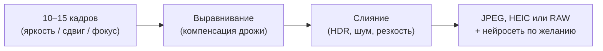

---
tags:
  - all
  - required
  - beginner
title: "Камеры смартфонов и вычислительная фотография"
description: "Стекинг кадров, HDR+, нейросети, многокамерность, LiDAR, RAW и программное боке. Как телефон получает сильные снимки с маленькой матрицы."
related:
  - title: "Мобильные устройства"
    doc: encyclopedia/1-basics/1-08-kak-rabotaet-kompyuter/712
  - title: "Графические процессоры и видеокарты"
    doc: encyclopedia/1-basics/1-08-kak-rabotaet-kompyuter/4
  - title: "Графические данные"
    doc: encyclopedia/1-basics/1-16-grafika/1
  - title: "Дисплеи и технологии отображения"
    doc: encyclopedia/1-basics/1-08-kak-rabotaet-kompyuter/716
  - title: "DLSS и FSR — апскейлинг в играх"
    doc: encyclopedia/1-basics/1-18-kompyuternye-igry/8
  - title: "История мобильных устройств"
    doc: encyclopedia/1-basics/1-07-nemnogo-o-proshlom/15
  - title: "История первого iPhone"
    doc: encyclopedia/1-basics/1-07-nemnogo-o-proshlom/14
---

# Камеры смартфонов и вычислительная фотография

  ОБЯЗАТЕЛЬНО
  ДЛЯ НОВИЧКОВ

Всем

---

[Смартфон](/glossary/С#смартфон) помещает камеру в корпус толщиной около 8–10 мм. **Сенсор** (матрица) там маленький — на каждый [пиксель](/glossary/П#пиксель-пиксел) попадает мало света, в тени растёт [шум](/glossary/Ш#шум), а сильное размытие фона требует большой оптики. Компактные фотоаппараты с рынка ушли, потому что телефон компенсирует физику **софтом**, **[вычислительной фотографией](/glossary/В#вычислительная-фотография)**.

Телефон снимает **серию кадров**, склеивает их на [ISP и NPU](/encyclopedia/1-basics/1-08-kak-rabotaet-kompyuter/712#система-на-кристалле-soc) и иногда достраивает детали [нейросетью](/glossary/Н#нейросеть). Итоговый снимок — результат программы, которая объединяет многие кадры с матрицы.

---

## Словарь

| Термин | Простое объяснение |
|--------|-------------------|
| **Сенсор (матрица)** | Чип с миллионами светочувствительных ячеек. Превращает свет в электрический сигнал. Размер важнее числа мегапикселей на коробке. |
| **Мегапиксель (Мп)** | Миллион точек на снимке. 12 Мп ≈ 4000×3000 [пикселей](/glossary/П#пиксель-пиксел). Больше Мп даёт мельче детали при хорошем свете; размер сенсора всё равно решает больше. |
| **Экспозиция** | Сколько света "накопила" матрица за время съёмки (**выдержка**). Короткая — темнее, длинная — светлее, но смаз от движения. |
| **Диафрагма (f/)** | "Зрачок" объектива. **f/1.8** пропускает больше света, чем **f/2.4**. Пишут на коробке рядом с фокусным расстоянием. |
| **ISO** | Усиление сигнала с сенсора. Высокий ISO осветляет кадр, но добавляет [шум](/glossary/Ш#шум). См. [ISO](/glossary/I#iso). |
| **HDR** | *High Dynamic Range* — расширенный динамический диапазон. На одном снимке видны и тени, и яркое небо. |
| **Стекинг** (*stacking*) | Склеивание нескольких кадров в один — по яркости, фокусу или смещению пикселей. |
| **ISP** | *Image Signal Processor* — блок в [SoC](/encyclopedia/1-basics/1-08-kak-rabotaet-kompyuter/712#система-на-кристалле-soc), который обрабатывает сигнал с сенсора (баланс белого, шум, HDR, склейка кадров). |
| **NPU** | *Neural Processing Unit* — ускоритель [нейросетей](/glossary/Н#нейросеть) на чипе. Портреты, ночной режим, распознавание сцен. |
| **OIS** | *Optical Image Stabilization* — оптическая стабилизация. Сенсор или линза слегка смещаются, компенсируя дрожь рук. |
| **RAW / DNG** | Файл с минимальным сжатием и большим запасом для цветокоррекции. "Сырые" данные плюс метаданные съёмки. |
| **[JPEG](/glossary/J#jpeg-jpg)** | Готовый сжатый снимок с потерями. Удобен для мессенджеров, плохо переживает сильную правку цвета. |
| **[HEIC](/glossary/H#heic)** | Формат Apple/Android с лучшим сжатием, чем JPEG. На Windows иногда нужен кодек. |
| **[EXIF](/glossary/E#exif)** | Метаданные внутри файла — модель телефона, выдержка, ISO, иногда GPS. |
| **LiDAR** | Лазерный датчик глубины. Строит 3D-карту расстояний по времени возврата импульса. |
| **TOF** | *Time of Flight* — датчик глубины по инфракрасному свету. Проще LiDAR, хуже в ярком солнечном свете. |
| **Боке** | Размытие фона при резком объекте. На телефоне его часто рисует программа поверх карты глубины. |
| **Кроп** | Обрезка центра кадра для "приближения". Цифровой зум без оптики теряет детали. |
| **Пленоптика** | Съёмка света с разных углов. Позволяет оценить глубину и менять фокус после экспозиции. |

---

## Что такое вычислительная фотография

**Вычислительная фотография** (*computational photography*) — алгоритмы, которые улучшают или расширяют обычную цифровую съёмку. Итог — картинка, которую **одним** стандартным оптическим кадром с этой камеры получить нельзя.

Тот же подход встречается за пределами телефона. Первое опубликованное изображение **чёрной дыры** (2019) собрали из данных **восьми** радиотелескопов по планете — один "идеальный" телескоп размером с Землю построить нельзя, зато можно сложить сигналы алгоритмами.

В [смартфоне](/glossary/С#смартфон) задачи ближе к быту:

- снимок в темноте без штатива;
- портрет с размытым фоном;
- зум без толстого объектива;
- резкий макроснимок одним нажатием.

  
Скорость серии кадров

  

  Зеркальный фотоаппарат в серии успевает <strong>3–4</strong> кадра в секунду. Смартфон в том же режиме — <strong>10–15</strong>. Телефон <strong>непрерывно пишет</strong> кадры в буфер и склеивает их быстрее, чем заметна задержка после нажатия затвора.
  

Снимок в телефоне — это [растровое изображение](/glossary/B#bitmap), сетка пикселей с цветом. Как байты превращаются в картинку на экране — в [Графических данных](/encyclopedia/1-basics/1-16-grafika/1).

---

## Краткая история алгоритмов

| Период | Что появилось |
|--------|---------------|
| **~2007** | Камеры Nokia и Sony Ericsson дают приемлемые дневные снимки. Позже Instagram популяризирует **фильтры**, которые скрывают слабые сенсоры. |
| **2011, [iOS](/glossary/I#ios) 5** | API автоулучшения — телефон убирает "красные глаза", подтягивает насыщенность, выравнивает кожу и тени. |
| **2010‑е** | HDR в реальном времени, ночные режимы, портреты с размытием фона. |
| **2020‑е** | [Нейросети](/encyclopedia/6-ai/6-03-neyroseti/intro) достраивают текстуры, меняют фон, подменяют небо и детали на телефото. |

Конвейер современной камеры:

- **сенсор** ловит свет;
- **кольцевой буфер** хранит последние секунды кадров;
- **ISP** склеивает серию и правит цвет;
- **NPU** отделяет человека от фона и дорисовывает детали;
- на диск уходит **JPEG**, **HEIC** или **RAW**.

Хронология смартфона как класса — [История первого iPhone](/encyclopedia/1-basics/1-07-nemnogo-o-proshlom/14) и [История мобильных устройств](/encyclopedia/1-basics/1-07-nemnogo-o-proshlom/15).

---

## Стекинг — склейка нескольких кадров

Около **90%** "вау-эффекта" камерофона даёт **стекинг** — объединение серии снимков в один. Три главных вида:

### HDR+ (стекинг по яркости)

Камера снимает серию с **разной экспозицией**:

- темнее — чтобы увидеть небо и лампы;
- нормально — для средних тонов;
- светлее — чтобы вытянуть тени.

Алгоритм собирает один кадр, где и окна, и улица читаются. Так работают HDR, Night Sight (Google), Smart HDR (Apple) — названия разные, идея одна.

### Фокус-стекинг

При макросъёмке или пейзаже телефон быстро делает кадры с **сдвигом плоскости резкости** вперёд и назад, потом сшивает их в один полностью резкий снимок. На зеркалке для того же нужны штатив и ручная серия с разным фокусом.

### Стекинг по движению (pixel shifting)

Руки дрожат — смартфон использует это как дополнительные ракурсы. За доли секунды снимается ~10 кадров; пиксели смещаются на доли микрона. Процессор собирает цвет и деталь с каждого микросдвига:

- меньше шума;
- выше резкость без роста числа мегапикселей на сенсоре.

У Google похожий приём заложен в **Super Res Zoom** — цифровой зум опирается на серию кадров и на обрезку центра вместе.

---

## Кольцевой буфер и мгновенный затвор

Камера начинает писать кадры **сразу при открытии** приложения. Несколько секунд снимков в полном разрешении крутятся в **кольцевом буфере** — кольце из ячеек памяти, где старые кадры затираются новыми.

Когда вы нажимаете кнопку затвора:

- нужные кадры **уже лежат** в буфере;
- телефон забирает последние 10–15 снимков;
- запускается тяжёлая обработка HDR+ или ночного режима.

Отсюда три привычных эффекта:

- задержка после нажатия почти незаметна;
- **Live Photo** на iPhone и аналоги — короткое видео до и после кадра;
- для ночного режима важна неподвижность **до** щелчка — вы уже секунду держите телефон ровно, пока буфер наполняется.

Память телефона и скорость [накопителя UFS](/encyclopedia/1-basics/1-08-kak-rabotaet-kompyuter/712#система-на-кристалле-soc) должны успевать принимать этот поток данных — см. [Устройства хранения](/encyclopedia/1-basics/1-08-kak-rabotaet-kompyuter/3).

---

## Оптика и несколько камер

### Зачем несколько модулей

HTC One M8 (2014) популяризировал **две камеры** на одной панели — второй сенсор помогал оценивать глубину. Позже пробовали экзотику вроде Light L16 с **16** объективами. Сейчас типичный набор:

- **основная (ширик)** — 24–28 мм, крупный сенсор, повседневные снимки;
- **ультраширик** — 110–120°, пейзажи и интерьеры;
- **телевик** — 2×, 3×, 5× оптическое приближение;
- **перископ** — длинный объектив "ломается" зеркалом внутри корпуса, даёт 5×–10× без выпирающего блока.

На **10×** в кармане работает связка оптики, стекинга и иногда нейросетевого зума.

### На что смотреть кроме мегапикселей

- **размер сенсора** — в спецификации часто пишут дробь дюйма (1/1.3", 1/2.55"); чем **меньше** знаменатель, тем **крупнее** матрица;
- **диафрагма** — f/1.6 пропускает больше света, чем f/2.2;
- **OIS** — оптическая стабилизация, критична для ночи и видео;
- **согласованность модулей** — как [ISP](/encyclopedia/1-basics/1-08-kak-rabotaet-kompyuter/712#система-на-кристалле-soc) склеивает кадры с разных камер при переключении зума.

Подробнее про модули и BSI-сенсоры — [Камеры в мобильных устройствах](/encyclopedia/1-basics/1-08-kak-rabotaet-kompyuter/712#камеры).

---

## LiDAR и карта глубины

С **iPhone 12 Pro** Apple добавила **LiDAR** — лазер посылает импульсы, приёмник ловит отражение и считает расстояние. Получается **3D-карта** сцены на близкой дистанции.

LiDAR помогает:

- сфокусироваться в полной темноте;
- точнее отделить человека от фона в портрете;
- сканировать комнаты и предметы для 3D-редакторов.

Старые **TOF**-датчики на Android измеряли глубину по инфракрасному паттерну и контрасту сцены. LiDAR точнее на коротких дистанциях, но модуль дороже и крупнее.

---

## Пленоптика — глубина с одной камеры

Ранние "перефокусировки после съёмки" (Nokia Lumia 1020, Samsung Galaxy S5) делали **три** кадра с разным фокусом — упрощённый приём без полноценной пленоптики.

**Lytro Light Field Camera** (2012) — первая массовая **пленоптическая** камера. Над матрицей стояла решётка **микролинз**; каждый участок сенсора ловил свет под своим углом. В 2018 Google выкупила Lytro и перенесла идеи в **Pixel 2**.

На Pixel пиксели под микролинзами группируют **парами**. Из **одного** кадра одной камеры строится карта глубины — человек отделяется от фона точнее, чем у моделей только с двумя обычными модулями.

---

## JPEG, RAW и форматы для монтажа

**JPEG** — готовый снимок с потерями. Телефон уже применил контраст, резкость, шумоподавление. Файл маленький, его удобно отправить в мессенджер. Сильная цветокоррекция "ломает" картинку — детали выбиты при сжатии.

**Вычислительный RAW** сохраняет стекинг и HDR из телефонного конвейера, но оставляет запас для правки:

- баланс белого;
- экспозиция;
- цвет кожи;
- локальные тени и света.

| Формат | Где встречается | Особенность |
|--------|-----------------|-------------|
| **DNG** | Google Pixel с 2018 | Открытый контейнер Adobe, computational RAW + метаданные алгоритмов |
| **Apple ProRAW** | iPhone с 2020 | RAW с обработкой Apple, правка в Photos и Lightroom |
| **JPEG** | Везде | Готовый снимок для соцсетей |
| **HEIC** | iPhone, многие Android | Меньший размер при том же качестве, чем JPEG |

В файле также лежат **[EXIF](/glossary/E#exif)** — модель, ISO, выдержка; перед публикацией GPS иногда стоит удалить.

---

## Видео — почему сложнее фото

Стекинг фото обрабатывает **десятки** кадров за долю секунды **до** сохранения одного файла. В **видео** таких пауз нет — каждый из 24–60 кадров в секунду нужно успеть записать и обработать.

Узкие места:

- **пропускная способность ISP** — сотни мегапикселей в секунду;
- **скорость [UFS](/encyclopedia/1-basics/1-08-kak-rabotaet-kompyuter/3)** — десятки гигабайт в минуту для несжатого потока;
- **патенты** — кодек **RED Code** (RAW-видео) защищён до **2028**; RED судилась с Apple и Nikon.

Apple ответила **ProRes** на iPhone 13 — тяжёлый, но удобный для монтажа формат (~6 ГБ на минуту в высоком качестве). На Android ProRes почти не встречается — лицензия Apple дорогая, нужны высокие скорости накопителя.

Похожая идея "достройки кадра" в играх — [DLSS и FSR](/encyclopedia/1-basics/1-18-kompyuternye-igry/8). Там [GPU](/encyclopedia/1-basics/1-08-kak-rabotaet-kompyuter/4) и [тензорные ядра](/encyclopedia/1-basics/1-08-kak-rabotaet-kompyuter/4#специализированные-вычислительные-блоки) работают **в реальном времени**; в камере ту же роль частично берут **NPU** и ISP **до** записи файла.

---

## Программное боке и нейросети

Портретный режим отделяет человека от фона и рисует **размытие** произвольной формы. На зеркалке сильное боке даёт светосильный объектив **f/1.4** — в корпусе телефона 8 мм такую оптику не разместить.

Телефон строит **карту глубины** (вторая камера, LiDAR, TOF или пленоптика) и размывает фон алгоритмом. **[NPU](/encyclopedia/1-basics/1-08-kak-rabotaet-kompyuter/712#система-на-кристалле-soc)** гоняет [нейросеть](/encyclopedia/6-ai/6-03-neyroseti/intro), обученную на миллионах портретов:

- волосы и мех у края силуэта;
- очки и прозрачные предметы;
- одежда с мелким узором.

Режим работает на фото и **в реальном времени** в видео — это нагрузка на чип и батарею.

Типичные огрехи:

- "ореолы" вокруг волос;
- полупрозрачный стакан режется неаккуратно;
- "пластиковая" кожа в режимах "красоты";
- фон размыт неравномерно на сложных сценах.

---

## Алгоритмы и правда кадра

Индустрия вкладывается в **нейровычисления** в каждом кадре. Известный случай — Samsung на телефото **добавляла** текстуру Луны, когда сенсор видел размытое пятно. Нейросеть подставляла "ожидаемую" картинку спутника.

Дальше возможности расширяются:

- замена фона на стоковый пейзаж;
- более насыщенное небо и трава;
- автоматическое сглаживание кожи и смена причёски.

Фотографы-пуристы говорят о потере натуральности; массовому пользователю часто важнее эмоция на снимке, чем оптическая точность. Граница между "улучшением" и "подменой" выходит за рамки техники — это вопрос доверия к кадру.

  
Покупка телефона — практичный чек-лист

  

  <ul>
    <li>размер сенсора и диафрагма важнее цифры "200 Мп" на коробке;</li>
    <li>наличие <strong>OIS</strong> на основной камере;</li>
    <li>ночные и портретные кадры в независимых обзорах;</li>
    <li>поддержка <strong>ProRAW / DNG</strong>, если планируете постобработку;</li>
    <li>качество видео (стабилизация, 4K, лог-профили) — отдельно от фото.</li>
  </ul>
  Железо и [SoC](/encyclopedia/1-basics/1-08-kak-rabotaet-kompyuter/712) — в <a href="/encyclopedia/1-basics/1-08-kak-rabotaet-kompyuter/712">Мобильных устройствах</a>; экран, на котором смотрите результат — <a href="/encyclopedia/1-basics/1-08-kak-rabotaet-kompyuter/716">Дисплеи</a>.
  

---

## Что запомнить

1. **Качество камерофона** складывается из стекинга (HDR+, pixel shift), кольцевого буфера, ISP, NPU и оптики — мегапиксели на коробке лишь один из параметров.
2. **Стекинг по яркости** вытягивает тени и света; **по движению** — шум и резкость; **фокус-стекинг** — резкость от переднего плана до горизонта.
3. **Кольцевой буфер** объясняет мгновенный затвор, Live Photo и работу ночного режима.
4. **Несколько камер**, LiDAR, TOF и пленоптика дают зум и карту глубины в тонком корпусе.
5. **Computational RAW** (DNG, ProRAW) — мост между телефонными алгоритмами и профессиональным постом; **видео-RAW** тормозят патенты и пропускная способность чипа и памяти.
6. **Программное боке** имитирует дорогую оптику; агрессивные нейросети могут менять содержание кадра — здесь пересекаются техника и этика.

---

## Куда идти дальше

| Тема | Материал |
|------|----------|
| SoC, ISP, NPU, модули камеры | [Мобильные устройства](/encyclopedia/1-basics/1-08-kak-rabotaet-kompyuter/712) |
| Пиксели, растр, форматы | [Графические данные](/encyclopedia/1-basics/1-16-grafika/1) |
| GPU и тензорные ядра | [Графические процессоры](/encyclopedia/1-basics/1-08-kak-rabotaet-kompyuter/4) |
| Нейроапскейл в играх | [DLSS и FSR](/encyclopedia/1-basics/1-18-kompyuternye-igry/8) |
| Основы нейросетей | [Нейросети — о разделе](/encyclopedia/6-ai/6-03-neyroseti/intro) |
| Экран и цвет | [Дисплеи](/encyclopedia/1-basics/1-08-kak-rabotaet-kompyuter/716), [Как выбрать монитор](/encyclopedia/1-basics/1-08-kak-rabotaet-kompyuter/717) |
| История смартфона | [iPhone](/encyclopedia/1-basics/1-07-nemnogo-o-proshlom/14), [Мобильные устройства — история](/encyclopedia/1-basics/1-07-nemnogo-o-proshlom/15) |
| 3D, рендер, трассировка | [Компьютерная графика](/encyclopedia/9-spinoff/9-08-kompyuternaya-grafika/13) |

---
