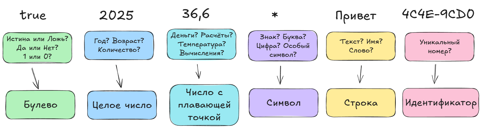

---
title: Типы данных в вычислительных системах
tags: [beginner, advanced, notrequired, analytic, developer, architector]
description: Одна из важнейших статей. Здесь подробно разбираются принципы типизации данных в вычислительных системах.
---

# Типы данных в вычислительных системах

<div class="article-tags">
  <span class="tag tag-required">ОБЯЗАТЕЛЬНО</span>
  <span class="tag tag-beginner">ДЛЯ НОВИЧКОВ</span>
  <span class="tag tag-advanced">НЕ ДЛЯ НОВИЧКОВ</span>
  <span class="tag tag-inprogress">В РАЗРАБОТКЕ</span>
</div>
<span class="complexity-badge">Разработчику</span>
<span class="complexity-badge">Аналитику</span>
<span class="complexity-badge">Архитектору</span>

## Типы данных

Есть типы данных в целом, и есть типы данных в программировании. Нас интересуют именно последние.

Тип данных отражает фундаментальные ограничения аппаратного уровня: размеры регистров, архитектуру памяти, представление чисел и символов. Выбор типа влияет на объём занимаемой памяти, производительность операций, точность вычислений и безопасность данных.

В высокоуровневых языках (Python, JavaScript, PHP) типы чаще всего служат логической категоризацией данных, а их физическое представление скрыто от программиста. Например, в Python целое число может занимать сколько угодно памяти — система автоматически расширяет его при необходимости, независимо от разрядности процессора.

Самое главное именно влияние на размер области памяти. Представим, что мы хотим выделить память под хранение номера ИНН - это несколько цифр, к примеру, 10-12, и для экономии ресурсов, мы выделим область размером, позволяющим оптимально хранить это значение. А если говорить об описании фильма? Это ведь большой набор текста, может достигать как 100, так и 10000 символов - поэтому нам нужен немного больший диапазон.

А что если нам понадобится выполнять вычисления? К примеру, баланс на банковском счёте должен позволять прибавлять и убавлять числа, но если кто-то напишет вместо числа описание фильма - выйдет ошибка, ведь прибавить текст и число не получится. И как хранить информацию о том, активен счёт или нет? Здесь ведь один всего символ - либо 1 либо 0, совсем минимальный. И как не перепутать счета, сделав каждую запись в базе данных индивидуальной?
Именно для решения всех этих вопросов и изобретено разделение данных на типы.

**Целочисленные типы** предназначены для хранения целых чисел — положительных, отрицательных и нуля. Они не содержат дробной части и представлены в двоичной форме с фиксированной разрядностью. Реализуются как знаковые (signed) и беззнаковые (unsigned) разновидности, а размер зависит от архитектуры (32/64 бита) и спецификации языка (например, int8, int16, int32, int64). Соответственно, и операции с ними в основном связаны с вычислениями - сложение, вычитание, умножение, деление нацело, взятие остатка, побитовые операции (AND, OR, XOR, сдвиги).

**Вещественные (или числа с плавающей запятой)** представляют действительные числа, включая дробные значения. Основаны на стандарте IEEE 754. Операции здесь арифметические, тригонометрические, логарифмические, степенные, и к примеру округление. Применяют их в физических величинах, финансовых расчётах, научных и инженерных вычислениях.

**Бинарные типы** предназначены для хранения данных в виде последовательности байтов, без интерпретации их содержимого как текста или чисел. Обычно они обозначаются как byte[], binary, blob (Binary Large Object). Не имеют внутренней структуры — интерпретируются только внешним контекстом, часто используются для сериализации, передачи файлов, шифрования и могут быть произвольной длины. Именно так хранятся изображения, аудио, видео, передаются данные по сети.

То есть, вы видите изображение, а хранится оно в виде бинарного типа данных.

**Логический тип (булево значение)** принимает ровно два значения: true (истина) и false (ложь). Является основой условной логики и управления потоком выполнения. Он занимает минимальный объём памяти (часто 1 байт, хотя теоретически достаточно 1 бита), не поддерживает арифметические операции напрямую. Чтобы работать с таким типом, нужно лишь сравнивать (И, ИЛИ, отрицание, исключающее ИЛИ).

**Символьный тип** отличается тем, что представляет один символ в рамках определённой кодировки (чаще всего UTF-8, UTF-16 или ASCII). Он используется при работе с текстом на уровне отдельных символов.

**Строка** — это упорядоченная последовательность символов, интерпретируемая как единое текстовое значение. Для нас, как обычных людей - это текст. Но в программировании это «текстом» как таковым не называют, используют именно термин «string». Реализуется как массив символов или ссылка на объект (в зависимости от языка), поддерживает операции конкатенации, поиска, замены, разделения. Длина строки может быть переменной (динамическая память) или фиксированной.

**Типы даты и времени (Date and Time)** позволяют работать с календарными датами, временными метками и интервалами. Обычно они отдельные - date для даты (год, месяц, день), time для времени (часы, минуты, секунды), datetime / timestamp - комбинация времени и даты. Хранятся как абсолютное время (например, Unix timestamp — количество секунд с 01.01.1970) или составная структура, поддерживают часовые пояса, летнее время, локализацию. Соответственно, операции только сравнение, прибавление/вычитание интервалов, форматирование.

Можно отметить также **перечисление (enumeration, enum)** - тип, определяющий ограниченный набор именованных значений. Каждое значение имеет имя и, как правило, связано с целочисленным кодом, обеспечивая семантическую ясность и защиту от невалидных значений. К примеру, это может быть статус:

```
enum Status { PENDING, RUNNING, COMPLETED }
Status state = RUNNING;
```

**Набор** — это коллекционный тип, хранящий уникальные элементы без упорядочивания. В таком наборе элементы не повторяются, поддерживаются математические операции вроде объединения, пересечения, разности, включения.

**Идентификатор** — это значение, однозначно определяющее объект в системе. Не является самостоятельной категорией типов, но реализуется через уже известные типы (целые, строки, UUID).

Выбор типов данных зависит от модели **типизации** языка программирования. В каждом языке своя система типизации. Бывает две модели:

**Статическая типизация** подразумевает, что тип переменной определяется на этапе компиляции и не может меняться. Обеспечивает раннее выявление ошибок, высокую производительность. Такое в C++, Java, Rust, Go.

**Динамическая типизация** чуть проще, и тип там связывается со значением, а не с переменной. Проверка типов происходит во время выполнения. Примеры: Python, JavaScript, Ruby.

Смысл в том, что все данные делятся на типы (чтобы рационально распределять память), но вот обязанность указания типа лежит либо на программисте (статическая), либо язык сам определяет тип на основе значения (динамическая).

К примеру, если я буду писать на Java, я должен сразу указать системе «забронируй мне пожалуйста, контейнер для строки, я запишу туда значение».

А на Python лишь напишу значение, допустим «123», и инструменты языка автоматически определят, что это число, «снимая» с меня ответственность за выбор типа.

Но давайте теперь разбираться по порядку.

Представим важнейшие типы схематично и таблично.

Схема:


Таблица:
|Тип данных|Обозначение|Значение|
|----------|-----------|-----------|
|Логический тип, или Булево значение	bool| booleanBOOL| Принимает два состояния: истина (true); ложь (false). Закрывать в кавычки не нужно.|
|Целое число| int, integer| Числа (неважно, положительные или отрицательные), допустим -5 или 128. Закрывать в кавычки не всегда обязательно. |
|Число с плавающей запятой|float, double |Число с запятой вроде 3,14. Закрывать в кавычки не всегда обязательно.|
|Символ| char |Один символ в определенной кодироке. "A". Как правило, нужно закрывать в кавычки.
|Строка|	string	|Произвольная последовательность символов: "Кошка", "Произвольная последовательность символов – 123, да, это всё - строка". Как правило, нужно закрывать в кавычки.|
|Идентификатор| id, guid, ID, GUID |Обозначающий «номер» объекта, и использующийся для придания ему уникальности. Это может быть целое число или даже набор символов. ID, как правило, целое число; GUID – глобальный уникальный идентификатор – строка из набора символов по формату: «XXXXXXXX-XXXX-XXXX-XXXX-XXXXXXXXXXXX», пример: `{2835A7AF-5204-4C4E-9CD0-B7D393AE11A3}`|

Теперь же погрузимся в самые важные типы - числа, булево, строки и идентификаторы.

---

## Числа

Важно понимать, что числа вроде 1, 2, 3 или 3,14 - это именно что особые типы данных, с которыми можно выполнять арифметические, к примеру, операции. 

Целое число (integer) — это число без дробной части. Оно может быть положительным, отрицательным и даже нулём. Используется в счётчиках, индексах массивов, возрасте, количестве, идентификаторах. Их можно слагать, вычитать, умножать, делить, вычислять остаток и возводить в степень.

Дробные числа (float, double) это числа с плавающей точкой (floating point number) — это число, которое может содержать дробную часть. Например, число Пи (3,14), -0,05 ил и 100,0. Используется для измерения более точных значений, к примеру, вес, рост, температура, финансовые расчёты, научные вычисления. Операции те же, что и у целых чисел, но также округление, извлечение корня, логарифмы, тригонометрия и т.д.

---

## Булево значение (логический тип)

Булевы значения (bool) это логический тип данных, который принимает всего два значения - истина (True) и ложь (False). Используется в условиях (если истина), проверках, циклах. Операции здесь совсем другие:
	- Логическое И: and
	- Логическое ИЛИ: or
	- Отрицание: not
	
---

## Строки и текст

Строки (string) представляют собой последовательность символов, используемая для хранения текста. Используется для имён пользователей, каких-то описаний, сообщений, ошибок, а также в HTML, JSON, URL. Как можно понять, их сложно сложить или разделить, это бред. Поэтому здесь особые операции:
	- Конкатенация: "Привет" + ", мир!"
	- Длина строки: len(text)
	- Поиск подстроки: text.find("мир")
	- Замена: text.replace("мир", "программа")
	- Разделение: text.split()
	
Таким образом, каждый язык программирования следит за тем, чтобы переменная соответствовала своему типу. Но указанные типы данных ведь разные структурно, и для некоторых результатов их нужно приводить к какому-то единому значению. Это называется преобразованием типов.

Преобразование типов может быть явным (когда программист делает сам), и неявное (автоматическое). Неявное преобразование может вызвать неожиданное поведение, особенно в JavaScript.

Пример - когда нужно целое преобразовать в вещественное, или текст в число.

Поэтому важно знать, как работать с данными, но мы всё это обязательно изучим.

---

## Идентификаторы

Числа, символы, строки, булево значения - все эти типы данных мы ещё неоднократно повторим. Но с идентификаторами следует разобраться заранее.

Сам по себе уникальный идентификатор подразумевает некое специальное имя или номер объекта, что позволяет обращаться к такому объекту без беспокойства «промаха» (совпадение идентификаторов вызывает коллизию) - ибо у каждого объекта он уникален. Обычно их называют ID.

ID (Identifier) — это общий термин для идентификатора, который используется для уникальной идентификации объектов, сущностей или процессов в системе.

GUID (Globally Unique Identifier) — это 128-битный уникальный идентификатор, который гарантирует уникальность даже в распределенных системах. GUID также известен как UUID (Universally Unique Identifier). Его можно генерировать на основании времени, MAC-адреса, случайных чисел. Вероятность коллизии крайне мала. 

Пример:

`123e4567-e89b-12d3-a456-426614174000`

	- PID (Process ID) — это уникальный числовой идентификатор, присваиваемый операционной системой каждому запущенному процессу. PID уникален только на уровне одной операционной системы.
	- UID (User ID) — это числовой идентификатор, используемый операционной системой для идентификации пользователей. UID уникален только на уровне одной системы. UID = 0 обычно зарезервирован для администратора (root).
	- GID (Group ID) — это числовой идентификатор, используемый для идентификации групп пользователей в операционной системе. GID используется для управления доступом к файлам и ресурсам группами - пользователи могут входить в несколько групп.
	- SID (Безопасность Identifier) — это уникальный идентификатор, используемый в Windows для идентификации пользователей, групп и других объектов безопасности. Пример:

`S-1-5-21-1234567890-1234567890-1234567890-1000`

	- TID (Thread ID) — это уникальный идентификатор потока (thread) внутри процесса. TID уникален только в рамках одного процесса.
	- JID (Job ID) — это идентификатор задания (job) в системах пакетной обработки или планировщиках задач.
	- DID (Device ID) — это уникальный идентификатор устройства, используемый для идентификации оборудования.
	- OID (Object ID) — это идентификатор, используемый в базах данных (например, MongoDB) для уникальной идентификации документов. Обычно это 12-байтный идентификатор, включающий временные метки и случайные данные.
Session ID — это идентификатор сессии, используемый для отслеживания состояния пользователя в веб-приложениях.
	- ETag (Entity Tag) — это идентификатор, используемый в HTTP для проверки изменений ресурса.


---

# Погрузимся ещё сильнее?

## Концептуальные основы и классификация

В информатике **тип данных** — это формальная характеристика множества допустимых значений и операций, которые могут быть над ними выполнены. Тип задаёт **форму** данных и их **семантику**: что означает данное значение в контексте задачи, какие операции с ним осмысленны, и как его следует интерпретировать аппаратно или логически.

Существует принципиальное различие между **типами данных в математике** и **типами данных в программировании**. Математическое множество, например, целых чисел ℤ, бесконечно и определяется исключительно структурными свойствами (замкнутость относительно операций, аксиоматика). В программировании же множество значений любого типа **конечно и дискретно**, поскольку оно ограничено физическими параметрами вычислительной системы: размером регистра процессора, разрядностью адресного пространства, способом кодирования информации в памяти.

Это следствие **аппаратной реализации**. Язык лишь предоставляет удобную абстракцию, скрывающую детали представления, однако эти детали неизбежно проявляются в виде побочных эффектов: переполнения, потери точности, неопределённого поведения при некорректной интерпретации битовых последовательностей.

Тип данных определяет три ключевых аспекта:

1. **Объём памяти**, необходимый для хранения значения.  
2. **Способ интерпретации** содержимого этой памяти — как битовой последовательности.  
3. **Набор допустимых операций**, сохраняющих корректность интерпретации.

В языках с абстрактными типами данных (АТД) или алгебраическими типами (Haskell, Rust, TypeScript) тип определяет поведение и контракт, а не обязательно размер. Например, `Option<T>` в Rust — это не просто «байты», а гарантия отсутствия null.

Например, 32-битное целое число и 32-битное число с плавающей точкой занимают одинаковый объём памяти, но их представление в соответствии со стандартом IEEE 754 (для float) или дополнительным кодом (для int) принципиально различно. Попытка интерпретировать биты целого числа как float (и наоборот) без явного преобразования приведёт к семантической ошибке — даже если технически процессор выполнит операцию, результат будет бессмысленным.

Таким образом, тип данных — это **контракт между программистом и системой**: он гарантирует, что при соблюдении условий контракта (корректное присваивание, вызов разрешённых операций) данные будут интерпретироваться согласованно на всех уровнях — от регистров процессора до бизнес-логики приложения.

В зависимости от структуры и семантики, типы данных принято классифицировать на следующие категории:

- **Скалярные (простые)** — значения, не имеющие внутренней структуры, атомарны по отношению к операциям языка. К ним относятся: логический, целочисленный, вещественный, символьный, временной, идентификаторный.
- **Композитные (сложные, структурированные)** — составлены из нескольких значений (скалярных или других композитных). Примеры: массив, запись (struct), кортеж, множество, перечисление, указатель/ссылка.
- **Абстрактные типы данных (АТД)** — определяются набором операций и инвариантов (например, стек, очередь, граф). Их реализация может использовать скалярные или композитные типы, но внешнее поведение скрыто за интерфейсом.

Ниже мы подробно рассмотрим основные скалярные типы, поскольку именно они образуют базис для всех остальных конструкций.

---

### Логический тип (булев)

Логический тип — единственный тип, чья семантика напрямую отражает основания классической логики. Его значение принадлежит двухэлементному множеству `{false}`,`{true}`, что соответствует булевой алгебре с операциями конъюнкции (И), дизъюнкции (ИЛИ), отрицания (НЕ), импликации и т.п.

Особенности:

- **Минимальный физический размер**. Теоретически достаточно одного бита, поскольку всего два состояния. На практике большинство архитектур выравнивают данные до байта (8 бит) по соображениям эффективного доступа к памяти, поэтому `bool` часто занимает 1 байт. Однако в массивах логических значений возможна упаковка (bit-packing), когда 8 значений помещаются в один байт.
- **Отсутствие арифметической интерпретации по умолчанию**. Хотя в некоторых языках (например, C) `false` интерпретируется как 0, а `true` как 1, это не универсальное правило и нарушает принцип строгой типизации. Корректный стиль требует избегать арифметики над `bool`; вместо `a + b` следует использовать `a && b`, `a || b`, `!a`.
- **Роль в управлении потоком выполнения**. Логический тип — основа условных операторов (`if`, `while`, `for` с условием). Выражение, используемое в качестве условия, должно быть приводимо к логическому типу. В языках со строгой типизацией это требует явного сравнения; в языках с неявными преобразованиями (например, Python) ненулевые числа, непустые строки и коллекции приводятся к `true`, а ноль, пустая строка и `None` — к `false`. Это удобно, но потенциально опасно: легко допустить ошибку, приняв `0` за «ложный» результат расчёта, тогда как он может быть валидным значением.

Логический тип несёт **предикативную нагрузку**: он отвечает на вопрос «выполняется ли условие?», а не «чему равно значение?». Эта дихотомия лежит в основе всех алгоритмических конструкций.

---

### Целочисленные типы

Целочисленные типы моделируют подмножество кольца целых чисел `ℤ`. Однако в отличие от математического аналога, они **ограничены по модулю** и реализуются с использованием **фиксированного числа битов**.

- Есть определённый диапазон **беззнакового** (`unsigned`) целого.
- Есть определённый диапазон **знакового** (`signed`) целого, представленного в **дополнительном коде** (two’s complement — стандарт de facto для современных процессоров).

Примеры:

| Тип         | Битов | Беззнаковый диапазон     | Знаковый диапазон               |
|-------------|-------|--------------------------|---------------------------------|
| `uint8`     | 8     | 0 … 255                  | –                               |
| `int8`      | 8     | –                        | –128 … 127                      |
| `uint16`    | 16    | 0 … 65 535               | –                               |
| `int32`     | 32    | –                        | –2 147 483 648 … 2 147 483 647  |
| `int64`     | 64    | –                        | ≈ ±9,2 × 10¹⁸                   |

**Почему дополнительный код?**  
Он позволяет использовать один и тот же набор операций сложения и вычитания как для знаковых, так и для беззнаковых чисел на уровне АЛУ, без дополнительной логики. Бит переполнения (`overflow flag`) сигнализирует о выходе за границы диапазона, но — критически важно — **не вызывает исключения по умолчанию**. Это сделано ради производительности: проверка переполнения в каждом арифметическом действии замедлила бы вычисления. Следовательно, переполнение — это **неопределённое поведение** (undefined behavior) в языках вроде C/C++, что означает: программа может продолжить работу с некорректным значением, аварийно завершиться или дать любой другой результат — стандарт не гарантирует ничего.

Операции над целыми:

- Арифметические: сложение (`+`), вычитание (`–`), умножение (`*`), деление нацело (`/` или `div`), остаток от деления (`%` или `mod`).  
- Побитовые: AND (`&`), OR (`|`), XOR (`^`), NOT (`~`), сдвиги влево (`<<`) и вправо (`>>`).  
  Сдвиги особенно важны: левый сдвиг на `k` разрядов эквивалентен умножению на `2^k`, правый — делению на `2^k` (с округлением вниз для беззнаковых).  
- Сравнения: `<`, `>`, `<=`, `>=`, `==`, `!=`.

Применение: счётчики циклов, индексы массивов, статус-коды, идентификаторы (если уникальность обеспечена внешним механизмом), флаги (через побитовые маски). Например, набор флагов `READ | WRITE | EXECUTE` может храниться в одном `uint8`.

---

### Вещественные (числа с плавающей точкой)

Числа с плавающей точкой призваны аппроксимировать действительные числа ℝ — из конечного подмножества, задаваемого **экспоненциальной записью**.

Стандарт **IEEE 754** (Institute of Electrical and Electronics Engineers) определяет форматы представления:

| Формат        | Бит всего | Знак | Порядок | Мантисса | Пример использования            |
|---------------|-----------|------|---------|----------|---------------------------------|
| `binary16`    | 16        | 1    | 5       | 10       | машинное обучение (низкая точность) |
| `binary32` (single) | 32    | 1    | 8       | 23       | `float` в C/Java/JS             |
| `binary64` (double) | 64    | 1    | 11      | 52       | `double` — стандарт для расчётов |
| `binary128`   | 128       | 1    | 15      | 112      | высокоточные вычисления         |

Для `binary64` (наиболее распространённого):

- Диапазон нормализованных чисел: ≈ ±2,2 × 10⁻³⁰⁸ … ±1,8 × 10³⁰⁸  
- Точность: ≈ 15–17 десятичных цифр  
- Особые значения:  
  - `+0` и `–0` (различимы, но сравнение `+0 == –0` даёт `true`)  
  - `+∞`, `–∞` (результат деления на ноль или переполнения)  
  - `NaN` (Not a Number) — результат неопределённых операций (`0/0`, `∞ – ∞`, `sqrt(-1)` и др.). Любое сравнение с `NaN` возвращает `false`, включая `NaN == NaN`.

**Проблемы и ограничения:**

- **Невозможность точного представления** большинства десятичных дробей. Например, `0.1` в двоичной системе — бесконечная периодическая дробь. При усечении до 52 бит мантиссы происходит округление, что приводит к погрешности. Сумма `0.1 + 0.2` в двойной точности даёт `0.30000000000000004`, а не `0.3`.

- **Потеря точности при вычитании близких чисел** (catastrophic cancellation), может иметь гораздо меньшее количество значащих цифр, чем исходные числа.

- **Несоблюдение ассоциативности** в общем случае, из-за последовательного округления.

Поэтому **финансовые расчёты** (где критична точность до копейки) не должны использовать `float` или `double`. Вместо этого применяют:
- **Фиксированная точность** (например, хранение суммы в копейках как `int64`),  
- **Десятичные типы** (`decimal`, `BigDecimal`), реализующие арифметику с основанием 10 и управляемой точностью.

---

### Символьный тип и кодировки

Символьный тип (`char`, `character`) предназначен для представления **одного элемента письменности** — буквы, цифры, знака препинания, управляющего символа или символа-модификатора (например, диакритического знака, эмодзи-составного элемента). Ключевой момент: символ — это **абстрактная единица в системе письма**, и её кодирование требует стандартизации.

Исторически первым был **ASCII** (American Standard Code for Information Interchange, 1963 г.) — 7-битный код, определяющий 128 символов: латинские буквы (A–Z, a–z), цифры (0–9), базовые знаки препинания и управляющие коды (например, `BEL`, `CR`, `LF`). ASCII достаточен для английского языка, но неприменим к другим письменностям.

С появлением потребности в международной поддержке возникли **локализованные 8-битные кодировки** (ISO-8859-1 — Latin-1, Windows-1251 — кириллица и др.). Каждая из них расширяла ASCII до 256 значений, заменяя верхнюю половину таблицы на символы конкретной письменности. Проблема: текст, закодированный в одной кодировке, интерпретируемый как другая, превращался в «кракозябры» (например, кириллический «Привет» в CP1251, прочитанный как Latin-1, давал `Привет`).

Решением стал **Unicode** — международный стандарт, призванный охватить **все существующие и исторические письменности**. Unicode задаёт **абстрактное пространство кодовых точек (code points)** — целочисленные идентификаторы, обозначаемые как `U+XXXX`, где `XXXX` — шестнадцатеричное число (например, `U+0041` — латинская A, `U+041F` — кириллическая П, `U+1F600` — эмодзи 😄).

Текущая версия Unicode (15.1, 2024 г.) охватывает свыше 150 000 кодовых точек, разбитых на *планы* (planes), из которых наиболее важен **Базовая многоязычная плоскость (BMP, Plane 0)** — `U+0000` … `U+FFFF`.

Для *хранения* кодовых точек используются **кодировки Unicode** — конкретные схемы отображения `code point → последовательность байтов`:

| Кодировка | Описание | Особенности |
|-----------|----------|-------------|
| **UTF-32** | Фиксированная длина: 4 байта на символ (32 бита). | Простейшая интерпретация: значение `code point` = содержимое 32-битного слова. Максимально расточительно по памяти, но обеспечивает O(1)-доступ к *n*-му символу. Используется редко — в основном во внутренних структурах некоторых API (например, ICU). |
| **UTF-16** | Переменная длина: 2 байта (`U+0000`–`U+D7FF`, `U+E000`–`U+FFFF`) или 4 байта (суррогатные пары для `U+10000`–`U+10FFFF`). | Доминирует в Windows API, Java (до JDK 9), JavaScript (внутренне). Уязвима к *проблеме суррогатов*: при неправильной обработке (например, усечении строки посреди суррогатной пары) возникает неопределённое поведение. |
| **UTF-8** | Переменная длина: 1–4 байта. Абсолютно совместима с ASCII: кодовые точки `U+0000`–`U+007F` кодируются одним байтом, совпадающим с ASCII. | Стандарт де-факто для интернета (HTML, JSON, XML, HTTP), Unix-систем, современных языков (Rust, Go, Python 3). Эффективна по памяти для латиницы, компактна для кириллицы/иероглифов (3 байта), устойчива к повреждениям: синхронизация возможна с любого байта. |

> **Важно**: символ `≠` байт `≠` графема.  
> - `«ё»` в UTF-8 — 2 байта (`0xD1 0x91`),  
> - эмодзи `«👨‍💻»` (человек за компьютером) — последовательность из 4 кодовых точек (`U+1F468`, `U+200D`, `U+1F4BB`), интерпретируемая как одна *графема* (визуальная единица),  
> - в языке с сложной морфологией (арабский, деванагари) одна графема может складываться из нескольких кодовых точек (базовый символ + диакритики).

Символьный тип в языке программирования — это, по сути, **ограниченная проекция Unicode**: например, в Java `char` — это 16-битное значение, соответствующее *кодовой единице UTF-16* (не обязательно полному символу); в Rust `char` — 32-битная кодовая точка (гарантированно один Unicode scalar value); в Python 3 строка — последовательность кодовых точек, а не байтов.

---

### Строковый тип

Строка (`string`) — это **упорядоченная конечная последовательность символов**, рассматривающаяся как единое логическое значение. Хотя на аппаратном уровне строка реализуется как массив байтов, её семантика выходит далеко за рамки простой контейнеризации:

1. **Иммутабельность (неизменяемость)** — в большинстве современных языков (`Java`, `Python`, `C#`, `Rust`) строка после создания не может быть изменена. Операции вроде `replace()` или `concat()` возвращают *новую* строку. Это обеспечивает:
   - **Безопасность потоков** (thread-safety): нет гонок при чтении,
   - **Кэшируемость хеш-кода** (строка часто используется как ключ в хеш-таблице),
   - **Оптимизацию через интернирование** (interning): одинаковые строки могут ссылаться на один объект в памяти.

2. **Динамическая длина** — в отличие от фиксированного массива, строка обычно растягивается по мере необходимости. Внутренне это реализуется через:
   - **Стратегию удвоения буфера** (при конкатенации или добавлении),
   - **Copy-on-write** (устаревшая, из-за проблем с многопоточностью),
   - **Rope-структуры** (для очень длинных строк — бинарное дерево подстрок, эффективное при вставке/удалении).

3. **Локализация и нормализация** — сравнение строк может быть:
   - побайтовым (`memcmp`),  
   - по кодовым точкам (`code point order`),  
   - с учётом локали (`collation`): например, в немецком `«ä»` может сортироваться как `«ae»`, а в турецком — отдельно от латинской `«a»`.

Операции над строками делятся на уровни абстракции:

| Уровень | Примеры |
|---------|---------|
| **Физический** | доступ к *i*-му байту/кодовой единице, измерение длины в байтах |
| **Логический (Unicode)** | доступ к *i*-му символу (code point), длина в символах, итерация по графемам |
| **Лингвистический** | приведение к верхнему/нижнему регистру (`toUpper()`), нормализация (`NFC`, `NFD`), сравнение с учётом локали (`collate("straße", "strasse") = 0` в немецкой локали) |

Пример несоответствия уровней: строка `"café"` в UTF-8:
- Байтовая длина: 5 байт (`63 61 66 C3 A9`),
- Длина в кодовых точках: 4 (`U+0063`, `U+0061`, `U+0066`, `U+00E9`),
- Длина в графемах: 4 (одно `é` — одна графема),
- Но если записать `é` как `e + ◌́` (`U+0065` + `U+0301`), то:
  - кодовых точек: 5,
  - графем: по-прежнему 4.

Отсюда важный вывод: **никогда не используйте байтовую длину для обрезки «середины» строки** — это почти наверняка нарушит UTF-8-последовательность и породит ``.

---

### Типы даты и времени

Работа со временем — одна из самых сложных и подверженных ошибкам областей. Проблема в **календарных и политических артефактах**: смена часовых поясов, летнее время, високосные секунды, исторические реформы (переход с юлианского на григорианский календарь).

Поэтому типы даты и времени строятся на нескольких взаимосвязанных понятиях:

#### 1. **Момент времени (instant)**  

Абсолютная точка на временной оси, не зависящая от календаря или часового пояса.  
Реализации:
- **Unix timestamp** — целое число секунд (или милли-/микро-/наносекунд), прошедших с **UTC 1970-01-01T00:00:00Z** («эпоха Unix»). Отрицательные значения — до эпохи.  
  - Диапазон `int32`: до 2038-01-19 (проблема 2038 года),  
  - `int64`: ~±292 миллиарда лет — достаточно для любых практических целей.  
- **TAI (International Atomic Time)** — физическое время, основанное на атомных часах, без високосных секунд. UTC = TAI − (текущее смещение, включая високосные секунды).

#### 2. **Календарная дата и время (local date-time)** 
 
Сочетание года, месяца, дня, часа, минуты, секунды — *без указания часового пояса*. Пример: `2025-11-07 14:30:00`.  
Такое значение **неоднозначно** как момент времени: `14:30` в Москве и `14:30` в Лондоне — разные instant’ы. Используется для:
- Планирования («встреча 10 ноября в 10:00 по местному времени»),
- Отображения (форматирование для пользователя),
- Хранения в базах, где временная зона фиксирована (например, «все даты — по UTC»).

#### 3. **Зона времени (time zone)** 
 
Смещение от UTC (например, `+03:00`) - **правило**, включающее:
- Базовое смещение (standard offset),
- Периоды действия летнего времени (DST),
- Исторические изменения (например, РФ отменила DST в 2014 г.).

Стандарт **IANA Time Zone Database** (tzdata) содержит правила для всех зон мира (например, `Europe/Moscow`, `America/New_York`). Смещение `+03:00` — это *результат* применения правила на конкретный момент; само правило может меняться.

#### 4. **Интервалы и продолжительности** 
 
- **Duration** — фиксированная продолжительность («3 часа 15 минут»), независимая от календаря.  
- **Period** — календарный интервал («1 месяц»), который при прибавлении к дате учитывает переменную длину месяцев (`2025-01-31 + 1 month = 2025-02-28`).

> **Практические рекомендации**:  
> - Храните моменты времени в UTC (timestamp),  
> - Храните часовой пояс отдельно (например, `tz = "Europe/Moscow"`),  
> - Преобразуйте в локальное время *только при отображении*,  
> - Избегайте арифметики с `local date-time` без учёта зоны.

---

### Идентификаторы

Идентификатор — это **значение, предназначенное для однозначного различения сущностей в системе**.

Однако **уникальность** — относительное понятие: она может быть:
- **Локальной** (в пределах базы данных, процесса, сессии),
- **Глобальной** (в пределах распределённой системы, интернета).

Поэтому идентификаторы классифицируются по **механизму генерации** и **области действия**.

#### Классификация по области действия

| Тип | Описание | Примеры | Уникальность |
|-----|----------|---------|--------------|
| **Локальный числовой ID** | Автоинкрементные целые (`SERIAL`, `IDENTITY`). | `id: int` в реляционной БД | Только в рамках таблицы/БД |
| **UUID/GUID** | 128-битный идентификатор по RFC 4122. Версии:  • v1 — время + MAC-адрес (коллизии маловероятны, но MAC раскрывает узел), • v4 — криптостойкий случайный (наиболее распространён), • v5 — хеш от пространства имён + имени (детерминированный). | `f47ac10b-58cc-4372-a567-0e02b2c3d479` | Глобально |
| **Хеш-идентификатор** | Криптографический хеш (SHA-256) от содержимого или комбинации полей. | `git commit hash`, `IPFS CID` | Уникален, если хеш коллизионно-устойчив; может быть «содержательным» (content-addressable storage) |
| **Составной ключ** | Комбинация полей, гарантирующая уникальность. | `(user_id, order_id)` в таблице заказов | Глобально в рамках контекста |
| **Семантический идентификатор** | Имеет смысловое значение (не случайный). | `username`, `ISBN`, `DOI` | Не гарантирует уникальность без дополнительных ограничений (например, `UNIQUE` в БД) |

#### Архитектурные последствия выбора

- **Автоинкремент (int)**:  
  + Компактность (4–8 байт),  
  + Эффективность индексов (B-tree любит монотонные ключи),  
  – Раскрывает объёмы данных (последовательные ID → можно оценить количество записей),  
  – Проблемы при горизонтальном шардинге (требуется централизованный генератор).

- **UUID (v4)**:  
  + Генерация на клиенте без координации,  
  + Отсутствие утечки информации,  
  – Размер (16 байт),  
  – Фрагментация индексов (случайные значения → частые page split’ы в B-tree).

Современные СУБД предлагают компромисс: **UUIDv7** — монотонный UUID, включающий временной компонент в начало (как timestamp), остальное — случайность. Сохраняет глобальную уникальность и улучшает локальность индекса.

> **Важно**: идентификатор *не должен* нести бизнес-семантику (кроме специально спроектированных случаев, как ISBN). Если `id = 20251107001` означает «заказ от 07.11.2025, №001», то любое изменение формата нарушит обратную совместимость. Идентификатор — техническая деталь, а не интерфейс.

---

### Перечислимые типы (enumeration, enum)

Перечисление — это **тип, задающий конечное фиксированное множество именованных значений** (констант). Пример:
```text
enum ConnectionState { DISCONNECTED, CONNECTING, CONNECTED, FAILED }
```

Это не просто синонимы для целых чисел — ключевая цель enum — **семантическое обогащение**:

1. **Ограничение домена значений**: переменная типа `ConnectionState` не может принять значение `42`, даже если перечисление внутренне представлено как `int`. Компилятор/интерпретатор гарантирует, что допустимы только перечисленные константы.

2. **Самодокументируемость**: `state = ConnectionState.CONNECTED` читается лучше, чем `state = 2`.

3. **Поддержка анализа**: компилятор может проверить, что все ветви `switch`/`match` покрыты (exhaustiveness check), что исключает ошибки ветвления.

Разновидности реализации:

- **Простые enum** — набор именованных констант (C, Java до 1.5, TypeScript `enum`).
- **Обогащённые enum** — каждое значение может иметь поля и методы (Java `enum`, Rust `enum`, Swift `enum`). Например:
  ```rust
  enum Option<T> {
      Some(T),
      None,
  }
  ```
  Здесь `Some` не просто метка — это *конструктор*, несущий значение типа `T`.

- **Суммарные типы (sum types, tagged unions)** — обобщение enum, где каждая ветвь может иметь *разный* набор данных (Haskell `Данные`, F#, Rust). Это мощный инструмент моделирования: вместо `null` — `Option<T>`, вместо исключений — `Result<T, E>`.

---

### Композитные типы

Композитный тип объединяет несколько значений (полей) в единое целое. Основные разновидности:

| Тип | Характеристики | Применение |
|-----|----------------|------------|
| **Массив (array)** | Фиксированная длина, однородные элементы, индексация по целому. | Векторы, матрицы, буферы. |
| **Список (list)** / **Вектор (vector)** | Динамическая длина, однородные элементы, эффективное добавление в конец. | Коллекции объектов, история операций. |
| **Структура (struct, record)** | Фиксированный набор именованных полей (гетерогенных). | Моделирование сущностей: `User { id, name, email }`. |
| **Кортеж (tuple)** | Упорядоченная последовательность **гетерогенных** элементов фиксированной длины. Имена полей отсутствуют или опциональны. | Возврат нескольких значений из функции, временные агрегаты. |
| **Множество (set)** | Набор **уникальных** элементов, без порядка. Реализуется через хеш-таблицу или дерево. | Проверка принадлежности, операции вроде объединения/пересечения. |
| **Словарь (map, dict, hash)** | Отображение ключ → значение (ключ — уникальный, обычно скалярный или хешируемый). | Конфигурации, кэши, индексы. |
| **Указатель / ссылка** | Значение, кодирующее **адрес** другого объекта в памяти (или его отсутствие — `null`). | Построение графов, динамических структур (списки, деревья). |

Ключевой принцип: **композиция не нарушает типовую безопасность**. Тип `struct Point { x: float, y: float }` — это не «два float’а рядом», а новая сущность, для которой можно определить операции (`distanceTo()`, `rotate()`), инварианты (`x² + y² ≤ R²`) и преобразования.

---

