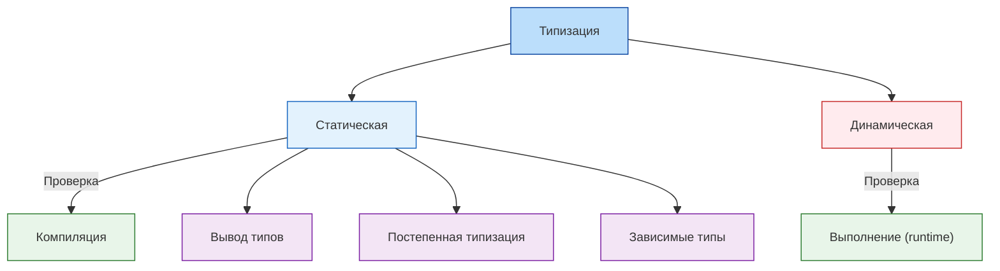
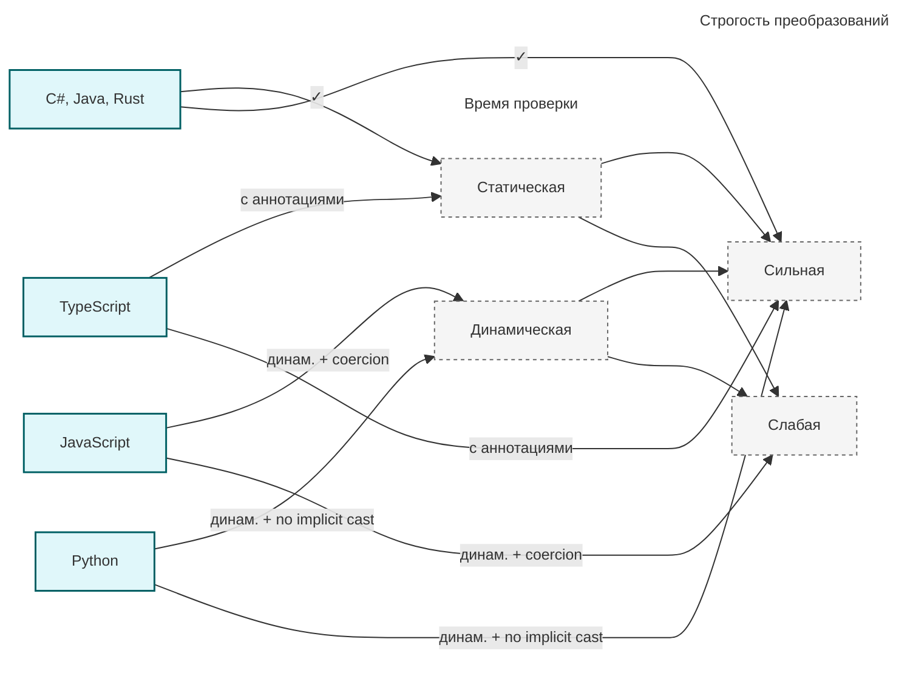
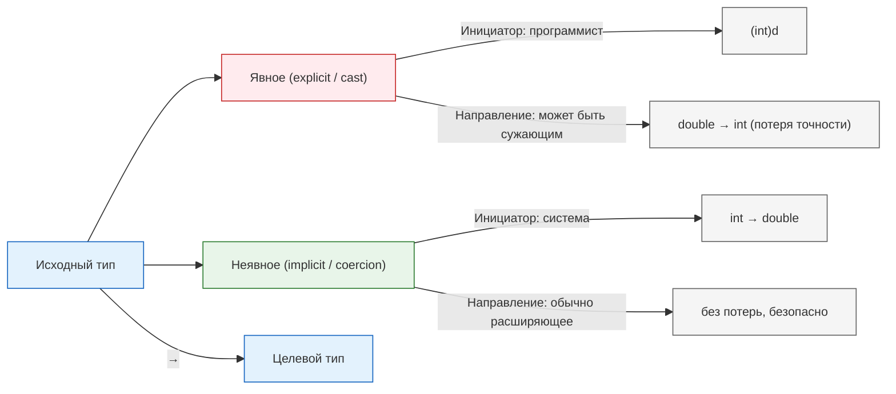
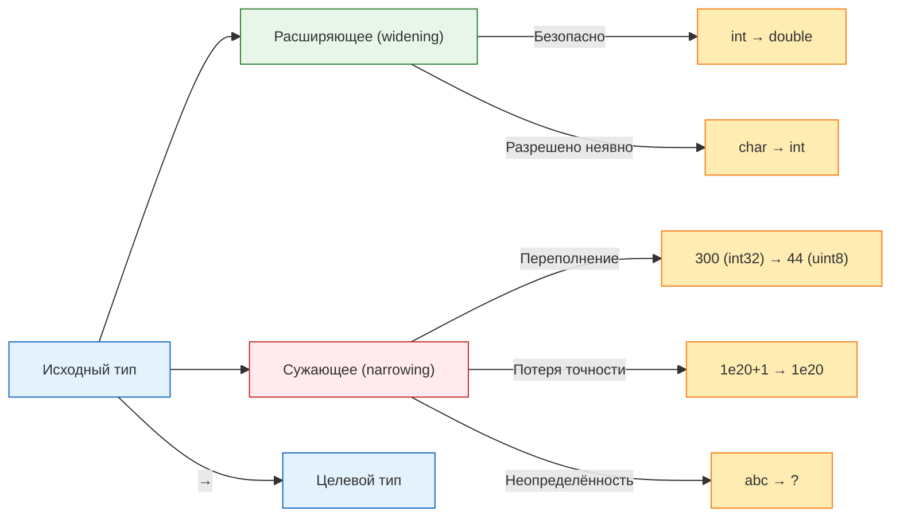
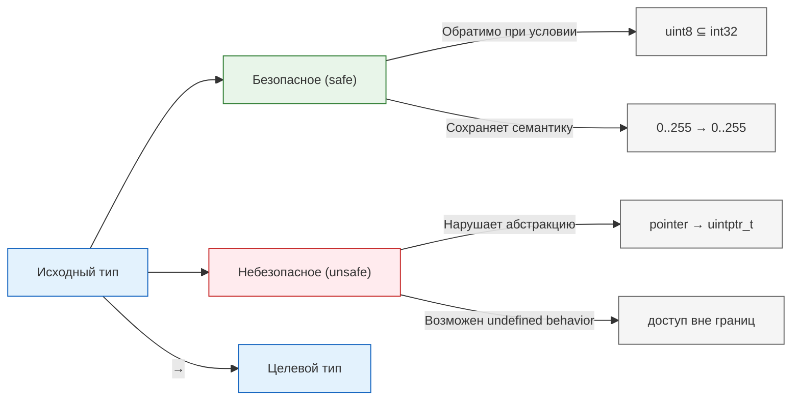
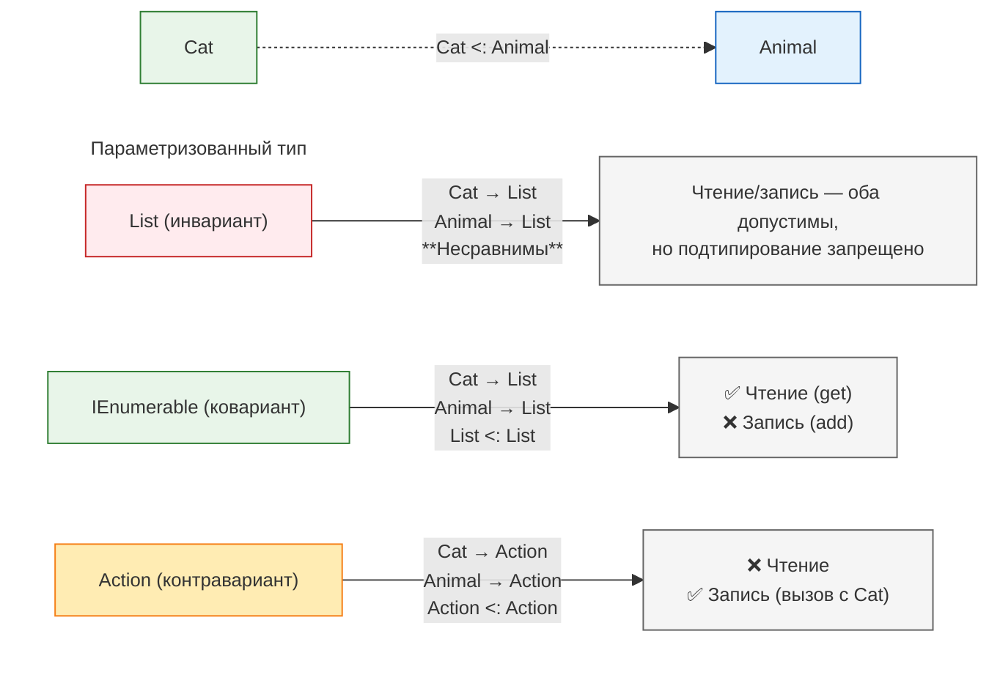

---
tags:
  - analytic
  - developer
  - architector
  - required
  - beginner
title: Типизация
description: >-
  Системы типизации в программировании: статическая и динамическая, преобразования,
  generics и смежные темы.
---

import TypingPlay from '@site/src/components/TypingPlay';

# Типизация

<div class="article-tags">
  <span class="tag tag-required">ОБЯЗАТЕЛЬНО</span>
  <span class="tag tag-beginner">ДЛЯ НОВИЧКОВ</span>
</div>

<span class="complexity-badge">Разработчику</span>
<span class="complexity-badge">Аналитику</span>
<span class="complexity-badge">Архитектору</span>

## Типизация

<div class="callout callout--tip">
  <div class="callout-title">Что читать в первую очередь</div>
  <strong>База:</strong> статическая vs динамическая типизация, сильная vs слабая, явные и неявные преобразования.<br />
  <strong>Продвинуто:</strong> boxing, generics, ковариантность, зависимые типы — по мере необходимости.<br />
  Скалярные типы (`int`, `string`) — в статье [Типы данных](./3).
</div>

### Архитектурные модели

Типизация — это система правил, определяющих, **когда и как проверяется соответствие значения его ожидаемому типу**.

Представим, что программа - это работяга, сидящий за столом. На этом столе мы располагаем книги, необходимые для работы. Книги раскладываем аккуратно, с учётом их объёма - для огромной многотомной эпопеи "Война и мир" нужно много места, тогда как для номера телефона смысла в отдельной книге нет, не так ли? Вот точно так же необходимо распределять и память в компьютере - нужно понимать, когда данных будет много, как в строке, или всего два значения, как в булевом (True/False). Типизация позволяет регулировать порядок определения размеров "бронируемых" блоков памяти.


<TypingPlay />

---

#### Статическая и динамическая

- **Статическая типизация**: проверка происходит **на этапе компиляции**. Тип переменной фиксирован и не может меняться в runtime. Основной смысл статической типизации в том, что мы чётко должны определять тип данных ещё на этапе написания кода.
  – *Преимущества*: раннее выявление ошибок, оптимизация (компилятор знает layout данных), документирование интерфейсов, поддержка IDE (автодополнение, рефакторинг).  
  – *Недостатки*: многословность, сложность при работе с гибкими структурами (например, JSON-данными неизвестной схемы).

- **Динамическая типизация**: проверка — **во время выполнения**. Переменная может ссылаться на значения разных типов в разные моменты. Это может быть проще, так как не нужно раздумывать о типах данных переменных.
  – *Преимущества*: гибкость, краткость кода, удобство для сценариев "быстрого прототипирования".  
  – *Недостатки*: ошибки обнаруживаются только при исполнении ("но вчера же работало!"), сложность рефакторинга в больших проектах, накладные расходы на проверку типов в runtime.

**Гибридные подходы**:  
- **Type inference** (вывод типов): программист не указывает тип явно, но компилятор выводит его статически (`let x = 42; // x: i32` в Rust).  
- **Gradual typing** (постепенная типизация): часть кода типизирована явно, часть — динамически (TypeScript, Python с `mypy`).  
- **Dependent types** (зависимые типы): тип может зависеть от *значения* (например, "массив длины *n*") — Idris, Agda, Coq.



---

#### Сильная и слабая

- **Сильная типизация**: преобразования между несовместимыми типами запрещены без явного каста. `int + string` — ошибка компиляции или исключение.  
- **Слабая типизация**: автоматические преобразования (coercion) выполняются неявно. В JavaScript: `"5" + 2 = "52"`, `"5" - 2 = 3`.



Здесь критично: **слабая ≠ динамическая**. Python — динамически, но *сильно* типизирован: `"5" + 2` вызовет `TypeError`. JavaScript — динамически и слабо типизирован.

---

## Преобразования типов

Преобразование типов (type conversion) — это процесс получения значения одного типа из значения другого. Его можно классифицировать по нескольким ортогональным признакам:

---

### 1. По способу инициации  

- **Явное (explicit, cast)** — программист прямо указывает необходимость преобразования:  
  ```java
  double d = 3.14;
  int n = (int) d;  // отбрасывание дробной части
  ```
- **Неявное (implicit, coercion)** — преобразование выполняется автоматически компилятором/интерпретатором при операции или присваивании:  
  ```c
  int a = 5;
  double b = a;  // int → double — расширение без потерь
  ```
  

  
---

### 2. По наличию потерь информации 
 
- **Расширяющее (widening)** — преобразование к типу с *большим* диапазоном или точностью:  
  `int8 → int32`, `int → double`, `char → int`. Обычно безопасно и разрешено неявно.  
- **Сужающее (narrowing)** — преобразование к типу с *меньшим* диапазоном или точностью:  
  `int32 → int8`, `double → int`, `string → int`. Потенциально опасно:  
  - **Переполнение**: `int32 = 300 → uint8 = 44` (300 mod 256),  
  - **Потеря точности**: `double = 1e20 + 1 → int64 = 100000000000000000000` (единица исчезает из-за недостаточной точности мантиссы),  
  - **Неопределённость**: `string = "abc" → int` — как интерпретировать?




---

### 3. По гарантиям корректности  

- **Безопасное (safe)** — если исходное значение лежит в подмножестве, представимом целевым типом, преобразование обратимо и сохраняет смысл. Пример: `uint8 → int32`.  
- **Небезопасное (unsafe)** — преобразование возможно всегда, но результат может быть семантически некорректным. Пример: `pointer → int` в C — нарушает абстракцию памяти и приводит к undefined behavior при неправильном использовании.



---

### Критические случаи и ловушки

#### a) Числовые преобразования

- **Целое ↔ вещественное**:  
  При преобразовании `double → int` стандарт *не определяет* поведение для значений вне диапазона `int` (в C/C++ это UB). В Java — `ArithmeticException` при `Math.toIntExact()`, или усечение при прямом касте (с потерей).  
  При `int → float` значения свыше `2^{24}` (для `float32`) перестают быть представимыми точно:  
  ```python
  float(16777216) == 16777216.0   # True
  float(16777217) == 16777216.0   # True — потеря единицы!
  ```

- **Беззнаковое ↔ знаковое**:  
  В языках без строгого различия (C) сравнение `uint32 = 0xFFFFFFFF` и `int32 = -1` даёт `true`. В Java — требуется явный каст:  
  ```java
  int i = -1;
  long l = i & 0xFFFFFFFFL; // 4294967295L
  ```

#### b) Строковые преобразования

- **Парсинг числа из строки**:  
  `"123"` → `123` — тривиально.  
  `"123.45"` → `int` — ошибка или усечение?  
  `" 123 "` — игнорировать пробелы или нет?  
  `"1.23e2"` — поддерживать экспоненциальную запись?  

  Отсутствие стандартизации ведёт к уязвимостям:  
  - `"010"` → `8` (восьмеричное в старых версиях JavaScript),  
  - локаль-зависимые разделители (`1,234.56` vs `1.234,56`).

- **Сериализация/десериализация**:  
  JSON-число `12345678901234567890` при чтении в JavaScript (где все числа — `double`) превращается в `12345678901234567000` — необратимая потеря точности.

#### c) Указатели и низкоуровневые преобразования

- **Pointer reinterpretation** (в C/C++):  
  ```c
  int x = 0x41424344;
  char* p = (char*)&x;
  printf("%c", *p); // 'D' на little-endian, 'A' на big-endian
  ```
  — нарушает strict aliasing rule и вызывает UB.  
- **Type punning через union** — разрешено в C, но не в C++.

> **Рекомендация проектирования**:  
> - Избегайте неявных сужающих преобразований,  
> - Всегда проверяйте диапазон при парсинге,  
> - Используйте строгие функции (`parseInt("123", 10)`, а не `+"123"` в JS).

---

## Упаковка и распаковка (boxing/unboxing)

В системах с **единым корневым типом** (например, `Object` в Java, `System.Object` в C#, `Any` в Swift/Kotlin), все значения — даже скаляры — могут быть представлены как объекты. Однако скаляры (int, bool) хранятся непосредственно в стеке или в полях структур, а объекты — в куче, со служебной информацией (vtable, sync word и пр.).

**Упаковка (boxing)** — преобразование значения скалярного типа в объектную обёртку:  
```java
int x = 42;
Object obj = x;  // компилятор вставляет: Integer.valueOf(x)
```

**Распаковка (unboxing)** — обратное преобразование:  
```java
Integer boxed = 42;
int y = boxed;   // компилятор вставляет: boxed.intValue()
```

---

### Архитектурные последствия

| Аспект | Упакованный тип | Непосредственное значение |
|--------|------------------|----------------------------|
| **Хранение** | Куча (динамическое выделение) | Стек / встроенные поля |
| **Размер** | `≥` 16 байт (на 64-битной JVM: заголовок 12 байт + 4 байта int + выравнивание) | 4 байта (`int`) |
| **Производительность** | Аллокация + сборка мусора | Нулевые накладные расходы |
| **Семантика** | Поддержка `null`, полиморфизм (`List<Object>`), рефлексия | Нет `null`, нет наследования |

---

### Проблемы

1. **Производительность**:  
   В цикле `for (int i = 0; i < 1_000_000; i++) list.add(i)` происходит 1 млн аллокаций объектов `Integer`, даже если JIT частично оптимизирует это через escape analysis.

2. **Null-безопасность**:  
   ```java
   Integer a = null;
   int b = a;  // NullPointerException при распаковке
   ```
   — ошибка времени выполнения, неуловимая статически.

3. **Сравнение через `==`**:  
   ```java
   Integer a = 127, b = 127;
   System.out.println(a == b); // true (кеширование [-128; 127])
   Integer c = 128, d = 128;
   System.out.println(c == d); // false (новые объекты)
   ```
   — источник многочисленных багов.

> **Современный тренд**:  
> - Введение *value types* (Project Valhalla в Java, `struct` в C#/Swift),  
> - Отказ от автоматического боксинга в новых языках (Rust, Go),  
> - Использование `Option<T>` вместо `null`.

---

## Параметрический полиморфизм (generics)

Параметрический полиморфизм — механизм описания *алгоритмов и структур данных*, независимых от конкретного типа элементов. Он обеспечивает **повторное использование кода без потери типовой безопасности**.

Сравним подходы:

| Подход | Пример | Проблемы |
|--------|--------|----------|
| **Без типов (void\*, Object)** | `void* array[10]` | Нет проверок: можно положить `int`, извлечь как `string` → катастрофа. |
| **Макроподстановка** | `#define MAKE_STACK(T) ...` в C | Дублирование кода, отсутствие ABI-совместимости, сложность отладки. |
| **Generics** | `List<T>`, `HashMap<K, V>` | Безопасность, эффективность (в Java — стирание типов; в C#/Rust — мономорфизация). |

---

### Ключевые концепции

#### a) Инвариантность, ковариантность, контравариантность

Пусть `Cat <: Animal` (кошка — подтип животного). Как связаны `List<Cat>` и `List<Animal>`?

- **Инвариантность** (`List<T>` в Java/C#):  
  `List<Cat>` и `List<Animal>` — несравнимы.  
  *Почему?* Потому что можно сделать:  
  ```java
  List<Animal> animals = cats;  // если бы разрешалось
  animals.add(new Dog());       // в список кошек добавлена собака!
  Cat c = cats.get(0);          // ClassCastException
  ```

- **Ковариантность** (`List<? extends Animal>` в Java, `IEnumerable<out T>` в C#):  
  Разрешает *только чтение*:  
  ```java
  List<? extends Animal> animals = cats; // OK
  Animal a = animals.get(0);              // OK
  animals.add(new Dog());                 // Запрещено компилятором
  ```

- **Контравариантность** (`Action<in T>`, `Comparator<? super T>`):  
  Разрешает *только запись*:  
  ```java
  Comparator<Animal> comp = (a1, a2) -> a1.weight - a2.weight;
  List<Cat> cats = ...;
  cats.sort(comp); // OK: компаратор для животных годится и для кошек
  ```



#### b) Ограничения типов (bounds)

- **Верхняя граница**: `T extends Comparable<T>` — гарантирует, что `T` реализует сравнение,  
- **Нижняя граница**: `T super File` — редко используется, но критична для producer-consumer паттернов (PECS: Producer `extends`, Consumer `super`).

#### c) Реификация

- **Стирание типов (type erasure)** (Java):  
  В runtime `List<String>` и `List<Integer>` — один и тот же класс `List`. Типы существуют только на этапе компиляции.  
  — Плюсы: обратная совместимость, компактный bytecode.  
  — Минусы: невозможность `new T()`, `instanceof List<String>`.

- **Мономорфизация (monomorphization)** (C++, Rust, C# для значимых типов):  
  Компилятор генерирует отдельный код для каждого конкретного типа:  
  ```rust
  fn max<T: Ord>(a: T, b: T) -> T { ... }

  max(1i32, 2i32);   // → специализированная версия для i32
  max("a", "b");     // → отдельная версия для &str
  ```
  — Плюсы: максимальная производительность, поддержка рефлексии.  
  — Минусы: раздувание кода (code bloat).

---

## Типы и формальная верификация

Типовые системы эволюционировали от простой проверки совместимости к инструменту **доказательства корректности программ**.

### Уровни строгости

| Уровень | Возможности | Примеры |
|---------|-------------|---------|
| **Номинальная типизация** | Проверка по именам типов (`class A` ≠ `class B`, даже с одинаковыми полями) | Java, C# |
| **Структурная типизация** | Проверка по структуре (`{ x: int, y: int }` совместимо с любым типом, имеющим `x` и `y`) | TypeScript, Go (`interface{}`), OCaml |
| **Система типов с эффектами** | Отслеживание side effects: `IO`, `throws`, `mutable` | Haskell (`IO a`), Kotlin (`suspend`), Eff language |
| **Зависимые типы** | Тип зависит от *значения*: `Vector n` (вектор длины *n*), `Fin n` (число `< n`) | Idris, Agda, Coq, Lean |

### Пример — доказательство отсутствия выхода за границы массива

В обычном языке:
```c
int get(int* arr, int len, int i) {
    return arr[i];  // UB при i < 0 или i ≥ len
}
```

В языке с зависимыми типами (Idris):
```idris
get : (arr : Vect n a) -> (i : Fin n) -> a
get (x :: xs) FZ = x
get (x :: xs) (FS k) = get xs k
```
Здесь:
- `Vect n a` — вектор длины *n* типа *a*,  
- `Fin n` — тип натуральных чисел строго меньше *n*,  
- Компилятор *гарантирует*, что `i` всегда в пределах `[0, n)`,  
- Функция полна: все случаи покрыты.

То есть, **ошибка времени выполнения становится невозможной на уровне типов**.

> **Практическое применение**:  
> - Проверка безопасности памяти (Rust ownership System),  
> - Верификация протоколов (TLA+, Tamarin),  
> - Доказательство корректности криптографических примитивов (Project Everest).

---

## Перспективы

### 1. Линейные и аффинные типы  

Гарантируют, что значение используется **ровно один раз** (линейный) или **не более одного раза** (аффинный). Применение:  
- Управление ресурсами (файлы, сокеты),  
- Предотвращение двойного освобождения памяти,  
- Квантовые вычисления (где копирование запрещено теоремой no-cloning).

### 2. Типы как первоклассные сущности  

В некоторых языках (например, Julia) типы — значения времени выполнения:  
```julia
T = Float64
x = T(3.14)  # 3.14::Float64
```
Это позволяет динамически генерировать специализированный код под конкретные типы (multiple dispatch).

### 3. Типы и безопасность  

- **Типобезопасный FFI**: запрет передачи `String` в C-функцию, ожидающую `char*` без проверки кодировки (Rust `CString`),  
- **Разделение привилегий**: тип `SecretKey` не может быть передан в функцию, не помеченную как `trusted`.

---
