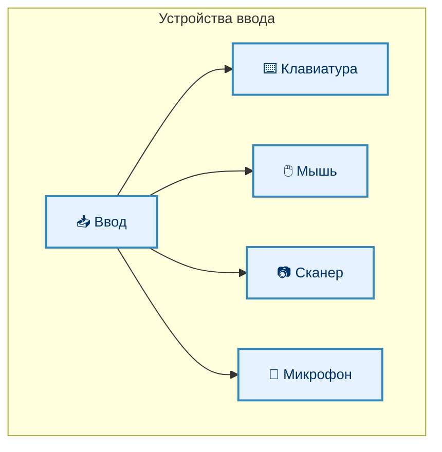
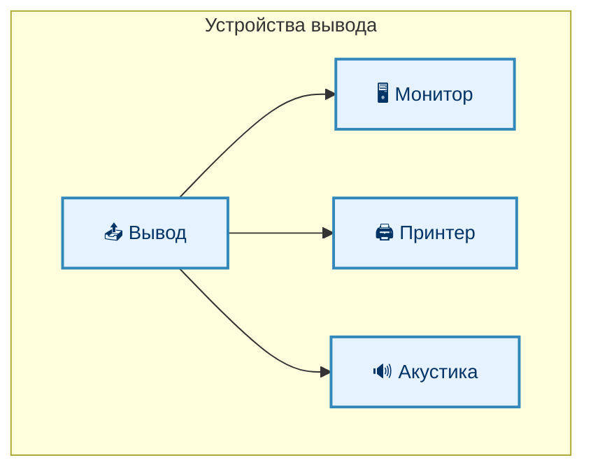
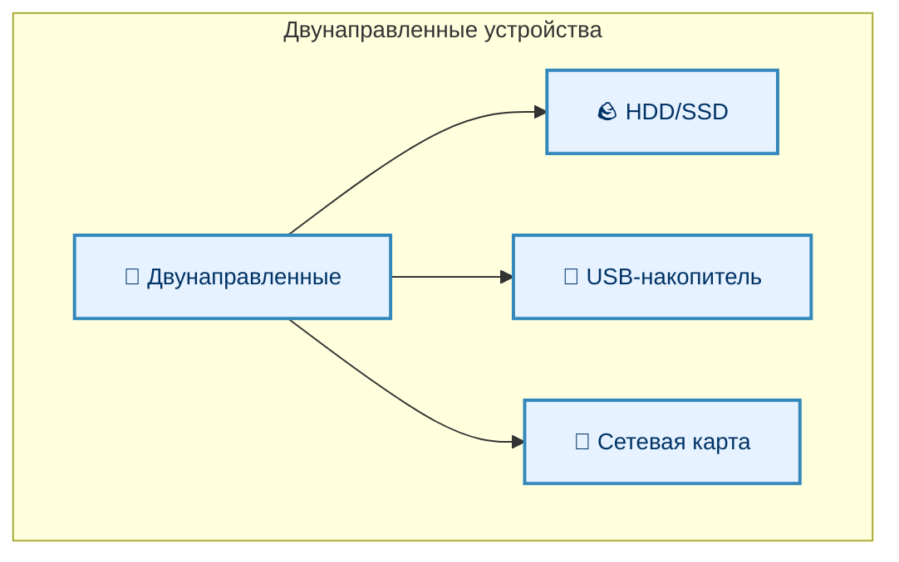
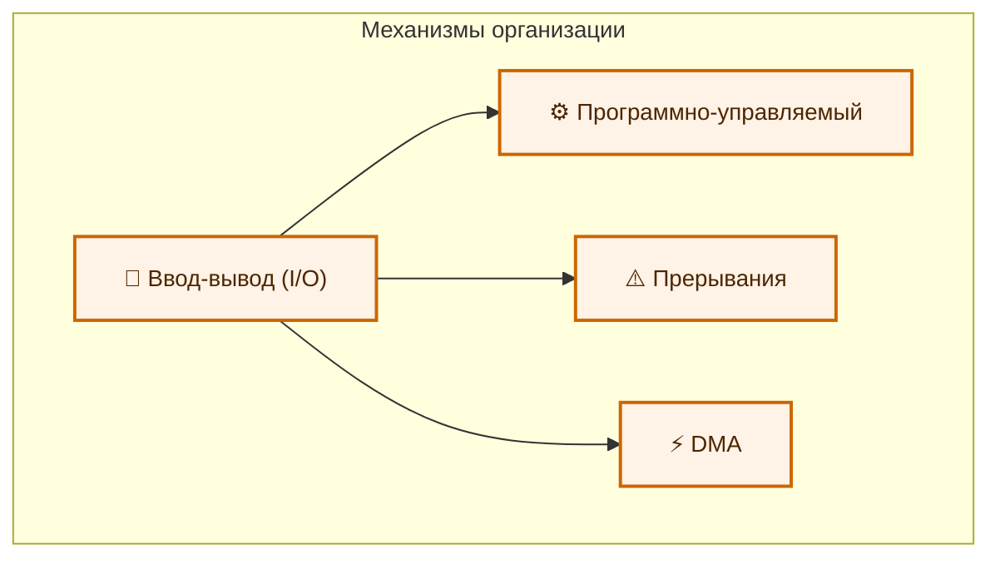
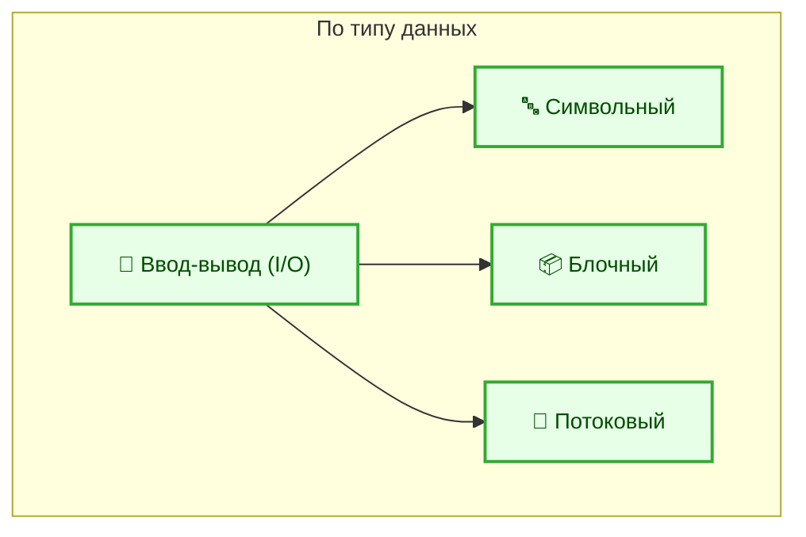
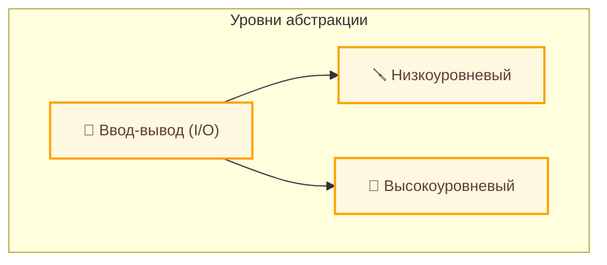

---
tags:
  - all
  - required
  - beginner
title: Ввод и вывод
description: >-
  Механизмы получения данных из внешних источников и выдачи результатов
  пользователю.
---

import ExternalPlayEmbed from '@site/src/components/ExternalPlayEmbed';


# Ввод и вывод

<div class="article-tags">
  <span class="tag tag-required">ОБЯЗАТЕЛЬНО</span>
  <span class="tag tag-beginner">ДЛЯ НОВИЧКОВ</span>
</div>

<span class="complexity-badge">Всем</span>

Мы определили, что такое информация, данные, какие бывают их типы. Кроме того, мы усвоили, что они хранятся в постоянном или временном хранилище и обрабатываются процессором. Здесь — как программы **получают** данные извне и **отдают** результат — клавиатура, диск, сеть, экран.

---

### Input/Output

★ **Ввод-вывод (I/O, Input/Output)** — обмен данными между программой и средой вне её процесса — устройствами, файлами, сетью, другими программами.


Цепочка при нажатии клавиши: клавиатура → драйвер → **ОС** → очередь событий → **программа** (например, редактор) → отрисовка символа на экране (**вывод**).

Двойной щелчок по файлу — **событие ОС**:

- система находит программу по расширению;
- запускает её;
- та выполняет **чтение файла** с диска;
- **вывод** интерфейса на монитор.

<ExternalPlayEmbed example="about/io-devices-play" title="Io Devices" />

---

### Программный ввод-вывод

Не только железо: у каждой программы есть стандартные потоки:

- **stdin** — ввод (обычно клавиатура или pipe);
- **stdout** — обычный вывод (консоль, файл);
- **stderr** — вывод ошибок.

```python
name = input("Ваше имя: ")   # stdin → программа
print("Привет,", name)       # программа → stdout
```

Перенаправление stdin из файла (`python script.py < input.txt`) — тот же поток ввода, только источник другой; разбор на Python — [Lab — файлы и текст](/lab/Примеры/1126#9-stdin-и-перенаправление-ввода).

Тот же принцип у файлов и сокетов: программа вызывает API ОС, а ядро общается с устройством.

---

### Ввод с устройств

Ввод передаёт данные в компьютер через устройства:

- **Клавиатура** — аппаратно идут **скан-коды** клавиш; ОС по раскладке превращает их в символы (Unicode). Не "ASCII с провода", а событие "нажата клавиша".
- **Мышь** — координаты и события (клик, прокрутка).
- **Сканер** — изображение или текст в цифровой вид.
- **Микрофон** — оцифровка звука (АЦП).



---

### Вывод

Вывод получает данные из компьютера на устройство:
	- Монитор отображает визуальную информацию, использует видеопамять и графические процессоры для обработки. Видеокарта отправляет данные на монитор.
	- Принтер печатает данные на бумаге, материализуя информацию, но требует форматирования данных (к примеру, в PDF).
	- Акустическая система выводит звук - наушники, колонки. Цифровой сигнал преобразуется в аналоговый.



---

### Двусторонние устройства

Двусторонние устройства могут как принимать, так и отправлять данные:
	- Жёсткий диск (HDD/SSD) хранит и читает данные, позволяя записывать информацию на него.
	- USB-накопители позволяют переносить данные между устройствами (есть и другие виды переносных устройств, к примеру, MicroSD или SD-карты, а также переносные жёсткие диски).
	- Сетевые карты обмениваются данными через интернет или локальную сеть, используя протоколы передачи данных.



---

### Виды ввода-вывода

По способу организации, выделяются следующие виды ввода-вывода:
	- программно-управляемый ввод-вывод, когда процессор непосредственно управляет передачей данных (чтение данных из порта ввода-вывода);
	- ввод-вывод с использованием прерываний, когда устройство сигнализирует процессору о готовности данных через прерывание (нажатие клавиши);
	- прямой доступ к памяти (DMA, Direct Memory Access) - передача данных происходит напрямую между устройством и оперативной памятью без участия процессора (чтение данных с жесткого диска).



В зависимости от типа передаваемых данных выделяют:
	- символьный ввод-вывод (ввод текста, вывод текста);
	- блочный ввод-вывод - передача данных блоками (фиксированными порциями) - чтение и запись файлов на жесткий диск;
	- потоковый ввод-вывод - передача данных непрерывным потоком (аудио- и видеопотоки).



По уровню абстракции выделяется низкоуровневый ввод-вывод (работа напрямую с аппаратными интерфейсами, допустим, программирование портов ввода-вывода) и высокоуровневый ввод-вывод (использование функций операционной системы или библиотек).



По режиму работы:

- **Синхронный I/O** — программа ждёт, пока операция завершится (классический `read` / `write`).
- **Асинхронный I/O** — запрос отправлен, программа продолжает работу; результат приходит позже (колбэк, `async/await`, отдельный поток).

Ввод-вывод в широком смысле — это и **чтение/запись файлов**, и сеть, а не только "оцифровка с датчиков". Подробнее — в главе [Чтение и запись](./2).

---
