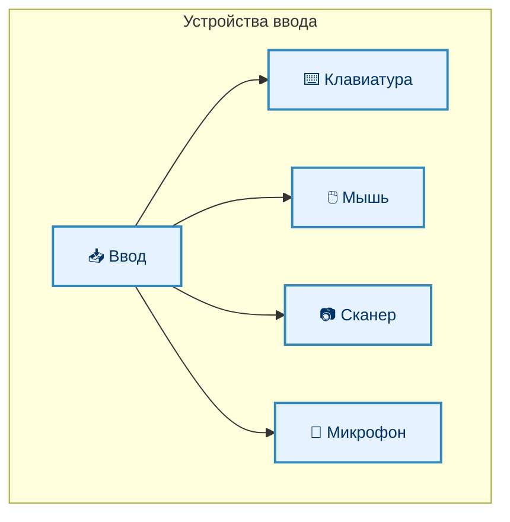
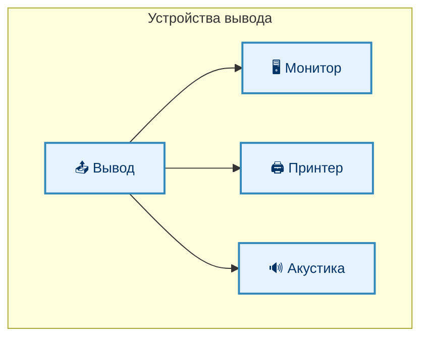
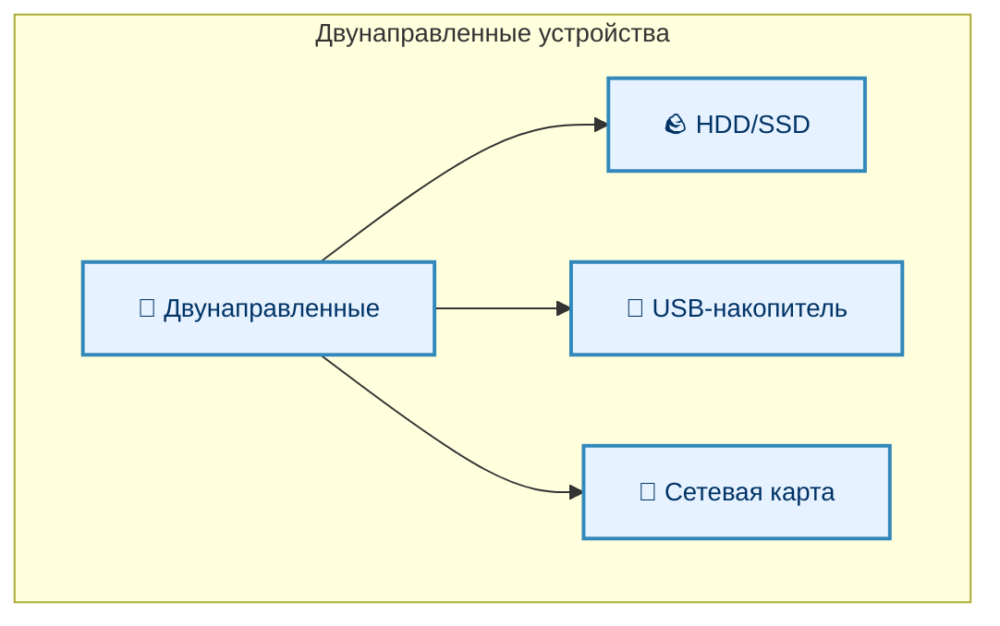
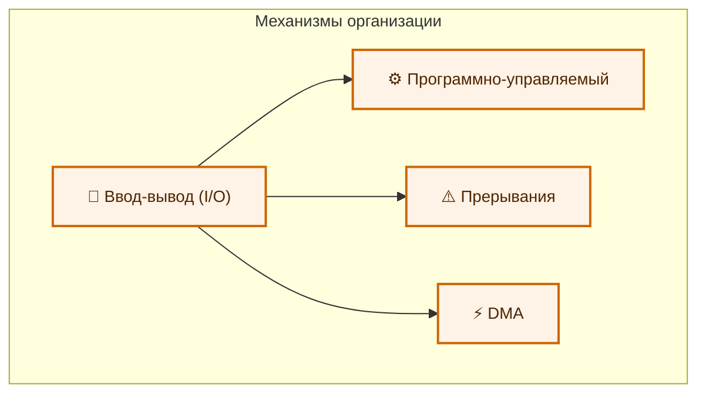
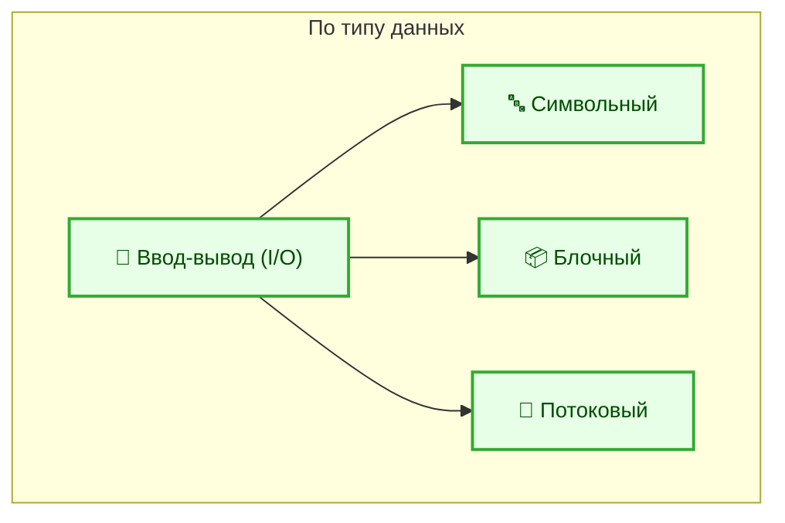
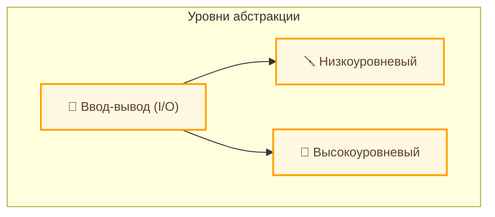

---
tags:
  - all
  - required
  - beginner
title: Ввод и вывод
description: "Мы определили, что такое информация, данные, какие бывают их типы. Кроме того, мы усвоили, что они хранятся в постоянном или временном хранилище и обрабатываются процессором."
  пользователю.
---

import IoDevicesPlay from '@site/src/components/IoDevicesPlay';

# Ввод и вывод

  ОБЯЗАТЕЛЬНО
  ДЛЯ НОВИЧКОВ

Всем

## Ввод и вывод

Мы определили, что такое информация, данные, какие бывают их типы. Кроме того, мы усвоили, что они хранятся в постоянном или временном хранилище и обрабатываются процессором. Данные – «сырьё», но как именно производится обработка, что с ними можно делать? Мы разберём, как программы и системы взаимодействуют с данными: читают, изменяют, перемещают, удаляют их.

---

### Input/Output

★ **Ввод-вывод** – процесс взаимодействия между программой и внешними устройствами. Когда вы нажимаете клавишу, сигнал передаётся в операционную систему, которая отправляет запрос в программу (допустим, текстовый редактор) для обработки сигнала и вывода символов на экран. К примеру, открывая файл двойным щелчком, вводится набор команд, выполняется процесс изучения инструкций, анализ выбранного файла, поиск закрепленной для формата программы, команда по её запуску, и соответствующий вывод на интерфейс.

Процесс ввода/вывода называют также I/O - Input/Output.

<IoDevicesPlay />

---

### Ввод

Ввод позволяет передавать данные в компьютер через устройства:
	- Клавиатура позволяет вводить текстовы данные. Символы передаются как коды клавиш (например, ASCII или Unicode).
	- Мышь передаёт координаты курсора и события (нажатия кнопок, прокрутка колеса). Это позволяет обрабатывать события в реальном времени.
	- Сканер преобразует изображения или текст в цифровой формат.
	- Микрофон записывает аудиосигналы - аналоговый сигнал преобразуется в цифровой.

---

### Вывод

Вывод получает данные из компьютера на устройство:
	- Монитор отображает визуальную информацию, использует видеопамять и графические процессоры для обработки. Видеокарта отправляет данные на монитор.
	- Принтер печатает данные на бумаге, материализуя информацию, но требует форматирования данных (к примеру, в PDF).
	- Акустическая система выводит звук - наушники, колонки. Цифровой сигнал преобразуется в аналоговый.

---

### Двусторонние устройства

Двусторонние устройства могут как принимать, так и отправлять данные:
	- Жёсткий диск (HDD/SSD) хранит и читает данные, позволяя записывать информацию на него.
	- USB-накопители позволяют переносить данные между устройствами (есть и другие виды переносных устройств, к примеру, MicroSD или SD-карты, а также переносные жёсткие диски).
	- Сетевые карты обмениваются данными через интернет или локальную сеть, используя протоколы передачи данных.

---

### Виды ввода-вывода

По способу организации, выделяются следующие виды ввода-вывода:
	- программно-управляемый ввод-вывод, когда процессор непосредственно управляет передачей данных (чтение данных из порта ввода-вывода);
	- ввод-вывод с использованием прерываний, когда устройство сигнализирует процессору о готовности данных через прерывание (нажатие клавиши);
	- прямой доступ к памяти (DMA, Direct Memory Access) - передача данных происходит напрямую между устройством и оперативной памятью без участия процессора (чтение данных с жесткого диска).

В зависимости от типа передаваемых данных выделяют:
	- символьный ввод-вывод (ввод текста, вывод текста);
	- блочный ввод-вывод - передача данных блоками (фиксированными порциями) - чтение и запись файлов на жесткий диск;
	- потоковый ввод-вывод - передача данных непрерывным потоком (аудио- и видеопотоки).

По уровню абстракции выделяется низкоуровневый ввод-вывод (работа напрямую с аппаратными интерфейсами, допустим, программирование портов ввода-вывода) и высокоуровневый ввод-вывод (использование функций операционной системы или библиотек).

По режиму работы выделяется синхронный ввод-вывод (операция завершается только после полного выполнения) и асинхронный ввод-вывод (операция выполняется параллельно с работой программы). Но об этом позже мы поговорим отдельно.

Таким образом, ввод-вывод — это может быть и чтение-запись, а не только материализация и цифровизация.

---
