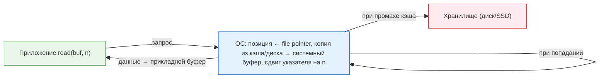
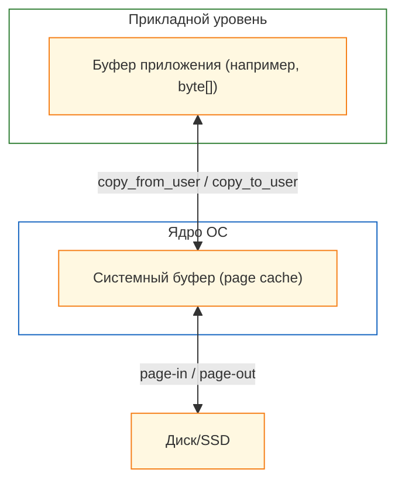

# Чтение и запись

<div class="article-tags">
  <span class="tag tag-required">ОБЯЗАТЕЛЬНО</span>
  <span class="tag tag-beginner">ДЛЯ НОВИЧКОВ</span>
</div>

<span class="complexity-badge">Всем</span>

## Чтение и запись

### Как устроена кодировка битов

★ **Чтение и запись данных** – процедуры информационного обмена с источником данных. В этом «обмене» нужно запомнить несколько ключевых концепций – собственно, чтение и запись, а также указатель файла, буферизация и системные вызовы.

Информационный обмен — это процесс передачи данных между участниками системы: приложением, операционной системой и устройством хранения или передачи.

Последовательность байтов — это упорядоченный набор байтов, рассматриваемый как единый поток информации, где каждый элемент имеет фиксированную позицию (смещение), начиная с нуля.


Операционная система рассматривает файл как линейную последовательность байтов, каждый из которых имеет свой номер (offset), начиная с 0. Допустим, файл Привет.txt содержит текст «Hello»:

Байт|	0	|1	|2	|3	|4|
|----------|-----------|-----------|----------|-----------|-----------|
Символ|	H	|e	|l	|l	|o|

В том же «Hello» спрятан интересный процесс кодировки – физически это набор сигналов, сгруппированных как файл, состоящий из байтов, а мы видим вполне себе текстовую часть – это происходит за счёт декодирования в установленной кодировке. Но как система понимает, в каком месте «e», допустим? Вот именно для этого и используется специальная переменная, которая называется **указатель файла** (`file pointer/file descriptor position`), хранящий текущую позицию в файле (номер байта, с которого начнётся следующая операция).

*Указатель файла* — неявное состояние дескриптора, управляется ОС, сдвигается автоматически после каждой операции (если не использован seek).

Это работает так:
	- файл открывается → указатель останавливается на первом – 0;
	- после каждой операции чтения/записи он автоматически сдвигается на количество обработанных байтов;
	- программа может вручную изменить позицию указателя (прочитать данные из середины файла);
	- файл можно открыть в разных программах, и указатель будет везде свой.

То есть, файлы – байтовые потоки данных, а указатель – «курсор», который двигается при чтении/записи. Когда программа читает файл, данные проходят некую «расшифровку» из формата хранения в язык запроса – при этом выполняется два этапа:
	- *системный буфер* (кэш ОС), когда данные копируются с диска в память ядра, а если следующему запросу понадобятся те же данные, они берутся не с диска, а с ядра, что ускоряет работу, словно «ящик около стола» вместо «хождения в архив»;
	- *прикладной буфер* (буфер программы), когда данные копируются из системного буфера в память программы.

Сложно? Давайте проще – если программа дважды читает один и тот же участок файла, второй запрос будет мгновенным – данные уже в системном буфере. Это и есть **буферизация** – помещение данных в буфер, чтобы «не бегать в архив», такой метод организации обмена ввода и вывода данных, который использует *буфер* для временного хранения данных, читая данные «порционно».

Технически, просто взаимодействуют три уровня:

```
приложение → ОС → устройство
```

---

### Файлы и пути

**Файлы** — это данные, которые хранятся на носителях: жёстких дисках (HDD), SSD, флешках и прочих. Но для удобства работы с ними операционная система использует файловую систему — специальную структуру, которая управляет тем, где, как и в каком порядке записываются данные.

**Файловая система** управляет хранением данных, следит за тем, какие части диска заняты, а какие свободны, хранит метаданные о файлах (имя, размер, дата создания, права доступа), и организует их в каталоги и папки. Данные расположены в древовидной иерархии, где всегда есть первый уровень - корень, и дочерние элементы - каталоги. Каталоги могут содержать в себе файлы и другие каталоги, что и порождает пути:

```
Корень/Каталог/Каталог/Каталог/Файл
```

Каждый файл и папка имеет свой уникальный путь от корня `/`.

В Linux и macOS каждому файлу присваивается inode — уникальный номер, который содержит информацию о правах, владельце, времени изменения, указателях на физические блоки на диске. Путь не определяет inode напрямую, но используется как ссылка на него через имена файлов и каталогов. Система ищет начиная с корня, и поэтапно идёт по элементам в адресе.

**Путь** — это способ указать местоположение файла или папки в иерархии файловой системы. Он похож на адрес вроде «улица Ленина, дом 5». Путь может быть абсолютным и относительным.

**Абсолютный путь** является полным, начиная от корневой директории файловой системы или диска, всегда однозначный и не зависит от текущего рабочего каталога программы. 
Примеры:
```
Windows - C:\Users\Timur\Documents\file.txt
```
```
Linux/macOS - /home/timur/Documents/file.txt
```

Такой путь всегда начинается от корня (/ в Unix-системах, C:\ в Windows) и точно указывает, где находится файл.

**Относительный путь** является путём относительно текущего рабочего каталога. Он короче и зависит от того, в какой директории работает (запущено) приложение:
```
Documents/file.txt
```
```
../Downloads/file.txt
```
Когда программа запускается, у неё есть текущий рабочий каталог — это место, от которого будут считаться относительные пути.


---

### Чтение

**Чтение** — это операция получения данных из источника: файла на диске, участка памяти или сетевого соединения — с последующим размещением этих данных в буфер приложения.

Чтение (Read) – процесс получения данных из источника:
	- файла на диске;
	- оперативной памяти;
	- сети (например, загрузка веб-страницы).

Схема чтения:




---
	
### Запись
	
**Запись** — это операция размещения данных из буфера приложения в целевой объект: файл, область памяти или сетевой поток — с обновлением состояния получателя.

Запись (Write) – процесс сохранения данных в определенное место:
	- в файл;
	- в базу данных;
	- на сервер.

Схема записи:


---

### Буферизация

**Буфер** — это область памяти, выделенная для временного хранения данных во время их передачи между компонентами системы: приложением, ядром ОС и физическим устройством.

**Буферизация** — это метод организации обмена данными, при котором информация накапливается в буфере до достижения определённого объёма или наступления события, что повышает эффективность и снижает количество обращений к медленным устройствам.

*Системный буфер* (page cache) — принадлежит ОС, общий для всех процессов, обеспечивает локальность и отложенную запись.

*Прикладной буфер* — управляется программой (например, BufferedInputStream в Java), снижает частоту системных вызовов.


Схема буферизации:



---