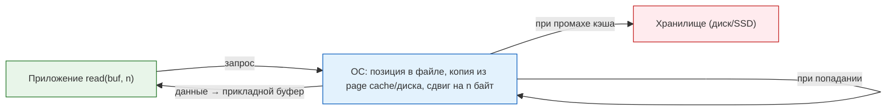
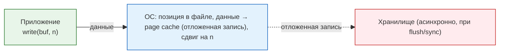
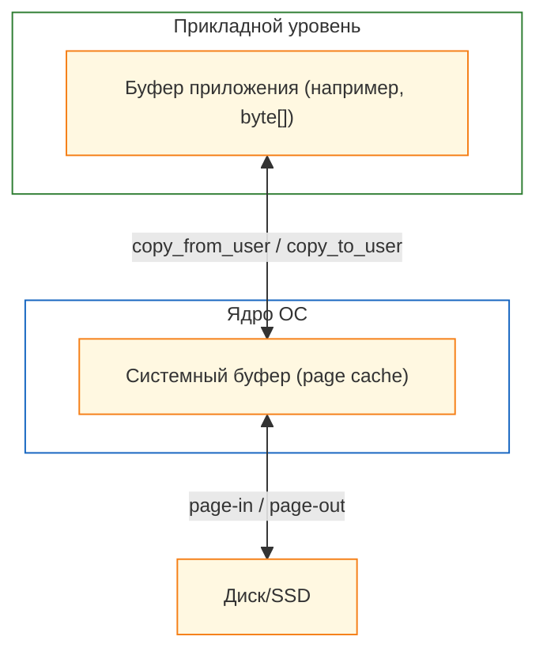

---
tags:
  - all
  - required
  - beginner
title: Чтение и запись
description: >-
  Чтение — это операция получения данных из источника — файла на диске, участка
  памяти или сетевого соединения — с последующим размещением этих данных в буфер
  приложения.
---

import ExternalPlayEmbed from '@site/src/components/ExternalPlayEmbed';


# Чтение и запись

<div class="article-tags">
  <span class="tag tag-required">ОБЯЗАТЕЛЬНО</span>
  <span class="tag tag-beginner">ДЛЯ НОВИЧКОВ</span>
</div>

<span class="complexity-badge">Всем</span>

---

## Чтение и запись

★ **Чтение и запись** — обмен данными между приложением и источником: файл на диске, память, сеть, устройство. Ключевые понятия: **позиция в файле (offset)**, **дескриптор файла**, **буферизация**, **системные вызовы** (`open`, `read`, `write`, `close` в POSIX; аналоги в WinAPI и стандартных библиотеках языков).

Информационный обмен — передача данных между приложением, операционной системой и устройством хранения или передачи.

---

### Файл как поток байтов

Операционная система видит файл как **линейную последовательность байтов**. У каждого байта есть **смещение (offset)** — номер позиции, с нуля.

Файл `hello.txt` с текстом `Hello` в кодировке ASCII (1 символ = 1 байт):

| Offset | 0 | 1 | 2 | 3 | 4 |
|--------|---|---|---|---|---|
| Байт (hex) | 48 | 65 | 6C | 6C | 6F |
| Символ | H | e | l | l | o |

Символ **e** — это байт с offset **1**, а не "поиск по кодировке". Кодировка нужна, чтобы **интерпретировать** байты как текст: в UTF-8 слово "Привет" займёт **12 байт** (по 2 на кириллическую букву), хотя букв всего шесть.

---

### Позиция в файле и дескриптор

Не путайте два термина:

- **Дескриптор файла (file descriptor, fd)** — "ручка" открытого файла у процесса (число вроде 3, 4… в Unix).
- **Позиция (file position, offset)** — с какого байта начнётся следующее `read` или `write`.

Позицию часто называют "указателем файла"; ею управляет ОС и сдвигает после каждой операции, если программа не вызвала `seek`.

Порядок работы:

- файл открыт → позиция **0**;
- прочитали 2 байта → позиция **2**;
- `seek(4)` → следующее чтение с offset **4**;
- у каждого открытия файла в своём процессе — **своя** позиция.

```python
# rb — чтение байтов; позиция сдвигается автоматически
with open("hello.txt", "rb") as f:
    head = f.read(2)      # b'He', позиция стала 2
    f.seek(0)             # вернулись в начало
    whole = f.read()      # весь файл с текущей позиции
```

Режимы открытия (идея одна во многих языках): **`"r"`** — чтение, **`"w"`** — запись с обнулением файла, **`"a"`** — дописывание в конец. В Python те же режимы разобраны с примерами «скопировал — запустил» — [Lab — Python, файлы и текст](/lab/Примеры/1126); теория и HTTP/JSON — [31.md](/encyclopedia/5-languages/5-02-python/31).

---

### От диска до программы

При чтении данные проходят цепочку:

1. **Page cache** (системный буфер ОС) — копия блоков файла в RAM ядра.
2. **Буфер приложения** — массив байтов или строка в памяти процесса.

Если тот же участок файла читают снова, данные часто берут из page cache, без обращения к диску — это **буферизация**.

```
приложение → ОС (page cache) → диск / SSD
```

Запись может быть **отложенной**: ОС сначала пишет в page cache, на диск сбрасывает позже (`flush`, `fsync`). Поэтому "сохранить файл" и "данные физически на носителе" — не всегда одно и то же.

<ExternalPlayEmbed example="basics/read-write-play" title="Read Write" />

---

### Файлы и пути

**Файлы** — это данные, которые хранятся на носителях: жёстких дисках (HDD), SSD, флешках и прочих. Но для удобства работы с ними операционная система использует файловую систему — специальную структуру, которая управляет тем, где, как и в каком порядке записываются данные.

**Файловая система** управляет хранением данных, следит за тем, какие части диска заняты, а какие свободны, хранит метаданные о файлах (имя, размер, дата создания, права доступа), и организует их в каталоги и папки. Данные расположены в древовидной иерархии, где всегда есть первый уровень - корень, и дочерние элементы - каталоги. Каталоги могут содержать в себе файлы и другие каталоги, что и порождает пути:

```
Корень/Каталог/Каталог/Каталог/Файл
```

Каждый файл и папка имеет свой уникальный путь от корня `/`.

В Linux и macOS каждому файлу присваивается inode — уникальный номер, который содержит информацию о правах, владельце, времени изменения, указателях на физические блоки на диске. Путь не определяет inode напрямую, но используется как ссылка на него через имена файлов и каталогов. Система ищет начиная с корня, и поэтапно идёт по элементам в адресе.

**Путь** — это способ указать местоположение файла или папки в иерархии файловой системы. Он похож на адрес вроде "улица Ленина, дом 5". Путь может быть абсолютным и относительным.

**Абсолютный путь** является полным, начиная от корневой директории файловой системы или диска, всегда однозначный и не зависит от текущего рабочего каталога программы. 
Примеры:
```
Windows - C:\Users\Timur\Documents\file.txt
```
```
Linux/macOS - /home/timur/Documents/file.txt
```

Такой путь всегда начинается от корня (/ в Unix-системах, C:\ в Windows) и точно указывает, где находится файл.

**Относительный путь** является путём относительно текущего рабочего каталога. Он короче и зависит от того, в какой директории работает (запущено) приложение:
```
Documents/file.txt
```
```
../Downloads/file.txt
```
Когда программа запускается, у неё есть текущий рабочий каталог — это место, от которого будут считаться относительные пути.


---

### Проводник и древовидная структура

Для новичка важно видеть файловую систему не как "хаос папок", а как **дерево**:

- вверху — **корень** (`C:\` в Windows, `/` в Linux/macOS);
- ниже — папки и подпапки;
- на "листьях" дерева — файлы.

Путь — это маршрут по этому дереву:

```text
C:\Users\Timur\Documents\Учёба\конспект.docx
```

Здесь:

- `C:\` — корень тома;
- `Users`, `Timur`, `Documents`, `Учёба` — уровни дерева;
- `конспект.docx` — конечный файл.

В **Проводнике Windows** слева обычно показывается навигационное дерево, а справа — содержимое выбранной папки. Это и есть визуальная модель древовидной структуры.

Практический ориентир для новичка:

1. Сначала переходите в нужную папку.
2. Проверяйте адрес в строке пути (breadcrumbs).
3. Только потом копируйте, перемещайте или удаляйте.

---

### Копирование, перемещение и удаление в проводнике

На уровне интерфейса эти действия выглядят просто, но под капотом это чтение/запись данных и изменение метаданных.

- **Копирование** (`Ctrl+C` → `Ctrl+V`) создаёт второй объект; исходный остаётся.
- **Перемещение** (`Ctrl+X` → `Ctrl+V` или перетаскивание) переносит объект в новый путь.
- **Удаление** (`Delete`) обычно отправляет в корзину; `Shift+Delete` обходит корзину.

Что важно новичку:

- между разными дисками перемещение часто работает как "копировать + удалить";
- если копирование прервалось (свет, сеть, ошибка диска), проверяйте размер и дату копии;
- перед массовым удалением полезно включить сортировку по дате/типу, чтобы не удалить лишнее.

Мини-чек перед удалением:

1. Это точно нужная папка?
2. Есть ли резервная копия важных файлов?
3. Удаляете ли вы оригинал или копию?

---

### Поиск по имени и расширению

В проводнике чаще всего ищут:

- по **имени** (`договор`, `отчёт`, `photo`);
- по **расширению** (`*.pdf`, `*.docx`, `*.jpg`).

Расширение — это часть имени после точки, которая подсказывает тип файла.

Примеры:

- `report.docx` — документ Word;
- `budget.xlsx` — таблица Excel;
- `notes.txt` — простой текст.

Практика поиска:

- ищите сначала по части имени;
- если результатов слишком много — добавьте расширение;
- при необходимости сузьте область поиска до конкретной папки.

---

### Сортировка и фильтрация

Это разные операции:

- **Сортировка** меняет порядок вывода (по имени, дате, размеру, типу).
- **Фильтрация** скрывает всё лишнее и оставляет только нужные файлы.

Типичные сценарии:

- "Показать самые новые" → сортировка по дате изменения (по убыванию).
- "Найти только PDF" → фильтр по типу или поиск `*.pdf`.
- "Понять, что занимает место" → сортировка по размеру.

Полезная привычка: сначала фильтровать, потом сортировать. Так легче работать с большими папками и не пропускать нужные файлы.

---

### Чтение

**Чтение (Read)** — получение данных из источника (файл, память, сеть) и размещение копии в буфере приложения.

Схема чтения:




---

### Запись

**Запись (Write)** — передача данных из буфера приложения в приёмник (файл, память, сеть, БД) с обновлением состояния приёмника.

Схема записи:




---

### Буферизация

**Буфер** — это область памяти, выделенная для временного хранения данных во время их передачи между компонентами системы: приложением, ядром ОС и физическим устройством.

**Буферизация** — это метод организации обмена данными, при котором информация накапливается в буфере до достижения определённого объёма или наступления события, что повышает эффективность и снижает количество обращений к медленным устройствам.

*Системный буфер* (page cache) — принадлежит ОС, общий для всех процессов, обеспечивает локальность и отложенную запись.

*Прикладной буфер* — управляется программой (например, BufferedInputStream в Java), снижает частоту системных вызовов.


Схема буферизации:



---
