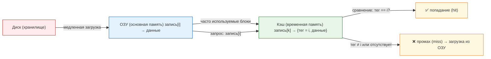

---
tags:
  - all
  - analytic
  - engineer
  - developer
  - architector
  - tester
  - manager
  - required
  - beginner
title: Кэширование
description: Быстрая память для временного хранения часто используемых данных.
---

import ExternalPlayEmbed from '@site/src/components/ExternalPlayEmbed';

# Кэширование

  ОБЯЗАТЕЛЬНО
  ДЛЯ НОВИЧКОВ

Разработчику
Аналитику
Архитектору

---

## Кэш

### Что такое кэш?

В [главе про чтение и запись](./2) мы уже встречали **page cache** — кэш файлов в оперативной памяти. Здесь шире: **кэш** — любой быстрый промежуточный слой, где хранят **копию** часто нужных данных, чтобы не ходить в медленное хранилище снова.

★ **Кэш** — буфер с быстрым доступом: меньше по объёму, ближе к тому, кто читает данные (ядро CPU, процесс, браузер).

**Кэш ≠ буфер обмена**: clipboard хранит то, что вы скопировали для вставки; кэш хранит копии для **ускорения повторного чтения**, без привязки к Ctrl+C.

Для кэша процессора (и многих аппаратных кэшей) данные в **основной памяти** (ОЗУ) имеют адрес/индекс, а в кэше — строка с **тегом** (откуда взята копия) и самими данными:

Упрощённый учебный пример (логика "тег + данные"):

**ОЗУ (все записи):**

| Индекс в ОЗУ | Данные |
|--------------|--------|
| 0 | Кот |
| 1 | Собака |
| 2 | Гусь |

**Кэш (несколько слотов, тег = индекс строки в ОЗУ):**

| Слот кэша | Тег (индекс в ОЗУ) | Данные |
|-----------|-------------------|--------|
| 0 | 2 | Гусь |
| 1 | 0 | Кот |

Запрос "запись 2": смотрим теги → в слоте 0 тег совпал → **hit** (попадание). Иначе — **miss** (промах), загрузка из ОЗУ.

Иерархия скорости (от медленного к быстрому): **диск → ОЗУ → кэш CPU (L3, L2, L1)**. Цифры в таблицах ниже ориентировочные и зависят от модели железа.

Читая книгу, удобнее держать открытые страницы на столе, чем бегать за каждой в библиотеку — так же устроен кэш.

<ExternalPlayEmbed example="basics/cache-hierarchy-play" title="Cache Hierarchy" />

---

### Кэш процессора

**Кэш процессора** — это высокоскоростная память, встроенная в процессор или расположенная рядом с ним, предназначенная для временного хранения часто используемых данных и команд, чтобы сократить время обращения к основной памяти.

**Кэш-память** — это уровень временного хранилища, расположенный ближе к потребителю данных (процессору, программе, устройству), чем основное хранилище, и обеспечивающий более быстрый доступ к информации за счёт меньшей ёмкости и физической близости.

Современные процессоры имеют несколько уровней кэш-памяти — L1, L2 и L3.  
- **L1-кэш** — самый маленький и самый быстрый, встроен прямо в ядро процессора.  
- **L2-кэш** — побольше и чуть медленнее, обычно тоже привязан к ядру.  
- **L3-кэш** — общий для всех ядер, самый большой из кэшей процессора, но и самый медленный из них.  

Данные сначала ищутся в L1. Если их там нет — в L2, затем в L3. Только при полном промахе процессор обращается в оперативную память.

| Уровень | Размер (пример) | Время доступа | Расположение |
|--------|------------------|----------------|--------------|
| L1     | 32–64 КБ         | ~1 такт        | В ядре процессора |
| L2     | 256 КБ – 1 МБ    | ~4–10 тактов   | Рядом с ядром |
| L3     | 2–64 МБ          | ~20–50 тактов  | Общий для всех ядер |

---

### Политики замены

**Заполнение кэша** — это процесс помещения данных из более медленного хранилища (например, оперативной памяти) в кэш, выполняемый при первом обращении к этим данным или при предсказании их будущего использования.

**Политика замены** — это набор правил, по которым выбирается, какие данные будут удалены из кэша при необходимости освободить место для новых записей.

Когда кэш заполнен, новая запись должна заменить старую. Как выбирается "жертва"? Это — *политика замены*.

**Вытеснение** — это операция удаления записи из кэша для освобождения места под новую запись, выполняемая в соответствии с выбранной политикой замены.

Кэш ограничен по размеру. Когда в него нужно поместить новые данные, а места нет, система выбирает, какую запись удалить (**вытеснение**). Распространённые **политики замены**:

- **FIFO** — вытесняется самая "старая" по порядку загрузки в кэш.
- **LRU** (Least Recently Used) — та, к которой дольше всего не обращались.
- **LFU** (Least Frequently Used) — та, к которой реже всего обращались по счётчику.
- **Сброс по инструкции** — явные команды вроде сброса кэша линий (в низкоуровневом коде; в обычной разработке почти не встречается).

---

### Кэширование в других технологиях

Кэширование применяется повсюду:  
- **Браузер** хранит изображения и стили сайтов, чтобы не скачивать их при каждом заходе.  
- **Операционная система** держит часто читаемые файлы в page cache (системном буфере).  
- **Wi-Fi-роутер** кэширует DNS-запросы, чтобы быстрее открывать сайты.  
- **Видео-плеер** загружает следующие секунды видео заранее — это тоже кэш в оперативной памяти.
- **SSD-диск** имеет свой собственный кэш (часто на DRAM), чтобы быстрее отдавать блоки.

**Кэш браузера** — это папка на диске или участок оперативной памяти, в которой веб-браузер сохраняет копии ресурсов сайтов (изображений, стилей, скриптов), чтобы при повторном посещении страницы загружать их быстрее.

**Кэш приложения** — это область памяти или файл на диске, которую программа использует для хранения промежуточных или часто запрашиваемых данных: результатов вычислений, изображений, конфигураций, чтобы избежать повторных операций.

**Буфер обмена** — это область оперативной памяти, используемая операционной системой для временного хранения данных при операциях копирования и вставки между приложениями.

**Page cache** — это область оперативной памяти, используемая ядром ОС для кэширования содержимого файлов с диска, чтобы ускорить повторные чтения и отсрочить запись.

**DNS-кэширование** — это сохранение соответствия между доменными именами (например, google.com) и их IP-адресами на локальном устройстве, роутере или сервере провайдера, чтобы избежать повторных обращений к глобальным DNS-серверам при каждом запросе.

**Кэш оперативной памяти** — это не отдельный физический компонент, а логическое использование части оперативной памяти как промежуточного хранилища для ускорения доступа к данным, например, через page cache или прикладные буферы.

**Кэш SSD** — это быстрая память (обычно DRAM или SLC-флеш), встроенная в твердотельный накопитель, используемая для хранения таблицы отображения адресов (FTL), часто читаемых блоков и служебной информации, чтобы повысить скорость отклика и сгладить износ флеш-памяти.

---

### Проблема устаревших данных в кэше

Проблема устаревших данных в кэше возникает, когда копия информации в кэше не соответствует актуальной версии в основном хранилище. Это происходит, если оригинал изменяется вне контроля кэширующего механизма — например, файл на диске обновлён другой программой, а page cache продолжает отдавать старую версию; или сайт выпустил новую версию, но браузер показывает страницу из локального кэша.

Решения включают:  
- **Срок жизни записи (TTL)** — автоматическое удаление данных по истечении заданного времени;  
- **Инвалидация** — явная команда на удаление устаревшей записи;  
- **Версионирование** — добавление уникальных меток или хешей к именам ресурсов (например, `style.a1b2c3.css`), чтобы браузер воспринимал их как новые;  
- **Проверка условий** — отправка запроса с заголовками `If-Modified-Since` или `ETag`, чтобы сервер подтвердил актуальность кэша.  

Кэш — это зеркало состояния на момент копирования. Его ценность зависит от своевременного обновления.

---
