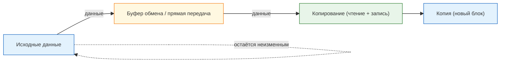
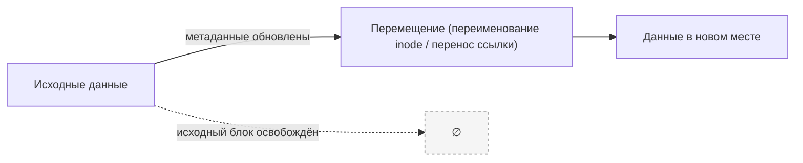
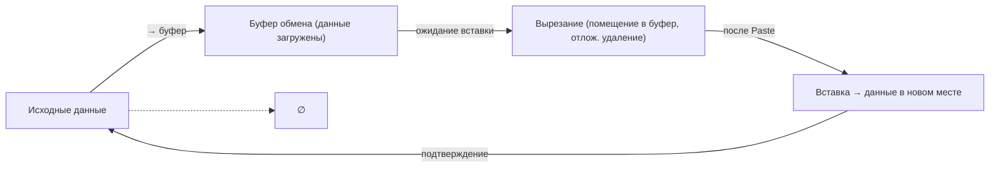
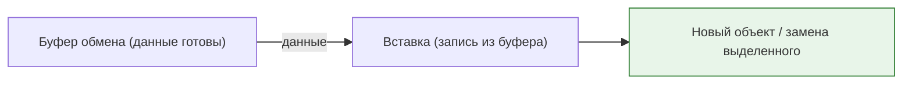
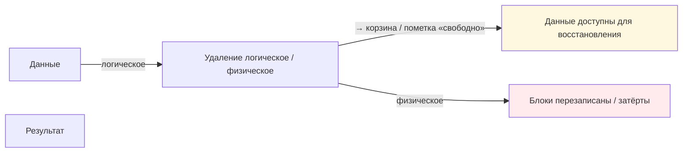
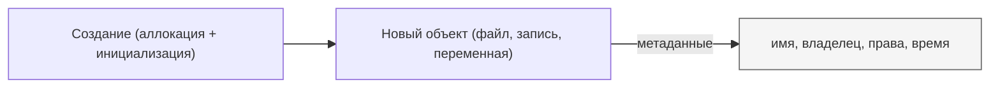
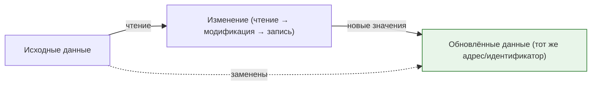

# Манипуляции с данными

  ОБЯЗАТЕЛЬНО
  ДЛЯ НОВИЧКОВ

Всем

## Манипуляции с данными

### Копирование

★ **Копирование (Copy)** – создание точной копии данных без удаления оригинала. При этом происходит чтение, и запись в другом месте точного аналога, причем что оригинал, что копия – будут индивидуальными наборами данных, но содержащими идентичную информацию. 

**Важно**: есть комбинация горячих клавиш для операции копирования выбранного набора данных – Ctrl+C.

Копировать можно текст, файлы, папки (каталоги), объекты, переменные и структуры данных в памяти. Есть несколько способов копирования:
	- через буфер обмена - данные временно перемещаются в специальную область памяти (буфер обмена), откуда их можно вставить в другое место;
	- непосредственное копирование - данные копируются напрямую через командную строку (cp в Linux);
	- копирование через сеть - передача данных между устройствами через сетевое соединение, к примеру с одного компьютера на другой.

Копирование может быть поверхностным (когда копируются только ссылки на данные или метаданные, к примеру - копирование ярлыка файла вместо самого файла) и глубоким (когда создаётся полная копия всех данных, включая вложенные элементы).

По целям использования выделяют:
	- резервное копирование - создание копии данных для защиты от потери или повреждения;
	- клонирование - создание точной копии устройства или системы (снимок);
	- копирование для обработки - создание копии данных для дальнейшего редактирования или анализа (допустим, копирование таблицы в Excel).

---

### Перемещение

★ **Перемещение (Move)** – перенос данных из одного места в другое с удалением оригинала. В отличие от копирования, создаётся точная копия данных, но старая версия удаляется, а место – освобождается. Комбинация клавиш – Ctrl+M.

---

### Вырезание

★ **Вырезание (Cut)** – аналог перемещения, но чуть более интуитивно для пользователя – когда есть возможность отметить набор данных, выгрузить его в буфер, а затем вставить из буфера в нужное место. Горячая клавиша – Ctrl+X.

Отличие перемещения от вырезания заключается в том, что вырезание сначала помещает данные в буфер обмена, а удаление оригинала происходит только после завершения операции вставки. Перемещение же сразу переносит данные из одного места в другое без использования буфера обмена. Поэтому перемещение больших файлов может быть быстрее.

---

### Вставка

★ **Вставка (Paste)** – генерация скопированного или вырезанного набора данных в выбранное место из буфера обмена. Копируя, или вырезая, мы помещаем данные во временную память, а вставляя – даём команду сгенерировать копию данных из буфера. Горячая клавиша – Ctrl+V.

---

### Удаление

★ **Удаление (Delete)** – освобождение места от набора данных, очистка данных из хранилища. Начинающие пользователи помнят, что есть обычное удаление, когда файл попадает в корзину с возможностью его восстановить, и полное удаление, когда происходит безвозвратная очистка без возможности восстановления. Но так работает только за счёт инструментов операционных систем. К примеру, если удалить запись из базы данных – корзины уже не будет, только другие инструменты восстановления. Аналоги – Стирание (Erase) или Очистка (Clear). Для удаления есть клавиша – Delete (Del).

---

### Удаление в корзину

**Удаление в корзину в Windows** — это логическое удаление. Физическое удаление — это полное уничтожение данных с носителя. Для удаления данных из оперативной памяти, как правило, применяют термин очистка и освобождение, а когда речь идёт об удалении фрагментов файла (допустим, абзац текста), то это стирание. Очистка также подразумевает удаление информации из каких-либо контейнеров, например, поля на странице.

По уровню сложности удаление бывает:
	- простое удаление - удаление одного объекта без учёта связей с другими данными;
	- массовое удаление - одновременное удаление большого количества данных;
	- каскадное удаление - удаление объекта вместе со всеми связанными с ними зависимыми данными.

Каскадное удаление применяется, примеру, в базах данных или операционной системе - при удалении родительского элемента, дочерние тоже удаляются. Каскадное удаление является более опасным, но и простое удаление может вызвать ошибки, когда удаляется один элемент, но все связанные элементы ссылаются на удалённый, из-за чего логика работы нарушается.

---

### Создание

★ **Создание (Create)** – генерация новых данных, будь то файл или запись в базе данных. К табличным или списочным данным применяют термин Добавление (Add) – когда, допустим, добавляется запись, элемент.

---

### Изменение
 
★ **Изменение** – обновление существующих данных, файла или записи. У этой операции есть фактические синонимы, когда, по сути, процесс один и тот же:
	- Edit (изменение);
	- Update (обновление);
	- Modify (модификация).
	

Если вы новичок, то можете потренироваться, попробовав создать текстовый файл, изменить его, сохранить, сделать копию и удалить. Но, подозреваю, что процесс этот вам знаком. Важно: учитесь привыкать к использованию горячих клавиш, это ускорит процесс работы.

Операции с данными – основа работы компьютера. Понимая, как данные копируются, перемещаются, изменяются, а также запомнив горячие клавиши, вы глубже разберётесь в IT-системах. Далее мы изучим файловые системы, алгоритмы и софт.

---