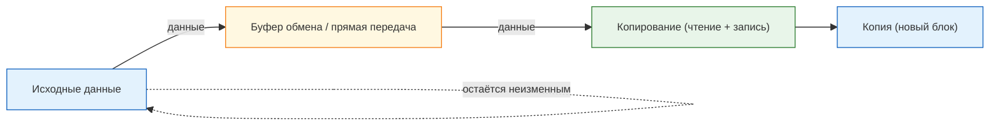
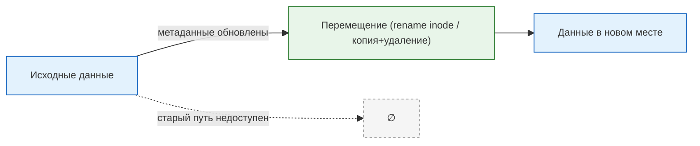
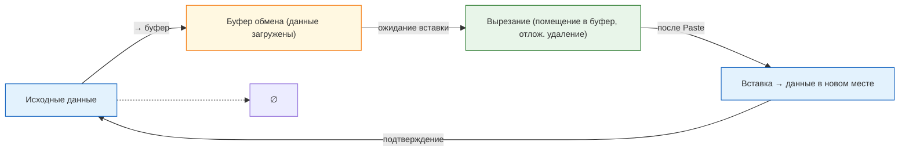
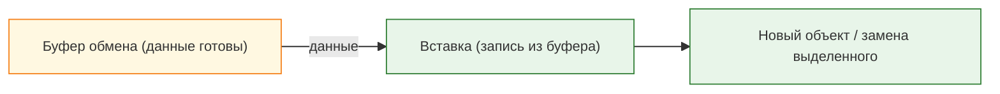
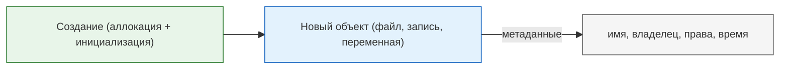
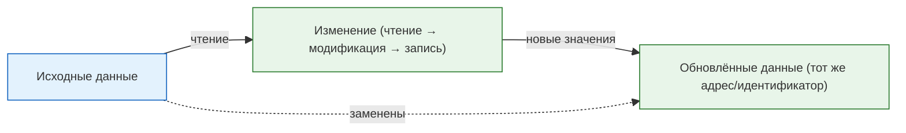

---
tags:
  - all
  - required
  - beginner
title: Манипуляции с данными
description: >-
  Манипуляции с данными — различия логического и физического удаления, CRUD,
  clipboard и базовые подходы к очистке информации.
---

# Манипуляции с данными

<div class="article-tags">
  <span class="tag tag-required">ОБЯЗАТЕЛЬНО</span>
  <span class="tag tag-beginner">ДЛЯ НОВИЧКОВ</span>
</div>

<span class="complexity-badge">Всем</span>

---

## Манипуляции с данными

Программы и пользователи постоянно **создают**, **читают**, **обновляют** и **удаляют** данные. Эту четвёрку называют **CRUD** (Create, Read, Update, Delete). В проводнике и редакторах те же действия часто выглядят как копирование, вырезание, вставка и удаление — под капотом это всё равно чтение и запись байтов.

| Операция CRUD | В интерфейсе (типично) | В терминале (примеры) |
|---------------|------------------------|------------------------|
| Create | Новый файл, "Сохранить как" | `touch`, `New-Item` |
| Read | Открыть файл | `cat`, `Get-Content` |
| Update | Редактирование, сохранение | перезапись файла |
| Delete | Удалить, корзина | `rm`, `Remove-Item` |

Ниже — операции, с которыми вы сталкиваетесь каждый день, и что происходит с данными на диске.

---

### Копирование

★ **Копирование (Copy)** — создание копии данных без удаления оригинала: чтение из источника и запись в новое место. Оригинал и копия — разные объекты (разные файлы, записи или области памяти), но с одинаковым содержимым.



**Важно**: есть комбинация горячих клавиш для операции копирования выбранного набора данных – Ctrl+C.

Копировать можно текст, файлы, папки (каталоги), объекты, переменные и структуры данных в памяти. Основные способы:

- **Через буфер обмена** — **Ctrl+C** копирует выделенное в clipboard; оригинал остаётся на месте. Данные лежат в памяти ОС, пока вы не вставите их (**Ctrl+V**) или не скопируете что-то ещё.
- **Напрямую** — чтение и запись без clipboard — `cp` в Linux, `Copy-Item` в PowerShell, "Копировать" в проводнике.
- **По сети** — те же read/write, но источник или приёмник на другом устройстве (FTP, SMB, HTTP).

```bash
# Linux/macOS — копия файла
cp report.txt report_backup.txt

# Windows PowerShell
Copy-Item .\report.txt .\report_backup.txt
```

Копирование может быть поверхностным (когда копируются только ссылки на данные или метаданные, к примеру - копирование ярлыка файла вместо самого файла) и глубоким (когда создаётся полная копия всех данных, включая вложенные элементы).

По целям использования выделяют:
	- резервное копирование - создание копии данных для защиты от потери или повреждения;
	- клонирование - создание точной копии устройства или системы (снимок);
	- копирование для обработки - создание копии данных для дальнейшего редактирования или анализа (допустим, копирование таблицы в Excel).

---

### Перемещение

★ **Перемещение (Move)** — перенос данных так, что в старом месте объекта больше нет. Отдельной "горячей клавиши Move" в Windows и macOS **нет**: файл переносят перетаскиванием, командой `mv` / `Move-Item` или связкой **Ctrl+X** (вырезать) и **Ctrl+V** (вставить).

На **одном томе** (один диск, одна файловая система) ОС часто **не копирует байты**, а меняет запись в каталоге — по сути **переименование** или смена пути (inode тот же). Между разными дисками move = копирование + удаление источника.



```bash
mv old/name.txt new/name.txt          # Linux/macOS
Move-Item .\old\name.txt .\new\       # Windows
```

---

### Вырезание

★ **Вырезание (Cut)** – аналог перемещения, но чуть более интуитивно для пользователя – когда есть возможность отметить набор данных, выгрузить его в буфер, а затем вставить из буфера в нужное место. Горячая клавиша – Ctrl+X.

**Вырезание** помещает копию данных в буфер обмена; исходник обычно удаляется **после успешной вставки** (если вставка не состоялась, файл может остаться). **Перемещение** через `mv` или drag-and-drop на том же диске часто не использует clipboard и может завершиться одним шагом — поэтому большие файлы на одном томе переносят быстрее, чем cut → paste между разными дисками.



---

### Вставка

★ **Вставка (Paste)** – генерация скопированного или вырезанного набора данных в выбранное место из буфера обмена. Копируя, или вырезая, мы помещаем данные во временную память, а вставляя – даём команду сгенерировать копию данных из буфера. Горячая клавиша – Ctrl+V.



---

### Удаление

★ **Удаление (Delete)** – освобождение места от набора данных, очистка данных из хранилища. Начинающие пользователи помнят, что есть обычное удаление, когда файл попадает в корзину с возможностью его восстановить, и полное удаление, когда происходит безвозвратная очистка без возможности восстановления. Но так работает только за счёт инструментов операционных систем. К примеру, если удалить запись из базы данных – корзины уже не будет, только другие инструменты восстановления. Аналоги – Стирание (Erase) или Очистка (Clear). Для удаления есть клавиша – Delete (Del).

```mermaid
%%{init: {"theme":"default", "themeVariables": {"fontSize":"12.5px"}}}%%
flowchart LR
    classDef src fill:#e3f2fd,stroke:#1565c0;
    classDef op fill:#e8f5e9,stroke:#2e7d32;
    classDef dst fill:#e3f2fd,stroke:#1565c0;

    S["Данные"]:::src
    O["Удаление логическое / физическое"]:::op

    S -->|логическое| O
    O -->|→ корзина / пометка "свободно"| R1["Восстановление возможно"]:::dst
    O -->|физическое| R2["Блоки перезаписаны / затёрты"]:::dst

    style R1 fill:#fff8e1
    style R2 fill:#ffebee
```

**Логическое удаление** — файл исчезает из проводника, но байты на диске ещё могут оставаться (корзина, "свободные" блоки). **Физическое** — данные перезаписывают или затирают специально; восстановление без спецсредств маловероятно. **Shift+Delete** в Windows часто обходит корзину, но это всё равно не гарантия полного стирания с SSD.

---

### Удаление в корзину

**Удаление в корзину в Windows** — это логическое удаление. Физическое удаление — это полное уничтожение данных с носителя. Для удаления данных из оперативной памяти, как правило, применяют термин очистка и освобождение, а когда речь идёт об удалении фрагментов файла (допустим, абзац текста), то это стирание. Очистка также подразумевает удаление информации из каких-либо контейнеров, например, поля на странице.

По уровню сложности удаление бывает:
	- простое удаление - удаление одного объекта без учёта связей с другими данными;
	- массовое удаление - одновременное удаление большого количества данных;
	- каскадное удаление - удаление объекта вместе со всеми связанными с ними зависимыми данными.

Каскадное удаление применяется, примеру, в базах данных или операционной системе - при удалении родительского элемента, дочерние тоже удаляются. Каскадное удаление является более опасным, но и простое удаление может вызвать ошибки, когда удаляется один элемент, но все связанные элементы ссылаются на удалённый, из-за чего логика работы нарушается.

---

### Создание

★ **Создание (Create)** – генерация новых данных, будь то файл или запись в базе данных. К табличным или списочным данным применяют термин Добавление (Add) – когда, допустим, добавляется запись, элемент.



---

### Изменение
 
★ **Изменение** – обновление существующих данных, файла или записи. У этой операции есть фактические синонимы, когда, по сути, процесс один и тот же:
	- Edit (изменение);
	- Update (обновление);
	- Modify (модификация).
	


---

### Пример — CRUD в одном файле

```python
from pathlib import Path

path = Path("note.txt")

path.write_text("версия 1", encoding="utf-8")   # Create
print(path.read_text(encoding="utf-8"))          # Read  → версия 1
path.write_text("версия 2", encoding="utf-8")   # Update
path.unlink()                                    # Delete
```

Горячие клавиши в редакторе и проводнике (**Ctrl+C / X / V**, **Delete**) ускоряют те же операции на уровне интерфейса.

Операции с данными — основа работы компьютера: под кнопками и командами всегда чтение, запись и обновление метаданных. Далее в энциклопедии — файловые системы, алгоритмы и прикладной софт.

---

### Сводка горячих клавиш (Windows / Linux GUI)

| Действие | Клавиши |
|----------|---------|
| Копировать | **Ctrl+C** |
| Вырезать | **Ctrl+X** |
| Вставить | **Ctrl+V** |
| Удалить (в корзину / по настройке ОС) | **Delete** |
| Удалить без корзины (Windows) | **Shift+Delete** |

Перемещение файла — **перетаскивание** или **Ctrl+X**, затем **Ctrl+V**, либо `mv` / `Move-Item`.

---
