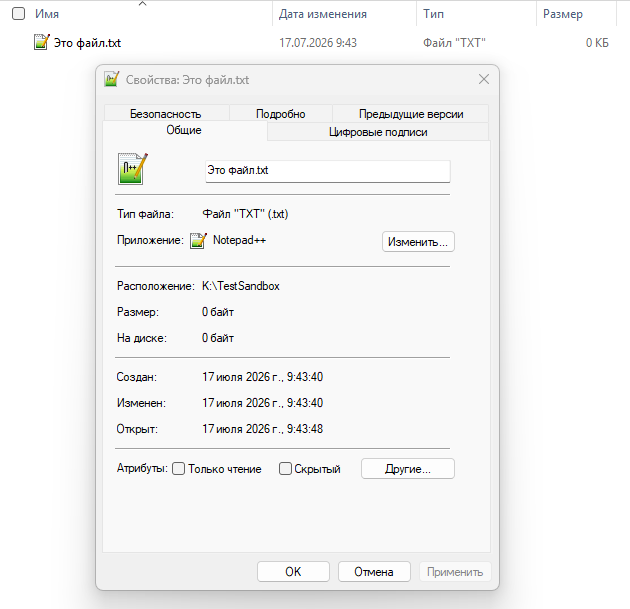
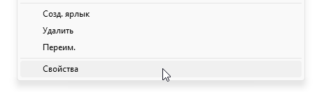
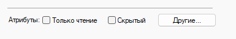
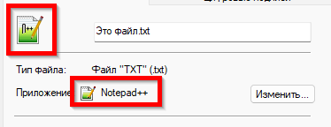
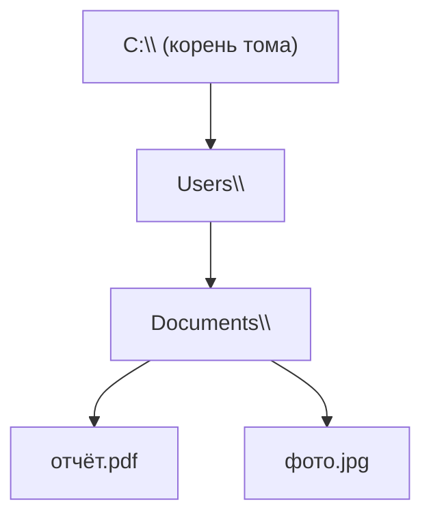

---
tags:
  - all
  - required
  - beginner
title: Файл и каталог
description: >-
  Файл как именованная последовательность байтов на носителе; каталог как узел
  дерева; отличие файла от документа в приложении и от ярлыка.
related:
  - title: "Данные и информация"
    doc: encyclopedia/1-basics/1-09-dannye-i-informatsiya/1
  - title: "Пути и адресация"
    doc: encyclopedia/1-basics/1-11-fayly-katalogi-i-puti/2
  - title: "Манипуляции с данными"
    doc: encyclopedia/1-basics/1-10-bazovye-operatsii-s-dannymi/4
---

# Файл и каталог

  ОБЯЗАТЕЛЬНО
  ДЛЯ НОВИЧКОВ

Всем

В операционной системе есть **файлы** и **каталоги** — единая модель, через которую программы читают и записывают данные на [носителе](/encyclopedia/1-basics/1-08-kak-rabotaet-kompyuter/3).

Это логическая и физическая система - совокупность программ, устройств и хранящихся данных.

---

## Файл

### Что такое файл?

★ **Файл** — именованный набор данных (последовательность байтов), который операционная система хранит на носителе (жестком диске, флешке, SSD) и открывает программам по запросу.

Для пользователя файл - это документ или картинка, а для операционной системы - это цепочка байтов, привязанная к атрибутам.

Файлы можно разделить на несколько основных категорий:
- Текстовые содержат буквы, цифры и символы (документы, электронные таблицы, исходный код программ).
- Мультимедийные хранят визуальную и звуковую информацию (фотографии, музыка, видеоролики).
- Исполняемые содержат программный код и инструкции для запуска приложений и операционной системы.
- Системные используются самой операционной системой для корректной работы вашего компьютера или мобильного устройства.

Файл — **объект файловой системы**. У него есть имя, размер, дата изменения и права доступа. Содержимое — произвольные байты: текст, сжатое изображение, машинный код программы или их смесь.

| Путаница | Пояснение |
|----------|-----------|
| Файл ≠ документ в Word | Документ — то, что вы редактируете в программе; на диске это файл `.docx` (контейнер с XML и ресурсами внутри) |
| Файл ≠ окно на экране | Окно — интерфейс программы; закрыли Word — файл на диске остался |
| Один файл — несколько программ | `.pdf` откроют браузер, Adobe Reader или встроенный просмотрщик ОС — содержимое одно, программы разные |

  
Связь с разделом «Данные»

  

  В [главе про данные](/encyclopedia/1-basics/1-09-dannye-i-informatsiya/1) мы говорили о битах и байтах. <strong>Файл</strong> — способ упаковать байты на диске и дать им имя, чтобы к ним можно было обратиться снова после перезагрузки.
  

---

### Свойства файла

Во всех операционных системах с графическим интерфейсом можно нажать правой кнопкой мыши по файлу и открыть его свойства:

Свойства файла — это максимально широкий набор метаданных о файле, который включает в себя как технические параметры (размер, формат), так и авторские данные (автор документа, исполнитель песни, геометка фото).

Каждая характеристика файла выполняет определённую функцию в процессе управления данными, обеспечения безопасности и организации доступа к информации.

| Свойство | Описание | Пример значения |
|----------|----------|-----------------|
| Имя | Идентификатор файла в каталоге | `document` |
| Расширение | Указание формата содержимого | `.pdf` |
| Полный путь | Иерархия каталогов до файла | `C:\Users\Name\Docs\document.pdf` |
| Тип | Классификация по формату данных | `PDF-документ` |
| Иконка | Графическое представление типа | Значок Adobe Acrobat |
| Размер | Логический объём содержимого | `2,4 МБ` |
| Размер на диске | Физический объём кластеров | `2,5 МБ` |
| Дата создания | Момент генерации файла | `15.03.2024 10:30` |
| Дата изменения | Момент последней модификации | `20.03.2024 14:45` |
| Дата доступа | Момент последнего чтения | `21.03.2024 09:15` |
| Атрибуты | Флаги поведения в системе | `Архивный, Только для чтения` |
| Владелец | Учётная запись создателя | `DOMAIN\User` |
| Группа | Коллектив с общими правами | `Developers` |
| Права доступа | Разрешения на операции | `Чтение, Запись` |
| Хеш | Контрольная сумма целостности | `a1b2c3d4...` |
| Сигнатура | Байты заголовка формата | `%PDF-1.4` |
| Кодировка | Представление текстовых данных | `UTF-8` |
| Ассоциация | Программа для открытия | `Acrobat Reader` |

Свойства файла формируют комплексную модель описания ресурса в операционной системе и обеспечивают управление доступом, целостностью и взаимодействием с данными.

---

### Атрибуты файла

Атрибуты файла — это жестко закодированные системные флаги операционной системы, которые определяют базовые правила поведения файла (например, можно ли его изменять или он является скрытым):

Атрибуты файла представляют собой дополнительные параметры, определяющие свойства и поведение файла в операционной системе. Они хранятся в виде битовых флагов, где каждый атрибут соответствует определённому биту в байте или 32-битном значении.

Основные атрибуты файлов в Windows:

| Атрибут | Обозначение | Определение | Типичное применение |
|---------|-------------|-------------|-------------------|
| **Read-Only** | R | Запрещает модификацию или перезапись файла без предварительного изменения атрибута | Защита важных конфигурационных файлов и документов от случайных изменений |
| **Hidden** | H | Скрывает файл или каталог из стандартного отображения в файловом менеджере | Уменьшение визуального беспорядка, сокрытие системных файлов или пользовательских данных приложений |
| **System** | S | Помечает файл как критически важный для функционирования операционной системы | Защита ключевых системных файлов Windows от случайного удаления или перемещения |
| **Archive** | A | Флаг, устанавливаемый при создании или изменении файла; используется программами резервного копирования для идентификации файлов, требующих архивации | Обеспечение эффективного инкрементального и дифференциального резервного копирования |
| **Not Content Indexed** | I | Исключает файл или каталог из индексации службой поиска Windows | Предотвращение появления временных или конфиденциальных файлов в результатах поиска, повышение производительности индексации |
| **Directory** | D | Указывает, что объект является каталогом, а не обычным файлом | Системная идентификация структуры файловой системы |
| **Temporary** | T | Обозначает файл как временный, предназначенный для краткосрочного использования | Автоматическая очистка системой или приложениями |
| **Compressed** | C | Указывает, что файл сжат для экономии дискового пространства | Оптимизация использования дискового пространства при сохранении целостности данных |
| **Encrypted** | E | Обозначает, что содержимое файла зашифровано файловой системой | Защита конфиденциальных данных от несанкционированного доступа |

---

### Иконка файла

Наш мозг считывает картинки в разы быстрее текста. Посмотрев на иконку с изображением ноты, пользователь сразу понимает, что это аудиофайл. Значок часто отражает статус файла или программу, которая его откроет (например, логотип Word на текстовых документах).

Иконка файла (или значок) — это маленькое графическое изображение в интерфейсе компьютера, смартфона или сайта, которое визуально обозначает конкретный документ, программу или тип данных. Она служит визуальным маркером, помогающим пользователю мгновенно понять, с каким именно объектом он имеет дело, не читая расширение названия (например, .docx, .pdf, .mp3).

Иконка файла представляет собой графическое изображение, которое операционная система отображает в файловых менеджерах и на рабочем столе для визуальной идентификации типа содержимого. 

Щелчок или тап по иконке запускает действие: открывает документ, запускает программу или разворачивает папку.

Когда речь заходит об иконке как о самостоятельном файле изображения, обычно используются следующие форматы:
- `.ico` — стандартный формат для хранения значков в операционной системе Microsoft Windows. Он уникален тем, что может содержать внутри одного файла сразу несколько версий одной картинки в разном разрешении (от 16x16 до 256x256 пикселей).
- `.icns` — аналогичный специализированный формат контейнера для иконок в системе macOS от Apple.
- `.png` / `.svg` — универсальные форматы графики с поддержкой прозрачного фона, которые массово применяются для создания современных иконок в веб-дизайне, мобильных приложениях и интерфейсах Linux.

Отдельным популярным видом иконок является `favicon.ico`. Это миниатюрный логотип сайта, который отображается на вкладке браузера рядом с его названием. Он помогает быстро ориентироваться, если у вас открыты десятки вкладок одновременно.

Изменить иконку для одного конкретного файла напрямую в Windows нельзя, так как система меняет значки сразу для всего типа файлов (например, для всех документов `.txt` или `.docx`). Однако эту проблему можно легко обойти: вам нужно создать ярлык для этого файла и изменить иконку самого ярлыка. Ярлык будет работать точно так же, как исходный файл.

В операционной системе от Apple изменить значок можно для любого файла напрямую, без создания ярлыков. В качестве иконки можно использовать обычную картинку `.png` или `.jpg`.

Самый простой и быстрый способ создать файл формата `.ico` — конвертировать готовую квадратную картинку PNG через бесплатный онлайн-сервис. Чтобы иконка выглядела красиво и не искажалась, исходное изображение должно соответствовать двум правилам:
- Формат PNG с прозрачным фоном — чтобы у иконки не было белого или черного квадрата вокруг объекта.
- Пропорции 1:1 (квадрат) — оптимальный размер исходника от 256x256 до 512x512 пикселей.

---

## Каталог

★ **Каталог (папка, directory, folder)** — именованный контейнер, в котором перечислены имена файлов и вложенных каталогов. Операционная система инкапсулирует физические параметры носителя и предоставляет приложениям единообразный интерфейс для взаимодействия с данными.

> Каталог выступает специальным объектом файловой системы, содержащим таблицу соответствий имён объектам и обеспечивающим древовидную организацию хранилища.

Каталог сам по себе **не хранит** содержимое файлов — он хранит **список имён** и ссылки на них. Вместе файлы и каталоги образуют **дерево**:

- **Корень (root)** — верхний узел дерева на томе (`C:\` в Windows, `/` в Linux).
- **Родительский каталог** — тот, внутри которого лежит объект (`Documents` для `отчёт.pdf`).
- **Дочерний** — вложенный каталог или файл.

Иерархия удобна тем, что тысячи файлов группируются по смыслу — проект, год, тип материала — вместо одной «кучи» имён в одном списке.

---

## Ярлык и ссылка

Ссылки и ярлыки представляют отдельные файлы, указывающие на целевой ресурс через путь или идентификатор. Операционная система обрабатывает ссылки как прозрачный механизм доступа к данным без дублирования содержимого. Ярлыки содержат дополнительные параметры запуска, такие как аргументы командной строки и рабочий каталог.

Не каждый значок в проводнике — отдельный файл с данными.

| Объект | Что это | Удаление |
|--------|---------|----------|
| **Файл** | Байты на диске | Пропадают данные |
| **Ярлык** (`.lnk` в Windows) | Маленький файл-указатель «открыть вот там» | Оригинал остаётся |
| **Жёсткая ссылка (hard link)** | Два имени → одни и те же байты | Пока есть хотя бы одно имя, данные живут |
| **Символическая ссылка (symlink)** | Имя → путь к другому файлу или каталогу | Похоже на ярлык на уровне ОС |

★ **Ярлык** — объект, который **не дублирует** содержимое, а хранит адрес другого файла или программы.

Копирование **ярлыка** не копирует документ — только ссылку. Копирование **файла** создаёт второй набор байтов. Подробнее про операции — [Манипуляции с данными](/encyclopedia/1-basics/1-10-bazovye-operatsii-s-dannymi/4).

Ассоциации программ связывают тип файла с приложением для открытия по умолчанию и определяют поведение при двойном щелчке в файловом менеджере. Операционная система хранит таблицу ассоциаций в системном реестре или конфигурационных файлах. 

Пользователь может изменять ассоциации через настройки программ или свойства файла.

Зависимости файла описывают внешние ресурсы, необходимые для корректного выполнения или интерпретации содержимого. Исполняемые файлы ссылаются на динамические библиотеки, конфигурации и данные среды выполнения. Операционная система разрешает зависимости при загрузке файла в память.

---

## Куда дальше

- Как записывается **адрес** файла в дереве — [Пути и адресация](./2).
- Как ОС понимает **тип** по имени — [Имена, расширения и тип содержимого](./3).
- Практика в проводнике — [Работа с проводником Windows](/encyclopedia/1-basics/1-11-fayly-katalogi-i-puti/221).
