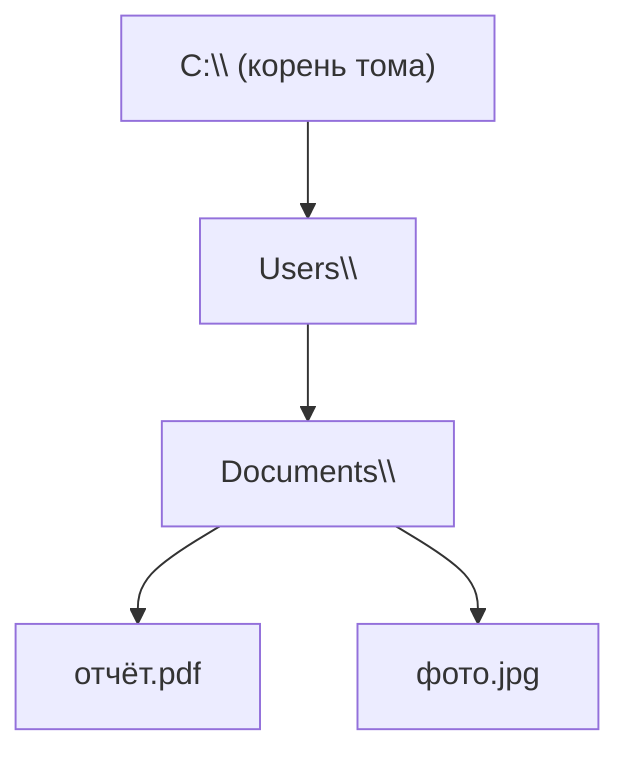

---
tags:
  - all
  - required
  - beginner
title: Файл и каталог
description: >-
  Файл как именованная последовательность байтов на носителе; каталог как узел
  дерева; отличие файла от документа в приложении и от ярлыка.
related:
  - title: "Данные и информация"
    doc: encyclopedia/1-basics/1-09-dannye-i-informatsiya/1
  - title: "Пути и адресация"
    doc: encyclopedia/1-basics/1-11-fayly-katalogi-i-puti/2
  - title: "Манипуляции с данными"
    doc: encyclopedia/1-basics/1-10-bazovye-operatsii-s-dannymi/4
---

# Файл и каталог

  ОБЯЗАТЕЛЬНО
  ДЛЯ НОВИЧКОВ

Всем

Операционная система не хранит «детекст Word» или «фотографию с отпуска» как отдельные сущности вне железа. Для неё есть **файлы** и **каталоги** — единая модель, через которую программы читают и записывают данные на [носителе](/encyclopedia/1-basics/1-08-kak-rabotaet-kompyuter/3).

---

## Файл

★ **Файл** — именованный набор данных (последовательность байтов), который операционная система хранит на носителе и открывает программам по запросу.

Файл — **объект файловой системы**. У него есть имя, размер, дата изменения и права доступа. Содержимое — произвольные байты: текст, сжатое изображение, машинный код программы или их смесь.

| Путаница | Пояснение |
|----------|-----------|
| Файл ≠ документ в Word | Документ — то, что вы редактируете в программе; на диске это файл `.docx` (контейнер с XML и ресурсами внутри) |
| Файл ≠ окно на экране | Окно — интерфейс программы; закрыли Word — файл на диске остался |
| Один файл — несколько программ | `.pdf` откроют браузер, Adobe Reader или встроенный просмотрщик ОС — содержимое одно, программы разные |

  
Связь с разделом «Данные»

  

  В [главе про данные](/encyclopedia/1-basics/1-09-dannye-i-informatsiya/1) мы говорили о битах и байтах. <strong>Файл</strong> — способ упаковать байты на диске и дать им имя, чтобы к ним можно было обратиться снова после перезагрузки.
  

---

## Каталог

★ **Каталог (папка, directory, folder)** — именованный контейнер, в котором перечислены имена файлов и вложенных каталогов.

Каталог сам по себе **не хранит** содержимое файлов — он хранит **список имён** и ссылки на них. Вместе файлы и каталоги образуют **дерево**:

- **Корень (root)** — верхний узел дерева на томе (`C:\` в Windows, `/` в Linux).
- **Родительский каталог** — тот, внутри которого лежит объект (`Documents` для `отчёт.pdf`).
- **Дочерний** — вложенный каталог или файл.

Иерархия удобна тем, что тысячи файлов группируются по смыслу — проект, год, тип материала — вместо одной «кучи» имён в одном списке.

---

## Ярлык и ссылка

Не каждый значок в проводнике — отдельный файл с данными.

| Объект | Что это | Удаление |
|--------|---------|----------|
| **Файл** | Байты на диске | Пропадают данные |
| **Ярлык** (`.lnk` в Windows) | Маленький файл-указатель «открыть вот там» | Оригинал остаётся |
| **Жёсткая ссылка (hard link)** | Два имени → одни и те же байты | Пока есть хотя бы одно имя, данные живут |
| **Символическая ссылка (symlink)** | Имя → путь к другому файлу или каталогу | Похоже на ярлык на уровне ОС |

★ **Ярлык** — объект, который **не дублирует** содержимое, а хранит адрес другого файла или программы.

Копирование **ярлыка** не копирует документ — только ссылку. Копирование **файла** создаёт второй набор байтов. Подробнее про операции — [Манипуляции с данными](/encyclopedia/1-basics/1-10-bazovye-operatsii-s-dannymi/4).

---

## Куда дальше

- Как записывается **адрес** файла в дереве — [Пути и адресация](./2).
- Как ОС понимает **тип** по имени — [Имена, расширения и тип содержимого](./3).
- Практика в проводнике — [Работа с проводником Windows](/encyclopedia/1-basics/1-035-bazovaya-informatika/221).
