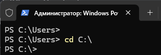

---
tags:
  - all
  - required
  - beginner
title: Пути и адресация
description: >-
  Абсолютный и относительный путь к файлу; соглашения Windows и Unix-подобных
  систем; домашний каталог и типовые расположения данных пользователя.
related:
  - title: "Файл и каталог"
    doc: encyclopedia/1-basics/1-11-fayly-katalogi-i-puti/1
  - title: "Терминал — о разделе"
    doc: encyclopedia/2-system-network/2-05-terminal/intro
---

# Пути и адресация

<div class="article-tags">
  <span class="tag tag-required">ОБЯЗАТЕЛЬНО</span>
  <span class="tag tag-beginner">ДЛЯ НОВИЧКОВ</span>
</div>

<span class="complexity-badge">Всем</span>

Чтобы открыть или сохранить файл, программе и пользователю нужен **путь** — однозначный адрес в дереве каталогов. Один и тот же файл может быть описан по-разному в зависимости от того, **откуда** вы смотрите.

---

## Путь к файлу

Файловая система формирует структуру в виде направленного ациклического графа, где корневой узел служит точкой отсчёта для всех абсолютных адресов. Каждый уровень иерархии добавляет степень вложенности и определяет контекст поиска объектов. Навигация по дереву каталогов опирается на механизмы адресации.

★ **Путь (path)** — адрес файла или каталога в дереве файловой системы: цепочка имён от выбранной точки отсчёта. Это своеобразный «адрес дома», где финал маршрута — сам файл, а промежуточные точки — папки, внутри которых он лежит.

Пример в Windows:

```text
C:\Users\Мария\Documents\2025\отчёт.pdf
```

| Часть пути | Роль |
|------------|------|
| `C:` | Том (логический диск) |
| `Users\Мария\Documents\2025\` | Вложенные каталоги |
| `отчёт.pdf` | Имя файла |

В Linux и macOS разделитель — **прямой слэш** `/`, корень — один символ `/`:

```text
/home/maria/documents/2025/otchet.pdf
```

Полный путь к файлу описывает иерархическую последовательность каталогов от корневого раздела до конкретного файла. 

Иерархическая последовательность каталогов — это структура папок, организованная по принципу «от общего к частному» в виде перевернутого дерева. Каждая папка (каталог) может содержать в себе другие папки (подкаталоги) и файлы, образуя строгую систему подчинения.
- Корень (Корневой каталог). Самая главная, начальная папка, в которую вложены все остальные файлы и каталоги.
- Родительский каталог. Папка, внутри которой находится текущая папка.
- Дочерний каталог (Подкаталог). Папка, которая находится внутри другой папки.

```
C: (Корень)
└── Users (Родительский каталог для "Администратор")
    └── Administrator
        ├── Documents (Подкаталог)
        │   └── report.docx (Файл)
        └── Downloads (Подкаталог)
            └── setup.exe (Файл)
```

В этой последовательности, чтобы добраться до файла `report.docx`, компьютер строго по иерархии спускается сверху вниз: `Корень -> Users -> Administrator -> Documents -> report.docx`.

---

## Абсолютный и относительный путь

★ **Абсолютный путь** начинается от **корня** тома и однозначно указывает объект на этом томе.

★ **Относительный путь** задаётся **от текущего каталога** (рабочей папки программы или окна проводника).

| Тип | Windows (пример) | Unix (пример) |
|-----|------------------|---------------|
| Абсолютный | `C:\Users\Мария\file.txt` | `/home/maria/file.txt` |
| Относительный | `Documents\file.txt` | `documents/file.txt` |

Специальные имена в относительных путях:

| Запись | Значение |
|--------|----------|
| `.` | Текущий каталог |
| `..` | Родительский каталог (на уровень вверх) |

Если вы в `C:\Users\Мария\Documents` и указываете `..\Downloads\setup.exe`, ОС развернёт путь в `C:\Users\Мария\Downloads\setup.exe`.

<div class="callout callout--info">
  <div class="callout-title">Почему это важно программисту</div>
  <div class="callout-body">
  В терминале и скриптах часто работают <strong>относительными</strong> путями — от папки проекта. Команда <code>cd projects</code> меняет текущий каталог; дальше <code>./build/app.exe</code> ищет файл относительно него. Подробнее — в разделе <a href="/encyclopedia/2-system-network/2-05-terminal/intro">Терминал</a>.
  </div>
</div>

---

## Адресация

Адресация в компьютерных технологиях — это способ определения точного местоположения данных, файлов или устройств в системе. В контексте путей и каталогов адресация сообщает операционной системе, по какому именно маршруту нужно пройти в иерархическом дереве, чтобы найти нужный объект.

Адресация использует стандартные обозначения для перемещения между уровнями иерархии:
- Символ `.` указывает на текущий каталог
- Символы `..` обозначают родительский узел
- Разделитель уровней принимает форму косой черты или обратного слеша в зависимости от платформы

```bash
/home/user/documents/report.txt
./config/settings.yaml
../logs/system.log
```

Существует два главных метода адресации файлов:
1. Абсолютная адресация. Указывает полный и уникальный путь к файлу от самого корня системы. Этот адрес не изменится, в какой бы папке вы ни находились.
- В Windows: `C:\Users\Ivan\Documents\Project\data.txt` (Начало от диска `C:`)
- В Linux / macOS: `/var/log/system.log` (Начало от корневого слэша /)
- В Интернете (URL): `https://example.com` (Полный веб-адрес)
2. Относительная адресация. Указывает путь к файлу относительно текущей рабочей папки, в которой сейчас находится программа или пользователь. Этот адрес зависит от контекста.
- В относительной адресации используют специальные символы-указатели:
  - `.` (одна точка) — текущий каталог.
  - `..` (две точки) — родительский каталог (шаг на один уровень вверх).
- Пример работы относительной адресации:
  - Вы находитесь в папке `C:\Games\Warcraft\`.
  - Адрес `.\Warcraft.exe` запустит игру из текущей папки.
  - Адрес `..\Dota\Dota.exe` заставит компьютер выйти на уровень вверх (в папку `Games`) и зайти в соседнюю папку `Dota`.

---

## Корень и домашний каталог

**Корень тома** — вершина дерева на данном разделе (`C:\`, `/`).

Корень, или **Root** - это самый верхний уровень всей файловой системы. У него нет родительских папок, отсюда начинается всё дерево каталогов. В Linux / macOS обозначается одним слэшем `/`. Здесь лежат системные файлы, настройки всей ОС и программы. Обычному пользователю изменять файлы в корне запрещено ради безопасности. В Windows понятию корня соответствует корень системного диска — `C:\`. 

```
/ (КОРЕНЬ ВСЕЙ СИСТЕМЫ)
├── bin (системные программы)
├── etc (системные настройки)
└── home (папка со всеми пользователями)
    ├── alex (домашний каталог Алекса)
    └── ivan (домашний каталог Ивана — для него это "~")
        ├── Documents
        └── Downloads
```

★ **Домашний каталог (home)** — персональная «ветка» пользователя, где по умолчанию лежат его документы, настройки и загрузки. Это личная папка пользователя, внутри которой он имеет полные права: может создавать, удалять и менять любые файлы. У каждого пользователя на компьютере свой домашний каталог.

| ОС | Домашний каталог (типично) |
|----|----------------------------|
| Windows | `C:\Users\<Имя>\` |
| Linux | `/home/<имя>/` |
| macOS | `/Users/<Имя>/` |

Внутри домашнего каталога ОС и программы создают **стандартные папки** — не случайные имена, а соглашение:

| Папка | Назначение |
|-------|------------|
| Documents / Документы | Тексты, таблицы, проекты |
| Downloads / Загрузки | Скачанное из браузера |
| Pictures / Изображения | Фото |
| Desktop / Рабочий стол | Ярлыки и файлы «под рукой» |

«Рабочий стол» в Windows — тоже каталог (`Desktop`), просто показанный отдельно в интерфейсе. Файлы на столе **не висят в воздухе** — они лежат на диске.

---

## Текущий каталог

★ **Текущий каталог (working directory)** — папка, относительно которой программа или оболочка разрешает короткие пути.

Все действия (поиск, создание, удаление файлов), если не указан другой полный адрес, по умолчанию происходят именно внутри этой папки.

- В проводнике «текущий» — та папка, которую вы открыли в окне.
- В терминале его показывает `pwd` (Linux/macOS) или `Get-Location` (PowerShell).
- Программа при «Сохранить» часто предлагает последний использованный каталог или папку проекта.

Смена каталога не перемещает файлы — меняется только **точка отсчёта** для относительных путей.

В путях и командной строке текущий каталог всегда обозначается одной точкой `.`. 

Если вы открыли текстовый редактор Word, начали писать текст и нажали кнопку «Сохранить», программа автоматически предложит вам сохранить файл в текущий каталог. Обычно для программ по умолчанию это папка «Документы». Если вы работаете в командной строке, текущий каталог — это папка, в которой вы сейчас выполняете команды.

Текущий путь всегда написан слева от мигающего курсора (например, `C:\Users\User>`). Также можно ввести команду `cd` без параметров.



В Linux / macOS введите команду `pwd` (Print Working Directory). Она выведет на экран полный путь, например: `/home/user/projects`.


---

## Куда дальше

- Разделы и буква `C:` — [Разделы носителя и файловая система](./4).
- Поиск файлов по содержимому — [поиск в терминале](/encyclopedia/2-system-network/2-05-terminal/104).
