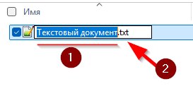
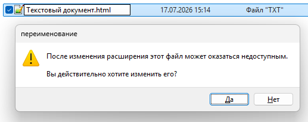
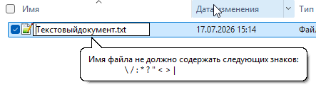
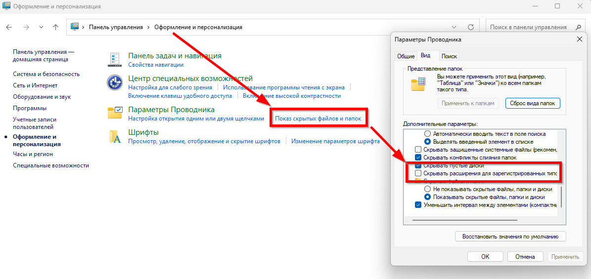

---
tags:
  - all
  - required
  - beginner
title: Имена, расширения и тип содержимого
description: >-
  Имя файла, расширение, MIME-тип и сигнатура содержимого; скрытые файлы;
  риски переименования расширения.
related:
  - title: "Исполняемые файлы — о разделе"
    doc: encyclopedia/1-basics/1-20-ispolnyaemye-fayly-i-arhivy/intro
  - title: "Текст"
    doc: encyclopedia/1-basics/1-15-tekst/1
---

# Имена, расширения и тип содержимого

  ОБЯЗАТЕЛЬНО
  ДЛЯ НОВИЧКОВ

Всем

Имя файла — то, что видит пользователь. Операционная система и программы по имени **угадывают**, как интерпретировать байты внутри. Это удобно, но создаёт типичные ошибки — особенно когда расширение скрыто или переименовано «на глаз».

---

## Имя файла

Имя файла содержит пользовательский идентификатор и дополнительное расширение, отделяемое символом точки. 

На примере файла `report.docx`:
- Собственное имя (`report`) — придумывает пользователь, чтобы понимать, что находится внутри.
- Точка (`.`) — технический разделитель.
- Расширение (`docx`) — указывает на формат файла. Оно подсказывает операционной системе, какая программа должна открыть этот файл (в данном случае — Microsoft Word).

Осторожнее с переименованием - фокусируйтесь на собственном имени (1), ведь если изменить расширение (2), то файл может оказаться недоступным.

Имя файла может включать буквы, цифры, пробелы и специальные символы в зависимости от ограничений конкретной файловой системы. В разных операционных системах действуют свои правила для создания имен:
- Уникальность — в одной папке не может быть двух файлов с абсолютно одинаковыми именами и расширениями.
- Запрещенные символы — в Windows имя файла не может содержать знаки: `\`, `/`, `:`, `*`, `?`, `"`, `<`, `>`, `|`. В Linux и macOS запрещен только слэш `/`.
- Регистр букв — в Windows файлы `Document.txt` и `document.txt` — это один и тот же файл. В Linux это будут два разных файла.
- Длина — максимальная длина имени файла в большинстве современных систем составляет 255 символов.

Операционная система использует имя файла как ключ для поиска и доступа к данным в структуре каталогов.

Рекомендации:

- используйте **латиницу или кириллицу** последовательно в одном проекте (для веба и Git чаще латиница и `-` вместо пробелов);
- избегайте символов, запрещённых в Windows: `\ / : * ? " < > |`;
- не оставляйте «Новый документ (3)» — через месяц вы не вспомните содержимое;
- дату удобно ставить **ISO**: `2025-07-01_отчёт.docx`.

Ограничение длины зависит от файловой системы (NTFS — до 255 символов на компонент имени). Для обычной работы достаточно коротких осмысленных имён.

Когда операционная система ищет файл на компьютере, она объединяет путь к файлу и его имя в единую строку. Это называется полным именем файла.

Пример: `C:\Users\Ivan\Documents\report.docx`

---

## Расширение имени

Расширение файла составляет последовательность символов, отделяемую от имени точкой и указывающую на формат или тип содержимого.

Расширение определяет ассоциированный формат содержимого и направляет операционную систему к подходящему обработчику. 

★ **Расширение (extension)** — суффикс после последней точки в имени (`.txt`, `.pdf`, `.exe`), по которому ОС выбирает **программу по умолчанию**.

| Расширение | Типичное содержимое | Программа по умолчанию (пример) |
|------------|---------------------|----------------------------------|
| `.txt` | Простой текст | Блокнот |
| `.docx` | Документ Office | Word |
| `.pdf` | PDF-документ | Браузер, Reader |
| `.jpg`, `.png` | Изображение | Просмотр фото |
| `.mp3`, `.mp4` | Аудио / видео | Плеер |
| `.zip` | Архив | Архиватор |
| `.exe`, `.msi` | Установщик / программа Windows | Запуск (осторожно!) |

**Расширение — подсказка, а не доказательство.** Переименование `notes.txt` → `notes.html` **не превращает** текст в вёрстку — меняется только то, **какая программа** откроет файл первой. Содержимое байтов остаётся прежним, пока вы не пересохраните его в другом формате.

В Windows расширения часто **скрыты** («Скрывать расширения для зарегистрированных типов») — тогда `report.pdf.exe` может выглядеть как `report.pdf`. Показ расширений и осторожность с `.exe` — базовая [цифровая гигиена](/encyclopedia/1-basics/1-12-tsifrovye-ugrozy-i-model-zashchity/5).

Microsoft сделала это ради «чистоты» интерфейса и безопасности, чтобы пользователи случайно не удалили расширение (например, не переименовали `photo.jpg` в `photo` и не сломали ассоциацию с программой). Однако для работы, программирования или защиты от вирусов (которые могут маскироваться, имея двойное расширение вроде `virus.txt.exe`) отображение расширений необходимо включить.

После этого вы сразу увидите, что за каждым файлом закрепился его «хвост» (например, `.txt`, `.mp4`, `.exe`), и сможете вручную менять формат файла при обычном переименовании.

---

## Метаданные и атрибуты файла

Метаданные сопровождают каждый объект и фиксируют атрибуты, обеспечивающие контроль целостности и безопасности.

Основные категории метаданных включают:
- Временные метки создания, последнего доступа и модификации
- Идентификаторы владельца и групповой принадлежности
- Механизмы контроля доступа, определяющие права чтения, записи и выполнения
- Специальные атрибуты, задающие режимы отображения, архивирования и системного использования

Системные атрибуты файла определяют поведение ресурса в операционной системе и включают флаги «Только для чтения», «Скрытый», «Системный» и «Архивный». 
- Атрибут «Только для чтения» запрещает модификацию содержимого без изменения свойств.
- Атрибут «Скрытый» исключает файл из стандартного отображения в файловых менеджерах.
- Атрибут «Системный» маркирует критические компоненты операционной системы.
- Атрибут «Архивный» указывает на необходимость резервного копирования после изменения.

Помимо битовых атрибутов, файл содержит следующие системные метаданные:

- **Дата и время создания** — момент первоначального создания файла в файловой системе. Дата и время создания фиксируют момент первичной генерации файла в файловой системе. Операционная система сохраняет эту метку при создании нового файла и не изменяет её при последующих модификациях содержимого. Метка создания используется для сортировки, фильтрации и аудита изменений в структуре данных.
- **Дата и время последней модификации** — момент последнего изменения содержимого файла. Дата и время последнего изменения обновляются при каждой модификации содержимого файла. Операционная система автоматически регистрирует эту метку при сохранении данных, переименовании или изменении атрибутов. Метка изменения служит индикатором актуальности информации и применяется в процессах синхронизации и резервного копирования.
- **Дата и время последнего доступа** — момент последнего чтения или выполнения файла. Дата и время последнего доступа фиксируют момент чтения или открытия файла для просмотра содержимого. Некоторые операционные системы отключают обновление этой метки по умолчанию для повышения производительности дисковых операций. Метка доступа применяется в системах аудита, аналитике использования и оптимизации кэширования.
- **Размер файла** — объём данных, занимаемых файлом на носителе
- **Владелец и права доступа** — информация о пользователе, создавшем файл, и разрешениях на операции с ним. Владелец файла представляет учётную запись пользователя или процесса, создавшего ресурс в файловой системе. Владелец обладает полномочиями на изменение прав доступа, атрибутов и удаление файла. Операционная система регистрирует владельца для аудита действий и применения политик безопасности. Права доступа регулируют возможности чтения, записи и выполнения файла для владельца, группы и остальных пользователей. Операционная система применяет модель разрешений для обеспечения безопасности данных и предотвращения несанкционированного доступа. Права доступа настраиваются через интерфейс свойств файла или командные утилиты управления разрешениями.

Не все файловые системы поддерживают идентичный набор атрибутов.
- Файловая система NTFS, используемая в современных версиях Windows, предоставляет расширенный набор атрибутов, включая read-only, hidden, system и archive.
- Файловые системы семейства FAT обладают более ограниченным набором флагов.
- В Unix-подобных операционных системах применяется иная модель атрибутов, основанная на правах доступа (permissions) и владении (ownership), где скрытые файлы определяются не отдельным атрибутом, а именем, начинающимся с точки.

---

## MIME и сигнатура содержимого

Сигнатура файла составляет последовательность байтов в заголовке содержимого, идентифицирующую формат данных независимо от расширения. Операционная система и приложения анализируют сигнатуру для корректного определения типа файла и предотвращения ошибок открытия. Сигнатура обеспечивает надёжную классификацию ресурсов при работе с неизвестными или переименованными файлами.

Когда файл передаётся по сети или открывается нестандартной программой, одного расширения мало.

★ **MIME-тип** — строка вроде `text/plain`, `image/jpeg`, `application/pdf`, описывающая тип данных для HTTP и почты.

★ **Сигнатура (magic bytes)** — первые байты файла, по которым программа **узнаёт** формат независимо от имени.

| Файл | Начало (hex / текст) | Формат |
|------|----------------------|--------|
| PNG | `89 50 4E 47` | Изображение PNG |
| PDF | `%PDF` | PDF |
| ZIP | `PK` | ZIP-архив (и docx/xlsx — тоже ZIP внутри) |

Поэтому переименованный `.exe` в `.txt` антивирус и опытный пользователь всё равно могут распознать по содержимому. Подробнее про форматы — [Исполняемые файлы и архивы](/encyclopedia/1-basics/1-20-ispolnyaemye-fayly-i-arhivy/intro), [Текст](/encyclopedia/1-basics/1-15-tekst/1).

Кодировка файла определяет способ представления текстовых данных в байтовой последовательности и включает стандарты UTF-8, UTF-16, ASCII и другие. Операционная система использует информацию о кодировке для корректного отображения символов различных языков и алфавитов. Локализация файла указывает региональные настройки формата даты, времени и числовых значений.

Контрольная сумма и хеш файла представляют криптографические значения, вычисляемые на основе содержимого для проверки целостности данных. Операционная система или сторонние утилиты используют хеш для обнаружения изменений, верификации загрузки и защиты от повреждения. Популярные алгоритмы включают MD5, SHA-1 и SHA-256.

---

## Скрытые и системные файлы

Скрытые и системные файлы — это особые категории файлов, которые операционная система прячет от пользователя при обычном просмотре папок. Это сделано для того, чтобы защитить важные данные от случайного удаления или изменения, которые могут нарушить работу компьютера.

ОС и программы создают файлы, которые **не предназначены** для ручного редактирования:

- в Windows — атрибут **Hidden** (`desktop.ini`, кэши);
- в Linux/macOS — имена, начинающиеся с **точки** (`.bashrc`, `.config`).

Их прячут, чтобы не засорять проводник и чтобы случайно не удалить настройки. Показ скрытых файлов включают в параметрах проводника или «Показать скрытые файлы» — но удалять незнакомое без понимания рискованно.

Операционная система предоставляет средства для контроля и изменения атрибутов файлов через графический интерфейс, командную строку или программные интерфейсы. В Windows для просмотра и изменения атрибутов используются команды `attrib` в командной строке или свойства файла в проводнике. В Linux-системах аналогичные операции выполняются командами `chmod`, `chattr` и `lsattr`.

Атрибуты могут комбинироваться: один файл может одновременно обладать несколькими флагами, например, быть одновременно скрытым и доступным только для чтения.

---

## Куда дальше

- Как байты лежат на диске — [Разделы носителя и файловая система](./4).
- Кодировки текста внутри `.txt` — [Текст](/encyclopedia/1-basics/1-15-tekst/1).
