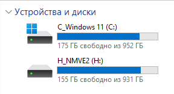
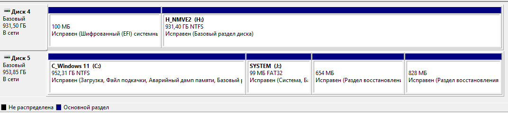
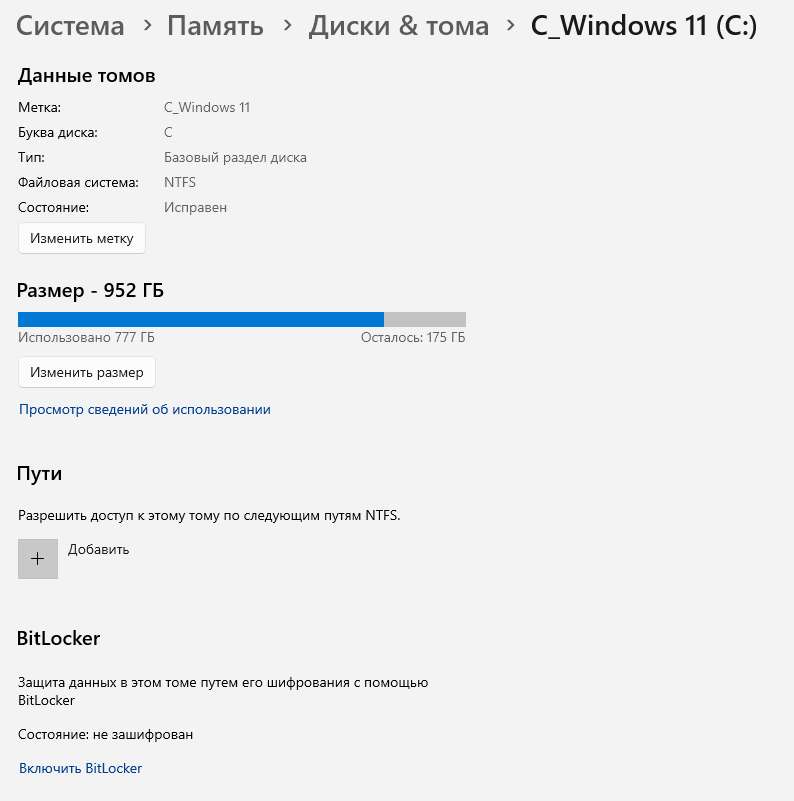
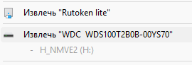
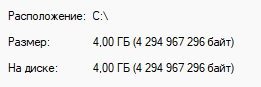

---
tags:
  - all
  - required
  - beginner
title: Разделы носителя и файловая система
description: >-
  Цепочка «физический носитель → раздел → файловая система → дерево файлов»;
  буква диска в Windows; монтирование — обзор.
related:
  - title: "Устройства хранения данных"
    doc: encyclopedia/1-basics/1-08-kak-rabotaet-kompyuter/3
  - title: "Операционная система — о разделе"
    doc: encyclopedia/2-system-network/2-01-operatsionnaya-sistema/intro
---

# Разделы носителя и файловая система

  ОБЯЗАТЕЛЬНО
  ДЛЯ НОВИЧКОВ

Всем

Проводник показывает `C:\Users\...`, но за этим стоят **физический носитель**, **раздел** и **файловая система**. Понимание цепочки помогает не путать «диск полный» с «флешка не открывается» и объясняет, почему один USB иногда виден только на Windows, а другой — везде.
- Физический носитель проходит процедуру разметки и форматирования для поддержки выбранной файловой системы.
- Таблицы размещения файлов организуют кластеры и обеспечивают эффективное использование пространства.
- Журналирование транзакций сохраняет последовательность операций и гарантирует восстановление согласованного состояния после аварийных отключений.

---

## Уровни организации хранения

Уровни организации хранения данных — это иерархическая структура, которая определяет, как информация распределяется на компьютере.

| Уровень | Вопрос | Пример |
|---------|--------|--------|
| **Носитель** | Где физически байты? | SSD в ноутбуке, USB-флешка |
| **Раздел** | Как разбит носитель на логические области? | Раздел с `C:`, раздел «Recovery» |
| **Файловая система** | Как внутри раздела хранятся имена и дерево? | NTFS, exFAT, ext4 |
| **Файл / каталог** | Что видит пользователь? | `Documents\report.pdf` |

Подробнее про HDD, SSD, MBR и GPT — [Устройства хранения данных](/encyclopedia/1-basics/1-08-kak-rabotaet-kompyuter/3). Здесь — **логическая** картина: от железа к папкам в проводнике.

---

## Раздел и буква диска

★ **Раздел (partition, том)** — непрерывная область на носителе, которую ОС может отформатировать и смонтировать как отдельное «хранилище».
- Раздел (Partition) — это понятие физической разметки. Вы делите один физический диск на части (например, раздел под систему и раздел под файлы).
- Том (Volume) — это понятие логической структуры. Это раздел, который уже отформатирован в определенную файловую систему (NTFS, FAT32, exFAT) и готов к работе. Том может занимать один раздел, а может объединять в себе части разных физических дисков.

Если диск поделен на `C:` (система) и `D:` (файлы), то при поломке Windows или macOS можно отформатировать диск `C:`. Ваши фото, игры и документы на диске `D:` при этом не пострадают.

На одном диске можно создать один раздел для Windows (NTFS), а второй — для Linux (ext4). Можно поставить две разные ОС на один компьютер, выделив каждой свой изолированный раздел.

На одном физическом SSD часто несколько разделов:

| Раздел (типично в Windows) | Назначение |
|----------------------------|------------|
| EFI System | Загрузчик UEFI |
| `C:` | Система и программы |
| Recovery | Восстановление от производителя |
| D: (если есть) | Данные пользователя |

В Windows пользователю показывают **букву тома** (`C:`, `D:`) — это **точка входа** в уже смонтированный раздел с файловой системой. Буква — соглашение Windows; в Linux тот же раздел может быть `/dev/nvme0n1p2` и монтироваться в `/`.

Когда вы покупаете новый компьютер с диском на 1000 ГБ, производитель обычно делает так:
- Раздел 1 (скрытый, ~500 МБ) — системный раздел для загрузки компьютера.
- Раздел 2 (Локальный диск `C:`, ~200 ГБ) — том для операционной системы и программ.
- Раздел 3 (Локальный диск `D:`, ~750 ГБ) — том для личных файлов пользователя.

**Форматирование** раздела создаёт на нём **пустую** файловую систему и стирает прежнее дерево файлов. Это не «починка диска», а уничтожение данных на этом разделе — перед форматированием нужны [резервные копии](/encyclopedia/1-basics/1-12-tsifrovye-ugrozy-i-model-zashchity/6).

Форматирование — это процесс разметки области хранения данных (жесткого диска, SSD, флешки) и создания на ней новой файловой системы. Два основных типа форматирования^
1. Быстрое (Quick Format).
- Очищает только «содержание» (оглавление) диска.
- Сами файлы физически остаются на месте, но система теперь видит эти ячейки как пустые и готовые для новой записи.
- Занимает всего несколько секунд.
2. Полное (Full Format).
- Полностью стирает все данные, перезаписывая ячейки нулями.
- Дополнительно проверяет диск на наличие поврежденных секторов (bad sectors) и изолирует их, чтобы компьютер туда ничего не записывал.
- Занимает много времени (от минут до часов).

При запуске форматирования компьютер всегда предлагает выбрать файловую систему.

---

## Файловая система

★ **Файловая система (ФС)** — правила, по которым ОС размещает файлы и каталоги внутри раздела: имена, метаданные (размер, даты), учёт свободного места, журнал изменений, права доступа.

ФС отвечает на вопросы:

- куда записать байты нового файла;
- как найти файл по имени `report.pdf`;
- что остаётся после удаления (см. [главу 5](./5));
- какие имена и размеры файлов допустимы.

| ФС | Где чаще встречается | Кратко |
|----|----------------------|--------|
| **NTFS** | Внутренние диски Windows | Большие файлы, права, журнал |
| **FAT32** | Старые флешки, карты памяти | Простая, лимит ~4 ГБ на файл |
| **exFAT** | Современные флешки, карты | Без лимита 4 ГБ, удобна для обмена между ОС |
| **ext4** | Linux | Стандарт для дисков Linux |
| **APFS** | macOS | Современная ФС Apple |

Один раздел — **одна** основная ФС (после форматирования). Поменять ФС без потери данных «одной кнопкой» нельзя — нужно копирование на другой носитель или специальные инструменты.

  
Глубже — в разделе про ОС

  

  Журналирование NTFS, ACL, inode в ext4, сравнение ФС подробно — в <a href="/encyclopedia/2-system-network/2-01-operatsionnaya-sistema/intro">Операционная система</a> (раздел 2).
  

- Абстракция файловой системы инкапсулирует аппаратные особенности контроллеров, геометрию секторов и протоколы передачи данных.
- Драйверы устройств транслируют логические запросы в электрические сигналы, обеспечивая прозрачный доступ приложений к хранилищу.
- Операционная система кэширует часто используемые блоки и управляет очередями ввода-вывода для поддержания высокой пропускной способности.

---

## Монтирование

★ **Монтирование (mount)** — подключение раздела с файловой системой к **дереву каталогов** работающей ОС, чтобы пользователь и программы видели файлы.

Простыми словами: пока раздел диска не примонтирован, компьютер видит устройство физически, но не понимает, как с ним работать. Монтирование делает этот раздел видимым и доступным для чтения и записи.

| ОС | Как выглядит |
|----|--------------|
| **Windows** | Буква `C:`, `D:` появляется в «Этот компьютер»; флешка — новая буква (например `E:`) |
| **Linux / macOS** | Раздел «привязывают» к папке: `/`, `/home`, `/Volumes/USB` |

В Windows - автоматически, процесс скрыт от пользователя. Когда вы вставляете флешку, Windows автоматически монтирует её и назначает ей букву (например, D: или E:). В этот момент флешка появляется в окне «Этот компьютер».

Диски и тома можно изучать через параметры системы.

В Linux и macOS используется точка монтирования. Здесь нет букв дисков. Все устройства подключаются к одной общей структуре папок. Папка, к которой привязывается раздел, называется точкой монтирования (обычно это папки в каталогах `/media`, `/mnt` или `/Volumes`).

Представьте, что жесткий диск — это съемная комната (раздел с файлами), а операционная система — это коридор дома.
- Монтирование — это процесс, когда вы приставляете комнату к коридору и прорубаете дверь. Теперь вы можете заходить внутрь и брать вещи (файлы).
- Размонтирование (безопасное извлечение) — это закрытие двери на замок и отсоединение комнаты. Это нужно, чтобы данные не повредились, если вы резко выдернете провод.

Пока раздел **не смонтирован**, проводник его не показывает как дерево папок — даже если раздел существует на диске. Отключение ( **unmount**, «Извлечь») сначала сбрасывает буферы записи, затем убирает том из дерева — так данные на флешке не повреждаются при вытаскивании.

**Съёмный носитель** (USB) — тот же носитель → раздел → ФС, только монтируется на время подключения. Если флешка «не читается», причина может быть на любом уровне: контакт, битая ФС, несовместимая ФС (например APFS на Windows без драйвера).

---

## Размер файла

Размер файла — это объем цифровых данных, которые он содержит, или количество памяти, которое он занимает на носителе информации (жестком диске, флешке или в облаке). Простыми словами, это «вес» файла, который зависит от количества информации внутри него: чем больше в документе текста, картинок или минут видео, тем больше его размер.

Компьютеры измеряют информацию в двоичной системе. Минимальная единица — это бит (0 или 1), но размер файлов всегда указывается в более крупных единицах:
- Байт (Б / B) — базовая единица, состоит из 8 бит. Примерно равен одному символу текста.
- Килобайт (КБ / KB) — 1024 байта. Столько весит короткое текстовое письмо.
- Мегабайт (МБ / MB) — 1024 килобайта. Обычная песня или фотография на телефон весят 3–8 МБ.
- Гигабайт (ГБ / GB) — 1024 мегабайта. В них измеряют фильмы (1,5–5 ГБ) или тяжелые игры (20–100+ ГБ).
- Терабайт (ТБ / TB) — 1024 гигабайта. Объем современных жестких дисков для хранения архивов.

Фактический размер на диске может отличаться от логического размера содержимого из-за выравнивания по кластерам файловой системы. 

Операционная система отслеживает размер файла для управления квотами, оптимизации размещения и расчёта свободного пространства.

Если открыть свойства файла в операционной системе (например, в Windows), можно увидеть два разных параметра:
- Размер (Size) — это чистый, фактический объем данных, из которых состоит файл.
- Размер на диске (Size on disk) — это место, которое файл реально занял в файловой системе. Диск разделен на фиксированные ячейки — кластеры (секторы). Если файл меньше размера кластера, он все равно занимает его целиком, из-за чего «Размер на диске» часто оказывается чуть больше реального.

Размер на диске отражает физический объём кластеров, выделенных файловой системой для хранения файла. Кластер представляет минимальную единицу выделения пространства, поэтому файл малого размера занимает целый кластер. Разница между логическим размером и размером на диске увеличивается при работе с множеством мелких файлов.

---

## Физическое повреждение носителя

Файл уничтожится, если физическое повреждение затронет ту часть носителя, где записаны его данные или системная информация о его расположении. Однако результат зависит от типа носителя и степени его повреждения.
- Жесткие диски (HDD): Данные записаны на магнитных пластинах. Если поцарапать пластину, файлы в зоне царапины исчезнут навсегда. Если сломается считывающая головка или плата электроники, файлы уцелеют — их смогут восстановить специалисты в лаборатории, переставив пластины в донорский диск.
- Флешки и SSD: Данные хранятся в микросхемах памяти. Если сломался пластиковый корпус или USB-разъем, данные целы. Но если треснула или сгорела сама кремниевая микросхема памяти, файлы уничтожаются мгновенно и безвозвратно.
- Оптические диски (CD/DVD): Данные выжжены лазером на тонком зеркальном слое. Глубокая царапина со стороны этикетки (где находится этот слой) уничтожает файл навсегда. Царапина на толстом прозрачном пластике снизу просто мешает лазеру прочесть данные — такой диск часто можно отполировать и спасти файлы.

Операционная система делит файл на мелкие кусочки (кластеры) и разбрасывает их по носителю.
- Если удар пришелся на пустую область диска, файлы не пострадают.
- Если поврежден кусочек файла, он может открыться, но с ошибками (например, у картинки пропадет нижняя половина, а в песне появится шум).
- Если повреждена таблица файлов (индекс, где записаны имена и адреса), компьютер «ослепнет» и перестанет видеть все файлы сразу, хотя физически они еще будут лежать на диске. Специальные программы часто могут их восстановить.

Файлы восстанавливают двумя путями: программным (если носитель физически исправен) и аппаратным (если устройство разбито, сгорело или утонуло).В основе любого восстановления лежит главный секрет компьютеров: при удалении файла или форматировании данные не стираются с диска мгновенно — операционная система просто стирает «указатель» на этот файл и помечает это место как свободное для новой записи.

Если вы потеряли данные, нельзя ничего записывать на этот носитель и нежелательно скачивать на него программы для восстановления. Новые данные могут записаться поверх удаленных файлов, и тогда их уничтожение станет окончательным.

---

## Куда дальше

- Пути внутри смонтированного дерева — [Пути и адресация](./2).
- Жизненный цикл файла на ФС — [Организация данных и жизненный цикл файла](./5).
