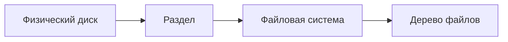

---
tags:
  - all
  - required
  - beginner
title: Разделы носителя и файловая система
description: >-
  Цепочка «физический носитель → раздел → файловая система → дерево файлов»;
  буква диска в Windows; монтирование — обзор.
related:
  - title: "Устройства хранения данных"
    doc: encyclopedia/1-basics/1-08-kak-rabotaet-kompyuter/3
  - title: "Операционная система — о разделе"
    doc: encyclopedia/2-system-network/2-01-operatsionnaya-sistema/intro
---

# Разделы носителя и файловая система

  ОБЯЗАТЕЛЬНО
  ДЛЯ НОВИЧКОВ

Всем

Проводник показывает `C:\Users\...`, но за этим стоят **физический носитель**, **раздел** и **файловая система**. Понимание цепочки помогает не путать «диск полный» с «флешка не открывается» и объясняет, почему один USB иногда виден только на Windows, а другой — везде.

---

## Уровни организации хранения

| Уровень | Вопрос | Пример |
|---------|--------|--------|
| **Носитель** | Где физически байты? | SSD в ноутбуке, USB-флешка |
| **Раздел** | Как разбит носитель на логические области? | Раздел с `C:`, раздел «Recovery» |
| **Файловая система** | Как внутри раздела хранятся имена и дерево? | NTFS, exFAT, ext4 |
| **Файл / каталог** | Что видит пользователь? | `Documents\report.pdf` |

Подробнее про HDD, SSD, MBR и GPT — [Устройства хранения данных](/encyclopedia/1-basics/1-08-kak-rabotaet-kompyuter/3). Здесь — **логическая** картина: от железа к папкам в проводнике.

---

## Раздел и буква диска

★ **Раздел (partition, том)** — непрерывная область на носителе, которую ОС может отформатировать и смонтировать как отдельное «хранилище».

На одном физическом SSD часто несколько разделов:

| Раздел (типично в Windows) | Назначение |
|----------------------------|------------|
| EFI System | Загрузчик UEFI |
| `C:` | Система и программы |
| Recovery | Восстановление от производителя |
| D: (если есть) | Данные пользователя |

В Windows пользователю показывают **букву тома** (`C:`, `D:`) — это **точка входа** в уже смонтированный раздел с файловой системой. Буква — соглашение Windows; в Linux тот же раздел может быть `/dev/nvme0n1p2` и монтироваться в `/`.

**Форматирование** раздела создаёт на нём **пустую** файловую систему и стирает прежнее дерево файлов. Это не «починка диска», а уничтожение данных на этом разделе — перед форматированием нужны [резервные копии](/encyclopedia/1-basics/1-12-tsifrovye-ugrozy-i-model-zashchity/6).

---

## Файловая система

★ **Файловая система (ФС)** — правила, по которым ОС размещает файлы и каталоги внутри раздела: имена, метаданные (размер, даты), учёт свободного места, журнал изменений, права доступа.

ФС отвечает на вопросы:

- куда записать байты нового файла;
- как найти файл по имени `report.pdf`;
- что остаётся после удаления (см. [главу 5](./5));
- какие имена и размеры файлов допустимы.

| ФС | Где чаще встречается | Кратко |
|----|----------------------|--------|
| **NTFS** | Внутренние диски Windows | Большие файлы, права, журнал |
| **FAT32** | Старые флешки, карты памяти | Простая, лимит ~4 ГБ на файл |
| **exFAT** | Современные флешки, карты | Без лимита 4 ГБ, удобна для обмена между ОС |
| **ext4** | Linux | Стандарт для дисков Linux |
| **APFS** | macOS | Современная ФС Apple |

Один раздел — **одна** основная ФС (после форматирования). Поменять ФС без потери данных «одной кнопкой» нельзя — нужно копирование на другой носитель или специальные инструменты.

  
Глубже — в разделе про ОС

  

  Журналирование NTFS, ACL, inode в ext4, сравнение ФС подробно — в <a href="/encyclopedia/2-system-network/2-01-operatsionnaya-sistema/intro">Операционная система</a> (раздел 2).
  

---

## Монтирование

★ **Монтирование (mount)** — подключение раздела с файловой системой к **дереву каталогов** работающей ОС, чтобы пользователь и программы видели файлы.

| ОС | Как выглядит |
|----|--------------|
| **Windows** | Буква `C:`, `D:` появляется в «Этот компьютер»; флешка — новая буква (например `E:`) |
| **Linux / macOS** | Раздел «привязывают» к папке: `/`, `/home`, `/Volumes/USB` |

Пока раздел **не смонтирован**, проводник его не показывает как дерево папок — даже если раздел существует на диске. Отключение ( **unmount**, «Извлечь») сначала сбрасывает буферы записи, затем убирает том из дерева — так данные на флешке не повреждаются при вытаскивании.

**Съёмный носитель** (USB) — тот же носитель → раздел → ФС, только монтируется на время подключения. Если флешка «не читается», причина может быть на любом уровне: контакт, битая ФС, несовместимая ФС (например APFS на Windows без драйвера).

---

## Куда дальше

- Пути внутри смонтированного дерева — [Пути и адресация](./2).
- Жизненный цикл файла на ФС — [Организация данных и жизненный цикл файла](./5).
