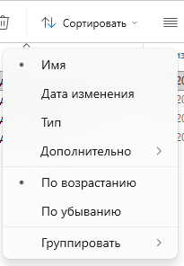
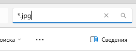
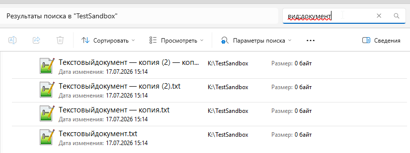
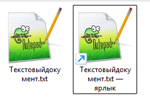
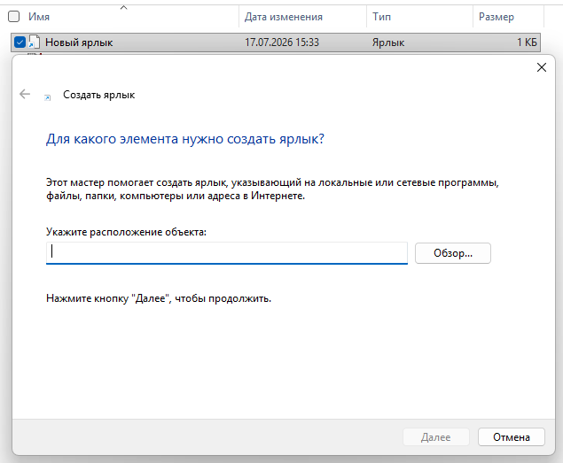
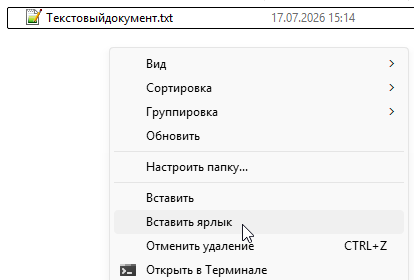

---
tags:
  - all
  - required
  - beginner
title: Организация данных и жизненный цикл файла
description: >-
  Именование и структура каталогов; корзина и удаление; поиск; ярлыки и ссылки;
  версии файла — концепция.
related:
  - title: "Манипуляции с данными"
    doc: encyclopedia/1-basics/1-10-bazovye-operatsii-s-dannymi/4
  - title: "Обмен данными и совместный доступ — о разделе"
    doc: encyclopedia/1-basics/1-14-obmen-dannymi-i-sovmestnyy-dostup/intro
---

# Организация данных и жизненный цикл файла

<div class="article-tags">
  <span class="tag tag-required">ОБЯЗАТЕЛЬНО</span>
  <span class="tag tag-beginner">ДЛЯ НОВИЧКОВ</span>
</div>

<span class="complexity-badge">Всем</span>

Файл на диске проходит путь от **создания** до **удаления или архивации**. Как вы раскладываете папки и как называете файлы, определяет, найдёте ли вы документ через полгода и не потеряете ли его при «уборке».

Система предоставляет стандартизированный набор операций для управления жизненным циклом данных.
- Чтение извлекает последовательность байтов с носителя в оперативную память процесса.
- Запись фиксирует изменения и обновляет кластеры хранения.
- Создание формирует новый объект с выделением метаданных и начальных ресурсов.
- Удаление освобождает логические ссылки и помечает физические блоки доступными для последующего использования.

---

## Организация каталогов

Организация каталогов — это структурирование папок и файлов на диске по определенным правилам для быстрого поиска информации, удобного резервного копирования и поддержания порядка.

Плохая организация превращает диск в «свалку», где на поиск нужного документа уходят часы. Хорошая организация позволяет найти любой файл за три клика.

```
~ (Домашний каталог)
├── 01_Работа (или Учеба)
│   ├── Проект_Альфа
│   │   ├── Договоры
│   │   └── Макеты
│   └── Проект_Бета
├── 02_Личное
│   ├── Финансы (налоги, чеки)
│   └── Здоровье (анализы, рецепты)
├── 03_Медиа
│   ├── Фото (разбито по годам: 2025, 2026)
│   └── Музыка
└── 04_Архив (старые проекты, которые жалко удалить)

```

Цифры в начале названий (`01_`, `02_`) используются специально, чтобы зафиксировать папки в нужном вам порядке сортировки, а не по алфавиту.

Организация каталогов строится вокруг этапов работы с контентом:

```
D:\Work
├── 1_Входящие (исходники от клиентов, ТЗ)
├── 2_В_работе (текущие открытые проекты)
├── 3_На_согласовании (то, что ждет ответа правки)
└── 4_Готово (финальные версии для отправки)

```

Хорошая структура повторяет **смысл работы**, а не хаос на рабочем столе.

| Принцип | Пример |
|---------|--------|
| **Один проект — одна папка** | `2025-отчёт-финансы\`, внутри `черновики\`, `финал\`, `исходники\` |
| **Дата в имени** | `2025-07-01_протокол.docx` — сортируется по алфавиту хронологически |
| **Не смешивать типы** | Документы в `Documents`, установщики — в `Downloads`, не на `Desktop` |
| **Глубина 2–4 уровня** | Достаточно для навигации; десять вложенных «Новая папка» — тупик |

★ **Рабочий стол** — удобная **временная** зона, а не единственное хранилище. Файлы там участвуют в резервном копировании и синхронизации иначе, чем в `Documents`; при смене ПК их легко забыть.

Рабочий стол (Desktop) — это главный экран операционной системы, который появляется сразу после включения компьютера и ввода пароля. С технической точки зрения это обычная папка в домашнем каталоге пользователя, но с особым визуальным отображением поверх всех окон. Изначально концепция Рабочего стола создавалась как аналог реального офисного стола, куда человек кладет документы и инструменты, с которыми работает прямо сейчас.

Поскольку Рабочий стол — это папка, у него есть свой строгий путь в иерархии каталогов:
- В Windows: `C:\Users\Имя_Пользователя\Desktop` (или `\Рабочий стол`)
- В macOS: `/Users/Имя_Пользователя/Desktop`
- В Linux: `/home/Имя_Пользователя/Desktop` (или `/Рабочий стол`)

Все файлы, картинки и папки, которые вы перетаскиваете на экран, физически записываются именно в этот каталог на системном диске.

В некоторых ОС (особенно старых версиях Windows и macOS) каждый ярлык и файл на Рабочем столе расходует оперативную память для отрисовки миниатюр. Сотни тяжелых файлов на экране могут замедлить запуск системы.

Рабочий стол находится на системном диске `C:`. Если операционная система «слетит» и придется её переустанавливать с форматированием диска, все файлы с экрана сотрутся в первую очередь.

Когда иконок слишком много, теряется сам смысл Рабочего стола — вы тратите больше времени на поиск файла глазами, чем на работу. Используйте Рабочий стол только для документов, которые нужны вам сегодня. Закончили работу — переместите файл в постоянный архив или удалите. 

Не храните на экране сами программы или тяжелые папки с видео/фото. Размещайте там ярлыки (ссылки на файлы), а сами данные пусть лежат на диске `D:` или глубоко в Домашнем каталоге.

Практические схемы «куда класть что» — в [Организация файлов и папок](/encyclopedia/1-basics/1-035-bazovaya-informatika/201) (базовая информатика).

---

## Создание, изменение, удаление

Эти действия можно выполнять двумя способами: визуально (мышкой в Проводнике/Finder) или текстовыми командами в терминале.

Жизненный цикл файла в терминах пользователя совпадает с **CRUD** — см. [Манипуляции с данными](/encyclopedia/1-basics/1-10-bazovye-operatsii-s-dannymi/4):

| Действие | Что происходит на ФС |
|----------|----------------------|
| **Создать** | Новая запись в каталоге, выделение места под байты |
| **Открыть / изменить** | Программа читает и перезаписывает содержимое; дата изменения обновляется |
| **Переименовать / переместить** | Меняется путь в дереве; при перемещении в пределах одного тома байты часто **не копируются** заново |
| **Удалить** | Запись убирается из каталога; место может стать «свободным» для перезаписи |

Создание - это процесс выделения места на диске под новый объект и регистрации его имени в файловой системе.
1. В графическом интерфейсе: 
- Клик правой кнопкой мыши в пустом месте папки → Создать → Папку или Текстовый документ.
2. В командной строке (Windows):
- Создать папку: mkdir Имя_Папки
- Создать пустой файл: type nul > file.txt
3. В терминале (Linux / macOS):
- Создать папку: mkdir Имя_Папки
- Создать файл: touch file.txt

Изменение включает в себя редактирование содержимого файла, его переименование или перемещение в другой каталог. Изменение содержимого подразумевает открытие файла в программе (например, в Блокноте), внесение правок и сохранение. При этом у файла в файловой системе обновляется атрибут «Дата изменения».

Удаление - это уничтожение файла или каталога. Важно понимать, что удаление бывает двух уровней:
1. Обратимое (В Корзину): Файл физически остается на диске, но перемещается в скрытую системную папку (Корзину). Его можно восстановить. Клавиша: Delete (или Backspace на Mac).
2. Безвозвратное: Файл стирается минуя Корзину. На самом деле компьютер просто стирает имя файла из таблицы файловой системы и помечает это место на диске как «свободное для записи». Сам файл физически исчезнет только тогда, когда сверху запишутся новые данные. Горячие клавиши в Windows: Shift + Delete. В терминале (универсально): Команда `rm file.txt` (в Linux) или `del file.txt` (в Windows). Команды терминала удаляют файлы сразу, минуя Корзину!

---

### Корзина и окончательное удаление

**Корзина** (Recycle Bin / Trash) — это специальный защитный буфер файловой системы, который предотвращает случайную потерю данных. При обычном удалении файл не исчезает с жесткого диска, а просто меняет свой адрес и статус, перемещаясь в эту скрытую системную папку.

У каждого логического диска (например, C: и D:) есть своя скрытая системная папка Корзины (в Windows это $Recycle.Bin).

Когда вы отправляете файл в Корзину:
- Файл физически остается на том же месте жесткого диска или SSD.
- Он перемещается в скрытую папку `$Recycle.Bin`.
- Операционная система переименовывает его в системный код и запоминает его исходный путь, чтобы вы могли нажать кнопку «Восстановить» и вернуть файл обратно.
- Место, которое занимает файл, всё еще считается занятым. Поэтому очистка диска не произойдет, пока Корзина полна.

| Способ | Результат |
|--------|-----------|
| Delete / «Удалить» | Файл в корзине — можно **восстановить** |
| Shift+Delete / «Удалить безвозвратно» | Запись снимается сразу; восстановление сложнее и не гарантировано |
| Очистить корзину | Место освобождается; данные могут оставаться на диске до перезаписи секторов |

**Логическое удаление** — имя исчезло из дерева, байты ещё могут лежать на носителе. **Физическое** стирание (перезапись, secure erase) — отдельная тема для [безопасности](/encyclopedia/1-basics/1-12-tsifrovye-ugrozy-i-model-zashchity/intro). Для обычной работы достаточно помнить: корзина — страховка, не архив.

Окончательное удаление происходит, когда вы очищаете Корзину или удаляете файл в обход нее (комбинацией Shift + Delete в Windows).

С технической точки зрения компьютер устроен лениво: физическое затирание гигабайтов данных нулями привело бы к сильному износу диска и тратило бы много времени. Поэтому при окончательном удалении происходит следующее:
- Удаление записи: Файловая система просто стирает «упоминание» о файле из своей главной таблицы (индекса). Файл теряет имя и адрес.
- Маркировка пространства: Место на диске, где физически лежат эти данные, помечается операционной системой как «свободное для записи».
- Перезапись (Оверрайт): Сами данные (ваше фото, документ или видео) будут оставаться на диске в целости и сохранности до тех пор, пока компьютер не решит записать на это место какой-нибудь новый файл (например, скачанную из интернета песню).

Именно благодаря этой особенности файлы, удаленные даже из Корзины, часто можно восстановить с помощью специальных программ (например, Recuva или R-Studio). Но если поверх старого файла уже записался новый, восстановить его старую версию станет невозможно.

В современных твердотельных накопителях (SSD) окончательное удаление работает иначе из-за функции TRIM.

Как только вы окончательно удаляете файл, операционная система посылает SSD-диску команду очистить эти ячейки памяти физически в фоновом режиме, чтобы в будущем запись на них происходила быстрее. Поэтому восстановить окончательно удаленный файл с современного SSD-диска практически невозможно уже через несколько минут после удаления.

---

### Копирование

Копирование (Copy) — это процесс создания точной дубликаты файла или папки в новом месте, при котором исходный объект остается полностью нетронутым. С точки зрения файловой системы, это операция чтения данных из одного сектора памяти и одновременная запись их в другой сектор.

Механизмы копирования и перемещения реализуются через копирование содержимого и обновление таблиц размещения файлов. Перемещение в пределах одного раздела изменяет только указатели в директории, сохраняя физическое расположение данных. Кросс-раздельное перемещение выполняет полную запись на целевом носителе с последующим удалением источника.

Когда вы нажимаете команду «Копировать», файл не переносится мгновенно. Процесс разделен на два этапа:
1. Копирование (Ctrl + C): Операционная система заносит информацию о файле и его метаданные в буфер обмена (временную память компьютера).
2. Вставка (Ctrl + V): Компьютер считывает данные из исходного адреса, выделяет новое пространство на целевом диске и физически дублирует туда байты информации.

Если вы перетаскиваете файл мышкой между разными дисками (например, из документов на флешку), Windows автоматически запустит копирование. Если внутри одного диска — произойдет перемещение.

Если нужно скопировать файлы через консоль:
- Windows (CMD): `copy исходный_файл.txt C:\Новая_Папка\`
- Linux / macOS (Терминал): `cp file.txt /home/user/target_folder/` (для копирования целой папки используется флаг `-r`: `cp -r my_folder /target/`)

---

## Поиск и сортировка

Сортировка меняет порядок отображения файлов внутри одной конкретной папки. Она не перемещает файлы физически, а просто группирует их по выбранному признаку.



Основные критерии сортировки:
- По имени — выстраивает файлы по алфавиту (А–Я) или номерам.
- По дате изменения — помещает самые свежие (или самые старые) файлы наверх. Идеально для папок «Загрузки» или «Рабочие проекты».
- По типу (расширению) — группирует отдельно все картинки, отдельно документы Word, отдельно архивы.
- По размеру — собирает самые тяжелые файлы вверху списка. Главный инструмент для быстрой очистки места на диске.

В Windows 10/11 и macOS можно использовать Группировку (Group by). Она визуально разделяет папку на блоки (например, блоки «Сегодня», «Вчера», «На прошлой неделе»).

Поиск ищет файлы по всему компьютеру или внутри выбранного каталога, проверяя их метаданные или содержимое.



В правом верхнем углу любой папки есть поисковая строка. Чтобы искать профессионально, используйте операторы (фильтры):
- По типу: `вид:документ` или `вид:изображение` (в Windows) сузит область поиска.
- По расширению: введите `*.pdf` — символ звездочки `*` заменяет любое имя, заставляя компьютер показать вообще все PDF-файлы в этой папке.
- По размеру: `размер:гигантские` (покажет файлы крупнее 128 МБ).



Проводник и системный поиск опираются на **метаданные** ФС: имя, расширение, размер, даты создания и изменения.

| Критерий | Когда полезен |
|----------|---------------|
| Имя / маска `*.pdf` | Быстро в известной папке |
| Дата изменения | «Что правил на этой неделе» |
| Размер | Найти большие файлы перед очисткой диска |
| Содержимое (индекс) | ОС строит **индекс** текста в документах — поиск по словам внутри файла |

Индексация занимает место и время; на слабом ПК её иногда отключают. В терминале те же идеи — `find`, `grep` — в [разделе про терминал](/encyclopedia/2-system-network/2-05-terminal/104).

**Сортировка** в списке файлов (по имени, дате, типу) не меняет расположение на диске — только порядок отображения.

---

## Ярлыки, копии и дубликаты

Копия файла — это абсолютно независимый дубликат исходного файла, который имеет точно такое же содержимое, размер и структуру данных, но записывается в другую ячейку памяти и получает свой собственный путь в файловой системе.Изменение или удаление копии никак не влияет на оригинал, и наоборот.

Если вы создаете копию файла в той же самой папке, где лежит оригинал, файловая система не позволит дать ей точно такое же имя.

Ярлык (в Windows) — это специальный служебный файл-указатель, который сам по себе не содержит программ или документов, а лишь указывает операционной системе точный путь к настоящему файлу или папке.

Это виртуальная «кнопка быстрого доступа», которую можно разместить в удобном месте (например, на Рабочем столе), чтобы запускать программы, спрятанные глубоко в иерархии каталогов.



В Windows каждый ярлык имеет скрытое расширение `.lnk` (от англ. link — ссылка). На самом экране это расширение никогда не отображается, но на иконке ярлыка всегда есть маленькая стрелочка в левом нижнем углу.

- **Копия файла** — второй набор байтов; правка одной копии не меняет другую.
- **Ярлык** — указатель на оригинал; см. [главу 1](./1).
- **Дубликаты** — два файла с одинаковым содержимым под разными именами; занимают двойное место. Их ищут специальными утилитами или вручную по размеру и дате.



Скопировав файл, можно вставить ярлык на него:



«Сохранить как…» в программе создаёт **новый файл** с выбранным именем и форматом — удобный способ версии «черновик / финал» без перезаписи оригинала.

Настоящая игра или программа может весить 50 Гб, но её ярлык на Рабочем столе всегда занимает всего несколько килобайт. Он хранит в себе лишь текстовую строку с адресом. Если вы удалите ярлык с Рабочего стола, сама программа или документ не удалятся с компьютера. Вы просто сотрете указатель на них.

Если кликнуть по ярлыку правой кнопкой мыши и выбрать «Свойства», в строке «Объект» будет написан абсолютный путь к оригинальному файлу (например, `"C:\Games\Strategy\game.exe"`).

Распространенная ошибка новичков — скопировать ярлык игры на флешку, чтобы принести её другу. На компьютере друга игра не запустится, так как ярлык будет искать файлы по пути `C:\Games\...`, которых на чужом ПК просто нет. Если вы удалите или переместите оригинальную программу в другую папку, ярлык потеряет её. При клике на него Windows выдаст ошибку: «Объект, на который ссылается этот ярлык, изменен или перемещен».

В системах на базе Linux и macOS используются более продвинутые технические аналоги ярлыков:
- Символическая ссылка (Symlink) — ведет себя как ярлык, но на уровне системы обманывает программы. Программа думает, что работает с реальным файлом, хотя он лежит в другом месте.
- Жесткая ссылка (Hardlink) — создает второе имя для того же самого физического куска данных на диске. Файл удалится только тогда, когда будут удалены все жесткие ссылки на него.

---

## Версии и история

Версии и история файлов — это механизмы файловых и операционных систем, которые позволяют сохранять промежуточные состояния документов, отслеживать изменения и возвращаться к старым копиям файлов в случае ошибок. Благодаря этим инструментам можно не бояться случайно перезаписать важный отчет или удалить нужный абзац текста.

Один файл на диске — **одна текущая версия** байтов. История изменений сама по себе не хранится, если программа или сервис её не ведёт.

| Механизм | Идея |
|----------|------|
| **«Сохранить как»** | Ручные снимки: `отчёт_v1.docx`, `отчёт_v2.docx` |
| **Автосохранение / временные файлы** | Программа пишет черновик; после сбоя иногда можно восстановить |
| **История версий в облаке** | OneDrive, Google Drive хранят предыдущие редакции — см. [Обмен данными](/encyclopedia/1-basics/1-14-obmen-dannymi-i-sovmestnyy-dostup/intro) |
| **Git** | Версии текста и кода для разработки — не для семейных фото |

★ **Версия файла** — зафиксированное состояние содержимого в момент времени; на локальном диске её нужно **явно** создавать или включать сервис истории.

В сфере программирования и веб-разработки обычного сохранения файлов по датам (вроде `отчет_v2_финал.txt`) недостаточно. Программисты используют специальный софт — Git.
- Git отслеживает изменения в каждой строчке кода.
- Каждое важное сохранение называется коммитом (commit). У него есть автор, точное время и текстовое описание того, что было сделано.
- Git позволяет создавать ветки — параллельные копии проекта. Один разработчик может тестировать в своей ветке новую функцию, не ломая основную рабочую версию программы.

---

## Куда дальше

- Обмен файлами и синхронизация — [Обмен данными и совместный доступ](/encyclopedia/1-basics/1-14-obmen-dannymi-i-sovmestnyy-dostup/intro).
- Резервные копии — [Резервное копирование](/encyclopedia/1-basics/1-12-tsifrovye-ugrozy-i-model-zashchity/6).
- Практика в проводнике — [Работа с проводником Windows](/encyclopedia/1-basics/1-11-fayly-katalogi-i-puti/221).
