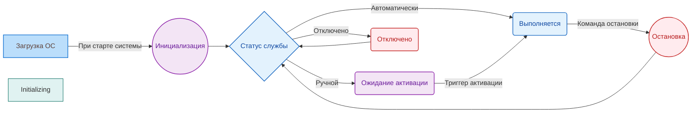
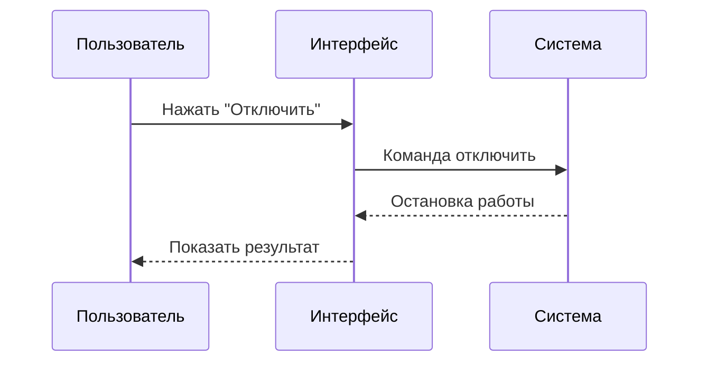
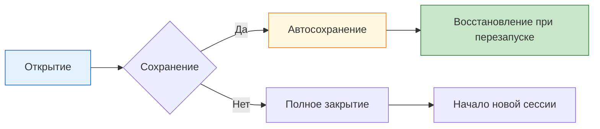
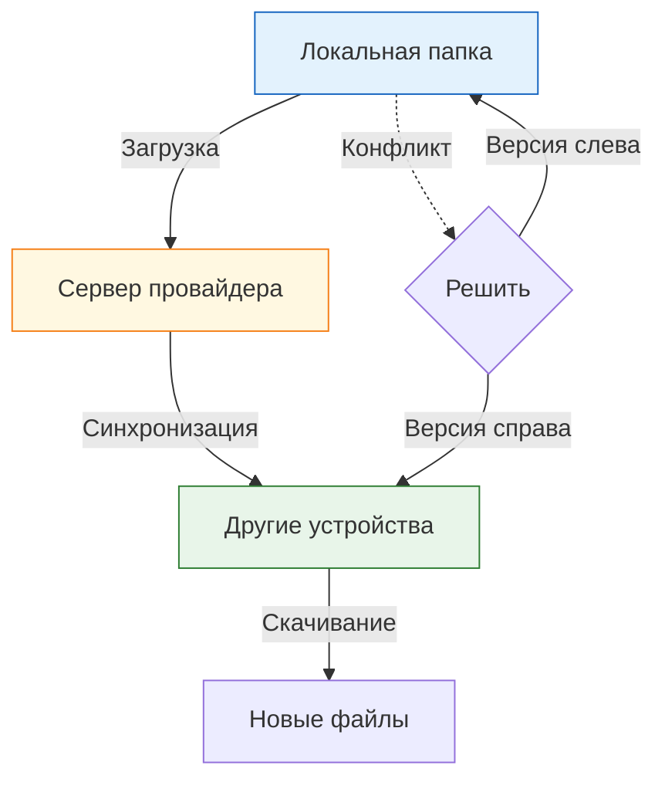

---
tags:
  - all
  - required
  - beginner
title: Системные приложения
description: >-
  Утилиты Windows: Проводник, Диспетчер задач, службы, устройства, Блокнот и
  Win+R.
---

# Системные приложения

<div class="article-tags">
  <span class="tag tag-required">ОБЯЗАТЕЛЬНО</span>
  <span class="tag tag-beginner">ДЛЯ НОВИЧКОВ</span>
</div>

<span class="complexity-badge">Всем</span>

Глава про **встроенные утилиты Windows**: файлы, процессы, службы, устройства, Блокнот и Win+R. Офис, браузеры, медиа, мессенджеры и безопасность — в соседних статьях этого раздела ([медиа](/encyclopedia/1-basics/1-11-soft-ryadovogo-polzovatelya/2), [браузеры](/encyclopedia/1-basics/1-11-soft-ryadovogo-polzovatelya/3), [офис](/encyclopedia/1-basics/1-11-soft-ryadovogo-polzovatelya/51)). Обзор Linux — в [отдельной главе](/encyclopedia/1-basics/1-11-soft-ryadovogo-polzovatelya/8).

<div class="callout callout--tip">
  <div class="callout-title">Для новичка</div>

  <div class="callout-body">
  Скорее всего, вы уже пользовались Проводником и Диспетчером задач. Здесь — как они связаны с ОС и что безопасно трогать, а что лучше не менять без причины.
</div>
  </div>


---

## Системные приложения

Ключевые системные приложения:
- Файловый менеджер;
- Текстовый редактор;
- Диспетчер задач;
- Диспетчер устройств.

Системные приложения — это программные компоненты, поставляемые в составе операционной системы или её окружения, предназначенные для обеспечения взаимодействия пользователя с ядром ОС, аппаратными ресурсами и другими программами. В отличие от прикладного ПО (браузеры, офисные пакеты, игры), системные приложения **не решают прямых пользовательских задач**, а обеспечивают *инфраструктурную функциональность*: управление конфигурацией, мониторинг состояния, навигацию по файловой системе, редактирование конфигураций, запуск и контроль процессов.

Их ключевые особенности:

- **Тесная интеграция с ОС** — часто используют привилегированные API ядра (например, `NtQuerySystemInformation` в Windows или `/proc`-файловая система в Linux).
- **Низкая зависимость от сторонних библиотек** — минимизация внешних зависимостей для повышения надёжности и совместимости.
- **Минимализм интерфейса** — простота и предсказуемость ввода-вывода важнее "красивости".
- **Долговечность и стабильность** — интерфейсы таких приложений изменяются медленно, поскольку от них зависит работоспособность всего окружения.

Ниже — **Windows**. Терминал, пакеты и `systemd` в Linux — в главе [Системные приложения Linux](/encyclopedia/1-basics/1-11-soft-ryadovogo-polzovatelya/8).

---

### Процесс, приложение и служба

| Понятие | Кто запускает | Окно | Пример |
|---------|---------------|------|--------|
| **Приложение** | Пользователь | Обычно есть | Браузер, Блокнот |
| **Процесс** | ОС при запуске программы | Может быть без окна | `chrome.exe`, `svchost.exe` |
| **Служба** | ОС при старте или по событию | Нет | Печать, обновления, сеть |

Как запустить и остановить каждый тип на практике — [Запуск и перезапуск приложений](/encyclopedia/1-basics/1-12-sovety-dlya-novichka/13).

---

### Типы системных приложений

| Категория | Примеры | Функция |
|-----------|---------|---------|
| **Файловые менеджеры** | Проводник, Total Commander | Организация работы с файлами и папками |
| **Настройки системы** | Панель управления, Параметры | Конфигурация операционной системы |
| **Утилиты обслуживания** | Диспетчер задач, Очистка диска | Мониторинг и обслуживание системы |
| **Параметры безопасности** | Фаервол, Защитник | Контроль доступа и защита данных |
| **Сетевые компоненты** | Сеть и Интернет, Настройки сети | Управление подключениями |

Каждый тип выполняет специфическую задачу. Например, файловые менеджеры организуют доступ к данным. Панели параметров настраивают поведение системы. Утилиты обслуживания контролируют работоспособность компонентов.

---

### Работа с системными приложениями

Работа с системными приложениями требует внимательности. Неправильные изменения могут привести к нестабильности системы. Перед изменением параметров рекомендуется создать точку восстановления. Для этого используют функцию "Создание точки восстановления" в системе Windows.

Приложение должно иметь соответствующие права доступа. Большинство системных функций требуют прав администратора. Это предотвращает случайные изменения настроек обычным пользователем.

---

## Проводник Windows

**Проводник Windows** — это главное графическое приложение для работы с файловой системой. Оно предоставляет визуальный интерфейс для навигации по папкам, просмотра содержимого дисков и управления файлами.

Проводник сочетает элементы управления файлами и параметры системы. Окно программы включает адресную строку, ленту команд, панель навигации и область просмотра содержимого. Каждая часть выполняет свою роль в процессе организации данных.

---

### Система окон

Окно проводника представляет собой управляемую структуру элементов интерфейса. Основные компоненты включают:

| Компонент | Расположение | Функция |
|-----------|--------------|---------|
| **Адресная строка** | Верхняя часть | Отображение текущего пути и навигация |
| **Лента команд** | Под адресной строкой | Быстрый доступ к операциям с файлами |
| **Панель навигации** | Левая колонка | Дерево папок и быстрых переходов |
| **Область контента** | Центральная часть | Список файлов и папок текущей директории |
| **Строка состояния** | Нижняя часть | Информация о количестве объектов |

Система окон позволяет работать с несколькими документами одновременно. Каждое окно открывает отдельный путь в файловой системе. Пользователь может перемещать окна и масштабировать их размер под текущую задачу.

---

### Раздел "Компьютер"

Раздел **"Этот компьютер"** отображает все доступные диски и накопители. Он показывает физическое пространство хранения данных и статус каждого устройства.

| Компонент | Описание |
|-----------|----------|
| **Локальные диски** | HDD, SSD с буквами `C:`, `D:`, `E:` |
| **Сетевого хранилища** | Карточки доступа к общим папкам |
| **Устройства с оптическими дисками** | DVD, Blu-Ray приводы |
| **Флеш-память** | USB-накопители |

Проверка дисков доступна через двойной клик. Программа показывает свободное место, общее пространство и занимаемый объем. Эта информация помогает контролировать заполнение хранилищ.

---

### Библиотеки

**Библиотеки** представляют собой виртуальные коллекции папок. Они группируют файлы по назначению без физического перемещения. По умолчанию система включает четыре основные библиотеки:

| Библиотека | Содержание | Путь по умолчанию |
|------------|------------|-------------------|
| **Документы** | Текстовые файлы, отчеты | C:\Users\Имя\Documents |
| **Изображения** | Фотографии, графики | C:\Users\Имя\Pictures |
| **Музыка** | Аудиофайлы, мелодии | C:\Users\Имя\Music |
| **Видео** | Мультимедийные записи | C:\Users\Имя\Videos |

Каждая библиотека ссылается на конкретную директорию в пользовательском профиле. При сохранении файла в библиотеку программа автоматически записывает его в целевую папку.

По умолчанию всё расположено на диске `C:`. Корневая структура включает следующие ключевые директории:

```
C:\
├── Users\          -- Папка пользователей (все профили)
│   ├── Имя\AppData\ -- Временная папка с кэшем
│   │   ├── Local\   -- Локальный кэш
│   │   └── Roaming\ -- Синхронизируемые данные
│   └── Documents\   -- Документы
├── Program Files\      -- Установленные программы (64-бит)
├── Program Files (x86)\-- Программы (32-бит)
└── Windows\            -- Файлы операционной системы
```

Папка **C:\Windows** содержит важнейшие и основные файлы операционной системы. Она включает исполняемые модули, драйверы и системные службы. Изменение содержимого этой директории требует прав администратора.

Папки **C:\Program Files** и **C:\Program Files (x86)** служат стандартом для установки программ и игр. Разделение на две директории объясняется архитектурой процессоров. Современные 64-битные системы поддерживают оба формата. Приложение записывает файлы в соответствующую зону в зависимости от разрядности.

---

### Адресная строка и пути

**Адресная строка проводника** отображает текущий маршрут в файловой системе. Она служит инструментом навигации и ввода маршрута. По умолчанию она показывает "человекочитаемый путь":

```
Этот компьютер > Диск C: > Пользователи > Тимур
```

Если кликнуть в неё или нажать Ctrl+L:

- путь превращается в реальный: `C:\Users\Тимур`
- вы можете вводить специальные команды

---

### Виды путей

| Тип | Пример | Назначение |
|-----|--------|------------|
| **Полный путь** | `C:\Users\Тимур\Documents` | Указание абсолютного положения |
| **Относительный путь** | `..\Images` | Относительно текущей директории |
| **UNC-путь** | `\\server\share` | Доступ к сетевым ресурсам |

**Полный путь** начинается от корня диска. Он указывает точное местоположение объекта независимо от контекста. Использование полных путей упрощает автоматизацию скриптов.

**Относительный путь** строится относительно текущей директории. Символы `..` указывают на родительскую папку. Символ `.` обозначает текущую позицию. Этот способ удобен при работе с локальными проектами.

---

### Системные команды

В адресной строке проводят следующие действия:

```
cmd    → откроет консоль в текущей папке
powershell → откроет PowerShell в текущей папке
explorer → запустит новое окно проводника
appwiz.cpl → откроет список установленных программ
```

Эти команды сокращают количество шагов для доступа к утилитам. Ввод осуществляется в адресной строке проводника. Результат выполнения зависит от выбранной директории.

---

### Абсолютные и относительные пути

Разница между абсолютными и относительными путями определяет гибкость использования в различных контекстах.

| Характеристика | Абсолютный | Относительный |
|----------------|------------|---------------|
| **База** | Корень диска | Текущая директория |
| **Универсальность** | Высокая | Зависит от позиции |
| **Автоматизация** | Подходит для скриптов | Подходит для портов |
| **Читаемость** | Низкая | Высокая |

Абсолютные пути гарантируют доступ к файлу из любого места. Относительные пути облегчают перенос проектов между системами. Каждый тип служит своим целям в рабочих процессах.

---

### Структура окна проводника

Окно проводника включает фиксированные элементы интерфейса. Они обеспечивают постоянный доступ к основным функциям управления файлами.

---

#### Лента команд

**Лента команд** находится сразу под адресной строкой. Она содержит вкладки с группами инструментов. Каждая вкладка раскрывает набор операций для конкретного типа задач.

| Вкладка | Основные функции |
|---------|------------------|
| **Главная** | Копировать, Вырезать, Вставить, Переименовать |
| **Делиться** | Обмен файлами по почте, в соцсетях |
| **Управление** | Настройка вида, сортировка |
| **Вид** | Режим отображения, панели, фильтры |

Лента скрывается при необходимости экономии пространства. Для её открытия применяют клавишу F10 или кнопку меню.

---

#### Панель навигации

**Панель навигации** расположена слева в окне проводника. Она содержит дерево папок и ссылки на популярные ресурсы. Структура включает следующие узлы:

---

##### Быстрый доступ

Раздел **"Быстрый доступ"** хранит часто используемые файлы и папки. Он появляется при открытии проводника первым. Его заполняют вручную или автоматически на основе истории.

Для добавления папки в быстрый доступ выполняют следующие действия:

1. Находят нужный элемент в проводнике
2. Щелкают правой кнопкой мыши
3. Выбирают пункт "Закрепить на панелях быстрого доступа"

Элементы сохраняются в памяти проводника. Они остаются доступными после перезапуска системы.

---

##### Этот компьютер

Узел **"Этот компьютер"** объединяет все физические и логические диски. Он служит точкой входа для проверки оборудования. Внутри узла отображаются разделы с информацией о каждом устройстве.

---

##### Сеть

Раздел **"Сеть"** перечисляет доступные устройства в локальном сегменте. Он отображает компьютеры с общим доступом к файлам. Удаленные карты становятся активными после установления соединения.

---

##### OneDrive

Интеграция **OneDrive** обеспечивает синхронизацию файлов с облаком. Папка пользователя создает резервные копии документов на сервере. Изменения распространяются между всеми устройствами аккаунта.

---

##### Библиотеки

Раздел **"Библиотеки"** объединяет группы папок в единые коллекции. Они не привязаны к конкретной директории на диске. Библиотеки позволяют искать файлы по категориям вместо путей.

---

#### Вложенный список навигации

Панель навигации поддерживает вложенную структуру узлов. Пользователь раскрывает папки кликом по стрелке слева от названия. Вложенность позволяет видеть иерархию до десяти уровней глубины.

---

### Дополнительные возможности

Проводник предоставляет инструменты для расширенной работы с файлами. Некоторые функции доступны через дополнительные кнопки или комбинации клавиш.

---

#### Поиск файлов

Поиск в проводнике активируется кликом в поле поиска справа сверху. Система сканирует индекс файлов для ускорения результатов. Можно использовать операторы фильтрации по дате, типу или размеру. Подробнее про поиск по **содержимому** (VS Code, Notepad++, `grep`) — [поиск текста в файлах](/encyclopedia/2-system-network/2-05-terminal/104).

---

#### Предварительный просмотр

Панель предварительного просмотра отображает содержимое файла без открытия программы. Она показывает текст, изображения и некоторые видеоформаты. Активация происходит через вкладку "Вид" в ленте команд.

---

#### Панели обмена данными

Буфер обмена хранит элементы для перемещения между папками. Проводник поддерживает последовательное копирование нескольких объектов. Буфер очищается после закрытия проводника или вставки данных.

---

## Диспетчер задач

**Диспетчер задач** — системная утилита операционной среды Windows, предназначенная для мониторинга и управления текущими процессами, приложениями и службами. Приложение отображает информацию о нагрузке на компоненты оборудования, потреблении ресурсов и состоянии активности системы.

Программа функционирует в фоновом режиме и становится доступной по требованию пользователя. Диспетчер задач обеспечивает визуальное представление данных о работе аппаратных компонентов через графические интерфейсы с графиками и таблицами. Инструмент предоставляет возможности для завершения процессов, настройки автозагрузки и диагностики производительности.

| Характеристика | Описание |
|----------------|----------|
| **Назначение** | Управление процессами и службами |
| **Воздействие** | Влияние на работу активных приложений |
| **Доступ** | Клавиатурные комбинации или интерфейс |
| **Постоянство** | Открывается при необходимости |
| **Ответственность** | Требует осознанного использования |

---

### Как открыть диспетчер задач

Существует несколько способов запуска приложения в любой момент работы системы. Каждый метод открывает окно программы без необходимости поиска в меню пуск.

---

#### Комбинация клавиш

Самый быстрый способ использует сочетание трёх клавиш одновременно:

```
Ctrl + Shift + Esc → Диспетчер задач
```

Команда активирует приложение мгновенно. Метод работает в любом контексте вне зависимости от открытого окна или активного приложения. Пользователь не должен покидать текущий экран для доступа к информации о системе.

---

#### Контекстное меню панели задач

Правая кнопка мыши вызывает список команд:

```
Щелчок правой кнопкой → Выбрать "Диспетчер задач"
```

Этот метод открывает дополнительное меню перед основным окном программы. Некоторые версии системы показывают расширенный вариант сразу.

---

#### Меню выполнения

Клавиатура выполняет команду через диалоговое окно:

```
Ctrl + R → Введите taskmgr → Enter
```

Меню выполняет поиск исполняемого файла диспетчера задач по имени. Команда работает через стандартный механизм вызова программ.

---

#### Сигнализация безопасности

Сочетание клавиш защищает от вредоносного кода:

```
Ctrl + Alt + Delete → Выбрать "Диспетчер задач"
```

Команда перехватывает систему на низком уровне и гарантирует запуск настоящего инструмента. Этот метод обходит возможные подмены со стороны вирусов или троянов.

---

### Интерфейс и вкладки

Окно программы организовано через несколько разделов с различными функциями. Каждая вкладка содержит специализированную информацию для конкретных задач.

---

#### Стандартный вид

```mermaid
flowchart TD
    A[Диспетчер задач] --> B[Вкладка "Процессы"]
    A --> C[Вкладка "Производительность"]
    A --> D[Вкладка "Журнал событий"]
    A --> E[Вкладка "Автозагрузка"]
    A --> F[Вкладка "Пользователи"]
    A --> G[Вкладка "Сведения"]
    A --> H[Вкладка "Службы"]
    
    style A fill:#c8e6c9,stroke:#1b5e20,color:#1b5e20
    style B fill:#fff8e1,stroke:#f57f17,color:#5d4037
    style C fill:#e3f2fd,stroke:#1565c0,color:#0d47a1
    style D fill:#f3e5f5,stroke:#8e24aa,color:#6a1b9a
    style E fill:#ffebee,stroke:#c62828,color:#b71c1c
    style F fill:#eceff1,stroke:#546e7a,color:#37474f
    style G fill:#e8f5e9,stroke:#2e7d32,color:#1b5e20
    style H fill:#fff3e0,stroke:#ef6c00,color:#e65100
```

Первая открываемая вкладка определяет базовую функциональность программы. Расширенный режим раскрывает все доступные разделы через кнопку внизу окна.

| Вид | Описывает | Доступность |
|-----|-----------|-------------|
| Минимальный | Текущие процессы | Всегда открыт |
| Полный | Все вкладки | По щелчку |
| Детальный | Расширенные параметры | Для специалистов |

---

### Процессы

Раздел **"Процессы"** показывает списки всех запущенных программ и фоновых операций. Окно организует элементы по категориям для удобства просмотра.

---

#### Типы активных программ

Приложения разделяют на две основные группы в интерфейсе:

| Категория | Примеры | Особенности |
|-----------|---------|-------------|
| **Приложения** | Браузер, Текстовый редактор, Игры | Работают под пользователем |
| **Фоновые процессы** | Службы обновлений, Драйверы, Антивирус | Автоматическая активность |

Каждое приложение имеет собственный идентификатор и потребление ресурсов. Программа отображает использование памяти, ЦП и диска для каждой записи.

---

#### Данные о каждом процессе

Таблица процессов содержит следующие колонки:

```
┌──────────────────────┬─────────┬──────────┬──────────┬──────────┐
│ Имя                  │ Время   │ Память    │ ЦП       │ Диск     │
├──────────────────────┼─────────┼──────────┼──────────┼──────────┤
│ chrome.exe           │ 45 мин  │ 512 МБ   │ 15%      │ 12 МБ/с  │
│ svchost.exe          │ 8 ч     │ 128 МБ   │ 2%       │ 0        │
│ explorer.exe         │ 24 ч    │ 64 МБ    │ 1%       │ 0        │
└──────────────────────┴─────────┴──────────┴──────────┴──────────┘
```

Имя процесса отображает файл исполнения. Пропущенный статус показывает продолжительность работы. Поле памяти отображает занятый объём оперативной памяти. Столбец ЦП указывает процент использования процессора. Значение диска показывает скорость чтения или записи.

---

#### Упорядочивание списка

Пользователь сортирует данные кликом по заголовкам колонок. Повторное нажатие меняет порядок от возрастания до убывания. Сортировка помогает находить проблемные программы.

| Параметр | Действие | Результат |
|----------|----------|-----------|
| **ЦП** | Клик по заголовку | Сверху процессы с наибольшей загрузкой |
| **Память** | Клик по заголовку | Сверху самые "тяжёлые" по RAM |
| **Диск** | Клик по заголовку | Сверху активность чтения/записи |
| **Время** | Клик по заголовку | Дольше всего работающие |

---

#### Завершение процессов

Некоторые программы заканчивают работу через кнопку в интерфейсе. Щелчок правой кнопкой мыши вызывает меню действий.

```
ПКМ на процессе → "Завершить задачу"
```

Команда останавливает программу принудительно. Система запрашивает подтверждение действия. Файловые изменения сохраняются автоматически или теряются без предупреждения.

---

#### Системные процессы

Некоторые записи нельзя завершать. Закрытие системных компонентов вызывает ошибку. Список защищённых элементов включает драйверы и ядро системы.

| Процесс | Статус | Причина блокировки |
|---------|--------|-------------------|
| `System` | Нельзя завершить | Ядро операционной системы |
| `smss.exe` | Нельзя завершить | Менеджер сессий |
| `csrss.exe` | Нельзя завершить | Подсистема окружения |
| `wininit.exe` | Нельзя завершить | Инициализация входа |

Принудительное завершение этих процессов требует специальных прав администратора.

---

### Производительность

Вкладка **"Производительность"** отображает графики нагрузки на аппаратные компоненты в реальном времени. Раздел анализирует состояние оборудования через датчики системы.

| Компонент | Графики | Метрики |
|-----------|---------|---------|
| **ЦП** | Загрузка ядер | Частота, температура |
| **Память** | Использование | Доступно, резерв |
| **Диск** | Активность скоростей | Оборот в сек |
| **Сеть** | Скорость передачи | Вход/выход |
| **Графический процессор** | Нагрузка GPU | 3D, видео, вычисления |

---

#### Центральный процессор

Информация о процессоре включает:

- Название модели
- Количество ядер
- Количество потоков
- Максимальная частота
- Используемая частота

График показывает загрузку каждого ядра отдельно. Пользователь видит распределение нагрузки между физическими блоками. Температура процессора отображается как дополнительная метрика.

---

#### Оперативная память

Статистика памяти показывает:

- Общий объем установленной памяти
- Использованный объем
- Свободный объем
- Кэшированные данные
- Файл подкачки

Раздел отслеживает потребление физической памяти и виртуального хранилища. Значения обновляются ежесекундно для точного мониторинга.

---

#### Накопители

Анализ дисковых накопителей показывает:

- Тип устройства (HDD, SSD, NVMe)
- Общая ёмкость
- Свободное место
- Скорость чтения
- Скорость записи
- Средняя задержка

Гистограммы демонстрируют активность каждого диска в отдельности. Пользователь различает нагрузку между основными и дополнительными накопителями.

---

#### Сеть

Мониторинг сети отображает:

- Имя адаптера
- Тип подключения (Wi-Fi, Ethernet)
- Скорость канала
- Использованная скорость
- Время работы соединения

Данные помогают обнаружить сетевые проблемы или высокую активность других устройств.

---

#### Графический процессор

Информация о GPU включает:

- Модель видеочипа
- Общий объём видеопамяти
- Использование памяти
- Нагрузка 3D приложений
- Нагрузка декодирования видео
- Настройка вычислений

Мониторинг GPU полезен для игровых конфигураций и работы с графикой.

---

### Журнал событий

Вкладка **"Журнал событий"** (в английской локали — *Event Log*) показывает записи Windows: сбои приложений, драйверов, обновлений. Для полного просмотра удобнее отдельная утилита:

```text
Win+R → eventvwr.msc → Enter
```

| Уровень | Смысл |
|---------|--------|
| Информация | Штатная работа |
| Предупреждение | Возможная проблема |
| Ошибка | Сбой, мешающий работе |

---

### Автозагрузка

Раздел **"Автозагрузка"** управляет программами, которые стартуют вместе с операционной системой. Вкладка позволяет отключать ненужные элементы для ускорения загрузки.

---

#### Что находится в автозагрузке

Список включает приложения и службы:

| Пример | Назначение | Эффект отключения |
|--------|------------|-------------------|
| `WhatsApp.exe` | Мессенджер | Не запустится сам |
| `YandexDisk.exe` | Облачное хранилище | Сигнал облака не начнётся |
| `Steam.exe` | Игровой магазин | Запуск вручную |
| `OneDrive.exe` | Синхронизация файлов | Ручная синхронизация |

Каждая программа имеет влияние на скорость старта системы. Чем больше запусков, тем дольше ожидание рабочего стола.

---

#### Управление состоянием

Пользователь изменяет статус каждой записи:

```
Выбрать элемент → Нажмите "Отключить" или "Включить"
```

Переключение состояния применяется после перезагрузки компьютера. Новые настройки учитываются при следующем старте системы.

| Статус | Действие |
|--------|----------|
| **Включено** | Программа стартует автоматически |
| **Отключено** | Программа не запускается сама |
| **Изменено** | Требуется перезапуск настроек |

---

#### Оценка влияния

Индекс влияет определяет степень воздействия программы на время загрузки:

| Индекс | Описание |
|--------|----------|
| **Высокое** | Существенно замедляет старт |
| **Среднее** | Незначительное влияние |
| **Низкое** | Практически не влияет |

Рекомендация основана на измерениях времени загрузки системы при участии программы.

---

#### Правила отключения

Некоторые элементы нельзя безопасно отключать. Системные компоненты требуют наличия в автозагрузке.

| Элемент | Можно отключать |
|---------|----------------|
| **Браузеры** | Да |
| **Мессенджеры** | Да |
| **Игровые платформы** | Да |
| **Облачные хранилища** | Да |
| **Антивирус** | Нет |
| **Драйверы аудио/видео** | Нет |
| **Службы обновления** | Нет |

Блокировка драйверов вызывает отсутствие звука или изображения после загрузки.

---

### Остальные вкладки

| Вкладка | Зачем смотреть |
|---------|----------------|
| **Пользователи** | Нагрузка по учётным записям, если ПК общий |
| **Сведения** | PID процесса, путь к `.exe` — проверка "что это за программа" |
| **Службы** | Краткий список; подробнее — раздел [Службы](#службы) и `services.msc` |

Топ процессов по памяти в PowerShell:

```powershell
Get-Process | Sort-Object WorkingSet -Descending |
  Select-Object -First 5 Name, @{N='MB';E={[math]::Round($_.WorkingSet/1MB)}}
```

---

### Рекомендации по использованию

При работе с Диспетчером задач следуйте принципам осторожности. Неправильные действия влияют на стабильность системы.

| Правило | Описание |
|---------|----------|
| **Проверяйте имя** | Убедитесь что это настоящий процесс |
| **Изучите влияние** | Оцените последствия завершения |
| **Не закрывайте систему** | Ядровые процессы обязательны |
| **Сохраняйте данные** | Закрывайте свои файлы прежде всего |
| **Перезапустите** | Если что-то пошло не так |
| **Воспользуйтесь поддержкой** | Обратитесь к специалистам если требуется |

---

#### Когда использовать Диспетчер задач

| Ситуация | Применение |
|----------|------------|
| **Программа зависла** | Завершите процесс вручную |
| **Медленная система** | Проверьте загруженность ЦП |
| **Сбой сети** | Изучите статистику сетевого адаптера |
| **Нестандартное поведение** | Посмотрите журнал событий |
| **Сложный запуск** | Уберите лишние элементы автозагрузки |

---

#### Когда не использовать Диспетчер задач

| Ситуация | Рекомендация |
|----------|--------------|
| **Новичок** | Не трогайте неизвестные процессы |
| **Серверная система** | Не меняйте штатные службы |
| **Критическое ПО** | Обратитесь к технической поддержке |
| **Запрещённая политика** | Соблюдайте правила организации |

---

### Дополнительные возможности

Программа обладает скрытыми функциями для продвинутых пользователей. Некоторые команды выполняют специальные задачи.

---

#### Открытие свойств файла

ПКМ на процессе открывает контекстное меню:

```
"Перейти к файлу" → показывает папку с файлом
"Открыть местоположение" → открывает проводник
"Перейти к службе" → открывает управление службами
```

Быстрый доступ к файловой структуре помогает найти источник проблемы.

---

#### Анализ ресурсов

Раздел показывает зависимость процессов друг от друга:

- Какие службы зависят от какой
- Какие процессы создали другие процессы
- Цепочки наследования иерархии

Дерево зависимостей упрощает диагностику сложных ситуаций.

---

#### Монитор ресурсов

Расширенная версия диспетчера содержит дополнительные данные:

- Детальные сетевые соединения
- Открытые файлы
- Аудио и видео компоненты
- Более подробные графики

Монитор ресурсов открывается через ссылку в основном окне диспетчера.

---

### Диагностика проблем

Диспетчер задач решает типовые вопросы:

| Проблема | Решение |
|----------|---------|
| **Высокая нагрузка ЦП** | Найдите процесс и завершите его |
| **Мало памяти** | Закройте приложения с большим потреблением |
| **Диск перегружен** | Исследуйте процессы с высокой активностью диска |
| **Нет интернета** | Проверьте сетевой адаптер в разделе "Производительность" |
| **Задержки звука** | Посмотрите загрузку GPU в соответствующем графике |
| **Сбой обновлений** | Проверьте журнал приложений на наличие ошибок |
| **Медленный запуск** | Отключите лишние элементы автозагрузки |

Диагностика начинается с поиска узкого места в ресурсах.

---

### Технические детали

Исполняемый файл диспетчера задач называется `taskmgr.exe`. Расположение файла:

```
C:\Windows\System32\taskmgr.exe
```

Компонент работает под правами текущего пользователя. Elevated права требуют подтверждения UAC при запуске системных функций.

| Версия Windows | Особенности |
|----------------|-------------|
| **Windows 10** | Базовая функциональность |
| **Windows 11** | Улучшенный интерфейс, новые вкладки |
| **Server editions** | Урезанный набор функций |
| **Enterprise** | Полная поддержка политик |

Версии системы определяют доступные возможности приложения.

---

## Службы

### Что такое службы системы

**Службы системы** — это фоновые программы, которые обеспечивают работу основных компонентов операционной среды. Эти компоненты функционируют вне зависимости от активности пользователя и продолжают выполнение задач в отсутствие активного сеанса входа.

Программы запускают пользователь при клике на ярлык или открытии исполняемого файла. Службы запускает сама операционная система за пользователем ещё до входа в учётную запись. Они поддерживают сетевое взаимодействие, доступ к устройствам ввода вывода, управление процессами и мониторинг состояния системы.

| Характеристика | Программа | Служба |
|----------------|----------|--------|
| **Запуск** | Пользователь открывает программу | Система запускает автоматически |
| **Интерфейс** | Окно с кнопками и меню | Без графического интерфейса |
| **Видимость** | Видно на рабочем столе | Работает в фоновом режиме |
| **Привилегии** | Права текущего пользователя | Права учётной записи сервиса |
| **Жизненный цикл** | Закрывается когда пользователь закрыл | Запущена пока система работает |

Службы работают под специальной учётной записью. Обычно это учётная запись `Local System` или `Network Service`. Эти учётные записи имеют определённый уровень доступа к системе. Управлять службами можно через панель управления, командную строку или специальные инструменты мониторинга.

---

### Как службы работают внутри системы

Каждая служба имеет собственное окружение выполнения. Операционная среда создаёт отдельный контекст процесса для каждой активной службы. Этот контекст содержит переменные среды, дескрипторы файлов и настройки безопасности.

---

#### Цикл жизни службы



Операционная система загружает службы сразу после инициализации ядра. Эта стадия происходит перед появлением экрана входа в систему. После загрузки пользователь видит интерфейс и может взаимодействовать с программами.

---

##### Статусы службы

| Статус | Описание | Действие |
|--------|----------|----------|
| **Автоматически** | Запускается при загрузке ОС | Работает всегда после старта |
| **Ручной** | Ждёт вызова программой или пользователем | Запускается по необходимости |
| **Остановлено** | Неактивна до повторного запуска | Не расходует ресурсы |
| **Отключено** | Блокирована администратором | Запустить невозможно без изменения настройки |

---

##### Типы запуска службы

```
Автоматически (Delayed Start) → Запуск после завершения загрузки ОС
Автоматически → Запуск при загрузке ОС
Ручной → Запуск по требованию
Отключено → Полный запрет запуска
Ожидание зависимостей → Зависит от других служб
```

Задержка запуска важна для систем с большим количеством фоновых процессов. Отложенный старт предотвращает конкуренцию за ресурсы в момент загрузки. Некоторые компоненты требуют наличия сети или других сервисов для работы.

---

### Жизненно важные службы

Некоторые службы поддерживают фундаментальные возможности системы. Их остановка приводит к некорректной работе компьютера или полной неработоспособности. Эти компоненты входят в состав ядра или являются обязательными для базовых функций.

---

#### Критические службы Windows

| Служба | Назначение | Риски отключения |
|--------|------------|------------------|
| **Windows Management Instrumentation** | Мониторинг системы и приложений | Теряется возможность диагностических запросов |
| **Plug and Play** | Обнаружение нового оборудования | Периферийные устройства не распознаются |
| **DHCP Client** | Получение IP адреса от роутера | Нет сетевого подключения |
| **DNS Client** | Преобразование имён в IP адреса | Сайты не открываются по имени |
| **Event Log** | Ведение журнала событий | Потеря информации о сбоях |
| **Task Scheduler** | Планировщик заданий | Автоматические задачи не выполняются |
| **RPC** | Межпроцессное взаимодействие | Большинство служб перестанут работать |
| **Security Accounts Manager** | Хранение учётных данных | Проблемы с авторизацией пользователей |
| **Windows Audio** | Воспроизведение звука | Исчезает звук во всей системе |
| **Cryptographic Services** | Управление сертификатами | Проблемы с безопасностью и обновлениями |

Эти службы находятся в защищённом статусе. Администратору сложнее их остановить без специальных привилегий. Даже при попытке отключения система восстановит автоматический режим после перезагрузки.

---

#### Почему эти службы нельзя трогать

Базовые службы используют механизмы ядра операционной системы. Они предоставляют точки входа для других программ. Если эти службы недоступны, многие функции исчезают целиком. Примеры включают сетевую активность, звуковую обработку, безопасность и планирование задач.

---

#### Признаки критической службы

Служба относится к критическим если:

- она запускается первой при загрузке системы
- зависит от неё множество других служб
- обеспечивает обмен данными между компонентами
- хранит важную конфигурацию или данные
- обрабатывает ввод вывод для устройств
- управляет сетевым подключением

Изменение этих параметров требует глубоких знаний архитектуры системы. Пользователи могут случайно нарушить стабильность среды. Рекомендуется оставить все критические службы в исходном состоянии.

---

### Службы, которые безопасно отключать

Некоторые службы выполняют второстепенные задачи. Их отключение освобождает память и центральные ресурсы без существенного ущерба функционалу. Такие компоненты полезно отключать если они не нужны текущему пользователю.

---

#### Утилиты печати

```
Print Spooler → Очередь печати документов
```

Эта служба хранит файлы для отправки на принтер. Она позволяет отправлять задания пока устройство выключено. Если у пользователя нет принтера этот компонент бесполезен. Его отключение освободит около 5 МБ оперативной памяти.

**Как проверить наличие принтера:**

1. Открыть раздел "Устройства и принтеры"
2. Осмотреть список установленных устройств
3. Если устройств нет — служба ненужна

Ошибкой будет отключение если планируется печать на удалённое устройство. В этом случае следует оставить службу в ручном режиме.

---

#### Службы обновлений

```
Windows Update → Проверка и установка обновлений
```

Служба обеспечивает получение новых версий программного обеспечения. Её работа защищает от уязвимостей безопасности. Однако её отключение возможно если система полностью изолирована.

| Ситуация | Решение |
|----------|---------|
| **Работа дома** | Оставить включённой для безопасности |
| **Сервер в сети** | Оставить для центрального управления |
| **Изолированная система без интернета** | Только по политике IT; иначе оставлять включённой |

---

#### Серверы баз данных

```
SQL Server → Реляционная база данных
MySQL → Веб хостинг базы данных
PostgreSQL → Научные и корпоративные расчёты
```

Эти службы предназначены для хранения и обработки структурированных данных. Обычные пользователи редко их используют. Если нет веб сервера или приложения работающего с БД их останавливают.

| Ситуация | Решение |
|----------|---------|
| **Разработка приложений** | Оставить включённой |
| **Личный компьютер без веб проекта** | Остановить |
| **Игровой ПК** | Полностью удалить из автозагрузки |

---

#### Файловые серверы

```
Server → Доступ к общим папкам в локальной сети
Workstation → Обмен файлами между компьютерами
```

Эти службы позволяют пользователям обмениваться документами внутри сети. Если нет общей папки для коллег их отключают. Компьютер без роли сервера не нуждается в них.

---

#### Дополнительные компоненты

| Служба | Когда отключать | Результат |
|--------|----------------|-----------|
| **Bluetooth** | Если нет беспроводной гарнитуры | Экономия ресурсов |
| **Fax** | Если не используется почтовый факс | Защита от спама |
| **Remote Registry** | Если нет удалённого доступа | Повышение безопасности |
| **Diagnostic Policy Service** | Для опытных пользователей | Минимальная диагностика |
| **HomeGroup Listener** | После удаления HomeGroup | Отсутствие дубликатов |
| **Connected Devices Platform** | Если нет смарт часов | Чистота системы |
| **Touch Keyboard** | Если нет сенсорного экрана | Экономия места |
| **Xbox Game Bar** | Если не играют в игры | Снижение задержек |

---

### Разница между программами и службами

Программы и службы имеют различия в способе запуска и уровне доступа к системе. Эти отличия влияют на производительность и безопасность использования компьютера.

---

#### Основные различия

| Параметр | Приложение | Служба |
|----------|------------|--------|
| **Инициатор запуска** | Человек щёлкает ярлык | Операционная система |
| **Время запуска** | По желанию пользователя | При загрузке ОС или по событию |
| **Графический интерфейс** | Есть окно программы | Нет окна в обычном виде |
| **Пользовательский опыт** | Видит результат работы | Работает незаметно |
| **Привилегии** | Права текущего пользователя | Права учётной записи сервиса |
| **Обработка ошибок** | Сообщения пользователю | Логи в файл событий |
| **Перезапуск** | Требует вручную | Автоматический рестарт при сбоях |
| **Зависимости** | От других программ | От других служб |

---

#### Управление правами доступа

Службы работают под особыми учётными записями. Эти записи имеют уровень прав выше стандартного пользователя. Например `Local System` имеет доступ ко всем файлам системы. Это делает службы потенциально опасными при компрометации.

**Основные учётные записи служб:**

- **Local System** — полный доступ к системе
- **Local Service** — ограниченный доступ с анонимной сетью
- **Network Service** — доступ как сеть с локальными ресурсами
- **Specific Account** — назначенная учётная запись

Администратор задаёт учётную запись службы при создании. Выбор зависит от необходимых возможностей. Например служба обновления использует учётную запись `Network Service` для скачивания файлов.

---

#### Связи между службами

Службы зависят друг от друга. Если одна служба остановлена другие могут не запуститься. Операционная система контролирует порядок запуска и восстановления.

```
Сеть Store Interface → DHCP Client → DNS Client → Browser Service
Task Scheduler → плановые задачи → служба индексации → поиск Windows
Remote Procedure Call → зависимые от RPC службы
```

Зависимости создают цепочку событий при загрузке. Система сначала запускает ядро затем службы базового уровня. После этого активируются более высокие уровни. Каждая очередь имеет свои требования к готовности предыдущих этапов.

---

### Управление состоянием служб

Операционная система предоставляет инструменты контроля над каждым компонентом. Администратор или пользователь могут изменять параметры работы службы. Эти действия влияют на поведение системы в дальнейшем.

---

#### Способы управления

| Способ | Команда/действие | Преимущества |
|--------|----------------|--------------|
| **Панель управления** | GUI интерфейс | Наглядность и простота |
| **Диспетчер задач** | Вкладка "Службы" | Быстрый доступ |
| **Командная строка** | net start / net stop | Автоматизация |
| **PowerShell** | Get-Service / Start-Service | Мощные скрипты |
| **Реестр** | Изменение ключей Services | Глубокая настройка |

---

#### Использование командной строки

```cmd
net start Spooler
net stop Spooler
sc query Spooler
```

Команды `net` и `sc` требуют **запуска от имени администратора**. Не останавливайте службы "наугад" — сначала узнайте назначение в `services.msc`.

---

#### PowerShell

```powershell
Get-Service -Name Spooler | Select-Object Name, Status, StartType
Start-Service -Name Spooler
Stop-Service -Name Spooler
Set-Service -Name Spooler -StartupType Manual
```

Для просмотра всех служб: `Get-Service | Where-Object Status -eq 'Running'`.

---

### Диагностика проблем со службами

Неправильное состояние службы вызывает сбои в работе системы. Пользователь замечает неполадки через отсутствие функции или ошибки. Инструменты мониторинга помогают выявить источник проблемы.

---

#### Признаки проблем

| Проблема | Причина | Решение |
|----------|---------|---------|
| **Служба не запускается** | Ошибка в коде или зависимость | Проверить журнал событий |
| **Служба завершается постоянно** | Конфликт ресурсов | Изменить учётную запись |
| **Высокое потребление памяти** | Утечка ресурсов | Обновить драйверы |
| **Нет реакции системы** | Процесс в бесконечном цикле | Перезапуск службы |
| **Ошибка входа в систему** | Повреждены учётные данные | Сброс паролей |
| **Нет интернета** | Служба DHCP остановлена | Перезапустите NetConnection |

---

#### Просмотр журналов событий

**Event Viewer** содержит записи о каждом действии службы. Он показывает время запуска остановку и любые ошибки. Пользователи фильтруют события по категории и уровню серьёзности.

| Уровень события | Описание |
|----------------|----------|
| **Информация** | Обычное функционирование |
| **Предупреждение** | Возможная проблема в будущем |
| **Ошибка** | Сбой который нужно исправить |
| **Критический** | Требуется немедленное вмешательство |

---

#### Анализ зависимостей

Служба может зависеть от нескольких компонентов. Если один из них недоступен вся цепочка прерывается. Диспетчер задач показывает эту информацию в окне свойств.

| Шаг | Действие |
|-----|----------|
| 1 | Открыть свойства службы в диспетчере |
| 2 | Переключиться на вкладку "Зависимости" |
| 3 | Осмотреть список требуемых служб |
| 4 | Проверить статус каждой зависимости |
| 5 | Решить какой компонент требуется |

---

### Безопасность служб

Службы имеют высокий уровень доступа к системе. Злоумышленники используют уязвимости в службах для получения прав администратора. Поэтому контроль над ними важен для защиты компьютера.

---

#### Правила безопасности

- не использовать учётные записи служб с паролем в открытом виде
- ограничивать доступ только необходимыми правами
- регулярно обновлять службы до последней версии
- блокировать внешние подключения где не требуется
- вести мониторинг изменений в списке служб

**Проверка безопасности:**

```powershell
Get-WmiObject Win32_Service | Select Name, StartMode, State
```

Эта команда выводит все службы вместе со статусом запуска. Администратор сравнивает активные службы с известным списком. Непредвиденные компоненты указывают на возможную атаку.

---

#### Риски отключения важных служб

| Риск | Результат |
|------|----------|
| **Потеря обновлений** | Система уязвима к эксплойтам |
| **Нарушение сети** | Нет доступа к интернету |
| **Потеря звукового сопровождения** | Не слышно звуки системы |
| **Проблемы с драйверами** | Оборудование не работает |
| **Сбой планирования задач** | Бэкапы не выполняются вовремя |
| **Отсутствие регистрации в Event Viewer** | Нельзя диагностировать проблему |

---

<div class="callout callout--warning">
  <div class="callout-title">Не "оптимизируйте" службы по советам из интернета</div>

  <div class="callout-body">
  Массовое отключение SysMain, Windows Search или обновлений на Win10/11 редко даёт заметный выигрыш и часто ломает поиск, обновления безопасности или стабильность. Домашнему ПК обычно достаточно отключить автозагрузку лишних <em>приложений</em> во вкладке "Автозагрузка" диспетчера задач.
</div>
  </div>


---

### Что можно отключить на домашнем ПК

| Служба | Когда имеет смысл |
|--------|-------------------|
| **Print Spooler** | Нет принтера и не печатаете по сети |
| **Fax** | Факс не используется |
| **Remote Registry** | Нет удалённого администрирования |

Остальное — по необходимости и с пониманием последствий. Серверные роли (SQL Server, IIS) отключают только если вы сами их не устанавливали.

---

## Диспетчер устройств

**Диспетчер устройств** — системный инструмент операционной системы для управления аппаратным обеспечением. Он представляет собой графический интерфейс к ядру системы, через которое передаются команды оборудованию. Программа отображает дерево устройств и их текущий статус.

Программа выполняет функции регистрации оборудования при загрузке и предоставления доступа к настройкам каждой единицы техники. Она хранит информацию о версиях драйверов, поставщиках устройств и датах установки. Каждое устройство имеет уникальный идентификатор, который система использует при идентификации.

| Характеристика | Описание |
|----------------|----------|
| **Назначение** | Управление оборудованием и драйверами |
| **Доступ** | Панель управления или контекстное меню |
| **Статус** | Отображает текущее состояние каждого компонента |
| **Воздействие** | Позволяет менять настройки без перезагрузки |
| **Ответственность** | Требует осторожности при изменении параметров |

---

### Как работает диспетчер устройств

Инструмент взаимодействует с ядром системы и службами конфигурации. При запуске компьютер выполняет поиск всех физических и логических устройств. Ядро загружает соответствующие драйверы и регистрирует их в базе данных устройств. Список формируется автоматически на основе обнаруженных сигналов.

Каждый компонент получает название и категория из списка стандартов Plug and Play. Стандарт определяет классы оборудования: видеоадаптеры, мыши, сетевые карты. Категория влияет на расположение элемента в дереве списка. Службы системы отслеживают события изменения конфигурации.

---

#### Архитектура подключения

Устройства подключаются к шине данных и отвечают на запросы контроллера. Контроллер направляет пакеты данных по адресу устройства. Драйвер принимает эти пакеты и переводит их в формат понятный программе. Обратный путь происходит через интерфейс API операционной системы.


---

#### Хранение информации

Все параметры хранятся в реестре системы. Зарегистрированный узел содержит ключи конфигурации. Параметры включают имена драйверов, версии, пути к файлам и настройки безопасности. База данных обновляется при установке нового оборудования. Стареющие записи удаляются после отключения устройства.

---

### Категории устройств

Дерево списка разделено на несколько классов. Каждый класс объединяет однотипные компоненты. Классификация помогает быстро находить нужную группу элементов. В зависимости от типа устройства доступны разные свойства и действия.

---

#### Видеосистема

Видеоадаптеры обрабатывают графические данные. Они выводят изображение на мониторы. Современные решения включают собственные процессоры и память. Драйвер управляет разрешением экрана и частотой обновления.

| Тип | Функция |
|-----|---------|
| **Интегрированная карта** | Графика внутри процессора |
| **Внешняя карта** | Выделенный чип с собственной памятью |
| **Виртуальный адаптер** | Эмуляция дисплея для сервера |

---

#### Дисковые накопители

Хранилища данных содержат файлы и операционную систему. Дисководы считывают информацию с оптических дисков. SSD накопители используют флеш память вместо магнитных пластин. Контроллер управляет операциями чтения и записи.

| Компонент | Описание |
|-----------|----------|
| **Массовые хранилища** | HDD и SSD диски |
| **Оптические приводы** | CD, DVD, Blu-Ray плееры |
| **Флеш карты** | Чтение карт памяти |

---

#### Камеры и датчики

Веб камеры захватывают видео из внешней среды. Сенсорные экраны реагируют на касание. Датчики освещенности регулируют яркость дисплея. Микрофоны преобразуют звук в цифровой сигнал.

| Устройство | Использование |
|------------|---------------|
| **Веб камера** | Видеозвонки, запись видео |
| **Биометрический сканер** | Вход по лицу или отпечатку пальца |
| **Гарнитура** | Передача речи |

---

#### Звуковые системы

Звуковые платы создают аудио поток. Устройства вывода передают сигнал на колонки или наушники. Устройства ввода принимают сигнал с микрофона. Виртуальные устройства эмулируют звуковую карту.

| Направление | Примеры |
|-------------|---------|
| **Вывод** | Колонки, наушники, телевизор |
| **Ввод** | Микрофон, аудиовход |
| **Запись** | Внутренняя запись звука |

---

#### Клавиатуры и манипуляторы

Клавиатура принимает нажатия клавиш. Мышь отслеживает движение курсора. Геймпады используются в играх. Тачпады работают в ноутбуках. Джойстики требуют специальных настроек.

| Тип | Применение |
|-----|------------|
| **Клавиатура** | Набор текста |
| **Мышь** | Курсор, выбор объектов |
| **Геймпад** | Управление в играх |

---

#### Мониторы

Дисплеи отображают изображение. Система распознает разрешение и размеры матрицы. Поддерживаемые режимы зависят от модели. Цветовая гамма настраивается в свойствах.

| Параметр | Значение |
|----------|----------|
| **Разрешение** | Ширина и высота пикселей |
| **Герцовка** | Количество кадров в секунду |
| **Яркость** | Уровень подсветки |

---

#### Контроллеры

Контроллеры управляют шиной данных. Они обеспечивают связь между процессором и периферией. Системные контроллеры содержат базовую логику. USB хаб объединяет порты ввода вывода.

| Контроллер | Задача |
|------------|--------|
| **PCI Express** | Подключение быстрых устройств |
| **SATA** | Соединение с дисками |
| **USB** | Подключение периферии |

---

#### Процессоры

Центральные процессоры обрабатывают инструкции. Ядра выполняют параллельные задачи. Потоки увеличивают эффективность работы. Система видит физическое количество ядер. Температура контролируется программно.

| Метрика | Описание |
|---------|----------|
| **Скорость** | Тактовая частота ГГц |
| **Ядра** | Физические блоки обработки |
| **Тепловая мощность** | Потребление энергии Вт |

---

#### Адаптеры

Сетевые адаптеры соединяют компьютер с локальной сетью. Bluetooth модуль передает данные на коротком расстоянии. Wi-Fi приемник ловит беспроводной сигнал. Модемы работают с телефонными линиями.

| Сеть | Технология |
|------|------------|
| **Ethernet** | Проводное соединение |
| **Wi-Fi** | Беспроводное соединение |
| **Bluetooth** | Низкоэнергетическая связь |

---

#### Принтеры

Принтеры наносят изображение на бумагу. Многофункциональные устройства печатают и сканируют. Виртуальные принтеры создают файлы `PDF`. Драйвер конвертирует документ в команду печати.

| Особенность | Детали |
|-------------|--------|
| **Черно белая печать** | Быстрая работа текстом |
| **Цветная печать** | Для фотографий и графики |
| **Лазерное копирование** | Высокая скорость |

---

#### Порты ввода вывода

Последовательные порты передают данные побитово. Параллельные порты отправляют байты блоками. `HDMI` передаёт видео высокого разрешения. `DisplayPort` поддерживает большие экраны. `Thunderbolt` обеспечивает высокую скорость.

| Интерфейс | Скорость |
|-----------|----------|
| **USB 2.0** | Низкая скорость передачи |
| **USB 3.0** | Высокая скорость передачи |
| **Thunderbolt** | Экстремальная скорость |

---

### Работа с устройствами

Инструмент предоставляет доступ к настройкам каждого компонента. Щелчок правой кнопкой мыши открывает контекстное меню. Доступны команды включения, выключения и проверки свойств. Эти действия изменяют работу оборудования.

---

#### Проверка состояния

Состояние показывает наличие ошибок. Желтый восклицательный знак указывает на проблему. Красный крест означает отключение устройства. Зелёная галочка подтверждает работоспособность.

| Иконка | Значение |
|--------|----------|
| **Восклицательный знак** | Ошибка или отсутствие драйвера |
| **Красный крест** | Отключено вручную или ошибочно |
| **Серый цвет** | Неактивное устройство |
| **Зелёная галочка** | Работает корректно |

---

#### Отключение устройства

Команда останавливает работу компонента без удаления драйвера. Устройство перестает отвечать на запросы. Пользователи могут выполнить возврат кнопки "Включить". Данные драйвера сохраняются в памяти системы.



---

#### Обновление драйверов

Программа находит новую версию программного обеспечения для устройства. Автоматический поиск скачивает файл из интернета. Ручная установка требует выбора файла заранее. Новая версия может содержать исправления уязвимостей.

| Способ | Описание |
|--------|----------|
| **Автопоиск** | Загрузка с сайта производителя |
| **Центр обновлений** | Поиск через службу Windows |
| **Локальный файл** | Установка из скачанного архива |

---

#### Перезагрузка системы

Перезапуск применяется после смены настроек. Некоторые изменения требуют полного сбоя. Ядерные операции выполняются во время загрузки. Это гарантирует чистое применение параметров.

---

### Обновление драйверов

Драйверы предоставляют язык общения для операционной системы и оборудования. Разработчики выпускают новые версии регулярно. Новые версии улучшают совместимость и добавляют функции. Старые версии могут содержать ошибки.

---

#### Способы обновления

Существует три основных подхода к замене драйверов. Первый способ использует встроенный мастер. Второй вариант обращается к сайту поддержки вендора. Третий метод устанавливает пакет самостоятельно.

---

##### Центр обновлений Windows

Система проверяет наличие новых версий. Она загружает файлы через интернет канал. Версии проходят проверку цифровыми подписями. Установленный драйвер активируется автоматически.

```powershell
# PowerShell команда проверки обновлений
Get-WindowsDriver -Online | Where-Object {$_.Status -eq "Missing"}
```

Эта команда сканирует драйверы онлайн. Найденные элементы показывают статус наличия.

---

##### Сайт производителя

Вендоры публикуют последние версии на своих ресурсах. Скачать можно по названию модели. Файл упакован в исполняемый установщик. Мастер проводит установку пошагово.

---

##### Локальная установка

Выбранная директория содержит папку с файлами. Инсталлятор запускается двойным щелчком. Программа копирует библиотеки в системную папку. Реестр обновляет записи сервисов.

---

#### Выбор версии

Версии делятся по типам стабильности. Официальная версия подходит большинству пользователей. Бета версия содержит тестовые функции. Проблемные сборки следует избегать. Корпоративные версии рассчитаны на предприятия.

| Тип | Назначение |
|-----|------------|
| **Stable** | Официально протестирована |
| **Beta** | Тестирование новыми функциями |
| **Preview** | Ожидание основного релиза |

---

### Безопасность изменений

Изменение настроек оборудования влияет на стабильность системы. Критические компоненты нельзя удалять полностью. Отключение приводит к потере функционала. Некоторые элементы требуют прав администратора.

---

#### Что можно отключать

Периферийные устройства безопасно деактивировать. Порт для принтера не нужен при отсутствии техники. Видеокарту можно заменить на встроенную. Модуль Bluetooth выключить при использовании кабеля.

| Устройство | Когда отключать |
|------------|-----------------|
| **WebCam** | Нет видеоконференций |
| **Bluetooth** | Только проводные гарнитуры |
| **Wi-Fi** | Только кабельное подключение |
| **Print Spooler** | Без принтеров |

---

#### Что нельзя отключать

Системные компоненты необходимы для работы. Диспетчер шин данных управляет энергией. Аудио микшер создает звуковой трафик. Удаление приводит к сбою системы.

| Устройство | Последствия отключения |
|------------|------------------------|
| **Chipset** | Нет связи между компонентами |
| **Processors** | Ошибки планирования задач |
| **Система Bus** | Полная неработоспособность |

---

#### Особые случаи

Временное отключение применяют при диагностике. Если устройство мешает тесту его выключают. Восстановление возвращает нормальный режим. Функциональность восстанавливается сразу.

---

### Идентификация устройства

Каждый элемент имеет уникальное свойство. Система присваивает идентификационный номер при регистрации. Номер состоит из букв и цифр. Идентификатор сохраняется в памяти системы.

---

#### Уникальный код

Код называется `Hardware ID`. Он содержит имя производителя и модели. Строка начинается с вендора. За ним следует серийный номер или тип. Код используется для поиска драйвера.

```text
PCI\VEN_8086&DEV_1234&SUBSYS_5678
```

Этот пример показывает PCI устройство. Вендор `8086` обозначает Intel. Модель `1234` указывает на конкретный чипсет. Подсистема `5678` уточняет модификацию платы.

---

#### Свойства устройства

Вкладка свойств содержит подробную информацию. Поле "Общие" показывает текущий статус. Вкладка "Сведения" дает полные технические данные. Здесь можно найти все ID для диагностики.

| Поле | Назначение |
|------|------------|
| **Общее** | Текущее состояние и ошибка |
| **Драйвер** | Версия и дата выпуска |
| **Детали** | Полный набор идентификаторов |
| **Ресурсы** | Адреса памяти и прерывания |

---

#### Поиск по имени

Поиск помогает найти элемент в списке. Можно ввести часть названия или категории. Список фильтруется автоматически. Результат отображает только подходящие узлы.

---

#### Консольные команды

Командная строка позволяет работать со списком. PowerShell предоставляет скрипты для автоматизации. Вывод показывает JSON формат данных.

```powershell
Get-PnpDevice | Select-Object Class, FriendlyName, Status
```

Это выражение выводит класс и имя компонента. Статус показывает работоспособность. Фильтр отбирает нужные строки.

---

### Диагностика проблем

Приложения иногда выдают сообщение об ошибке. Диспетчер устройств показывает причину сбоя. Сообщение содержит код ошибки. Код указывает на тип неисправности.

| Код ошибки | Причина |
|------------|---------|
| **Code 10** | Не удалось запустить устройство |
| **Code 43** | Устройство прекратило работу |
| **Code 28** | Нет драйвера для устройства |
| **Code 45** | Устройство временно отключено |

---

#### Логика устранения

Проверка начинается с переключения питания. Перезапуск службы устраняет зависания. Обновление драйвера решает проблемы совместимости. Откат версии возвращает рабочее состояние.

1. Открыть свойства устройства
2. Перейти на вкладку "Драйвер"
3. Выбрать "Откатить" или "Обновить"
4. Сохранить изменения и перезапустить

Это действие возвращает предыдущую версию. Она гарантированно работала до обновления.

---

### Дополнительные возможности

Инструмент поддерживает продвинутые функции. Режим просмотра показывает скрытые устройства. Просмотр включает отключенные элементы истории. Они исчезают после очистки базы.

---

#### Просмотр скрытых компонентов

В меню выбирается видимость старых узлов. Система показывает отключенные устройства серым цветом. Это полезно при удалении остатков старого оборудования. Можно удалить неиспользуемые записи.

---

#### Группы обслуживания

Группы организуют элементы по типу. Группа объединяет все звуковые карты. Группа группирует все сетевые адаптеры. Порядок групп задается системой автоматически.

---

#### Журнал событий

События регистрируют изменение конфигурации. Система сохраняет дату установки. Ошибки фиксируются в журнале аудита. Администратор проверяет журнал для анализа.

```log
Event ID 219: Installed New Driver for Network Adapter
Event ID 410: Removed Legacy Hardware
```

Журнал содержит временные метки событий. Код события соответствует типу операции. Описание поясняет суть произошедшего.

---

## Текстовые редакторы

**Текстовые редакторы** — программы для создания и редактирования текстовых документов без форматирования или с минимальным набором стилей. Базовый редактор Windows называется **Блокнот**. Он входит в состав операционной системы и доступен пользователю сразу после установки.

Редактор работает с чистым текстом. Файлы содержат только символы в кодировке Unicode или ASCII. Программа не хранит информацию о шрифтах, цветах или структуре документа. Это делает файлы совместимыми между разными системами и платформами. Редактор сохраняет данные как обычный текст без дополнительных метаданных.

| Характеристика | Описание |
|----------------|----------|
| **Назначение** | Создание простых текстовых файлов |
| **Форматы** | TXT, LOG, CSV, INI |
| **Кодировки** | UTF-8, ANSI, Unicode |
| **Простота** | Минимальный интерфейс |
| **Скорость** | Быстрое открытие и сохранение |

---

### Создание новых файлов

Программа создает документ через меню или контекстное меню проводника. Новый файл появляется в выбранной папке пустого содержимого. Пользователь может начать ввод текста сразу после создания. Сохранение происходит по команде из меню файла или клавиатурой.

```
Меню → Создать → Текстовый документ
или
ПКМ на рабочей области → Создать → Текстовый документ
```

Файл получает имя по умолчанию. Например `Новый текстовый документ.txt`. Имя можно изменить при создании или после сохранения. Переименование меняет отображение в папке. Система показывает расширение файла как часть имени.

---

### Изменение расширений файлов

**Расширение файла** указывает тип содержимого и программу для открытия. Расширение присваивается автоматически при сохранении. Для текстовых документов оно выглядит как `.txt`. Система использует расширение для выбора программы по умолчанию.

Чтобы изменить расширение нужно показать типы файлов в настройках проводника. Параметры включают пункт показа расширений известных типов. После включения расширения отображаются явно в названиях файлов.

```text
Исходное имя          →  Изменённое имя        →  Тип файла
config.ini           →  config.txt            →  Текст
setup.exe            →  setup.txt             →  Текст
report.docx          →  report.txt            →  Текст
```

Изменение расширения влияет на способ открытия файла. Система предложит другую программу или выдаст ошибку если формат не поддерживается. Точка отделяет имя от расширения.

---

### Настройка Блокнота

Редактор включает настройки через меню. Параметры управляют шрифтами, размерами окна и способом кодировки. Пользователь выбирает стандартный шрифт и его размер. Настройки сохраняются после закрытия окна.

```
Файл → Параметры → Шрифт / Кодировка
```

Шрифт определяет внешний вид текста внутри документа. Размер задаёт масштаб отображения. Кодировка указывает способ представления символов. UTF-8 поддерживает все языковые наборы. ANSI работает с локальными символами.

---

### Автоматическое запоминание

Программа запоминает состояние предыдущего сеанса. Последнее открытое окно открывается снова при запуске. Если программа завершила работу аварийно она восстанавливает текст документа. Восстановление возможно если автосохранение было включено. Функция полезна при работе с большими файлами.



---

## Команда Выполнить

**Команда Выполнить** открывает диалоговое окно для запуска программ и системных утилит. Окно принимает строку ввода и исполняет команду напрямую без поиска в меню пуск. Метод ускоряет доступ к функциям операционной системы.

Пользователь вызывает окно сочетанием клавиш `Windows + R`. Окно показывает текстовое поле для ввода команды. При нажатии `Enter` система ищет исполняемый файл или утилиту. Результат зависит от набранной команды.

---

### Основные команды системы

Список команд включает системные утилиты и параметры интерфейса. Каждая команда открывает свой раздел настроек или запускает приложение.

| Команда | Назначение | Пример использования |
|---------|------------|----------------------|
| `cmd` | Командная строка | Запуск скриптов и сетевых команд |
| `powershell` | PowerShell | Скрипты автоматизации |
| `control` | Панель управления | Настройка системы |
| `appwiz.cpl` | Программы и компоненты | Установка и удаление ПО |
| `services.msc` | Службы | Управление фоновыми процессами |
| `diskmgmt.msc` | Управление дисками | Проверка разделов |
| `gpedit.msc` | Редактор политик | Настройка безопасности |
| `charmap` | Таблица символов | Выбор специальных знаков |
| `calc` | Калькулятор | Вычисления и конвертация |
| `mspaint` | Paint | Простая графика |
| `winver` | Версия Windows | Информация об ОС |
| `dxdiag` | Диагностика DirectX | Проверка видеоадаптера |
| `notepad` | Блокнот | Открытие текстового редактора |
| `regedit` | Реестр | Настройка базы данных системы |
| `taskmgr` | Диспетчер задач | Мониторинг процессов |
| `mstsc` | Подключение к удалённому рабочему столу | Удалённая работа |

---

### Запуск служб

Службу можно запустить через панель управления или службу системного администрирования. Команда `services.msc` открывает окно со списком всех сервисов. Пользователь выбирает нужную запись и меняет её параметры.

```
services.msc → выбрать службу → Свойства → Тип запуска
```

Тип запуска определяет способ активации компонента. Возможные значения: **Автоматический**, **Вручную**, **Отключено**. Автозапуск начинается вместе с системой. Ручной — по запросу программы или пользователя. Отключено — служба не стартует, пока тип не изменят.

---

### Управление дисками

Диск содержит логические и физические объёмы. Драйверы и разделы организуют пространство хранения данных. Утилита показывает состояние каждого накопителя.

```
diskmgmt.msc → увидеть диски → C:, D:, E:
→ проверить размер → свободное место → статус
```

Разделы могут быть активными или неактивными. Активный раздел содержит загрузчик операционной системы. Неактивные разделы не участвуют в старте. Раздел может содержать данные пользователя.

---

### Ввод специальных символов

Символы вне основного набора требуют таблицы замены. Программа CharMap показывает все знаки доступные системе. Пользователь выбирает нужный символ и копирует его в буфер обмена.

```
charmap → найти знак → Выбрать → Скопировать → Вставить в текст
```

Знаки включают стрелки, валюты, математические символы, эмодзи. Набор зависит от активной кодировки. Пользователь может экспортировать таблицу для повторного использования.

---

## Интеграция с облачными хранилищами

**Облачные хранилища** предоставляют дистанционное пространство для хранения файлов. Данные синхронизируются с сервером провайдера. Доступ к файлам возможен из любой точки мира при наличии интернета.

Провайдеры предлагают бесплатные тарифы с ограниченным объёмом. Дополнительные гигабайты доступны по подписке. Сервисы работают под учётной записью пользователя. Логин и пароль защищают данные от несанкционированного доступа.

| Облачное хранилище | Объём бесплатно | Особенности |
|--------------------|-----------------|-------------|
| **OneDrive** | 5 ГБ | Интеграция с Windows |
| **Google Drive** | 15 ГБ | Работа с документами онлайн |
| **Яндекс Диск** | 10 ГБ | Поддержка российских законов |
| **Mega** | 20 ГБ | Шифрование клиентское |

Интеграция с операционной системой создаёт папку для синхронизации. Все файлы внутри неё дублируются на сервере. Изменения отражаются мгновенно на всех устройствах. Ошибки сети приводят к рассинхронизации.

---

### Как работают облачные хранилища

Система работает по принципу клиент-сервер. Клиентская программа отправляет файлы на сервер. Сервер сохраняет копию и обновляет метаданные. Клиент проверяет изменения и загружает новые версии. Процесс повторяется постоянно для обеспечения актуальности.



Сервер обрабатывает запросы одновременно от множества пользователей. Массовый поток требует оптимизации трафика. Компактное сжатие уменьшает время загрузки. Сжатие не влияет на качество оригинала.

---

### Нагрузка на диск и сеть

Синхронизация расходует ресурсы компьютера. Процесс активно использует оперативную память для кеширования файлов. Диск получает нагрузку при чтении и записи больших объёмов. Сеть потребляет трафик при передаче изменений.

| Ресурс | Нагрузка | Рекомендации |
|--------|----------|--------------|
| **Память** | Среднее использование | Закрыть лишние программы |
| **Диск** | Высокая активность | Проверить состояние SSD |
| **Сеть** | Пиковая скорость | Использовать Ethernet вместо Wi-Fi |
| **CPU** | Низкая нагрузка | Можно продолжать работу |

Пользователь видит индикатор синхронизации в трее. Значок показывает состояние процесса. Крутящийся круг означает передачу данных. Галочка подтверждает завершение работы. Красный крест сигнализирует об ошибке.

---

### Надёжность и риски

Надёжность зависит от состояния канала связи. Отсутствие интернета блокирует обновление. Локальная копия остаётся доступной. Синхронизация возобновляется после восстановления сети. Сервер может потерять данные из-за сбоя оборудования. Резервное копирование решает проблему.

---

#### Хранение ТОЛЬКО в облаке

Хранение файлов исключительно в облачном пространстве создаёт риски потери доступа. Блокировка аккаунта или нарушение условий использования приводит к удалению контента. Провайдер имеет право прекратить обслуживание без предупреждения. Пользователь не сможет получить свои документы.

```
Аккаунт заблокирован → Потеря всех данных в облаке
Нарушение правил → Удаление контента
Неоплата подписки → Переход на тариф free
Выход сервиса → Полная потеря информации
```

Локальная копия обеспечивает независимость от провайдера. Хранение резервной копии снижает вероятность катастрофы. Дублирование файлов критически важно для безопасности данных.

---

#### Хранение ТОЛЬКО на ПК

Хранение информации только на компьютере зависит от состояния оборудования. Железо может выйти из строя без возможности восстановления. Жёсткие диски подвержены механическим повреждениям. Блокировка диска паролем предотвращает чтение владельцем.

| Сбой | Последствия | Решение |
|------|-------------|---------|
| **Отказ диска** | Невозможность чтения | Замена накопителя |
| **Вирус** | Повреждение файлов | Восстановление из бэкапа |
| **Пожар** | Полное уничтожение | Хранение копии в другом месте |
| **Кража** | Утрата доступа | Удалённая блокировка |

Надёжность локального хранения ниже при отсутствии внешнего резерва. Хранение копий в разных местах повышает шансы на восстановление. Географическое распределение увеличивает безопасность.

---

### Рекомендуемая стратегия

Правильная организация требует комбинации методов. Использование одного источника создаёт единую точку отказа. Распределение между несколькими хранилищами снижает риск потери.

| Стратегия | Преимущества | Недостатки |
|-----------|--------------|------------|
| **Локально + Облако** | Доступ везде | Зависимость от сети |
| **Локально + Внешний диск** | Независимость от интернета | Требуется физический носитель |
| **Три копии в разных местах** | Максимальная защита | Увеличенный объём памяти |

Локальная копия всегда доступна. Облачная копия защищает от физического повреждения. Внешний диск служит архивом длительной сохранности. Обновление копий происходит регулярно.

---

### Синхронизация нескольких устройств

Устройство получает файлы из центрального репозитория. Ноутбук, смартфон и планшет работают независимо. Изменение на одном устройстве отражается на остальных. Конфликт версий решается вручную или автоматически.

```
Устройство 1: изменил файл
↓
Синхронизация с сервером
↓
Устройство 2: получил изменение
Устройство 3: получил изменение
```

Пользователь должен следить за состоянием подключения. Ограничения тарифа влияют на частоту передачи данных. Бесплатный тариф содержит лимит на трафик. Превышение лимита останавливает синхронизацию.

---

### Безопасность данных

Провайдеры применяют шифрование при передаче и хранении. Стандарт TLS защищает канал связи. Сервер хранит файлы в зашифрованном виде. Пароль пользователя обеспечивает вход в аккаунт. Двухфакторная авторизация добавляет второй уровень защиты.

| Уровень | Защита | Эффективность |
|---------|--------|---------------|
| **Передача** | HTTPS | Высокая эффективность |
| **Хранение** | AES-256 | Очень высокая |
| **Вход** | Логин/пароль | Средняя |
| **Двухфакторный** | SMS/Приложение | Высокая |

Шифрование клиентское обеспечивает максимальную защиту. Провайдер не видит содержимое файлов. Доступ возможен только с ключом дешифровки. Метод усложняет управление но повышает приватность.

---

## Сравнение подходов

Выбор метода хранения определяет уровень комфорта и рисков. Каждый подход имеет свои характеристики. Пользователь оценивает потребности и выбирает оптимальный вариант.

| Критерий | Облако | Локальный ПК | Внешний диск |
|----------|--------|--------------|--------------|
| **Доступность** | По всему миру | Только на устройстве | При подключении |
| **Скорость** | Зависит от сети | Максимальная | Зависит от интерфейса |
| **Стоимость** | Подписка | Одноразовая покупка | Одноразовая покупка |
| **Безопасность** | Угрозы аккаунта | Аппаратный отказ | Физическая потеря |
| **Ёмкость** | Неограниченная | Ограничена диском | Ограничена ёмкостью |

---

## Linux

Терминал, пакетные менеджеры, systemd и структура каталогов — в отдельной главе: [Системные приложения Linux](/encyclopedia/1-basics/1-11-soft-ryadovogo-polzovatelya/8).

---
