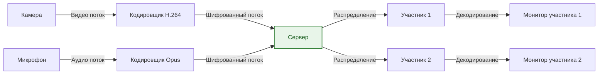

---
tags:
  - all
  - required
  - beginner
title: Видеосвязь
description: >-
  Видеоконференции: Zoom, Teams, Meet, Телемост; горячие клавиши Zoom,
  настройка камеры и микрофона, демонстрация экрана, WebRTC под капотом.
---

import VideoConferenceSimulator from '@site/src/components/VideoConferenceSimulator.jsx';

# Видеосвязь

  ОБЯЗАТЕЛЬНО
  ДЛЯ НОВИЧКОВ

Всем

## Видеосвязь

Ключевые программы для видеосвязи:
- Яндекс.Телемост;
- Zoom;
- Microsoft Teams;
- Google Meet;
- Discord.

<VideoConferenceSimulator />

### Что такое видеосвязь?

**Видеосвязь** — технология передачи аудио и видео данных между участниками в режиме реального времени через компьютерные сети. Система позволяет пользователям видеть друг друга во время общения, делиться контентом на экранах и вести совместную работу вне зависимости от географического расположения.

Технические характеристики видеосвязи включают следующие параметры:

| Параметр | Описание |
|----------|----------|
| Пропускная способность | Требуемая скорость интернета для качественной связи |
| Задержка | Время прохождения сигнала от отправителя к получателю |
| Разрешение | Качество отображения видеоизображения |
| Фреймрейт | Количество кадров в секунду передаваемого видео |
| Кодеки | Алгоритмы сжатия аудиовизуальных данных |

Система видеосвязи работает по принципам пакетной коммутации данных. Информация передаётся небольшими блоками через интернет-провайдеров к серверам обработки, которые распределяют потоки между участниками соединения. Участники подключаются к единой комнате или конференции с индивидуальными идентификационными номерами доступа.

Коммерческий рынок видеосвязи охватывает корпоративный сегмент, образовательные учреждения, медицинские организации и государственный сектор. Технология трансформировала рабочие процессы и коммуникационные модели организаций в глобальном масштабе.

Применение системы охватывает следующие области деятельности:

- Деловые встречи и переговоры
- Обучение и дистанционные лекции
- Медицинские консультации и телемедицина
- Голосовые и визуальные презентации
- Социальное общение личного характера
- Поддержка клиентов и техническая помощь
- Совместная работа над документами и проектами

Важно учитывать технические требования подключения к системе видеосвязи. Стабильность соединения зависит от пропускной способности интернет-канала, качества маршрутизации данных и производительности устройств участников.

---

### Как она работает

Архитектура системы видеосвязи включает несколько основных компонентов. Клиентское приложение отвечает за захват видеопотока с камеры, обработку звука, шифрование данных и декодирование входящих потоков от других участников. Серверная инфраструктура обрабатывает сигнальные сообщения, управляет доступом и маршрутизирует медиапотоки между клиентами.

Процесс установления соединения проходит через следующие этапы:

1. Регистрация клиента в системе через адресацию URL
2. Аутентификация пользователя по учётным данным
3. Генерация идентификатора конференции и паролей доступа
4. Навигация к веб-интерфейсу приложения
5. Предоставление разрешений на использование камеры и микрофона
6. Обнаружение и тестирование периферийных устройств
7. Вхождение в активное соединение

Сетевое взаимодействие происходит по протоколам передачи данных в реальном времени. Видео и аудио кодируются при помощи специализированных кодеков перед отправкой в сеть. Популярные кодеки включают H.264, VP8, VP9 для видеопотоков и Opus для аудиоданных.

Параметры качества обслуживания влияют на восприятие соединения пользователями. Снижение качества происходит при недостаточной пропускной способности канала или перегрузке серверов обработки. Пользователи получают предупреждения о возможном ухудшении качества соединения до фактического проявления проблем.

Коэффициенты эффективности работы системы определяются следующими факторами:

| Фактор | Влияние |
|--------|---------|
| Скорость интернета | Определяет максимальное разрешение и частоту кадров |
| Производительность устройства | Обрабатывает кодирование и декодирование |
| Размер аудитории | Увеличивает нагрузку на серверы и каналы связи |
| География участников | Влияет на задержку через удалённость серверов |
| Тип подключения | Кабельные соединения стабильнее беспроводных |

Диапазон минимальных требований для базовой работы составляет один мегабит в секунду на приём и один мегабит в секунду на отправку данных. Для качественного потока требуется двенадцать мегабит в секунду на каждую сторону.

Функциональные элементы системы включают управление приватностью пользователей. Участники могут блокировать входящие видеопотоки, скрывать своё изображение или приостанавливать работу микрофонов. Администраторы конференций контролируют права доступа и возможность выхода участников из соединения.

---

## Ключевые программы для видеосвязи

Существует несколько программных решений для организации видеосвязи. Каждый продукт предлагает специфический функционал и подходы к обеспечению соединения. Корпоративные клиенты выбирают платформы на основе требований безопасности, масштабируемости и интеграции с бизнес-системами.

### Яндекс.Телемост

Яндекс.Телемост представляет российское решение для видеоконференций с локализацией интерфейса и серверной инфраструктурой внутри страны. Платформа обеспечивает защиту данных согласно требованиям российского законодательства.

Характеристики продукта:

- Работа через веб-браузер без необходимости установки дополнительных программ
- Подключение до двадцати четырёх участников одновременно
- Максимальное разрешение видеопотока сто восемьдесят пикселей на сто восьмидесят четыре пикселя
- Наличие режима демонстрации экрана и обмена файлами
- Интеграция с сервисами экосистемы Яндекса
- Возможность записи конференций на облачном хранилище

Преимущества платформы включают простой интерфейс и отсутствие платного тарифа для базового использования. Лимитированный бесплатный вариант ограничивает продолжительность одной сессии пятьюдесятью девятью минутами.

### Zoom

Zoom занимает лидирующие позиции на мировом рынке видеоконференций. Компания предоставляет комплексные решения для бизнеса с множеством опций управления конференциями.

Основные возможности программы:

- Поддержка до пятисот участников в одном сеансе
- Максимальное разрешение видеопотока четыреста шестьдесят четыре пикселя на семьсот двадцать восемь пикселей
- Инструменты для разделения на малые группы
- Запись локально или облачно с последующей транскрипцией
- Интеграция с календарями и системами планирования
- Расширенная безопасность с защитой паролем и ожиданием входа

Бесплатный тариф предлагает ограничение в тридцать две минуты для групповых звонков. Бизнес-тарифы снимают временные лимиты и добавляют профессиональные функции.

#### Горячие клавиши Zoom

Десктопный клиент Zoom (Windows, macOS, Linux) позволяет управлять встречей с клавиатуры: микрофон, камера, демонстрация экрана, поднятая рука — без поиска кнопок на панели. Полный перечень и переназначение: **Настройки** (иконка шестерёнки) → **Клавиатурные сочетания**. Актуальный список у вендора: [Using hot keys and keyboard shortcuts](https://support.zoom.com/hc/en/article?id=zm_kb&sysparm_article=KB0067050).

**Часто ищут:** `Ctrl+Alt+Shift+H` (Windows) — **отобразить или скрыть всплывающие элементы управления конференцией** (англ. *floating meeting controls*): полоска внизу экрана с кнопками «Микрофон», «Видео», «Участники», «Поделиться экраном». Панель часто пропадает, если курсор убрали с окна встречи; это сочетание возвращает её без движения мыши. На macOS то же действие: `Ctrl+Option+Cmd+H` (в настройках может отображаться как *Show/hide floating meeting controls*). Сочетание можно переназначить в **Клавиатурные сочетания** и при необходимости включить как **глобальное**.

Для отдельных команд можно включить **глобальное** сочетание — оно сработает, даже когда активно другое окно (удобно для `Alt+A`, но возможны конфликты с другими программами). Опцию **«Всегда показывать элементы управления встречей»** (панель не скрывается сама) переключают сочетанием `Ctrl+\` (Windows, Linux, macOS) или включают в **Настройки → Специальные возможности**.

**Push to talk** — удержание `Пробел` временно включает микрофон, пока вы отключены вручную. Включается в **Настройки → Аудио** («Нажмите и удерживайте ПРОБЕЛ, чтобы говорить»).

Сочетания ниже — стандартные для **Windows** и **Linux**-клиента; на macOS те же действия часто на `Cmd` и `Cmd+Shift` (например, `Cmd+Shift+A` — микрофон, `Cmd+Shift+V` — видео). Перед важным созвоном откройте настройки и сверьте раскладку.

| Сочетание | Действие |
|-----------|----------|
| `Ctrl+Alt+Shift+H` | Отобразить или скрыть всплывающие элементы управления конференцией |
| `Alt+A` | Включить или выключить свой микрофон |
| `Alt+V` | Включить или выключить камеру |
| `Пробел` (удерживать) | Временно включить микрофон (push to talk, если включён в настройках) |
| `Alt+S` | Начать или остановить демонстрацию экрана |
| `Alt+T` | Пауза или продолжение демонстрации |
| `Alt+Shift+S` | Остановить текущую демонстрацию и начать новую |
| `Alt+Y` | Поднять или опустить руку |
| `Alt+U` | Открыть или закрыть панель участников |
| `Alt+I` | Окно приглашения в встречу |
| `Alt+N` | Переключить камеру (если подключено несколько) |
| `Alt+F` | Полноэкранный режим |
| `Alt+F1` | Режим активного докладчика |
| `Alt+F2` | Галерея участников |

Дополнительные сочетания для ведущего и записи:

| Сочетание | Действие |
|-----------|----------|
| `Alt+M` | Отключить или включить микрофоны у всех, кроме ведущего (только организатор) |
| `Alt+R` | Локальная запись на компьютер |
| `Alt+C` | Облачная запись (при наличии тарифа) |
| `Alt+P` | Пауза или продолжение записи |
| `Alt+Shift+R` | Запросить удалённое управление чужим экраном |
| `Alt+Shift+G` | Отозвать удалённое управление |
| `Ctrl+Shift+Y` | Панель реакций |
| `Alt+Shift+T` | Снимок экрана (чат Zoom) |

На созвонах с модерацией привычные `Alt+A` и `Alt+Y` снижают «шум» в чате: участник быстро отключает микрофон и поднимает руку, не перебивая докладчика. Подробнее про этикет встреч — в главе [Видеовстречи и голосовые звонки](/encyclopedia/1-basics/1-22-kommunikatsiya-i-obschenie/4).

### Microsoft Teams

Microsoft Teams объединяет видеосвязь с инструментами командной работы в единую экосистему. Платформа ориентирована на корпоративный сегмент предприятий.

Функциональные аспекты платформы:

- Объединение чатов, файлов и встреч в одном приложении
- Интеграция с офисными пакетами Microsoft 365
- Хранение документов в структурированных библиотеках SharePoint
- Управление задачами через интеграцию с Planner
- Настройка каналов для различных проектов и отделов
- Политики безопасности и контроля доступа по ролям

Ограничения бесплатной версии касаются размера хранилища документов и длительности встреч. Организациям рекомендуется использовать платные подписки для полного раскрытия потенциала платформы.

### Google Meet

Google Meet представляет облачное решение от компании Google для видеосвязи. Продукт требует минимум настроек благодаря интеграции с сервисами Google Workspace.

Основные характеристики сервиса:

- Доступ через браузер с возможностью установки расширения
- Подключение до ста пятидесяти участников
- Автоматическое шумоподавление и улучшение качества звука
- Трансляция в высоком качестве без дополнительных настроек
- Синхронизация с календарём Google
- Возможность трансляции для внешнего наблюдения

Платформа не требует скачивания дополнительного программного обеспечения для базового использования. Пользователи могут начать сессию из любого места с авторизацией через учётную запись Google.

### Discord

Discord изначально создавался как платформа для общения геймеров, однако расширил функционал для корпоративного использования. Приложение поддерживает текстовый, голосовой и видеорежимы одновременно.

Отличительные особенности платформы:

- Структура серверов с отдельными голосовыми комнатами
- Низкие задержки передачи данных для игр и живого общения
- Возможность настройки прав доступа для разных групп участников
- Поддержка трансляции экрана высокого качества
- Библиотека ботов для автоматизации задач
- Сообщества с тысячами активных пользователей

Платформа не имеет ограничений по времени проведения сессий в бесплатной версии. Платные подписки увеличивают качество трансляции и добавляют дополнительные возможности модерации.

| Характеристика | Яндекс.Телемост | Zoom | Microsoft Teams | Google Meet | Discord |
|----------------|-----------------|------|-----------------|-------------|---------|
| Максимум участников | 24 | 500 | 10000+ | 150 | Неограниченно |
| Блок записи | Да | Да | Да | Нет | Ограничено |
| Шумоподавление | Базовое | Продвинутое | Базовое | Продвинутое | Базовое |
| Веб-версия | Да | Да | Да | Да | Да |
| Локальный сервер | Нет | Да | Да | Нет | Да |
| Бесплатный тариф | Да | Ограничен | Есть | Есть | Полностью |
| Русификация | Полная | Частичная | Полная | Частичная | Полная |

Выбор платформы зависит от требований организации к безопасности, масштабируемости и существующей экосистеме программных инструментов. Компании с устоявшейся инфраструктурой Microsoft предпочитают Teams, организации, использующие Google сервисы — Meet, а команды с международными сотрудниками рассматривают Zoom.

---

## Настройка и подготовка

### Как настраивать видеокамеру

Правильная настройка камеры обеспечивает качественное изображение всех участников видеоконференции. Основные параметры настройки включают разрешение, угол обзора, фокусировку и освещение сцены.

Разрешение определяет детализацию изображения. Современные камеры поддерживают разрешения от стандартного до высокого качества. Настройки разрешения находятся в меню приложений или драйверов оборудования. Повышение разрешения увеличивает потребление ресурсов процессора и требует более высокой пропускной способности канала.

Угол обзора задаёт площадь видимой сцены. Широкоугольные объективы позволяют захватить больше участников за одним столом. Узкоугольные варианты обеспечивают большую детализацию лица конкретного человека. Выбор угла зависит от количества участников в помещении.

Фокусировка определяет чёткость изображения. Автоматическая фокусировка корректируется системой самостоятельно при изменении расстояния до объекта. Ручная настройка требует внимания оператора. Важно установить фокус на уровне глаз основного говорящего.

Освещение комнаты напрямую влияет на качество видеопотока. Естественный свет должен падать спереди на лицо участника. Боковые источники создают тени на лице и снижают узнаваемость. Освещение сзади размывает контур фигуры на общем фоне.

Рекомендации по позиционированию камеры:

- Разместите камеру на уровне глаз или чуть выше
- Отрегулируйте высоту так чтобы верхняя часть головы попадала в кадр
- Оставьте небольшое пространство над головой для композиции кадра
- Избегайте прямого попадания света в объектив
- Используйте задний фон без отвлекающих элементов
- Закройте лишние окна в зоне видимости камеры

Порядок настройки камерного оборудования включает следующие шаги:

1. Проверка физического состояния объектива и отсутствия повреждений
2. Установка камеры на устойчивую поверхность или штатив
3. Подключение кабеля питания и интерфейса к компьютеру
4. Инициализация драйверов операционной системой
5. Открытие настроек видеосвязи приложения
6. Выбор корректного устройства в списке входных камер
7. Тестирование изображения в предварительном просмотре
8. Регулировка яркости, контраста и насыщенности цветов
9. Сохранение параметров настройки

Дополнительные параметры настройки включают баланс белого и экспозицию. Автоматический режим балансирует температуру цвета для естественного отображения кожи. Ручной контроль позволяет адаптировать настройки к условиям освещения. Экспозиция регулирует интенсивность света поступающего на матрицу.

Не все камеры имеют полный набор ручных настроек. Профессиональные веб-камеры предлагают расширенные опции калибровки. Смартфоны используют алгоритмические методы улучшения изображения при съёмке.

Настройки хранения изображений определяют формат сохранения записей. Некоторые приложения позволяют сохранять только видео, другие добавляют текстовые комментарии к записи. Параметры сжатия влияют на размер файла и качество воспроизведения.

---

### Как настраивать звук и микрофон

Качество аудиопотока критически важно для восприятия видеоконференции пользователями. Микрофоны и динамики требуют правильной конфигурации для устранения помех и улучшения разборчивости речи.

Выбор микрофона зависит от условий окружения. Встроенные микрофоны ноутбуков воспринимают звуки со всех направлений. Внешние микрофоны фокусируют внимание на конкретном источнике звука. Петличные микрофоны крепятся на одежде и отделяют голос от шума окружения. Гарнитуры сочетают микрофон с наушниками для закрытой звуковой схемы.

Параметры аудионастроек включают следующие значения:

- Уровень чувствительности ввода
- Режим автоматической регуляции громкости
- Подавление фоновых шумов
- Эхоподавление для динамиков
- Баланс левого и правого каналов

Шаги настройки аудиосистемы включают:

1. Проверка правильного подключения микрофона к порту компьютера
2. Открытие системных настроек звука операционной системы
3. Выбор устройства вывода в разделе динамиков
4. Выбор устройства ввода в разделе микрофона
5. Тестирование уровня входного сигнала
6. Регулировка чувствительности до оптимального уровня
7. Активация функций шумоподавления в приложении
8. Проверка отсутствия эха при работе с внешними колонками

Уровень входного сигнала отображается индикаторами громкости в приложениях. Оптимальный диапазон составляет от пятидесяти до семидесяти процентов от максимального уровня. Значения превышающие девяносто процентов вызывают искажения. Слишком низкие показания приводят к потере частей речи.

Микрофонная политика определяется правилами организации конференций. Участникам сообщают правила поведения во время совещания. Выключение микрофона при отсутствии речи снижает шум в эфире. Использование кнопки принудительного выключения обеспечивает оперативность действий.

Проблемы с качеством звука возникают по следующим причинам:

| Причина | Решение |
|---------|---------|
| Фоновый шум | Использовать направленное оборудование |
| Помехи в эфире | Переключить на другой канал Wi-Fi |
| Недостаточно громкий звук | Повысить чувствительность микрофона |
| Эхо отражённое | Убрать динамики из зоны микрофона |
| Искажение голоса | Отключить эффекты усиления |
| Прерывания звука | Перезапустить приложение и перезагрузить устройство |

Громкость выходного сигнала настраивается индивидуально для каждого участника. Слушатели регулируют уровень динамиков под своё помещение. Слишком высокая громкость может вызвать дискомфорт и боль в ушах. Чрезмерно тихий звук затрудняет понимание речи.

Форматы сжатия аудиопотока включают различные кодеки. Opus является современным стандартом для потоковой передачи звука. Он обеспечивает высокое качество при низкой пропускной способности. AAC используется в экосистемах Apple для совместимости.

Защита конфиденциальности микрофона реализована средствами операционных систем. Приложения запрашивают разрешение на доступ к микрофону перед началом работы. Блокировка доступа предотвращает несанкционированную запись разговоров. Пользователи видят индикаторы активности микрофона при включённом состоянии.

---

### Как делиться экраном

Функция демонстрации экрана позволяет участникам видеоконференции видеть содержимое монитора ведущего. Технология применяется для презентаций, просмотра кода, навигации по документу или совместного редактирования файлов.

Процессы передачи изображения включают захват области экрана, кодирование изображения и доставку потока остальным участникам. Ведущий выбирает цель демонстрации целиком рабочий стол или конкретное приложение. Приложения с анимациями требуют большей пропускной способности канала.

Типы разделённого контента различаются по характеристикам:

- Полный рабочий стол демонстрирует все окна и папки
- Конкретное окно фокусирует внимание на одном приложении
- Изображение открывает статичный файл для обсуждения
- Презентация показывает последовательность слайдов
- Браузер демонстрирует веб-страницы и онлайн ресурсы

Порядок запуска демонстрации экрана:

1. Нажатие кнопки Поделиться экраном в интерфейсе приложения
2. Выбор типа демонстрации из доступных вариантов
3. Выделение целевого окна или рабочей области
4. Подтверждение начала передачи
5. Контроль за тем что демонстрируется посторонним
6. Остановка показа при завершении задачи

Режимы обновления изображения влияют на производительность. Режим постоянного обновления передаёт всё изменения немедленно. Режим по требованию обновляется при действиях ведущего. Низкое разрешение уменьшает нагрузку на систему.

Проблемы с демонстрацией решаются следующими способами:

- Замедленная передача снижается при перегрузке сети
- Размытость текста устраняется переключением на другое разрешение
- Исчезновение изображения помогает перезапуск приложения
- Ошибки разрешения требуют проверки настроек дисплея
- Неправильная ориентация меняется через параметры системы

Ограничения безопасности включают предупреждение о показе конфиденциальной информации. Ведущие обязаны проверять наличие личных файлов в общей области. Некоторые приложения запрещают передачу защищённых системных областей.

Технологии оптимизации используют сжатие изображения перед отправкой. Кодировщики выделяют статические области для экономии трафика. Анимации преобразуются в упрощённые формы для снижения потребления ресурсов.

---

### Какие еще есть возможности

Вспомогательные функции расширяют возможности платформы видеосвязи Beyond basic voice и video. Организации внедряют эти инструменты для повышения эффективности коммуникации и продуктивности сотрудников.

Таблица функций вспомогательного плана:

| Функция | Назначение | Преимущества |
|---------|------------|--------------|
| Чат | Текстовая переписка участников | Быстрая передача ссылок и файлов |
| Рейты | Оценка выступлений докладчиков | Мгновенная обратная связь |
| Белыйboard | Совместное рисование и разметка | Визуализация идей |
| Реакции | Визуальная оценка ответов | Быстрое выражение мнения |
| Сценарий | Управление последовательностью событий | Структурированный ход собрания |
| Интерактивные доски | Коллаборативное пространство | Групповая мозговая атака |
| Аналитика | Статистика участия и просмотров | Контроль посещаемости |
| Транскрипция | Автогенерация текста беседы | Поиск по прошлым разговорам |
| Запись | Сохранение аудио и видео | Доступ для отсутствующих |
| Модерация | Управление доступом участников | Защита от вмешательства посторонних |

Чат позволяет участникам отправлять текстовые сообщения в реальном времени. Сообщение появляется рядом с видеопотоком или в отдельной боковой панели. Файлы передаются через те же каналы. История чата сохраняется после завершения встречи.

Внутренние рейтинги обеспечивают оценку выступления докладчиков. Участвующие зрители ставят оценки после окончания презентации. Средние баллы формируют статистику для спикеров.

Инструменты обратной связи показывают эмоциональное состояние аудитории. Реакции появляются поверх видеопотока без необходимости говорить. Большинство применяемых реакций включают лайк, аплодисменты и другие символы.

Анализ собранных данных даёт представление о посещаемости и активности. Отчёты содержат информацию о дате, времени и длине встречи. Данные используются менеджерами для аудита процессов.

Модерация конференций контролирует поведение участников. Администраторы удаляют нарушителей правил общения. Блокировка миксофона предотвращает вмешательство в основной контент.

Использование перечисленных возможностей повышает результативность встреч и снижает количество ошибок коммуникации. Организации выбирают функции исходя из потребностей сотрудников и специфики рабочих процессов.

---

## Под капотом — от микрофона до экрана собеседника

Видеозвонок в Zoom/Teams/Meet — это **WebRTC** (или проприетарный стек с теми же идеями): медиа идут не «напрямую в интернет», а через цепочку серверов и кодеков.

| Узел | Роль |
|------|------|
| **Захват** | Камера/микрофон → драйвер → ОС → приложение |
| **Кодирование** | Сжатие VP8/H.264, Opus — битрейт под сеть |
| **Сигнализация** | Кто с кем звонит, обмен SDP (параметры потока) |
| **SFU / MCU** | Сервер раздаёт потоки в групповом звонке |
| **STUN/TURN** | Пробитие NAT: домашний роутер часто блокирует «прямой» P2P |
| **Декодирование** | У собеседника — обратно в звук и кадры |

**Демонстрация экрана** — отдельный видеопоток (часто с более высоким битрейтом): приложение захватывает буфер окна или всего десктопа. Конфиденциальность: в кадр попадают уведомления, превью вкладок — проверяйте перед «Поделиться».

**Шифрование:** транспорт TLS между клиентом и сервером; E2E (где заявлено) — ключи только у участников, сервер видит шифротекст. Запись на сервере — отдельная политика организации.

---

## Опыт, мнение и истории

**«Вас не слышно».** Час настройки Zoom — оказалось, в Windows выбран не тот микрофон (гарнитура по USB, а активен массив ноутбука). Панель **Параметры → Звук → Ввод** + тест в приложении — перед каждым важным созвоном.

**Камера занята.** Skype «держал» камеру после закрытия — Meet писал «устройство недоступно». Перезапуск приложения или завершение `SkypeApp.exe` в диспетчере задач — быстрее, чем перезагрузка ПК.

**Фон и шум.** В open space без наушников коллеги слышали клавиатуру. Встроенное шумоподавление Teams помогло; для регулярных созвонов — гарнитура с микрофоном ближе ко рту.

**Мнение.** Для семьи и учёбы хватает бесплатного лимита Meet или Discord. Корпоративный Teams оправдан, когда компания платит за календарь и запись; ставить «всё подряд» из-за моды — лишняя нагрузка на автозагрузку.

---
