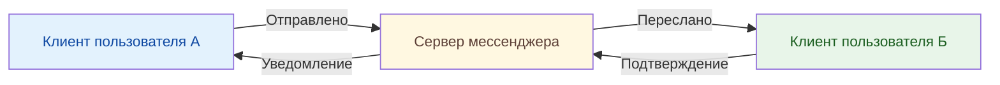
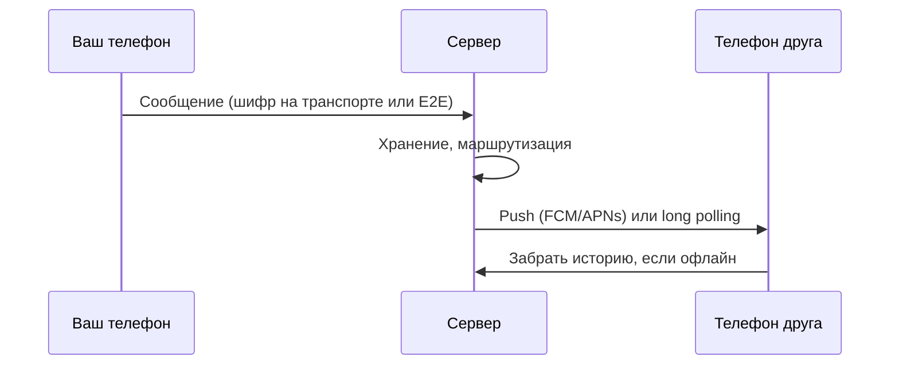

---
tags:
  - all
  - required
  - beginner
title: Мессенджеры
description: Сервисы мгновенного обмена сообщениями и голосовой связи.
---

import MessengerSimulator from '@site/src/components/MessengerSimulator.jsx';

# Мессенджеры

<div class="article-tags">
  <span class="tag tag-required">ОБЯЗАТЕЛЬНО</span>
  <span class="tag tag-beginner">ДЛЯ НОВИЧКОВ</span>
</div>

<span class="complexity-badge">Всем</span>

---

## Мессенджеры

Ключевые мессенджеры:
- Telegram;
- WhatsApp.

---

### Что такое мессенджер?

Понятие **мессенджер** (от англ. *messenger* — гонец, посыльный) исторически относилось к человеку, доставлявшему письма или устные сообщения. В цифровой среде это слово превратилось в обозначение программного продукта, решающего задачу **синхронного и асинхронного обмена структурированными данными между пользователями в реальном времени**.

Сегодня мессенджеры образуют **информационно-коммуникационную инфраструктуру**, сопоставимую по значимости с электронной почтой, DNS или HTTP. В них интегрируются:  
- каналы массовой коммуникации (каналы, рассылки),  
- системы управления (боты, команды),  
- платформы микросервисов (API, вебхуки, облачные функции),  
- интерфейсы для бизнеса (чат-боты, CRM-интеграции),  
- средства цифровой идентификации (Telegram Passport, VK ID).  

По сути, современный мессенджер — это **гибрид социальной сети, клиент-серверного приложения и распределённой системы обмена сообщениями**, построенной на строгих протоколах и высокодоступных архитектурах.

<div class="callout callout--tip">
  <div class="callout-title">Важно</div>
  Данная статья предназначена для ознакомления с мессенджерами и не имеет никаких политических целей. В Российской Федерации компании Meta Platforms Inc. (владелец WhatsApp, Facebook, Instagram) и Telegram Messenger Inc. признаны экстремистскими организациями. Использование их продуктов может нарушать законодательство РФ.
</div>

---

Основная функция таких систем заключается в быстрой передаче текстовых данных, медиафайлов и других типов информации между двумя или более участниками общения.

Системы мессенджеров поддерживают различные форматы коммуникации:
- одиночные сообщения,
- групповые обсуждения,
- обмен аудио и видеозаписями. 

Современные решения предоставляют возможности создания *временных сообщений* с автоматическим удалением, демонстрация статуса присутствия, передача геолокации и реализация голосовых звонков.

Технологии мессенджеров основаны на интернет-протоколах и используют серверную инфраструктуру для маршрутизации данных между подключёнными клиентами. Пользователи устанавливают специальное приложение на своё устройство и регистрируют аккаунт под уникальным номером телефона или адресом электронной почты.

<MessengerSimulator />

---

### История развития технологий

Первые программы для мгновенной передачи сообщений появились в конце 1980 годов. Они функционировали локально в рамках корпоративных сетей компаний. Развитие Интернета в 1990 годах привело к созданию публичных сервисов **ICQ** и **Skype**. Эти системы позволили пользователям из разных городов и стран обмениваться данными без дополнительных затрат.

Современные платформы объединяют функции классической телефонии и электронной почты. Они поддерживают кроссплатформенную работу на мобильных операционных системах iOS и Android, а также десктопных средах Windows и macOS.

<div class="callout callout--tip">
<div class="callout-title">Ключевое преимущество</div>
Мгновенность доставки сообщений обеспечивает реальное время взаимодействия, что отличает их от традиционных средств коммуникации.
</div>

---

## Как работают мессенджеры

Работа любой мессенджер-системы строится на взаимодействии нескольких ключевых компонентов.
1. **Клиентское приложение** устанавливается на устройство пользователя и предоставляет интерфейс для ввода текста, выбора файлов и отображения истории переписки.
2. **Серверная часть** хранит данные пользователей и обеспечивает передачу сообщений между участниками.

Процесс отправки сообщения начинается с ввода текста в клиентском приложении. Приложение кодирует данные в соответствии с используемым форматом и отправляет их через сетевой протокол на центральный сервер. 

Сервер *проверяет* наличие получателя в базе данных и *направляет сообщение* соответствующему устройству. Если получатель не активен, сервер сохраняет копию до момента подключения устройства к сети.

При получении сообщение проходит процесс декодирования и отображается в интерфейсе приложения. Система фиксирует статус прочтения и передаёт информацию обратно отправителю. 

При наличии шифрования все данные передаются в *зашифрованном* виде, что защищает содержимое от несанкционированного доступа.

---


---

### Сетевые протоколы

Мессенджеры используют различные протоколы для передачи данных. Протокол HTTP распространяется в веб-браузерах и поддерживает передачу данных по запросу клиента. Протокол WebSocket обеспечивает постоянное соединение между клиентом и сервером, что позволяет передавать сообщения без постоянного повторного запроса. Протокол MQTT применяется в системах с низким потреблением трафика и подходит для устройств с ограниченной мощностью обработки.

Шифрование данных реализуется через стандарты SSL/TLS. Эти технологии обеспечивают защиту канала связи от перехвата третьими лицами. Некоторые системы применяют дополнительное сквозное шифрование, при котором ключи расшифровки существуют только на устройствах участников диалога.

---

## Архитектура и виды мессенджеров

Тип архитектуры определяет основные характеристики работы системы: скорость доставки сообщений, устойчивость к сбоям, безопасность и масштабируемость. Три основных подхода реализуют разные модели взаимодействия узлов системы.

| Тип архитектуры | Описание | Преимущества | Недостатки |
|---|---|---|---|
| P2P | Прямое соединение между клиентами | Отсутствие центрального сервера, высокая устойчивость | Зависимость от активности клиентов, сложности с NAT |
| Клиент-сервер-клиент | Сообщения проходят через сервер | Централизованное хранение, простая маршрутизация | Единая точка отказа, нагрузка на сервер |
| Гибридный | Комбинация моделей | Баланс между скоростью и надёжностью | Сложность реализации |

---

### P2P архитектура

В модели p2p (peer-to-peer) устройства соединяются напрямую друг с другом без посредничества центрального сервера. Каждое устройство выступает одновременно как клиент и как узел сети. Такой подход обеспечивает высокую доступность при отсутствии единой точки отказа. Сообщения передаются напрямую между отправителем и получателем, что снижает задержки.

Однако модель требует наличия постоянных открытых портов для входящих соединений. Устройство находящееся за NAT роутером может оказаться недоступным для прямого соединения. Пиринговые системы часто используют промежуточные серверы для установления первоначального контакта, после чего подключение устанавливается напрямую.

---

### Клиент-сервер-клиент архитектура

Популярная модель использует центральный сервер для управления всеми коммуникациями. Клиенты подключаются к серверу и сохраняют состояние своей сессии там. Все сообщения проходят через сервер, который распределяет их среди активных получателей. Хранение истории переписки производится на сервере, что позволяет восстановить общение с любого устройства.

Такая архитектура упрощает управление доступом и контроль контента. Администраторы могут реализовать модерацию, блокировку нежелательных контактов и фильтрацию спама. Масштабирование происходит через добавление новых серверов или расширение ресурсов существующих узлов.

---

### Зашифрованные и незашифрованные системы

Различия в подходе к безопасности определяются уровнем защиты передаваемых данных. Незашифрованные системы передают текст в открытом формате, что позволяет просматривать его администраторам сервиса или злоумышленникам при перехвате трафика. Такие решения используют базовые механизмы защиты транспортного уровня TLS.

Зашифрованные системы добавляют дополнительный слой криптографической защиты. Сквозное шифрование означает, что ключи расшифровки генерируются на устройствах участников и не передаются ни на какие сторонние узлы. Только участники диалога обладают возможностью прочитать содержимое сообщений. Провайдер сервиса не может предоставить историю переписки даже по судебному запросу.


| Характеристика | Без сквозного шифрования | Со сквозным шифрованием |
|---|---|---|
| Доступность к контенту для провайдера | Полная | Отсутствует |
| Защита при перехвате данных | Частичная | Полная |
| Возможность восстановления истории | Да | Только на устройствах участников |
| Безопасность при компрометации сервера | Низкая | Высокая |
| Скорость обмена сообщениями | Выше | Ниже |


<div class="callout callout--tip">
<div class="callout-title">Рекомендация по безопасности</div>
Для конфиденциальных переговоров используйте сервисы со встроенным механизмом сквозного шифрования. Проверьте настройки приватности и убедитесь в подтверждении ключей шифрования.
</div>

---

## Чем мессенджер отличается от SMS и электронной почты

Три технологии представляют разные подходы к организации дистанционного общения. Понимание различий помогает выбрать оптимальный инструмент для конкретных задач.

---

### Сравнительные характеристики

| Критерий | SMS | Электронная почта | Мессенджер |
|---|---|---|---|
| Стоимость передачи | Взимаемая оператором | Бесплатная | Бесплатная |
| Время доставки | Минуты | От секунд до дней | Мгновенно |
| Ограничение на размер | Около 160 символов | Не ограничено | До 50 МБ файлов |
| Вложения | Не поддерживаются | Поддерживаются | Поддерживаются |
| Групповая рассылка | Ограничена | Ограничена | Широкие возможности |
| Наличие в офлайне | Нет | Есть | Есть |
| Криптография | Отсутствует | Возможна | Часто реализована |
| Регистрация | Номер телефона | Адрес | Номер телефона или логин |

SMS передаются через мобильные сети и требуют наличия SIM карты. Их стоимость зависит от тарифного плана оператора и географического положения. Электронная почта работает через стандартизированные протоколы SMTP, IMAP и POP3. Сообщения доставляются независимо от состояния сети получателя и хранятся на сервере до момента получения.

Мессенджеры используют собственные протоколы поверх IP-сетей. Для работы требуется установленное приложение и аккаунт. Все участники должны быть зарегистрированы в одной системе. Данные синхронизируются между устройствами одного пользователя, что позволяет продолжить общение с другого устройства.

---

### Применение

Для экстренных уведомлений подходят SMS благодаря высокой доступности мобильных сетей. Для официальной деловой переписки рекомендуется использовать электронную почту для фиксации юридически значимых документов. Для повседневного быстрого общения оптимальны мессенджеры.

Современные бизнес процессы интегрируют все три средства. Автоматизированные уведомления направляются через SMS, детальная информация приходит по электронной почте, а оперативные вопросы решаются через мессенджер.

---

## Чаты

**Чат** представляет собой отдельный сеанс общения между участниками. Системы позволяют создавать новые чаты и управлять историей предыдущих диалогов. Каждая беседа имеет уникальный идентификатор, который служит точкой маршрутизации сообщений.

Одиночный чат предназначен для общения двух человек. Участники видят одинаковую историю переписки и имеют равные права на управление беседой. Групповой чат объединяет несколько пользователей и позволяет обмениваться информацией сразу между всеми участниками.

---

### Управление участием

Администраторы групп имеют полномочия добавлять и удалять участников, менять название беседы, устанавливать правила поведения и сохранять важные сообщения. Обычные пользователи могут отправлять сообщения и отвечать на них, но не могут изменять состав участников.

Система уведомлений оповещает участников о новых событиях. Настройка громкости звука и яркости индикатора позволяет настроить реакцию на события. Возможность отключения уведомлений для конкретного чата пригодится при большом количестве входящей информации.

---

### Статусы и индикаторы

Видео и статусы показывают текущее состояние участника. Аватар изображения указывает на онлайн или офлайн режим. Индикатор набора показывает момент ввода текста до момента отправки. Флаги прочтения отображают факт чтения сообщения конкретным участником.

Присутствие обозначается зелёным индикатором для активных участников и серым для неактивных. Время последнего посещения отображается в настройках некоторых платформ. Это помогает определить готовность собеседника к немедленному общению.

---

## Каналы и группы

Разделение на каналы и группы решает разные задачи распространения информации. Каналы предназначены для вещания от одного источника ко многим получателям. Группы предназначены для равноправного участия всех членов сообщества.

---

### Каналы вещания

**Канал** — это односторонний поток сообщений от владельца к подписчикам. Подписчики не могут отправлять сообщения, но могут комментировать отдельные публикации. Каналы удобны для новостей, анонсов и образовательного контента. Количество подписчиков может достигать сотен тысяч человек.

Сообщения в каналах публикуются с сохранением хронологии. Новые посты появляются сверху списка. Пользователи могут репостить каналы в свои личные чаты. Статистика просмотров помогает оценить охват аудитории.

---

### Группы общения

**Группа** — это пространство для коллективного обсуждения. Все участники имеют право отправлять сообщения и участвовать в диалогах. Модерация контролирует содержание и пресекает спам и оскорбления. Группы идеальны для командной работы и обсуждений интересов.

Количество участников ограничено техническими возможностями платформы. Передача сообщений требует подтверждения каждого участника. Удаление участников производится только администраторами. Важные темы могут быть вынесены в закрепленные сообщения.

---
| Особенность | Канал | Группа |
|---|---|---|
| Авторство сообщений | Один владелец | Любой участник |
| Количество участников | Неограниченно | Ограничено (обычно до 200 тысяч) |
| Комментарии | Опционально | По умолчанию включены |
| Управление доступом | Подписка | Приглашение или код |
| Целевое назначение | Вещание | Обсуждение |

---
<div class="callout callout--tip">
<div class="callout-title">Лучшая практика использования</div>
Для рассылки новостей создавайте канал, для совместной работы выбирайте группу. Не смешивайте эти сценарии в одном пространстве.
</div>

---

## Обмен файлами

Мессенджеры предоставляют широкие возможности для передачи файлов различных типов. Системы поддерживают изображения, видео, документы и архивы. Каждый тип файла обрабатывается соответствующим образом и доступен для просмотра средствами платформы.

Типы поддерживаемых файлов включают фотографии формата JPEG и PNG, видео форматов MP4 и WEBM, документы PDF и DOCX, звуковые файлы MP3 и OGG. Размер файла ограничен технической политикой конкретной системы. Стандартные ограничения составляют от 50 МБ до 2 ГБ на одно сообщение.

---

### Форматы изображений

Изображения передаются сжатием для экономии трафика. Качество снижается пропорционально размеру файла. Пользователи могут отправить исходник без сжатия, если требуется сохранение деталей. Предпросмотр позволяет оценить содержимое перед открытием полного файла.

---

### Документы и офисные файлы

Документы хранятся в исходном формате и открываются специализированными программами на устройстве получателя. Текстовые редакторы поддерживают редактирование внутри документа. Таблицы сохраняют структуру и формулы. Презентации воспроизводятся как последовательность слайдов.

Файлы облачных хранилищ доступны через прямую ссылку. Это исключает необходимость загрузки больших объёмов данных. Получатель получает доступ к ресурсу через свой аккаунт.

---

### Сжатие и качество

Передача файлов происходит через сжатый канал связи. Изображения уменьшаются до размера экрана мобильного устройства. Видео конвертируется в меньший битрейт. Аудио файлы могут быть сжаты для ускорения загрузки. Оригинальные версии доступны при необходимости.

---

## API, боты, интеграции

Программные интерфейсы позволяют расширять функциональность мессенджеров за счёт внешних приложений. **API** — это набор правил взаимодействия между программами. Через API разработчики создают новые инструменты и сервисы.

Боты представляют собой автоматизированные программы, которые имитируют действия человека. Они выполняют операции по заданным правилам и отвечают на команды пользователей. Популярные боты предлагают справочную информацию, управление заказами и напоминания о событиях.

---

### Разработка ботов

Для создания бота требуется зарегистрировать аккаунт в административном центре платформы. Затем предоставляется токен авторизации и описание логики работы. Бот реагирует на определённые команды или сообщения. Он может хранить историю обращений и формировать ответы на основе контекста.

Пример структуры JSON для отправки сообщения:
```json
{
    "chat_id": 123456789,
    "text": "Привет, это пример ответа от бота"
}
```
Это команда отправляется через API мессенджера. Параметр chat_id указывает получателя. Параметр text содержит текст ответа. Сервер возвращает статус выполнения.

---

### Интеграции с внешними системами

Мессенджеры объединяются с CRM системами для управления обращениями клиентов. Интеграция с календарём организует встречи и напоминания. Подключение к платежным шлюзам позволяет оформлять заказы. Интеграция с аналитическими инструментами собирает статистику взаимодействий.

Вебхуки уведомляют о событиях в реальном времени. Сервер внешней системы получает данные при создании нового сообщения. Это позволяет автоматически реагировать на изменения без постоянного опроса.

---

## Средства цифровой идентификации

Цифровые идентификаторы позволяют подтверждать личность пользователей внутри экосистем мессенджеров. Это упрощает регистрацию на внешних сервисах и повышает безопасность доступа.

---

### Telegram Passport

**Telegram Passport** — это инструмент хранения личных данных пользователя. Документ загружается в зашифрованную форму и хранится только на устройстве владельца. Пользователь самостоятельно решает, кому передавать доступ к информации.

Сервис запрашивает паспортные данные, водительские права и другие удостоверения. Информация подтверждается независимыми проверками. Владелец контролирует срок действия разрешения и может отзывать его в любой момент.

---

### VK ID

**VK ID** предоставляет единую точку входа для множества сервисов ВКонтакте и партнёров. Пользователь авторизуется один раз и получает доступ к связанным ресурсам. Система управляет разрешениями на доступ к данным.

Преимущества включают удобство запоминания одного пароля вместо множества. Повышенная безопасность достигается через многоступенчатую проверку. Контроль прав доступа осуществляется в личном кабинете пользователя.

---

### Сравнение решений

| Параметр | Telegram Passport | VK ID |
|---|---|---|
| Тип данных | Документы и удостоверения | Профиль пользователя |
| Область применения | Различные сервисы | Экосистема VK |
| Согласие на использование | Явное для каждой службы | Автоматически по соглашению |
| Возможность отзыва | Всегда доступна | Зависит от политики сервиса |
| Защита данных | Сквозное шифрование | Шифрование на транспортном уровне |

<div class="callout callout--tip">
<div class="callout-title">Рекомендации по использованию цифровых идентификаторов</div>
Используйте эти инструменты только для доверенных сервисов. Проверяйте политику конфиденциальности перед предоставлением доступа к данным.
</div>

---

## Под капотом — как уходит сообщение

Мессенджер — **клиент + сервер + push**. Упрощённая схема для Telegram/WhatsApp/Viber:



| Компонент | Назначение |
|-----------|------------|
| **Клиент** | UI, локальная БД чатов, шифрование (если E2E) |
| **Сервер** | Доставка, медиа CDN, боты, модерация |
| **Push** | Пробуждение приложения без постоянного соединения |
| **Синхронизация** | Несколько устройств одного аккаунта — общая очередь на сервере |

**Файлы и голосовые** — отдельные объекты в облаке; в чате остаётся ссылка и превью. **Каналы** (Telegram) — публикация в широковещательную ленту; **чаты** — диалог с ACK "доставлено/прочитано".

**Боты** — HTTP webhook на ваш сервер или long polling: сервер мессенджера вызывает URL при сообщении пользователя боту.

---

## Опыт, мнение и истории

**Потеря переписки.** Сменил телефон без резервной копии WhatsApp (старый телефон уже сброшен) — годовая переписка с родственниками осталась только у них. Сейчас перед сменой устройства — **облачный бэкап** или экспорт важных чатов.

**"Удалили аккаунт".** Восстановление номера через SIM помогло вернуть Telegram; история подтянулась с сервера. В мессенджере без облачного бэкапа номер = идентичность — берегите SIM и двухфакторную аутентификацию.

**Рабочий и личный.** Два приложения (Telegram + корпоративный Teams) на одном телефоне — путаница уведомлений. Отключил превью текста на экране блокировки для рабочего — меньше случайных "подглядываний" коллег.

**Мнение.** Для семьи и друзей — один мессенджер, где уже сидит круг. Для документов и договорённостей — дублируйте критичное в почту или файловое хранилище: мессенджер — чат, а не архив на десятилетия.

---