---
tags:
  - all
  - required
  - beginner
title: Настройка Windows
description: Пошаговая инструкция по первичной конфигурации операционной системы Windows.
related:
  - title: "Предупреждения при изучении — о разделе"
    doc: encyclopedia/1-basics/1-05-preduprezhdenie/intro
  - title: "Родительский контроль"
    doc: encyclopedia/1-basics/1-12-sovety-dlya-novichka/111
  - title: "Английский язык в IT — о разделе"
    doc: encyclopedia/1-basics/1-30-angliyskiy-yazyk/intro
  - title: "Поисковые системы"
    doc: encyclopedia/1-basics/1-21-poisk-informatsii/1
  - title: "Архитектура десктопных приложений"
    doc: encyclopedia/4-code-dev/4-11-desktopnye-prilozheniya/1
  - title: "Устройство и надёжность паролей"
    doc: encyclopedia/2-system-network/2-08-osnovy-informatsionnoy-bezopasnosti/114
  - title: "Цифровые формы и анкеты"
    doc: encyclopedia/1-basics/1-22-kommunikatsiya-i-obschenie/6
  - title: "Электронная почта"
    doc: encyclopedia/1-basics/1-22-kommunikatsiya-i-obschenie/3
---

# Настройка Windows

  ОБЯЗАТЕЛЬНО
  ДЛЯ НОВИЧКОВ

Опытным пользователям

  
Для кого эта глава

  

  Вы уже уверенно пользуетесь Windows и хотите убрать лишнее из автозагрузки и уведомлений. Для первых шагов с ПК начните с главы "Советы для начинающего пользователя ПК" — там безопасность без "вырезания" системы. Культурный контекст шуток про [переустановку Windows](/encyclopedia/9-spinoff/9-10-internet-kultura/131) и практика — [95](/encyclopedia/2-system-network/2-06-sistemnoe-administrirovanie/95), не вместо этой инструкции.

  

---

## Гайд по настройке Windows

  
**Зачем?**

  

  Microsoft не выпускает "чистую" или "урезанную" сборку Windows для геймеров. Многие компоненты модульные и их можно отключить, а важные функции (Xbox Live Auth Manager, Game Bar, Store и т.д.) обеспечивают совместимость: DRM (PlayReady), онлайн-сервисы (Game Pass, Xbox Live), обновления UWP-приложений (например, драйверов принтеров и сканеров), а также API для игр (например, DirectStorage, HDR, Auto HDR). Удаление ключевых компонентов (например, Store, Xbox Identity Provider, Gaming Services) может нарушить лицензирование игр, работу античитов (BattlEye, Easy Anti-Cheat), интеграцию с облачными сохранениями и даже обновления ОС.

Поэтому не следуйте гайдам в сети и не вырезайте всё подряд - поверьте, 10-50 МБ оперативной памяти уже не критично.

Главное - отключить всё, что потребляет ресурсы в фоне, не соответствует вашей модели использования и не критично для совместимости и безопасности.

  
  

---

## 🔧 1. Установка и базовая безопасность

---

### 1.1. Настройки установки

При первом запуске Windows (OOBE — Out-of-Box Experience):
- **Выключите все телеметрические компоненты**, если предлагается выбор:
  - [x] "Помогать улучшать Windows" → **Нет**
  - [x] "Клипы для игр" → **Нет**
  - [x] "Идентификация в Xbox" → **Пропустить**
  - [x] "Синхронизация параметров" → **Нет**
  - [x] "Предложения и подсказки" → **Выкл**
- Лучше создать **локальную учётную запись** (не Microsoft), если не требуется облачная интеграция.

---

## 🗑️ 2. Удаление и отключение предустановленных приложений

> ⚠️ Не используйте сторонние "уборщики", особенно без понимания, что они делают. Всё это можно сделать через стандартный интерфейс.

Первым делом нам нужно попасть в параметры системы. Самый простой вариант - клик правой кнопкой мыши по значку Пуска и выбор пункта Параметры.

---

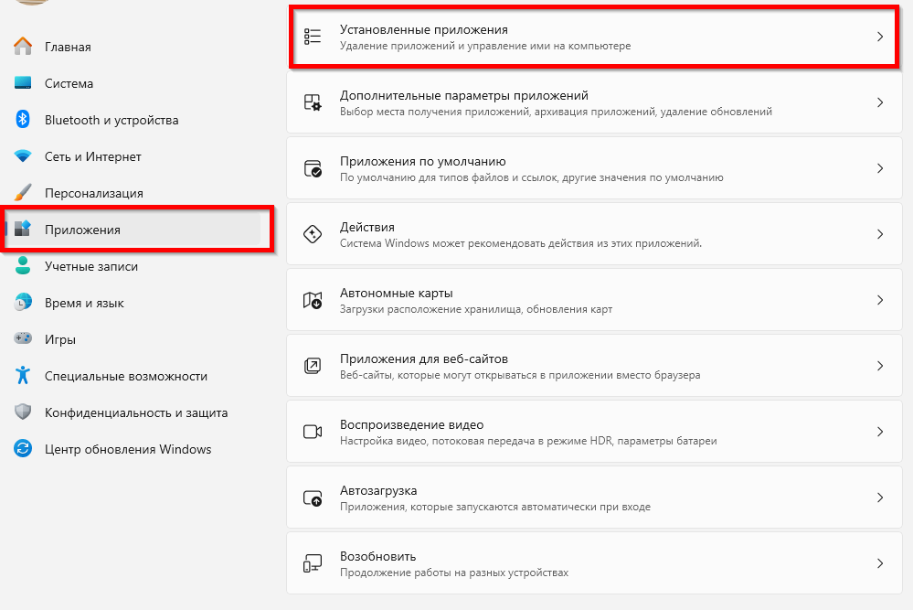

---

### 2.1. Удаляем вручную 

Вручную удаляются через Параметры → Приложения → Установленные приложения):

- [ ] Microsoft 365 Apps (если не нужен и не подписаны на Microsoft 365)
- [ ] Outlook (если не используете клиент для почты)
- [ ] Xbox App, Xbox Game Bar, Xbox Identity Provider (⚠️ только если точно не нужна интеграция с Xbox Live)
- [ ] OneDrive (можно отключить автозапуск, но полное удаление требует PowerShell — не рекомендуется без необходимости)
- [ ] Copilot (если не используете)
- [ ] Новости, Погода, Записки, Solitaire, LinkedIn и др. — все предустановленные UWP-приложения из Microsoft Store, которые не используются.

  
**Microsoft Store** и **Gaming Services** → **не удалять**

  

  Без Store не обновляются ключевые компоненты (включая DirectX Runtime, Media Feature Pack, драйверы через "Дополнительные драйверы"), а без Gaming Services не работают многие онлайн-игры (включая Steam-версии).

  Принтеры/сканеры от брендов (Kyocera, Brother, Canon и др.) часто требуют UWP-приложений из Store для функций типа сканирования с панели. Поэтому, если удалите Store - лишитесь поддержки. 

  
  

---

## ⚙️ 3. Системные параметры

Системные параметры нужно настраивать в первую очередь - это дисплей, звук, различные тонкости, связанные с работой железа, и так далее. Лучше пройтись по всем настройкам.

---

### 3.1. Параметры → Система  

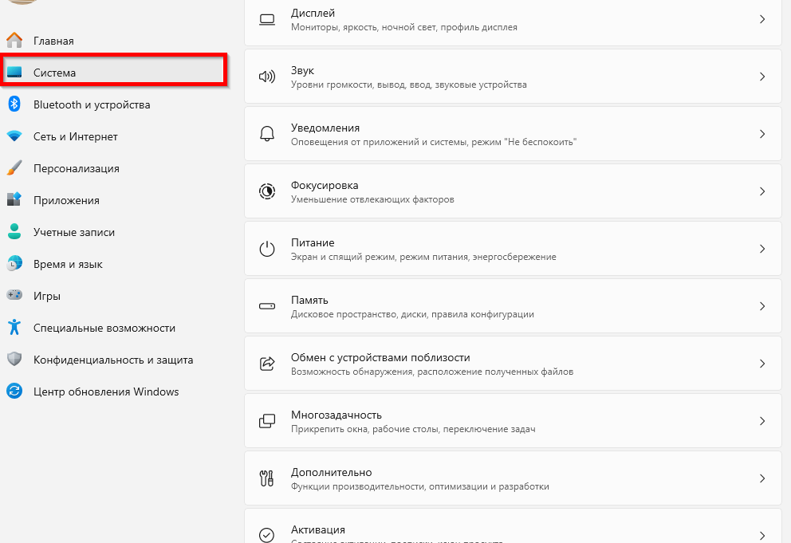

- **Дисплей**  
  - [x] Разрешение — нативное  
  - [x] Частота обновления — максимальная поддерживаемая  
  - [x] Масштаб — 100 % (если монитор ≥24" и ≥1080p)  
  - [x] Графика → "Оптимизация для игр в оконном режиме" → **Вкл**

- **Звук**  
  - [x] Устройство вывода/ввода — выбраны корректно  
  - [x] Отключить звук уведомлений (если мешает)

- **Уведомления**  
  - [ ] "Получать уведомления" → **Откл**, если не нужны  
  - [x] Отключить уведомления от конкретных приложений (Teams, News, etc.)

- **Питание**  
  - Режим: **Сбалансированный** (для ПК), **Высокая производительность** (для игровых ноутбуков на розетке)  
  - [x] План электропитания → "Изменить дополнительные параметры"  
    - Жёсткий диск → "Отключать через" → **Никогда**  
    - Сон → **Никогда**  
    - USB → "Разрешить отключение" → **Откл** (для периферии, чувствительной к питанию)

- **Память**  
  - [x] Контроль памяти → **Вкл**  
  - [x] "Очистить сейчас" → выполнить при первом запуске  
  - [x] Оптимизировать диск (Defrag и Optimize Drives) → запустить вручную для всех HDD/SSD

- **Удалённый рабочий стол**  
  - [ ] "Включить удалённый доступ" → **Откл**, если не нужен

- **Дополнительные компоненты Windows**  
  - [ ] Hyper-V → **Откл**, если не используется  
  - [ ] Подсистема Windows для Linux (WSL) → **Откл**, если не нужна  
  - [ ] **Точки восстановления** — оставить включёнными (помогают откатить сбой после обновления или драйвера). Отключать только осознанно при нехватке места на системном диске.
  - [x] Можно отключить при необходимости: Windows Sandbox, .NET Framework 3.5 (если не нужен старым софтом), Legacy Components (NFS, Telnet и т.д.)

---

### 3.2. Дополнительные параметры системы

Через `sysdm.cpl` или через интерфейс, выбрав одноимённый пункт:

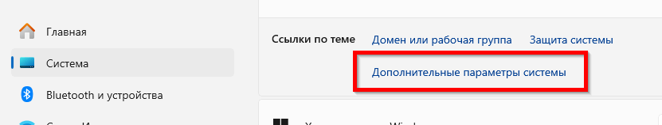

---

#### Вкладка **Дополнительно**

- **Быстродействие → Параметры**  
  - Визуальные эффекты:  
    - [x] "Обеспечить наилучшее быстродействие" — **только если ПК слабый**  
    - Или вручную выключить: анимацию меню, прозрачность, тени под указателем  
  - Виртуальная память:  
    - [x] "Автоматически выбирать объём" → **оставить вкл**, если SSD ≥256 ГБ  
    - При ручной настройке:  
      - Минимум = 1× объём ОЗУ (но не менее 4096 МБ)  
      - Максимум = 1.5–2× объём ОЗУ  
      - Хранить на SSD (не на HDD)  
  - [x] "Предотвращение выполнения данных" → **Вкл** (DEP — важная защита)
  

  
**⚠️ Важно**

  

  Для DDR4/DDR5-систем с ≥16 ГБ ОЗУ виртуальная память часто не требуется вообще (если не запускаются тяжёлые задачи: рендер, VM, компиляция). Ручное завышение может привести к износу SSD. Так что тут по ситуации - лично я ставлю на HDD.

  На системах с ≥16 ГБ ОЗУ и SSD можно оставить управление виртуальной памятью автоматическим. Windows сама отключит подкачку при избытке физической памяти. 

  
  

  

- **Загрузка и восстановление**  
  - [x] "Отображать список ОС" → **Откл**, если одна система  
  - [x] Тайм-аут → 0 секунд

- **Защита системы**  
  - [ ] Защита на диске C: → **Откл**, если вы:  
    - делаете ручные резервные копии,  
    - не используете восстановление,  
    - хотите сэкономить 5–10 ГБ диска.  
  - [x] В противном случае — **включить**, и сделать **ручную точку восстановления** после настройки.

- **Удалённый доступ**  
  - [ ] "Разрешить удалённые подключения" → **Откл**

---

### 3.3. Bluetooth и устройства  

Как можно понять, если у вас нет Bluetooth-адаптера, вам лучше выключить всё лишнее. Здесь также много разных настроек интеграции с мобильными устройствами - лично я не использую такое, поэтому выключаю.

Но, если отключите Bluetooth, то не будут работать беспроводные мыши, клавиатуры, наушники и геймпады - учтите.

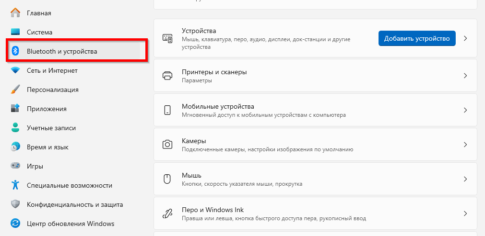

- [x] Отключить: "Мобильные устройства", "Автоудаление устройств", если не используете связку с телефоном  
- [x] Удалить неиспользуемые Bluetooth-устройства (наушники, контроллеры и т.д.)

---

### 3.4. Персонализация  

Главный раздел, который расходует ресурсы, визуально загромождает систему и позволяет настроить внешний вид под себя. Здесь нам самое важное - настроить Пуск и Панель задач. Они порой у многих остаются стандартными, и...это неудобно.

  
Windows 11

  Snap Layouts, виртуальные рабочие столы, God Mode и горячие клавиши — в [415.md](/encyclopedia/2-system-network/2-01-operatsionnaya-sistema/415).

Рекомендую пройтись вообще по всем настройкам, но отмечу лишь ключевые.

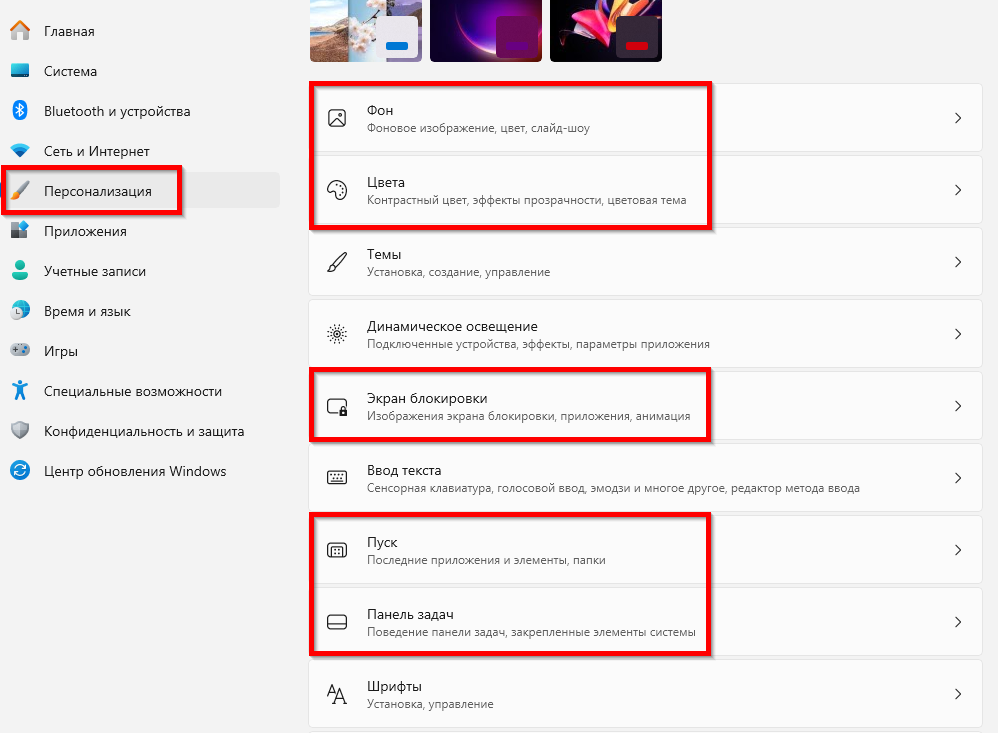

- **Фон**: статичное изображение (анимированный фон = нагрузка GPU)  
- **Цвета**: тёмный/светлый режим — по предпочтению  
- **Экран блокировки**:  
  - [x] Тип фона → **Изображение**  
  - [ ] "Забавные факты и подсказки" → **Откл**  
- **Пуск**:  
  - [x] "Больше закреплений"  
  - [ ] Все галочки про "рекомендации", "часто используемые", "мобильное устройство" → **Откл**  
- **Панель задач**:  
  - [x] Поиск → "Только значок"  
  - [ ] Представление задач, Мини-приложения, Меню пера, Сенсорная клавиатура → **Откл**  
  - [ ] Ненужные значки в трее → **Откл**

---

### 3.5. Приложения  

Этот раздел позволяет ознакомиться со списком установленных в системе приложений, удалить лишние и исправить неработающие.

Если вы о нём не знали - увидите много нового, и удивитесь тому, сколько предустановленных приложений у вас уже есть. Я лично удаляю большинство.

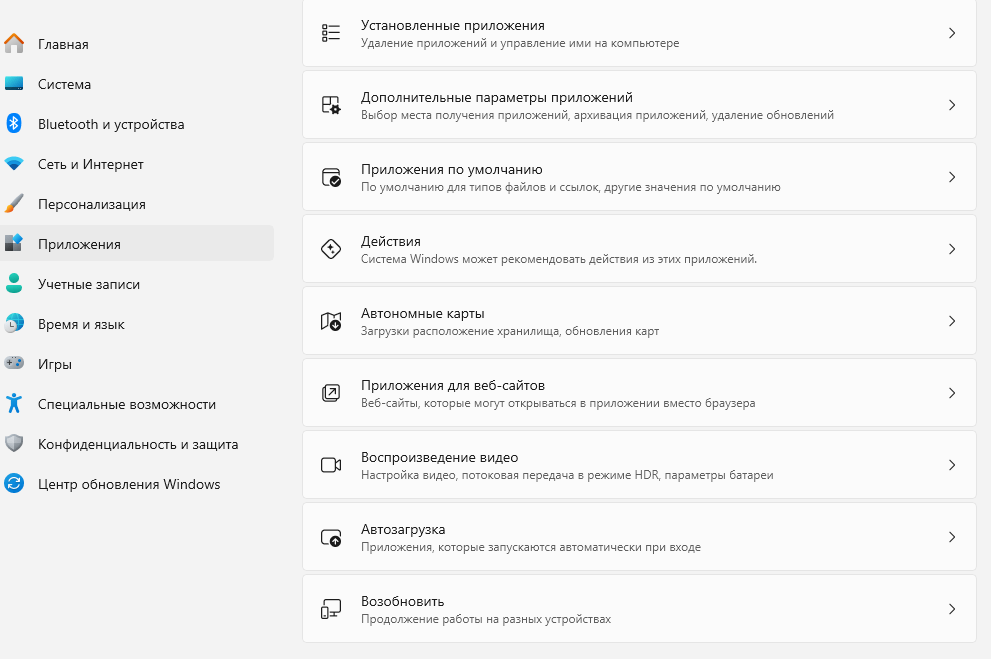

- **Автозагрузка** → **отключить всё**, кроме:
  - клавиатурных утилит (Logitech Options+, Razer Synapse — если нужен профиль),
  - софта для мониторинга (MSI Afterburner/RivaTuner — но можно запускать вручную),
  - голосовых ассистентов (Discord, Teams — при необходимости).

> Проверяйте также через **Диспетчер задач → Автозагрузка** — это надёжнее, чем параметры Windows.

- **Приложения по умолчанию** → назначить ассоциации (браузер, видеоплеер и т.д.)

---

### 3.6. Игры  

Этот раздел, конечно, как-то магически не бустанёт ваше устройство, но немного облегчит и оптимизирует нагрузку во время игры.

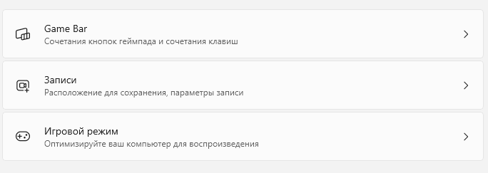

- [x] Игровой режим → **Вкл** (оптимизирует планировщик задач, приоритизирует игры)  
- [ ] Game Bar → **Откл**, если не используете запись/стрим  
- [ ] HDR → включать **только если монитор поддерживает**, иначе — потеря FPS и цветовое искажение

---

### 3.7. Специальные возможности  

- Пройдите по всем пунктам и отключите:  
  - Упрощённый режим, Фильтры цвета, Синтезатор речи (если не нужен), Увеличитель экрана — всё это фоновые службы.

---

### 3.8. Конфиденциальность и защита  

> ⚠️ **Защитник Windows и брандмауэр** для большинства пользователей лучше **оставить включёнными**. Отключать защиту имеет смысл только если вы осознанно поставили другой антивирус и понимаете риски.

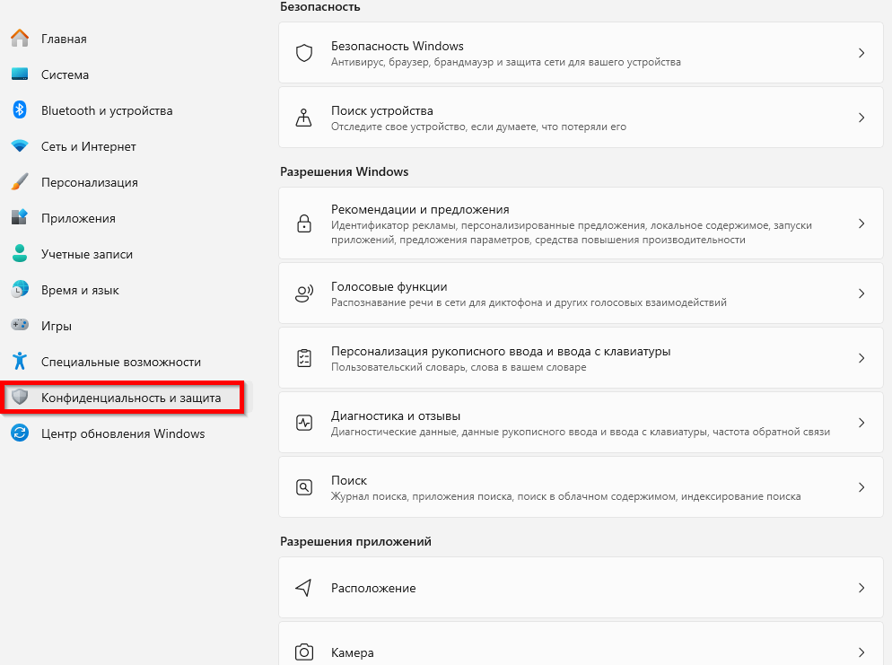

- [ ] Поиск устройства → **Откл**  
- [ ] Рекомендации и предложения → **все пункты Откл**  
- [ ] Голосовые функции → **Откл**  
- [ ] Диагностика и отзывы → **Откл**  
- [ ] Поиск Windows → можно отключить индексацию, если не используете (`services.msc` → "Windows Search" → тип запуска = "Вручную")  
- [x] Разрешения приложений → проверить:  
  - микрофон, 
  - камера, 
  - геолокация, 
  - буфер обмена 
  
**Запретить** всем, кроме доверенных программ.
  
---

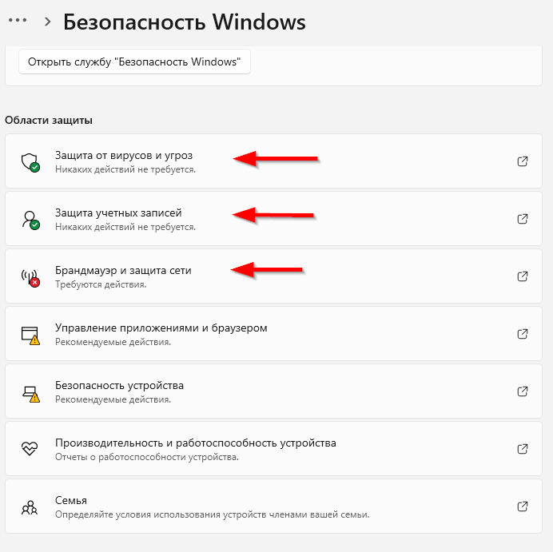

> 🔐 **Защитник Windows**:  
> - Если используете сторонний AV (Kaspersky, ESET и т.д.) — Защитник автоматически отключится.  
> - Если у вас **нет** стороннего AV — **оставьте Защитник включённым**. Он легковесен (особенно в режиме Passive), и отключать его полностью **не рекомендуется**.  
> - Исключения можно добавлять через `Безопасность Windows → Защита от вирусов → Управление настройками → Добавить исключение`.

---

### 3.9. Центр обновления Windows  

Раньше политика с обновлениями системы была **очень** проблемной - Microsoft принудительно обновляла систему, и даже порой закрывала игры и перезагружала компьютер. Сейчас, в Windows 11 такого нет - можно просто устанавливать по необходимости. Главное - контролируйте.

Обновления иногда вызывают сбои — поэтому разумно откладывать их на несколько дней, но полностью игнорировать безопасность не стоит: закрываются уязвимости и ломаются старые драйверы.

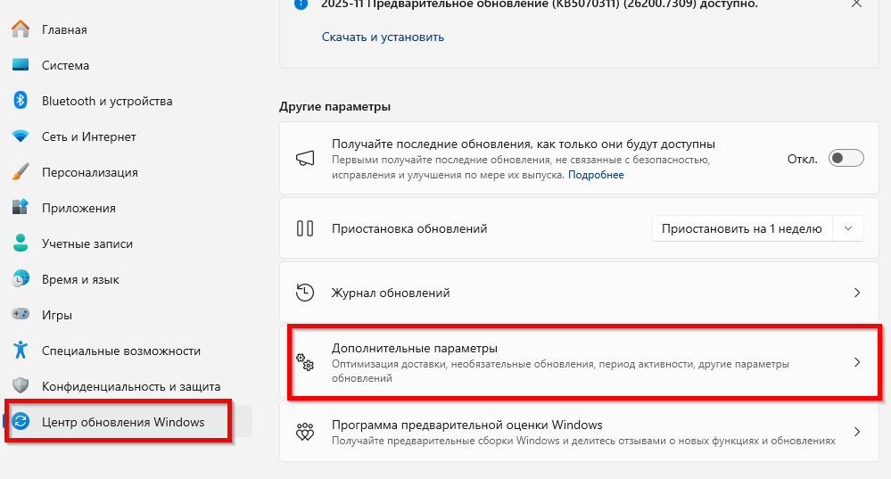

- [ ] "Получать последние обновления, как только они будут доступны" → **Откл**  
- [x] Дополнительные параметры →  
  - [ ] "Предоставлять обновления другим компьютерам" → **Откл**  
  - [x] "Автоматическое обновление драйверов" → **Откл** (чтобы не сломать ручную настройку видеодрайвера)  
  - [x] Можно включить "Отложенные обновления" на 7–14 дней, чтобы избежать "кривых" патчей.

Microsoft не даёт возможности вообще напрочь отключить обновления, но есть средства, которые позволяют **вырезать** обновления. Лично я этим не пользуюсь.

---

## 🖥️ 4. Панель управления (Control Panel)

Надеюсь, что этот раздел не вырежут в последующих версиях Windows. Он живёт с нами ещё с Windows XP и раньше был основным разделом с параметрами. Новые Параметры появились исключительно из-за планшетных и мобильных систем, ведь старой Панелью управления пользоваться с сенсорных экранов довольно неудобно.

Это очень широкий раздел, где можно настроить почти всё. Изучайте, настраивайте. Ниже - посмотрим самое важное.

Открыть через `Win+R` → `control`

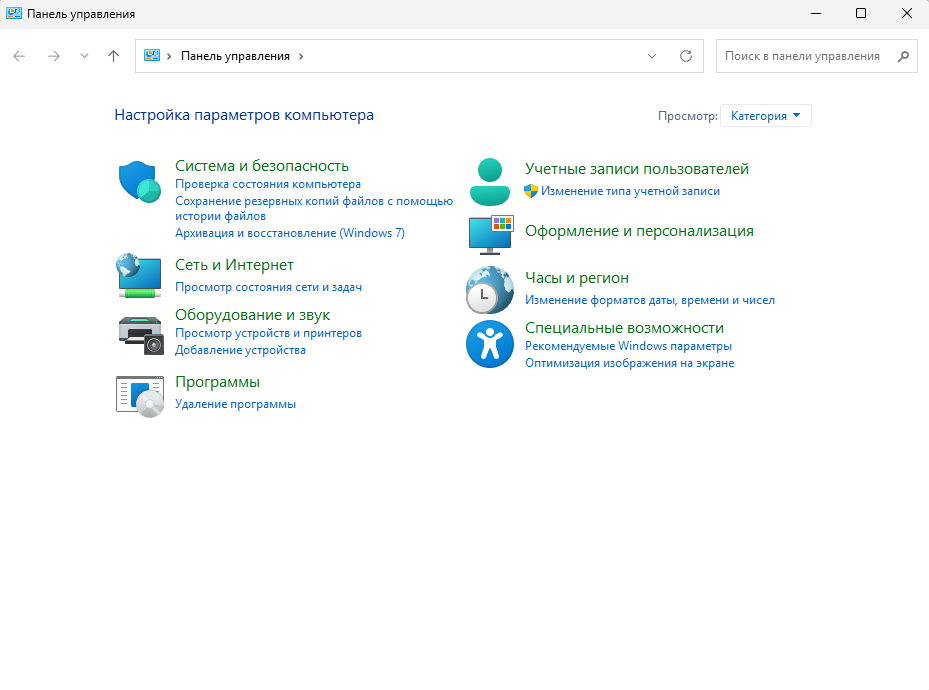

---

### 4.1. Система и безопасность  

Раздел Система и безопасность включает в себя почти всё то же самое, что и Система в Параметрах, разве что в некоторых случаях Параметры перенаправляют нас сюда.

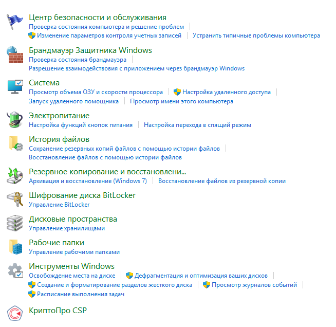

Здесь нас сначала интересует Центр безопасности и обслуживания.

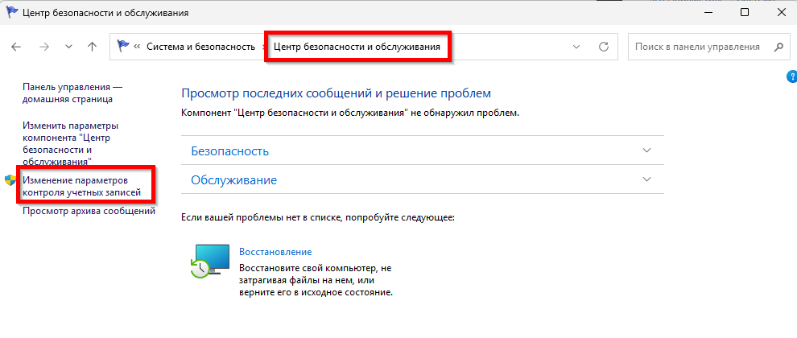

- **Контроль учётных записей (UAC)**:  
  - [x] Для повседневной работы — **уведомлять только при попытке приложений внести изменения** (рекомендуемый уровень).  
  - [ ] **"Никогда не уведомлять"** — не рекомендуется: вредоносный установщик получит права администратора без предупреждения.

- **Брандмауэр Защитника Windows**:  
  - [ ] Можно отключить, если используете сторонний фаервол (например, GlassWire, TinyWall) или уверены в защите сетевого уровня (роутер).  
  - В большинстве случаев — **оставить включённым**.
  
  Но учтите, что локальные атаки (SMB, RDP, LLMNR/NBT-NS poisoning) всё ещё актуальны даже в домашней сети. Отключение брандмауэра допустимо только при наличии полной изоляции компьютера от локальной сети и запрете входящих подключений на маршрутизаторе. В противном случае — оставьте включённым, даже если используете сторонний AV.

- **Электропитание** → повторно проверить детальные настройки (см. 3.1)

---

### 4.2. Оборудование и звук  

Здесь есть диспетчер устройств, настройки автозапуска, электропитания, звука. По умолчанию здесь всё в порядке, так что обращайтесь к разделу по надобности.

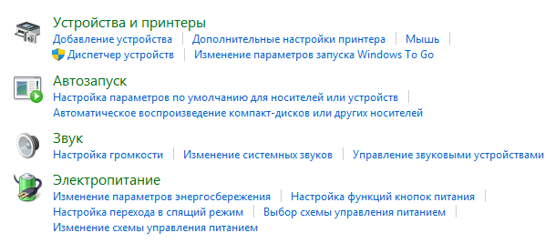

- Настроить мышь/клавиатуру (частота опроса, ускорение), принтеры и сканеры — по необходимости.

---

### 4.3. Программы и компоненты  

Это практически тот же раздел, что и в Параметрах, но с другим интерфейсом. Здесь можно удалить лишние программы, включить или отключить системные компоненты Windows, настроить программы по умолчанию.

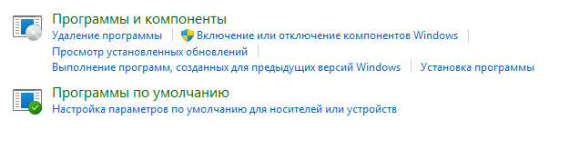

- Удалить всё ненужное:  
  - рекламные тулбары,  
  - "улучшители" (CCleaner, Advanced SystemCare и т.д.),  
  - остатки от старых программ (если удалены, но остались записи),  
  - дублирующие утилиты (несколько архиваторов, браузеров и т.д.).

---

### 4.4. Оформление и персонализация → Параметры Проводника

Здесь, как и в Параметрах, есть настройки панели задач, но есть и интересное - это Параметры проводника. В нём вы можете настроить и немного кастомизировать тот самый Проводник, который используется для менеджмента файлов и папок.

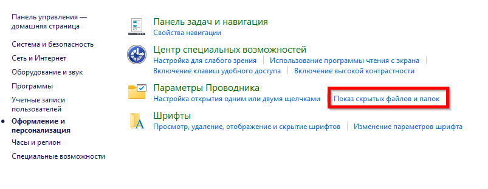
 
Рекомендации для продуктивности и производительности:

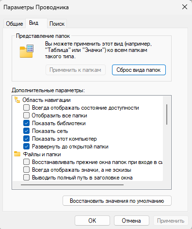

- **Вкладка "Вид"**  
  - [x] Показывать скрытые файлы, папки и диски  
  - [ ] Скрывать защищённые системные файлы → **Вкл** (не отключайте без причины!)  
  - [ ] Скрывать расширения для зарегистрированных типов файлов → **Откл**  
  - [x] Отображать буквы дисков  
  - [x] Использовать флажки для выбора элементов  
  - [ ] Всегда отображать значки, а не эскизы → **Откл** (эскизы = удобство; для HDD можно включить, но на SSD разница невелика)  
  - [x] Отображать сведения о размере файлов в подсказках → **включить только при необходимости** (замедляет вход в папки с тысячами файлов)

- **Вкладка "Общие"**  
  - [x] Открывать проводник для → **"Этот компьютер"**  
  - [ ] "Показать недавние файлы/папки" → **Откл**  
  - [ ] "Показывать файлы из Office.com" → **Откл**

---

## 🛠️ 5. Драйверы и runtime-библиотеки

Здесь уже придётся обратиться к стороннему софту. Начальный набор драйверов для минимальной работы системы Windows установит автоматически при первом запуске (Центр обновления Windows автоматически найдет, скачает и предложит установить их). Но в ряде случаев может потребоваться прибегнуть к стороннему софту.

---

### 5.1. Драйверы

- Видеокарта:  
  - NVIDIA → **Game Ready Driver** (не Studio!)  
  - AMD → **Adrenalin Edition**  
  - Intel Arc → **Arc Control**  
- Чипсет: скачать с сайта материнской платы или производителя (Intel/AMD Chipset Drivers)  
- Аудио (Realtek, Creative и др.), Ethernet/Wi-Fi, USB 3.x/4 — тоже с официальных сайтов.

> ❌ Не используйте "драйвер-паки" (Driver Booster, DriverPack и т.д.) — они часто устанавливают устаревшие или поддельные версии.

---

### 5.2. Обновите runtime-библиотеки

- [x] Visual C++ Redistributable (2015–2022) — **x86 и x64**  
  → скачать [отсюда (офиц. Microsoft)](https://aka.ms/vs/17/release/vc_redist.x64.exe)
- [x] .NET Desktop Runtime (6.0, 7.0, 8.0) — если нужны приложения на .NET  
- [x] DirectX End-User Runtime (даже на Win 10/11) — [скачать](https://www.microsoft.com/Рu/download/details.aspx?id=35)  
- [x] OpenAL, XAudio2 Redist (если нужны для старых игр)

По поводу DirectX - пакет как бы добавляет устаревшие библиотеки (D3DX9/10/11, XAudio 2.7), не входящие в современный DirectX. Современные игры используют DirectX 12 / DirectX 12 Ultimate / DXVK (на Linux). Для новых игр он не нужен. Так что условный Steam сразу устанавливает всё, что нужно, сразу с установкой игры. 

Устанавливайте пакет с DirectX, только если игра выдаёт ошибки вроде “d3dx9_43.dll отсутствует”

---

## ✅ Проверка итоговой конфигурации

После завершения настройки:

1. Перезагрузите ПК.
2. Откройте **Диспетчер задач**:
   - Вкладка "Производительность" — проверьте загрузку CPU/RAM/Диск в простое.
   - Вкладка "Автозагрузка" — должно быть ≤3–5 элементов (мышь, клавиатура, MSI Afterburner при необходимости).
   
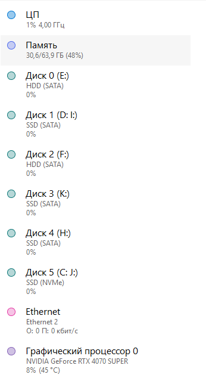

---
   
3. Запустите игру (любую) и проверьте:
   - стабильность FPS,
   - отсутствие фоновых уведомлений,
   - отсутствие "подвисаний" при переходе в меню.

> 🔁 Регулярно (раз в 3–6 месяцев) перепроверяйте автозагрузку, установленные приложения и параметры конфиденциальности.

---

**Всё! Этого достаточно!** 

Если вы всё равно мучаетесь - значит надо улучшать железо, расширять память/покупать новый процессор/видеокарту - что именно слабее, вы увидите в диспетчере задач.

{/* sidebar-collections */}

---

## В подборках

Статья входит в тематические маршруты из меню **Подборки** и блока "С чего начать?" на главной. Соседние шаги того же маршрута:

**Цифровая грамотность** — [Предупреждения при изучении — о разделе](/encyclopedia/1-basics/1-05-preduprezhdenie/intro), [Родительский контроль](/encyclopedia/1-basics/1-12-sovety-dlya-novichka/111), [Английский язык в IT — о разделе](/encyclopedia/1-basics/1-30-angliyskiy-yazyk/intro), [Поисковые системы](/encyclopedia/1-basics/1-21-poisk-informatsii/1), [Восприятие IT в обществе](/encyclopedia/1-basics/1-04-kak-vidyat-it-obychnye-lyudi/1), [Эффективный поиск в интернете](/encyclopedia/1-basics/1-21-poisk-informatsii/3).

**Офисная грамотность** — [Архитектура десктопных приложений](/encyclopedia/4-code-dev/4-11-desktopnye-prilozheniya/1), [Устройство и надёжность паролей](/encyclopedia/2-system-network/2-08-osnovy-informatsionnoy-bezopasnosti/114), [Цифровые формы и анкеты](/encyclopedia/1-basics/1-22-kommunikatsiya-i-obschenie/6), [Электронная почта](/encyclopedia/1-basics/1-22-kommunikatsiya-i-obschenie/3), [Текст — о разделе](/encyclopedia/1-basics/1-15-tekst/intro), [Документация](/encyclopedia/7-project/7-08-tehnicheskoe-pismo/1001).

{/* /sidebar-collections */}

---
