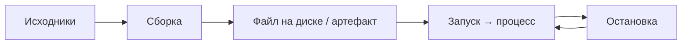

---
tags:
  - all
  - required
  - beginner
title: "Запуск и перезапуск приложений"
description: "Как запускать exe, проекты из IDE, утилиты в терминале, dev-сервер, службы и Docker — и чем отличаются сборка, старт, перезапуск и hot reload."
related:
  - title: "Исполняемые файлы"
    doc: encyclopedia/1-basics/1-20-ispolnyaemye-fayly-i-arhivy/1
  - title: "Что такое программа?"
    doc: encyclopedia/1-basics/1-19-programma/1
  - title: "Терминал — о разделе"
    doc: encyclopedia/2-system-network/2-05-terminal/intro
  - title: "Компиляторы и интерпретаторы"
    doc: encyclopedia/1-basics/1-19-programma/2
  - title: "Справочник по Docker"
    doc: encyclopedia/8-infra-security/8-06-konteynerizatsiya-i-orkestratsiya/2
  - title: "Dockerfile — 10 типовых образов"
    doc: lab/examples/11113
  - title: "Процесс, приложение и служба"
    doc: encyclopedia/1-basics/1-11-soft-ryadovogo-polzovatelya/1
---

import ExternalPlayEmbed from '@site/src/components/ExternalPlayEmbed';


# Запуск и перезапуск приложений

<div class="article-tags">
  <span class="tag tag-required">ОБЯЗАТЕЛЬНО</span>
  <span class="tag tag-beginner">ДЛЯ НОВИЧКОВ</span>
</div>

<span class="complexity-badge">Всем</span>

<div class="callout callout--info">
  <div class="callout-title">Зачем эта статья</div>

  <div class="callout-body">
  В инструкциях и видео встречаются слова "запусти", "пересобери", "перезапусти dev-сервер", "нажми Run" — без пояснения, *что именно* должно произойти.

  Здесь собраны типовые сценарии: от двойного клика по `.exe` до контейнера Docker.

  Теория процессов и файлов на диске — в [Что такое программа?](/encyclopedia/1-basics/1-19-programma/1) и [Исполняемые файлы](/encyclopedia/1-basics/1-20-ispolnyaemye-fayly-i-arhivy/1).
</div>
  </div>


---

Перед первым запуском IDE, Node или Python их обычно **устанавливают** через такой мастер (потом — Run, `npm run dev` или двойной клик по `.exe`):

<ExternalPlayEmbed example="basics/installer-wizard-play" title="Мастер установки" minHeight={480} playProps={{ appName: 'Установка среды разработки', productName: 'Учебное приложение', welcomeText: 'Сначала установщик копирует файлы и настраивает систему — только потом вы запускаете проект из IDE или терминала.', cardSubtitle: 'Установка ≠ запуск: после "Готово" см. сценарии ниже в статье' }} />

---

## Словарь — не путать действия

| Термин | Суть | Когда слышите |
|--------|------|----------------|
| **Сборка** (*build*) | Превращение исходников в артефакт (`.exe`, `.jar`, папка `dist/`) | "Собери проект", `npm run build`, Build в IDE |
| **Запуск** (*run*, *start*) | ОС или среда создаёт **процесс** из готового файла или команды | Двойной клик, `Run`, `node app.js` |
| **Старт** | То же, что запуск; часто про **службу** или **сервер**, который "поднялся" и слушает порт | "Сервер стартовал на :3000" |
| **Остановка** (*stop*) | Процесс завершается, порт освобождается | Закрыть окно терминала, `docker stop`, Stop в IDE |
| **Перезапуск** (*restart*) | Stop, затем снова run (иногда с новой сборкой) | После смены конфига, "перезапусти nginx" |
| **Hot reload** | Часть кода подхватывается **без полного** перезапуска процесса | Vite, `dotnet watch`, dev-сервер фронта |
| **Отладка** (*debug*) | Запуск **с** остановками на строках, просмотром переменных | F5 в Visual Studio, Debug в IDE |

**Сборка** может идти **без** запуска (получили файл на диске). **Запуск** может идти **без** сборки (готовый `.exe` или интерпретатор читает `.py`). В IDE кнопка **Run** часто делает **оба шага подряд** — отсюда путаница.



---

## 1. Готовая программа — файл `.exe` (и аналоги)

**Сценарий.** Программа уже собрана; на диске лежит [исполняемый файл](/encyclopedia/1-basics/1-20-ispolnyaemye-fayly-i-arhivy/1).

| Шаг | Действие |
|-----|----------|
| 1 | Найти файл (Проводник, ярлык на рабочем столе) |
| 2 | Двойной щелчок или Enter |
| 3 | ОС создаёт процесс; появляется окно или иконка в трее |

**Остановка** — закрыть окно, "Выход" в меню или завершить процесс в [Диспетчере задач](/encyclopedia/1-basics/1-11-soft-ryadovogo-polzovatelya/1) (`Ctrl + Shift + Esc`).

**Перезапуск** — закрыть программу и запустить снова. Пересборка не нужна, пока вы не скачали новую версию установщика.

<div class="callout callout--warning">
  <div class="callout-title">Безопасность</div>

  <div class="callout-body">
  Неизвестные <code>.exe</code> с торрентов и "кряков" — риск. Источники и проверка — в <a href="/encyclopedia/1-basics/1-12-sovety-dlya-novichka/1">советах для начинающего пользователя ПК</a>.
</div>
  </div>


---

## 2. Проект из IDE — Run и Debug

**Сценарий.** Вы учитесь программировать; код в папке проекта, среда — Visual Studio, VS Code, IntelliJ IDEA, PyCharm и т.п.

| Шаг | Действие |
|-----|----------|
| 1 | Открыть **решение** или **папку проекта** (тот каталог, где `package.json`, `.sln`, `pom.xml`) |
| 2 | Выбрать **стартовый проект** (если их несколько) |
| 3 | **Run** (Выполнить) — зелёный треугольник или `Ctrl + F5` / Shift+F10 (зависит от IDE) |

IDE обычно:

- вызывает **сборку** (компилятор, `npm`, `gradle`, `mvn`);
- при ошибках сборки **процесс не стартует** — смотрите панель "Ошибки" / "Problems";
- при успехе **запускает** программу (консольное окно, окно приложения, встроенный браузер).

**Debug** — тот же путь, но с точками остановки (breakpoint); процесс идёт по шагам.

**Перезапуск после правки кода**

- с **hot reload** — сохранили файл, среда сама обновила часть (типично веб-фронт);
- без hot reload — снова **Stop**, затем **Run** (или "Перезапустить" в панели отладки).

Подробнее про компиляцию и интерпретацию — [Компиляторы и интерпретаторы](/encyclopedia/1-basics/1-19-programma/2).

---

## 3. Утилита из терминала — `имя -аргументы`

**Сценарий.** Одноразовая или регулярная команда — `git status`, `python --version`, `7z x archive.zip`.

| Шаг | Действие |
|-----|----------|
| 1 | Открыть терминал в нужной папке (ПКМ по папке → "Открыть в терминале", или `cd` в уже открытом окне) |
| 2 | Убедиться, что утилита в [PATH](/encyclopedia/1-basics/1-19-programma/113#пример-запуск-python) |
| 3 | Ввести команду и Enter |

**Примеры**

```powershell
cd C:\Projects\my-app
git status
```

```powershell
python --version
python main.py --help
```

```bash
cd ~/projects/my-app
ls -la
./script.sh --dry-run
```

Оболочка разбирает строку и **запускает отдельный процесс** утилиты; когда команда закончилась, в приглашении снова можно вводить следующую.

**Остановка** длинной команды — `Ctrl + C` в том же окне терминала.

База по терминалу — [Что такое терминал](/encyclopedia/2-system-network/2-05-terminal/1); знаки `|`, `&&` — [Знаки в командной строке](/encyclopedia/2-system-network/2-05-terminal/11).

---

## 4. Локальный dev-сервер — окно терминала не закрывать

**Сценарий.** Учебный веб-проект, API на Node/Python, фронт на Vite — в инструкции пишут `npm run dev`, `uvicorn`, `dotnet run`.

| Шаг | Действие |
|-----|----------|
| 1 | Открыть терминал в **корне проекта** (где лежит `package.json` или README с командой) |
| 2 | Выполнить команду из документации, например `npm run dev` или `npm start` |
| 3 | Дождаться сообщения вроде `ready`, `listening on http://localhost:5173` |
| 4 | **Не закрывать** это окно — свернуть или отодвинуть; сервер живёт, пока работает процесс |
| 5 | Открыть **браузер**, вставить URL из вывода терминала (или из README) |
| 6 | Работать в браузере — это **веб-интерфейс** приложения; терминал — "двигатель" сзади |

**Остановка** — в том же терминале `Ctrl + C`, дождаться возврата приглашения (`PS C:\...>` или `$`).

**Перезапуск** — снова выполнить ту же команду (`npm run dev`). Если меняли зависимости (`package.json`) — иногда сначала `npm install`.

**Типичная ошибка** — закрыть крестиком окно терминала: сервер исчезает, в браузере "не удаётся подключиться".

**Порт занят** (`EADDRINUSE`, второй `npm run dev`) — готовые команды — [CLI — порты, процессы, dev-сервер](/lab/Примеры/1156).

Первая программа на Node с `npm run` — [Первая программа на Node.js](/encyclopedia/5-languages/5-01-javascript/262); фронт и бэкенд в целом — [Frontend и backend](/encyclopedia/1-basics/1-23-frontend-i-bekend/intro).

---

## 5. Служба Windows или демон Linux

**Сценарий.** Программа работает **в фоне** без окна — печать, PostgreSQL, nginx, агент мониторинга.

| Платформа | Запуск / статус | Остановка / перезапуск |
|-----------|-----------------|-------------------------|
| **Windows** | `services.msc`, PowerShell `Start-Service` | `Stop-Service`, `Restart-Service` |
| **Linux** | `systemctl start имя` | `systemctl stop`, `systemctl restart` |

Служба стартует при загрузке ОС или по команде администратора; пользовательский "двойной клик" тут обычно не используется.

Классификация — [утилиты, модули, службы](/encyclopedia/1-basics/1-19-programma/112); сравнение приложения и службы — [Софт рядового пользователя](/encyclopedia/1-basics/1-11-soft-ryadovogo-polzovatelya/1) (таблица "Процесс, приложение и служба").

---

## 6. Docker-контейнер

**Сценарий.** Учебник предлагает поднять БД или веб в контейнере.

| Шаг | Действие |
|-----|----------|
| 1 | **Windows/macOS** — запустить **Docker Desktop** и дождаться статуса "running" (работает демон `dockerd`) |
| 2 | В терминале — `docker run ...` или `docker compose up` из папки с `docker-compose.yml` |
| 3 | Проверить вывод (`Listening`, `Started`) и порты (`-p 8080:80`) |
| 4 | Открыть браузер на `http://localhost:8080` (порт из команды) |

**Остановка**

- один контейнер — `docker stop <имя_или_id>`;
- compose-проект — `docker compose down` в той же папке.

**Перезапуск**

- `docker start` для существующего контейнера;
- или снова `docker run` / `docker compose up` (часто с пересборкой `docker compose up --build`).

Справочник команд — [Docker](/encyclopedia/8-infra-security/8-06-konteynerizatsiya-i-orkestratsiya/2); готовые Dockerfile (Node, Python, Go…) — [Dockerfile — 10 типовых образов](/lab/Примеры/11113); готовые `compose.yaml` (nginx, Postgres, WordPress, Prometheus) — [Docker Compose — готовые стеки](/lab/Примеры/11111); PromQL после стека мониторинга — [Prometheus + Grafana — запросы](/lab/Примеры/11114); опасные флаги — [Опасные скрипты](/encyclopedia/8-infra-security/8-03-zabota-o-kode-i-dannyh/101).

---

## Сводная таблица — что нажимать и что не трогать

| Что запускаете | Где действуете | Окно терминала | Браузер | Как остановить |
|----------------|----------------|----------------|---------|----------------|
| `.exe` с рабочего стола | Проводник | — | по необходимости | Закрыть окно программы |
| Учебный проект в IDE | IDE | встроенная консоль | иногда встроенный | Stop / красный квадрат |
| `git`, `python script.py` | Терминал | закрывается само после команды | — | дождаться конца или `Ctrl + C` |
| `npm run dev` | Терминал | **держать открытым** | **основная работа** | `Ctrl + C` в терминале |
| Служба PostgreSQL | services / systemctl | — | клиент БД отдельно | stop/restart службы |
| `docker compose up` | Терминал | держать (или `-d` в фоне) | по проброшенному порту | `compose down` / `docker stop` |

---

## Частые путаницы

**"Запустил, но ничего не вижу".** Консольная утилита отработала и завершилась — это нормально. GUI-программа могла уйти в трей. Dev-сервер ждёт браузер по `localhost`.

**"Пересобрал, а старая версия".** Запустили старый `.exe` из другой папки или не остановили прежний процесс на том же порту.

**"Порт занят".** Предыдущий dev-сервер или контейнер ещё слушает порт — остановите старый процесс или смените порт в конфиге.

**Run в IDE vs `npm run dev` в терминале.** IDE может запускать **другой** профиль (тестовая сборка, другой порт). Сверяйте команду в свойствах запуска и README проекта.

**Hot reload vs перезапуск.** Hot reload подтягивает часть изменений сам; смена зависимостей, переменных среды или `docker-compose.yml` почти всегда требует полного перезапуска.

---

## Куда идти глубже

| Тема | Статья |
|------|--------|
| Процесс, поток, загрузка ОС | [Что такое программа?](/encyclopedia/1-basics/1-19-programma/1) |
| Параметры и конфиг при старте | [Поведение программ](/encyclopedia/1-basics/1-19-programma/113) |
| Сборка в CI и прод | [DevOps и CI/CD](/encyclopedia/8-infra-security/8-04-devops-ci-cd/intro) |
| Отладка и профилирование | [Разработка и отладка](/encyclopedia/4-code-dev/4-14-razrabotka-i-otladka/intro) |
| Выполнение кода на процессоре | [Выполнение кода](/encyclopedia/4-code-dev/4-03-vypolnenie-koda/intro) |

---

## Краткий чек-лист перед жалобой "не работает"

1. Та ли **папка** и та ли **команда**, что в README?
2. **Сборка** прошла без ошибок (в IDE или в логе терминала)?
3. Для сервера — окно терминала **ещё открыто** и в логе есть `listening` / `ready`?
4. В браузере верный **адрес и порт** (`localhost:5173`, не забытый `https`)?
5. Для Docker — **Docker Desktop** запущен?
6. Старый процесс на том же порту **остановлен**?

Если все пункты "да", а поведение странное — смотрите лог в терминале или Event Viewer; дальше по роли помогут разделы [Терминал](/encyclopedia/2-system-network/2-05-terminal/intro) и [Техническая поддержка](/encyclopedia/2-system-network/2-07-tehnicheskaya-podderzhka/intro).
