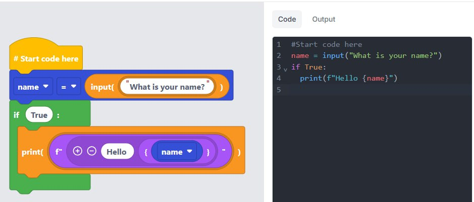
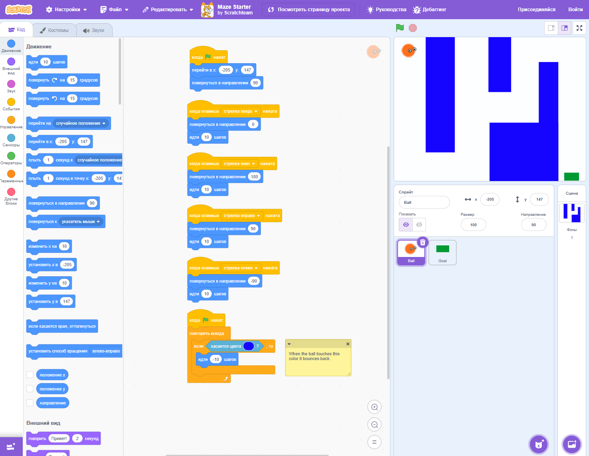
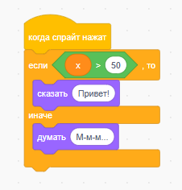
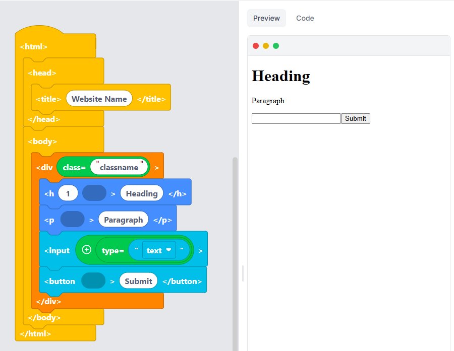

---
tags:
  - all
  - required
  - beginner
title: Визуальное программирование блоками
description: Визуально-блочная событийно-ориентированная среда программирования.
---

import BlockBuilder from '@site/src/components/BlockBuilder';

# Визуальное программирование блоками

<div class="article-tags">
  <span class="tag tag-required">ОБЯЗАТЕЛЬНО</span>
  <span class="tag tag-beginner">ДЛЯ НОВИЧКОВ</span>
</div>

<span class="complexity-badge">Начальный уровень</span>

## Визуальное программирование блоками



### Визуально-блочная событийно-ориентированная среда программирования

Начинающим полезно закладывать логику пошаговых инструкций до перехода к текстовому коду:

```
НАЧАТЬ
ПРОВЕРИТЬ
ЕСЛИ УСЛОВИЕ ВЫПОЛНЕНО:
	СДЕЛАТЬ
ЗАКОНЧИТЬ
```

Кто-то начинает с Edublocks, а кто-то со Scratch. Это визуальное программирование, которое формирует правильное мышление у ребёнка.

<div class="callout callout--tip">
  <div class="callout-title">Мини-конструктор</div>
  Сложите блоки ниже — увидите, как в Scratch складываются условия и циклы без синтаксических ошибок.
</div>

<BlockBuilder />

Для интереса - обязательно попробуйте.

Например, вот здесь можно посмотреть простой лабиринт, с управлением и коллизиями - это и выстраивание инструкций для работы программы, и проектирование, и даже, можно сказать, заготовка фундамента для разработки игр.

https://scratch.mit.edu/projects/10128431/



**Визуально-блочная событийно-ориентированная среда программирования** — это программная система, в которой создание программного поведения осуществляется через манипуляцию с графическими элементами (блоками), соединяемыми по принципу «пазла». 

Каждый блок инкапсулирует конкретную синтаксическую конструкцию или семантическую единицу — например, условную инструкцию `if`, цикл `repeat`, вызов функции, присваивание переменной, отправку сообщения или реакцию на событие (например, клик мыши или нажатие клавиши).



Такие среды, как правило, реализуют **событийно-ориентированную** модель выполнения: программа  состоит из набора *объявлений реакций на события* — триггеров, которые запускают последовательности блоков при наступлении определённых условий. Это позволяет смоделировать поведение интерактивных систем (игр, анимаций, симуляторов), не вводя учащегося в сложности управления потоком выполнения вручную.

Синтаксис блоков конструируется таким образом, чтобы исключить ошибки, невозможные в текстовом коде: 
- нельзя вставить блок сложения в место, где ожидается логическое условие;
- нельзя оставить «висящим» блок без родительского контекста;
- нельзя нарушить синтаксическую структуру, поскольку сама форма (выступы, пазы, цвета, надписи) навязывает корректную комбинацию. 

Форма блоков подсказывает правильную структуру программы — новичку не нужно сразу помнить расстановку скобок и отступов, как в текстовом коде.

Такие среды **моделируют** текстовое программирование. Они абстрагируют синтаксические ограничения, но не семантику: логическая ошибка (например, бесконечный цикл, неправильное условие ветвления) остаётся возможной и даже вероятной. Именно через эти ошибки формируется понимание последовательности, условности и причинно-следственной связи — основ вычислительного мышления.

---

### Почему именно блоки — и почему именно для детей?

Причина применения визуально-блочных интерфейсов в обучении детей лежит в **когнитивной адекватности**. 

Исследования в педагогической психологии (в частности, теория Пиаже о стадиях когнитивного развития) указывают, что дети младшего и среднего школьного возраста (6–12 лет) находятся на стадии конкретных операций, когда абстрактное, символическое мышление ещё не полностью сформировано. Для них оперирование с буквенно-цифровыми последовательностями без визуальной поддержки требует значительных когнитивных усилий, отвлекающих от сути — от логики построения алгоритма.

Представьте, у них ещё не сформировались накопленные обиды, принципы, скептис и прочие проблемы взрослых людей. Но при этом, текст воспринимается крайне отталкивающе, и в условный C++ синтаксис пока рановато.



Например, можно практически формировать структуру реального кода на языке HTML в Edublocks.

Графические блоки снижают **когнитивную нагрузку внешнего типа** (по терминологии Свеллера): вместо того чтобы помнить, как правильно расставить скобки, двоеточия, отступы и точки с запятой, ученик концентрируется на *структуре рассуждения*. 

Форма блока заменяет синтаксис; цвет — семантическую категорию (например, синий — движение, зелёный — управление, фиолетовый — операции с данными); пространственная компоновка — иерархию вложенности. Это обеспечивает *семиотическую трансляцию*: перевод абстрактных понятий (цикл, переменная, событие) в зрительно-тактильные метафоры, доступные восприятию.

При этом важно избегать заблуждения, что визуальные блоки — это полноценная *формальная система*, обладающая выразительной мощностью, сопоставимой с упрощёнными императивными языками. Например, Scratch позволяет реализовать рекурсивные алгоритмы, конечные автоматы, простые физические симуляции — при условии, что автор программы способен удержать в уме соответствующую модель. Таким образом, блоки служат *когнитивным промежуточным слоем* между интуитивным пониманием последовательности действий и формальным описанием алгоритма.

Ребёнок в итоге проектирует сам, планирует, анализирует и мыслит логически.

Выстраивается полноценная цепочка:
```
СНАЧАЛА ЭТО
ПОТОМ ЭТО
ЗАТЕМ ЭТО
```

---

### Исторический контекст

Предыстория визуальных сред уходит корнями в 1960-е годы, к разработке языка **Logo** Сеймуром Пейпертом и его коллегами в рамках проекта «Искусственный интеллект» в MIT. 

Logo был текстовым языком, но его ключевой педагогической метафорой стала *черепашка* — виртуальный или физический агент, управляемый командами вроде `вперёд 100`, `направо 90`. Важнейшим прорывом стало то, что язык проектировался как *средство познания*: через экспериментальное взаимодействие с черепашкой ребёнок формировал интуитивные представления об углах, координатах, рекурсии, процедурной абстракции.

```
REPEAT 4 [FORWARD 100 RIGHT 90]
```

Здесь, к примеру, программа выполняет простые действия, рисуя квадрат со стороной 100 шагов. Язык практически английский, поэтому чувствуется крайне легко:

```
MAKE "side 1
REPEAT 50 [
    FORWARD :side
    RIGHT 90
    MAKE "side :side + 2
]
```

В 1990-е годы появляются первые попытки визуализации кода: **Stagecast Creator** (основанный на идее «программирования по примеру»), **AgentSheets** (для моделирования многоагентных систем), **LEGO Mindstorms** (с графическим интерфейсом на основе иконок). Однако все они оставались узкоспециализированными или коммерчески недоступными.

Прорыв произошёл в 2003 году с запуском проекта **Scratch** в Lifelong Kindergarten Group (MIT Media Lab) под руководством Митчела Резника. 

Scratch объединил достижения Logo (черепашка → спрайты), объектно-ориентированной парадигмы (спрайты как автономные сущности с поведением), и события (реакции на клики, клавиши, сообщения). Ключевыми инновациями стали:

- **Каталогизация и совместное использование проектов** — встроенная онлайн-платформа, где любой пользователь может опубликовать, скопировать и модифицировать чужой проект (принцип *remix*), что создаёт экосистему социального обучения;
- **Мультимедийная интеграция «из коробки»** — встроенные редакторы спрайтов и звуков, библиотеки изображений и аудио;
- **Событийная модель, ориентированная на интерактивность**, что соответствует интересам детей (игры, анимации, истории);
- **Открытая лицензия и бесплатность**, обеспечивающая глобальное внедрение.

Scratch быстро стал *де-факто стандартом* в начальном обучении программированию. К 2025 году его использовали более 90 миллионов человек в 150 странах, а версия Scratch 3.0 (2019) полностью переписана на HTML5/JavaScript, что обеспечило кроссплатформенность и поддержку веб-устройств.

Однако Scratch оставался замкнутой экосистемой, ведь блоки не транслировались в настоящий код. Это ограничивало его применимость на следующем этапе обучения — когда ученик готов выйти за пределы визуальной метафоры и перейти к текстовым языкам.

---

### Как детей учат программировать и мыслить

Обучение программированию в детском возрасте не ставит целью подготовку профессиональных разработчиков. Да и зачем? Ребенку не нужно погружаться и раньше времени выгорать из-за отладки низкоуровневых проблем, ему ведь не платят. Его задача — развитие **вычислительного мышления** (*computational thinking*), термин, введённый Сеймуром Пейпертом и развитый Джинетт Уинг в 2006 году. Под этим понимается способность:

- **декомпозировать** сложную задачу на простые составляющие;
- распознавать **паттерны** и обобщать решения;
- формулировать **абстракции** — выделять сущностные характеристики и скрывать детали реализации;
- конструировать **алгоритмы** — последовательности точно определённых шагов, приводящих к решению.

```
СЛОЖНАЯ ЗАДАЧА:
	СУЩНОСТИ:
		СУЩНОСТЬ 1;
		СУЩНОСТЬ 2;
	
	ЗАДАЧА:
		ЭТАП 1:
			ДЕЙСТВИЕ 1;
			ДЕЙСТВИЕ 2;
		ЭТАП 2:
			ДЕЙСТВИЕ 3;
			ДЕЙСТВИЕ 4;
```

Программирование лучше всего начинать изучать с алгоритмов, поэтому работа идёт через привычные и понятные слова.

Визуально-блочные среды идеально подходят для формирования первых трёх компонентов:
- Декомпозиция естественным образом выражается в разбиении поведения спрайта на отдельные обработчики событий (`при щелчке`, `при получении сообщения`);
- паттерны проявляются в повторном использовании одинаковых структур (например, циклической анимации или логики столкновения);
- абстракция достигается через пользовательские блоки — процедуры без параметров (в Scratch 2/3) или с параметрами (в более продвинутых средах, например, Snap!).

Однако четвёртый компонент — алгоритмизация — сталкивается с фундаментальным ограничением: *отсутствие обратной связи по семантическим ошибкам*. 

В текстовом языке **отладка** — неотъемлемая часть процесса: вывод стека вызовов, контроль значений переменных, пошаговое выполнение. В блочных средах, особенно на начальном уровне, такая диагностика зачастую сведена к наблюдению за поведением спрайта: «почему он не движется?» — и далее — методом проб и ошибок. 

Это формирует *эмпирический стиль мышления*, полезный на ранних этапах, но опасный при переходе к сложным системам, где поведение не наблюдаемо напрямую (например, обработка данных, сетевое взаимодействие).

Поэтому современные педагогические методики настаивают на **постепенном снятии визуальных подпорок**:

1. **Этап 1. Визуальное конструирование** — ребёнок создаёт проект в Scratch, фокусируясь на логике поведения.
2. **Этап 2. Дуальный режим** — одновременный просмотр блочной структуры и генерируемого/соответствующего текстового кода (как в EduBlocks).
3. **Этап 3. Частичная ручная коррекция** — ученик вносит изменения в текстовый код (например, меняет число в цикле или имя переменной), наблюдая, как это влияет на поведение.
4. **Этап 4. Переход к IDE** — работа с фрагментами реального кода в упрощённой среде (Thonny, Mu Editor), затем — в полноценной IDE с подсветкой и отладчиком.

Каждый переход должен быть *семантически мотивирован*: «вот ситуация, которую блоками выразить невозможно — давайте посмотрим, как это делается в Python» (например, списки переменной длины, работа с файлами, обработка исключений).

---

### Визуальное программирование блоками

**Scratch** (разработка MIT, 2007–н.в.) — это *замкнутая визуальная экосистема*. 

Его сила — в целостности: единый редактор спрайтов, звуков, сцен; встроенная социальная платформа (`scratch.mit.edu`); продуманная педагогика через ремиксы и проекты сообщества. 

Однако его слабость — в изоляции. Блоки Scratch не имеют однозначного текстового эквивалента: они реализованы на JavaScript (в Scratch 3.0), но их внутренняя структура не транслируется в синтаксис какого-либо стандартного языка. 

Попытки экспорта (например, в JavaScript через сторонние инструменты вроде `scratchblocks` или `sulfurous`) носят скорее демонстрационный, чем учебный характер.

**EduBlocks**, напротив, позиционирует себя как *мост*. Разработанный при поддержке Anaconda (2017, первоначально как проект Джоша Гиллингема в 14 лет), EduBlocks использует визуальный интерфейс для *построчного конструирования кода на реальных языках* — Python, HTML, CircuitPython, JavaScript (в более новых версиях). 

Каждый блок — это буквально одна строка текста; перетаскивание блока в рабочую область немедленно отражается в правой панели как валидный синтаксис. 

Нажатие «Запустить» выполняет именно этот код — через встроенный интерпретатор (веб-WASM для Python, или связь с micro:bit/Raspberry Pi в офлайн-версии).

Это принципиальное различие:

| Критерий | Scratch | EduBlocks |
|---------|---------|-----------|
| **Цель** | Создание интерактивных проектов (игры, анимации) | Обучение синтаксису и семантике текстовых языков |
| **Модель выполнения** | Событийно-ориентированная, с внутренним движком | Последовательное выполнение скрипта (как в REPL) |
| **Обратная связь** | Визуальное поведение спрайтов | Текстовый вывод (`print`), ошибки интерпретатора, состояние переменных |
| **Переход к коду** | Не предусмотрен (требует внешнего объяснения соответствия) | Прямой, немедленный, однозначный |
| **Целевая аудитория** | 8–14 лет, без предварительного опыта | 10–16 лет, с намерением перейти к текстовому программированию |

Особенно ценным в EduBlocks является поддержка **физических вычислений**: код, написанный блоками, может быть загружен в micro:bit и сразу проявить себя в светодиодах, датчиках, моторах. Это ликвидирует разрыв между «виртуальной» логикой и «реальным» миром — важнейший шаг в формировании инженерного мышления.

---

### Как сейчас учат программировать детей?

Сегодня обучение программированию уходит от бинарного выбора «блоки или код» к **многоуровневой траектории**. EduBlocks, Code.org (App Lab, Game Lab), Microsoft MakeCode, Blockly (Google), Trinket — все они реализуют ту или иную форму «блочного фасада» над текстовыми языками. Это отражает признание того факта, что *препятствие для новичков — синтаксис*.

Однако важно не романтизировать блочные интерфейсы. 

Их чрезмерное применение чревато формированием **синтаксической зависимости**: ученик не может написать `for i in range(5):` вручную, потому что привык к блоку «повторить 5 раз», но не помнит, как это выглядит в коде. 

Более того, некоторые конструкции принципиально трудно выразить блоками без потери выразительности: генераторы, контекстные менеджеры, лямбда-выражения, метапрограммирование — всё это остаётся за пределами визуальных метафор.

Поэтому современные подходы настаивают на *временности* блочного этапа. Как отмечает исследовательница Кейтлин Керр:  
> «Блоки — это скаффолдинг: временная структура поддержки, которую необходимо демонтировать, как только основание заложено».

Именно поэтому такие проекты, как EduBlocks, включают в свои учебные программы **явные переходные упражнения**:
- после трёх проектов на блоках — задание «перепишите этот блок вручную в текстовом редакторе»;
- затем — «исправьте ошибку в готовом коде, используя только текстовый интерфейс»;
- далее — «дополните скрипт функцией, которую нельзя собрать из блоков (например, рекурсией с возвратом значения)».

Это обеспечивает *плавный когнитивный сдвиг* от тактильного к символическому, от императивного к декларативному, от конкретного к абстрактному.

---

### Критика «игрофикации»

Современные блочные среды, несмотря на продуманную педагогику, сталкиваются с риском **поверхностной вовлечённости**. 

Термин *игрофикация* (gamification, геймификация), изначально подразумевавший использование игровых механик (очков, уровней, бейджей) для усиления мотивации, в практике часто сводится к замене содержательной деятельности на сбор виртуальных наград. 

В ряде образовательных платформ (например, упрощённых онлайн-тренажёрах) ребёнок может «пройти модуль циклов», выполнив 10 однообразных drag-and-drop-заданий, но так и не поняв, почему цикл завершается, или как избежать зацикливания. Такой подход формирует *иллюзию компетентности* — уверенность в знании, не подкреплённую способностью к переносу.

Ребёнку проще усвоить сущности не через привычные взрослым людям слова вроде клиента, заказа, продукта, а через простые игровые тематики.

Scratch и EduBlocks в этом плане демонстрируют разный уровень устойчивости к такой деградации.  

- В **Scratch** проектная ориентация («создай игру», «расскажи историю») по умолчанию требует *интеграции* нескольких концепций: координаты и движение → условные переходы → обработка событий → работа с переменными. Даже простая игра «догонялки» влечёт за собой управление состоянием (очки, жизни), взаимодействие спрайтов (столкновения), синхронизацию (таймеры). Это вынуждает к *синтезу*.  
- В **EduBlocks**, напротив, опасность фрагментации выше: поскольку каждая строка — отдельный блок, существует соблазн конструировать программы как мозаику, не задумываясь о целостности логики. Именно поэтому в официальной бесплатной учебной программе EduBlocks (шесть уроков + итоговый экзамен, разработанной совместно с педагогами) особое внимание уделено *проектным заданиям*: «напишите программу, угадывающую число», «создайте светофор на micro:bit», «сгенерируйте HTML-страницу с динамическим содержанием». Только в рамках проекта обнаруживается необходимость структурирования кода, повторного использования и отладки.

Ключевой педагогический принцип здесь — **когнитивная диссонансная провокация**: намеренное создание ситуаций, в которых визуальная метафора даёт сбой, и ученик вынужден обратиться к тексту. Например:  
- «Ваша программа выводит `None` вместо суммы — почему? Посмотрите, что написано в текстовом окне».  
- «Блок `input()` не возвращает значение в переменную — попробуйте вручную добавить присваивание: `name = input("Имя? ")`».  
Такие моменты разрушают иллюзию «всё можно сделать перетаскиванием» и открывают путь к осознанному использованию синтаксиса.

---

### Роль педагога

Визуальные среды часто воспринимаются как инструмент *самообучения*. Это опасное заблуждение. 

Исследования (например, метаанализ Hsu et al., 2022) показывают: эффективность блочных сред *напрямую коррелирует* с качеством педагогического сопровождения. 

Без обратной связи, постановки рефлексивных вопросов («почему вы выбрали именно этот блок?», «что изменится, если поменять порядок?»), интерпретации ошибок — дети быстро переходят в режим «тыка»: пробуют комбинации, пока не получится, не формируя внутренней модели.

Педагог в этом контексте — *дирижёр когнитивных процессов*. Его задачи:

1. **Артикуляция неявного** — помогать ученику формулировать то, что он делает интуитивно: «Вы только что создали алгоритм поиска минимума. Как бы вы описали его шаги словами?»  
2. **Создание мостов** — явно связывать блочную конструкцию с её текстовым двойником: «Вот блок `repeat 4 times` — в Python это `for i in range(4):`. Обратите внимание: двоеточие и отступ обязательны».  
3. **Диагностика стратегий** — различать, когда ошибка синтаксическая (блоки соединены неверно), семантическая (логика верна, но результат не тот) или концептуальная (непонимание самой идеи цикла).  
4. **Моделирование инженерного поведения** — показывать, как *сам* отлаживает код: читает сообщения об ошибках, вставляет `print()` для проверки значений, делит проблему на части.

Особенно эффективным оказывается **совместное перекодирование**: учитель и ученик вместе переносят проект из Scratch в EduBlocks (например, анимацию движения шара), выявляя расхождения в моделях (событийная vs последовательная), в обработке координат, в управлении временем. Такой трансляционный акт — один из самых мощных приёмов формирования метаязыковой осведомлённости.

---
