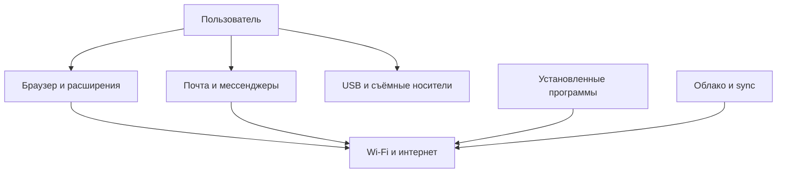

---
tags:
  - all
  - required
  - beginner
title: Активы информационной безопасности и поверхность риска
description: >-
  Информационные активы и поверхность атаки - классификация угроз, оценка уязвимостей, расчёт рисков и защита домашних и корпоративных компьютеров.
related:
  - title: "Классификация угроз и сценарии реализации"
    doc: encyclopedia/1-basics/1-12-tsifrovye-ugrozy-i-model-zashchity/2
  - title: "Цифровая безопасность для пользователя"
    doc: encyclopedia/1-basics/1-035-bazovaya-informatika/112
---

# Активы информационной безопасности и поверхность риска

  ОБЯЗАТЕЛЬНО
  ДЛЯ НОВИЧКОВ

Всем

Прежде чем «ставить антивирус», полезно ответить: **что именно** вы защищаете и **откуда** к этому могут добраться. Без этого список мер превращается в набор привычек «потому что так принято».

---

## Информационные активы

★ **Информационный актив** — всё, что имеет ценность для владельца и хранится, обрабатывается или передаётся в цифровом виде.

Информационный актив — это любой цифровой или физический объект, имеющий ценность для владельца, организации или частного лица, и подлежащий защите от несанкционированного доступа, модификации, уничтожения или хищения в рамках концепции информационной безопасности. Информационные активы включают в себя не только непосредственно данные, хранящиеся на носителях, но и аппаратное обеспечение, на котором эти данные обрабатываются и хранятся, программное обеспечение, используемое для работы с информацией, а также такие нематериальные объекты, как репутация, доверие клиентов и интеллектуальная собственность. Ключевыми характеристиками информационного актива являются его ценность для бизнеса или личности, конфиденциальность, то есть необходимость ограничения доступа к нему, целостность, требующая защиты от несанкционированных изменений, и доступность, означающая, что актив должен быть доступен авторизованным пользователям в нужное время. Управление информационными активами включает их идентификацию, классификацию по степени важности, назначение ответственных за их сохранность и внедрение мер защиты, соответствующих потенциальным угрозам и вероятности их реализации.

| Актив | Почему ценен | Пример потери |
|-------|--------------|---------------|
| **Файлы и фото** | Невосполнимые воспоминания, работа | Сломанный диск, шифровальщик |
| **Аккаунты** | Доступ к почте, соцсетям, сервисам | Утечка пароля, фишинг |
| **Деньги и платёжные данные** | Прямой финансовый ущерб | Мошенничество, кража карты |
| **Устройство** | Средство работы и хранения | Кража ноутбука, поломка |
| **Репутация** | Доверие людей и работодателя | Взлом аккаунта, публикация от вашего имени |
| **Конфиденциальность** | Персональные данные, переписка | Утечка документов, шантаж |

Файлы и фото — это совокупность цифровых информационных активов, представляющих собой результаты интеллектуальной, творческой и рабочей деятельности человека, включая текстовые документы, электронные таблицы, презентации, проектные чертежи, аудиозаписи, видеоматериалы, фотографии личного и профессионального архива, а также любые другие данные в цифровом формате, созданные или собранные владельцем. Файлы и фотографии являются одними из самых ценных информационных активов для частных лиц, поскольку они содержат семейные воспоминания, хронику жизни, важные договоры, копии паспортов и удостоверений, трудовые договоры, финансовые отчеты и переписку, и потеря этих данных часто является невосполнимой вне зависимости от их материальной стоимости. Защита файлов и фотографий требует регулярного резервного копирования на внешние носители или в облачные хранилища, применения антивирусного программного обеспечения для предотвращения заражения шифровальщиками, осторожности при открытии вложений из неизвестных источников и использования надежных паролей для учетных записей облачных сервисов. Современные системы защиты файлов также включают шифрование дисков, предотвращающее доступ к данным при физической краже устройства, и системы контроля версий, позволяющие восстановить предыдущие состояния документов в случае случайного изменения или повреждения.

Аккаунты (Учетные записи) — это цифровые идентификаторы в компьютерных системах, онлайн-сервисах и приложениях, которые однозначно связывают конкретного пользователя с его персональными данными, настройками, содержимым и правами доступа, обеспечивая возможность аутентификации и авторизации при входе в систему. Аккаунты обычно защищены паролем или более сложными методами аутентификации, такими как двухфакторная проверка через SMS, одноразовые коды в приложениях-аутентификаторах, биометрические данные, включая отпечатки пальцев и распознавание лица, или аппаратные ключи безопасности. Аккаунты являются критическими информационными активами, поскольку через них злоумышленники могут получить доступ к личной переписке в социальных сетях и мессенджерах, корпоративной документации в рабочих системах, сохраненным банковским картам и платежным данным, а также к аккаунтам на маркетплейсах и в сервисах доставки, где возможно совершение покупок от имени владельца. Компрометация даже одного аккаунта может привести к цепной реакции, поскольку многие сервисы используют аккаунты как средство восстановления доступа к другим учетным записям, поэтому безопасность аккаунтов требует использования уникальных сложных паролей для каждого сервиса, регулярной смены паролей, включения двухфакторной аутентификации и отказа от сохранения паролей в ненадежных браузерах или незашифрованных файлах.

Деньги и платежные данные — это информационные активы, непосредственно связанные с финансовыми ресурсами пользователя и представляющие собой сведения о банковских картах, номерах счетов, платежных системах, криптовалютных кошельках, интернет-банкинге и электронных деньгах, а также сами деньги, хранящиеся в электронном виде на этих счетах. Платежные данные включают полные номера банковских карт, включая срок действия и CVV-код, пароли и PIN-коды к банковским приложениям, одноразовые пароли для подтверждения транзакций, а также сохраненные в браузерах и интернет-магазинах данные для быстрой оплаты, что делает их одной из самых привлекательных целей для киберпреступников. Утечка платежных данных может привести к прямому хищению денежных средств, оформлению кредитов на имя владельца, покупкам в интернет-магазинах, созданию клонов банковских карт и долгосрочным последствиям в виде испорченной кредитной истории и судебных разбирательств. Защита денег и платежных данных требует использования только защищенных HTTPS-соединений при онлайн-покупках, отказа от хранения CVV-кода в цифровом виде, применения отдельных виртуальных карт для интернет-платежей, использования платежных шлюзов и систем токенизации, которые заменяют реальные номера карт случайными одноразовыми кодами, а также подключения SMS-уведомлений о всех транзакциях для оперативного обнаружения подозрительной активности.

Устройство — это физический объект вычислительной техники, такой как компьютер, ноутбук, смартфон, планшет, внешний накопитель или любое другое оборудование, которое используется для обработки, хранения или передачи информационных активов, и само по себе представляет материальную и информационную ценность для владельца. Устройство является не только носителем данных, но и точкой входа во все цифровые активы пользователя, поскольку через него осуществляется доступ к файлам, аккаунтам, платежным системам и личной переписке, и именно поэтому потеря или кража устройства несет значительно больший ущерб, чем просто стоимость утерянного гаджета. Физическая защита устройств включает использование надежных паролей и биометрической аутентификации для блокировки экрана, шифрование всех данных на диске, чтобы злоумышленник не мог получить доступ к информации даже после извлечения накопителя, а также включение функций удаленного поиска, блокировки и стирания данных, доступных в современных мобильных операционных системах. Особую угрозу для устройства как актива представляет его потеря или кража в общественном месте, поэтому важно избегать оставления техники без присмотра, использовать средства физической защиты, такие как замки Kensington для ноутбуков, и регулярно создавать резервные копии, чтобы при физической утрате устройства информационные потери были минимальными.

Репутация — это нематериальный информационный актив, представляющий собой совокупность общественного восприятия, доверия и авторитета конкретного человека, бренда или организации в цифровом пространстве, формирующуюся на основе публичных действий, высказываний, отзывов, рейтингов, статей и упоминаний в социальных сетях, форумах, новостных порталах и профессиональных сообществах. Цифровая репутация является критически важным активом для публичных лиц, предпринимателей, фрилансеров и компаний, поскольку напрямую влияет на уровень дохода, количество клиентов, возможности трудоустройства, условия партнерства и социальный статус в профессиональной среде. Репутационные риски включают публикацию компрометирующих материалов, кражу аккаунтов с последующей рассылкой спама или оскорблений от имени владельца, фейковые негативные отзывы, распространение недостоверной информации и клевету, а также неосторожные публичные высказывания, которые могут быть вырваны из контекста и сохранены в интернете навсегда. Управление репутацией требует осторожности при публикациях в социальных сетях, разделения личных и рабочих профилей, регулярного мониторинга упоминаний в интернете, оперативного реагирования на негативные отзывы, использования сложных паролей для всех аккаунтов и объяснения ситуации в случае публичных инцидентов, чтобы минимизировать нанесенный репутационный ущерб и восстановить доверие аудитории.

Конфиденциальность (Privacy — приватность) — это право и возможность человека или организации контролировать, какая информация о них собирается, кем, с какой целью и как она используется, хранится и распространяется, а также состояние защищенности персональных данных от несанкционированного доступа, раскрытия или использования третьими лицами. В цифровом контексте конфиденциальность означает, что личная информация, включая имя, адрес, номер телефона, геолокацию, историю посещений веб-сайтов, покупательские предпочтения, биометрические данные и переписку, не должна быть доступна посторонним без явного и добровольного согласия владельца, за исключением случаев, предусмотренных законом. Нарушение конфиденциальности происходит при сборе данных без согласия пользователя, продаже персональной информации рекламным сетям, утечках баз данных, слежке через вредоносное программное обеспечение или камеры, а также при недостаточной защите данных со стороны сервисов, что может привести к дискриминации, спаму, мошенничеству, социальной инженерии и даже физической опасности для человека. Защита конфиденциальности требует использования шифрования при передаче и хранении данных, минималистичного подхода к раскрытию личной информации, настройки приватности в социальных сетях, использования анонимных поисковых систем, регулярного просмотра и отзыва разрешений для мобильных приложений, а также осознанного отказа от бесплатных сервисов, которые собирают слишком много данных, поскольку в цифровом мире «бесплатно» часто означает, что пользователь сам становится продуктом.

Компрометация (Security Breach — нарушение безопасности) — это событие, в результате которого информационные активы, включая данные, аккаунты, устройства или системы, оказываются под угрозой или фактически подвергаются несанкционированному доступу, модификации, уничтожению или использованию злоумышленниками, что нарушает один из трех основополагающих принципов информационной безопасности — конфиденциальность, целостность или доступность. Компрометация может произойти по множеству причин: взлом пароля методом перебора или подбора из утечек данных, фишинговые атаки, когда пользователь добровольно вводит свои данные на поддельном сайте, заражение устройства вирусом-шпионом или шифровальщиком, перехват трафика в незащищенной сети, физическая кража устройства, использование уязвимостей в программном обеспечении, а также неосторожные действия самого пользователя, такие как пересылка паролей в открытом виде. Признаками компрометации могут служить невозможность входа в собственный аккаунт, обнаружение подозрительных транзакций, отправка спама от имени пользователя, изменение настроек системы без ведома владельца, появление неизвестных файлов или исчезновение данных, а также уведомления от сервисов о подозрительных входах из незнакомых мест. Действия при компрометации должны быть немедленными и включают смену паролей на всех критичных аккаунтах, уведомление банка о подозрительных операциях, запуск полной антивирусной проверки, отключение скомпрометированного устройства от сети для предотвращения дальнейшего распространения, обращение к технической поддержке сервисов для блокировки аккаунтов и восстановления доступа, а также анализ произошедшего для предотвращения повторных инцидентов в будущем.

Активы связаны между собой: компрометация **почты** часто открывает доступ к **банку** (сброс пароля) и к **файлам** в облаке. Модель защиты строится вокруг **цепочки активов**, а не одного «важного пароля».

  
Связь с файлами

  

  Где лежат файлы на диске и как они удаляются — в разделе <a href="/encyclopedia/1-basics/1-11-fayly-katalogi-i-puti/intro">Файлы, каталоги и пути</a>. Здесь — зачем их защищать.
  

---

## Угроза, уязвимость, риск

Три термина часто смешивают; в ИБ у них разные роли.

| Термин | Смысл | Бытовой пример |
|--------|--------|----------------|
| **Угроза** | Возможное событие, которое может навредить активу | Фишинговое письмо, кража ноутбука, сбой диска |
| **Уязвимость** | Слабое место, через которое угроза реализуется | Старый Windows без обновлений, один пароль на все сайты, открытый Wi‑Fi без пароля |
| **Риск** | Вероятность × последствия: насколько реалистична угроза и насколько больно | «Пароль 123456 на почте» — высокий риск; «украдут монитор» — низкий риск для фото на SSD |

★ **Риск** — осмысленная оценка: *что может случиться*, *насколько это вероятно* и *что мы потеряем*.

Угроза (Threat) — это потенциально возможное событие, действие, процесс или явление, которое способно нанести ущерб информационным активам, нарушить их конфиденциальность, целостность или доступность, используя существующие уязвимости и реализуясь через определенные векторы атак. Источниками угроз могут быть злоумышленники, как внешние, так и внутренние, вредоносное программное обеспечение, стихийные бедствия, технические сбои оборудования, ошибки пользователей или администраторов, а также инсайдеры, действующие как умышленно, так и по неосторожности. Угрозы классифицируются по множеству признаков: по происхождению — естественные, техногенные и антропогенные; по намеренности — преднамеренные и непреднамеренные; по локализации — внутренние и внешние; по воздействию — прямые, косвенные и комплексные. Важно понимать, что угроза сама по себе не причиняет вреда, пока не найдет путь к реализации через уязвимость, но именно наличие угроз заставляет организации и частных лиц вкладывать ресурсы в системы защиты, мониторинг и обучение персонала основам кибербезопасности, чтобы минимизировать вероятность и последствия потенциальных инцидентов.

Уязвимость (Vulnerability) — это слабое место, недостаток, ошибка или пробел в системе защиты, архитектуре программного обеспечения, аппаратной конфигурации, организационных процессах или человеческом поведении, которое может быть использовано угрозой для нанесения ущерба информационному активу или для получения несанкционированного доступа к системе. Уязвимости бывают программными, например, ошибки в коде приложений, позволяющие выполнить произвольный код или обойти проверки подлинности, логическими, например, неправильные настройки прав доступа, позволяющие пользователю получить больше привилегий, чем ему положено, аппаратными, например, физический порт USB, оставленный доступным для посторонних, и человеческими, например, склонность сотрудников переходить по фишинговым ссылкам или использовать простые пароли. Уязвимости имеют различные степени критичности, которые оцениваются по шкале CVSS, учитывающей сложность эксплуатации, необходимые привилегии для атаки, потенциальный ущерб и возможность распространения, при этом критически важно своевременно выявлять уязвимости с помощью сканеров безопасности, пентестов и анализа кода, а также оперативно закрывать их с помощью обновлений, патчей и изменения конфигураций. Особенность уязвимостей заключается в том, что они существуют объективно, даже если о них никто не знает, и злоумышленники активно ищут новые неизвестные уязвимости — так называемые zero-day уязвимости, которые еще не имеют патча и поэтому представляют наибольшую опасность для организаций, владеющих критически важными данными.

Риск (Risk) — это вероятностная оценка потенциального ущерба для информационных активов, которая вычисляется как комбинация вероятности реализации конкретной угрозы через конкретную уязвимость и величины возможных потерь в случае успешной атаки, и является ключевым понятием в управлении информационной безопасностью. Математически риск выражается формулой: Риск = Вероятность инцидента × Размер потенциального ущерба, при этом вероятность зависит от того, насколько легко эксплуатабельна уязвимость и насколько активны источники угроз, а ущерб измеряется в финансовых потерях, репутационных издержках, штрафах регуляторов и времени простоя бизнес-процессов. Управление рисками — это не стремление полностью их устранить, что невозможно в принципе, а процесс их идентификации, анализа, оценки и принятия решений: риск можно избежать, отказавшись от определенной деятельности или технологии; уменьшить, внедрив дополнительные средства защиты; передать, например, заключив договор страхования или передав обработку данных облачному провайдеру; или принять, если стоимость защиты превышает потенциальный ущерб, что часто является разумным бизнес-решением. Ключевым принципом риск-менеджмента является так называемый остаточный риск — тот уровень риска, который организация сознательно готова терпеть после внедрения всех экономически целесообразных мер защиты, и именно он определяет приоритеты вложений в безопасность и распределение бюджета на различные защитные механизмы.

Защита не сводится к «убрать все угрозы» — их бесконечно много. Цель — **снизить риск** до приемлемого: закрыть критичные уязвимости, сохранить копии данных, ограничить последствия инцидента.

---

## Поверхность атаки

★ **Поверхность атаки (attack surface)** — совокупность точек, через которые злоумышленник или ошибка могут добраться до активов.

Поверхность атаки (Attack Surface) — это совокупность всех точек, интерфейсов, каналов и путей, через которые злоумышленник потенциально может получить доступ к системе или внедрить в нее вредоносный код, иными словами, это сумма всех уязвимостей и векторов атаки, доступных для эксплуатации в текущий момент времени. Поверхность атаки включает в себя сетевые порты и протоколы, открытые для подключения извне, веб-интерфейсы и API, доступные через интернет, пользовательский интерфейс и поля ввода, через которые можно ввести вредоносные данные, физические интерфейсы, такие как USB-порты, беспроводные каналы связи, включая Wi-Fi и Bluetooth, а также человеческий фактор, включая социальную инженерию и работу с электронной почтой. Чем больше поверхность атаки, тем сложнее систему защитить, поскольку каждый дополнительный сервис, открытый порт, установленное приложение или подключенное устройство представляет собой потенциальную точку входа для злоумышленника, и задача администраторов — минимизировать поверхность атаки, отключая все неиспользуемые сервисы и протоколы, закрывая лишние порты, удаляя ненужное программное обеспечение и ограничивая физический доступ к оборудованию. Управление поверхностью атаки является непрерывным процессом, поскольку с добавлением новых функций, обновлением программного обеспечения и подключением новых устройств она постоянно изменяется, и для ее контроля используются автоматические сканеры, которые регулярно инвентаризируют все активные сервисы, открытые порты и сетевые точки входа, а также прогнозируют потенциальные векторы атак на основе текущей конфигурации системы.

Точка входа (Entry Point) — это конкретная точка, интерфейс или канал в системе, через который злоумышленник может начать реализацию атаки, проникнуть в защищенную среду, получить первоначальный доступ к ресурсам или внедрить вредоносное программное обеспечение, и каждая такая точка является частью общей поверхности атаки. Примерами точек входа являются веб-форма на сайте, принимающая пользовательский ввод и потенциально уязвимая для SQL-инъекций, порт SSH, открытый для удаленного администрирования и доступный для перебора паролей, USB-порт на компьютере, в который можно вставить зараженную флешку, электронное письмо, содержащее фишинговую ссылку или вредоносное вложение, а также приложение, загруженное из неофициального магазина и содержащее скрытые функции слежки. Для киберпреступников точка входа является первым и самым критическим этапом любой атаки, поскольку именно через нее они получают первоначальный доступ, после чего начинают двигаться по сети, повышать свои привилегии, искать ценные данные и закрепляться в системе для долгосрочного присутствия, и поэтому именно защита точек входа является приоритетной задачей для всех слоев безопасности. Защита точек входа требует использования межсетевых экранов для фильтрации трафика, строгой аутентификации с многофакторной проверкой для удаленного доступа, валидации и санитизации всех пользовательских вводов, обновления программного обеспечения для закрытия известных уязвимостей, обучения пользователей безопасной работе с электронной почтой и ограничения физического доступа к оборудованию, чтобы максимально усложнить злоумышленнику поиск и использование слабого места для проникновения.

| Точка входа | Типичная угроза |
|-------------|-----------------|
| **Браузер** | Подменный сайт, вредоносное расширение |
| **Почта / мессенджер** | Фишинг, вложение с malware |
| **USB-флешка** | Автозапуск, троян «найденная» флешка |
| **Wi‑Fi** | Перехват трафика в публичной сети (без VPN) |
| **Установщики** | ПО с постороннего сайта, «кряк» |
| **Облако** | Слабый пароль аккаунта, расшаренная папка «для всех» |

Сокращение поверхности атаки (Attack Surface Reduction — ASR) — это целенаправленный процесс уменьшения количества потенциальных точек входа, открытых сервисов, активных портов, доступных интерфейсов и установленных приложений в системе, с целью минимизировать возможности для злоумышленников по проведению атак и эксплуатации уязвимостей. Сокращение поверхности достигается за счет применения принципа минимально необходимых привилегий и минимально необходимой функциональности, то есть в системе работают только те сервисы, которые абсолютно необходимы для выполнения основных задач, используются только те протоколы, которые критичны для бизнес-процессов, и доступ предоставляется только тем пользователям, которым он действительно требуется по роду деятельности. Практические меры по сокращению поверхности атаки включают отключение неиспользуемых сетевых портов и протоколов, удаление демо-версий и неиспользуемых приложений, отключение автозапуска с внешних носителей, использование белых списков разрешенных программ вместо черных списков запрещенных, сегментацию сети для изоляции критически важных систем, ограничение прав пользователей до минимума, необходимого для работы, а также регулярную инвентаризацию активов для своевременного обнаружения новых сервисов, появившихся без ведома администраторов. Важно понимать, что сокращение поверхности атаки не устраняет все риски полностью, поскольку абсолютно любой сервис потенциально содержит уязвимости, но оно существенно усложняет работу злоумышленников, требуя от них больше времени, ресурсов и более сложных методов, а также увеличивает вероятность того, что их действия будут обнаружены системами мониторинга до того, как они смогут нанести значительный ущерб, что делает ASR одним из самых эффективных и экономически выгодных методов повышения информационной безопасности в любой организации.

Сокращение поверхности — базовый принцип: не ставить лишнее, обновлять ОС, не подключать неизвестные флешки, не давать приложениям лишние права. Конкретные привычки — [Цифровая безопасность](/encyclopedia/1-basics/1-035-bazovaya-informatika/112).

---

## Куда дальше

- Откуда приходят атаки и как они развиваются — [Классификация угроз](./2).
- Принципы CIA и слои защиты — [Модель конфиденциальности, целостности и доступности](./3).
