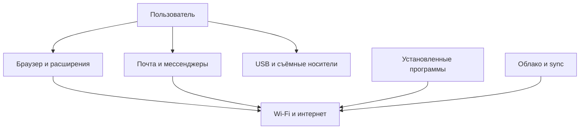

---
tags:
  - all
  - required
  - beginner
title: Активы информационной безопасности и поверхность риска
description: >-
  Информационные активы и поверхность атаки - классификация угроз, оценка уязвимостей, расчёт рисков и защита домашних и корпоративных компьютеров.
related:
  - title: "Классификация угроз и сценарии реализации"
    doc: encyclopedia/1-basics/1-12-tsifrovye-ugrozy-i-model-zashchity/2
  - title: "Цифровая безопасность для пользователя"
    doc: encyclopedia/1-basics/1-035-bazovaya-informatika/112
---

# Активы информационной безопасности и поверхность риска

  ОБЯЗАТЕЛЬНО
  ДЛЯ НОВИЧКОВ

Всем

Прежде чем «ставить антивирус», полезно ответить: **что именно** вы защищаете и **откуда** к этому могут добраться. Без этого список мер превращается в набор привычек «потому что так принято».

---

## Информационные активы

★ **Информационный актив** — всё, что имеет ценность для владельца и хранится, обрабатывается или передаётся в цифровом виде.

| Актив | Почему ценен | Пример потери |
|-------|--------------|---------------|
| **Файлы и фото** | Невосполнимые воспоминания, работа | Сломанный диск, шифровальщик |
| **Аккаунты** | Доступ к почте, соцсетям, сервисам | Утечка пароля, фишинг |
| **Деньги и платёжные данные** | Прямой финансовый ущерб | Мошенничество, кража карты |
| **Устройство** | Средство работы и хранения | Кража ноутбука, поломка |
| **Репутация** | Доверие людей и работодателя | Взлом аккаунта, публикация от вашего имени |
| **Конфиденциальность** | Персональные данные, переписка | Утечка документов, шантаж |

Активы связаны между собой: компрометация **почты** часто открывает доступ к **банку** (сброс пароля) и к **файлам** в облаке. Модель защиты строится вокруг **цепочки активов**, а не одного «важного пароля».

  
Связь с файлами

  

  Где лежат файлы на диске и как они удаляются — в разделе <a href="/encyclopedia/1-basics/1-11-fayly-katalogi-i-puti/intro">Файлы, каталоги и пути</a>. Здесь — зачем их защищать.
  

---

## Угроза, уязвимость, риск

Три термина часто смешивают; в ИБ у них разные роли.

| Термин | Смысл | Бытовой пример |
|--------|--------|----------------|
| **Угроза** | Возможное событие, которое может навредить активу | Фишинговое письмо, кража ноутбука, сбой диска |
| **Уязвимость** | Слабое место, через которое угроза реализуется | Старый Windows без обновлений, один пароль на все сайты, открытый Wi‑Fi без пароля |
| **Риск** | Вероятность × последствия: насколько реалистична угроза и насколько больно | «Пароль 123456 на почте» — высокий риск; «украдут монитор» — низкий риск для фото на SSD |

★ **Риск** — осмысленная оценка: *что может случиться*, *насколько это вероятно* и *что мы потеряем*.

Защита не сводится к «убрать все угрозы» — их бесконечно много. Цель — **снизить риск** до приемлемого: закрыть критичные уязвимости, сохранить копии данных, ограничить последствия инцидента.

---

## Поверхность атаки

★ **Поверхность атаки (attack surface)** — совокупность точек, через которые злоумышленник или ошибка могут добраться до активов.

| Точка входа | Типичная угроза |
|-------------|-----------------|
| **Браузер** | Подменный сайт, вредоносное расширение |
| **Почта / мессенджер** | Фишинг, вложение с malware |
| **USB-флешка** | Автозапуск, троян «найденная» флешка |
| **Wi‑Fi** | Перехват трафика в публичной сети (без VPN) |
| **Установщики** | ПО с постороннего сайта, «кряк» |
| **Облако** | Слабый пароль аккаунта, расшаренная папка «для всех» |

Сокращение поверхности — базовый принцип: не ставить лишнее, обновлять ОС, не подключать неизвестные флешки, не давать приложениям лишние права. Конкретные привычки — [Цифровая безопасность](/encyclopedia/1-basics/1-035-bazovaya-informatika/112).

---

## Куда дальше

- Откуда приходят атаки и как они развиваются — [Классификация угроз](./2).
- Принципы CIA и слои защиты — [Модель конфиденциальности, целостности и доступности](./3).
