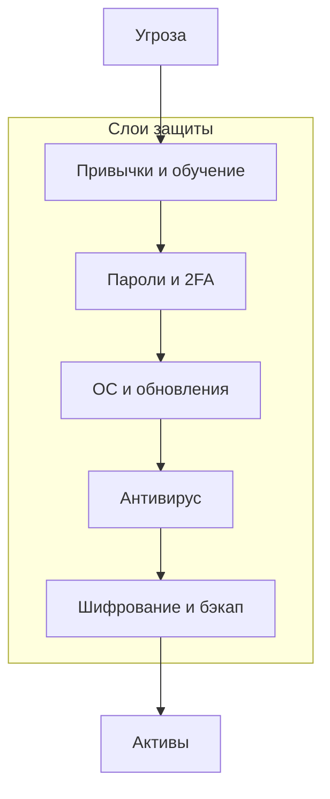

---
tags:
  - all
  - required
  - beginner
title: Модель конфиденциальности, целостности и доступности
description: >-
  Триада CIA на бытовом уровне; многоуровневая защита; границы доверия между
  ОС, браузером, сайтом и носителем.
related:
  - title: "Основы информационной безопасности"
    doc: encyclopedia/2-system-network/2-08-osnovy-informatsionnoy-bezopasnosti/1
  - title: "Резервное копирование и обеспечение сохранности данных"
    doc: encyclopedia/1-basics/1-12-tsifrovye-ugrozy-i-model-zashchity/6
---

# Модель конфиденциальности, целостности и доступности

  ОБЯЗАТЕЛЬНО
  ДЛЯ НОВИЧКОВ

Всем

В корпоративной ИБ часто опираются на три свойства данных — **CIA**. Для домашнего пользователя та же модель помогает понять, *зачем* пароль, *зачем* бэкап и *почему* «зашифрованный сайт» не равно «честный сайт».

---

## Триада CIA

★ **Конфиденциальность (Confidentiality)** — данные видят только те, кому положено.

★ **Целостность (Integrity)** — данные не изменены без ведома владельца (случайно или злонамеренно).

★ **Доступность (Availability)** — данные и сервисы доступны, когда они нужны.

| Свойство | Бытовой пример нарушения | Мера |
|----------|--------------------------|------|
| **C** | Украли ноутбук и прочитали фото | Шифрование диска (BitLocker, FileVault) |
| **I** | В документе подменили сумму в договоре | Контроль версий, бэкап, осторожность с вложениями |
| **A** | Шифровальщик заблокировал файлы; сервер лёг | Резервные копии, обновления ОС |

Три свойства **конкурируют**. Жёсткая секретность (длинный пароль, офлайн-архив) может усложнить доступ *вам самим*. Идеал — **баланс** под ваши активы: семейные фото — доступность и бэкап; налоговые документы — конфиденциальность и целостность.

Углубление и корпоративные кейсы — [Основы информационной безопасности](/encyclopedia/2-system-network/2-08-osnovy-informatsionnoy-bezopasnosti/1).

---

## Многоуровневая защита

★ **Defense in depth (многоуровневая защита)** — несколько независимых барьеров; провал одного не означает полную потерю.

| Слой | Что делает | Не заменяет |
|------|------------|-------------|
| **Обновления ОС и программ** | Закрывает известные дыры | Осторожность с фишингом |
| **Антивирус / Defender** | Ловит известное malware | Социальную инженерию |
| **Уникальные пароли + 2FA** | Ограничивает доступ к аккаунтам | Резервную копию |
| **Шифрование диска** | Защита при краже устройства | Облачный аккаунт с слабым паролем |
| **Резервное копирование** | Восстановление после сбоя и ransomware | Конфиденциальность копии (шифруйте носитель) |
| **Привычки пользователя** | Не кликать «наугад», проверять отправителя | Технические меры без обучения |

Ни один слой не «защищает от всего». Антивирус не спасёт от введённого вами пароля на поддельном сайте; 2FA не вернёт файлы без бэкапа.

---

## Границы доверия

★ **Граница доверия (trust boundary)** — линия, за которой вы **не предполагаете** безопасность по умолчанию.

| Зона | Доверять по умолчанию? | Почему |
|------|------------------------|--------|
| **Ваш профиль Windows/macOS** | Умеренно | Malware может действовать от вашего имени |
| **Браузер + расширения** | Осторожно | Расширение видит страницы; подменный сайт выглядит «как настоящий» |
| **HTTPS-сайт незнакомого домена** | Только шифрование канала | **HTTPS ≠ честность** — сертификат шифрует связь с *этим* доменом, даже если домен мошеннический |
| **USB с парковки** | Нет | Неизвестное содержимое |
| **Звонок «из банка»** | Нет | Номер можно подделать; банк не просит пароль по телефону |
| **Письмо «срочно войдите»** | Нет | Открыть приложение банка вручную, не ссылку из письма |

Практические правила — [Цифровая безопасность](/encyclopedia/1-basics/1-035-bazovaya-informatika/112). Криптография HTTPS, хеши паролей — [раздел 2.08](/encyclopedia/2-system-network/2-08-osnovy-informatsionnoy-bezopasnosti/intro).

---

## Куда дальше

- Кто и как доказывает личность — [Идентификация, аутентификация и управление доступом](./4).
- Сохранность данных — [Резервное копирование](./6).
