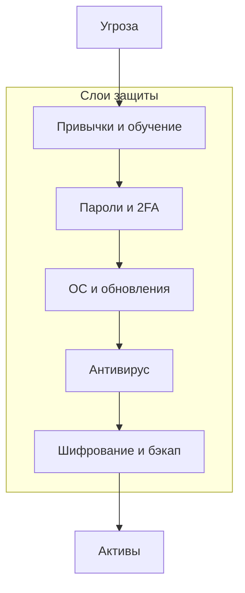

---
tags:
  - all
  - required
  - beginner
title: Модель конфиденциальности, целостности и доступности
description: >-
  Триада CIA на бытовом уровне; многоуровневая защита; границы доверия между
  ОС, браузером, сайтом и носителем.
related:
  - title: "Основы информационной безопасности"
    doc: encyclopedia/2-system-network/2-08-osnovy-informatsionnoy-bezopasnosti/1
  - title: "Резервное копирование и обеспечение сохранности данных"
    doc: encyclopedia/1-basics/1-12-tsifrovye-ugrozy-i-model-zashchity/6
---

# Модель конфиденциальности, целостности и доступности

  ОБЯЗАТЕЛЬНО
  ДЛЯ НОВИЧКОВ

Всем

Модель конфиденциальности, целостности и доступности (Модель CIA) — это фундаментальная парадигма информационной безопасности, представляющая собой триаду основных свойств защищаемой информации, которые должны быть обеспечены для любой информационной системы, и служащая основой для разработки политик безопасности, выбора средств защиты и оценки рисков в любой организации. Модель CIA является универсальной и применимой к любым типам данных, системам и сценариям использования, а баланс между тремя составляющими зависит от конкретной ситуации: для военных систем приоритетом является конфиденциальность, для банковских — целостность, для публичных сервисов — доступность. Нарушение хотя бы одного из трех свойств считается инцидентом информационной безопасности, при этом одна и та же атака может нарушать сразу несколько свойств, например, вирус-шифровальщик нарушает доступность, делая файлы недоступными, и целостность, изменяя их содержимое, а кража базы данных нарушает конфиденциальность. Триада CIA является не только теоретической концепцией, но и практическим инструментом для классификации активов, определения приоритетов защиты, выбора адекватных мер и расчета стоимости владения системой безопасности для каждой категории информации.

В корпоративной ИБ часто опираются на три свойства данных — **CIA**. Для домашнего пользователя та же модель помогает понять, *зачем* пароль, *зачем* бэкап и *почему* «зашифрованный сайт» не равно «честный сайт».

---

## Триада CIA

CIA (Конфиденциальность, Целостность, Доступность) — это акроним, образованный от первых букв английских слов Confidentiality, Integrity, Availability, который используется в качестве краткого обозначения фундаментальной триады свойств информационной безопасности и является общепринятым стандартом в международной практике, учебных курсах и профессиональной сертификации. Термин CIA впервые был введен в рамках модели безопасности для компьютерных систем и с тех пор стал основой для всех международных стандартов, включая ISO/IEC 27001, NIST SP 800-53 и многие другие регламентирующие документы по управлению информационной безопасностью. В отличие от других моделей безопасности, триада CIA не привязана к конкретным технологиям, методам шифрования или архитектурным решениям, а описывает именно свойства, которые должна обеспечивать защищаемая система, что делает её применимой как к бумажным документам и людям, так и к самым современным облачным и квантовым вычислениям. Использование акронима CIA в профессиональной среде позволяет лаконично обозначать целые классы задач и угроз, например, угрозы конфиденциальности, угрозы целостности или угрозы доступности, и быстро коммуницировать между специалистами по безопасности, менеджментом и разработчиками о требуемых свойствах системы.

★ **Конфиденциальность (Confidentiality)** — данные видят только те, кому положено.

★ **Целостность (Integrity)** — данные не изменены без ведома владельца (случайно или злонамеренно).

★ **Доступность (Availability)** — данные и сервисы доступны, когда они нужны.

| Свойство | Бытовой пример нарушения | Мера |
|----------|--------------------------|------|
| **C** | Украли ноутбук и прочитали фото | Шифрование диска (BitLocker, FileVault) |
| **I** | В документе подменили сумму в договоре | Контроль версий, бэкап, осторожность с вложениями |
| **A** | Шифровальщик заблокировал файлы; сервер лёг | Резервные копии, обновления ОС |

Конфиденциальность (Confidentiality) — это свойство информационной системы, означающее, что информация доступна и может быть раскрыта только тем субъектам, которые имеют на это явное разрешение, авторизацию и легитимную необходимость знать данную информацию, при этом всем остальным субъектам доступ к ней строго запрещен и надежно блокируется. Обеспечение конфиденциальности достигается использованием шифрования данных как при хранении, так и при передаче, системами управления доступом на основе ролей, политик и мандатов, средствами аутентификации для идентификации пользователей, процедурами защиты от социальной инженерии, а также физическими мерами, предотвращающими несанкционированный доступ к носителям информации. Нарушение конфиденциальности происходит при утечках данных, несанкционированном доступе к информации, краже носителей, перехвате трафика, фишинговых атаках, а также при ошибках конфигурации систем, когда доступ к закрытым данным получают посторонние пользователи. Конфиденциальность является абсолютным приоритетом для персональных данных, врачебной тайны, банковской информации, коммерческой тайны, государственной и военной тайны, и именно её нарушение чаще всего приводит к крупным скандалам, репутационным потерям, судебным искам и регуляторным штрафам, измеряемым миллионами и миллиардами долларов.

Целостность (Integrity) — это свойство информационной системы, означающее, что информация является полной, точной, непротиворечивой и не была изменена несанкционированным или неавторизованным способом, при этом любые изменения, будь то добавление, удаление или модификация данных, могут быть выполнены только уполномоченными лицами и в рамках установленных процессов и процедур. Обеспечение целостности достигается использованием контрольных сумм и хэш-функций для проверки неизменности файлов, цифровых подписей для подтверждения авторства и неизменности документов, систем контроля версий, журналов аудита, которые фиксируют все изменения и их авторов, а также разграничением прав, запрещающим редактирование критических данных обычным пользователям. Нарушение целостности происходит при модификации файлов вирусами и вредоносным ПО, внесении изменений в базы данных неавторизованными пользователями, подмене данных в процессе передачи по сети, повреждении файлов из-за сбоев оборудования или ошибок программного обеспечения, а также при действиях инсайдеров, сознательно или случайно изменяющих критическую информацию. Целостность имеет абсолютный приоритет в финансовых системах, где даже незначительная модификация транзакции может привести к колоссальным материальным потерям, в медицинских информационных системах, где ошибка в данных пациента может стоить жизни, в системах управления промышленными процессами и военных системах, где потеря целостности может привести к катастрофическим последствиям.

Доступность (Availability) — это свойство информационной системы, означающее, что информация и сервисы должны быть доступны авторизованным пользователям в любое время, когда возникает потребность в их использовании, и что система способна выдерживать нагрузку, обрабатывать запросы в установленное время и восстанавливаться после сбоев в приемлемые сроки. Обеспечение доступности достигается использованием отказоустойчивых архитектур с резервированием критических компонентов, реализацией систем бесперебойного питания и резервных каналов связи, регулярным резервным копированием и тестированием восстановления, применением балансировщиков нагрузки для распределения трафика и защитой от DDoS-атак, а также регламентными процедурами планового обслуживания с минимальным временем простоя. Нарушение доступности происходит при DDoS-атаках, переполняющих серверы запросами, при аппаратных сбоях, отключении электропитания, ошибках в конфигурации сетевого оборудования, удалении системных файлов, заражении программами-шифровальщиками, а также при стихийных бедствиях, уничтожающих серверные помещения. Доступность является критическим приоритетом для интернет-магазинов, банковских онлайн-систем, биржевых платформ, систем экстренной связи, государственных порталов и критической инфраструктуры, где каждая минута простоя измеряется миллионами потерянных транзакций или даже человеческими жизнями, и именно поэтому доступность требует постоянного мониторинга, планирования мощностей и разработки детальных планов восстановления после катастроф.

Три свойства **конкурируют**. Жёсткая секретность (длинный пароль, офлайн-архив) может усложнить доступ *вам самим*. Идеал — **баланс** под ваши активы: семейные фото — доступность и бэкап; налоговые документы — конфиденциальность и целостность.

Углубление и корпоративные кейсы — [Основы информационной безопасности](/encyclopedia/2-system-network/2-08-osnovy-informatsionnoy-bezopasnosti/1).

Нарушение (Security Breach / Violation) — это событие, действие или состояние, при котором одно или несколько свойств информационной системы из триады CIA оказываются скомпрометированными, то есть конфиденциальность, целостность или доступность информации нарушается в результате несанкционированного доступа, изменения, уничтожения или блокировки данных, либо несоблюдения установленных политик безопасности. Нарушение может быть как результатом целенаправленных действий злоумышленника, например, взлома аккаунта для кражи данных, так и следствием непреднамеренных действий пользователя, например, случайного удаления важной папки или отправки конфиденциального документа по электронной почте не тому адресату, а также технических причин, таких как сбой жесткого диска или ошибка в программном обеспечении. Последствия нарушения зависят от того, какое именно свойство было нарушено и насколько критичен для бизнеса скомпрометированный актив: нарушение конфиденциальности может привести к утечке личных данных миллионов клиентов, нарушение целостности — к искажению финансовой отчетности и юридическим последствиям, нарушение доступности — к остановке работы компании на дни и недели. Реагирование на нарушение требует оперативного обнаружения инцидента, его анализа для оценки масштаба ущерба и источника угрозы, сдерживания распространения атаки, ликвидации последствий, восстановления систем из резервных копий и проведения пост-инцидентного анализа для предотвращения повторных нарушений с улучшением защитных мер.

Мера (Countermeasure / Security Measure) — это любое средство, действие, процедура, политика или техническое решение, которые внедряются для снижения рисков нарушения безопасности и защиты информационных активов от угроз, то есть это конкретный способ реализации одного или нескольких свойств триады CIA в контексте конкретных условий эксплуатации системы. Меры безопасности классифицируются на физические, такие как замки, камеры наблюдения и биометрические сканеры, контролирующие доступ в помещения; организационные или административные, такие как политики безопасности, инструкции и регламенты, обучение персонала и разделение обязанностей; технические, такие как брандмауэры, антивирусы, системы шифрования, средства аутентификации и системы обнаружения вторжений; а также процедурные, определяющие действия сотрудников в различных ситуациях, например, план реагирования на инциденты или процедура выдачи и отзыва паролей. Выбор конкретных мер зависит от ценности защищаемых активов, уровня рисков, бюджета организации и баланса между тремя составляющими триады CIA, при этом эффективная система безопасности использует комбинацию различных мер на всех уровнях, создавая «защиту в глубину», где отказ одного барьера компенсируется наличием других слоев защиты. Важно понимать, что ни одна мера не является абсолютной и вечной — злоумышленники постоянно адаптируются, технологии меняются, и меры требуют регулярного пересмотра, тестирования и обновления для сохранения своей эффективности против новых и эволюционирующих угроз.

Секретность (Secrecy) — это более узкое понятие, чем конфиденциальность, означающее особый режим защиты информации, при котором факт существования самой информации или системы, а также все связанные с ними детали, скрываются от всех лиц, кроме строго ограниченного круга уполномоченных субъектов, и при этом доступ к информации предоставляется по принципу «необходимо знать», а не только по формальному разрешению. Секретность предполагает, что информация классифицируется по уровням секретности, таким как «особой важности», «совершенно секретно», «секретно» и «несекретно», и для каждого уровня установлены строгие процедуры допуска, хранения, передачи и уничтожения информации, включая специальные помещения, сейфы и системы шифрования, сертифицированные государственными органами. В отличие от конфиденциальности, которая может быть применена к любым данным, включая персональную информацию клиентов, секретность является преимущественно государственной категорией и регулируется специальными законами о государственной тайне, а её нарушение влечет не административные штрафы, а уголовное преследование со строгими сроками лишения свободы. Секретность также предполагает использование систем контроля доступа с высоким уровнем гарантий, включая аппаратные модули безопасности, многофакторную аутентификацию и системы предотвращения утечек, но при этом секретность часто вступает в конфликт с принципом доступности, поскольку процедуры защиты секретной информации значительно усложняют и замедляют доступ к ней даже уполномоченных лиц.

Доступ (Access) — это возможность субъекта входить в информационную систему, просматривать, изменять, использовать или иным образом взаимодействовать с информационными активами, которая предоставляется на основе аутентификации, то есть подтверждения личности, и авторизации, то есть проверки прав доступа в соответствии с установленными политиками и ролями пользователя. Управление доступом строится на трех ключевых принципах: принцип минимальных привилегий, означающий, что субъект получает только те права, которые абсолютно необходимы для выполнения его рабочих задач; принцип разделения обязанностей, предотвращающий концентрацию избыточной власти у одного субъекта путем разделения критических операций между несколькими людьми; и принцип наименьшего удивления, означающий, что права доступа должны быть логичными и интуитивно понятными для пользователя, чтобы он не совершал ошибок из-за несоответствия прав и ожиданий. Доступ может быть предоставлен на основе различных моделей: дискреционной, когда владелец ресурса сам решает, кому дать доступ; мандатной, когда доступ определяется уровнями секретности независимо от желания владельца; ролевой, когда права назначаются на основе должностных обязанностей; и основанной на атрибутах, когда доступ рассчитывается динамически на основе множества факторов, включая время, местоположение и состояние устройства. Контроль доступа является центральным механизмом реализации конфиденциальности и целостности, и именно поэтому управление доступом требует регулярного пересмотра и аудита, чтобы сотрудники, сменившие должность или покинувшие компанию, не сохраняли неактуальные и избыточные права, которые могут быть использованы злоумышленниками или недобросовестными инсайдерами.

---

## Многоуровневая защита

★ **Defense in depth (многоуровневая защита)** — несколько независимых барьеров; провал одного не означает полную потерю. 

Многоуровневая защита (Defense in Depth — Защита в глубину) — это архитектурный принцип построения системы безопасности, при котором для защиты информационных активов используются несколько независимых слоев защиты, расположенных последовательно, так что даже если злоумышленнику удается преодолеть один или несколько слоев, следующие слои все еще обеспечивают защиту и предотвращают достижение конечной цели. В отличие от линейной защиты, основанной на единственной мощной системе, многоуровневая защита распределяет риски между множеством барьеров, которые используют различные технологии, принадлежат различным поставщикам и управляются различными командами, чтобы компрометация одного компонента не привела к падению всей системы безопасности. Уровни защиты могут включать физическую безопасность на входе в здание, биометрический контроль доступа в серверную, шифрование данных на диске, брандмауэры на периметре сети, системы обнаружения вторжений внутри сети, антивирусное ПО на каждом компьютере, сегментацию сети, политики управления доступом, обучение пользователей и регулярные аудиты безопасности. Главное преимущество многоуровневой защиты заключается в том, что она увеличивает время и ресурсы, необходимые злоумышленнику для успешной атаки, делая ее экономически нецелесообразной или слишком рискованной, а также повышает вероятность обнаружения атакующего на ранних стадиях, поскольку каждый уровень мониторится и логируется независимо, что дает службе безопасности возможность своевременно реагировать на вторжение до того, как критически важные данные будут скомпрометированы или похищены.

| Слой | Что делает | Не заменяет |
|------|------------|-------------|
| **Обновления ОС и программ** | Закрывает известные дыры | Осторожность с фишингом |
| **Антивирус / Defender** | Ловит известное malware | Социальную инженерию |
| **Уникальные пароли + 2FA** | Ограничивает доступ к аккаунтам | Резервную копию |
| **Шифрование диска** | Защита при краже устройства | Облачный аккаунт с слабым паролем |
| **Резервное копирование** | Восстановление после сбоя и ransomware | Конфиденциальность копии (шифруйте носитель) |
| **Привычки пользователя** | Не кликать «наугад», проверять отправителя | Технические меры без обучения |

Барьер (Barrier / Security Control) — это любой элемент защитной системы, который создает физическое, логическое или организационное препятствие для злоумышленника, замедляя или полностью предотвращая его продвижение к информационным активам, и является конкретной единичной реализацией принципа многоуровневой защиты. Барьеры могут быть аппаратными, например, межсетевой экран, фильтрующий сетевой трафик, блокирующий определенные порты и протоколы, или аппаратный модуль шифрования, защищающий ключи от извлечения; программными, например, антивирусный сканер, обнаруживающий и блокирующий выполнение вредоносного кода, или система обнаружения вторжений, анализирующая сетевые пакеты на наличие аномалий; и человеческими, например, процедура двухфакторной аутентификации, требующая подтверждения личности по телефону или через приложение-аутентификатор, или политика обязательного обучения сотрудников, формирующая навыки распознавания фишинга. Каждый барьер имеет свои сильные и слабые стороны, свою стоимость внедрения и обслуживания, и задача архитектора безопасности — спроектировать систему так, чтобы слабые стороны одного барьера компенсировались сильными сторонами другого, а злоумышленник вынужден был последовательно преодолевать все барьеры, тратя на это время и генерируя индикаторы атаки, которые могут быть обнаружены службой мониторинга. Ключевое свойство эффективного барьера — его прозрачность для легитимных пользователей и одновременно непреодолимость для неавторизованных, что требует тщательной настройки, постоянного тестирования и балансировки между удобством использования и уровнем защиты, поскольку слишком жесткий барьер будет побуждать пользователей искать способы его обхода, что в конечном итоге ослабит общую безопасность системы.

Обновления операционной системы (OS Updates / System Updates) — это регулярно выпускаемые производителем операционной системы файлы, содержащие исправления ошибок, закрывающие обнаруженные уязвимости безопасности, улучшающие производительность, добавляющие новые функции и обеспечивающие совместимость с новым оборудованием и программным обеспечением, которые должны устанавливаться на компьютер или мобильное устройство для поддержания его в защищенном и стабильном состоянии. Обновления ОС делятся на несколько типов: критические обновления безопасности, которые закрывают уязвимости, активно эксплуатируемые злоумышленниками в данный момент, и должны быть установлены немедленно; накопительные пакеты обновлений, содержащие все предыдущие исправления в одном установщике; сервис-паки, представляющие собой крупные сборки обновлений с новыми возможностями; и плановые обновления функциональности, добавляющие новые возможности и улучшающие пользовательский интерфейс. Регулярная установка обновлений операционной системы является самой важной и одновременно самой простой мерой защиты, поскольку более 80 процентов успешных атак используют уязвимости, для которых уже существуют официальные патчи, но пользователи не устанавливают их вовремя, оставляя свои системы открытыми для эксплуатации через известные злоумышленникам векторы, такие как EternalBlue или PrintNightmare.

Обновления программ (Application Updates / Software Patches) — это регулярно выпускаемые разработчиками прикладного программного обеспечения исправления, которые закрывают уязвимости в браузерах, офисных пакетах, медиаплеерах, программах для чтения PDF, менеджерах паролей и любых других устанавливаемых приложениях, а также добавляют новые функции и исправляют ошибки, влияющие на стабильность и совместимость. В отличие от обновлений операционной системы, которые доставляются централизованно через встроенные механизмы, обновления приложений могут распространяться через собственные механизмы автообновления, через системные магазины приложений, такие как Microsoft Store или Mac App Store, или требовать ручного скачивания и установки с сайта разработчика. Особенно критично своевременное обновление программ, которые взаимодействуют с интернетом и с внешними данными, таких как веб-браузеры, почтовые клиенты, офисные пакеты и любые приложения, которые могут открывать файлы из непроверенных источников, поскольку именно через уязвимости в этих программах чаще всего происходит проникновение вредоносного ПО в систему, например, через открытие специально сформированного PDF-файла или документа Word, использующего уязвимость для выполнения вредоносного кода.

Антивирус (Antivirus Software) — это специализированное программное обеспечение, предназначенное для обнаружения, блокировки и удаления вредоносных программ, таких как вирусы, черви, трояны, программы-шпионы, вымогатели и рекламное ПО, а также для предотвращения их проникновения в систему через сканирование файлов, веб-трафика, электронной почты и подключаемых носителей. Современные антивирусы используют несколько методов обнаружения: сигнатурный анализ, при котором программа сравнивает файлы с базой данных известных вредоносных образцов, что эффективно против известных угроз, но бесполезно против новых; эвристический анализ, который анализирует поведение программы и структуру кода для выявления подозрительных признаков, характерных для вредоносного ПО; и поведенческий анализ, который отслеживает действия программ в реальном времени и блокирует их, если они пытаются выполнить несанкционированные действия, такие как шифрование файлов или изменение системных реестров. Антивирус должен быть всегда включен, иметь актуальную базу сигнатур, которая обновляется несколько раз в день, и регулярно проводить полное сканирование системы, а не только быструю проверку, чтобы гарантировать отсутствие скрытых угроз, которые могут маскироваться под системные файлы или использовать руткит-технологии для сокрытия своего присутствия.

Defender (Microsoft Defender Antivirus) — это встроенное антивирусное решение, разработанное компанией Microsoft и предустановленное в операционных системах Windows 10 и Windows 11, которое обеспечивает базовую защиту от вредоносного ПО, шпионского ПО, программ-вымогателей и других угроз без необходимости установки дополнительного программного обеспечения от сторонних производителей. Microsoft Defender использует облачный защитный сервис, машинное обучение и поведенческий анализ для обнаружения новых и неизвестных угроз, а также автоматически обновляется через Windows Update, обеспечивая постоянную защиту при условии подключения к интернету и включенной службы обновлений. За годы развития Defender прошел путь от базового средства защиты до одного из лучших антивирусных решений на рынке, регулярно получая высшие оценки в независимых тестах от AV-TEST и AV-Comparatives, превосходя многие платные продукты по скорости работы, точности обнаружения и минимальному влиянию на производительность системы. Для пользователей Windows использование Defender является предпочтительным и безопасным выбором, поскольку он полностью интегрирован с операционной системой, не требует дополнительной настройки для базовой защиты, не вызывает конфликтов с другими системными компонентами и не требует ежегодного продления лицензии, однако для работы он должен быть включен и получать регулярные обновления через Windows Update.

Уникальные пароли (Unique Passwords) — это практика использования отдельных, неповторяющихся паролей для каждого веб-сайта, приложения и сервиса, чтобы в случае компрометации одного аккаунта злоумышленник не мог использовать тот же пароль для доступа к другим учетным записям пользователя, что является одной из самых важных и эффективных мер защиты личных данных в интернете. Проблема повторяющихся паролей заключается в том, что если пользователь использует один и тот же пароль на десятках сайтов, а один из них оказывается взломан или его база данных утекает в открытый доступ, злоумышленники автоматически проверяют этот пароль на всех популярных сервисах, включая почту, социальные сети, интернет-банкинг и облачные хранилища, получая полный контроль над цифровой жизнью жертвы. Создание уникальных паролей для каждого сервиса вручную невозможно для современного пользователя, у которого могут быть сотни учетных записей, поэтому основным решением является использование менеджеров паролей, которые генерируют длинные случайные строки из букв, цифр и специальных символов, автоматически заполняют их при входе на сайты и синхронизируют их между всеми устройствами пользователя, требуя запоминания только одного главного пароля для доступа ко всем остальным. Уникальность паролей должна сочетаться с их сложностью, то есть длиной не менее 12-16 символов и использованием всех доступных типов символов, что делает их устойчивыми к атакам перебора, но при этом пароли не должны содержать личную информацию, такую как имена, даты рождения или простые словарные слова, которые легко подбираются автоматизированными системами с использованием словарей самых распространенных паролей.

2FA (Двухфакторная аутентификация — Two-Factor Authentication) — это метод подтверждения личности пользователя, при котором для входа в аккаунт или выполнения критической операции требуется предоставить два разных типа доказательств из трех возможных категорий: что-то, что пользователь знает, например, пароль или PIN-код; что-то, что пользователь имеет, например, смартфон с приложением-аутентификатором, аппаратный ключ безопасности или банковскую карту; и что-то, чем пользователь является, например, отпечаток пальца, сканирование лица или голосовая биометрия. В подавляющем большинстве случаев 2FA реализуется как комбинация пароля и одноразового кода, генерируемого в приложении-аутентификаторе, например, Google Authenticator или Microsoft Authenticator, поступающего через SMS-сообщение или электронную почту, или через нажатие на push-уведомление в мобильном приложении, которое требует подтверждения от пользователя. Внедрение 2FA повышает безопасность аккаунта на порядок, поскольку даже если злоумышленник узнал или подобрал пароль, он не сможет войти в систему без второго фактора, который физически находится у владельца аккаунта, и именно поэтому 2FA настоятельно рекомендуется для всех аккаунтов, содержащих финансовую информацию, личные данные, рабочую переписку и доступ к критическим системам. Наиболее безопасным методом 2FA является использование аппаратных ключей, например, YubiKey или Google Titan, которые реализуют протокол FIDO2 и защищены от фишинга, поскольку они не передают одноразовые коды, а осуществляют криптографическую подпись запроса, которая действительна только для конкретного сайта и не может быть перехвачена и использована злоумышленниками на поддельных страницах, в отличие от SMS-кодов и одноразовых паролей.

Шифрование диска (Full Disk Encryption — полное шифрование диска) — это технология, при которой все данные, хранящиеся на жестком диске или твердотельном накопителе компьютера или мобильного устройства, автоматически шифруются с помощью криптографического алгоритма, и становятся доступными для чтения и записи только после ввода правильного пароля, PIN-кода или использования биометрической аутентификации при загрузке системы. В отличие от шифрования отдельных файлов или папок, полное шифрование диска защищает все данные на устройстве, включая операционную систему, временные файлы, системные логи, файл подкачки и данные удаленных файлов, которые могут оставаться на диске после обычного удаления, что делает невозможным доступ к информации при физической краже устройства, извлечении накопителя и подключении его к другому компьютеру или при попытке загрузиться с загрузочного USB-носителя для обхода пароля. В современных операционных системах шифрование диска встроено и легко активируется: в Windows это BitLocker, требующий наличия доверенного платформенного модуля на материнской плате, или его упрощенная версия «Шифрование устройства» для домашних пользователей; в macOS это FileVault; в Linux это LUKS; в Android и iOS шифрование включено по умолчанию на всех современных устройствах. Шифрование диска является критической мерой защиты конфиденциальности, особенно для портативных устройств, таких как ноутбуки и смартфоны, которые могут быть потеряны или украдены, и важно хранить ключ восстановления, генерируемый при включении шифрования, в безопасном месте, отдельно от устройства, чтобы иметь возможность восстановить доступ к данным в случае забытого пароля или поломки оборудования.

Резервное копирование (Backup — бэкап) — это процесс создания и хранения копий важных данных на отдельном физическом носителе или в удаленном облачном хранилище, который позволяет восстановить информацию в случае ее потери, повреждения или уничтожения в результате сбоя оборудования, атаки вредоносного ПО, ошибки пользователя, стихийного бедствия или любого другого инцидента, нарушающего доступность и целостность данных. Эффективная стратегия резервного копирования строится на правиле «3-2-1»: три копии данных на двух разных типах носителей, одна из которых находится за пределами основного места хранения, например, в облаке или у надежного коллеги, что гарантирует сохранность данных даже при физическом уничтожении офиса или квартиры. Резервные копии должны создаваться регулярно с частотой, соответствующей частоте изменения данных: критичные рабочие файлы могут требовать ежечасного или ежедневного копирования, а архивные данные — еженедельного или ежемесячного, при этом копии должны быть защищены от шифровальщиков использованием версионности, когда создается история изменений, и отказом от монтирования бэкап-хранилища как сетевого диска, доступного для записи с рабочих компьютеров. Важнейшим правилом резервного копирования является регулярная проверка восстанавливаемости бэкапов, поскольку часто оказывается, что копии создавались с ошибками, файлы повреждены или пароли к зашифрованному бэкапу забыты, и именно в момент, когда данные потеряны, становится слишком поздно обнаруживать, что бэкап был бесполезен.

Привычки пользователя (User Security Habits — привычки цифровой гигиены) — это устойчивые, автоматизированные модели поведения человека при работе с компьютером и цифровыми сервисами, которые либо повышают его безопасность, если они правильные, либо создают уязвимости и риски, если они небезопасные, и именно привычки в долгосрочной перспективе оказывают значительно большее влияние на защищенность пользователя, чем любые технические средства, установленные на его устройстве. К безопасным привычкам относятся регулярное создание резервных копий, использование менеджера паролей для генерации уникальных паролей и их автоматического заполнения, автоматическое обновление операционной системы и программ, проверка адресов отправителей в подозрительных письмах перед переходом по ссылкам, регулярная очистка неиспользуемых аккаунтов и разрешений, установка блокировки экрана при отходе от компьютера и использование двухфакторной аутентификации для всех критических сервисов. К опасным привычкам относятся использование одного пароля для всех сервисов, игнорирование системных уведомлений об обновлениях, открытие любых вложений без проверки, скачивание пиратского ПО и взломанных игр с торрентов, пренебрежение блокировкой экрана, разрешение браузеру сохранять пароли без основного пароля и хранение паролей в текстовых файлах или стикерах на мониторе. Формирование безопасных привычек требует времени и сознательных усилий, но именно они создают «человеческий периметр защиты», который работает даже тогда, когда технические средства дают сбой, и именно отсутствие правильных привычек позволяет злоумышленникам успешно обходить самые современные и дорогие системы безопасности через социальную инженерию и манипуляцию поведением пользователя.

Ни один слой не «защищает от всего». Антивирус не спасёт от введённого вами пароля на поддельном сайте; 2FA не вернёт файлы без бэкапа.

---

## Границы доверия

★ **Граница доверия (trust boundary)** — линия, за которой вы **не предполагаете** безопасность по умолчанию.

Границы доверия (Trust Boundaries) — это четкие концептуальные и технические границы между доверенными и недоверенными областями, которые определяют, каким системам, процессам и пользователям можно доверять, а каким нет, а также устанавливают строгие правила взаимодействия между этими областями, при этом информация и управляющие команды, пересекающие границу доверия, должны подвергаться строгой проверке, аутентификации и авторизации. В архитектуре информационной системы границы доверия проходят между внутренней корпоративной сетью и интернетом, между серверной и рабочей станцией, между привилегированным пользователем-администратором и обычным сотрудником, между ядром операционной системы и пользовательскими приложениями, а также между защищенным хранилищем данных и приложением, которое запрашивает к нему доступ. Принцип границ доверия требует, чтобы ни одна сущность не доверяла другой автоматически только на основании местоположения внутри сети или известного имени, но каждая операция, каждый запрос данных и каждая команда должны проходить через контрольные точки, где они проверяются на соответствие политикам безопасности, и чтобы даже после успешной аутентификации действовал принцип наименьших привилегий и постоянной проверки подлинности. В современных системах, которые переходят от периметровой защиты к модели нулевого доверия, границы доверия становятся динамическими и персонализированными: каждое устройство и каждый пользователь рассматриваются как недоверенные до момента успешной проверки всех контекстных факторов, включая местоположение, время, устройство, используемое приложение и историю действий, а после завершения сеанса доступ немедленно отзывается, и при следующем запросе проверка выполняется заново, что минимизирует последствия компрометации любых отдельных учетных записей или устройств.

| Зона | Доверять по умолчанию? | Почему |
|------|------------------------|--------|
| **Ваш профиль Windows/macOS** | Умеренно | Malware может действовать от вашего имени |
| **Браузер + расширения** | Осторожно | Расширение видит страницы; подменный сайт выглядит «как настоящий» |
| **HTTPS-сайт незнакомого домена** | Только шифрование канала | **HTTPS ≠ честность** — сертификат шифрует связь с *этим* доменом, даже если домен мошеннический |
| **USB с парковки** | Нет | Неизвестное содержимое |
| **Звонок «из банка»** | Нет | Номер можно подделать; банк не просит пароль по телефону |
| **Письмо «срочно войдите»** | Нет | Открыть приложение банка вручную, не ссылку из письма |

Практические правила — [Цифровая безопасность](/encyclopedia/1-basics/1-035-bazovaya-informatika/112). Криптография HTTPS, хеши паролей — [раздел 2.08](/encyclopedia/2-system-network/2-08-osnovy-informatsionnoy-bezopasnosti/intro).

---

## Куда дальше

- Кто и как доказывает личность — [Идентификация, аутентификация и управление доступом](./4).
- Сохранность данных — [Резервное копирование](./6).
