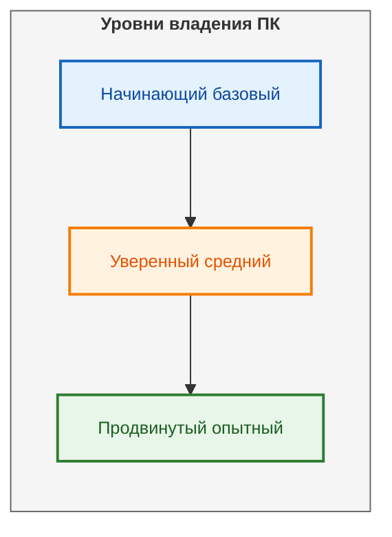

# Программное обеспечение для продвинутых пользователей

<div class="article-tags">
  <span class="tag tag-required">ОБЯЗАТЕЛЬНО</span>
  <span class="tag tag-beginner">ДЛЯ НОВИЧКОВ</span>
</div>

<span class="complexity-badge">Всем</span>

<div class="callout callout--tip">
  <div class="callout-title">Внимание! Легкотня</div>
  Скорее всего, вы уже знакомы со всем, что здесь перечислено, и вряд ли подчеркнёте для себя что-то новое. Но если найдёте новинки – значит, читали не зря!
</div>


## Программное обеспечение для продвинутых пользователей


Продвинутые пользователи, разработчики, системные администраторы и IT-специалисты используют узкоспециализированные программы для работы. Мы разберём мощные инструменты для управления системой, разработки, анализа данных и автоматизации. Продвинутыми пользователями можно считать тех, кто не просто использует компьютер для повседневных задач, таких как просмотр сайтов или работа с документами, но и активно применяет специализированные инструменты для выполнения сложных операций. 

Их задачи варьируются от написания кода и управления серверами до создания 3D-моделей, автоматизации бизнес-процессов и защиты данных. 

Чтобы решать эти задачи, им нужны мощные программы, которые предлагают больше контроля, гибкости и функциональности, чем стандартный софт.

**Продвинутый пользователь** — это человек, владеющий компьютерными технологиями на высоком уровне, способный самостоятельно диагностировать проблемы, устанавливать программное обеспечение с пониманием последствий, настраивать систему под специфические нужды и объяснять технические процессы другим пользователям.

---

## Уровни владения персональным компьютером

Уровень компьютерной грамотности определяет способность человека работать с операционной системой, офисными программами, интернетом и техническими инструментами. Классификация позволяет оценить компетенции и определить направление развития навыков.



### Начинающий (базовый) уровень

Начинающий пользователь обладает минимальным набором компетенций для работы с компьютером. Основные навыки включают включение и выключение устройства, работу с файловой системой на поверхностном уровне, использование базовых функций интернета.

| Навык | Описание |
|-------|----------|
| Включение компьютера | Нажатие кнопки питания, ожидание загрузки |
| Работа с файлами | Копирование, перемещение файлов между папками |
| Создание документов | Набор текста в текстовом редакторе |
| Поиск информации | Использование поисковой строки браузера |
| Почтовые клиенты | Отправка и получение писем |

Развитие начинается с освоения этих операций до автоматизма. Переход к следующему уровню требует понимания принципов работы операционной системы.

### Уверенный (средний) уровень

Уверенный пользователь работает с офисными пакетами на расширенном уровне, настраивает параметры программ под личные потребности, использует архиваторы и почтовые клиенты. Способность находить и устанавливать драйверы и программное обеспечение присутствует в арсенале.

| Навык | Описание |
|-------|----------|
| MS Office Excel | Табличные данные, простые формулы, сортировка |
| MS Office Word | Форматирование, оглавление, стили |
| Архивация | Создание распакованных ZIP/RAR архивов |
| Драйверы | Поиск установка по идентификатору оборудования |
| Базовая безопасность | Антивирусы, брандмауэры, обновления системы |

Переход от уверенного к продвинутому уровню подразумевает понимание внутренней логики операционной системы и возможность самостоятельного решения технических проблем.

### Продвинутый (опытный) уровень

Продвинутый пользователь владеет макросами в Excel, профессиональным графическим и видеоредактированием, настройкой операционной системы на глубоком уровне. Диагностика и устранение аппаратных неисправностей выполняется силами пользователя.

| Навык | Описание |
|-------|----------|
| MS Office Excel | Сводные таблицы, сложные формулы, Power Query |
| MS Office Word | Стили, автоматические оглавления, шаблоны |
| Аппаратная часть | Замена комплектующих, сборка ПК |
| Системные проблемы | Анализ событий, работа с диспетчером задач |
| Операционная система | Установка, обновление, резервное копирование |

Субъективность определений обусловлена восприятием технологий разными людьми. Регламентация уровней происходит через общественное мнение и практические требования рынка труда.

---

## Определение продвинутого пользователя

Продвинутый пользователь характеризуется способностью работать с техническими параметрами системы без внешних подсказок. Понятие включает множество аспектов: от умения корректно установить программное обеспечение до понимания принципов работы сетевого взаимодействия.

Продвинутый пользователь выполняет действия, которые вызывают затруднения у менее опытных коллег:

1. Устанавливает программное обеспечение без установки в директорию по умолчанию;
2. Извлекает почтовые базы из локальных хранилищ;
3. Находит файлы по маске поиска;
4. Производит физическую замену видеокарты и жёсткого диска;
5. Объясняет технические термины неспециалистам;
6. Самостоятельно ориентируется в поставленной цели без детализации.

Это субъективные понятия которые ничем кроме восприятия людей не регламентированы. Конкретные навыки зависят от сферы деятельности и требований рабочей среды.

---

## Установка драйверов

Драйвер представляет собой программное обеспечение которое управляет конкретным устройством внутри компьютера. Без правильного драйвера оборудование функционирует в базовом режиме либо не работает вовсе.

Методы установки драйверов классифицируются следующим образом:

| Метод | Описание | Преимущества | Недостатки |
|-------|----------|--------------|------------|
| Автоматический поиск | Система определяет устройство и скачивает драйвер | Простота использования | Возможность установки неподходящей версии |
| Ручная установка | Пользователь выбирает драйвер вручную | Контроль над версией | Требует знаний параметров устройства |
| Центр обновлений | Официальные обновления ОС | Безопасность и надёжность | Задержки актуальности драйверов |
| Сайт производителя | Скачивание с сайта вендора | Актуальные версии | Потребность идентификации модели |

### Процесс ручной установки

Алгоритм установки драйверов вручную включает следующие этапы:

1. Открытие диспетчера устройств через управление компьютером;
2. Идентификация неизвестного устройства по коду оборудования;
3. Поиск драйвера через сайты производителей компонентов;
4. Скачивание соответствующей версии для операционной системы;
5. Установка через мастер установки или командную строку;
6. Перезагрузка системы для применения изменений.

Командная строка PowerShell предоставляет альтернативные методы установки:

```powershell
Get-PnpDevice -PresentOnly | Format-Table DeviceID, FriendlyName, Status
```

Эта команда отображает статус всех подключённых устройств и помогает идентифицировать проблемные компоненты.

---

## Настройка принтеров

Подключение печатающего устройства требует выполнения серии последовательных действий для корректного распознавания системой.

### Типы подключения

| Тип соединения | Описание | Применение |
|----------------|----------|------------|
| USB | Прямое подключение кабелем | Домашнее использование |
| Wi-Fi | Беспроводное соединение | Офисные сети |
| Ethernet | Проводная сеть | Корпоративные среды |
| Bluetooth | Низкоскоростное беспроводное | Мобильная печать |

### Алгоритм настройки

Настройка принтера начинается с физического подключения. После этого необходимо установить драйвер через центр оборудования или сайт производителя.

Панель управления Windows предоставляет дополнительные опции конфигурации:

```
Панель управления > Оборудование и звук > Устройства и принтеры
```

Расширенные свойства позволяют настроить очереди печати, общие ресурсы и параметры безопасности. Параметр приоритета определяет порядок обработки заданий при множественных задачах.

---

## Устранение неполадок

Система диагностики включает анализ критических событий для определения первопричины ошибки.

### Синий экран смерти (BSOD)

Критическая ошибка системы приводит к принудительному завершению работы с отображением информационного сообщения.

Причины возникновения:

| Причина | Решение |
|---------|---------|
| Повреждение драйверов | Обновление драйверов оборудования |
| Неисправность памяти | Тестирование оперативной памяти |
| Перегрев процессора | Проверка системы охлаждения |
| Проблемы диска | Дефрагментация и проверка целостности |

Команда проверки состояния системы:

```cmd
sfc /scannow
```

Команда проверяет системные файлы и восстанавливает повреждённые копии.

### Зависание браузера

Зависание означает прекращение реакции программы на действия пользователя.

| Действие | Результат |
|----------|-----------|
| Диспетчер задач Alt+Ctrl+Del | Принудительное закрытие процесса |
| Очистка кэша | Восстановление производительности |
| Отключение расширений | Выявление конфликтующего дополнения |

Очистка кэша выполняется через настройки конфиденциальности или комбинацией Ctrl+Shift+Delete.

### Отсутствие доступа к сети

Диагностика сетевых проблем начинается с тестирования подключения.

```cmd
ping 8.8.8.8
ipconfig /all
tracert google.com
```

Первая команда проверяет доступность внешней сети, вторая отображает параметры адаптера, третья показывает маршрут пакетов.

Команда сброса сетевой конфигурации:

```cmd
netsh winsock reset
netsh int ip reset
```

Выполнение перезагрузки после сброса активирует изменения конфигурации.

---

## Горячие клавиши и работа без мыши

Производительность работы повышается при использовании сочетаний клавиш вместо манипуляторов.

### Основы навигации

| Комбинация | Действие |
|------------|----------|
| Win+E | Открыть проводник |
| Win+D | Показать рабочий стол |
| Alt+Tab | Переключение окон |
| Win+L | Блокировка системы |
| Ctrl+Shift+Esc | Диспетчер задач |
| Alt+F4 | Закрытие активного окна |

### Управление окнами

| Комбинация | Действие |
|------------|----------|
| Win+← | Прижать окно влево |
| Win+→ | Прижать окно вправо |
| Win+↑ | Развернуть окно |
| Win+↓ | Свернуть окно |
| Win+M | Свернуть все окна |

### Рабочие процессы

| Комбинация | Действие |
|------------|----------|
| Ctrl+C | Копировать |
| Ctrl+V | Вставить |
| Ctrl+X | Вырезать |
| Ctrl+Z | Отменить действие |
| Ctrl+S | Сохранить документ |
| Ctrl+F | Найти текст |

Специализированные клавиши увеличивают скорость выполнения рутинных операций.

---

## Офисные пакеты Microsoft

Microsoft Office представляет комплекс программных решений для офисной работы.

### MS Excel сводные таблицы

Сводная таблица агрегирует большие объёмы данных в компактном формате.

Шаги создания:

1. Выделение диапазона исходных данных;
2. Выбор вставки сводной таблицы через меню;
3. Назначение областей строк столбцов значений фильтров;
4. Настройка форматирования числовых показателей.

Функциональные возможности включают группировку периодов фильтрацию по нескольким критериям визуализацию через диаграммы.

### Сложные формулы Excel

Структурные элементы формул определяют логику вычислений:

| Тип | Пример | Применение |
|-----|--------|------------|
| Текстовая | =CONCATENATE(A1;" ";B1) | Объединение ячеек |
| Логическая | =IF(A1>5;"Да";"Нет") | Условные значения |
| Математическая | =SUM(A1:A10) | Суммирование |
| Поисковая | =VLOOKUP(...) | Поиск по таблице |
| Дата | =TODAY() Текущая дата | |

### MS Office Word стили оглавление

Стили обеспечивают единый внешний вид документа.

| Стиль | Назначение |
|-------|------------|
| Заголовок 1 | Основные разделы |
| Заголовок 2 | Подразделы |
| Заголовок 3 | Вложенные пункты |
| Обычный | Основной текст |

Автоматическое оглавление создаётся через вставку ссылки на список заголовков. Обновление производится одной кнопкой при изменении структуры документа.

---

## Графические и видеоредакторы

Инструменты редактирования изображений и видео предоставляют широкие возможности обработки цифрового контента.

### Графические редакторы

| Программа | Основная функция | Уровень сложности |
|-----------|------------------|-------------------|
| Adobe Photoshop | Растровая графика | Профессиональный |
| GIMP | Альтернатива Photoshop | Средний |
| Inkscape | Векторная графика | Средний |
| Canva | Онлайн дизайн | Начальный |

### Видеоредакторы

| Программа | Особенности | Область применения |
|-----------|-------------|--------------------|
| Adobe Premiere Pro | Полный контроль монтажа | Профессиональный монтаж |
| DaVinci Resolve | Цветокоррекция | Кинопроизводство |
| Shotcut | Открытый код | Любительское видео |
| Camtasia | Запись экрана | Обучающие материалы |

Функциональные блоки включают наложение эффектов цветокоррекцию анимацию переходы экспорт в различные форматы.

---

## Принципы безопасности в интернете

Безопасность в сети требует соблюдения правил защиты личной информации и системных ресурсов.

### Рекомендации безопасности

| Правило | Описание |
|---------|----------|
| Сложные пароли | Минимум 12 символов с символами |
| Двухфакторная аутентификация | Дополнительный подтверждение входа |
| Регулярные обновления | Патчи операционной системы |
| Резервное копирование | Хранение копий данных |
| Антивирусная защита | Сканирование входящих файлов |

Протокол HTTPS шифрует передаваемые данные между браузером и сервером. Наличие замка в адресной строке указывает на защищённое соединение.

### Опасные практики

| Практика | Риски | Альтернатива |
|----------|-------|--------------|
| Сохранение паролей | Утечка при взломе | Менеджер паролей |
| Открытые Wi-Fi сети | Перехват трафика | VPN подключение |
| Неизвестные вложения | Вирусное заражение | Сканирование перед открытием |
| Одобрение всех куки | Трекинг поведения | Выборочное согласие |

---

## Работа с архиваторами

Архиваторы объединяют несколько файлов в один контейнер для удобства передачи и хранения.

### Популярные форматы

| Формат | Расширение | Особенности |
|--------|------------|-------------|
| ZIP | .zip | Универсальная совместимость |
| RAR | .rar | Высокая степень сжатия |
| 7z | .7z | Максимальное сжатие |
| TAR | .tar + gzip | Стандарт Linux |

### Настройки архивации

| Параметр | Описание |
|----------|----------|
| Степень сжатия | Оптимальное соотношение времени и размера |
| Размер тома | Разделение на части заданного объёма |
| Пароль | Защита от несанкционированного доступа |
| Восстановление | Добавление контрольных записей для повреждений |

Архивация больших файлов выполняется в разбивку на части для повышения устойчивости к повреждениям носителей.

---

## Конвертация файлов

Конвертация преобразует файлы одного формата в другой без потери функциональности.

### Категории конвертации

| Категория | Примеры | Инструменты |
|-----------|---------|-------------|
| Документы | PDF TXT RTF | LibreOffice |
| Графика | JPG PNG WEBP | XnView |
| Видео | MP4 AVI MKV | HandBrake |
| Звук | MP3 WAV FLAC | Audacity |
| Текстовые | DOC DOCX ODT | OpenOffice |

### Процессы конвертации

1. Выбор исходного файла;
2. Выбор целевого формата;
3. Настройка параметров качества;
4. Выполнение преобразования;
5. Проверка результата.

Современные инструменты поддерживают пакетную обработку множества файлов одновременно.

---

## Настройка удалённого доступа

Удалённый доступ позволяет управлять компьютером из другого местоположения.

### Методы организации

| Технология | Принцип работы | Безопасность |
|------------|----------------|--------------|
| RDP | Протокол удалённого рабочего стола | Высокая при настройке |
| SSH | Защищённая оболочка | Очень высокая |
| TeamViewer | Сервис облачного доступа | Средняя |
| AnyDesk | Быстрые соединения | Средняя |
| Chrome Remote Desktop | Браузерная интеграция | Средняя |

### Настройка RDP в Windows

```
Система > Параметры > Удалённый рабочий стол
```

Требуется включение удалённого доступа и настройка пользователей с правами администратора.

Параметры сети требуют пропускания порта 3389 через брандмауэр.

---

## Переустановка Windows создание загрузочной флешки

Регистрация операционной системы требует подготовки установочного носителя.

### Подготовка флешки

| Шаг | Действие |
|-----|----------|
| 1 | Выбор флешки минимум 8 Гб |
| 2 | Скачивание образа Windows с официального источника |
| 3 | Использование Media Creation Tool |
| 4 | Запись образа на носитель |
| 5 | Проверка готовности к загрузке |

### Настройка BIOS/UEFI

BIOS управляет низкоуровневыми операциями загрузки системы.

| Параметр | Значение |
|----------|----------|
| Boot Priority | Установочный носитель первым |
| Secure Boot | Включено для современных систем |
| Legacy Support | Отключено для UEFI режимов |
| SATA Mode | AHCI для SSD/HDD |

Комбинация клавиш входа обычно F2 DEL F10 Esc при запуске компьютера.

---

## Сравнение уровней владения компьютером

Обобщённая таблица демонстрирует различия между уровнями компетенций.

| Навык | Начинающий | Уверенный | Продвинутый |
|-------|------------|-----------|-------------|
| Установка программ | Только установка | Выбор директории | Понимание зависимостей |
| Офисные пакеты | Текст таблиц | Формулы стили | Макросы сводные таблицы |
| Интернет | Просмотр сайтов | Поиск архивация | Безопасность настройки |
| Железо | Включение/выключение | Замена флешек | Замена комплектующих |
| Сеть | Wi-Fi подключение | Общий доступ | Маршрутизация DNS |
| Ошибки | Сообщение об ошибке | Перезагрузка | Диагностика логирование |

---
