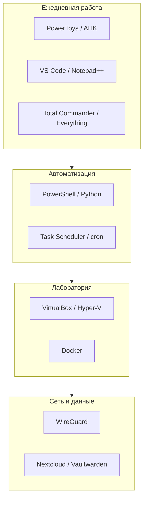

---
tags:
  - all
  - required
title: Софт продвинутого пользователя — обзор
description: >-
  Какие программы формируют стек power user, как они связаны с автоматизацией,
  Home Lab и разработкой — без повторения базовых навыков новичка.
related:
  - title: Путь продвинутого
    doc: encyclopedia/1-basics/1-14-sovety-dlya-prodvinutogo/1
  - title: Автоматизация
    doc: encyclopedia/1-basics/1-13-soft-prodvinutogo-polzovatelya/6
  - title: PowerToys
    doc: encyclopedia/1-basics/1-13-soft-prodvinutogo-polzovatelya/9
---

import ArchiveUtilitySimulator from '@site/src/components/ArchiveUtilitySimulator.jsx';

# Софт продвинутого пользователя — обзор

<div class="article-tags">
  <span class="tag tag-required">ОБЯЗАТЕЛЬНО</span>
</div>

<span class="complexity-badge">Опытному пользователю</span>

<div class="callout callout--tip">
  <div class="callout-title">Не дублируем "новичка"</div>

  <div class="callout-body">
  Установка принтеров, сводные таблицы Excel и "как скачать с официального сайта" — в <a href="/encyclopedia/1-basics/1-11-soft-ryadovogo-polzovatelya/intro">софте рядового пользователя</a> и <a href="/encyclopedia/1-basics/1-12-sovety-dlya-novichka/intro">советах для новичка</a>. Здесь — инструменты, которые дают <strong>контроль</strong> над системой и данными.
</div>
  </div>


---

## Кто такой продвинутый пользователь в контексте софта

**Power user** выбирает программы не по рекламе, а по **сценарию**:

- быстро найти и переместить тысячи файлов;
- править конфиги и скрипты в нормальном редакторе;
- поднять сервис в Docker на старом ПК;
- понять, кто съел CPU, без "оптимизатора" из интернета.

Это не обязательно разработчик, но стек пересекается с [терминалом](/encyclopedia/2-system-network/2-05-terminal/intro), [администрированием](/encyclopedia/2-system-network/2-06-sistemnoe-administrirovanie/intro) и при желании — [разработкой](/encyclopedia/4-code-dev/code-dev).

---

## Слои программного стека



| Слой | Примеры | Глава |
| :--- | :--- | :--- |
| Ускорение Windows | [PowerToys](/encyclopedia/1-basics/1-13-soft-prodvinutogo-polzovatelya/9), AutoHotkey | [9](/encyclopedia/1-basics/1-13-soft-prodvinutogo-polzovatelya/9), [6](/encyclopedia/1-basics/1-13-soft-prodvinutogo-polzovatelya/6) |
| Файлы | Total Commander, 7-Zip, Everything | [2](/encyclopedia/1-basics/1-13-soft-prodvinutogo-polzovatelya/2) |
| Код и конфиги | VS Code, Vim, Notepad++ | [3](/encyclopedia/1-basics/1-13-soft-prodvinutogo-polzovatelya/3) |
| Виртуализация | VirtualBox, WSL, Proxmox | [8](/encyclopedia/1-basics/1-13-soft-prodvinutogo-polzovatelya/8) |
| Сеть | Wireshark, PuTTY, WinMTR | [5](/encyclopedia/1-basics/1-13-soft-prodvinutogo-polzovatelya/5) |
| Безопасность | Sysinternals, VeraCrypt | [7](/encyclopedia/1-basics/1-13-soft-prodvinutogo-polzovatelya/7) |

Зачем каждый слой в жизни — в [советах 1.14](/encyclopedia/1-basics/1-14-sovety-dlya-prodvinutogo/intro).

---

## Минимальный набор "с первого дня"

1. **[Microsoft PowerToys](https://learn.microsoft.com/windows/powertoys/)** — Run, FancyZones, переименование ([подробнее](/encyclopedia/1-basics/1-13-soft-prodvinutogo-polzovatelya/9)).
2. **Everything** (Windows) — поиск файла по имени быстрее проводника.
3. **7-Zip** — архивы; симулятор форматов: ниже.
4. **Visual Studio Code** — конфиги, Markdown, скрипты, Remote-SSH к Home Lab.
5. **Windows Terminal** + **PowerShell 7** — [экосистема PS](/encyclopedia/5-languages/5-26-powershell/intro).
6. **VirtualBox** или **Hyper-V** — [эксперименты в ВМ](/encyclopedia/1-basics/1-14-sovety-dlya-prodvinutogo/3).
7. **Менеджер паролей** (Bitwarden + при желании свой [Vaultwarden](/encyclopedia/1-basics/1-14-sovety-dlya-prodvinutogo/4)).

Остальное — по задаче: Blender для 3D, Wireshark для сети, AutoHotkey для макросов.

<ArchiveUtilitySimulator />

---

## Свободное ПО и portable

Продвинутый пользователь часто предпочитает:

- **open source** — прозрачность, перенос на Linux-сервер;
- **portable**-сборки — не засорять реестр на тестовой машине;
- **winget / choco** — воспроизводимая установка (`winget install Microsoft.PowerToys`).

Платные программы (Total Commander, Beyond Compare) оправданы, если окупаются часами каждую неделю.

---

## Связь с языками и скриптами

| Язык | Роль в стеке | Раздел |
| :--- | :--- | :--- |
| PowerShell | Windows, AD, Azure | [5.26 PowerShell](/encyclopedia/5-languages/5-26-powershell/intro) |
| Python | Универсальная автоматизация | [5.02 Python](/encyclopedia/5-languages/5-02-python/intro) |
| Bash | Linux, WSL, серверы | [5.25 Bash](/encyclopedia/5-languages/5-25-bash/intro) · [однострочники (Lab)](/lab/Примеры/1151) |

Софт без скриптов — только половина power user; см. [Скрипты и автоматизация](/encyclopedia/1-basics/1-14-sovety-dlya-prodvinutogo/2).

---

## Как расширять стек без хаоса

1. Одна новая программа в месяц, с **конкретной задачей**.
2. Удалять дубликаты (три архиватора, два "чистильщика").
3. Хранить список установленного в Git или `winget export`.
4. Для экспериментов — отдельная [ВМ](/encyclopedia/1-basics/1-13-soft-prodvinutogo-polzovatelya/8), не рабочая система.

---

## Профили стека под роль

### "Офис + автоматизация"

PowerToys, Everything, VS Code, PowerShell 7, 7-Zip, Bitwarden. Без тяжёлого Adobe и без Proxmox — достаточно WSL.

---

### "Игры + стрим"

OBS, ShareX, MSI Afterburner, Discord (оверлей по желанию), Process Explorer. Лаунчеры — не в автозагрузке. См. [игры](/encyclopedia/1-basics/1-14-sovety-dlya-prodvinutogo/7).

---

### "Home Lab энтузиаст"

Docker, PuTTY, Wireshark, VirtualBox на рабочем ПК + Debian/Proxmox на железе. Vaultwarden, Nextcloud — в [советах](/encyclopedia/1-basics/1-14-sovety-dlya-prodvinutogo/4).

---

### "Путь в разработку"

VS Code, Git, Windows Terminal, WSL, Docker Desktop, Postman/curl. Языки — [5-languages](/encyclopedia/5-languages/5-02-python/intro).

---

## Portable и второй диск

Папка `D:\Portable\` с подкаталогами:

```
Portable/
  Everything/
  VSCodePortable/   # если нужно
  Sysinternals/
  Scripts/          # .ps1, .ahk
```

Не смешивайте portable с "установкой в Program Files" одной и той же программы — дубликаты в PATH путают.

---

## Лицензии — что помнить

| Тип | Пример | Ограничение |
| :--- | :--- | :--- |
| FOSS | 7-Zip, GIMP, VS Code | Лицензия MIT/GPL |
| Personal free | VMware Workstation Player | Только личное использование |
| Подписка | Adobe, Office 365 | Ежемесячный платёж |
| Shareware | Total Commander | Пробный период |

Продвинутый пользователь **читает EULA** для корпоративного ноутбука — часто запрещены VM, торренты, сторонние драйверы.

Дальше — по категориям в оглавлении раздела или по [дорожной карте советов](/encyclopedia/1-basics/1-14-sovety-dlya-prodvinutogo/1).

---

## Под капотом — как слои стека стыкуются

Power user не ставит "всё подряд" — инструменты образуют **цепочки**:

| Сценарий | Цепочка |
|----------|---------|
| Найти конфиг | Everything → путь → VS Code |
| Бэкап проекта | Total Commander / `robocopy` → 7-Zip → внешний диск |
| Проверить сервис | Docker на ПК → `curl` health → логи в VS Code |
| Диагностика тормозов | Process Explorer → Procmon → отключить автозагрузку |

**winget** качает установщик, пишет в `Program Files`, регистрирует uninstall в реестре. **Portable** — один каталог, PATH добавляете вручную или через `.bat`; обновление — замена папки.

**Windows Terminal** — хост вкладок; внутри — PowerShell 7 (кроссплатформенный .NET) или WSL (вызов Linux-ядра). См. [терминал](/encyclopedia/2-system-network/2-05-terminal/intro).

---

## Опыт, мнение и истории

**Первый "боевой" набор.** На новом ноутбуке за вечер: winget установил Terminal, Everything, 7-Zip, VS Code, PowerToys — без "твикеров" из YouTube. Через месяц только PowerToys Run и FancyZones остались в ежедневном использовании; остальное — по запросу.

**Дубликаты.** Поставил 7-Zip и WinRAR — оба перехватывали контекстное меню. Оставил один архиватор — меньше шума в ПКМ.

**Portable на флешке.** Sysinternals и скрипты на USB спасали на чужом ПК без прав админа — `procexp.exe` и `handle.exe` для "кто держит файл".

**Мнение.** Продвинутый софт — про **привычку и сценарий**, не про длинный список в автозагрузке. Лучше освоить пять инструментов глубоко, чем двадцать иконок в трее.

---
