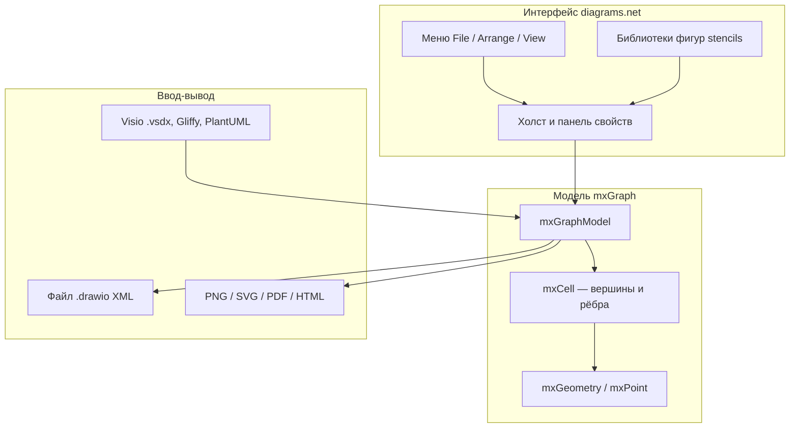

---
tags:
  - all
  - reference
  - analytic
  - engineer
  - architector
title: diagrams.net (Draw.io) — устройство и формат .drawio
description: >-
  Архитектура diagrams.net, работа в редакторе, полный разбор XML-формата
  mxfile/mxGraphModel/mxCell/mxGeometry и справочник тегов и атрибутов.
sidebar_label: Draw.io и формат .drawio
referenceType: tool
related:
  - title: Графика и схемы (обзор)
    doc: encyclopedia/1-basics/1-13-soft-prodvinutogo-polzovatelya/4
  - title: Инструменты аналитика
    doc: encyclopedia/7-project/7-04-analitika/126
  - title: Справочник по XML
    doc: encyclopedia/3-data-markup/3-04-konfiguratsii-i-dannye/211
---

import ExternalPlayEmbed from '@site/src/components/ExternalPlayEmbed';


# diagrams.net (Draw.io) — устройство программы и формат `.drawio`

<div class="article-tags">
  <span class="tag tag-reference">СПРАВОЧНИК</span>
</div>

<span class="complexity-badge">Опытному пользователю</span>

<div class="callout callout--tip">
  <div class="callout-title">Обзор в другой главе</div>

  <div class="callout-body">
  diagrams.net упоминается в контексте графики и Visio в главе <a href="/encyclopedia/1-basics/1-13-soft-prodvinutogo-polzovatelya/4">"Графика, дизайн и 3D"</a>. Здесь — архитектура, практика работы и XML-схема файлов.
</div>
  </div>


<ExternalPlayEmbed example="about/schema-maker-play" title="Схемы в браузере" minHeight={560} playProps={{ defaultDocName: 'Архитектура', title: 'Схемы в браузере', subtitle: 'Альтернатива Draw.io для быстрых блок-схем — экспорт PNG/PDF' }} />

---

## Назначение и место в стеке

**diagrams.net** (историческое имя **draw.io**) — бесплатный редактор диаграмм с открытым исходным кодом. Программа строит блок-схемы, сетевые топологии, ER-модели, UML, BPMN, C4, wireframe и сотни других нотаций через библиотеки фигур — см. [когда какую нотацию выбирать](/encyclopedia/7-project/7-04-analitika/1231).

Главное отличие от "рисования в Paint" — диаграмма — это **модель графа** (вершины, рёбра, слои), а не набор пикселей. Файл `.drawio` — текстовый XML, который удобно хранить в Git, сравнивать в diff и генерировать скриптами.

### Живой пример — `it-universe-three-tier.drawio` и `it-universe-architecture.drawio`

В репозитории [it-knowledge-base](https://github.com/Spirzen/it-knowledge-base) лежат две связанные схемы экосистемы в Draw.io:

| Файл | Назначение |
| :--- | :--- |
| `info/it-universe-three-tier.drawio` | **Обзор** — хаб spirzen.ru, code, play и слой интеграции (iframe + postMessage) |
| `info/it-universe-architecture.drawio` | **Полная** — репозитории, сборка, деплой, runtime, assets |

Для статей обе экспортируются в PNG на [assets.spirzen.ru](https://assets.spirzen.ru/) (`it-encyclopedia-media/public/encyclopedia/_shared/img/`). Пересборка полной схемы: `node scripts/generate-architecture-drawio.mjs`, затем экспорт в media-репозиторий. Легенда — [О проекте → архитектура](/about/project#arhitektura-proekta); те же потоки в Mermaid — [экосистема](/about/project#it-universe-c4-mermaid).


| Задача | Почему Draw.io |
| :--- | :--- |
| Техническая документация | Открытый XML, экспорт SVG/PDF |
| Архитектура и интеграции | Библиотеки AWS, Azure, K8s, BPMN |
| Совместная работа | Confluence, Google Drive, GitHub |
| Автоматизация | CLI, REST-подобная структура XML |

---

## Архитектура — из чего состоит программа

Draw.io — **оболочка** вокруг библиотеки **mxGraph** (JavaScript, проект JGraph).



---

### Уровни системы

| Уровень | Компонент | Роль |
| :--- | :--- | :--- |
| Движок графа | **mxGraph** | Модель ячеек, геометрия, маршрутизация рёбер, стили, слои |
| Редактор | **draw.io / diagrams.net** | UI, библиотеки, интеграции, сжатие XML, экспорт |
| Формат | **`.drawio` (mxfile)** | Сериализация модели в XML |
| Расширения | **stencils** | Внешние наборы фигур (`mxgraph.aws4.*`, `mxgraph.bpmn.*` и т.д.) |

**mxCell** — универсальная единица модели — фигура, линия, слой или группа. Роль задаётся атрибутами `vertex`, `edge`, `parent`, а внешний вид — строкой **style** (`ключ=значение;`).

Официальная схема для валидации XML: [mxfile.xsd](https://github.com/jgraph/drawio-mcp/blob/main/shared/mxfile.xsd) и [Style Reference](https://github.com/jgraph/drawio-mcp/blob/main/shared/style-reference.md) (из исходников draw.io). Руководство по генерации диаграмм ИИ: [draw.io FAQ](https://www.drawio.com/doc/faq/ai-drawio-generation.html).

---

## Способы запуска и хранения

| Вариант | Особенности |
| :--- | :--- |
| **Веб** | [app.diagrams.net](https://app.diagrams.net) — без регистрации, файл остаётся у пользователя (Device, Google Drive, OneDrive, GitHub…) |
| **Desktop** | Electron-приложение, офлайн, тот же UI |
| **VS Code** | Расширение *Draw.io Integration* — правка `.drawio` в IDE |
| **Confluence / Jira** | Плагин: диаграмма как вложение или макрос |
| **Встраивание** | *Extras → Embed* — HTML/iframe для wiki |
| **CLI** | `drawio --export` для CI/CD документации |

Атрибут `host` в корне `mxfile` фиксирует, где файл последний раз сохраняли (`app.diagrams.net`, `Electron`, `VS Code` и т.д.). Атрибут `type` указывает бэкенд хранения (`device`, `google`, `github`…).

---

## Интерфейс и рабочий процесс

```
╔══════════════════════════════════════════════════════════════╗
║ File  Edit  View  Arrange  Extras  Help                     ║
╠══════════════════════════════════════════════════════════════╣
║ [панель инструментов: зум, сетка, соединение, стили]        ║
╠═══════════════════════════╦══════════════════════════════════╣
║  Библиотеки (Shapes)       ║  Холст (страница / слой)        ║
║  ─────────────────         ║                                 ║
║  General, Arrows, UML…     ║   ┌──────┐                      ║
║  + More Shapes…            ║   │      │──────►               ║
║                            ║   └──────┘                      ║
╠═══════════════════════════╩══════════════════════════════════╣
║  Format Panel (справа): заливка, шрифт, линии, текст          ║
╚══════════════════════════════════════════════════════════════╝
```

---

### Типовой сценарий

1. **File → New** — шаблон (Blank, Flowchart, UML, ER, Network…).
2. Перетащить фигуры с панели **Shapes**; связать через режим **Connection** (или перетаскиванием от синей точки).
3. Двойной клик — подпись (`value` ячейки); при `html=1` в style допустим простой HTML.
4. **Arrange** — выравнивание, порядок Z, группировка (`Ctrl+G`), слои (*Layers*).
5. **File → Save as** — `.drawio`; экспорт растра/вектора отдельно.

---

### Организация сложных схем

| Механизм | В модели XML | Применение |
| :--- | :--- | :--- |
| **Layer** | `mxCell` с `parent="0"`, без `vertex`/`edge` | Видимость черновика, фон, "слой сети" |
| **Group** | `style` содержит `group;`, дочерние `parent` = id группы | Перемещение блока целиком |
| **Swimlane** | `shape=swimlane`, `startSize` | BPMN, разделение по ролям |
| **Container** | `container=1` в style | Вложенные фигуры внутри рамки |

---

## Форматы файлов

| Расширение | Содержимое |
| :--- | :--- |
| `.drawio` | XML с корнем `<mxfile>` (рекомендуется для Git) |
| `.drawio.xml` | То же, явное расширение XML |
| `.png` / `.svg` / `.pdf` | Экспорт; в PNG/SVG может быть встроен исходный XML |
| `.vsdx` | Импорт Visio (конвертация в mxGraph при открытии) |

---

### Полный и упрощённый XML

**Полный формат** (обязателен при сохранении файла на диск):

```xml
<?xml version="1.0" encoding="UTF-8"?>
<mxfile host="app.diagrams.net" modified="2026-05-25T12:00:00.000Z"
        agent="IT Universe" version="24.0.0" type="device">
  <diagram id="page-1" name="Страница-1">
    <mxGraphModel dx="1200" dy="800" grid="1" gridSize="10" guides="1"
                  tooltips="1" connect="1" arrows="1" fold="1"
                  page="1" pageScale="1" pageWidth="1169" pageHeight="827"
                  math="0" shadow="0">
      <root>
        <mxCell id="0"/>
        <mxCell id="1" parent="0"/>
        <!-- элементы диаграммы -->
      </root>
    </mxGraphModel>
  </diagram>
</mxfile>
```

**Упрощённый фрагмент** — только `<mxGraphModel>…</mxGraphModel>`: draw.io принимает при вставке из буфера; при сохранении обёртку `mxfile`/`diagram` добавляет сам редактор.

---

### Сжатый формат (`compressed="true"`)

Если у `<mxfile>` стоит `compressed="true"`, содержимое `<diagram>` — **не XML**, а строка **Deflate + Base64** (внутри та же модель mxGraph). Редактор сжимает большие диаграммы; для ручного diff и генерации скриптами используйте **несжатый** XML (*File → Properties → снять сжатие* или не включать compression при экспорте).

---

## Иерархия XML — дерево тегов

```
mxfile
└── diagram [id, name]
    └── mxGraphModel [атрибуты холста]
        └── root
            ├── mxCell id="0"                    ← корень модели (обязателен)
            ├── mxCell id="1" parent="0"         ← слой по умолчанию (обязателен)
            ├── mxCell vertex="1" …              ← фигуры
            ├── mxCell edge="1" source target …  ← связи
            │       └── mxGeometry
            │           ├── mxPoint [as=sourcePoint|targetPoint|offset]
            │           ├── Array [as=points] → mxPoint × N
            │           └── mxRectangle [as=alternateBounds]
            ├── UserObject / object              ← метаданные (ссылки, теги)
            └── … дополнительные слои (parent="0")
```

**Критические правила** (иначе файл пустой или битый):

1. Первые две ячейки в `<root>`: `id="0"` (без `parent`) и `id="1"` `parent="0"`.
2. Все видимые элементы: `parent="1"` или id группы/слоя.
3. Уникальные `id` в пределах страницы.
4. Фигура: `vertex="1"`; связь: `edge="1"` (взаимоисключающие).
5. Координаты — начало **(0,0)** — левый верхний угол страницы, X вправо, Y вниз.

---

## Справочник элементов и атрибутов

### `<mxfile>` — корень файла

| Атрибут | Тип | Описание |
| :--- | :--- | :--- |
| `host` | string | Идентификатор приложения (`app.diagrams.net`, `Electron`…) |
| `modified` | ISO 8601 | Время последнего изменения |
| `agent` | string | Клиент/инструмент, создавший файл |
| `version` | string | Версия draw.io |
| `etag` | string | Тег для синхронизации с облаком |
| `type` | string | Бэкенд: `device`, `google`, `dropbox`, `github`, `browser`… |
| `compressed` | `true`/`false` | Сжатое содержимое diagram |
| `pages` | number | Число страниц (информационно) |

Дочерние элементы: один или несколько `<diagram>`.

---

### `<diagram>` — страница

| Атрибут | Описание |
| :--- | :--- |
| `id` | Уникальный id страницы в файле |
| `name` | Имя на вкладке ("Page-1", "Архитектура") |

Содержимое: либо элемент `<mxGraphModel>`, либо сжатая строка (при `compressed="true"`).

---

### `<mxGraphModel>` — модель холста

| Атрибут | По умолч. | Описание |
| :--- | :---: | :--- |
| `dx`, `dy` | 0 | Смещение прокрутки холста (px) |
| `grid` | 1 | Показ сетки |
| `gridSize` | 10 | Шаг сетки (px) |
| `guides` | 1 | Направляющие при перетаскивании |
| `tooltips` | 1 | Подсказки при наведении |
| `connect` | 1 | Ручки соединения |
| `arrows` | 1 | Стрелки направления на рёбрах |
| `fold` | 1 | Сворачивание контейнеров |
| `page` | 1 | Границы страницы |
| `pageScale` | 1 | Масштаб страницы |
| `pageWidth` | 850–1169 | Ширина страницы (px) |
| `pageHeight` | 827–1169 | Высота страницы (px) |
| `math` | 0 | MathJax в подписях |
| `shadow` | 0 | Тень по умолчанию для фигур |
| `background` | — | Цвет фона (`#FFFFFF`, `none`) |
| `backgroundImage` | JSON | Фон-картинка: `{"src":"…","width":…,"height":…}` |
| `adaptiveColors` | — | `auto`, `simple`, `none` — адаптация к тёмной теме |

Единственный дочерний элемент: `<root>`.

---

### `<root>` — контейнер всех ячеек

Не имеет атрибутов. Содержит только `<mxCell>` и обёртки `<UserObject>` / `<object>`.

---

### `<mxCell>` — ячейка графа

Универсальный узел модели mxGraph.

| Атрибут | Когда нужен | Описание |
| :--- | :--- | :--- |
| `id` | Почти всегда | Уникальный идентификатор |
| `parent` | Кроме id=0 | Id родителя: `0` — слой, `1` — основной слой, id группы |
| `value` | Опционально | Текст подписи (plain или HTML при `html=1`) |
| `style` | Опционально | Строка стилей `ключ=значение;` |
| `vertex` | Фигуры | `"1"` — вершина (прямоугольник, иконка…) |
| `edge` | Связи | `"1"` — ребро |
| `source` | Рёбра | `id` вершины-источника |
| `target` | Рёбра | `id` вершины-назначения |
| `connectable` | Редко | `0`/`1` — можно ли подключать |
| `visible` | Редко | `0`/`1` — видимость |
| `collapsed` | Контейнеры | `1` — свёрнут |

**Роли ячеек:**

| Роль | Признаки |
| :--- | :--- |
| Корень модели | `id="0"`, нет `parent`, нет vertex/edge |
| Слой | `parent="0"`, нет vertex/edge, часто `value="Layer name"` |
| Вершина | `vertex="1"`, дочерний `<mxGeometry x y width height>` |
| Ребро | `edge="1"`, `source` + `target`, geometry с `relative="1"` |
| Группа | `vertex="1"`, `style` с `group;`, дети с `parent` = id группы |

Дочерний элемент вершины/ребра: `<mxGeometry as="geometry">`.

---

### `<mxGeometry>` — геометрия ячейки

| Атрибут | Вершина | Ребро |
| :--- | :--- | :--- |
| `x` | Левый край (px от родителя) | Позиция вдоль линии (−1…1 при `relative`) |
| `y` | Верхний край | Перпендикулярное смещение подписи (px) |
| `width` | Ширина | — |
| `height` | Высота | — |
| `relative` | `1` внутри группы | **`1` обязателен** для рёбер |
| `as` | **`geometry`** | **`geometry`** |

**Дочерние элементы:**

| Элемент | `as` / назначение |
| :--- | :--- |
| `<mxPoint x="…" y="…" as="sourcePoint"/>` | Начало несвязанного ребра |
| `<mxPoint … as="targetPoint"/>` | Конец несвязанного ребра |
| `<mxPoint … as="offset"/>` | Смещение подписи ребра |
| `<mxPoint x="…" y="…"/>` | Промежуточная точка внутри `<Array as="points">` |
| `<mxRectangle … as="alternateBounds"/>` | Альтернативный размер при collapse swimlane |

Пример вершины:

```xml
<mxCell id="box-2" value="Сервис API"
        style="rounded=1;whiteSpace=wrap;html=1;fillColor=#dae8fc;strokeColor=#6c8ebf;"
        vertex="1" parent="1">
  <mxGeometry x="200" y="120" width="160" height="72" as="geometry"/>
</mxCell>
```

Пример ребра с изломами:

```xml
<mxCell id="edge-3" style="edgeStyle=orthogonalEdgeStyle;rounded=1;endArrow=classic;html=1;"
        edge="1" parent="1" source="box-2" target="box-4">
  <mxGeometry relative="1" as="geometry"/>
</mxCell>
```

Ребро с waypoints:

```xml
<mxCell id="edge-5" edge="1" parent="1" source="a" target="b"
        style="edgeStyle=orthogonalEdgeStyle;html=1;">
  <mxGeometry relative="1" as="geometry">
    <Array as="points">
      <mxPoint x="300" y="200"/>
      <mxPoint x="300" y="350"/>
    </Array>
  </mxGeometry>
</mxCell>
```

---

### `<mxPoint>` — точка на плоскости

| Атрибут | Описание |
| :--- | :--- |
| `x`, `y` | Координаты в пикселях |
| `as` | `sourcePoint`, `targetPoint`, `offset` или отсутствует (waypoint в Array) |

---

### `<Array>` — массив точек

| Атрибут | Значение |
| :--- | :--- |
| `as` | **`points`** — список промежуточных точек маршрута ребра |

Дочерние: только `<mxPoint>` без `as` (абсолютные координаты излома).

---

### `<mxRectangle>` — прямоугольник (alternate bounds)

Используется **внутри** `<mxGeometry>` для сворачиваемых контейнеров:

```xml
<mxGeometry x="40" y="40" width="400" height="300" as="geometry">
  <mxRectangle x="40" y="40" width="40" height="40" as="alternateBounds"/>
</mxGeometry>
```

При `collapsed="1"` отображаются `alternateBounds` вместо полного размера.

---

### `<UserObject>` и `<object>` — метаданные

Обёртка над `<mxCell>` для ссылок, тегов и плейсхолдеров. Вложенный `mxCell` **не дублирует** `id` на верхнем уровне — id задаётся на `UserObject`.

| Атрибут (UserObject) | Описание |
| :--- | :--- |
| `id` | Идентификатор ячейки |
| `label` | Текст (аналог `value`) |
| `link` | URL при клике |
| `tooltip` | Всплывающая подсказка |
| `placeholders` | `1` — подстановка `%field%` в подписи |
| `tags` | Пробел-разделённые теги для фильтрации |

Пример:

```xml
<UserObject id="svc-1" label="Billing" link="https://wiki.example/billing" tooltip="Микросервис оплаты">
  <mxCell style="rounded=1;whiteSpace=wrap;html=1;" vertex="1" parent="1">
    <mxGeometry x="80" y="80" width="120" height="60" as="geometry"/>
  </mxCell>
</UserObject>
```

---

## Строка `style` — как кодируется внешний вид

Формат: **`[имяФигуры;]ключ=значение;ключ2=значение2;`**

- Разделитель пар — **`;`**, без пробелов вокруг `=`.
- Имя фигуры может быть **без знака равенства** в начале: `ellipse;`, `swimlane;`, `shape=umlActor;`.
- Булевы значения: **`0`** и **`1`**, не `true`/`false`.
- Цвета — `#RRGGBB`, `none`, `default`.

---

### Часто используемые ключи

| Ключ | Назначение | Примеры значений |
| :--- | :--- | :--- |
| `shape` | Тип фигуры | `rectangle`, `ellipse`, `cylinder`, `umlActor` |
| `rounded` | Скругление углов | `0`, `1` |
| `fillColor` | Заливка | `#dae8fc`, `none` |
| `strokeColor` | Обводка | `#6c8ebf` |
| `strokeWidth` | Толщина линии | `2` |
| `html` | HTML в подписи | `1` |
| `whiteSpace` | Перенос текста | `wrap` |
| `fontSize` | Размер шрифта | `14` |
| `fontColor` | Цвет текста | `#333333` |
| `align` / `verticalAlign` | Выравнивание | `center`, `middle` |
| `image` | URL картинки | `data:image/png;base64,…` |
| `edgeStyle` | Маршрут ребра | `orthogonalEdgeStyle`, `elbowEdgeStyle` |
| `endArrow` / `startArrow` | Стрелки | `classic`, `open`, `none`, `block` |
| `entryX`, `entryY`, `exitX`, `exitY` | Точки подключения | `0`–`1` (доля стороны) |
| `swimlane` / `startSize` | Дорожка BPMN | `startSize=30` |
| `group` | Группа | `group;` |
| `container` | Контейнер | `container=1` |
| `sketch` | "От руки" | `sketch=1` |

Расширенные фигуры облаков и инфраструктуры: `shape=mxgraph.aws4.ec2;`, `shape=mxgraph.bpmn.task;` — пространство имён библиотеки stencil.

Полные таблицы (стрелки ER, периметры, edge styles): [style-reference.md](https://github.com/jgraph/drawio-mcp/blob/main/shared/style-reference.md).

---

## Многостраничные файлы и слои

**Несколько страниц** — несколько элементов `<diagram>` в одном `<mxfile>`:

```xml
<mxfile>
  <diagram id="arch" name="Архитектура">…</diagram>
  <diagram id="seq" name="Последовательность">…</diagram>
</mxfile>
```

**Дополнительный слой** (не путать со страницей):

```xml
<mxCell id="layer-back" value="Фон" parent="0"/>
<!-- элементы фона: parent="layer-back" -->
```

---

## Полный минимальный пример

```xml
<?xml version="1.0" encoding="UTF-8"?>
<mxfile host="app.diagrams.net" agent="IT Universe" version="24.0.0" type="device">
  <diagram id="demo" name="Демо">
    <mxGraphModel dx="1000" dy="600" grid="1" gridSize="10" guides="1"
                  tooltips="1" connect="1" arrows="1" fold="1"
                  page="1" pageScale="1" pageWidth="1169" pageHeight="827"
                  math="0" shadow="0">
      <root>
        <mxCell id="0"/>
        <mxCell id="1" parent="0"/>
        <mxCell id="start" value="Начало"
                style="ellipse;whiteSpace=wrap;html=1;fillColor=#d5e8d4;strokeColor=#82b366;"
                vertex="1" parent="1">
          <mxGeometry x="120" y="80" width="100" height="60" as="geometry"/>
        </mxCell>
        <mxCell id="proc" value="Обработка"
                style="rounded=1;whiteSpace=wrap;html=1;fillColor=#fff2cc;strokeColor=#d6b656;"
                vertex="1" parent="1">
          <mxGeometry x="120" y="200" width="140" height="70" as="geometry"/>
        </mxCell>
        <mxCell id="e1" style="edgeStyle=orthogonalEdgeStyle;rounded=1;endArrow=classic;html=1;"
                edge="1" parent="1" source="start" target="proc">
          <mxGeometry relative="1" as="geometry"/>
        </mxCell>
      </root>
    </mxGraphModel>
  </diagram>
</mxfile>
```

---

## Git, diff и автоматизация

**Что портит diff:** встроенные изображения (base64 в XML), атрибут `compressed="true"` — в настройках diagrams.net можно отключить сжатие для читаемого `git diff`. Крупные вложения лучше хранить отдельными файлами, а в диаграмме — ссылки.

| Практика | Команда / действие |
| :--- | :--- |
| Хранить исходник | `docs/architecture/system.drawio` |
| Отключить сжатие | Упростить чтение diff |
| Сравнить версии | `git diff path/to/file.drawio` |
| Экспорт в CI | `drawio --export file.drawio --format svg -o out.svg` |
| Пакетный экспорт | Цикл по `*.drawio` в shell |

```bash
drawio --export docs/diagrams/api.drawio --format pdf --output docs/diagrams/api.pdf
```

Встраивание в Confluence: макрос Draw.io ссылается на файл; при обновлении `.drawio` в репозитории диаграмма на wiki обновляется после синхронизации.

---

## Связь с mxGraph API

В коде JavaScript те же сущности доступны программно:

| Класс mxGraph | XML-эквивалент |
| :--- | :--- |
| `mxGraphModel` | `<mxGraphModel>` |
| `mxCell` | `<mxCell>` |
| `mxGeometry` | `<mxGeometry>` |
| `mxPoint` | `<mxPoint>` |

Документация API: [mxCell](https://jgraph.github.io/mxgraph/docs/js-api/files/model/mxCell-js.html), [mxGeometry](https://jgraph.github.io/mxgraph/docs/js-api/files/model/mxGeometry-js.html).

Draw.io не требует писать на mxGraph для обычной работы — достаточно редактора. XML и CLI нужны, когда диаграммы — **часть репозитория документации** или пайплайна сборки.

---

## Сводная таблица тегов

| Тег | Родитель | Назначение |
| :--- | :--- | :--- |
| `mxfile` | — (корень) | Файл диаграммы, метаданные |
| `diagram` | `mxfile` | Страница / вкладка |
| `mxGraphModel` | `diagram` | Параметры холста и корень модели |
| `root` | `mxGraphModel` | Список ячеек |
| `mxCell` | `root`, группы | Вершина, ребро, слой, группа |
| `mxGeometry` | `mxCell` | Позиция и размер |
| `mxPoint` | `mxGeometry`, `Array` | Точка, waypoint, offset |
| `Array` | `mxGeometry` | Массив waypoints (`as="points"`) |
| `mxRectangle` | `mxGeometry` | Alternate bounds контейнера |
| `UserObject` | `root` | Ячейка + ссылка, tooltip, tags |
| `object` | `root` | Альтернативная обёртка (аналогично UserObject) |

---

## Под капотом — цепочка "клик → файл на диске"

В этой главе техническая глубина уже в теле статьи; здесь — **сквозной путь**:

1. **Редактор** (diagrams.net) держит модель в RAM как граф mxGraph.
2. **Сохранение** сериализует граф в XML (`mxfile` → `diagram` → `mxGraphModel` → `mxCell`).
3. **Git** хранит текст; diff показывает сдвиг `mxGeometry x="..."`.
4. **CLI `drawio --export`** поднимает headless-рендер, рисует SVG/PNG из того же XML.
5. **Просмотр** в Confluence/VS Code — либо встроенный рендер, либо экспорт в CI.

Сломать диаграмму проще всего **битым `mxCell id`** или дублем `id` — валидатор по [mxfile.xsd](https://github.com/jgraph/drawio-mcp/blob/main/shared/mxfile.xsd) ловит до коммита.

---

## Опыт, мнение и истории

**Diff в PR.** Коллега сдвинул блок "База данных" на схеме — в Git видно только цифры в `mxGeometry`, смысл — в review по скриншоту экспорта. Привычка: крупные изменения — PNG в комментарий PR.

**Генерация XML нейросетью.** Черновик `.drawio` от ИИ — половина `style` невалидна; быстрее дорисовать в GUI, чем чинить XML руками.

**Документация в репо.** Архитектурные схемы рядом с `README` — onboarding нового разработчика без Visio-лицензии.

**Мнение.** draw.io — стандарт power user для схем, которые живут в Git. Visio остаётся там, где корпорация платит за экосистему Microsoft и сложные BPMN-шаблоны.

---

## Чек-лист самопроверки

- [ ] Понимаю разницу между mxGraph (движок) и diagrams.net (редактор).
- [ ] Умею открыть `.drawio` как XML и найти `mxCell id="0"` и `id="1"`.
- [ ] Могу прочитать `style` фигуры и изменить `fillColor` вручную.
- [ ] Знаю, зачем у ребра `relative="1"` и атрибуты `source`/`target`.
- [ ] Настроил несжатый XML для комфортного `git diff`.
- [ ] Знаю, где взять [mxfile.xsd](https://github.com/jgraph/drawio-mcp/blob/main/shared/mxfile.xsd) для валидации.

---

## См. также

- [Графика и 3D — обзор Visio и diagrams.net](/encyclopedia/1-basics/1-13-soft-prodvinutogo-polzovatelya/4)
- [Инструменты аналитика](/encyclopedia/7-project/7-04-analitika/126)
- [Справочник по XML](/encyclopedia/3-data-markup/3-04-konfiguratsii-i-dannye/211)
- [Официальный FAQ: генерация XML](https://www.drawio.com/doc/faq/ai-drawio-generation.html)
- [Репозиторий draw.io](https://github.com/jgraph/drawio)
