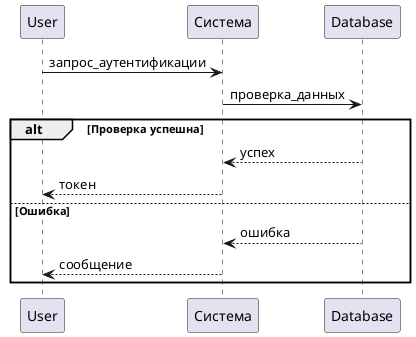

# Графика, дизайн и 3D-моделирование

<div class="article-tags">
  <span class="tag tag-required">ОБЯЗАТЕЛЬНО</span>
  <span class="tag tag-beginner">ДЛЯ НОВИЧКОВ</span>
</div>

<span class="complexity-badge">Всем</span>

## Визуальные инструменты

Современный специалист по информации постоянно создаёт визуальный контент для работы. Документация требует диаграмм. Презентации нуждаются в графических иллюстрациях. Технические инструкции содержат скриншоты с аннотациями. Системные аналитики строят модели процессов и структур данных. Архитекторы проектов создают схемы интеграции. Все эти задачи решаются через специальные программные инструменты.

Продвинутый пользователь владеет набором визуальных инструментов для решения разных типов задач. Правильный выбор программы определяет качество результата, скорость работы и возможность масштабирования процесса.

**Основные категории программного обеспечения:**

| Категория | Назначение | Примеры инструментов | Форматы экспорта |
|-----------|------------|---------------------|------------------|
| Растровая графика | Обработка фотографий, пиксельных изображений | Photoshop, GIMP, Krita | PNG, JPEG, WebP, TIFF |
| Векторная графика | Логотипы, диаграммы, иллюстрации | Illustrator, Inkscape, Figma | SVG, PDF, EPS |
| Схема и моделирование | Блок-схемы, UML, ERD | Visio, diagrams.net | VSDX, XML, SVG, PNG |
| Скриншотеры | Захват и аннотирование экрана | Greenshot, Snagit, ShareX | PNG, BMP, GIF |
| 3D-моделирование | Объёмное моделирование и рендер | Blender, Maya, SketchUp | OBJ, GLTF, FBX, BLEND |
| UI/UX дизайн | Проектирование интерфейсов | Figma, Sketch, Adobe XD | SVG, JSON, PDF |

Каждая категория решает специфическую задачу. Некоторые программы выполняют несколько функций одновременно. Выбор зависит от требований проекта и рабочего процесса команды.

---

## Microsoft Visio

### Описание и назначение

Microsoft Visio — профессиональное приложение для создания блок-схем, диаграмм и схем на операционной системе Windows. Программу используют инженеры, архитекторы, бизнес-аналитики и системные администраторы.

Visio входит в состав подписки Microsoft 365 Enterprise. Отдельная покупка лицензии также доступна. Программа имеет десктопную версию для установки на компьютер.

---

### Интерфейс Visio

Главное окно Visio содержит следующие элементы:

```
┌─────────────────────────────────────────────────────────────────────┐
│ [Файл] [Главная] [Вставка] [Конструктор] [Обозревать]                │
├─────────────────────────────────────────────────────────────────────┤
│ ▓▓▓▓▓▓▓▓▓▓▓▓▓▓▓▓▓▓▓▓▓▓▓▓▓▓▓▓▓▓▓▓▓▓▓▓▓▓▓▓▓▓▓▓▓▓▓▓▓▓▓▓▓▓▓▓▓▓▓▓▓▓▓▓│
│ ░░░░░░░░░░░░░░░░░░░░░░░░░░░░░░░░░░░░░░░░░░░░░░░░░░░░░░░░░░░░░░░░░░│
│   Лист 1 - Холст                                              [+]   │
│ ░░░░░░░░░░░░░░░░░░░░░░░░░░░░░░░░░░░░░░░░░░░░░░░░░░░░░░░░░░░░░░░░░░│
├──────────┬──────────────────────────────────────────┬───────────────┤
│ Фигуры   │                                          │ Свойства      │
│          │                                          │               │
│ ◉ Общие  │              Рабочая область             │ Размер:       │
│ ◉ Диаграммы │                                        │              │
│ ◉ Базы данных │                                       │              │
│ ◉ CAD    │                                            │              │
│ ─────────  │                                            │              │
│ ◉ Серверы │                                            │              │
│ ◉ Процесссы │                                          │              │
└──────────┴──────────────────────────────────────────┴───────────────┘
```

Левая панель содержит библиотеки фигур. Центр — рабочее пространство холста. Правая панель — параметры выбранного объекта.

---

### Работа с фигурами

Библиотеки Visio содержат предварительно подготовленные фигуры для различных областей:

| Библиотека | Тип объектов | Примеры фигур |
|------------|--------------|---------------|
| Основные шаблоны | Базовые формы | Прямоугольник, круг, трапеция |
| Диаграммы | Процессы и потоки | Начало/конец, процесс, решение, документ |
| Базы данных | Элементы СУБД | Таблица, индекс, связь, представление |
| Серверы | Оборудование ИТ | Сервер, маршрутизатор, коммутатор, хранилище |
| Организационная структура | Подразделения | Директор, отдел, сотрудник |
| Картографические объекты | География | Страны, регионы, города |
| Инженерные символы | Электрика, механика | Резистор, конденсатор, трубопровод |

---

### Создание первой схемы

Процесс построения схемы включает следующие шаги:

**Шаг 1. Выбор типа диаграммы**

Открыть меню *Файл → Создать*. Выбрать категорию диаграммы:
* **Базовая схема** — универсальная диаграмма без шаблонов
* **Процессная диаграмма** — последовательность операций
* **Информационная схема** — организационная структура или распределение ролей
* **Этапная диаграмма** — временная шкала или дорожная карта
* **Схема сети** — инфраструктура серверов и соединений
* **Карта базы данных** — сущности и связи между таблицами

**Шаг 2. Добавление фигур**

Перетащить фигуру из панели слева на рабочий холст. Нажать `Enter` для копирования выделенной фигуры. Клавиша `Delete` удаляет объект.

**Шаг 3. Установка связей**

Выбрать инструмент *Стрелка* во вкладке *Главная*. Провести линию от одной фигуры к другой. Система автоматически добавляет маркеры соединения при приближении курсора.

**Шаг 4. Настройка оформления**

Выделить фигуру. Применить стиль через панель *Формат*. Настроить цвет заливки, контур, шрифт текста внутри объекта. Сохранить стиль как шаблон для повторного применения.

**Шаг 5. Экспорт документа**

Меню *Файл → Экспортировать*:
* **Создать PDF/XPS** — архивирование и печать
* **Создать изображения** — PNG, JPEG для вставки в другие документы
* **Сохранить как** — формат `.vsdx` для дальнейшего редактирования

### Автоматизация через данные

Visio поддерживает подключение внешних источников данных для автоматического обновления диаграмм. Пример подключения таблицы Excel:

1. Меню *Данные* → *Начать импорт данных*.
2. Выбрать файл Excel с данными о сотрудниках отдела.
3. Настроить сопоставление столбцов с параметрами фигур.
4. Нажмите *Построить* — все сотрудники автоматически размещаются в организационной структуре.

Такой подход позволяет обновлять диаграммы при изменении данных без ручного перемещения фигур.

---

### Расширения и интеграция

Visio поддерживает надстройки для расширения функциональности:
* **Add-ins Marketplace** — установка дополнительных шаблонов и коннекторов
* **Power Query** — обработка сложных массивов данных перед импортом
* **Office JavaScript API** — создание пользовательских надстроек

---

### Рекомендации по использованию

| Практика | Обоснование |
|----------|-------------|
| Использовать стили фигур | Единое оформление ускоряет восприятие |
| Группировать связанные объекты | Упрощает перемещение блоков целиком |
| Сохранять исходники `.vsdx` | Формат содержит структуру для дальнейшей правки |
| Экспортировать PDF для публикации | Не требует установления Visio у получателя |
| Включать сетку и направляющие | Обеспечивают выравнивание элементов |

---

## diagrams.net (ранее draw.io)

### Описание и особенности

diagrams.net — бесплатное веб-приложение для создания диаграмм любой сложности. Программа не требует регистрации, работает в браузере и устанавливается как десктопное приложение.

Результаты сохраняются в формате XML `.drawio`. Этот формат открыт, текстовый, легко сравнивается через системы версионного контроля.

---

### Преимущества платформы

**Гибкость хранения файлов**

Файлы хранятся в выбранных пользователем местах:
* Локальный диск компьютера
* Облачное хранилище Google Drive
* Dropbox, OneDrive, Box
* Корпоративный сервис GitLab, GitHub, Bitbucket
* LDAP-система управления документами

**Поддержка множественных форматов**

| Формат ввода | Формат вывода |
|--------------|---------------|
| .drawio, .drawio.xml | PNG, JPG, SVG, PDF, HTM, XHTML, HTML5 |
| .vsdx, .vssx, .vsd | Полная конвертация при открытии |
| .omnigraffle | Импортирование макетов Mac |
| .gliffy | Импорт из платёжных решений |
| PlantUML | Пакетное преобразование скриптами |

---

### Интерфейс редактора

```
╔══════════════════════════════════════════════════════════════╗
║ [File] [Edit] [Arrange] [View] [Tools]                       ║
╠══════════════════════════════════════════════════════════════╣
║ 🟨 🟦 🟥 ⬛ ▣ ● ▲ ▼ ◇ ◎ ❖ ⧫ ✂ ➙ ⇄ ↑ ↓ ← → ↶  ║
╠═══════════════════════════╦═════════════════════════════════╣
║                           ║                                 ║
║   Библиотеки фигур         ║        Рабочая область         ║
║   ──────────────           ║                                ║
║   ◉ Основные фигуры         ║      ┌─────┐                  ║
║   ◉ Соединители             ║      │     │                  ║
║   ◉ Форма                   ║      └──▲──┘                  ║
║   ◉ Массивы                 ║         │                     ║
║   ◉ Концепты                ║   ┌───▼───┐                    ║
║   ◉ Базы данных             ║   │        │                  ║
║   ◉ Архитектура AWS         ║   │ Service│                  ║
║   ◉ Docker и Kubernetes    ║   │        │                  ║
║                           ║   └────────┘                   ║
╚═══════════════════════════╩═════════════════════════════════╝
```

Панель библиотек расширяется через кнопку *More Shapes*. Можно добавлять пользовательские коллекции.

---

### Создание диаграмм

**Базовый порядок действий:**

1. Открыть diagrams.net в браузере или запустить десктопное приложение
2. Нажать *Create New Diagram*, выбрать тип:
   - Flowchart — блочная схема
   - Сеть diagram — сетевая топология
   - Entity Relationship — модель базы данных
   - UML Class — классы программных компонентов
   - Wireframe — прототипы интерфейсов
3. Перетащить фигуры из левой панели на холст
4. Связать фигуры линиями через режим соединения
5. Добавить текст внутрь фигур двойным кликом
6. Сохранить результат

**Пример простой блок-схемы алгоритма:**

```
[Начало] 
    ↓
[Ввод данных]
    ↓
<Условие: Данные корректны?>
    ↓            ↓
   Да           Нет
    ↓            ↓
[Обработка]  [Сообщение об ошибке]
    ↓
[Запись результата]
    ↓
[Конец]
```

При создании в редакторе каждая фигура становится отдельным объектом с возможностью форматирования.

---

### Автовыравнивание и магниты

Diagramm.net использует систему интеллектуального привязывания. При приближении курсора к краю фигуры система показывает подсказку о возможном соединении. Линии автоматически меняют направление при перемещении связанных объектов.

**Параметры привязки включают:**
* Узлы углов прямоугольников
* Центры всех фигур
* Точки пересечения линий
* Края и середины отрезков

---

### Структурирование больших диаграмм

Для организации сложных схем используют группы и слои:

| Элемент | Назначение | Применение |
|---------|------------|------------|
| Group | Объединение связанных фигур | Разделы диаграммы, логические блоки |
| Layer | Вложенность объектов | Скрытие технических деталей |
| Container | Внутренние пространства | Изоляция поддиаграмм |
| Stack | Вертикальные списки | Массовое размещение одинаковых элементов |

**Создание группы:**
Выделить фигуры (`Shift + клик`). Нажать `Ctrl + G`. Группу можно сворачивать и разворачивать.

**Работа со слоями:**
Панель *Arrange → Layers*. Создать новый слой, включить/выключить видимость. Полезно для черновиков и финальных версий.

---

### ИмпортPlantUML и генерация из кода

diagrams.net поддерживает код PlantUML для автоматической генерации диаграмм:



Результат отображается как векторное изображение. Изменение параметров PlantUML переопределяет всю схему.

---

### Экспорт и встраивание

**Варианты экспорта:**

* **PNG** — растровое изображение для вставки в презентации
* **SVG** — вектор для редактирования в других редакторах
* **PDF** — документ с несколькими страницами
* **HTMX** — веб-страница с интерактивной диаграммой
* **Draw.io** — формат для сохранения истории изменений

**Встраивание в Confluence:**
Нажатие *Extras → Embed Diagram* создаёт код для вставки в wiki-страницы. При обновлении оригинального файла `.drawio` изменения отражаются автоматически.

**Использование в Git:**
XML-файлы хранятся в репозитории. Команды для работы:

```bash
git add docs/diagrams/architecture.drawio
git commit -m "docs(diagrams): обновить схему архитектуры v2.1"
git diff HEAD~1 -- docs/diagrams/architecture.drawio
```

---

### Десктопное приложение

Десктопная версия работает автономно без доступа в интернет. Устанавливается как .exe или .dmg. Интерфейс идентичен браузерной версии.

**Преимущества локальной установки:**
* Работа без интернета
* Обработка больших файлов без нагрузки на сеть
* Интеграция с локальными системами
* Поддержка офлайн-режима синхронизации

**Режим командной строки:**

```bash
drawio --export input.drawio --format pdf output.pdf
```

Это позволяет автоматизировать экспорт в CI/CD процессах сборки документации.

---

## Greenshot — захват и аннотирование экрана

### Назначение и возможности

Greenshot — open-source приложение для захвата изображений экрана и их первичной обработки. Программа создаётся с фокусом на технические задачи. Используется разработчиками, техническими писателями, системными аналитиками.

**Основные функции:**
* Быстрый захват области экрана
* Редактирование снимков с инструментами разметки
* Автоматическое сохранение в заданный каталог
* Экспорт в буфер обмена для быстрой вставки
* Возможность вложения в письмо почтового клиента

**Системные требования:**
* Операционная система: Windows 7 и выше
* Доступность .NET Framework 4.0+
* Минимум 50 МБ дискового пространства

---

### Горячие клавиши

| Действие | Клавиатура | Описание |
|----------|------------|----------|
| Выбрать область | `Print Screen` | Активный экран с рамкой выбора |
| Активное окно | `Alt + Print Screen` | Окно с фокусом |
| Весь экран | `Ctrl + Print Screen` | Все мониторы |
| Область с таймером | `Windows + Shift + S` | Отложенный захват на 3 секунды |
| Открыть редактор | `Ctrl + Alt + P` | После сброса запускается редактор |

Настройки клавиш изменяются в меню *Правка → Параметры*.

---

### Инструменты редактирования

Панель редактора содержит следующие элементы:

| Инструмент | Настройка | Использование |
|------------|-----------|---------------|
| Стрелка | Цвет, толщина, тип наконечника | Указание направления, связь элементов |
| Прямоугольник | Цвет рамки, заливка, прозрачность | Выделение зон интереса |
| Овал | Параметрам аналогично прямоугольнику | Акцент на округлых элементах |
| Текст | Шрифт, размер, цвет, стиль | Поясняющие надписи |
| Размытие | Радиус эффекта, форма | Маскировка чувствительной информации |
| Затемнение | Уровень непрозрачности, форма | Визуальное затемнение фрагментов |
| Номерной маркер | Начальный номер, шрифт | Последовательность шагов |
| Красный маркер | Радиус, цвет круга | Выделение проблемных областей |
| Линия | Наклон, длина, цвет, стиль | Разделительные линии, указатели |

**Порядок работы в редакторе:**

1. Загрузить изображение щелчком мыши или перетаскиванием
2. Выделить инструмент на панели
3. Нанести разметку на нужные области
4. Переместить/масштабировать элемент через маркеры
5. Сохранить результат одним из способов

---

### Цепочки экспорта

Greenshot поддерживает автоматизацию после редактирования:

```
Захват → Редактирование → Буфер обмена → Сохранение → Письмо
```

**Настройка цепочки:**
Меню *Правка → Параметры*. Выбрать действия после редактирования:
* Копировать в буфер обмена
* Сохранить файл в определённую папку
* Отправить в программу электронной почты
* Распечатать документ
* Открыть внешний редактор
* Выполнить пользовательский скрипт

---

### Структура настроек

Все конфигурации хранятся в файле `settings.ini`:

```ini
[greenshot]
Language=ru
HotKeyCaptureArea=PrintScreen
DefaultSavePath=C:\Documents\Screenshots
DefaultFormat=png
ImageQuality=100
CompressImages=true
```

Файл доступен для редактирования сторонними средствами. Это позволяет централизованно управлять настройками на множестве рабочих станций в организации.

---

### Интеграция с другими инструментами

**OBS Studio:**
Greenshot не записывает видео напрямую. Однако его можно использовать для подготовки кадров перед записью. Серия скриншотов создаёт простую анимацию через последующую обработку в видеоредакторе.

**Скриптовая автоматизация:**
Windows PowerShell запускает Greenshot через командную строку:

```powershell
Start-Process greenshot.exe -ArgumentList "-capturearea"
```

Результат обрабатывается в цикле с сохранением временных меток.

**Интеграция с Jira:**
Плагин Atlassian поддерживает отправку скриншотов прямо из Greenshot в задачи тикет-трекинга.

---

### Сравнение с конкурентами

| Характеристика | Greenshot | Snagit | Lightshot | ShareX |
|----------------|-----------|--------|-----------|--------|
| Лицензия | Open-source | Коммерческая | Бесплатно | Open-source |
| Платформа | Windows | Win/macOS | Cross-platform | Windows |
| Запись видео | Нет | Есть | Есть | Ограничено |
| Редактор | Встроенный | Продвинутый | Базовый | Расширенный |
| Стоимость | 0$ | ~50$ | 0$ | 0$ |
| Русская локализация | Да | Частично | Да | Частично |

---

### Рекомендации по применению

| Сценарий | Решение |
|----------|---------|
| Техподдержка | Greenshot для скриншотов ошибок с выделением |
| Техническая документация | Greenshot + текстовый редактор |
| Представление проблемы | Редактирование с нумерацией шагов |
| Быстрая коммуникация | Копирование в буфер обмена |
| Архивирование | Автоматическая сохранение с датой |

---

## Векторная и растровая графика

### Растровая графика

Растровое изображение состоит из фиксированного количества пикселей. Каждый пиксель хранит информацию о цвете. При увеличении масштаба появляется пикселизация.

**Характеристики растрового формата:**

* **Разрешение** — количество пикселей по горизонтали и вертикали (например, 1920×1080)
* **Цветовая глубина** — количество бит на канал цвета (8-bit, 16-bit, 24-bit)
* **Плотность точек** — DPI (dots per inch) для печати

**Распространённые форматы:**

| Формат | Особенности | Применение |
|--------|-------------|------------|
| PNG | Без потерь качества, прозрачность | Веб-графика, скриншоты |
| JPEG | Сжатие с потерями, меньший размер | Фотографии, сложные текстуры |
| WebP | Современное сжатие, поддержка прозрачности | Веб-публикации |
| TIFF | Профессиональный формат для печати | Полиграфия, архивирование |
| BMP | Несжатый формат Windows | Исходники, совместимость |

---

### Векторная графика

Векторное изображение описывается математическими формулами. Точки, линии, кривые, заливки определяются уравнениями. Изображение масштабируется без потери качества.

**Характеристики векторного формата:**

* **Масштабируемость** — любое увеличение сохраняет чёткость границ
* **Вес файла** — обычно меньше у простых геометрических объектов
* **Редактируемость** — каждый элемент сохраняется отдельно

**Распространённые форматы:**

| Формат | Особенности | Применение |
|--------|-------------|------------|
| SVG | XML-код вектора, стандартизован W3C | Веб, интерактивные графики |
| PDF | Универсальный формат документов | Документооборот, печать |
| EPS | Старый стандарт для полиграфии | Профессиональная печать |
| AI | Проприетарный формат Adobe Illustrator | Работа в экосистеме Adobe |
| CDR | Проприетарный формат CorelDRAW | Дизайн-производства |

---

### Выбор формата по задаче

| Тип задачи | Рекомендуемый формат | Альтернатива |
|------------|---------------------|--------------|
| Скриншот интерфейса | PNG | WebP |
| Блок-схема | SVG | PDF |
| Логотип | SVG | EPS |
| Фотография | JPEG | WebP |
| Арт для печати | TIFF | PDF/A |
| Анимация веб | GIF | Lottie JSON |
| 3D-рендер | PNG | JPEG |

---

## 3D-моделирование в Blender

### Назначение и возможности

Blender — полнофункциональная платформа для трёхмерного моделирования, анимации и рендера. Программа распространяется бесплатно с открытым исходным кодом.

**Области применения:**
* Архитектурная визуализация интерьеров и зданий
* Промышленный дизайн и прототипирование изделий
* Компьютерная графика для кино и мультфильмов
* Научная визуализация данных
* Создание игр и интерактивных приложений
* Медиа для технической документации

---

### Основные компоненты рабочей среды

**Интерфейс Blender делится на следующие зоны:**

```
┌───────────────────────────────────────────────────────────────────┐
│ [Файл] [Редактировать] [Добавить] [Удалить]                      │
├───────────────────────────────────────────────────────────────────┤
│   3D Viewport                        │  Outliner    Properties    │
│                                      │                      │
│    ┌─────────┐                       │  Scene         Данные      │
│    │         │                       │                      │
│    │   ☻     │                       │                      │
│    │         │                       │                      │
│    └─────────┘                       │                      │
│                                      │                      │
├──────────────────────────────────────┴──────────────────────────┤
│ Timeline (анимация)                             │  Shader Editor │
├──────────────────────────────────────────────────────────────────┤
│ Tool Settings                                                   │
└──────────────────────────────────────────────────────────────────┘
```

Каждая зона отвечает за свою функцию:
* 3D Viewport — основной редактор объектов в пространстве
* Outliner — дерево сцены с перечнем всех элементов
* Properties — параметры выбранного объекта или материала
* Timeline — редакция кадров и временных интервалов

---

### Создание первого объекта

Порядок создания базовой сцены:

**1. Добавление примитива**
Нажать `Shift + A` → *Mesh* → выдать одну из фигур:
* Куб
* Сфера
* Цилиндр
* Конус
* Тор

**2. Режим редактирования**
Нажать `Tab` для входа в режим редактирования геометрии. Перемещать вершины (`G`), ребра (`E`), грани (`F`).

**3. Модификаторы**
Через панель модификаторов добавить:
* Subdivision Surface — сглаживание поверхности
* Mirror — зеркальное отражение
* Bevel — скругление краёв
* Solidify — добавление толщины плоским объектам

**4. Материалы**
Нажать на плюс рядом с *Shading*. Выбрать *Principled BSDF*. Настроить параметры:
* Base Color — базовый цвет
* Roughness — шероховатость поверхности
* Metallic — металлический отклик
* Normal — нормализация поверхности

**5. Освещение**
Добавить источники света:
* Point Light — точечное освещение во все стороны
* Sun Light — параллельные лучи солнца
* Spot Light — направленный свет с конусом

**6. Камера**
Добавить камеру (`Shift + A`) → *Camera*. Определить угол обзора через настройки перспективы.

---

### Geometry Nodes — процедурное моделирование

Geometry Nodes — система визуального программирования для построения геометрии по алгоритмам.

**Пример узловой структуры для генерации деревьев:**

```
[Scene Input] → [Random Value] → [Instance on Points]
                                  ↓
                          [Tree Geometry] → [Combine Mesh]
```

**Алгоритм построения:**

1. Создать точки случайным образом в сцене
2. Для каждой точки разместить экземпляр дерева
3. Параметризовать высоту, толщину, форму кроны
4. Назначить вариации размеров через узлы случайных значений
5. Сгенерировать лес из сотен уникальных объектов

---

### Экспорт моделей

Форматы экспорта из Blender:

| Формат | Применение | Примечание |
|--------|------------|------------|
| .blend | Исходный файл | Всегда сохранять |
| .obj | Совместимость | Без материалов и анимации |
| .fbx | Игровые движки | Поддерживает анимацию |
| .gltf / .glb | Веб 3D | Оптимизирован для загрузки |
| .stl | 3D-печать | Только геометрия |
| .usdz | AR приложения | iOS экосистема |

**Алгоритм экспорта в GLTF:**

1. Настройки экспорта: File → Export → glTF 2.0 (.gltf/.glb)
2. Выбрать опции:
   - Selected Objects — только выделенные элементы
   - Include — геометрия, материалы, текстуры, освещение
   - Apply Modifiers — применять модификаторы перед экспортом
   - Compression — Draco compression для уменьшения размера
3. Нажать Export

---

### Аннотирование 3D-сцен

Для документирования 3D-проектов применяют:

* **Видовые карты** — скриншоты из разных проекций (вид спереди, сверху, сбоку)
* **Depth maps** — карты глубины для понимания расстояний между объектами
* **Normal maps** — карты нормалей для анализа поверхностей
* **Render passes** — отдельные рендеры освещения, теней, бликов

---

### Автоматизация через Python API

Blender предоставляет Python API для автоматизации процессов:

```python
import bpy

# Создать куб
bpy.ops.mesh.primitive_cube_add(size=1, location=(0, 0, 0))

# Назначить материал
mat = bpy.Данные.materials.new(name="MetallicMat")
mat.use_nodes = True
nodes = mat.node_tree.nodes
mat.node_tree.links.new(nodes["Principled BSDF"].inputs["Metallic"], nodes["Output"].inputs["Surface"])

# Рендер сцены
bpy.context.scene.render.filepath = "//render_output/output_{frame}.png"
bpy.ops.render.render(write_still=True)
```

Скрипты позволяют batch-рендерить серии изображений или массово генерировать объекты по данным.

---

## UI/UX дизайн в Figma

### Назначение и возможности

Figma — облачная среда для проектирования пользовательских интерфейсов. Многопользовательский режим позволяет нескольким дизайнерам работать одновременно над одним макетом.

**Основные функции:**
* Рисование макетов с компонентами
* Прототипирование взаимодействия
* Автоматическая генерация стилей и типографики
* Разработка дизайн-систем
* Экспорт в коде для разработчиков

---

### Интерфейс приложения

```
┌─────────────────────────────────────────────────────────────────────┐
│ [Файл] [Редактировать] [Компоненты] [Вид]                           │
├─────────────────────────────────────────────────────────────────────┤
│ △ □ ○ ─ ┬ ┼ ╳  ✓ ×  𝕏  🖌  💬  📐  👁                              │
├──────────┬──────────────────────────────┬───────────────────────────┤
│ Слои     │                              │ Свойства                  │
│          │         Canvas                 │                          │
│ ─────    │     ┌─────────────────────┐   │ Размеры: 375 × 812      │
│ Mobile   │     │                     │   │                          │
│ Desktop  │     │   Header Row        │   │ Fill: #FFFFFF             │
│ Tablet   │     │   Content Area      │   │ Stroke: 1px #CCCCCC       │
│ Components│    │                     │   │ Radius: 8px               │
│ Assets   │     │   Footer Bar        │   │ Text: Inter Regular 14   │
└──────────┴──────────────────────────────┴───────────────────────────┘
```

---

### Работа с компонентами

Компоненты позволяют создавать многократно используемые элементы интерфейса.

| Тип | Описание |
|-----|----------|
| Основной компонент | Источник дизайна с вариантами свойств |
| Экземпляр компонента | Вхождение компонента в макет |
| Instance overrides | Переопределение отдельных параметров экземпляра |
| Variants | Набор вариантов одного компонента (например, кнопки разного состояния) |

**Создание компонента:**

1. Выделить группу элементов
2. Нажать `Ctrl + Alt + K`
3. Назначить имя компонента
4. Создать варианты через свойства
5. Поместить экземпляры в разные макеты

**Переопределение параметров экземпляра:**

* Текст внутри кнопки можно изменить без влияния на основной компонент
* Цвет фона меняется локально
* Иконка может быть заменена на другую

---

### Проектирование Systems

Проектирование Система — набор унифицированных компонентов и правил оформления проекта.

**Структура дизайн-системы:**

| Категория | Содержимое |
|-----------|------------|
| Colors | Палитра цветов, значения переменных |
| Typography | Шрифты, размеры, вес, высота строки |
| Components | Кнопки, поля ввода, карточки, навигация |
| Icons | Набор векторных иконок |
| Layout | Сетки, отступы, границы |
| Motion | Правила анимации переходов |

**Практика применения:**

* Все новые компоненты берутся из дизайн-системы
* Изменения в основном компоненте автоматически обновляют все экземпляры
* Дизайнеры работают через готовые паттерны
* Разработчики получают CSS-переменные из спецификации

---

### Экспорт для разработки

Figma генерирует код для конкретных технологий:

```css
/* Figma Auto Layout */
.button {
  display: flex;
  align-items: center;
  justify-content: center;
  padding: 12px 24px;
  background-color: #007AFF;
  color: #FFFFFF;
  border-radius: 8px;
}
```

| Технология | Способ получения |
|------------|------------------|
| CSS | Вкладка Dev Mode → просмотр стилей |
| iOS (SwiftUI) | Экспорт кода через плагины |
| Android (Kotlin/Jetpack) | Плагины генерации кода |
| React/Vue | Генерация JSX кода через плагины |
| Sketch | Синхронизация макетов |

---

## Организация графических ресурсов

### Структура папок

Проектные файлы должны иметь чёткую иерархию. Пример структуры репозитория документации:

```
project-repository/
│
├── docs/
│   ├── _sidebar.md
│   ├── index.md
│   │
│   ├── en/
│   │   ├── getting-started.md
│   │   ├── architecture.md
│   │   └── api-reference.md
│   │
│   ├── ru/
│   │   ├── introduction.md
│   │   ├── implementation.md
│   │   └── troubleshooting.md
│   │
│   └── assets/
│       ├── images/
│       │   ├── screenshots/
│       │   │   ├── auth-login-error-state.png
│       │   │   └── dashboard-welcome-screen.png
│       │   ├── diagrams/
│       │   │   ├── system-architecture.svg
│       │   │   └── Данные-flow-diagram.svg
│       │   ├── icons/
│       │   │   ├── logo-primary.svg
│       │   │   └── feature-marketing.svg
│       │   └── 3d-models/
│       │       ├── server-rack-v1.glb
│       │       └── Сеть-node-exploded-view.glb
│       │
│       └── templates/
│           ├── screenshot-annotation.json
│           └── diagram-style-guide.json
│
├── src/
│   └── components/
│       └── AnnotatedScreenshot.tsx
│
├── tests/
│   └── screenshots/
│       └── baseline/
│
└── scripts/
    ├── export-diagrams.js
    ├── generate-screenshots.js
    └── optimize-images.js
```

---

### Правила именования файлов

Имена файлов должны содержать семантическую информацию:

| Правило | Пример | Обоснование |
|---------|--------|-------------|
| Латиница | `auth-flow-diagram.svg` | Совместимость с ОС |
| Без пробелов | `api-response-format.png` | URL-safe имена |
| Подчёркивания | `login__form_error_highlight.png` | Разделитель смысловых частей |
| Минимальная вложенность | `assets/images/screenshots/` | Глубина до 2 уровней |
| Версии в имени | `server-rack_v2.glb` | Отслеживание изменений |
| Формат в расширении | `.svg`, `.png`, `.webp` | Явное указание типа |

**Шаблон названия:**
`{контекст}__{сущность}__{детализация}.{расширение}`

**Примеры:**
* `api__sequence_diagram_success.svg`
* `ui__error_message_redesign_v3.png`
* `hardware__rack_unit_top_view_front.glb`

---

### Управление версиями графики

Графику следует хранить в том же репозитории, что и тексты.

**Практики управления:**

| Практика | Описание |
|----------|----------|
| Сохранение исходников | .drawio, .blend, .fig, .ai |
| Коммит-сообщения | Описание изменений графики |
| Diff-анализ | Сравнение файлов с помощью git |
| Автоматические проверки | Скрипты проверки соответствия образцу |
| Tagging | Маркировка стабильных версий |

**Пример сообщения коммита:**

```
feat(diagrams): обновление схемы архитектуры API Gateway
- Добавлен балансировщик нагрузки
- Обновлены эндпоинты авторизации
- Изменена цветовая схема согласно дизайн-системе
```

---

### Автоматизация обработки изображений

**Оптимизация PNG через pngquant:**

```bash
pngquant --quality=65-80 --force *.png
```

**Сжатие изображений ImageMagick:**

```bash
convert input.png -quality 85 -strip output.png
```

**Конвертация SVG через svgcleaner:**

```bash
svgcleaner --remove-useless --indent=2 input.svg output-cleaned.svg
```

**Пакетный экспорт диаграмм из diagrams.net:**

```bash
for file in *.drawio; do
  drawio --export "$file" --format svg "${file%.drawio}.svg"
done
```

---