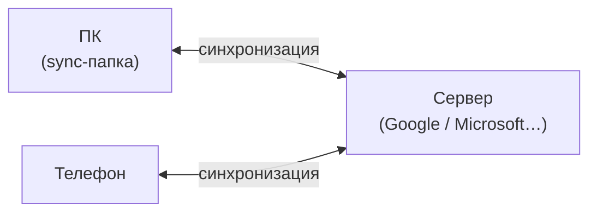

---
tags:
  - all
  - required
  - beginner
title: Облачное хранение и синхронизация
description: >-
  Модели локального, облачного и гибридного хранения; синхронизация файлов;
  конфликт версий и офлайн-доступ.
related:
  - title: "Облако, синхронизация и бэкап для дома"
    doc: encyclopedia/1-basics/1-035-bazovaya-informatika/210
  - title: "Резервное копирование и обеспечение сохранности данных"
    doc: encyclopedia/1-basics/1-12-tsifrovye-ugrozy-i-model-zashchity/6
---

# Облачное хранение и синхронизация

  ОБЯЗАТЕЛЬНО
  ДЛЯ НОВИЧКОВ

Всем

**Облако** переносит копию данных на сервер провайдера; **синхронизация** автоматически выравнивает файлы между ПК, телефоном и облаком. Удобно для работы с нескольких устройств — но это **не** автоматическая страховка от всех потерь.

---

## Модели хранения

| Модель | Суть | Пример |
|--------|------|--------|
| **Локально** | Файл только на диске устройства | Папка вне sync |
| **Облако (cloud-only)** | Основная копия на сервере; локально — кэш или ничего | Файл «только в облаке» в OneDrive |
| **Гибрид** | Полная копия и локально, и в облаке | Папка Google Drive на диске C: |
| **Sync** | Изменения **разносятся** между всеми точками | Правка на телефоне → обновление на ПК |

★ **Облачное хранилище** — сервис, где файлы лежат на **чужих серверах** под вашим аккаунтом; доступ по интернету.

Провайдер отвечает за **доступность сервиса**; вы — за **пароль**, **что синхронизируете** и **отдельный бэкап**. Модель угроз — [1.12](/encyclopedia/1-basics/1-12-tsifrovye-ugrozy-i-model-zashchity/intro).

---

## Синхронизация

★ **Синхронизация (sync)** — автоматическое поддержание **одинакового** содержимого файла или папки на нескольких устройствах и в облаке.

| Событие | Типичное поведение sync |
|---------|-------------------------|
| Сохранили документ | Загрузка на сервер, затем на другие устройства |
| Удалили файл | Удаление **разносится** (если нет корзины облака) |
| Редактировали **офлайн** на двух ПК | **Конфликт версий** — два файла или выбор версии |
| Нет интернета | Локальная копия; sync при восстановлении связи |

★ **Конфликт версий** — два устройства изменили один файл без связи; сервис сохраняет обе версии или просит выбрать.

**Офлайн-доступ** — локальная копия «всегда на устройстве»; удобно в дороге, занимает место на диске.

Пошаговая настройка Drive, OneDrive, iCloud — [1.035/210](/encyclopedia/1-basics/1-035-bazovaya-informatika/210).

---

## Не путать с резервной копией

| | Sync | Backup |
|---|------|--------|
| **Цель** | Актуальность везде | Восстановление после катастрофы |
| **Удаление** | Часто синхронизируется | Старая копия остаётся |
| **Ransomware** | Может зашифровать облачную копию | Откат к дате до атаки |
| **История** | Ограниченные версии (если включены) | Политика «хранить N месяцев» |

★ **Синхронизация не заменяет резервное копирование** — см. [1.12/6](/encyclopedia/1-basics/1-12-tsifrovye-ugrozy-i-model-zashchity/6) и правило 3-2-1.

Полезно: **корзина облака**, **история версий** файла, отдельный бэкап на внешний диск — три разных механизма, их можно комбинировать.

---

## Куда дальше

- Как отправить файл другому — [глава 3](./3) и [4](./4).
- Перенос между своими устройствами — [глава 5](./5).
