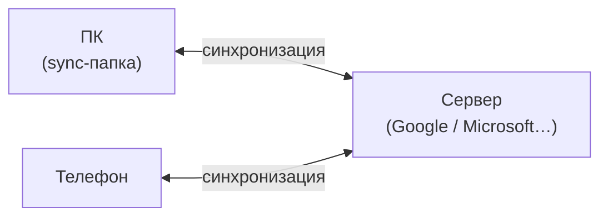

---
tags:
  - all
  - required
  - beginner
title: Облачное хранение и синхронизация
description: >-
  Модели локального, облачного и гибридного хранения; синхронизация файлов;
  конфликт версий и офлайн-доступ.
related:
  - title: "Облако, синхронизация и бэкап для дома"
    doc: encyclopedia/1-basics/1-035-bazovaya-informatika/210
  - title: "Резервное копирование и обеспечение сохранности данных"
    doc: encyclopedia/1-basics/1-12-tsifrovye-ugrozy-i-model-zashchity/6
---

# Облачное хранение и синхронизация

  ОБЯЗАТЕЛЬНО
  ДЛЯ НОВИЧКОВ

Всем

**Облако** переносит копию данных на сервер провайдера; **синхронизация** автоматически выравнивает файлы между ПК, телефоном и облаком. Удобно для работы с нескольких устройств — но это **не** автоматическая страховка от всех потерь.

Облако (или облачное хранилище, Cloud Storage) в архитектуре резервного копирования выполняет роль внешней удаленной площадки (Offsite Repository). Оно заменяет или дополняет физический перенос данных на внешних носителях, автоматизируя отправку копий за пределы компании. В современной ИТ-архитектуре облако связывает локальное хранение и оригинал в концепцию гибридного бэкапа (Hybrid Backup).

## Архитектурные классы облачных хранилищ

В зависимости от бизнес-требований и частоты доступа к копиям, облачные репозитории делятся на три класса (уровня):
1. Горячее хранилище (Hot Storage): Высокая скорость чтения и записи. Используется для хранения оперативных копий, которые могут понадобиться для быстрого восстановления. Стоимость хранения высокая.
2. Холодное хранилище (Cool/Cold Storage): Предназначено для бэкапов, к которым обращаются редко (например, раз в месяц). Стоимость хранения ниже, но за скачивание (извлечение) данных взимается отдельная плата.
3. Архивное хранилище (Glacier/Archive): Максимально дешевое хранилище для устаревающих копий, которые нужно хранить годами по регламенту. Извлечение данных может занимать от нескольких минут до нескольких часов.

Сначала копия оригинала пишется на локальный диск ПК или СХД для обеспечения минимального RTO (быстрое восстановление при сбое). ПО бэкапа автоматически сжимает, шифрует и отправляет эту копию по сети в облако. 

Облачные провайдеры позволяют настроить жизненный цикл файлов (Lifecycle Policies). Например, копия автоматически перемещается из «горячего» облака в «архивное» через 30 дней, а через год удаляется.

Данные должны шифроваться до отправки в облако. Провайдер видит только случайный набор байт и не имеет ключа для дешифрации. 

---

## Модели хранения

В архитектуре резервного копирования и управления данными выбор модели хранения определяет надежность, скорость восстановления системы и стоимость ее обслуживания.

| Модель | Суть | Пример |
|--------|------|--------|
| **Локально** | Файл только на диске устройства | Папка вне sync |
| **Облако (cloud-only)** | Основная копия на сервере; локально — кэш или ничего | Файл «только в облаке» в OneDrive |
| **Гибрид** | Полная копия и локально, и в облаке | Папка Google Drive на диске C: |
| **Sync** | Изменения **разносятся** между всеми точками | Правка на телефоне → обновление на ПК |

1. Локальная модель (On-Premise). Данные оригинала и все его резервные копии размещаются исключительно внутри собственного физического периметра (на жестких дисках ПК, NAS, SAN или магнитных лентах). ПО бэкапа копирует данные с рабочих станций/серверов на выделенное локальное устройство хранения по внутренней высокоскоростной сети. Высокий риск потери данных при физических катастрофах (пожар, кража оборудования) и уязвимость перед локальными вирусами-шифровальщиками.
2. Модель Cloud-only (Только облако). Полный отказ от локальных серверов хранения. Оригинал данных (или бэкап с ПК) напрямую отправляется в облачное хранилище провайдера (S3, Яндекс Диск, Cloud Object Storage). Программа-агент на ПК перехватывает изменения оригинала и сразу транслирует их через интернет на удаленный сервер в дата-центре. Скорость восстановления жестко ограничена шириной интернет-канала. При потере интернета доступ к копиям полностью блокируется.
3. Гибридная модель (Hybrid Storage). Комбинация локального и облачного хранения. Самый надежный архитектурный паттерн, идеально реализующий правило «3-2-1».
- Сначала копия оригинала создается на локальном диске/NAS (для мгновенного восстановления при мелких сбоях).
- Затем эта же копия автоматически шифруется и реплицируется в облако (как резерв на случай катастрофы).
4. Синхронизация (Sync). Модель синхронизации (например, OneDrive, Dropbox, Google Drive) часто ошибочно путают с резервным копированием, но в архитектуре это принципиально разные процессы. Специальная утилита мгновенно зеркалирует любое изменение в папке на ПК в облачную папку. Изменили файл на ПК — он тут же изменился в облаке. Удалили на ПК — он удалился в облаке.

★ **Облачное хранилище** — сервис, где файлы лежат на **чужих серверах** под вашим аккаунтом; доступ по интернету.

В архитектуре резервного копирования облачное хранилище (Cloud Storage) представляет собой распределенную ИТ-инфраструктуру, предоставляемую сторонним провайдером (например, Яндекс Облако, VK Cloud, AWS, Google Cloud), где данные передаются и хранятся по сетевым протоколам интернета. В зависимости от формата данных и логики доступа, облака делятся на три основные категории:
- Объектное хранилище (Object Storage / S3): Главный стандарт для резервного копирования. Данные хранятся в виде «объектов» (файлы + метаданные) в плоском пространстве без иерархии папок. Доступ осуществляется по протоколу HTTP/HTTPS через API (S3-совместимые хранилища). Обладает безграничным масштабированием и поддержкой защиты от удаления.
- Блочное хранилище (Block Storage): Аналог обычного жесткого диска, подключаемый к виртуальным машинам в облаке. Обладает минимальной задержкой (latency) и высокой скоростью, но используется для размещения оригинала (баз данных, ОС), а не для долгосрочных бэкапов.
- Файловое хранилище (File Storage): Облачный аналог локального NAS (доступ по протоколам NFS/SMB). Подходит для совместной работы пользователей с файлами, но редко применяется для масштабных систем резервного копирования из-за более сложного масштабирования по сравнению с S3.

Чтобы оптимизировать затраты компании, облачные провайдеры предлагают разделение дискового пространства на уровни. ПО резервного копирования автоматически перемещает устаревающие копии между ними:
- Standard / Hot (Горячее): Самый дорогой тип хранения, но скачивание данных бесплатно. Сюда записываются самые свежие копии оригинала.
- Cold / Infrequent (Холодное): Стоимость хранения ниже в 2–3 раза, но взимается плата за каждый гигабайт скачанных данных. Подходит для копий месячной давности.
- Archive / Ice (Архивное): Экстремально дешевое хранение. Извлечение данных платное и занимает время (от нескольких минут до часов). Идеально для хранения годовых архивов, которые, скорее всего, никогда не пригодятся, но обязательны по закону.

Провайдер отвечает за **доступность сервиса**; вы — за **пароль**, **что синхронизируете** и **отдельный бэкап**. Модель угроз — [1.12](/encyclopedia/1-basics/1-12-tsifrovye-ugrozy-i-model-zashchity/intro).

---

## Синхронизация

★ **Синхронизация (sync)** — автоматическое поддержание **одинакового** содержимого файла или папки на нескольких устройствах и в облаке. В отличие от резервного копирования, синхронизация работает в режиме реального времени: любое изменение, внесённое в оригинал, мгновенно отображается на всех связанных устройствах.

Архитектурные типы синхронизации:
- Двусторонняя (Two-Way Sync): Изменения отслеживаются на всех устройствах. Если вы отредактировали файл на ПК, он обновится в облаке. Если удалили файл в облаке (или на телефоне), он автоматически удалится на ПК. Это стандарт работы для Google Drive, OneDrive и Dropbox.
- Односторонняя (One-Way Sync): Изменения передаются только в одном направлении (из источника в приемник). Напоминает зеркалирование. Если файл меняется на ПК, он меняется в облаке. Но если изменить файл вручную в облаке, оригинал на ПК останется прежним.

| Событие | Типичное поведение sync |
|---------|-------------------------|
| Сохранили документ | Загрузка на сервер, затем на другие устройства |
| Удалили файл | Удаление **разносится** (если нет корзины облака) |
| Редактировали **офлайн** на двух ПК | **Конфликт версий** — два файла или выбор версии |
| Нет интернета | Локальная копия; sync при восстановлении связи |

★ **Конфликт версий** — два устройства изменили один файл без связи; сервис сохраняет обе версии или просит выбрать. Это архитектурная коллизия в системах синхронизации и совместной работы, которая возникает, когда один и тот же файл одновременно изменяется в двух разных местах до того, как устройства успевают обменяться данными. Поскольку система не может автоматически определить, какие правки важнее, она останавливает стандартное слияние, чтобы предотвратить потерю данных.
- Автономная работа: Пользователь А отключается от сети и правит файл. В это же время Пользователь Б вносит другие правки в тот же файл на своем ПК.
- Отправка изменений: Оба устройства пытаются отправить свои версии на сервер.
- Тупик: Сервер видит, что обе новые версии (2А и 2Б) базируются на старой версии 1, но содержат разный код или текст. Система не может перезаписать одну версию другой без потери чьих-то данных.

збегайте долгого редактирования сложных документов (дизайнерские макеты, базы данных, Excel-таблицы с макросами) в офлайн-режиме, если к ним есть доступ у других людей. Для документов общего доступа отдавайте приоритет облачным редакторам (Google Workspace, Яндекс Документы), а не локальным программам. В корпоративных NAS (например, Synology) включайте оповещения о создании конфликтных файлов, чтобы оперативно удалять дубликаты и не плодить «цифровой мусор».

**Офлайн-доступ** — локальная копия «всегда на устройстве»; удобно в дороге, занимает место на диске. Этот режим является связующим звеном между локальным хранением на ПК и облачными сервисами, обеспечивая непрерывность работы в любых условиях.

Чтобы обеспечить доступ к данным без сети, современные системы (OneDrive, Google Диск, Nextcloud) используют два основных паттерна:
- Полная локальная копия (Классический метод)Все файлы из облака принудительно скачиваются на жесткий диск ПК. Офлайн-доступ гарантирован для 100% данных. Минус: Файлы занимают огромное количество места на локальном диске ПК.
- Файлы по запросу (Files on Demand / Smart Sync)Современный стандарт. На ПК отображаются лишь «виртуальные слепки» (ярлыки) файлов, которые весят 0 байт. Настоящий файл скачивается из облака только в момент клика по нему. Пользователь должен заранее нажать правой кнопкой мыши на критически важную папку и выбрать опцию «Всегда сохранять на этом устройстве». Система скачает эти данные локально, и они станут доступны без интернета.

Пошаговая настройка Drive, OneDrive, iCloud — [1.14/7](/encyclopedia/1-basics/1-14-obmen-dannymi-i-sovmestnyy-dostup/7).

---

## Не путать с резервной копией

Резервная копия (бэкап / backup) — это копия данных оригинала, созданная в конкретный момент времени, упакованная в специальный архивный формат и изолированная в отдельном хранилище. В отличие от синхронизации или офлайн-кэша, резервная копия статична: она фиксирует прошлое состояние системы и предназначена исключительно для одной цели — полностью восстановить оригинал данных в случае его удаления, шифрования вирусом или физической гибели оборудования.

В зависимости от глубины и объекта копирования, бэкапы в ИТ-архитектуре делятся на три уровня:
1. Пофайловый (File-level): Копируются только выбранные папки и файлы (например, документы пользователей). Метод экономит место, но не защищает операционную систему. При сбое ПК придется заново устанавливать все программы.
2. Блочный / Образ диска (Image-level / Bare-Metal): Снимается полный побитовый слепок всего жесткого диска со всеми системными файлами, реестром, настройками и программами. Позволяет восстановить систему «из коробки» на совершенно новое, пустое железо (Bare-Metal Recovery).
3. Прикладной / Консистентный (Application-aware): Создается с учетом специфики работающих программ (СУБД SQL, Exchange, 1С). ПО бэкапа отправляет команду приложению сбросить все транзакции из оперативной памяти на диск, делает снимок и мгновенно «размораживает» систему. Это гарантирует, что база данных запустится после восстановления без ошибок.

| | Sync | Backup |
|---|------|--------|
| **Цель** | Актуальность везде | Восстановление после катастрофы |
| **Удаление** | Часто синхронизируется | Старая копия остаётся |
| **Ransomware** | Может зашифровать облачную копию | Откат к дате до атаки |
| **История** | Ограниченные версии (если включены) | Политика «хранить N месяцев» |

Ransomware (вирусы-вымогатели / шифровальщики) — это главный технологический вызов для современной архитектуры хранения данных. Это вредоносное ПО, которое проникает в сеть, тайно шифрует файлы оригинала, удаляет доступные резервные копии и требует выкуп (обычно в криптовалюте) за ключ дешифрации. В ИТ-архитектуре защита от Ransomware строится не на надежде, что вирус не пропустит антивирус, а на принципе «Нулевого доверия» (Zero Trust) — система проектируется так, чтобы данные выжили, даже если злоумышленник получил полные права администратора.

Если оригинал зашифрован, нельзя просто взять и восстановить копию на прежнее место. Вирус может оставаться в оперативной памяти или бэкап может содержать «спящую» закладку хакера.Современное ПО резервного копирования использует функцию Staged/Secure Recovery: копия сначала разворачивается в изолированной виртуальной «песочнице» без доступа к интернету, полностью сканируется антивирусом на наличие Ransomware, и только после подтверждения чистоты возвращается в производственную среду.

★ **Синхронизация не заменяет резервное копирование** — см. [1.12/6](/encyclopedia/1-basics/1-12-tsifrovye-ugrozy-i-model-zashchity/6) и правило 3-2-1.

Полезно: **корзина облака**, **история версий** файла, отдельный бэкап на внешний диск — три разных механизма, их можно комбинировать.

---

## Куда дальше

- Как отправить файл другому — [глава 3](./3) и [4](./4).
- Перенос между своими устройствами — [глава 5](./5).
