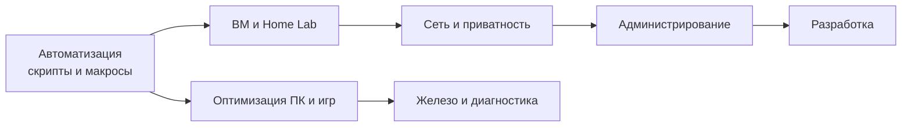

---
tags:
  - all
  - required
title: Путь продвинутого пользователя
description: >-
  Кто считается опытным пользователем ПК, какие навыки дают реальный рост и куда
  вести обучение дальше — к администрированию, разработке и домашней инфраструктуре.
related:
  - title: Софт продвинутого
    doc: encyclopedia/1-basics/1-13-soft-prodvinutogo-polzovatelya/1
  - title: Скрипты и автоматизация
    doc: encyclopedia/1-basics/1-14-sovety-dlya-prodvinutogo/2
  - title: Программирование
    doc: encyclopedia/4-code-dev/code-dev
---

# Путь продвинутого пользователя

  ОБЯЗАТЕЛЬНО

Опытному пользователю

  
Зачем этот раздел

  Продвинутый пользователь редко ищет «ещё один совет по Excel». Ему нужны <strong>рычаги</strong>: автоматизация, изолированные эксперименты, контроль данных, сеть и производительность под конкретные задачи — от домашнего сервера до соревновательных игр.

## Кто такой продвинутый пользователь

**Продвинутый (power user)** — не тот, кто знает больше кнопок в Word, а тот, кто:

- понимает, **что делает система**, когда он нажимает «Установить» или «Очистить»;
- умеет **воспроизвести** настройку на другом ПК (скрипт, документ, образ ВМ);
- **диагностирует** тормоза по метрикам (CPU, диск, сеть), а не по ощущению «всё лагает»;
- осознанно выбирает между **удобством облака** и **контролем self-hosting**.

Это ступень между «уверенным офисным пользователем» и специалистом IT. Многие отсюда уходят в системное администрирование, DevOps, разработку или кибербезопасность — но можно остаться «сильным пользователем» дома и на работе без смены профессии.

### Power user, администратор и разработчик

Роли пересекаются, но **не совпадают**:

| Роль | Фокус | Типичные инструменты |
| :--- | :--- | :--- |
| **Power user** | Свой ПК и домашняя сеть: скорость, приватность, эксперименты | Скрипты, ВМ, VPN, редакторы |
| **Системный администратор** | Стабильность **чужих** систем: пользователи, политики, SLA | AD, мониторинг, бэкапы, [2.06](/encyclopedia/2-system-network/2-06-sistemnoe-administrirovanie/intro) |
| **Разработчик** | Продукт: код, тесты, релизы | Git, IDE, CI, [4-code-dev](/encyclopedia/4-code-dev/code-dev) |

Скрипт на 30 строк для бэкапа — это power user. Сопровождение десятка серверов и runbook'ов — уже ближе к админу. Сервис с API и базой — разработка. Переход между ролями естественный; снобизм «настоящие только пишут на C++» здесь неуместен.

**Blast radius** (радиус поражения) — сколько систем пострадает от одной ошибки. Отдельная [ВМ](/encyclopedia/1-basics/1-14-sovety-dlya-prodvinutogo/3), учётка без прав администратора в быту и бэкап перед `robocopy /MIR` — способы **сузить** blast radius, не «паранойя».

## Чем продвинутый отличается от новичка и «среднего» уровня

| Навык | Уверенный пользователь | Продвинутый |
| :--- | :--- | :--- |
| Установка ПО | С официального сайта, без лишних галочек | Понимает зависимости, portable-версии, winget/choco, WSL |
| Файлы | Папки, поиск в проводнике | Everything, ripgrep, синхронизация, версии, бэкап 3-2-1 |
| Проблемы | Перезагрузка, «почистить диск» | Журнал событий, Process Explorer, изоляция в ВМ |
| Безопасность | Антивирус + сложный пароль | 2FA, менеджер паролей, VPN, свой DNS-фильтр |
| Рост | Курсы по Office | Скрипты, Linux, Home Lab, [программирование](/encyclopedia/4-code-dev/code-dev) |

Базовые советы по паролям и порядку на диске — в разделе [Советы для новичка](/encyclopedia/1-basics/1-12-sovety-dlya-novichka/intro). Здесь — следующий виток.

## Дорожная карта навыков

Логичный порядок освоения (можно параллелить по интересу):

1. **Автоматизация** — [скрипты и макросы](/encyclopedia/1-basics/1-14-sovety-dlya-prodvinutogo/2): снять рутину с плеч ([Python](/encyclopedia/5-languages/5-02-python/intro), [Bash](/encyclopedia/5-languages/5-25-bash/intro), [PowerShell](/encyclopedia/5-languages/5-26-powershell/intro)).
2. **Виртуализация** — [ВМ и Home Lab](/encyclopedia/1-basics/1-14-sovety-dlya-prodvinutogo/3): безопасно пробовать Linux, сервисы, «ломать» систему.
3. **Приватность и данные** — [self-hosting и VPN](/encyclopedia/1-basics/1-14-sovety-dlya-prodvinutogo/4): свои облака, пароли, DNS.
4. **Эргономика** — [работа с клавиатуры](/encyclopedia/1-basics/1-14-sovety-dlya-prodvinutogo/5): скорость и меньше RSI от мыши.
5. **Наблюдаемость Windows** — [процессы и кэши](/encyclopedia/1-basics/1-14-sovety-dlya-prodvinutogo/6).
6. **Игры и отзывчивость** — [FPS и input lag](/encyclopedia/1-basics/1-14-sovety-dlya-prodvinutogo/7).
7. **Железо** — [охлаждение и троттлинг](/encyclopedia/1-basics/1-14-sovety-dlya-prodvinutogo/8); основы компонентов — в [Как работает компьютер](/encyclopedia/1-basics/1-08-kak-rabotaet-kompyuter/intro).

## Куда расти профессионально (по желанию)

| Направление | Что уже близко power user | Куда углубляться в энциклопедии |
| :--- | :--- | :--- |
| Системное администрирование | Скрипты, ВМ, бэкапы, логи | [2.06 Администрирование](/encyclopedia/2-system-network/2-06-sistemnoe-administrirovanie/intro), [Терминал](/encyclopedia/2-system-network/2-05-terminal/intro) |
| Сети и безопасность | VPN, DNS, фаервол | [Сеть и интернет](/encyclopedia/2-system-network/2-03-set-i-internet/intro), [ИБ](/encyclopedia/8-infra-security/8-07-informatsionnaya-bezopasnost/intro) |
| Разработка | Редакторы, Git, API | [Код и разработка](/encyclopedia/4-code-dev/code-dev) |
| Данные и аналитика | Python, CSV, SQL | [SQL](/encyclopedia/3-data-markup/3-07-sql/intro), [Анализ данных](/encyclopedia/3-data-markup/3-11-analiz-dannyh/intro) |

Продвинутому пользователю не обязательно становиться программистом. Но **уметь прочитать ошибку в терминале и написать 20 строк скрипта** — это граница, после которой компьютер перестаёт быть «чёрным ящиком».

## Инструменты — отдельным разделом

Конкретные программы (Total Commander, VS Code, VirtualBox, PowerToys) собраны в [Софт продвинутого пользователя](/encyclopedia/1-basics/1-13-soft-prodvinutogo-polzovatelya/intro). Советы здесь объясняют **зачем** они нужны; софт — **чем** реализовать.

## Типичный день power user (пример)

Не обязательная рутина, а **срез привычек**, которые отличают продвинутого от «среднего»:

| Момент | Действие | Инструмент |
| :--- | :--- | :--- |
| Утро | Проверка, что NAS/сайт жив | Скрипт + уведомление |
| Работа | Открыть проект, терминал в VS Code | ``Ctrl+` ``, Remote-SSH |
| Файлы | Найти лог за вчера | Everything → Notepad++ |
| Эксперимент | Поставить пакет в Ubuntu ВМ | Снапшот → `apt` → откат |
| Вечер | Игра: закрыть лаунчеры, проверить temps | HWiNFO, [глава про игры](/encyclopedia/1-basics/1-14-sovety-dlya-prodvinutogo/7) |

Цель — не «жить в терминале», а **сократить повторяющиеся действия** до автоматизма или одной клавиши.

## Антипаттерны — что мешает росту

| Миф / привычка | Реальность |
| :--- | :--- |
| «Нужно всё знать на Linux» | Достаточно WSL + одной ВМ под задачу |
| «Очиститель ускорит ПК» | Часто ломает Update; смотрите [процессы](/encyclopedia/1-basics/1-14-sovety-dlya-prodvinutogo/6) |
| «VPN = полная анонимность» | Шифрует канал; сайт всё равно видит аккаунт |
| «Self-host = бесплатно навсегда» | Время на патчи, бэкапы, электричество |
| «Игровой бустер в Steam» | Часто дублирует настройки Windows/GPU |
| «Запомню пароль» | Один утечённый сервис → компрометация почты |

Продвинутый пользователь **проверяет источник** совета: официальная документация, Sysinternals, а не «топ-10 твиков 2024».

## Сценарии по интересам

| Вы в основном… | Начните с глав | Софт из 1.13 |
| :--- | :--- | :--- |
| Офис + много файлов | [2 скрипты](/encyclopedia/1-basics/1-14-sovety-dlya-prodvinutogo/2), [5 клавиатура](/encyclopedia/1-basics/1-14-sovety-dlya-prodvinutogo/5) | Total Commander, PowerToys |
| Игры + стрим | [7 игры](/encyclopedia/1-basics/1-14-sovety-dlya-prodvinutogo/7), [6 процессы](/encyclopedia/1-basics/1-14-sovety-dlya-prodvinutogo/6) | OBS, Afterburner |
| Приватность | [4 self-host](/encyclopedia/1-basics/1-14-sovety-dlya-prodvinutogo/4), [3 Home Lab](/encyclopedia/1-basics/1-14-sovety-dlya-prodvinutogo/3) | Docker, WireGuard |
| Путь в IT | [2](/encyclopedia/1-basics/1-14-sovety-dlya-prodvinutogo/2) → [3](/encyclopedia/1-basics/1-14-sovety-dlya-prodvinutogo/3) → [2.06](/encyclopedia/2-system-network/2-06-sistemnoe-administrirovanie/intro) | VS Code, PuTTY |
| Контент / дизайн | [5](/encyclopedia/1-basics/1-14-sovety-dlya-prodvinutogo/5) | [4 графика](/encyclopedia/1-basics/1-13-soft-prodvinutogo-polzovatelya/4) |

## Практический минимум на ближайший месяц

Если нужен измеримый прогресс:

1. Один рабочий скрипт на [PowerShell](/encyclopedia/5-languages/5-26-powershell/122) или [Python](/encyclopedia/5-languages/5-02-python/16) (бэкап папки, проверка сайта, переименование файлов).
2. Одна [виртуальная машина](/encyclopedia/1-basics/1-13-soft-prodvinutogo-polzovatelya/8) с Linux — только для экспериментов.
3. Менеджер паролей + 2FA на почте и облаке.
4. Замер «до/после»: автозагрузка, фоновые процессы, свободное место на системном диске.
5. Десять новых [горячих клавиш](/encyclopedia/1-basics/1-12-sovety-dlya-novichka/3) — осознанно, с записью в шпаргалку.

### Неделя 2–4 (углубление)

6. Папка `Scripts` в Git: все `.ps1`, `.py`, `.ahk` с README.
7. `winget export` или список установленного ПО — восстановление на новом ПК.
8. Один сервис в Docker на старом ноутбуке (Pi-hole или Vaultwarden).
9. Process Explorer в закладках — при любом «тормозит».
10. Прочитать одну главу [терминала](/encyclopedia/2-system-network/2-05-terminal/intro) и выполнить команды из неё в WSL.

Дальше — по карте глав выше.

---
