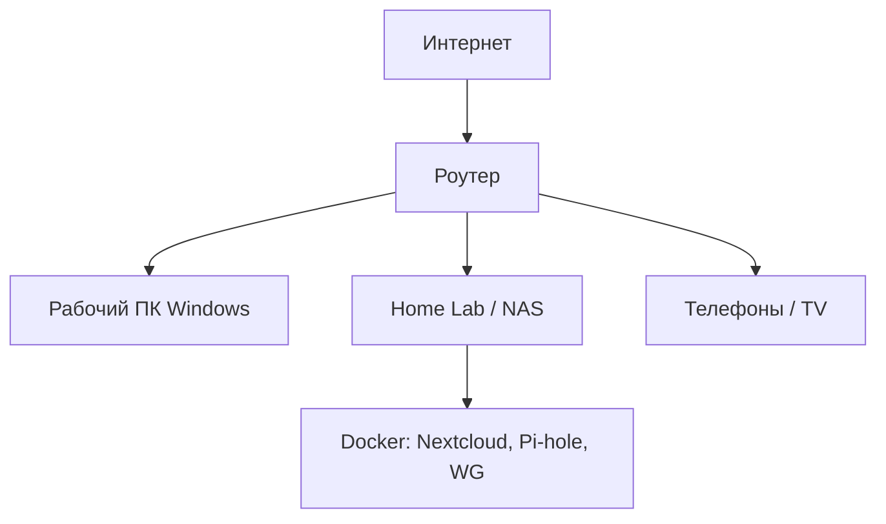

---
tags:
  - all
  - required
title: Виртуальные машины, Home Lab и переход на Linux
description: >-
  Зачем нужны ВМ для экспериментов, как поднять домашний сервер на старом железе
  и с чего начать переход на Linux без риска для основной системы.
related:
  - title: Виртуализация в софте
    doc: encyclopedia/1-basics/1-13-soft-prodvinutogo-polzovatelya/8
  - title: Операционные системы
    doc: encyclopedia/2-system-network/2-01-operatsionnaya-sistema/intro
  - title: WSL
    doc: encyclopedia/2-system-network/2-01-operatsionnaya-sistema/41
---

# Виртуальные машины, Home Lab и переход на Linux

<div class="article-tags">
  <span class="tag tag-required">ОБЯЗАТЕЛЬНО</span>
</div>

<span class="complexity-badge">Опытному пользователю</span>

---

## Виртуальная машина - изоляция ОС и эксперименты

**Виртуальная машина (ВМ)** — отдельный "компьютер внутри компьютера" с собственной ОС, диском и сетью. Гипервизор ([VirtualBox](https://www.virtualbox.org/), [Hyper-V](https://learn.microsoft.com/windows-server/virtualization/hyper-v/hyper-v-overview), VMware, KVM) делит ресурсы хоста.

Главная ценность для power user — **изоляция**:

| Эксперимент | Почему не на основной ОС | В ВМ |
| :--- | :--- | :--- |
| "Поставлю Linux и сломаю" | Риск загрузчика и разделов | Снапшот → откат за минуту; деструктивные команды — по [стоп-листу](/encyclopedia/8-infra-security/8-03-zabota-o-kode-i-dannyh/101) |
| Сервис Nextcloud / Pi-hole | Порты, Docker, фаервол | Отдельная сеть NAT |
| Непроверенный установщик / пиратский софт | Заражение, нарушение лицензии | Одноразовая ВМ **без** общих папок; только анализ, не использование |
| Учебный Active Directory | Домен меняет политики | Лабораторный лес |

Подробно про гипервизоры и настройку BIOS — в [Софт: виртуализация](/encyclopedia/1-basics/1-13-soft-prodvinutogo-polzovatelya/8). Теория ОС — [раздел 2.01](/encyclopedia/2-system-network/2-01-operatsionnaya-sistema/1).

---

### Гипервизор 1-го и 2-го типа

| Тип | Примеры | Где работает ОС гостя |
| :--- | :--- | :--- |
| **Тип 1** (bare metal) | Hyper-V на сервере, Proxmox, ESXi | Прямо на железе гипервизора |
| **Тип 2** (на хост-ОС) | VirtualBox, VMware Workstation | Поверх Windows/macOS/Linux |

На домашнем ПК чаще **тип 2**. **Контейнер Docker** делит ядро хоста — легче ВМ, но слабее изоляция. Сомнительное ПО — в **ВМ**; привычные сервисы — в **контейнерах** на отдельном Linux-хосте. Все четыре схемы размещения (включая облачный гибрид "контейнеры в ВМ") — [в теории виртуализации](/encyclopedia/1-basics/1-13-soft-prodvinutogo-polzovatelya/8#chetiryre-modeli-razvertyvaniya).

**Общие папки** (Guest Additions) — канал из гостя на хост. Для анализа malware отключайте shared folders.

---

### Практика на Windows

1. Включить виртуализацию в UEFI (Intel VT-x / AMD-V).
2. **Hyper-V** или **VirtualBox** — для полноценных ВМ.
3. **[WSL 2](/encyclopedia/2-system-network/2-01-operatsionnaya-sistema/41)** — лёгкий Linux для Bash и Docker без отдельного окна ВМ (удобно для разработки, не заменяет всё сценарии Home Lab).

Снапшот перед `apt upgrade` или установкой "сомнительного" ПО — обязательная привычка.

---

### Hyper-V и VirtualBox и VMware Player

| Критерий | Hyper-V | VirtualBox | VMware Workstation Player |
| :--- | :--- | :--- | :--- |
| Цена | Встроен в Pro/Enterprise | Бесплатно | Бесплатно для личного use |
| Linux-guest | Хорошо | Хорошо | Хорошо |
| USB passthrough | Ограничено | Гибче | Гибче |
| Снапшоты | Да (checkpoint) | Да | Да |
| Конфликт | Отключает другие гипервизоры на Win | Часто с Hyper-V | То же |

На домашнем Windows 11 Home — чаще **VirtualBox**. На Pro — можно Hyper-V, но тогда VirtualBox без VT-x.

---

### Сеть ВМ — NAT, мост, host-only

| Режим | Смысл | Когда |
| :--- | :--- | :--- |
| **NAT** | ВМ выходит в интернет через хост; из LAN к ВМ не достучаться | Учёба, изоляция |
| **Мост (Bridged)** | ВМ как отдельный ПК в Wi‑Fi/Ethernet | SSH с телефона, Home Lab |
| **Host-only** | Только хост ↔ ВМ | Кластер из нескольких ВМ |

Для [WireGuard](/encyclopedia/1-basics/1-14-sovety-dlya-prodvinutogo/4) и Nextcloud обычно нужен **статический IP в LAN** (bridged или отдельный физический сервер).

---

### Пошагово — первая Ubuntu в VirtualBox

1. Скачать ISO [Ubuntu Server LTS](https://ubuntu.com/download/server).
2. Создать ВМ — 2–4 GB RAM, 40 GB виртуальный диск, включить EFI при необходимости.
3. Установить, пользователь с sudo, **OpenSSH server** в списке пакетов.
4. Снапшот `clean-install` (GUI или CLI):

```text
VBoxManage snapshot "UbuntuLab" take "clean-install" --pause
```

5. С хоста: `ssh user@IP_ВМ` (IP — `ip a` в гостевой системе).
6. `sudo apt update && sudo apt upgrade` → снапшот `updated`; откат: `VBoxManage snapshot "UbuntuLab" restore "clean-install"`.

Дальше — Docker по официальной инструкции или один compose-файл из [приватности](/encyclopedia/1-basics/1-14-sovety-dlya-prodvinutogo/4).

---

## Home Lab — старый ноутбук или ПК как лаборатория

**Home Lab** — домашняя мини-инфраструктура для обучения и сервисов: не продакшен-ЦОД, а песочница с реальными протоколами.

Типичные роли старого железа (i5/Ryzen 5 поколения 6+, 8–16 ГБ RAM, SSD):

| Роль | ОС / стек | Зачем |
| :--- | :--- | :--- |
| Linux-станция | Ubuntu Server, Debian | SSH, Docker, учёба |
| Файлы и синхронизация | Nextcloud | Свой аналог облака |
| DNS и реклама | Pi-hole, AdGuard Home | Фильтр на уровне сети |
| VPN | WireGuard | Доступ домой извне |
| Медиа | Jellyfin | Библиотека фильмов локально |
| ВМ-гипервизор | Proxmox VE | Несколько сервисов на одном железе |

Электричество и шум — реальные минусы — для 24/7 лучше мини-ПК (Intel N100, старый NUC), чем игровой системник с RTX.

Сеть: желательно **отдельный VLAN или хотя бы статический IP** и проброс портов только осознанно — см. [NAT и проброс](/encyclopedia/2-system-network/2-06-sistemnoe-administrirovanie/7).

---

### Железо — ориентиры для 24/7

| Нагрузка | CPU / RAM | Диск | Примечание |
| :--- | :--- | :--- | :--- |
| DNS (Pi-hole) | 1 ядро, 512 МБ–1 ГБ | 8 GB SD / 32 GB SSD | Можно Raspberry Pi |
| Docker: Vaultwarden + Caddy | 2 ядра, 2 ГБ | 20 GB SSD | Тихий NUC |
| Nextcloud + БД | 4 ядра, 8 ГБ | 500 GB+ | Отдельный HDD под данные |
| Proxmox + 3 ВМ | 6+ ядер, 32 ГБ | NVMe + HDD | "Настоящий" homelab |

UPS на 10–15 минут — чтобы не убить ext4/ZFS при отключении света.

---

### Топология "квартира"



Роутер: DHCP reservation для NAS (всегда один IP). Проброс портов 80/443 — **только** если понимаете риски; лучше [VPN](/encyclopedia/1-basics/1-14-sovety-dlya-prodvinutogo/4).

---

### Proxmox и "всё в ВМ"

**Proxmox VE** — гипервизор на bare metal — несколько Linux/Windows ВМ, снапшоты, бэкап в Proxmox Backup Server. Имеет смысл, когда один физический хост и нужно разделить "прод" Nextcloud и "песочницу" для экспериментов.

---

## Что даст переход на Linux (и что не даст)

Linux на десктопе (Fedora, Ubuntu, Pop!_OS) даёт:

- единую среду с серверами и [DevOps](/encyclopedia/8-infra-security/8-04-devops-ci-cd/intro);
- прозрачные обновления пакетов, меньше "фонового" софта;
- сильный терминал и скрипты "из коробки".

Не ждите:

- 1:1 замены всех Windows-игр и Adobe без компромиссов;
- "всё заработает само" — драйверы Wi‑Fi/принтера иногда требуют ручной настройки.

**Прагматичный путь:**

1. **WSL 2** на рабочем Windows — ежедневные скрипты и Git.
2. **ВМ с Ubuntu** — серверные эксперименты.
3. **Dual-boot или отдельный диск** — если решили жить в Linux на ноутбуке.
4. **Старый ПК только под Linux** — идеальный Home Lab без риска для рабочей машины.

Загрузка и файловые системы: [2.01 — загрузка GRUB, initramfs](/encyclopedia/2-system-network/2-01-operatsionnaya-sistema/5113).

---

## Docker и "лёгкая" виртуализация

Контейнеры ([Docker](/encyclopedia/8-infra-security/8-04-devops-ci-cd/12)) — не полная ВМ, но на Home Lab часто поднимают стек одной командой:

```bash
docker compose up -d
```

Правило: на домашнем сервере **обновляйте образы** и не публикуйте панели администрирования в интернет без VPN.

---

### Минимальный docker-compose

На сервере в папке `~/stack`:

```yaml
services:
  vaultwarden:
    image: vaultwarden/server:latest
    restart: unless-stopped
    volumes:
      - ./vw-data:/data
    ports:
      - "127.0.0.1:8080:80"
```

Порт только на localhost — снаружи пускать **reverse proxy** (Caddy/Nginx) с TLS или доступ через WireGuard. Пароли и токены — в `.env` (см. [скрипты](/encyclopedia/1-basics/1-14-sovety-dlya-prodvinutogo/2)).

---

### WSL 2 — что умеет и чего не умеет

| Умеет | Не заменяет |
| :--- | :--- |
| Bash, Git, Node, Python dev | Сервер 24/7 при выключенном ПК |
| Docker Desktop integration | Аппаратный USB для некоторых сценариев |
| Доступ к файлам Windows `/mnt/c` | Полную изоляцию как у отдельной ВМ |

В современных сборках WSL 2 поддерживает **systemd** ([документация Microsoft](https://learn.microsoft.com/windows/wsl/systemd)); на старых инструкциях ограничения могли быть актуальны — проверяйте `wsl --version`.

Для ежедневной разработки WSL часто **достаточно**; для сервисов 24/7 — отдельный хост или ВМ.

---

## Чек-лист первого Home Lab за выходные

1. Старый ПК + SSD + кабель Ethernet в роутер.
2. Установка **Debian** или **Ubuntu Server** (без GUI).
3. SSH с ключом, отключить вход по паролю root.
4. Одна ВМ или Docker: **WireGuard** или **Vaultwarden** (см. [приватность](/encyclopedia/1-basics/1-14-sovety-dlya-prodvinutogo/4)).
5. Бэкап конфигов на второй диск / облако по правилу 3-2-1.

Дальше: [self-hosting и сеть](/encyclopedia/1-basics/1-14-sovety-dlya-prodvinutogo/4).

---
