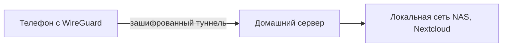

---
tags:
  - all
  - required
title: Приватность, self-hosting и домашняя сеть
description: >-
  Nextcloud, Vaultwarden, зачем поднимать сервисы дома, WireGuard, персональный
  DNS и стратегия резервного копирования 3-2-1.
related:
  - title: VPN и WireGuard
    doc: encyclopedia/2-system-network/2-03-set-i-internet/613
  - title: Информационная безопасность
    doc: encyclopedia/8-infra-security/8-07-informatsionnaya-bezopasnost/intro
  - title: Home Lab
    doc: encyclopedia/1-basics/1-14-sovety-dlya-prodvinutogo/3
---

# Приватность, self-hosting и домашняя сеть

<div class="article-tags">
  <span class="tag tag-required">ОБЯЗАТЕЛЬНО</span>
</div>

<span class="complexity-badge">Опытному пользователю</span>

## Приватность power user - угрозы и привычки

Продвинутый пользователь уже использует 2FA и менеджер паролей. Следующий уровень — **контроль над данными и трафиком**:

- где лежат файлы и бэкапы;
- кто видит DNS-запросы;
- как заходить домой без открытого RDP в интернет.

Облако (Google Drive, iCloud) удобно, но вы не контролируете политику, регион и субподрядчиков. **Self-hosting** — размещение сервисов у себя (дома или на VPS), с вашими правилами.

### Упрощённая модель угроз "дома"

| Кто угрожает | Что защищает | Чего не даёт |
| :--- | :--- | :--- |
| Провайдер / Wi‑Fi в кафе | VPN (WireGuard) | Анонимность в интернете |
| Сайт и трекеры | DNS-фильтр, блокировщики | Скрыть аккаунт на сервере |
| Вор ноутбука | BitLocker, сильный пароль | Облачные пароли без 2FA |
| Взлом через интернет | Закрытые порты, VPN вместо RDP | Защиту от фишинга |

### VPN, прокси и Tor (не одно и то же)

| Инструмент | Шифрует | Типичная цель |
| :--- | :--- | :--- |
| **VPN** (WireGuard) | Туннель до вашей сети | Доступ к NAS, шифрование в публичном Wi‑Fi |
| **HTTP/SOCKS-прокси** | Частично | Обход блокировок, корпоративный прокси |
| **Tor** | Многослойно | Анонимность; не для игр и NAS |

**E2EE** (Signal) шифрует **содержимое** между участниками; VPN шифрует **канал** до точки выхода.

## Self-hosting — что имеет смысл поднять дома

| Сервис | Заменяет / дополняет | Сложность |
| :--- | :--- | :--- |
| **[Nextcloud](https://nextcloud.com/)** | Dropbox, синхронизация файлов, календарь | Средняя |
| **[Vaultwarden](https://github.com/dani-garcia/vaultwarden)** | Bitwarden cloud (совместимые клиенты) | Низкая |
| **Jellyfin** | Стриминг своей медиатеки | Средняя |
| **Immich** | Фото из облака | Средняя |
| **Pi-hole / AdGuard Home** | Блокировка рекламы и трекеров в сети | Низкая |

Развёртывание — обычно Docker на [Home Lab](/encyclopedia/1-basics/1-14-sovety-dlya-prodvinutogo/3). Обязательно: HTTPS (reverse proxy), обновления, **бэкап томов** Docker.

### Что даёт self-hosting

- данные остаются на вашем диске (плюс ваши бэкапы);
- можно отключить "телеметрию продукта";
- учит сетям, TLS, Linux — мост к [администрированию](/encyclopedia/2-system-network/2-06-sistemnoe-administrirovanie/intro).

### Цена

- ваше время на настройку и инциденты ("диск заполнился", "обновление сломало контейнер");
- безопасность — ваша ответственность: патчи, фаервол, сильные пароли;
- электричество и UPS для 24/7.

Для многих разумный гибрид: пароли и критичные файлы — self-host, остальное — облако с шифрованием клиента.

### Nextcloud — что получаете

- синхронизация папок как Dropbox (клиенты Windows/Android);
- календарь/контакты (опционально);
- совместные ссылки, версии файлов;
- плагины (OnlyOffice, шифрование на клиенте).

Минимум на сервере: веб (Apache/Nginx), PHP, MariaDB/PostgreSQL, Redis для кэша — или **готовый Docker-образ** `linuxserver/nextcloud`. Планируйте **отдельный том** под `data/` (сотни ГБ).

### Vaultwarden

Лёгкий сервер для клиентов **Bitwarden** (официальные приложения подключаются к вашему URL). На слабом железе тянет семью из 5–10 человек. Обязательно: HTTPS, бэкап `./vw-data`, обновления образа раз в месяц.

### Jellyfin и Immich

| Сервис | Аналог | Заметка |
| :--- | :--- | :--- |
| Jellyfin | Plex (без подписки) | Транскодинг грузит CPU |
| Immich | Google Photos | Нужно место под RAW/видео |

Оба — через Docker; не выставляйте в интернет без авторизации и VPN.

### Reverse proxy и TLS

**Caddy** автоматически получает Let's Encrypt; **Traefik** удобен с Docker labels. Схема:

`Интернет → роутер (только 51820/UDP WireGuard) → VPN → Caddy → контейнеры`

Прямой проброс `443` на NAS без патчей — частая причина взлома Nextcloud.

## WireGuard — личный VPN без тяжёлого IPsec

**WireGuard** — современный VPN-протокол: мало кода, быстрый, конфиг в текстовом файле. Используют для:

- доступа к Home Lab из кафе;
- объединения двух домов (site-to-site);
- обхода **небезопасного** Wi‑Fi (шифрование до своего выхода).

Как устроены handshake, ключи Curve25519, отличие от OpenVPN — в [главе про VPN](/encyclopedia/2-system-network/2-03-set-i-internet/613). Криптография Ed25519 — в [ИБ](/encyclopedia/8-infra-security/8-07-informatsionnaya-bezopasnost/115).

Минимальная схема:



Не открывайте панели Nextcloud и Vaultwarden напрямую в интернет — только через VPN или с HTTPS + fail2ban.

### Упрощённая модель конфигурации WireGuard

<div class="callout callout--warning">
  <div class="callout-title">Ключи</div>
  Ниже — <strong>шаблон</strong>. Ключи: <code>wg genkey</code>, <code>wg pubkey</code> на сервере; <strong>не коммитьте</strong> <code>.conf</code> в Git.
</div>

На сервере (Linux) интерфейс `wg0`, на телефоне — клиент (QR из `wg-easy` или вручную):

```ini
[Interface]
PrivateKey = <ПЛЕЙСХОЛДЕР_сгенерировать_локально>
Address = 10.8.0.2/32
DNS = 192.168.1.10

[Peer]
PublicKey = <публичный_ключ_сервера>
Endpoint = vpn.example.com:51820
AllowedIPs = 10.8.0.0/24, 192.168.1.0/24
PersistentKeepalive = 25
```

`AllowedIPs` — какой трафик в туннель. `PersistentKeepalive` — за NAT роутера.

```bash
sudo ufw default deny incoming
sudo ufw allow 51820/udp comment 'WireGuard'
sudo ufw allow OpenSSH
sudo ufw enable
```

Инструменты: `wg-easy`, `tailscale` (упрощённый mesh на базе WireGuard) — для быстрого старта без ручных ключей.

## Персональный DNS

Роутер и провайдер видят, **к каким доменам** вы обращаетесь. **Локальный DNS-фильтр** (Pi-hole, AdGuard Home, Unbound на роутере):

- режет рекламу и трекеры для всей сети;
- даёт статистику запросов;
- позволяет локальные имена (`nas.home` → 192.168.1.10).

Упоминание в контексте аналитики: [блокировка трекеров](/encyclopedia/3-data-markup/3-11-analiz-dannyh/4). Для продвинутого пользователя DNS — часть "гигиены", не магия анонимности: HTTPS всё равно видит **сайт** на стороне сервера.

### Pi-hole / AdGuard Home

1. Установка на Raspberry Pi или в Docker на NAS.
2. В роутере DHCP: DNS-сервер = IP Pi-hole (или AdGuard).
3. На телефонах в Wi‑Fi — тот же DNS (в мобильной сети — отдельная история).
4. Списки блокировки: default + при желании Steven Black hosts.
5. Локальные DNS records: `nas.lan` → `192.168.1.20`.

**DoH в браузере** (Cloudflare DNS в Firefox) **обходит** Pi-hole — для единой политики отключите DoH в браузерах дома или используйте AdGuard с DNS-over-HTTPS на роутере.

### Unbound (опционально)

Рекурсивный резолвер "сам ходит к корневым DNS" — чуть больше приватности от провайдера, сложнее в настройке. Связка Pi-hole → Unbound — популярна у энтузиастов.

## Резервное копирование (кратко, но обязательно)

Self-hosting **без бэкапа опаснее**, чем облако с рабочим восстановлением у провайдера: диск умер — всё локальное пропало.

**Правило 3-2-1:**

- **3** копии данных;
- **2** типа носителей (SSD + внешний HDD / другой ПК);
- **1** копия **вне дома** (облако, друг у друга, VPS).

| Тип | Смысл |
| :--- | :--- |
| Полный | Весь объём раз в период |
| Инкрементальный | Только изменения с прошлого раза |
| Снапшот ВМ / ZFS | Мгновенный откат на Home Lab |

Windows: `robocopy`, образ системы, [Планировщик](/encyclopedia/1-basics/1-14-sovety-dlya-prodvinutogo/2). Linux: `rsync`, `restic`, `borg`. **Проверяйте восстановление** раз в квартал.

Шифруйте бэкапы с паролем, если носитель уезжает из дома.

### Инструменты бэкапа

| Инструмент | Платформа | Особенность |
| :--- | :--- | :--- |
| `restic` | Кроссплатформа | Шифрование, dedup, S3/B2/local |
| `borgbackup` | Linux | Сжатие, dedup |
| Veeam / Macrium | Windows | Образ системы |
| Proxmox Backup | Proxmox | ВМ целиком |
| rsnapshot | Linux | Снапшоты через rsync |

Тест восстановления: раз в квартал **восстановить один файл и одну ВМ** из бэкапа — иначе бэкап может оказаться битым годами.

### Модель угроз "дома"

| Угроза | Митигация |
| :--- | :--- |
| Взлом через открытый порт | VPN, закрытые порты, fail2ban |
| Ransomware на ПК | Бэкап offline, версии Nextcloud |
| Утеря ноутбука | BitLocker, сильный пароль учётки |
| Провайдер видит DNS | Pi-hole локально; VPN для вне дома |
| Физическая кража NAS | Шифрование тома, отдельное помещение |

## Базовая "гигиена" без параноии

| Практика | Зачем |
| :--- | :--- |
| Менеджер паролей + уникальные пароли | Утечка на одном сайте не ломает остальные |
| 2FA (TOTP, ключ) | Почта, облако, Git |
| Обновления ОС и браузера | Закрытие известных CVE |
| Разделение "рабочий / игровой / лабораторный" ПК или ВМ | Снижение blast radius |
| Минимум прав администратора в быту | Вредоносный PDF не ставит драйверы |

Углублённая криптография и SIEM — в [8.07 ИБ](/encyclopedia/8-infra-security/8-07-informatsionnaya-bezopasnost/intro); здесь — то, что реально делает power user дома.

**Дальше:** [работа с клавиатуры и редакторы](/encyclopedia/1-basics/1-14-sovety-dlya-prodvinutogo/5).

---
