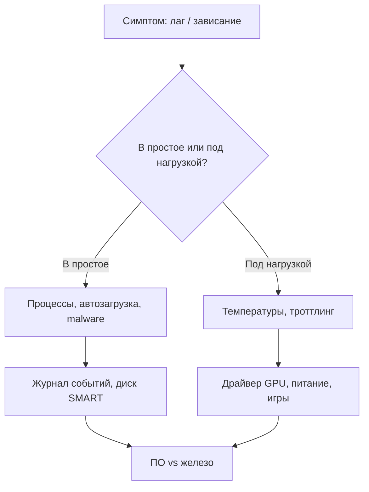

---
tags:
  - all
  - required
title: Железо, охлаждение и диагностика
description: >-
  Как компоненты влияют на производительность, уход за системой охлаждения,
  троттлинг и пошаговая диагностика тормозов и зависаний.
related:
  - title: Как работает компьютер
    doc: encyclopedia/1-basics/1-08-kak-rabotaet-kompyuter/intro
  - title: Игры и FPS
    doc: encyclopedia/1-basics/1-14-sovety-dlya-prodvinutogo/7
---

# Железо, охлаждение и диагностика

  ОБЯЗАТЕЛЬНО

Опытному пользователю

## Как железо связано с «ощущением» скорости

Продвинутый пользователь знает **узкое место** под задачу:

| Задача | Чаще всего упирается в |
| :--- | :--- |
| Компиляция, VM, тяжёлые вкладки | CPU + RAM |
| Игры 1440p+ | GPU |
| Запуск системы, копирование тысяч файлов | SSD / NVMe |
| Долгая работа на ноутбуке | Охлаждение → троттлинг |

Базовая теория компонентов — [1.08 Как работает компьютер](/encyclopedia/1-basics/1-08-kak-rabotaet-kompyuter/intro). Игровой тюнинг — [отдельная глава](/encyclopedia/1-basics/1-14-sovety-dlya-prodvinutogo/7).

### Главные мысли

1. **CPU** — расчёты, компиляция, симуляция, часть игр.
2. **GPU** — картинка, рендер, нейросети.
3. **RAM** — сколько одновременно «открыто» без swap.
4. **SSD** — время отклика; HDD для архива, не для ОС.
5. Разгон возможен, но цена — тепло, энергия, стабильность; для рабочей машины часто не нужен.

## Температуры и троттлинг

**Троттлинг** — снижение частоты при перегреве. Симптомы: FPS падает через 10–20 минут, «раньше было быстрее».

| Компонент | Ориентир в нагрузке | Тревога |
| :--- | :--- | :--- |
| CPU | 60–85°C | &gt; 90°C постоянно |
| GPU | 65–80°C | троттлинг, троттл памяти |
| NVMe | 50–70°C | &gt; 80°C — дросселирование |

Мониторинг: HWiNFO64, GPU-Z, встроенные утилиты производителей.

### Бенчмарки «до и после»

| Тест | Что показывает |
| :--- | :--- |
| Cinebench R23/2024 | CPU многопоток / один поток |
| 3DMark Time Spy | GPU + CPU игровой сдвиг |
| CrystalDiskMark | SSD последовательное чтение |
| AIDA64 cache/mem | Память, задержки |

Сохраняйте скриншоты после сборки ПК и после чистки — иначе не доказать деградацию.

### Разгон: только с измерением

1. Baseline бенчмарк + temps 20 мин.
2. Маленький шаг ( +50 MHz GPU / PBO conservative ).
3. Повтор теста; при WHEA/артефактах — откат.
4. Не гнаться за цифрами в тестах ценой вылетов в рабочих задачах.

Для рабочей машины разгон GPU часто **не окупается**; undervolt — иногда даёт тишину и стабильность.

## Уход за охлаждением

Раз в 12–24 месяца (пыльная среда — чаще):

1. Выключить питание, продуть фильтры и радиаторы сжатым воздухом (не «в лицо» вентиляторам на максимум без держания лопастей).
2. Проверить, что все вентиляторы крутятся.
3. Ноутбук: при необходимости — сервисная чистка; термопаста раз в 2–3 года при деградации температур.

**Термопаста** на CPU/GPU — не «чем чаще, тем лучше»; менять при росте температур после чистки или разборе.

Корпус: **приток спереди, выдув сзаду/сверху** лучше, чем один вентилятор.

## Диагностика: тормоза и зависания

Алгоритм для power user:

| Шаг | Действие |
| :--- | :--- |
| 1 | [Процессы и кэши](/encyclopedia/1-basics/1-14-sovety-dlya-prodvinutogo/6) — кто ест CPU/RAM/диск |
| 2 | Температуры под нагрузкой 10 мин |
| 3 | `chkdsk`, CrystalDiskInfo (SMART SSD/HDD) |
| 4 | Память: Windows Memory Diagnostic / memtest86 при подозрении на вылеты |
| 5 | Драйверы: чистая переустановка GPU при артефактах |
| 6 | BSOD — код в Event Viewer, часто драйвер или RAM |

**Синий экран:** запомнить код `MEMORY_MANAGEMENT`, `WHEA_UNCORRECTABLE_ERROR` и т.д.; обновить BIOS/чипсет осознанно, не «первый попавшийся с форума».

## Питание и стабильность

Недостаточный БП даёт вылеты под нагрузкой GPU, а не «медленный компьютер». Разгон без запаса по ваттам — типичная причина нестабильности.

ИБП (UPS) для [Home Lab](/encyclopedia/1-basics/1-14-sovety-dlya-prodvinutogo/3) и NAS — защита файловой системы при отключении света.

## Когда менять железо

| Сигнал | Апгрейд |
| :--- | :--- |
| RAM постоянно &gt; 85%, активный swap | +16 ГБ или замена на больший комплект |
| SSD системы &gt; 85% заполнен | Больший NVMe или перенос данных |
| GPU 95–100% в целевых играх, CPU &lt; 60% | Видеокарта |
| CPU 100% в рендере/VM, GPU простаивает | CPU / платформа |

Продвинутый пользователь **меряет** перед покупкой (логи, бенчмарки), а не ориентируется только на «железный» индекс в интернете.

### SSD: износ и TRIM

CrystalDiskInfo — атрибут **Percent Used** у NVMe. При &gt; 80% планируйте замену. TRIM в Windows включён по умолчанию для SSD; не дефрагментируйте SSD «как HDD».

### Ноутбук: ограничения

Тонкий корпус = троттлинг раньше десктопа. Подставка с вентиляцией, режим «Performance» в BIOS/утилите OEM, снятие пыли раз в год. Игры на батарее — искусственное снижение TDP.

### SFF и малый форм-фактор

Мини-ПК и ITX: следите за **VRM** и температурой SSD под материнкой. Home Lab на NUC — норм; игровой RTX в 7 л корпусе — компромисс по шуму/темпам.

## Связь с остальным разделом

- Софт и стресс — [процессы](/encyclopedia/1-basics/1-14-sovety-dlya-prodvinutogo/6).
- Игры — [FPS и lag](/encyclopedia/1-basics/1-14-sovety-dlya-prodvinutogo/7).
- Эксперименты без риска для железа «на живую» — [ВМ](/encyclopedia/1-basics/1-14-sovety-dlya-prodvinutogo/3).

---
