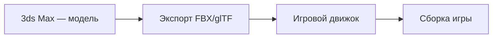

---
tags:
  - all
  - beginner
title: 3ds Max
description: "3ds Max (читают «три-дэ-эс макс», исторически от 3D Studio) — программа Autodesk для полигонального 3D, анимации и рендера."
  MAXScript, применение в играх и архитектуре, связь с Blender.
---

# 3ds Max

  ДЛЯ НОВИЧКОВ

Всем

**3ds Max** (читают «три-дэ-эс макс», исторически от **3D Studio**) — программа Autodesk для **полигонального 3D**, анимации и рендера. Используют в архитектурной визуализации, рекламе, телевизионной графике и при создании **игровых ассетов** (окружение, реквизит).

Путеводитель: [Инструменты и среды](/encyclopedia/1-basics/1-035-bazovaya-informatika/9). Развёрнутый обзор в линейке Autodesk: [отраслевое ПО — 3ds Max](/encyclopedia/9-spinoff/9-06-otraslevoe-po/112.md#3ds-max). Бесплатная альтернатива для обучения: [Blender](/encyclopedia/9-spinoff/9-08-kompyuternaya-grafika/131.md).

---

## Что умеет 3ds Max

| Область | Примеры |
|---------|---------|
| Моделирование | Полигоны, сплайны, модификаторы (Extrude, TurboSmooth) |
| Материалы и свет | Физически корректные материалы, Arnold/V-Ray |
| Анимация | Ключевые кадры, rig персонажей, MotionBuilder-интеграция |
| Рендер | Кадр или анимация в видео/последовательность картинок |
| Скрипты | **MAXScript**, Python API для автоматизации |

Сцена хранится в формате **`.max`**. Обмен с другими пакетами — через **FBX**, **OBJ**, **Alembic**.

---

## Интерфейс (кратко)

- **Viewport** — окна просмотра сцены (перспектива, сверху, спереди).
- **Command Panel** — создание объектов, модификаторы, иерархия.
- **Time Slider** — временная шкала анимации.
- **Material Editor** — настройка поверхностей.

Новичку достаточно освоить: перемещение/вращение/масштаб (W/E/R), примитив **Box** + модификатор **Edit Poly**, назначение материала, одна камера и один источник света, тестовый рендер.

---

## 3ds Max и игры

В студиях 3ds Max часто моделируют **уровни, здания, мебель**; персонажей иногда делают в **Maya** или **Blender**, затем экспортируют в движок (**Unity**, **Unreal**, **Godot**).

Пайплайн упрощённо:

Важно следить за **полигональным бюджетом** и размером текстур — см. [3D в играх](/encyclopedia/9-spinoff/9-04-razrabotka-igr/111.md).

---

## 3ds Max и Blender

| | 3ds Max | Blender |
|---|---------|---------|
| Лицензия | Платная (подписка Autodesk) | Бесплатно, GPL |
| Типичная аудитория | Студии, визуализаторы | Инди, образование, open source |
| Сильные стороны | Экосистема Autodesk, MAXScript | Полный конвейер в одном файле |

В школе на уроках информатики чаще упоминают **Blender** как доступный вариант; **3ds Max** полезно знать по названию как «студийный стандарт» рядом с Maya.

---

## Обучение и ресурсы

| Ресурс | Ссылка |
|--------|--------|
| Продукт | [autodesk.com/products/3ds-max](https://www.autodesk.com/products/3ds-max) |
| Документация | [help.autodesk.com — 3ds Max](https://help.autodesk.com/view/3DSMAX/) |
| Учебные лицензии | Часто через Autodesk Education |

---

## См. также

- [Paint.NET и CorelDRAW](./7.md)
- [3D-графика и анимация](/encyclopedia/9-spinoff/9-08-kompyuternaya-grafika/13.md)
- [Tinkercad](/encyclopedia/9-spinoff/9-11-dlya-detey/3-development/18.md) — простой 3D для детей

---
