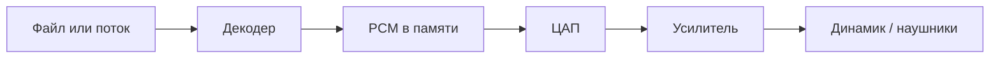

---
tags:
  - all
  - required
  - beginner
title: Как устроена музыка
description: >-
  Цифровая музыка для начинающего — PCM, форматы, DAW, MIDI, VST, домашняя студия,
  практика в BandLab и словарь терминов продюсера.
related:
  - title: Аудио и видео — обзор
    doc: encyclopedia/1-basics/1-17-audio-i-video/1
  - title: Аудиоввод и вывод
    doc: encyclopedia/1-basics/1-08-kak-rabotaet-kompyuter/715
  - title: Редактирование аудио и видео
    doc: encyclopedia/1-basics/1-17-audio-i-video/5
  - title: Форматы аудио и видео
    doc: encyclopedia/1-basics/1-17-audio-i-video/6
  - title: Аудиоинструменты
    doc: tools/multimedia/4
---

import ExternalPlayEmbed from '@site/src/components/ExternalPlayEmbed';

# Как устроена музыка

  ОБЯЗАТЕЛЬНО
  ДЛЯ НОВИЧКОВ

Всем

<ExternalPlayEmbed example="basics/sampling-theorem-play" title="Теорема отсчётов" />

Цифровая музыка — это файлы на диске, дорожки в [DAW](/glossary/D#daw) и короткие **сэмплы**, из которых собирают ритм. Ниже — путь от звуковой волны до готового трека, практика в [BandLab](https://www.bandlab.com/) и словарь терминов.

| Тема подробнее | Статья |
|----------------|--------|
| Кодеки, контейнеры, теорема отсчётов | [Обзор раздела](./1.md) |
| Микрофоны, наушники, ASIO | [Аудиоввод и вывод](./2.md) · [Оборудование](/encyclopedia/1-basics/1-08-kak-rabotaet-kompyuter/715) |
| EQ, компрессия, монтаж | [Редактирование](./5.md) |
| WAV, MP3, ffprobe | [Форматы](./6.md) |
| Каталог DAW и утилит | [Аудиоинструменты](/tools/multimedia/4) |

---

## Что такое музыка

**Музыка** — звук, выстроенный во времени. Слушатель слышит ритм, мелодию, гармонию и форму песни (куплет, припев, проигрыш). Компьютер хранит ту же музыку как **данные** — числа в файле, которые можно копировать, сжимать и отправить в интернет.

Почти любой релиз на Spotify или YouTube когда-то побывал в цифровой программе: запись с микрофона оцифровывают, правят, сводят дорожки и экспортируют в [MP3](./6.md) или [AAC](./6.md).

**Живой концерт** и **запись в файле** решают разные задачи:

- на сцене звук рождается здесь и сейчас, с энергетикой зала;
- в файле один и тот же микс звучит одинаково на телефоне, в наушниках и в машине;
- в [DAW](/glossary/D#daw) можно вырезать лишний шум, подправить ноту и собрать трек из сотен мелких фрагментов.

Оба подхода часто идут вместе: живую гитару или вокал записывают, а ударные и эффекты добавляют уже в программе.

---

## Звук как числа

В файле музыка — длинный ряд **чисел**. Каждое число описывает, насколько сильно в данный момент сжимается воздух у микрофона или динамика. Так звуковую **волну** переводят в **цифру** — процесс называют **оцифровкой**.

Стандартный формат хранения — **PCM** (Pulse Code Modulation, импульсно-кодовая модуляция). Его создаёт **АЦП** — аналого-цифровой преобразователь в звуковой карте или аудиоинтерфейсе. Три шага:

- **Дискретизация** — компьютер снимает "фото" громкости через равные промежутки (например, 44 100 раз в секунду).
- **Квантование** — каждому "фото" ставят в соответствие целое число (насколько громко в этот миг).
- **Кодирование** — числа записывают в файл как биты (нули и единицы).

Обратный путь при воспроизведении делает **ЦАП** — цифро-аналоговый преобразователь. Подробная теория — в [обзоре](./1.md#аудиосигнал).

### Параметры цифрового звука

| Параметр | Простыми словами | Обычные значения |
|----------|------------------|------------------|
| **Частота дискретизации** (sample rate) | Сколько измерений в секунду | 44,1 кГц (CD), 48 кГц (видео), 96 кГц (студия) |
| **Разрядность** (bit depth) | Сколько градаций громкости | 16 бит (CD), 24 бит (студийная запись) |
| **Битрейт** (bitrate) | Сколько данных в секунду | ~1,4 Мбит/с у несжатого стерео; 128–320 кбит/с у MP3 |

Несжатый стерео-поток:

`битрейт = частота × бит_на_отсчёт × число_каналов`

Пример CD: 44 100 × 16 × 2 ≈ **1,41 Мбит/с** — около 10 МБ на минуту.

---

## Форматы и сжатие

Чистый PCM занимает много места. Файл упаковывают в **контейнер** (WAV, MP3, FLAC), внутри которого лежит **кодек** — программа сжатия. Разница между расширением и кодеком — в [справочнике форматов](./6.md).

| Тип | Форматы | Что происходит |
|-----|---------|----------------|
| Без сжатия | WAV, AIFF | Точная копия PCM; архив и мастер |
| Lossless | FLAC, ALAC | Файл меньше, при открытии звук восстанавливается полностью |
| Lossy | MP3, AAC, Ogg Vorbis | Алгоритм убирает малослышимые детали; файл в разы легче |

  
Повторное сжатие MP3

  

  Если сохранить MP3 снова в MP3, качество обычно падает — вырезанные детали не вернуться. Мастер держите в WAV или FLAC, а в MP3 экспортируйте один раз для публикации.
  

**MIDI** (файл `.mid`) — особый случай. Внутри лежат **команды для инструмента**, а не готовая волна:

- какая нота;
- как долго держать;
- с какой силой нажать.

Размер файла маленький. Звук появляется только когда [DAW](/glossary/D#daw) или синтезатор **играет** эти команды — тембр зависит от выбранного плагина.

---

## Как мы это слышим

При нажатии Play цепочка выглядит так:

- Плеер или [стриминг](./4.md) читает файл или поток из сети.
- **Декодер** (для MP3/AAC) разворачивает сжатые данные обратно в PCM.
- **ЦАП** в телефоне, ноутбуке или наушниках строит электрический сигнал.
- Динамик качает воздух — снова слышна живая волна.

Итоговое качество зависит от исходного файла, от ЦАП и от наушников или акустики комнаты.

---

## Как создают музыку сегодня

Современный трек собирают в **DAW** — программе с дорожками, эффектами и кнопкой экспорта. Рядом работают **виртуальные инструменты** (синтезаторы, сэмплеры) и **плагины** (эквалайзер, реверб). Живой вокал или гитару при необходимости записывают микрофоном в ту же сессию.

### DAW — цифровая звуковая рабочая станция

[DAW](/glossary/D#daw) (Digital Audio Workstation) объединяет запись, монтаж, сведение и мастеринг. В одном проекте лежат все дорожки, настройки громкости и история правок.

| Программа | Где чаще применяют |
|-----------|-------------------|
| [FL Studio](https://www.image-line.com/), [Ableton Live](https://www.ableton.com/) | Электроника, биты, хип-хоп, лайв |
| [Logic Pro](https://www.apple.com/logic-pro/), [Cubase](https://www.steinberg.net/cubase/) | Поп, саундтреки |
| [Pro Tools](https://www.avid.com/pro-tools) | Большие студии, постпродакшн |
| [Reaper](https://www.reaper.fm/), [Ardour](https://ardour.org/) | Гибкая настройка, умеренная цена или open source |
| [LMMS](https://lmms.io/) | Электроника с нуля, бесплатно |
| [BandLab](https://www.bandlab.com/), [GarageBand](https://www.apple.com/mac/garageband/) | Быстрый старт в браузере или на телефоне |

Полный список — [Аудиоинструменты](/tools/multimedia/4).

### Дорожки MIDI и аудио

В DAW два основных типа материала:

**MIDI-дорожка** — набор нот и команд, без готового звука внутри.

- попадает через MIDI-клавиатуру, рисование в **Piano Roll** (редактор нот) или импорт `.mid`;
- управляет **виртуальным инструментом** — плагином, который и издаёт звук;
- одну мелодию можно переиграть роялем, синтезатором или струнными — достаточно сменить инструмент.

**Аудиодорожка** — уже записанная волна (PCM внутри проекта).

- попадает с микрофона, гитары или импортом WAV/MP3;
- проходит через [редактирование](./5.md) — обрезка, EQ, компрессия;
- подходит для вокала, живых инструментов и готовых сэмплов.

### Пять этапов трека

1. **Композиция** — придумать мелодию, аккорды и ритм.
2. **Аранжировка** — решить, где в песне звучат барабаны, бас, пэды; разметить интро, куплет, припев.
3. **Запись** — снять вокал, гитару, бэк-вокал поверх основы.
4. **Сведение** — выставить громкость и панораму каждой дорожки, добавить EQ и реверб, чтобы инструменты не спорили. См. [редактирование аудио](./5.md).
5. **Мастеринг** — финальная обработка всего микса: лимитер, громкость под [стриминг](./4.md) (часто ориентир **LUFS** — единая шкала громкости для Spotify и аналогов).

### Свои сэмплы из любого звука

Сильная сторона студийного софта — превратить бытовый шум в музыкальный материал. Удар по кастрюле, тряска коробки, щелчок по струне, шаг по паркету — всё это можно записать и встроить в трек.

**Sound design** (звуковой дизайн) — поиск и обработка таких звуков для музыки, игр и кино.

Типичный путь:

1. **Записать источник** — микрофон (хотя бы встроенный в телефон для черновика) → [аудиоинтерфейс](/encyclopedia/1-basics/1-08-kak-rabotaet-kompyuter/715) → DAW или [Audacity](/tools/multimedia/4).
2. **Обработать в редакторе** — обрезать тишину по краям, убрать гул (**EQ**), выровнять громкость (**нормализация**, **компрессия**), при желании сдвинуть высоту (**pitch shift**) или добавить эхо (**reverb**). Подробнее — [редактирование](./5.md).
3. **Получить one-shot** — короткий сэмпл на один удар, от доли секунды до пары секунд.
4. **Сложить в библиотеку** — папки по типу (ударные, фоли, атмосферы), понятные имена файлов. **Мультисэмпл** — набор записей одного инструмента с разной силой удара; сэмплер выбирает нужный слой.
5. **Собрать трек** — загрузить сэмплы в **сэмплер** ([Kontakt](https://www.native-instruments.com/en/products/komplete/samplers/kontakt-8/), Battery, встроенный Sampler в Ableton) или раскидать по аудиодорожкам. Десятки коротких звуков складываются в ритм и атмосферу, как детали конструктора.

В электронике и hip-hop так делают хруст винила, перкуссию из кухни, шуршание поверх синтезаторов. Готовые библиотеки экономят время; **свои** записи дают узнаваемый тембр, который не повторит чужой пресет.

В [BandLab](#bandlab-practice) для начала удобны встроенные киты. Следующий шаг — записать свой звук в WAV и перетащить на дорожку в [Reaper](/tools/multimedia/4), FL Studio или Ableton.

---

## Минимальная домашняя студия

Для старта достаточно компьютера и наушников. Мощная видеокарта не нужна; важны процессор и оперативная память — от **16 ГБ**, если планируете много плагинов одновременно.

| Устройство | Роль | Примеры |
|------------|------|---------|
| **Компьютер** | Запуск DAW и плагинов | Intel Core i5/i7, AMD Ryzen 5/7, Apple M1–M4 |
| **Аудиоинтерфейс** | Чистая запись с микрофона и гитары, низкая задержка | Focusrite Scarlett Solo, Arturia Minifuse |
| **Студийные наушники** | Ровная частотная кривая без "подкрученного" баса | Beyerdynamic DT 770 Pro, Audio-Technica ATH-M50x |
| **Мониторы** | Звук в комнате; нужна базовая акустика | KRK Rokit, Yamaha HS |
| **MIDI-клавиатура** | Ввод нот; звук генерирует компьютер | Akai MPK Mini, Arturia MicroLab |
| **Конденсаторный микрофон** | Вокал и акустическая гитара | Audio-Technica AT2020, Rode NT1-A |

Встроенная звуковая карта ноутбука подойдёт для экспериментов. Для записи голоса без фонового шума и щелчков лучше внешний интерфейс. Разъёмы XLR/TRS, **фантомное питание +48 V** и драйвер **ASIO** — в [главе про аудиооборудование](/encyclopedia/1-basics/1-08-kak-rabotaet-kompyuter/715).

---

## VST-плагины и синтезаторы

**VST** (Virtual Studio Technology) — формат модулей, которые подключаются к DAW. Инструменты и эффекты живут внутри проекта как отдельные программы.

### Виртуальные инструменты (VSTi)

| Тип | Принцип | Примеры |
|-----|---------|---------|
| **Сэмплер** | Воспроизводит записанный звук — рояль, барабан или ваша кастрюля | Kontakt, Battery |
| **Синтезатор** | Строит звук математически, без готовой записи | Serum, Vital, встроенные синты DAW |

**Субтрактивный синтез** — распространённая схема:

- **Осциллятор** — генератор волны (синус, пила, квадрат).
- **Фильтр** — убирает лишние частоты; **low-pass** смягчает верх, делая звук "темнее".
- **Огибающая ADSR** — как звук ведёт себя во времени после нажатия клавиши:
  - **Attack** — скорость нарастания;
  - **Decay** — спад до уровня удержания;
  - **Sustain** — громкость, пока клавиша нажата;
  - **Release** — затухание после отпускания.

### Эффекты (VST)

Эффекты меняют уже существующий сигнал:

- **EQ** (эквалайзер) — подъём или срез частот;
- **Компрессор** — сглаживает разницу между тихими и громкими участками;
- **Reverb** — имитация зала или комнаты;
- **Delay** — повтор сигнала с задержкой;
- **Лимитер** — не даёт сигналу превысить потолок громкости.

Пара **Dry/Wet** задаёт долю "сухого" и обработанного звука в смеси.

---

## Программы для старта

| Уровень | Программы | Особенность |
|---------|-----------|-------------|
| Проще всего | BandLab, GarageBand, Magix Music Maker | Лупы, перетаскивание блоков |
| Средний | FL Studio, Ableton Live | Пошаговый секвенсор, электроника |
| Полный цикл | Reaper, Logic, Cubase, Pro Tools | Запись, сведение, мастеринг |

- Собрать первый бит в браузере — [практика BandLab](#bandlab-practice) ниже.
- ИИ-музыка (Suno, Udio) — [нейроконтент](/encyclopedia/6-ai/6-07-vayb-koding-i-neurokontent/5).
- Звук в играх — [FMOD и Wwise](/encyclopedia/9-spinoff/9-04-razrabotka-igr/126).

---

## Первый бит в BandLab {#bandlab-practice}

[BandLab](https://www.bandlab.com/) — бесплатная онлайн-[DAW](/glossary/D#daw). Работает в браузере и на телефоне, проекты хранятся в облаке. Ниже — регистрация, дорожка **драм-машины**, кит **Boom Bap** и прослушивание результата.

### Регистрация и новый проект

1. Откройте [bandlab.com](https://www.bandlab.com/).
2. **Sign up** / **Зарегистрироваться** — почта, Google или Apple ID.
3. Подтвердите e-mail, если сервис запросит.
4. **Create** → **New Project** (или **+** → **Song**).

При первом входе BandLab может показать короткий тур — где Play, как добавить дорожку, что такое **луп** (повторяющийся фрагмент). Тур занимает несколько минут; его можно пропустить и открыть **Help** позже.

### Темп и размер такта

Вверху по центру задают параметры ритма:

- **BPM** (beats per minute) — сколько ударов метронома в минуту. Для примера поставьте **125**; классический boom bap часто медленнее, 85–95 BPM.
- **Размер 4/4** — в такте четыре доли; счёт "раз-два-три-четыре".
- **Тональность** — для одних ударных не обязательна.

Слева — список **дорожек** (tracks). Каждая дорожка — отдельный инструмент или запись.

### Дорожка "Драм-машина"

1. **+** (Add Track) → **Драм-машина** (Drum Machine).
2. Внизу откроется **step-секвенсор** — сетка, где каждая клетка это один удар в нужный момент времени.
3. Дорожка хранит **MIDI-команды**; звук даёт выбранный **кит** (набор ударных).

Не путайте с дорожкой **Audio** — туда попадают готовые записи с микрофона.

### Кит Boom Bap

В редакторе внизу:

1. В списке инструментов выберите **Boom Bap** — набор в духе классического hip-hop с плотным **kick** (бас-барабан) и резким **snare** (малый или хлопок).
2. Длина паттерна — **1 такт**; позже можно удлинить.
3. Слоты **A**, **B**, **C**… — отдельные варианты ритма внутри одной дорожки; для старта хватит **A** или **B**.

На скриншоте — кит Boom Bap, паттерн B, один такт, свинг 0%.

### Расстановка ударов

Строки — разные звуки (kick, snare, hi-hat). Столбцы — доли такта (1.1, 1.2, 1.3, 1.4).

- клик по клетке — включить удар (зелёный блок);
- повторный клик — выключить.

Простой паттерн для начала:

| Звук | Куда ставить |
|------|--------------|
| **Kick** | доли 1.1 и 1.3 ("раз" и "три") |
| **Snare** или clap | доли 1.2 и 1.4 ("два" и "четыре") |
| **Hi-hat** | каждую долю или через одну |

Зелёный клип **Drum Machine** на таймлайне можно **растянуть** — паттерн будет повторяться на нескольких тактах.

### Прослушивание

1. Перемотайте к началу (такт 1).
2. **▶ Play** или пробел.
3. Слайдер слева — громкость дорожки; **S** (solo) — слышна только она; **M** (mute) — дорожка выключена.

На скриншоте также видно:

- **Fx Wooden Room** — лёгкий **reverb** ("комната"); для сухого бита эффект отключают;
- пунктир **loop** между тактами 1 и 8 — участок зацикливания;
- зона "перетащите луп" — сюда можно добавить файл из **BandLab Sounds**.

*Рис. 1 — транспорт и BPM сверху, дорожки слева, секвенсор снизу. Зелёные блоки — запрограммированные удары.*

### После первого бита

- **Бас** — дорожка Bassline или MIDI с низким синтом.
- **Мелодия** — Virtual Instrument и Piano Roll.
- **Экспорт** — Download (WAV/MP3) или Publish в ленте BandLab.
- **Рост** — тот же приём дорожек и сетки в [FL Studio](/tools/multimedia/4) или Ableton, с большим выбором плагинов.

Если звука нет — разрешите воспроизведение для вкладки в настройках браузера.

---

## Время и ритм

| Термин | Значение |
|--------|----------|
| **Бит (beat)** | Один удар пульса; то, что отбивают ногой |
| **BPM** | Темп — ударов в минуту |
| **Такт (bar)** | Отрезок времени; в поп-музыке часто 4 доли |
| **Доля** | Часть такта; в 4/4 одна четверть = одна доля |
| **Сетка (grid)** | Вертикальные линии в DAW для точного ритма |
| **Квантование** | Автосдвиг нот к ближайшей линии сетки |
| **Swing** | Смещение долей для "кача" |
| **Метроном** | Щелчки под BPM при записи |
| **Downbeat** | Первая, сильная доля такта |
| **Off-beat** | Между сильными долями |

---

## Структура трека и дорожки

| Термин | Значение |
|--------|----------|
| **Луп** | Повторяющийся фрагмент на 2–8 тактов |
| **Сэмпл** | Короткая аудиозапись — удар, фраза, шум |
| **Паттерн** | Собранный в программе кусок ритма или мелодии |
| **Дорожка** | Одна линия под инструмент |
| **Микшер** | Пульт громкости и эффектов |
| **Шина (bus)** | Общая обработка группы дорожек |
| **Send** | Посыл части сигнала на reverb или delay |
| **Sidechain** | Один звук управляет громкостью другого |
| **Стем** | Экспорт одной группы (только барабаны и т.д.) |
| **Bounce** | Сведение выбранных дорожек в один файл |
| **Куплет / припев** | Основные части песни |
| **Drop** | Момент максимальной энергии в электронике |

---

## Мелодия, гармония, звук

| Термин | Значение |
|--------|----------|
| **Мелодия** | Цепочка нот во времени |
| **Гармония** | Несколько нот одновременно |
| **Аккорд** | Три и более нот вместе |
| **Тональность** | Набор нот, из которых строится трек |
| **Kick / snare / hi-hat** | Бас-барабан, малый, тарелки |
| **Саб-бас** | Очень низкие частоты, 40–80 Гц |
| **Пэд** | Длинный фоновый слой синтезатора |
| **Слоение** | Несколько звуков на одной партии |

---

## Запись, сведение, мастеринг

| Термин | Значение |
|--------|----------|
| **Клиппинг** | Искажение от слишком громкого сигнала |
| **Панорама** | Положение звука слева, по центру или справа |
| **Моно** | Один канал |
| **Стерео** | Левый и правый каналы |
| **LUFS** | Шкала громкости для стриминга |
| **Компрессия** | Сближение тихих и громких участков |
| **Акапелла** | Только голос |
| **Дубль (take)** | Одна попытка записи |

---

## MIDI и плагины

| Термин | Значение |
|--------|----------|
| **MIDI** | Команды нот, не аудиофайл |
| **Velocity** | Сила нажатия 0–127 |
| **Piano Roll** | Редактор нот на временной шкале |
| **Секвенсор** | Пошаговая запись ударов и нот |
| **Preset** | Сохранённая настройка синтезатора |
| **VSTi** | Виртуальный инструмент |
| **AU / AAX** | Форматы плагинов на macOS и в Pro Tools |

---

## Права на сэмплы

| Термин | Значение |
|--------|----------|
| **Royalty-free** | Лицензия без отчислений за каждый стрим — условия читайте в договоре |
| **Клеаринг** | Юридическое разрешение на чужую запись |
| **ISRC** | Код трека для дистрибуции на стриминг |

---

## Дальше

| Тема | Статья |
|------|--------|
| Кодеки и HDR | [Обзор](./1.md) |
| Микрофоны и интерфейсы | [Аудиоввод](./2.md) · [Оборудование](/encyclopedia/1-basics/1-08-kak-rabotaet-kompyuter/715) |
| Монтаж и эффекты | [Редактирование](./5.md) |
| Форматы файлов | [Форматы](./6.md) |
| Софт | [Аудиоинструменты](/tools/multimedia/4) |
| Игровой звук | [FMOD и Wwise](/encyclopedia/9-spinoff/9-04-razrabotka-igr/126) |
| ИИ-музыка | [Нейроконтент](/encyclopedia/6-ai/6-07-vayb-koding-i-neurokontent/5) |

---
