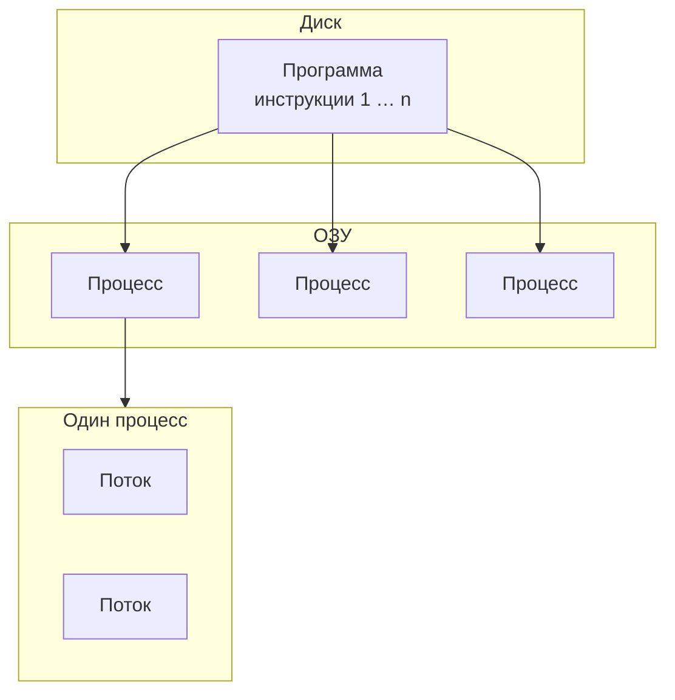
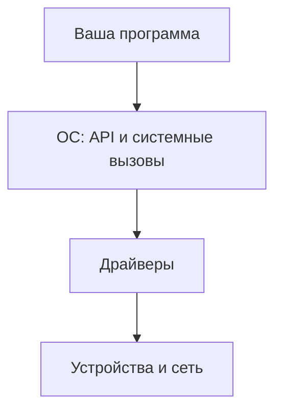
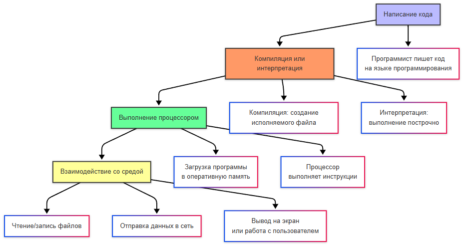

---
tags:
  - all
  - required
  - beginner
title: Что такое программа?
description: Определение программы как набора инструкций для компьютера.
---

import ExternalPlayEmbed from '@site/src/components/ExternalPlayEmbed';


# Что такое программа?

<div class="article-tags">
  <span class="tag tag-required">ОБЯЗАТЕЛЬНО</span>
  <span class="tag tag-beginner">ДЛЯ НОВИЧКОВ</span>
</div>

<span class="complexity-badge">Всем</span>

---

Вы открываете браузер, вводите адрес сайта и видите страницу — за этим привычным жестом стоит **программа**: набор инструкций, которые [операционная система](/encyclopedia/2-system-network/2-01-operatsionnaya-sistema/intro) загружает в память и передаёт процессору. Ниже — как устроена эта цепочка от текста разработчика до работающего процесса, без необходимости сразу запоминать все термины.

<div class="callout callout--info">
  <div class="callout-title">Куда идти дальше по разделу</div>

  <div class="callout-body">
  Практика «как нажать Run, не закрыть терминал с dev-сервером» — [Запуск и перезапуск приложений](/encyclopedia/1-basics/1-12-sovety-dlya-novichka/13). После этой статьи удобно пройти [ПО и операционную систему](/encyclopedia/1-basics/1-19-programma/111), [классификацию программ](/encyclopedia/1-basics/1-19-programma/112) и [взаимодействие с ОС](/encyclopedia/1-basics/1-19-programma/115).

  Про файлы `.exe`, ELF и упаковку — в разделе [Исполняемые файлы и архивы](/encyclopedia/1-basics/1-20-ispolnyaemye-fayly-i-arhivy/intro); про устройство ПК — [Как работает компьютер](/encyclopedia/1-basics/1-08-kak-rabotaet-kompyuter/intro).
</div>
  </div>


---

## Что такое программа?

### Понятие программы

★ **Программа** — набор инструкций (или исходный код, из которого эти инструкции получаются), описывающих, *что* должен сделать компьютер. На диске это файл; во время работы — **процесс** в памяти под управлением ОС. Программа обычно реализует [алгоритм](/glossary/А#алгоритм) — последовательность шагов для решения задачи.

В нормативных текстах различают **исполняемую программу** (инструкции + данные для аппаратуры) и **исходный текст** (запись на языке программирования по правилам синтаксиса). В системном программировании под программой иногда понимают именно данные в памяти, которые процессор трактует как команды — отличительный признак в том, что такой блок **находится в памяти и исполняется**.

| Уровень описания | Формулировка |
|------------------|--------------|
| Повседневная | «Программа» = приложение или файл, который можно запустить |
| Инженерная | Инструкции + данные; на диске — образ, в RAM — процесс |
| Правовая (РФ) | Программа для ЭВМ — данные и команды в объективной форме для результата на компьютере (ГК РФ, ст. 1261) |

**Простой пример.** Текстовый редактор хранится на диске как исполняемый файл. При запуске ОС выделяет память, создаёт процесс и передаёт управление первой инструкции программы. Пока вы печатаете, процессор выполняет миллионы команд в секунду — отрисовка символа, реакция на клавишу, запись файла через [системный вызов](/encyclopedia/1-basics/1-19-programma/115). Один и тот же файл на диске может породить несколько процессов, если вы запустите программу дважды — у каждого будет своя копия данных в памяти.

Языки, на которых пишут исходный код, разобраны в разделе [Основные языки](/encyclopedia/1-basics/1-24-osnovnye-yazyki/intro) — здесь важнее путь от текста к исполнению.

**Создание ПО** в целом включает анализ задачи, проектирование, кодирование, тестирование и сопровождение. Собственно **программирование** — этап написания и правки исходных текстов; в разговорной речи «программированием» часто называют весь цикл разработки. Запись на [языках программирования](/encyclopedia/1-basics/1-24-osnovnye-yazyki/6) облегчает чтение человеком; **комментарии** в синтаксисе большинства языков поясняют замысел, не участвуя в исполнении. Программы создают **текстом** (редактор, IDE) или **визуально** (блоки, формы) — во втором случае среда может генерировать код автоматически.

<div class="callout callout--tip">
  <div class="callout-title">Внимание</div>

  <div class="callout-body">
  Дальше появятся термины вроде ISA, байт-код и системный вызов. Их не нужно запоминать сразу — в разделе они будут повторяться, а подробный разбор компиляции — в статье <a href="/encyclopedia/1-basics/1-19-programma/2">Компиляторы и интерпретаторы</a>.
</div>
  </div>


---

### Файл, программа и процесс

| Понятие | Что это |
|--------|---------|
| **Исходный код** | Текст на языке программирования (`main.py`, `App.java`) |
| **Исполняемый файл / артефакт** | То, что запускает ОС: `.exe`, ELF, `.jar`, байт-код + интерпретатор |
| **Программа (логически)** | Описание поведения: алгоритм + данные |
| **Процесс** | Экземпляр программы в работе: память, открытые файлы, потоки |


<span id="programma-protsess-potok"></span>

### Программа, процесс и поток

Три понятия часто смешивают. Их удобно выстроить в цепочку **от файла на диске до параллельной работы внутри одного приложения**.

| Уровень | Где «живёт» | Суть |
|---------|-------------|------|
| **Программа** (*program*) | Диск (энергонезависимая память) | Статический набор инструкций — `instruction 1`, `instruction 2`, … `instruction n`. Пока файл не запущен, процессор его не выполняет |
| **Процесс** (*process*) | [ОЗУ](/encyclopedia/1-basics/1-08-kak-rabotaet-kompyuter/3) | Запущенный **экземпляр** программы: образ в памяти, открытые файлы, права, учёт в диспетчере задач (CPU, RAM) |
| **Поток** (*thread*) | Внутри одного процесса | **Наименьшая** единица выполнения, которую планировщик ОС обычно назначает на ядро; потоки одного процесса делят код и данные, у каждого свой стек |

**В быту.** Иконка Word на диске — **программа**. Строка «Microsoft Word» в диспетчере задач с загрузкой CPU и объёмом памяти — **процесс**. Отрисовка окна, пока фоном сохраняется файл, — часто разные **потоки** одного процесса.

Один файл программы на диске может породить **несколько процессов** (дважды открыли браузер — два процесса с одним `.exe`). Один процесс может содержать **несколько потоков**, которые выполняют разные задачи и координируются через общую память.



Планировщик ОС переключает процессы и потоки на процессоре — отсюда [многозадачность](/encyclopedia/4-code-dev/4-05-asinhronnost/1) и ощущение, что «всё работает сразу». Когда нужно ускорить вычисления на нескольких ядрах, смотрят [параллельные вычисления](/encyclopedia/4-code-dev/4-16-parallelnye-vychisleniya/1); поведение процессов и потоков в приложении — [Поведение программ](/encyclopedia/1-basics/1-19-programma/113#zadachi-i-mnogozadachnost).

<div class="callout callout--tip">
  <div class="callout-title">Английские термины в документации</div>

  <div class="callout-body">
  В статьях и API часто встречаются пары <strong>program / process / thread</strong>. Смысл тот же: файл с инструкциями → работающая копия в RAM → нити исполнения внутри копии.
</div>
</div>

---

## Как работает программа?

### Написание кода

Программист пишет код на [языке программирования](/encyclopedia/1-basics/1-24-osnovnye-yazyki/intro) (к примеру, Java). Этот код состоит из команд более высокого уровня — объявлений переменных, циклов, вызовов функций. Компьютер их напрямую не читает: сначала код проходит через компилятор или интерпретатор (см. ниже), и только затем превращается в машинные инструкции.

Типичный фрагмент на Python и его смысл для человека:

```python
total = 0
for price in [100, 250, 40]:
    total += price
print(total)  # 390
```

Тот же смысл на уровне процессора — тысячи операций загрузки, сложения и сравнения в регистрах. Разработчик оперирует абстракциями; транслятор и ОС берут на себя детали железа — см. [Как работает компьютер](/encyclopedia/1-basics/1-08-kak-rabotaet-kompyuter/1).

★ **Инструкция** — элементарная команда для процессора, записанная на машинном языке. Инструкция — это атомарное действие, которое процессор способен выполнить за один такт или за несколько тактов своей работы. Примеры таких действий:  
- сложить два числа,  
- перенести данные из одной ячейки памяти в другую,  
- сравнить два значения,  
- перейти к другой инструкции в зависимости от условия.

Инструкции имеют строгую структуру: код операции (что делать) и операнды (с чем делать). Совокупность инструкций образует машинный код — программу, понятную напрямую аппаратному обеспечению. Современные процессоры поддерживают тысячи разных инструкций, объединённых в так называемый *набор команд* (Instruction Set Architecture, ISA). Архитектуры x86, ARM, RISC-V — это разные наборы инструкций, определяющие, какие действия может выполнять процессор.

Программист редко пишет инструкции вручную — вместо этого он использует языки программирования более высокого уровня, которые транслируются в инструкции автоматически. Но каждая строчка высокоуровневого кода в конечном счёте становится цепочкой таких инструкций.

★ **Команда** — термин, родственный инструкции, но употребляемый чаще на уровне пользователя или системного администрирования. Команда — это запрос к программе или операционной системе, выполненный через интерфейс: текстовую строку в терминале, графическую кнопку, голосовой ввод или HTTP-запрос.  

Команда может быть простой — `ls` в Linux, `dir` в Windows — и вызывает готовую утилиту для отображения содержимого папки.  

Команда может быть составной — `git commit -m "Fix login"` — и запускает последовательность действий в системе контроля версий:

- подготовку изменений;
- создание коммита;
- запись сообщения.

Команда может содержать параметры и флаги: в Linux/macOS `ping -c 4 google.com` — ровно 4 пакета; в Windows — `ping -n 4 google.com`.

В отличие от инструкций, команды не привязаны к машинному коду. Они интерпретируются оболочкой (shell), интерпретатором, приложением или API-сервером — и лишь затем превращаются в инструкции, если требуется выполнение на процессоре.

Команды — основа взаимодействия человека с программным миром. Даже нажатие кнопки в графическом интерфейсе технически сводится к исполнению команды — "открыть окно", "сохранить файл", "отправить сообщение". В [терминале](/encyclopedia/2-system-network/2-05-terminal/intro) те же идеи видны явно: вы вводите строку, оболочка передаёт её программе или встроенной утилите.

---

### Компиляция или интерпретация

Исходный код — человекочитаемый текст. Чтобы процессор его выполнил, нужен перевод в инструкции или в код **виртуальной машины** (VM). На практике часто смешивают оба подхода.

| Подход | Суть | Примеры |
|--------|------|---------|
| **Нативная компиляция** | Исходник → машинный код (через объектные файлы и линковку) | C, C++, Rust, Go |
| **Компиляция в байт-код** | Исходник → промежуточный формат, дальше VM | Java (`.class`), C# (IL), Python (`.pyc`) |
| **Интерпретация** | Среда читает код (или байт-код) и выполняет в runtime | Python, Node.js, Bash; REPL в браузере |

**Важно:** Java и C# *компилируются*, но обычно не сразу в инструкции x86/ARM — сначала в байт-код, который JVM или CLR исполняет (интерпретация и/или JIT). Полностью "заранее в `.exe`" — типичный путь для C/C++/Rust.

Полный путь Java-программы — от `.java` через `javac` и `.class` до Class Loader, Verifier и JIT — в [Основы языка Java](/encyclopedia/5-languages/5-03-java/1#put-isxodnika-do-zapuska).

Пример интерпретируемого запуска:

```python
# hello.py
print("Hello")
```

```bash
python hello.py   # интерпретатор загружает файл и выполняет
```

Пример нативной сборки:

```c
// hello.c
#include <stdio.h>
int main(void) { printf("Hello\n"); return 0; }
```

```bash
gcc hello.c -o hello    # компиляция + линковка → исполняемый файл
./hello                 # ОС создаёт процесс и передаёт управление CPU
```

<ExternalPlayEmbed example="about/compiler-simulator" title="Compiler Simulator" />

Подробно: [Компиляторы и интерпретаторы](/encyclopedia/1-basics/1-19-programma/2).

---

#### Компиляция

★ **Компиляция** — преобразование исходного кода *до* запуска: в машинный код (`.exe`, ELF) или в промежуточный артефакт (байт-код, IL). Результат — файл или набор файлов, которые ОС или VM загружает при старте программы.

Процесс выглядит так:  
1. Программист пишет код (например, на C++).  
2. Компилятор анализирует его — проверяет синтаксис, типы данных, зависимости.  
3. Генерирует машинный код, оптимизированный под целевую архитектуру.  
4. Связывает с библиотеками.  
5. Формирует итоговый исполняемый файл.

Преимущества компиляции:  
- высокая производительность (код уже готов к выполнению),  
- возможность глубокой оптимизации,  
- скрытие исходного кода от конечного пользователя.

Языки с компиляцией: C, C++, Rust, Go (частично), C# (в .NET — JIT-компиляция, но всё равно этап компиляции присутствует).

---

#### Интерпретация

★ **Интерпретация** — процесс выполнения исходного кода *по мере чтения*, строка за строкой, с помощью специальной программы — интерпретатора. Исходный код не превращается в отдельный исполняемый файл. Вместо этого интерпретатор загружает текст программы в память и выполняет его в реальном времени.

Этапы интерпретации:  
1. Программист пишет код (например, на Python).  
2. Запускает `python script.py`.  
3. Интерпретатор читает первую строку, разбирает её, выполняет действие.  
4. Переходит ко второй строке — и так до конца.

Преимущества интерпретации:  
- мгновенный запуск без этапа сборки,  
- гибкость — можно изменить код и сразу увидеть результат,  
- удобство отладки и экспериментов.

Языки, где доминирует интерпретация/VM: Python, Ruby, PHP, Bash; JavaScript в Node.js и в браузере (движок V8 и др.).

Современные системы часто используют гибридные подходы. Например, Java компилируется в *байт-код* (промежуточный формат), который затем интерпретируется или компилируется JIT (*Just-In-Time*) виртуальной машиной (JVM). C# работает аналогично в среде .NET. Такие подходы сочетают преимущества обоих методов.

Главное различие: 
- **компиляция — это подготовка кода к выполнению заранее**;
- **интерпретация — это выполнение кода в процессе чтения**.

---

### Выполнение процессором

Программа загружается в [оперативную память](/encyclopedia/1-basics/1-08-kak-rabotaet-kompyuter/3), и процессор выполняет указанные инструкции шаг за шагом. Скорость и объём RAM ограничивают, сколько программ можно держать "в работе" одновременно — об этом подробнее в статье про [поведение программ](/encyclopedia/1-basics/1-19-programma/113).

★ **Выполнение программы** — процесс, при котором процессор последовательно обрабатывает инструкции программы, загруженной в оперативную память. Это динамическое состояние: программа переходит от "набора инструкций на диске" к "активной задаче в системе".

Этапы выполнения:  
1. **Загрузка** — операционная система копирует исполняемый файл (или байт-код) из постоянного хранилища (жёсткий диск, SSD) в оперативную память.  
2. **Инициализация** — выделяется память для стека, кучи, глобальных переменных; загружаются динамические библиотеки; подготавливается среда выполнения (например, виртуальная машина Java).  
3. **Начало работы** — процессор передаёт управление первой инструкции точки входа (обычно функция `main()` или её аналог).  
4. **Цикл выполнения** (*поток выполнения* на уровне CPU) — процессор повторяет три действия, которые в учебниках связывают с [диспетчером операционной системы](https://ru.wikipedia.org/wiki/%D0%94%D0%B8%D1%81%D0%BF%D0%B5%D1%82%D1%87%D0%B5%D1%80_%D0%BE%D0%BF%D0%B5%D1%80%D0%B0%D1%86%D0%B8%D0%BE%D0%BD%D0%BD%D0%BE%D0%B9_%D1%81%D0%B8%D1%81%D1%82%D0%B5%D0%BC%D1%8B) и [планировщиком](https://ru.wikipedia.org/wiki/%D0%9C%D0%BD%D0%BE%D0%B3%D0%BE%D0%B7%D0%B0%D0%B4%D0%B0%D1%87%D0%BD%D0%BE%D1%81%D1%82%D1%8C): пока у процесса есть квант времени на ядре, он выполняет инструкции; по истечении кванта ОС сохраняет [контекст](https://ru.wikipedia.org/wiki/%D0%9F%D0%B5%D1%80%D0%B5%D0%BA%D0%BB%D1%8E%D1%87%D0%B5%D0%BD%D0%B8%D0%B5_%D0%BA%D0%BE%D0%BD%D1%82%D0%B5%D0%BA%D1%81%D1%82%D0%B0) и отдаёт CPU другому потоку.  
   - *Выборка* — считывает следующую инструкцию по адресу из [счётчика команд](https://ru.wikipedia.org/wiki/%D0%A0%D0%B5%D0%B3%D0%B8%D1%81%D1%82%D1%80_%D0%BF%D1%80%D0%BE%D1%86%D0%B5%D1%81%D1%81%D0%BE%D1%80%D0%B0) (регистр PC);  
   - *Декодирование* — определяет, какую **машинную операцию** выполнить и с какими операндами;  
   - *Исполнение* — выполняет операцию (сложение, переход, запись в память и т.д.).

На уровне языка **оператор** (`if`, `for`, присваивание) — элемент синтаксиса; он компилируется в длинную цепочку машинных операций и вызовов. См. [условные операторы](/encyclopedia/4-code-dev/4-03-vypolnenie-koda/114), [потоки и процессы](/encyclopedia/4-code-dev/4-05-asinhronnost/1).  
5. **Завершение** — программа достигает конца или вызывает команду `exit`; операционная система освобождает занятые ресурсы (память, дескрипторы файлов, сетевые соединения).

Во время выполнения программа может:  
- взаимодействовать с пользователем (ввод/вывод),  
- читать и записывать файлы,  
- отправлять и получать данные по сети,  
- запускать другие программы,  
- создавать новые потоки или процессы.

Выполнение — это живой процесс, в котором участвуют: процессор, память, дисковая подсистема, сетевая карта, устройства ввода-вывода, системные службы и планировщик операционной системы. Программа существует во времени — с началом, развитием и концом.

---

### Среда выполнения, библиотеки и подпрограммы

На этапе **инициализации** (см. выше) подключается не только ОС, но и **среда выполнения** (*runtime environment*) — набор сервисов, без которых программа на языке высокого уровня не доведёт исполнение до конца. Сюда входят загрузчик модулей, управление памятью (в том числе [сборка мусора](/encyclopedia/4-code-dev/4-06-arhitektura-vypolneniya/1#сборка-мусора)), обработка исключений, планирование потоков и доступ к вводу-выводу. Для Java это [JVM](https://ru.wikipedia.org/wiki/Java_Virtual_Machine), для .NET — [CLR](https://ru.wikipedia.org/wiki/Common_Language_Runtime), для Python — интерпретатор CPython и его внутренняя VM.

| Понятие | Суть | Пример |
|---------|------|--------|
| **Среда выполнения** | Программная платформа, на которой исполняется уже собранный или интерпретируемый код | JVM, CLR, Node.js runtime |
| **Библиотека** | Готовый модуль кода, подключаемый к программе ([стандартная](https://ru.wikipedia.org/wiki/%D0%91%D0%B8%D0%B1%D0%BB%D0%B8%D0%BE%D1%82%D0%B5%D0%BA%D0%B0_(%D0%BF%D1%80%D0%BE%D0%B3%D1%80%D0%B0%D0%BC%D0%BC%D0%B8%D1%80%D0%BE%D0%B2%D0%B0%D0%BD%D0%B8%D0%B5)) или сторонняя) | `libc`, `java.base`, NuGet-пакет |
| **Библиотека среды выполнения** | Часть runtime, общая для многих приложений на платформе | [Runtime library](https://ru.wikipedia.org/wiki/%D0%91%D0%B8%D0%B1%D0%BB%D0%B8%D0%BE%D1%82%D0%B5%D0%BA%D0%B0_%D1%81%D1%80%D0%B5%D0%B4%D1%8B_%D0%B2%D1%8B%D0%BF%D0%BE%D0%BB%D0%BD%D0%B5%D0%BD%D0%B8%D1%8F) — ввод-вывод, строки, запуск процесса |
| **Подпрограмма** | Именованный фрагмент кода с одной точкой входа; вызывается из других мест ([подпрограмма](https://ru.wikipedia.org/wiki/%D0%9F%D0%BE%D0%B4%D0%BF%D1%80%D0%BE%D0%B3%D1%80%D0%B0%D0%BC%D0%BC%D0%B0)) | функция, метод, процедура |
| **Объектный модуль** | Результат компиляции одного исходного файла до линковки ([объектный модуль](https://ru.wikipedia.org/wiki/%D0%9E%D0%B1%D1%8A%D0%B5%D0%BA%D1%82%D0%BD%D1%8B%D0%B9_%D0%BC%D0%BE%D0%B4%D1%83%D0%BB%D1%8C)) | `main.o`, `.obj`, несвязанный `.class` в цепочке сборки |

★ **Подпрограмма** в учебниках — обобщение для *процедуры* (без возвращаемого значения) и *функции* (с результатом). В современных языках чаще говорят «функция» или «метод», но идея та же: один раз описали логику, много раз вызывают по имени, а стек запоминает, куда вернуться. Цепочки вызовов — в [Вызовы и иерархия](/encyclopedia/4-code-dev/4-06-arhitektura-vypolneniya/113).

При **нативной компиляции** компилятор выдаёт [объектные модули](https://ru.wikipedia.org/wiki/%D0%9E%D0%B1%D1%8A%D0%B5%D0%BA%D1%82%D0%BD%D1%8B%D0%B9_%D0%BC%D0%BE%D0%B4%D1%83%D0%BB%D1%8C); **компоновщик** (линкер) собирает их и библиотеки в один исполняемый файл. При **байт-коде** роль «модуля» играет `.class`, `.dll` с IL или `.pyc` — их загружает VM. Подробный конвейер — в [Компиляторы и интерпретаторы](/encyclopedia/1-basics/1-19-programma/2) и [Исполнение байт-кода](/encyclopedia/4-code-dev/4-03-vypolnenie-koda/314).

**Промежуточное представление** (*intermediate representation*, IR) — машинно-независимый слой между исходником и целевым кодом: трёхадресный код, SSA, байт-код JVM, CIL в .NET. Исторически байт-код Pascal называли [**P-код**](https://ru.wikipedia.org/wiki/P-%D0%BA%D0%BE%D0%B4) — тот же приём «один раз скомпилировать, исполнять на разных машинах через интерпретатор». Современные IR и VM — в [выполнении байт-кода](/encyclopedia/4-code-dev/4-03-vypolnenie-koda/314) и в [Компиляторы и интерпретаторы](/encyclopedia/1-basics/1-19-programma/2) (этап IR в конвейере компиляции).

---

### Взаимодействие со средой

Программа читает и пишет [файлы](/encyclopedia/1-basics/1-10-bazovye-operatsii-s-dannymi/intro), общается по [сети](/encyclopedia/2-system-network/2-03-set-i-internet/intro), показывает интерфейс и принимает ввод — через **ОС**: системные вызовы, драйверы, API. Прямой доступ к диску или сетевой карте у обычного приложения закрыт: так ОС защищает данные и стабильность системы.





★ **Окружение программы** (конфигурация и внешний мир) — файлы, устройства, другие процессы, службы, переменные среды (`%TEMP%`, `LANG`), сеть. Это шире, чем **среда выполнения** в смысле JVM/CLR: последняя — программная платформа внутри процесса, окружение — всё, с чем процесс взаимодействует снаружи. Конфигурация часто лежит в `config.json`; временные данные — в каталоге из переменных среды.

Изоляция процессов даёт **безопасность** (чужая память недоступна), **портативность** (один API на разных машинах) и **стабильность** (падение одного приложения не роняет всю систему). Подробнее — в статье [Взаимодействие программ с ОС](/encyclopedia/1-basics/1-19-programma/115).

---
