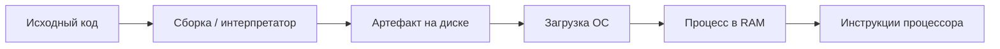
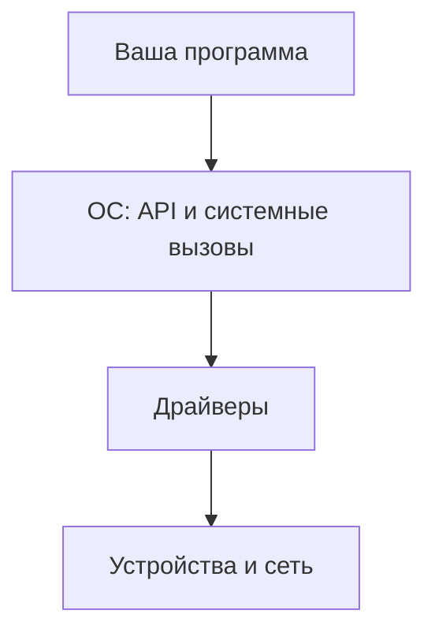

---
tags:
  - all
  - required
  - beginner
title: Что такое программа?
description: Определение программы как набора инструкций для компьютера.
---

import CompilerSimulator from '@site/src/components/CompilerSimulator.jsx';

# Что такое программа?

<div class="article-tags">
  <span class="tag tag-required">ОБЯЗАТЕЛЬНО</span>
  <span class="tag tag-beginner">ДЛЯ НОВИЧКОВ</span>
</div>

<span class="complexity-badge">Всем</span>

---

## Что такое программа?

### Понятие программы

★ **Программа** — набор инструкций (или исходный код, из которого эти инструкции получаются), описывающих, *что* должен сделать компьютер. На диске это файл; во время работы — **процесс** в памяти под управлением ОС. Программа обычно реализует [алгоритм](/glossary/А#алгоритм) — последовательность шагов для решения задачи.

<div class="callout callout--tip">
  <div class="callout-title">Внимание</div>
  Дальше появятся термины вроде ISA, байт-код и системный вызов. Их не нужно запоминать сразу — в разделе они будут повторяться, а подробный разбор компиляции — в статье <a href="/encyclopedia/1-basics/1-19-programma/2">Компиляторы и интерпретаторы</a>.
</div>

---

### Файл, программа и процесс

| Понятие | Что это |
|--------|---------|
| **Исходный код** | Текст на языке программирования (`main.py`, `App.java`) |
| **Исполняемый файл / артефакт** | То, что запускает ОС: `.exe`, ELF, `.jar`, байт-код + интерпретатор |
| **Программа (логически)** | Описание поведения: алгоритм + данные |
| **Процесс** | Экземпляр программы в работе: память, открытые файлы, потоки |



---

## Как работает программа?

### Написание кода

Программист пишет код на соответствующем языке программирования (к примеру, Java). Этот код состоит из набора команд, которые компьютер в конечном итоге должен выполнить.

★ **Инструкция** — элементарная команда для процессора, записанная на машинном языке. Инструкция — это атомарное действие, которое процессор способен выполнить за один такт или за несколько тактов своей работы. Примеры таких действий:  
- сложить два числа,  
- перенести данные из одной ячейки памяти в другую,  
- сравнить два значения,  
- перейти к другой инструкции в зависимости от условия.

Инструкции имеют строгую структуру: код операции (что делать) и операнды (с чем делать). Совокупность инструкций образует машинный код — программу, понятную напрямую аппаратному обеспечению. Современные процессоры поддерживают тысячи разных инструкций, объединённых в так называемый *набор команд* (Instruction Set Architecture, ISA). Архитектуры x86, ARM, RISC-V — это разные наборы инструкций, определяющие, какие действия может выполнять процессор.

Программист редко пишет инструкции вручную — вместо этого он использует языки программирования более высокого уровня, которые транслируются в инструкции автоматически. Но каждая строчка высокоуровневого кода в конечном счёте становится цепочкой таких инструкций.

★ **Команда** — термин, родственный инструкции, но употребляемый чаще на уровне пользователя или системного администрирования. Команда — это запрос к программе или операционной системе, выполненный через интерфейс: текстовую строку в терминале, графическую кнопку, голосовой ввод или HTTP-запрос.  

Команда может быть простой — `ls` в Linux, `dir` в Windows — и вызывает готовую утилиту для отображения содержимого папки.  

Команда может быть составной — `git commit -m "Fix login"` — и запускает последовательность действий в системе контроля версий: подготовку изменений, создание коммита, запись сообщения.  
Команда может содержать параметры и флаги: в Linux/macOS `ping -c 4 google.com` — ровно 4 пакета; в Windows — `ping -n 4 google.com`.

В отличие от инструкций, команды не привязаны к машинному коду. Они интерпретируются оболочкой (shell), интерпретатором, приложением или API-сервером — и лишь затем превращаются в инструкции, если требуется выполнение на процессоре.

Команды — основа взаимодействия человека с программным миром. Даже нажатие кнопки в графическом интерфейсе — это, технически, исполнение команды: "открыть окно", "сохранить файл", "отправить сообщение".

---

### Компиляция или интерпретация

Исходный код — человекочитаемый текст. Чтобы процессор его выполнил, нужен перевод в инструкции или в код **виртуальной машины** (VM). На практике часто смешивают оба подхода.

| Подход | Суть | Примеры |
|--------|------|---------|
| **Нативная компиляция** | Исходник → машинный код (через объектные файлы и линковку) | C, C++, Rust, Go |
| **Компиляция в байт-код** | Исходник → промежуточный формат, дальше VM | Java (`.class`), C# (IL), Python (`.pyc`) |
| **Интерпретация** | Среда читает код (или байт-код) и выполняет в runtime | Python, Node.js, Bash; REPL в браузере |

**Важно:** Java и C# *компилируются*, но обычно не сразу в инструкции x86/ARM — сначала в байт-код, который JVM или CLR исполняет (интерпретация и/или JIT). Полностью "заранее в `.exe`" — типичный путь для C/C++/Rust.

Пример интерпретируемого запуска:

```python
# hello.py
print("Hello")
```

```bash
python hello.py   # интерпретатор загружает файл и выполняет
```

Пример нативной сборки:

```c
// hello.c
#include <stdio.h>
int main(void) { printf("Hello\n"); return 0; }
```

```bash
gcc hello.c -o hello    # компиляция + линковка → исполняемый файл
./hello                 # ОС создаёт процесс и передаёт управление CPU
```

<CompilerSimulator />

Подробно: [Компиляторы и интерпретаторы](/encyclopedia/1-basics/1-19-programma/2).

---

#### Компиляция

★ **Компиляция** — преобразование исходного кода *до* запуска: в машинный код (`.exe`, ELF) или в промежуточный артефакт (байт-код, IL). Результат — файл или набор файлов, которые ОС или VM загружает при старте программы.

Процесс выглядит так:  
1. Программист пишет код (например, на C++).  
2. Компилятор анализирует его — проверяет синтаксис, типы данных, зависимости.  
3. Генерирует машинный код, оптимизированный под целевую архитектуру.  
4. Связывает с библиотеками.  
5. Формирует итоговый исполняемый файл.

Преимущества компиляции:  
- высокая производительность (код уже готов к выполнению),  
- возможность глубокой оптимизации,  
- скрытие исходного кода от конечного пользователя.

Языки с компиляцией: C, C++, Rust, Go (частично), C# (в .NET — JIT-компиляция, но всё равно этап компиляции присутствует).

---

#### Интерпретация

★ **Интерпретация** — процесс выполнения исходного кода *по мере чтения*, строка за строкой, с помощью специальной программы — интерпретатора. Исходный код не превращается в отдельный исполняемый файл. Вместо этого интерпретатор загружает текст программы в память и выполняет его в реальном времени.

Этапы интерпретации:  
1. Программист пишет код (например, на Python).  
2. Запускает `python script.py`.  
3. Интерпретатор читает первую строку, разбирает её, выполняет действие.  
4. Переходит ко второй строке — и так до конца.

Преимущества интерпретации:  
- мгновенный запуск без этапа сборки,  
- гибкость — можно изменить код и сразу увидеть результат,  
- удобство отладки и экспериментов.

Языки, где доминирует интерпретация/VM: Python, Ruby, PHP, Bash; JavaScript в Node.js и в браузере (движок V8 и др.).

Современные системы часто используют гибридные подходы. Например, Java компилируется в *байт-код* (промежуточный формат), который затем интерпретируется или компилируется JIT (*Just-In-Time*) виртуальной машиной (JVM). C# работает аналогично в среде .NET. Такие подходы сочетают преимущества обоих методов.

Главное различие: 
- **компиляция — это подготовка кода к выполнению заранее**;
- **интерпретация — это выполнение кода в процессе чтения**.

---

### Выполнение процессором

Программа загружается в оперативную память, и процессор выполняет все указанные инструкции шаг за шагом.

★ **Выполнение программы** — процесс, при котором процессор последовательно обрабатывает инструкции программы, загруженной в оперативную память. Это динамическое состояние: программа переходит от "набора инструкций на диске" к "активной задаче в системе".

Этапы выполнения:  
1. **Загрузка** — операционная система копирует исполняемый файл (или байт-код) из постоянного хранилища (жёсткий диск, SSD) в оперативную память.  
2. **Инициализация** — выделяется память для стека, кучи, глобальных переменных; загружаются динамические библиотеки; подготавливается среда выполнения (например, виртуальная машина Java).  
3. **Начало работы** — процессор передаёт управление первой инструкции точки входа (обычно функция `main()` или её аналог).  
4. **Цикл выполнения** — процессор повторяет три действия:  
   - *Выборка* — считывает следующую инструкцию по адресу из счётчика команд;  
   - *Декодирование* — определяет, какую операцию выполнить и с какими операндами;  
   - *Исполнение* — выполняет операцию (сложение, переход, запись в память и т.д.).  
5. **Завершение** — программа достигает конца или вызывает команду `exit`; операционная система освобождает занятые ресурсы (память, дескрипторы файлов, сетевые соединения).

Во время выполнения программа может:  
- взаимодействовать с пользователем (ввод/вывод),  
- читать и записывать файлы,  
- отправлять и получать данные по сети,  
- запускать другие программы,  
- создавать новые потоки или процессы.

Выполнение — это живой процесс, в котором участвуют: процессор, память, дисковая подсистема, сетевая карта, устройства ввода-вывода, системные службы и планировщик операционной системы. Программа существует во времени — с началом, развитием и концом.

---

### Взаимодействие со средой

Программа читает и пишет файлы, общается по сети, показывает интерфейс и принимает ввод — но не напрямую с "железом", а через **ОС**: системные вызовы, драйверы, API.




★ **Окружающая среда выполнения** — файлы, устройства, другие процессы, службы, переменные среды (`%TEMP%`, `LANG`), сеть. Конфигурация часто лежит в `config.json`; временные данные — в каталоге из переменных среды.

Изоляция процессов даёт **безопасность** (чужая память недоступна), **портативность** (один API на разных машинах) и **стабильность** (падение одного приложения не роняет всю систему). Подробнее — в статье [Взаимодействие программ с ОС](/encyclopedia/1-basics/1-19-programma/115).

---
