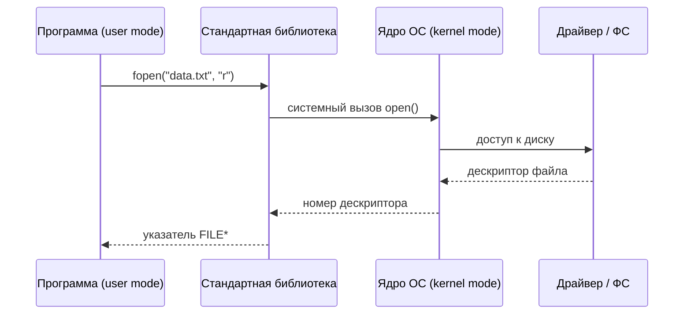

---
tags:
  - all
  - required
  - beginner
title: Взаимодействие программ с операционной системой
description: "Программы не существуют в изоляции. Каждое приложение, от простого калькулятора до сложной системы управления базами данных, зависит от операционной системы и аппаратных ресурсов компьютера."
---

import ProgramOsInteractionPlay from '@site/src/components/ProgramOsInteractionPlay.jsx';

# Взаимодействие программ с операционной системой

  ОБЯЗАТЕЛЬНО
  ДЛЯ НОВИЧКОВ

Всем

## Работа программ с системой

Программы не существуют в изоляции. Каждое приложение, от простого калькулятора до сложной системы управления базами данных, зависит от операционной системы и аппаратных ресурсов компьютера. Взаимодействие программы с системой — это многоуровневый процесс, в котором задействованы механизмы управления памятью, планирования задач, обработки ввода-вывода, а также строгая изоляция между пользовательским кодом и ядром операционной системы. Этот процесс обеспечивает стабильность, безопасность и предсказуемость работы всех программ на одном устройстве.

<ProgramOsInteractionPlay />

---

### Уровни взаимодействия — от пользователя до железа

Вся работа программы с системой происходит через чётко определённые уровни абстракции. На самом верхнем уровне находится **пространство пользователя** — область, в которой исполняется код прикладных программ. Программа здесь работает в рамках выделенных ей ресурсов и не имеет прямого доступа к оборудованию. Это ограничение является ключевым элементом безопасности и стабильности современных операционных систем.

Под пространством пользователя располагается **ядро операционной системы** — центральный компонент, управляющий всеми аппаратными ресурсами: процессором, памятью, дисками, сетевыми интерфейсами и периферийными устройствами. Ядро обеспечивает выполнение программ, распределяет ресурсы, контролирует доступ к данным и координирует взаимодействие между процессами.

Между этими двумя уровнями существует строгая граница. Программа из пространства пользователя не может напрямую обращаться к оборудованию или изменять внутренние структуры ядра. Для получения доступа к системным ресурсам она использует **системные вызовы** — стандартизированные точки входа в ядро, через которые передаются запросы на выполнение определённых действий.

---

### Системный вызов — мост между программой и ядром

Системный вызов — это механизм, с помощью которого программа запрашивает у ядра операционной системы выполнение привилегированной операции. Такие операции включают чтение и запись файлов, создание процессов, выделение памяти, отправку сетевых пакетов и управление устройствами.

Когда программа вызывает функцию из стандартной библиотеки, например `fopen()` в языке C или `File.WriteAllText()` в C#, эта функция в конечном счёте формирует системный вызов. Процессор переключается в привилегированный режим (режим ядра), управление передаётся ядру, которое проверяет корректность запроса, выполняет необходимые действия и возвращает результат обратно в пользовательское пространство.

Этот механизм гарантирует, что ни одна программа не сможет повредить систему или получить несанкционированный доступ к ресурсам других программ. Все запросы проходят через централизованный контрольный пункт — ядро ОС.

На C цепочка та же: `printf` → `write` → syscall. Высокоуровневые API (.NET, Python) в итоге тоже опираются на syscall ОС.

| Режим | Кто работает | Доступ |
|-------|----------------|--------|
| **User mode** | Прикладная программа, библиотеки | Только через syscall |
| **Kernel mode** | Ядро, драйверы | Аппаратура и все процессы |

См. также [Что такое программа?](/encyclopedia/1-basics/1-19-programma/1) и [Поведение программ](/encyclopedia/1-basics/1-19-programma/113).

---

### Область памяти программы — структура и изоляция

Каждая запущенная программа получает собственное **адресное пространство** — виртуальный диапазон адресов памяти, который отображается на физическую память компьютера с помощью механизма виртуальной памяти. Это пространство разделено на несколько логических областей:

- **Текстовый сегмент** содержит исполняемый машинный код программы.
- **Стек** используется для хранения локальных переменных, параметров функций и адресов возврата при вызовах подпрограмм.
- **Куча** — динамически выделяемая область памяти, используемая для создания объектов и структур данных во время выполнения.
- **Сегмент данных** хранит глобальные и статические переменные.

Операционная система следит за тем, чтобы одна программа не могла читать или изменять память другой. При попытке обращения к недопустимому адресу возникает ошибка защиты (например, segmentation fault в Unix-подобных системах или access violation в Windows), и программа завершается.

---

### Указатели файлов и абстракция ввода-вывода

Программы работают с файлами, сетевыми соединениями, устройствами ввода и вывода через унифицированный интерфейс — **дескрипторы файлов** (в Unix/Linux) или **хэндлы** (в Windows). Эти целочисленные значения являются ссылками на внутренние структуры ядра, описывающие открытый ресурс.

Когда программа открывает файл, ядро создаёт запись в своей таблице открытых файлов и возвращает программе дескриптор. Все последующие операции — чтение, запись, позиционирование — выполняются через этот дескриптор. Такая абстракция позволяет программе работать с файлами, сокетами, консолями и другими устройствами одинаковым образом, не зная их физической природы.

Файловая система сама по себе является компонентом ядра, который преобразует логические пути (`/home/user/document.txt`) в физические блоки на диске. Драйверы дискового оборудования обеспечивают низкоуровневый доступ к этим блокам.

---

### Драйверы устройств — язык общения с «железом»

Драйвер устройства — это специализированная программа, встроенная в ядро или загружаемая как модуль, которая реализует интерфейс взаимодействия между операционной системой и конкретным аппаратным компонентом: видеокартой, сетевой картой, принтером, USB-устройством.

Каждый драйвер знает точный протокол общения с устройством: какие команды отправлять, как интерпретировать ответы, как обрабатывать ошибки. Он скрывает сложность аппаратного уровня за стандартным API, предоставляемым ядру. Благодаря этому операционная система может управлять тысячами различных устройств без необходимости встраивать в себя знания об их внутреннем устройстве.

Драйверы работают в режиме ядра и имеют прямой доступ к оборудованию. По этой причине они требуют особой надёжности: ошибка в драйвере может привести к сбою всей системы.

---

### Как ядро готовит и выполняет код

Перед тем как программа начнёт выполняться, ядро проводит серию подготовительных действий. Оно считывает исполняемый файл с диска, анализирует его структуру (например, формат ELF в Linux или PE в Windows), выделяет виртуальное адресное пространство и загружает секции кода и данных в память.

Затем ядро создаёт **процесс** — структуру данных, содержащую всю информацию о состоянии программы: регистры процессора, указатель на текущую инструкцию, открытые файлы, права доступа, переменные окружения. После этого ядро передаёт управление первой инструкции программы, и процесс переходит в состояние **выполнения**.

Планировщик ядра периодически приостанавливает выполнение одного процесса и переключается на другой, создавая иллюзию одновременной работы множества программ. Это достигается за счёт сохранения состояния процессора (регистров, стека) при переключении контекста.

Исполнение кода всегда зависит от архитектуры процессора: набора инструкций (x86, ARM), способа адресации памяти, наличия специализированных блоков (например, для работы с плавающей запятой). Ядро учитывает эти особенности при загрузке и выполнении программ, обеспечивая совместимость между различными версиями оборудования.

---

### Связь программы с системой — через API и библиотеки

Программы редко вызывают системные вызовы напрямую. Вместо этого они используют **стандартные библиотеки** (например, glibc в Linux или CRT в Windows), которые предоставляют удобные высокоуровневые функции: `printf`, `malloc`, `socket`, `CreateFile`. Эти функции инкапсулируют детали системных вызовов и делают код переносимым между разными версиями ОС.

Библиотеки могут быть статически или динамически связанными. В первом случае код библиотеки встраивается в исполняемый файл; во втором — загружается в память во время выполнения. Динамическая связка позволяет экономить память и упрощает обновление общих компонентов.

Через такие интерфейсы программа получает доступ ко всем возможностям системы: работе с графикой, воспроизведению звука, шифрованию данных, взаимодействию с сетью. Операционная система выступает как посредник, обеспечивающий согласованность и безопасность этих операций.

---

### Связь системы с ресурсами — управление и контроль

Ядро операционной системы является единственным компонентом, имеющим полный контроль над аппаратными ресурсами. Оно управляет:

- **Процессорным временем** через планировщик задач, распределяя кванты времени между процессами в соответствии с их приоритетами и политиками.
- **Физической памятью** с помощью менеджера памяти, который отслеживает свободные и занятые страницы, организует подкачку на диск при нехватке ОЗУ, обеспечивает защиту памяти.
- **Устройствами ввода-вывода** через драйверы, очереди запросов и механизмы прерываний, позволяющие реагировать на события от оборудования в реальном времени.
- **Файловой системой**, которая организует хранение данных на диске, обеспечивает целостность, поддерживает метаданные (права, временные метки) и предоставляет иерархическую структуру каталогов.

Все эти подсистемы тесно взаимодействуют между собой. Например, при записи файла данные сначала попадают в буфер кэша ядра, затем передаются драйверу диска, который инициирует физическую запись. В это время процесс может продолжать работу, не дожидаясь завершения операции, благодаря асинхронному вводу-выводу.

---

### Жизненный цикл программы в системе

С момента запуска до завершения программа проходит несколько состояний, управляемых операционной системой:

1. **Создание (Start)** — ядро загружает исполняемый файл, выделяет память, инициализирует структуры процесса.
2. **Готовность (Ready)** — процесс помещается в очередь планировщика, ожидая своего кванта процессорного времени.
3. **Выполнение (Running)** — процессор исполняет инструкции программы.
4. **Ожидание (Wait)** — программа приостанавливается, ожидая завершения операции ввода-вывода, сигнала от другой программы или истечения таймера.
5. **Завершение (Terminated)** — программа завершает работу, ядро освобождает все выделенные ресурсы: память, дескрипторы файлов, сетевые соединения.

На каждом этапе операционная система обеспечивает корректное управление ресурсами, предотвращает утечки памяти и конфликты между процессами.

---

Этот сложный, но строго организованный механизм позволяет тысячам программ сосуществовать на одном компьютере, эффективно использовать ресурсы и оставаться изолированными друг от друга. Работа программ с системой — это основа всей современной вычислительной инфраструктуры, без которой невозможно представить ни настольные приложения, ни облачные сервисы, ни мобильные устройства.

---

### Жизненный цикл процесса — от запуска до завершения

Процесс — это экземпляр выполняющейся программы. Он представляет собой не просто код, а совокупность ресурсов, выделенных операционной системой: виртуальное адресное пространство, набор открытых файлов, сетевые соединения, потоки выполнения, переменные окружения и права доступа.

Жизненный цикл процесса начинается с его **создания**. В Unix-подобных системах это обычно происходит через системный вызов `fork()`, создающий копию текущего процесса, за которым следует `exec()`, заменяющий образ памяти новым исполняемым файлом. В Windows используется единый вызов `CreateProcess`, который сразу загружает указанный исполняемый модуль.

После создания процесс переходит в состояние **готовности** — он помещается в очередь планировщика и ожидает своего кванта времени процессора. Как только планировщик выбирает его для выполнения, процесс переходит в состояние **выполнения**.

Во время работы процесс может временно приостанавливаться и переходить в состояние **ожидания**. Это происходит, например, при обращении к диску, ожидании ввода пользователя или синхронизации с другим процессом. После завершения ожидаемого события процесс возвращается в очередь готовности.

Завершение процесса может быть инициировано самим приложением (например, вызовом `exit()`), внешним сигналом (например, `SIGTERM` в Linux) или аварийным сбоем. При завершении ядро освобождает все ресурсы, связанные с процессом: память, дескрипторы, сетевые сокеты. Однако запись о завершённом процессе (так называемый «зомби» в Unix) может временно сохраняться, пока родительский процесс не считает код возврата с помощью `wait()`.

Такая строгая модель управления жизненным циклом обеспечивает предсказуемость, изоляцию и устойчивость всей системы.

---

### Потоки выполнения — параллелизм внутри процесса

Современные программы редко ограничиваются одним потоком выполнения. **Поток** (thread) — это наименьшая единица исполнения внутри процесса. Все потоки одного процесса разделяют общее адресное пространство, открытые файлы и другие ресурсы, но имеют собственный стек и регистры процессора.

Потоки позволяют программе выполнять несколько задач одновременно: обрабатывать пользовательский ввод, загружать данные из сети и обновлять интерфейс — всё в рамках одного процесса. Операционная система планирует потоки так же, как и процессы, переключая контекст между ними.

Однако совместное использование памяти требует осторожности. Без синхронизации (через мьютексы, семафоры, условные переменные) потоки могут повредить данные друг друга, создавая гонки (race conditions). Поэтому управление параллелизмом — важная часть разработки многопоточных приложений.

Некоторые языки (например, Go или Erlang) предоставляют собственные модели конкурентности (goroutines, акторы), абстрагирующие разработчика от низкоуровневых деталей потоков ОС.

---

### Межпроцессное взаимодействие — координация между программами

Хотя процессы изолированы друг от друга, они часто должны обмениваться данными. Для этого операционные системы предоставляют механизмы **межпроцессного взаимодействия** (Inter-Process Communication, IPC).

Основные виды IPC:

- **Файлы и временные каталоги** — простейший способ обмена, где один процесс записывает данные в файл, а другой читает их. Подходит для медленного, асинхронного обмена.
- **Каналы (pipes)** — однонаправленные потоки данных между процессами. Анонимные каналы используются в цепочках команд (например, `ls | grep .txt`), именованные (FIFO) позволяют взаимодействовать независимым процессам.
- **Сокеты** — универсальный механизм, поддерживающий как локальное (через Unix-сокеты), так и сетевое взаимодействие. Они обеспечивают двунаправленную передачу данных и широко используются даже внутри одной машины.
- **Общая память** — самый быстрый способ IPC, при котором процессы получают доступ к одному и тому же участку физической памяти. Требует тщательной синхронизации.
- **Сигналы** — уведомления, отправляемые процессам для прерывания их работы, завершения или обработки событий (например, `SIGINT` при нажатии Ctrl+C).
- **Очереди сообщений и семафоры** — более сложные примитивы, предоставляемые ядром для организации надёжного обмена и синхронизации.

Выбор механизма зависит от требований к скорости, объёму данных, надёжности и сложности реализации.

---

### Среды выполнения (Runtime Environments) — второй уровень абстракции

Многие современные программы не взаимодействуют с операционной системой напрямую. Вместо этого они работают внутри **среды выполнения** — программной прослойки, которая управляет памятью, безопасностью, сборкой мусора и другими аспектами выполнения.

Примеры сред выполнения:
- **Java Virtual Machine (JVM)** — исполняет байт-код Java, обеспечивает переносимость, автоматическое управление памятью и защиту от ошибок.
- **.NET Common Language Runtime (CLR)** — аналогичная платформа для языков C#, F#, VB.NET, предоставляющая JIT-компиляцию, безопасность типов и интроспекцию.
- **Node.js** — среда выполнения JavaScript вне браузера, построенная на движке V8 и библиотеке libuv для асинхронного ввода-вывода.
- **Python Interpreter** — управляет выполнением скриптов, включая динамическую типизацию, импорт модулей и работу с объектной моделью.

Среда выполнения берёт на себя множество задач, которые в нативных программах решаются вручную: выделение и освобождение памяти, обработка исключений, загрузка библиотек, проверка безопасности. Это повышает продуктивность разработчика, но добавляет накладные расходы и зависимость от реализации runtime.

Среда выполнения сама является процессом, запущенным операционной системой. Она использует системные вызовы для доступа к ресурсам, но предоставляет программисту более высокоуровневый и безопасный интерфейс.

---

### Виртуализация и контейнеризация — изоляция на новом уровне

Современные системы расширяют границы изоляции процессов с помощью **виртуальных машин** и **контейнеров**.

Виртуальная машина (например, через VMware или Hyper-V) эмулирует полное аппаратное окружение, позволяя запускать целую операционную систему внутри другой. Каждая VM полностью изолирована, но требует значительных ресурсов.

Контейнеры (Docker, Podman) используют механизмы ядра ОС — такие как **пространства имён (namespaces)** и **cgroups** — для изоляции процессов, файловых систем, сетевых интерфейсов и ресурсов. Контейнеры легче, быстрее запускаются и делят ядро хостовой системы, что делает их идеальными для микросервисной архитектуры.

В обоих случаях программа продолжает работать как процесс, но её окружение становится управляемым и воспроизводимым — ключевое требование для современной разработки и развёртывания.

---
