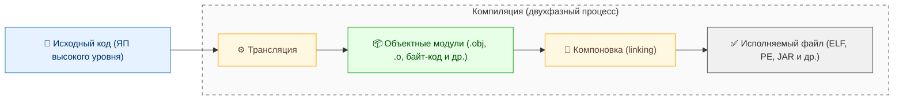
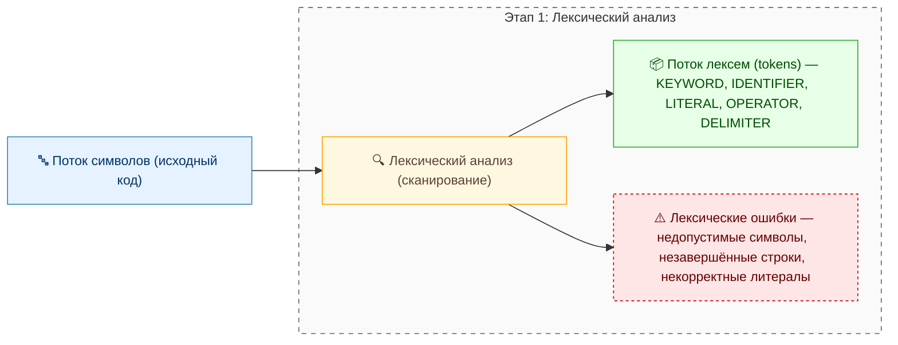
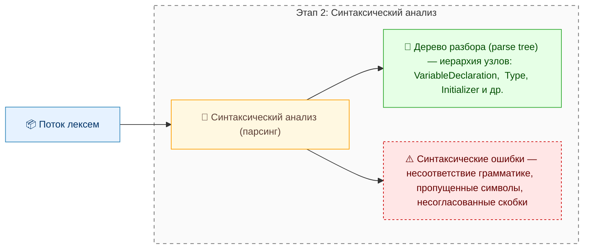
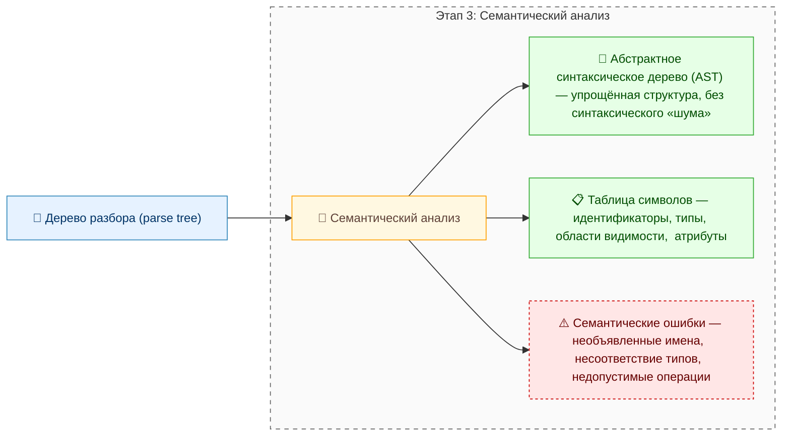
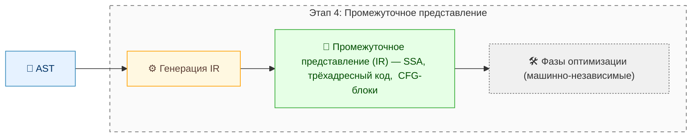
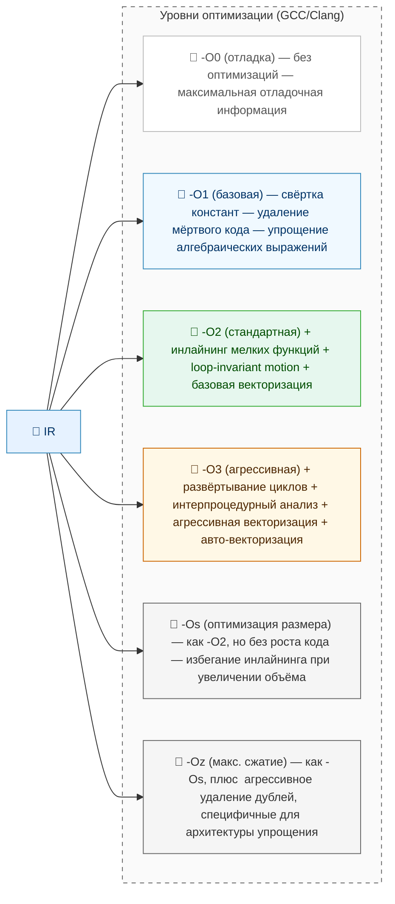
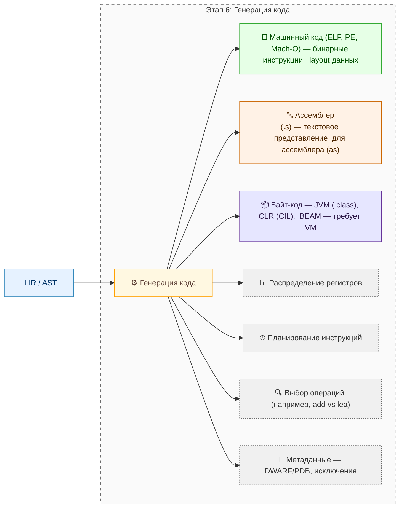
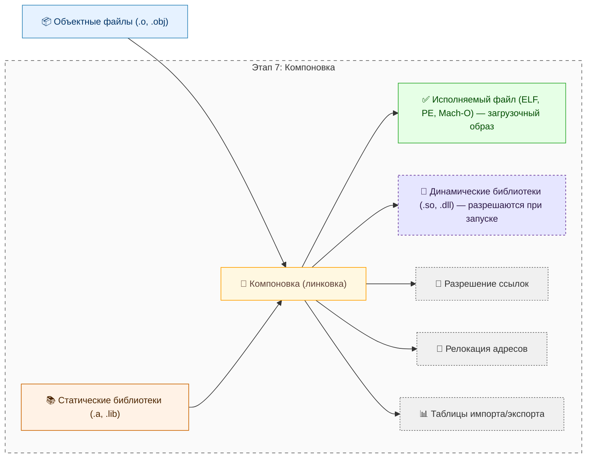

---
tags:
  - engineer
  - developer
  - architector
  - required
  - beginner
title: Компиляторы и интерпретаторы
description: "Любой язык программирования, будь то C++, Python, Java или Rust, существует как договорённость между человеком и машиной — договорённость о форме записи инструкций и их смысле."
  выполняемую программу и чем отличаются эти модели исполнения.
---

# Компиляторы и интерпретаторы

<div class="article-tags">
  <span class="tag tag-required">ОБЯЗАТЕЛЬНО</span>
  <span class="tag tag-beginner">ДЛЯ НОВИЧКОВ</span>
</div>

<span class="complexity-badge">Разработчику</span>
<span class="complexity-badge">Архитектору</span>

## Компиляторы и интерпретаторы

Любой язык программирования, будь то C++, Python, Java или Rust, существует как договорённость между человеком и машиной — договорённость о форме записи инструкций и их смысле. Чтобы эта договорённость могла реализоваться в действии, требуется посредник: программа, способная понять запись, проверить её корректность, и преобразовать в последовательность операций, исполняемых аппаратно. Такими посредниками выступают **компиляторы** и **интерпретаторы**.

---

### Что такое компилятор

Компилятор — это трансляционная система, осуществляющая **полную предварительную трансляцию** исходного текста программы с языка программирования высокого или среднего уровня в машинно-ориентированное представление. 

Результатом работы компилятора является автономный артефакт — объектный модуль или исполняемый файл, не требующий присутствия самого компилятора во время выполнения.

Этот процесс получил название **компиляция** (от лат. *compilare* — собирать, объединять), что отражает историческую суть - компилятор выполняет сборку отдельных частей программы в единое целое. Современные реализации отделяют этапы трансляции и компоновки, однако семантически компиляция остаётся двухфазной операцией:  
1. **Трансляция** — преобразование исходных модулей в промежуточное машинно-ориентированное представление (объектный код, байт-код и т.п.).  
2. **Компоновка** — объединение полученных модулей, разрешение внешних ссылок и формирование загрузочного образа.



> **Важно**: Компилятор не сводится к транслятору. Транслятор осуществляет только преобразование на уровне одной единицы кода (например, одного файла). Компилятор, даже при делегировании компоновки внешней программе (например, `ld` в Unix), управляет полным циклом сборки и является ответственным за целостность результата. Отождествление компилятора с транслятором — терминологическая неточность, допустимая лишь в упрощённых описаниях.

---

#### Этапы компиляции

Процесс компиляции — это многоступенчатая конвейерная обработка, где каждый этап опирается на результат предыдущего и обеспечивает корректность и эффективность последующих. Ниже приводится структура компилятора в терминах классической теории трансляции.

##### 1. Лексический анализ (сканирование)

Исходный код поступает на вход как поток символов. Задача лексического анализатора (сканера) — разбить этот поток на **лексемы** (*tokens*): элементарные смысловые единицы языка — идентификаторы, ключевые слова, литералы, операторы, разделители.

Например, фрагмент `int x = 42;` преобразуется в последовательность:
```
[KEYWORD: int] → [IDENTIFIER: x] → [OPERATOR: =] → [LITERAL: 42] → [DELIMITER: ;]
```



На этом этапе устраняются пробельные символы, комментарии и другие элементы, не несущие семантической нагрузки. Возможны обнаружения лексических ошибок: недопустимые символы, незавершённые строковые литералы, некорректные числа (например, `09` в языках, где ведущий ноль означает восьмеричную систему).

##### 2. Синтаксический анализ (парсинг)

Поток лексем поступает в синтаксический анализатор (парсер), задача которого — установить соответствие структуры кода правилам грамматики языка. Результатом является **дерево разбора** (*parse tree*), отражающее иерархическую организацию конструкций.

Для того же выражения `int x = 42;` дерево может выглядеть как:
```
VariableDeclaration
├── Type: int
├── Identifier: x
└── Initializer
    └── Literal: 42
```



Грамматики языков, как правило, задаются в форме контекстно-свободных (например, BNF или EBNF), а парсеры реализуются посредством рекурсивного спуска, сдвиг-свёртки (LR, LALR) или таблиц синтаксического анализа.

##### 3. Семантический анализ

Дерево разбора подвергается семантической проверке: анализатор устанавливает **значение** конструкций в контексте используемых типов, областей видимости, перегрузок и других языковых правил.

Ключевые действия на этом этапе:
- связывание имён с объявлениями (например, проверка, что переменная `x` объявлена перед использованием);
- контроль типов: совместимость операндов, приведения, возвратных значений;
- проверка условий времени компиляции (например, валидность `constexpr` в C++);
- разрешение перегрузок функций и операторов;
- формирование таблицы символов — внутреннего справочника всех сущностей программы с их атрибутами.



Семантический анализатор может генерировать **абстрактное синтаксическое дерево** (*AST*), в котором исключены несущественные детали (например, скобки, явные преобразования по умолчанию), оставляя только структурно значимые узлы. AST становится основой для последующих фаз.

##### 4. Промежуточное представление (IR)

Многие компиляторы (GCC, Clang, Roslyn, V8) преобразуют AST в **промежуточное представление** — низкоуровневую, но всё ещё машинно-независимую форму кода. IR может иметь структуру:
- трёхадресного кода (например, `t1 = a + b`);
- статического однократного присваивания (SSA-form), где каждая переменная определяется ровно один раз;
- контролируемого графа потока (CFG) — представления, явно выделяющего блоки кода и переходы между ними.



Преимущества IR:
- единообразие для всех входных языков (например, в LLVM один и тот же IR используется для C, Rust, Swift);
- удобство для глобальной оптимизации (анализ потока данных, удаление мёртвого кода, инлайнинг);
- возможность модульного расширения: фазы оптимизации работают с IR, а не с конкретным AST.

##### 5. Оптимизация

Оптимизация — необязательная, но критически важная фаза, нацеленная на повышение эффективности результирующего кода без изменения его поведения. Она может применяться на уровне IR, на уровне целевого кода или даже на уровне ассемблера.



Примеры преобразований:
- **Свёртка констант**: `2 * (3 + 4)` → `14`;
- **Удаление мёртвого кода**: исключение инструкций, результат которых нигде не используется;
- **Инлайнинг**: подстановка тела функции вместо вызова;
- **Разворачивание циклов**: замена повторяющихся итераций развёрнутыми инструкциями;
- **Перемещение кода за пределы циклов** (loop-invariant code motion);
- **Векторизация**: замена скалярных операций на SIMD-инструкции.

Уровень оптимизации (например, `-O0`, `-O2`, `-O3` в GCC) определяет, какие фазы активируются и в каком порядке.

##### 6. Генерация кода

На заключительном этапе IR или AST преобразуется в целевое представление. В зависимости от архитектуры компилятора возможны следующие целевые форматы:

- **Машинный код** — последовательность бинарных инструкций целевого процессора (x86_64, ARM64 и т.п.), готовая к загрузке в память и исполнению. Требует знания ABI, соглашений о вызовах, layout’а данных.
- **Ассемблерный код** — текстовое представление машинных команд, удобное для отладки и ручной оптимизации. Компилятор выводит `.s`-файл, который затем ассемблируется отдельной программой (`as`).
- **Байт-код** — двоичный или текстовый псевдокод, предназначенный для выполнения виртуальной машиной (JVM, CLR, BEAM и др.). Является платформенно-независимым, но требует среды исполнения.



Генерация кода включает в себя:
- распределение регистров;
- планирование инструкций;
- выбор конкретных машинных операций с учётом целевой архитектуры (например, `add` vs `lea` на x86);
- формирование метаданных: отладочной информации (DWARF, PDB), таблиц исключений, карт памяти.

##### 7. Компоновка (линковка)

После генерации объектных файлов (`*.o`, `*.obj`) запускается компоновщик (линкер). Его задачи:
- объединение объектных модулей в один загрузочный образ;
- разрешение внешних ссылок (например, вызовов функций из стандартной библиотеки);
- вставка кода статически связанных библиотек;
- генерация метаданных для динамической загрузки (таблиц импорта/экспорта в ELF/PE);
- релокация — коррекция адресов в зависимости от места загрузки в памяти.



Динамическая линковка переносит часть этих обязательств на этап выполнения, но требует наличия библиотек в системе.

---

#### Виды компиляторов

Классификация компиляторов отражает их архитектурные и функциональные особенности.

##### По способу организации работы

- **Пакетный** — обрабатывает программу целиком за один проход. Типичен для традиционных компиляторов (например, `gcc main.c -o main`).
- **Инкрементальный** — перекомпилирует только изменённые модули, используя ранее сгенерированные объектные файлы. Лежит в основе систем сборки (`make`, `ninja`, `cmake --build`).
- **Условная компиляция** — управляет включением/исключением фрагментов кода на основе директив (`#ifdef`, `#if`). Реализуется препроцессором (в C/C++) или на уровне AST (в Rust — `#[cfg(...)]`).

##### По архитектуре

- **Самокомпилируемый** — написан на том же языке, который компилирует (например, `rustc` на Rust, `GHC` на Haskell). Позволяет развивать язык, используя его же возможности.
- **Компилятор компиляторов** (транслятор с метаязыка) — принимает формальное описание синтаксиса и семантики (например, в SDF, ANTLR, Bison) и генерирует готовый компилятор. Примеры: Yacc, ANTLR, JetBrains MPS.
- **Гибкий (таблично-управляемый)** — поведение определяется набором внешних таблиц (например, грамматик, семантических действий), что упрощает модификацию и расширение.

##### По целевому формату

- **Компилятор в машинный код** — GCC, Clang, MSVC (при генерации `.exe`/`.so`).
- **Компилятор в ассемблер** — PureBasic → FASM, `gcc -S`.
- **Компилятор в байт-код** — `javac` → JVM bytecode, `scalac` → JVM, `dotnet build` → CIL.
- **Транспилятор** — компилятор в *другой язык высокого уровня* (например, TypeScript → JavaScript, CoffeeScript → JS, Haxe → C++/JS/Python). Технически не классический компилятор, но использует те же стадии анализа.

##### Системы сборки как «расширенные компиляторы»

Системы вроде `make`, `cmake`, `Bazel` не производят трансляцию напрямую, но управляют полным циклом компиляции. Они:
- анализируют зависимости между файлами;
- запускают нужные трансляторы и компоновщики;
- кэшируют результаты;
- поддерживают кросс-компиляцию.

Такие системы можно рассматривать как **метакомпиляторы высокого уровня**, особенно в случаях, когда их внутренний язык позволяет описывать компиляцию декларативно (например, `BUILD`-файлы в Bazel).

---

### Что такое интерпретатор

Интерпретатор — это программа, которая **непосредственно выполняет исходный код или его промежуточное представление**, не формируя автономного исполняемого образа. В отличие от компилятора, интерпретатор не завершает перевод до начала исполнения: анализ и выполнение переплетаются во времени. Это накладывает особенности как на производительность, так и на поведение системы в целом — в частности, на обработку ошибок, управление памятью и взаимодействие с окружением.

Термин *интерпретация* происходит от латинского *interpretari* — «объяснять, истолковывать». Действительно, интерпретатор *истолковывает* каждую конструкцию программы в контексте текущего состояния вычислительной среды и генерирует соответствующие действия «на лету».

Ключевое отличие: **интерпретируемая программа не существует как независимая сущность вне времени выполнения**. Её «жизнь» начинается и заканчивается вместе с порождающим процессом.

> **Уточнение**: Некорректно говорить, что «Python — интерпретируемый язык». Язык — это формальная система. Интерпретируемым или компилируемым является *реализация* этого языка. Например, CPython интерпретирует байт-код, PyPy использует JIT-компиляцию, а Nuitka компилирует Python в нативный C-код.

---

#### Этапы обработки в интерпретаторе

Хотя интерпретаторы варьируются по сложности, большинство современных реализаций проходят схожие с компиляторами стадии анализа — но с иной последовательностью и степенью кэширования результатов.

##### 1. Чтение и лексико-синтаксический анализ

Как и компилятор, интерпретатор начинает с лексического и синтаксического разбора. Однако он может:
- делать это **по мере поступления кода** (в REPL-режиме);
- кэшировать результат для повторного использования (например, Python сохраняет `.pyc`-файлы — скомпилированный байт-код);
- пропускать этапы, если входной формат уже структурирован (например, JSON-скрипты в движках конфигурации).

В простейших случаях (BASIC 1970-х, ранний JavaScript в браузерах) разбор и выполнение совмещались в одном цикле: строка → лексемы → выполнение. Такая схема позволяла мгновенную реакцию, но исключала глобальную проверку и оптимизацию.

##### 2. Построение промежуточного представления

Большинство современных интерпретаторов (CPython, V8 до JIT, Lua 5.1) после разбора генерируют **байт-код** — компактное, структурированное представление программы в виде последовательности инструкций виртуальной машины.

Пример байт-кода CPython для выражения `a + b`:
```
LOAD_FAST   0 (a)
LOAD_FAST   1 (b)
BINARY_ADD
```

Преимущества байт-кода:
- устранение избыточного повторного разбора при многократном вызове (например, функции в цикле);
- упрощение интерпретатора: вместо парсера на входе — простой диспетчер инструкций;
- возможность сериализации и передачи (например, `.pyc` можно распространять без исходников);
- естественная интеграция с отладчиками и профилировщиками.

##### 3. Выполнение (интерпретация)

На этом этапе виртуальная машина (VM) последовательно извлекает инструкции из байт-кода и выполняет их, используя внутренние структуры данных: стек вызовов, фреймы, таблицы символов, кучу объектов.

Типичная реализация — **интерпретатор на основе диспетчеризации**:
- цикл `while` или `switch`, перебирающий opcode’ы;
- для каждой инструкции — обработчик (dispatcher), изменяющий состояние VM.

Альтернатива — **интерпретатор на основе потока инструкций с прямым переходом** (*threaded code*), где каждая инструкция завершается безусловным переходом (`jmp`) на следующую. Такой подход минимизирует накладные расходы цикла и использовался в Forth, Lua (до 5.2), а также в некоторых модулях CPython.

##### 4. Управление состоянием

Интерпретатор несёт полную ответственность за:
- выделение и сборку мусора (reference counting, mark-and-sweep, generational GC);
- разрешение имён в динамических областях видимости (глобальные, локальные, встроенные пространства);
- обработку исключений и стека вызовов;
- интеграцию с нативным кодом (через FFI, C API и т.п.).

В отличие от компилируемых программ, где большая часть этих задач перекладывается на ОС и runtime, в интерпретируемых системах всё реализовано внутри среды — что повышает переносимость, но снижает эффективность.

---

#### Типы интерпретаторов

##### 1. Прямой (пошаговый, скриптовый)

Наиболее простая форма: интерпретатор читает исходный текст построчно или покомандно, разбирает и сразу выполняет.  
**Примеры**: ранние версии BASIC, командные оболочки (`bash`, `cmd` в режиме интерактивного ввода), интерактивные сессии `node` или `python` (REPL).

Особенности:
- отладка в реальном времени — ошибка возникает *в момент исполнения* строки;
- нет предварительного анализа — невозможны межстрочные оптимизации;
- высокая латентность при повторном запуске — каждый раз требуется полный разбор.

##### 2. На основе байт-кода (компилирующий интерпретатор)

Фактически представляет собой **двузвенную систему**:
1. *Компилятор в байт-код* — выполняет лексический, синтаксический и семантический анализ один раз (при первом импорте или запуске);
2. *Интерпретатор байт-кода* — выполняет полученный код в виртуальной машине.

**Примеры**:  
- CPython (`.py` → `.pyc` → CPython VM)  
- Lua 5.1 (исходник → байт-код → Lua VM)  
- Perl 5 (сохранение `op tree` между запусками)  
- PostgreSQL PL/pgSQL (компиляция функции при первом вызове)

Такой подход сочетает гибкость интерпретации с частичной эффективностью компиляции. Байт-код, как правило, платформенно-независим, но привязан к версии VM (например, `.pyc` несовместим между Python 3.10 и 3.12).

##### 3. Виртуальная машина как интерпретатор

Некоторые VM изначально проектируются как интерпретаторы, но допускают дальнейшую эволюцию:
- **BEAM** (Erlang VM) — интерпретирует BEAM-байт-код, но в новых версиях добавляет JIT;
- **JVM** — до HotSpot выполняла интерпретацию байт-кода, затем перешла к смешанной модели;
- **V8** — изначально интерпретатор *Ignition*, затем JIT *TurboFan*.

Здесь интерпретатор выступает как «базовый уровень» выполнения, обеспечивающий запуск любого кода, даже динамически сгенерированного.

##### 4. РЕПЛ-ориентированные интерпретаторы

Цикл *Read-Eval-Print Loop* — ключевая черта языков, ориентированных на интерактивную разработку (Lisp, Scheme, Python, Julia, R). В REPL:
- пользователь вводит *форму* (выражение, определение);
- интерпретатор читает её как завершённую синтаксическую единицу;
- вычисляет значение;
- выводит результат.

Семантически REPL — это полноценная среда с динамическим связыванием имён, возможностью переопределения, интроспекции и модификации среды в runtime. Такие интерпретаторы требуют поддержки:
- построчного разбора с учётом многострочных конструкций (например, `def` в Python);
- отмены ошибочных вводов без сброса состояния;
- истории команд и автодополнения.

##### 5. Гибридные и специализированные формы

- **Forth** — уникален: в нём одно и то же устройство (словарь слов) может в режиме *interpret* выполнять команды, а в режиме *compile* — записывать их в определение новой функции. Переключение происходит динамически, даже внутри одного определения.
- **SQL-движки** — интерпретируют запросы, но предварительно строят план выполнения (execution plan), кэшируют его и могут компилировать частые запросы в нативный код (PostgreSQL JIT, SQL Server Query Store).
- **Правила в системах принятия решений** (например, Drools) — интерпретируют декларативные правила, применяя RETE-алгоритм для эффективного сопоставления.

---

### Сравнение компиляторов и интерпретаторов

Сравнение не должно сводиться к противопоставлению «быстро/медленно». Оба подхода — это стратегии проектирования runtime’а, каждая из которых оптимизирована под определённый класс задач и требований.

| Критерий | Компилятор | Интерпретатор |
|--------|------------|---------------|
| **Время запуска** | Требуется этап сборки (может быть длительным), зато запуск мгновенный. | Запуск возможен сразу, но первое выполнение включает разбор и, возможно, компиляцию в байт-код. |
| **Производительность выполнения** | Максимальная: оптимизированный машинный код, прямой доступ к ISA. | Ниже: накладные расходы интерпретации, проверки в runtime, динамическая диспетчеризация. |
| **Диагностика ошибок** | Ошибки обнаруживаются *до* запуска: синтаксис, типы, отсутствие имён. | Ошибки проявляются *во время выполнения* (например, обращение к несуществующему атрибуту в Python). Исключения могут быть более детализированными (стек, контекст). |
| **Переносимость артефакта** | Исполняемый файл привязан к платформе (ОС + архитектура). Для кросс-платформенности нужны отдельные сборки. | Исходный код или байт-код переносимы при наличии соответствующего интерпретатора. |
| **Размер распространяемого пакета** | Как правило, больше: включает нативные библиотеки, runtime (если не shared). | Меньше: исходники или компактный байт-код. Но требует установки runtime’а отдельно. |
| **Модификация в runtime** | Затруднена: код «заморожен». Требуются механизмы загрузки модулей (DLL, `dlopen`). | Естественна: можно изменять классы, функции, глобальные переменные «на лету». |
| **Оптимизация** | Глобальная, агрессивная, на всех уровнях (SSA, векторизация, devirtualization). | Ограничена: в основном локальные преобразования, оптимизация hot paths через профилирование. |
| **Отладка** | Требует отладочной информации (DWARF, PDB). Точки останова — в машинных адресах. | Прямая привязка к исходному коду. Возможны интерактивные отладчики с инспекцией состояния. |

---

### Гибридные подходы: когда граница стирается

Современные системы всё чаще используют комбинированные стратегии, стирая жёсткое разделение между компиляцией и интерпретацией.

#### JIT-компиляция (Just-In-Time)

JIT — динамическая компиляция *в момент выполнения*. Чаще всего:
1. Код сначала интерпретируется;
2. Профилировщик собирает статистику (частота вызовов, типы аргументов);
3. «Горячие» участки компилируются в машинный код и заменяют интерпретируемые версии.

**Примеры**:
- HotSpot JVM (C1 — быстрый компилятор, C2 — оптимизирующий);
- V8 (Ignition → TurboFan);
- PyPy (RPython-based JIT);
- .NET CLR (NGEN — предварительная JIT, Tiered Compilation — многоуровневая JIT).

Преимущества JIT:
- адаптация к реальным данным (например, devirtualization при мономорфных вызовах);
- компенсация медленного старта за счёт ускорения долгоживущих процессов;
- возможность специализации кода под конкретную платформу (CPU features, OS quirks).

Недостатки:
- увеличенный потребляемый объём памяти;
- задержка при «прогреве»;
- непредсказуемость latency (компиляция может прервать выполнение).

#### AOT-компиляция (Ahead-Of-Time)

Обратная стратегия: компиляция *до* выполнения, но не в машинный код напрямую, а в формат, совместимый со средой интерпретатора.

**Примеры**:
- `native-image` в GraalVM: компилирует JVM-приложение в standalone ELF/PE-файл с встроенной GC и runtime’ом;
- Android ART: AOT-компиляция DEX-байт-кода в ELF при установке приложения;
- .NET Native (UWP), NativeAOT (ранее CoreRT).

AOT устраняет накладные расходы JIT и ускоряет старт, но теряет адаптивность и увеличивает размер образа.

#### Трансляция на лету в микропроцессорах

Даже «нативный» код на современных CPU часто интерпретируется:
- x86 → микрооперации (μops) в декодере Pentium Pro+;
- ARM → внутренние инструкции в кэше μop (Apple M-series, Qualcomm Snapdragon);
- VLIW-процессоры (Itanium) — требуют компилятора, генерирующего пакеты параллельных операций.

Таким образом, граница между аппаратной и программной интерпретацией размыта: **вся современная вычислительная система — иерархия вложенных виртуальных машин**, каждая из которых может использовать компиляцию, интерпретацию или их сочетание.

---

### Исторический контекст

- **1952**, Grace Hopper — первый компилятор (*A-0 Система*), называвшийся «linker-loader», но выполнявший трансляцию символьных инструкций в машинный код UNIVAC I.
- **1957**, FORTRAN — первый широко применяемый компилятор (IBM), доказавший, что «человеческий» код может быть эффективнее ручного ассемблера.
- **1958**, Lisp — первый интерпретируемый язык высокого уровня. `eval` как встроенная функция стала концептуальной основой для метапрограммирования.
- **1970-е**, появление переносимых компиляторов (Pascal P-код, UCSD p-System), заложивших идею виртуальных машин.
- **1995**, Java — популяризировала байт-код и JIT-модель под лозунгом «Write Once, Run Anywhere».
- **2000-е**, рост динамических языков (Python, Ruby, JS) — возврат к интерпретации, но с продвинутыми VM (V8, YARV).
- **2010-е**, ренессанс AOT и нативных компиляторов (Rust, Go, Zig, GraalVM Native Image) — реакция на требования к startup latency и memory footprint в облачных средах.

---
