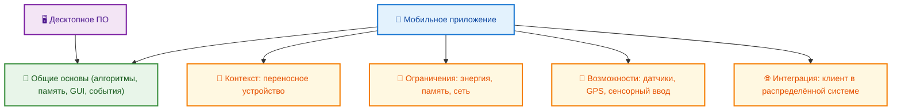
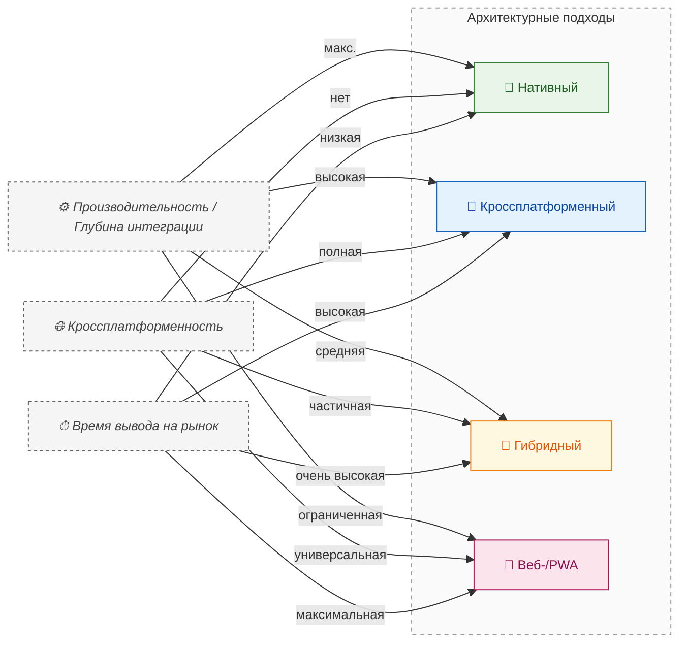
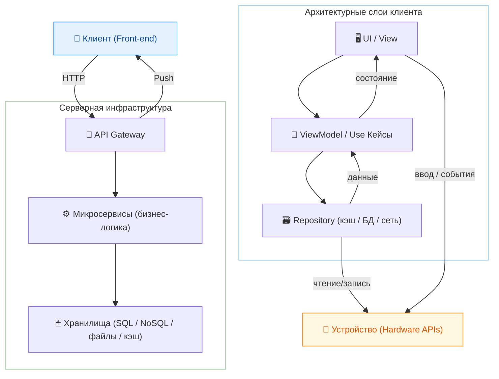

---
tags:
  - engineer
  - developer
  - architect
  - required
  - beginner
title: Мобильные приложения
description: "Мобильное приложение — это программное обеспечение, предназначенное для установки и выполнения на переносных вычислительных устройствах, в первую очередь на смартфонах и планшетах."
related:
  - title: "Android"
    doc: encyclopedia/2-system-network/2-01-operatsionnaya-sistema/8
  - title: "Мобильные приложения"
    doc: encyclopedia/4-code-dev/4-12-mobilnye-prilozheniya/1
  - title: "iOS"
    doc: encyclopedia/2-system-network/2-01-operatsionnaya-sistema/7
  - title: "Компоненты пользовательского интерфейса на Android"
    doc: encyclopedia/4-code-dev/4-12-mobilnye-prilozheniya/111
---

import ExternalPlayEmbed from '@site/src/components/ExternalPlayEmbed';

# Мобильные приложения

  
Где углубляться

  

  Это обзор в разделе "Программа". Разработка, UI-компоненты и публикация в магазинах — в разделе <a href="/encyclopedia/4-code-dev/4-12-mobilnye-prilozheniya/intro">Мобильные приложения</a> (том "Код и разработка").

  

  ОБЯЗАТЕЛЬНО
  ДЛЯ НОВИЧКОВ

Разработчику
Архитектору

---

Мобильное приложение по сути остаётся **программой** — набором инструкций и данных, которые ОС загружает в память. Отличия в контексте — сенсорный экран, батарея, датчики, магазины приложений и постоянная сеть. Ниже — обзор для раздела "Программа"; разработка, UI и публикация — в [Мобильные приложения](/encyclopedia/4-code-dev/4-12-mobilnye-prilozheniya/intro) (том "Код и разработка"). Общие основы исполнения — [Что такое программа?](/encyclopedia/1-basics/1-19-programma/1), [Поведение программ](/encyclopedia/1-basics/1-19-programma/113).

---

## Мобильные приложения

### Чем мобильное приложение отличается от обычного десктопного?

**Мобильное приложение** — это программное обеспечение, предназначенное для установки и выполнения на переносных вычислительных устройствах, в первую очередь на смартфонах и планшетах. Формальное определение этого класса программ включает несколько ключевых признаков — ориентация на сенсорное управление, зависимость от мобильной операционной системы, оптимизация под ограниченные вычислительные ресурсы (память, энергопотребление, пропускная способность сети), и глубокая интеграция с аппаратными компонентами устройства. Мобильное приложение существует как самостоятельная единица программного обеспечения, но в подавляющем большинстве случаев работает в составе распределённой системы — его локальная часть взаимодействует с удалёнными сервисами, обеспечивая функциональность, недоступную при автономном режиме.

<ExternalPlayEmbed example="basics/mobile-app-emulator" title="Mobile App Emulator" minHeight={480} />

Принципиальное отличие мобильного приложения от классического десктопного программного обеспечения заключается в контексте эксплуатации. Обе категории программ реализуют алгоритмы, используют системные ресурсы, взаимодействуют с пользователем через графический интерфейс, и подчиняются тем же законам информатики — компиляции, интерпретации, управления памятью, обработки событий. Однако мобильная среда накладывает уникальные ограничения и предоставляет особые возможности, которые определяют специфику проектирования, разработки и сопровождения.

Первый фактор — **устройство ввода**. На десктопных системах доминирующее положение занимает комбинация клавиатуры и мыши, обеспечивающая высокую точность позиционирования и богатый набор команд. Мобильные устройства используют сенсорный экран как основной канал взаимодействия. Это требует пересмотра всего подхода к проектированию интерфейса — элементы управления становятся крупнее, используются жесты (свайп, пинч, долгое нажатие), а навигация строится на иерархии экранных состояний, а не на многооконности. Многозадачность реализуется не через одновременное отображение нескольких окон, а через фоновые процессы и быстрое переключение между приложениями с сохранением состояния.

Второй фактор — **ресурсное ограничение**. Мобильные устройства обладают меньшим объёмом оперативной памяти, менее мощными процессорами и, что критично, конечным зарядом аккумулятора. Это приводит к тому, что операционная система активно управляет жизненным циклом приложений — при переходе в фоновое состояние приложение может быть заморожено, свёрнуто, а в случае нехватки памяти — принудительно завершено. Разработчик обязан учитывать эти состояния явно — сохранять данные перед сворачиванием, восстанавливать интерфейс при возврате, ограничивать фоновую активность, чтобы не снижать автономность устройства. Энергоэффективность становится критерием качества наравне с производительностью.

Третий фактор — **постоянная изменчивость окружения**. Десктопная машина, как правило, располагается в фиксированном месте, работает под стабильным питанием и подключена к надёжной сети. Мобильное устройство перемещается в пространстве, что приводит к постоянной смене условий — качество связи колеблется между Wi-Fi, LTE, 5G и полным отсутствием сигнала; освещённость меняется; температура корпуса растёт при интенсивной работе. Приложение обязано корректно реагировать на эти изменения — кэшировать данные при наличии сети, переходить в офлайн-режим при её потере, адаптировать яркость интерфейса, регулировать частоту обновления в зависимости от состояния заряда. Отказоустойчивость и адаптивность — обязательные требования.

Четвёртый фактор — **аппаратная интеграция**. Современный смартфон — это комплекс сенсоров и интерфейсов связи — GPS-приёмник, акселерометр, гироскоп, магнитометр, барометр, датчик освещённости, микрофон, камеры (фронтальная и тыловая), модули Bluetooth, NFC, Wi-Fi Direct. Мобильное приложение получает доступ к этим компонентам через системные API, что позволяет реализовать функциональность, невозможную на классических ПК без внешних устройств. Навигационное приложение строит маршрут с учётом текущих координат и скорости движения. Фитнес-трекер оценивает количество шагов по показаниям акселерометра. Приложение для бесконтактной оплаты использует NFC для обмена данными с терминалом. Эта глубокая связь с физическим миром определяет суть мобильного опыта — он не ограничивается экраном, он встраивается в повседневную деятельность пользователя.

Пятый фактор — **дистрибуция и обновление**. Десктопные программы традиционно распространялись через установочные файлы, размещённые на сайтах, или физические носители. Мобильные приложения почти исключительно поставляются через централизованные магазины приложений — App Store для iOS и Google Play для Android. Эти платформы выполняют роль посредника — проверяют соответствие политикам безопасности и конфиденциальности, обеспечивают цифровую подпись, управляют версиями, собирают отзывы и рейтинги, автоматизируют установку и обновление. Разработчик теряет прямой контроль над распространением, но получает гарантированный канал доставки, встроенную систему монетизации и инструменты аналитики. Обновление происходит прозрачно для пользователя — как правило, в фоновом режиме, без необходимости запуска установщика или перезагрузки устройства.

Шестой фактор — **безопасность как встроенная дисциплина**. Мобильные операционные системы, особенно iOS, изначально строились с принципом изоляции приложений: каждое приложение работает в собственном "песочнице", не имея прямого доступа к файловой системе других программ или к критическим компонентам системы. Разрешения на использование чувствительных функций (камера, геолокация, контакты) запрашиваются явно у пользователя и могут быть отозваны в любой момент через настройки. Данные шифруются на уровне устройства (полный диск или отдельные контейнеры). Эти меры не являются дополнительными — они встроены в архитектуру платформы и обязательны для всех приложений, прошедших проверку в магазине. Это делает мобильную экосистему в целом более защищённой от вредоносного ПО по сравнению с традиционными десктопными средами.

Седьмой фактор — **цикл жизни и управление состоянием**. Мобильное приложение проходит строго определённые этапы — *не запущено* (не загружено в память), *активно* (на переднем плане, взаимодействует с пользователем), *в фоне* (не видимо, но может выполнять ограниченные задачи — проигрывать музыку, получать push-уведомления, отслеживать геопозицию), *приостановлено* (состояние сохранено, выполнение приостановлено для экономии ресурсов), *завершено* (выгружено из памяти). Операционная система управляет переходами между этими состояниями в зависимости от действий пользователя и системной нагрузки. Разработчик обязан реализовать обработчики для каждого ключевого события — запуск, переход в фон, возврат на передний план, завершение. Это позволяет сохранять прогресс, освобождать ресурсы, подготавливать данные к восстановлению — и обеспечивает ощущение плавности и предсказуемости.

Восьмой фактор — **монетизация как архитектурный элемент**. В отличие от многих десктопных продуктов, где оплата происходит однократно при покупке лицензии, мобильные приложения часто используют гибридные модели — бесплатная загрузка с последующей оплатой за расширенные функции (freemium), подписка на контент или сервисы, встроенные покупки внутри приложения, реклама. Эти механизмы интегрируются на уровне платформы (In-App Purchases в iOS и Google Play Billing в Android) и влияют на архитектуру — требуется серверная валидация покупок, синхронизация подписок между устройствами, управление правами доступа. Финансовая модель становится частью технического проектирования, а не внешним условием.

Девятый фактор — **фрагментация среды исполнения**. Android существует в сотнях аппаратных реализаций от десятков производителей, с различными версиями ОС, экранами (разрешение, плотность пикселей, форма вырезов), чипсетами и модификациями прошивок. iOS значительно более унифицирована, но и здесь присутствует разнообразие поколений устройств, экранов и версий операционной системы. Разработчик нативного приложения вынужден проектировать интерфейс как адаптивную систему, тестирующуюся на множестве конфигураций. Это приводит к появлению дополнительных слоёв абстракции — ресурсные файлы для разных плотностей экранов, проверка доступности API перед вызовом, graceful degradation функциональности на старых устройствах.

Десятый фактор — **зависимость от экосистемы**. Мобильное приложение редко существует в изоляции. Оно интегрируется с сервисами операционной системы — уведомлениями, контактами, календарём, галереей, картами, голосовым помощником. Оно использует единые учётные записи (Apple ID, Google Account) для аутентификации и синхронизации. Оно может взаимодействовать с другими приложениями через механизмы межпроцессного взаимодействия — открытие ссылки в браузере, отправка изображения в мессенджер, вызов карт для прокладки маршрута. Это делает приложение частью более широкой цифровой среды, где пользовательский опыт формируется не отдельной программой, а совокупностью связанных сервисов.

В совокупности эти факторы определяют мобильное приложение как особый класс программного обеспечения. Оно сочетает в себе признаки клиентского приложения, встраиваемой системы и распределённого сервиса. Его разработка требует знания языков, фреймворков и понимания контекста использования — физического перемещения пользователя, ограничений портативного устройства, ожиданий, сформированных экосистемой, и требований, накладываемых платформой. Мобильное приложение — это программный агент, сопровождающий человека в реальном мире, усиливая его возможности за счёт связи с цифровой инфраструктурой.

---

### Архитектурные подходы

Существующее разнообразие технологий разработки мобильных приложений отражает баланс между тремя основными целями: достижение максимальной производительности и глубины интеграции с устройством, обеспечение кроссплатформенности и ускорение вывода продукта на рынок. Эти цели реализуются через четыре основных архитектурных подхода — нативный, гибридный, кроссплатформенный и веб-ориентированный. Каждый из них определяет структуру кода, инструментарий, жизненный цикл и границы возможного.

**Нативная разработка** — это создание приложения с использованием официальных языков программирования и инструментов, предоставляемых разработчиком операционной системы. Для Android это Java или Kotlin в связке со средой разработки Android Studio и фреймворком Android SDK. Для iOS — Swift или Objective-C, Xcode и iOS SDK. При таком подходе приложение компилируется в машинный код, непосредственно исполняемый процессором устройства. Это обеспечивает прямой доступ ко всему стеку системных API — от базовых сервисов управления памятью и потоками до специализированных интерфейсов для машинного обучения (Core ML, TensorFlow Lite), расширенной реальности (ARKit, ARCore), биометрической аутентификации (Face ID, Touch ID) и фоновой синхронизации. Производительность оказывается наивысшей, так как отсутствуют промежуточные слои интерпретации или преобразования. Интерфейс строится с использованием нативных компонентов (View-иерархия в Android, UIKit/SwiftUI в iOS), что гарантирует соответствие гайдлайнам платформы и предсказуемое поведение при взаимодействии с системой — например, корректная работа жестов возврата, анимаций переходов, обработки системных уведомлений. Недостаток этого подхода — необходимость поддержки двух полностью независимых кодовых баз, что увеличивает трудозатраты на разработку, тестирование и сопровождение. Команды часто разделяются по платформам, что может приводить к расхождениям в функциональности и срокам релизов.

**Гибридная разработка** строится на концепции встраивания веб-движка внутрь нативного контейнера. Основная логика и пользовательский интерфейс реализуются с помощью веб-технологий: HTML, CSS и JavaScript. Этот код загружается и исполняется в компоненте, по своей сути являющемся специализированным браузером без адресной строки — `WebView` в Android и `WKWebView` в iOS. Нативная оболочка предоставляет мост (bridge) между JavaScript-кодом и системными API. Когда веб-часть запрашивает доступ к камере, геолокации или файловой системе, запрос передаётся через этот мост соответствующему нативному модулю, который выполняет операцию и возвращает результат обратно в JavaScript-окружение. Наиболее известные фреймворки, реализующие этот подход — Apache Cordova (PhoneGap) и Ionic Framework. Преимущество заключается в единой кодовой базе для веб-слоя, что значительно сокращает время разработки для нескольких платформ. Однако производительность оказывается ниже, чем у нативных решений, особенно в сценариях с интенсивной графикой, анимациями или частыми обновлениями интерфейса. Визуальное восприятие может отличаться от нативного, так как компоненты отрисовываются средствами веб-движка, а не операционной системы. Поддержка новых API часто отстаёт, требуя создания или обновления нативных плагинов.

**Кроссплатформенная разработка** представляет собой более глубокую форму унификации. Вместо интерпретации веб-кода фреймворк компилирует единую логику приложения в нативный бинарный код для каждой целевой платформы. При этом пользовательский интерфейс не эмулируется, а строится из настоящих нативных компонентов. Фреймворк выступает в роли абстрактного слоя, переводящего описания интерфейса и бизнес-логики на языке высокого уровня (например, Dart в случае Flutter или C# в случае .NET MAUI) в вызовы соответствующих нативных API. Это позволяет сохранить высокую производительность — особенно во Flutter, где собственный графический движок Skia отрисовывает каждый пиксель напрямую, минуя системные компоненты, — и в то же время добиться визуальной и поведенческой консистентности приложения на разных платформах. Разработчик управляет одним проектом, а инструментарий генерирует отдельные сборки для iOS и Android, которые проходят все этапы публикации в официальных магазинах. Такой подход находит применение в проектах, где важна скорость вывода на рынок при сохранении качества пользовательского опыта, например, в стартапах или корпоративных приложениях средней сложности.

**Веб-приложения**, в узком смысле этого термина, не являются мобильными приложениями в классическом понимании, так как не устанавливаются в систему и не проходят верификацию в магазинах. Это веб-сайты, оптимизированные для отображения и работы на сенсорных экранах смартфонов и планшетов. Они используют адаптивный дизайн на основе CSS Media Queries, чтобы корректно масштабироваться под разные размеры экранов. Современные веб-приложения могут эмулировать поведение нативных программ за счёт технологий Progressive Web Apps (PWA). PWA объединяют набор веб-стандартов: Service Workers для кэширования ресурсов и работы в офлайн-режиме, Web App Manifest для добавления ярлыка на главный экран и запуска в полноэкранном режиме, Push API для получения уведомлений. В результате пользователь получает приложение, которое внешне и поведенчески напоминает нативное, но распространяется по ссылке и обновляется централизованно на сервере. Доступ к аппаратным функциям у PWA ограничен по соображениям безопасности, хотя набор поддерживаемых API постоянно расширяется (геолокация, камера через MediaDevices, Bluetooth через Web Bluetooth). Этот подход выбирают компании, стремящиеся охватить максимальную аудиторию с минимальными затратами на поддержку.

Современные практики допускают гибридные стратегии. Например, основное приложение создаётся кроссплатформенно, а критически важные или ресурсоёмкие модули — камера, видеозвонки, обработка изображений — реализуются как нативные библиотеки и подключаются через механизмы интеропацедуры. Или веб-приложение служит точкой входа для новых пользователей, а после регистрации предлагается установить полнофункциональное нативное приложение. Архитектура становится инструментом достижения бизнес-целей, а не догмой.

---

### Внутренняя организация

Мобильное приложение редко представляет собой автономную программу, полностью умещающуюся в памяти устройства. Его функциональность почти всегда строится на взаимодействии трёх компонентов: клиентской части (front-end), серверной инфраструктуры (back-end) и аппаратных возможностей мобильного устройства. Эта триада образует распределённую систему, в которой каждый элемент отвечает за свою зону ответственности, а корректность работы зависит от чёткого разделения обязанностей и надёжного обмена данными.

**Клиентская часть** — это то, что видит и с чем взаимодействует пользователь. Она реализует графический интерфейс, обрабатывает ввод — касания, жесты, голосовые команды, — управляет состоянием экрана и координирует обращения к остальным компонентам системы. Её задача — создать ощущение мгновенного отклика и плавности. Для этого применяются техники предварительной загрузки, кэширования, анимационных переходов и оптимистичного обновления интерфейса. Например, при отправке сообщения в мессенджере оно сразу появляется в списке с индикатором отправки, ещё до получения подтверждения от сервера. Это позволяет пользователю продолжать работу, не дожидаясь сетевого ответа. Клиентская часть также отвечает за сохранение локального состояния — настройки интерфейса, недавно просмотренные элементы, черновики сообщений. Эти данные хранятся в специализированных хранилищах — `SharedPreferences` в Android, `UserDefaults` в iOS, или в локальных базах данных, таких как SQLite или Realm. Такой подход гарантирует, что приложение корректно восстанавливает свой вид и поведение после перезапуска или смены ориентации экрана.

Центральным механизмом взаимодействия клиента с внешним миром является **API-шлюз**. Приложение не обращается напрямую к отдельным серверным сервисам. Вместо этого все запросы направляются на единый входной интерфейс — API-шлюз, который выполняет маршрутизацию, аутентификацию, ограничение частоты вызовов (rate limiting) и агрегацию данных из нескольких внутренних микросервисов. Это упрощает клиентскую логику и повышает безопасность, так как внутренняя архитектура сервера остаётся скрытой. Обмен данными происходит по протоколу HTTP или HTTPS, чаще всего в формате JSON — текстовом, человекочитаемом и легко парсимом как на клиенте, так и на сервере. Для повышения эффективности используются механизмы сжатия (gzip), [пакетной отправки (batching)](/encyclopedia/3-data-markup/3-11-analiz-dannyh/433#http-batch) и дифференциальной синхронизации (отправка только изменений, а не полных копий данных).

**Серверная инфраструктура** — это невидимый фундамент, обеспечивающий постоянство и масштабируемость. Она хранит основную часть данных — профили пользователей, истории сообщений, каталоги товаров, транзакции. Сервер реализует бизнес-логику — проверку баланса при оплате, расчёт маршрута, модерацию контента, персонализацию рекомендаций. Он обеспечивает согласованность данных между разными устройствами одного пользователя и между разными пользователями в рамках одного сценария — например, в реальном времени при просмотре совместного документа. Сервер обрабатывает запросы асинхронно, распределяя нагрузку между множеством экземпляров сервисов, и взаимодействует с системами хранения — реляционными базами данных (PostgreSQL, MySQL), NoSQL-хранилищами (MongoDB, Cassandra), кэшами (Redis, Memcached) и файловыми сервисами (Amazon S3, Google Cloud Storage). Надёжность сервера измеряется не в скорости отклика, а в доступности (uptime) и целостности данных. Он должен корректно обрабатывать сбои сети, дублирующие запросы, конкурентные изменения и обеспечивать восстановление после аварий.

Связь между клиентом и сервером не ограничивается простыми запросами-ответами. Для оперативного информирования пользователя о событиях, произошедших на сервере — новое сообщение, изменение статуса заказа, входящий звонок — используется механизм **push-уведомлений**. Он реализован через промежуточные сервисы: Apple Push Notification service (APNs) для iOS и Firebase Cloud Messaging (FCM) для Android. Сервер отправляет уведомление не напрямую на устройство, а в облачный сервис Apple или Google. Эти сервисы, обладая постоянным защищённым соединением с миллионами устройств, доставляют сообщение адресату, даже если приложение не запущено. Уведомление может содержать текст, значок, звук и дополнительные данные, которые приложение получит при запуске по нажатию на уведомление. Это позволяет поддерживать вовлечённость и обеспечивать своевременную реакцию без постоянного опроса сервера клиентом.

Параллельно с сетевым взаимодействием клиентская часть активно использует **аппаратные интерфейсы устройства**. Доступ к ним предоставляется через системные API, унифицированные в рамках операционной системы. Геолокация реализуется через комбинацию GPS, Wi-Fi и сотовых вышек — операционная система сама выбирает наиболее точный и энергоэффективный источник в зависимости от контекста. Камера и микрофон предоставляют потоки данных, которые приложение может обрабатывать в реальном времени — распознавать объекты, сканировать QR-коды, записывать видео. Датчики движения — акселерометр, гироскоп, магнитометр — позволяют отслеживать положение и ориентацию устройства в пространстве, что необходимо для игр, навигации и приложений дополненной реальности. Bluetooth и NFC обеспечивают связь на коротких дистанциях с периферийными устройствами — наушниками, фитнес-браслетами, платежными терминалами. Каждый из этих интерфейсов требует явного разрешения пользователя и работает в рамках строгой политики конфиденциальности, предписывающей минимально необходимый доступ.

Управление данными внутри приложения строится на принципе **разделения слоёв**. Прямые обращения к сети или к локальной базе из кода интерфейса считаются плохой практикой. Вместо этого используется архитектурный паттерн, например MVVM (Model-View-ViewModel) или Clean Architecture. Слой данных (Repository) абстрагирует источник информации — он может возвращать данные из кэша, из локальной базы или из сети, в зависимости от политики обновления и наличия подключения. Слой домена (Use Кейсы) инкапсулирует бизнес-правила. Слой представления (UI) получает данные в виде наблюдаемых потоков (например, `LiveData` в Android или `ObservableObject` в SwiftUI), что позволяет автоматически обновлять интерфейс при изменении состояния. Это повышает тестируемость, упрощает поддержку и делает код устойчивым к изменениям в инфраструктуре.

Состояние приложения — это данные и контекст выполнения — ориентация экрана, активная вкладка, прокрутка списка, открытая клавиатура. Фреймворки предоставляют механизмы для его сохранения и восстановления — `onSaveInstanceState` в Android, `scenePhase` и `@State` в SwiftUI. Это позволяет пользователю переключиться в другое приложение, ответить на звонок или повернуть устройство, не теряя прогресса. Даже при полном завершении процесса система может восстановить стек экранов и промежуточные данные, если разработчик реализовал соответствующие точки сохранения.

Таким образом, мобильное приложение — это оркестр, в котором клиентская часть руководит взаимодействием пользователя, сервер обеспечивает постоянство и мощность обработки, а аппаратные компоненты устройства служат сенсорами и исполнителями в физическом мире. Успех приложения определяется гармонией совместной работы.

---

### Классификация по доменам применения

Разделение мобильных приложений по функциональному назначению — развлечения, финансы, навигация и другие — отражает различия в пользовательских сценариях и глубокие расхождения в технической реализации, требованиях к надёжности, безопасности и архитектуре данных. Каждый домен формирует собственный набор ограничений и приоритетов, которые напрямую влияют на выбор технологий, структуру кода и стратегию сопровождения. Рассмотрим ключевые категории с инженерной точки зрения.

**Приложения для коммуникаций и социальных взаимодействий**, такие как мессенджеры и социальные сети, строятся вокруг модели **реального времени и постоянной синхронизации**. Их архитектура опирается на долгоживущие соединения: WebSocket или собственные бинарные протоколы поверх TCP, которые поддерживают постоянный канал между клиентом и сервером. Это позволяет мгновенно доставлять сообщения, обновлять статусы онлайн, транслировать действия ("печатает…") и синхронизировать состояние чата между всеми участниками. Серверная часть организована как распределённая система с шардированием данных по пользователям или группам, чтобы избежать единой точки отказа. Локальное хранилище на устройстве содержит кэш сообщений, медиафайлов и профилей — причём медиа часто хранится в сжатом или низкокачественном виде до момента просмотра, после чего подгружается оригинал. Критически важна обработка офлайн-сценариев — сообщения ставятся в очередь, метаданные сохраняются, а при восстановлении связи происходит автоматическая отправка и разрешение конфликтов (например, при одновременном редактировании). Шифрование сквозное (end-to-end) становится обязательным для обеспечения конфиденциальности, что требует реализации протоколов вроде Signal Protocol на клиенте и строгого управления ключами.

**Финансовые приложения** — банковские сервисы, брокерские платформы, платежные системы — определяются тремя ключевыми требованиями: **целостность данных, аудитируемость и безопасность**. Любая операция — перевод, покупка, смена пароля — фиксируется в журнале с привязкой ко времени, устройству и IP-адресу. Данные передаются по защищённым каналам с дополнительным шифрованием на уровне приложения (например, с использованием RSA для обмена симметричными ключами). Интерфейс реализует многофакторную аутентификацию — комбинация пароля, биометрии и одноразовых кодов, часто генерируемых на стороне сервера или в аппаратном модуле (Secure Enclave в iOS, Trusted Execution Environment в Android). Клиентская часть минимизирует хранение чувствительных данных: балансы и выписки кэшируются кратковременно, реквизиты — только в зашифрованном виде. Серверная архитектура следует принципам ACID: транзакции завершаются полностью или откатываются, гарантируя согласованность бухгалтерских записей. Отказоустойчивость достигается через репликацию баз данных в реальном времени и горячее резервирование. Тестирование включает стресс-нагрузку на финансовые операции и имитацию сетевых разделений (Сеть partitioning), чтобы убедиться в отсутствии двойных списаний или потери транзакций.

**Картографические и навигационные приложения** решают задачу **пространственной привязки и прогнозирования в реальном времени**. Их основа — векторные или растровые картографические данные, хранящиеся на сервере и динамически подгружаемые по тайловому принципу (tiles). Клиентская часть отвечает за отрисовку карты, обработку жестов масштабирования и панорамирования, а также за интеграцию с GPS и инерциальными датчиками для непрерывного отслеживания позиции. Критический компонент — модуль маршрутизации. Он может работать офлайн, используя предварительно загруженные графы дорог (как в HERE WeGo), или онлайн, обращаясь к серверу для учёта пробок, дорожных работ и динамических ограничений (как в Яндекс.Навигаторе). Сервер обрабатывает потоки данных с миллионов устройств, агрегируя информацию о скорости движения, и строит карты загруженности. Для повышения точности в городских каньонах, где GPS даёт сбой, приложения используют сенсорную фьюжн — совместный анализ данных с акселерометра, гироскопа и магнитометра для оценки перемещения по инерции. Интерфейс адаптируется к контексту — при движении показываются крупные элементы, голосовые подсказки активируются автоматически, а интерактивность ограничивается минимально необходимой.

**Образовательные и медицинские приложения** (курсы, тренажёры, фитнес-трекеры, приложения для здоровья) фокусируются на **персонализации и постепенном прогрессе**. Их архитектура включает систему профилирования пользователя — уровень знаний, физические параметры, цели, темп обучения или тренировок. На основе этого профиля формируется индивидуальная траектория — адаптивная последовательность уроков, упражнений или рекомендаций. Данные о прохождении, результатах тестов, выполненных заданиях синхронизируются с сервером для долгосрочного хранения и анализа. Клиентская часть реализует офлайн-доступ к контенту — видео, аудио, тексты и интерактивные модули загружаются заранее. Фитнес-приложения интегрируются с API здоровья операционной системы (HealthKit в iOS, Google Fit в Android), чтобы получать данные о шагах, пульсе, сне и объединять их с собственными метриками. Для обеспечения мотивации используются игровые механики (геймификация) — достижения, уровни, виртуальные награды, — и все они требуют согласованного хранения состояния и защиты от подделки на клиенте. Валидация прогресса часто происходит на сервере, чтобы исключить манипуляции с локальными данными.

**Торговые и логистические приложения** — маркетплейсы, системы доставки, внутренние корпоративные инструменты — строятся вокруг **управления состоянием заказа и сквозной трассировки**. Каждый заказ, посылка или заявка имеет уникальный идентификатор и проходит через строго определённый жизненный цикл: создан → оплачен → собран → передан курьеру → в пути → доставлен. Клиентская часть отображает этот статус в реальном времени, часто с геопривязкой курьера (через периодические запросы его координат). Архитектура предполагает высокую степень интеграции с внешними системами — платёжными шлюзами, CRM, ERP, складскими терминалами и службами доставки. Данные о товарах хранятся в структурированных каталогах с поддержкой фильтрации по множеству атрибутов, что требует эффективных индексов и кэширования. Для ускорения поиска и рекомендаций применяются поисковые движки (Elasticsearch) и модели машинного обучения. Интерфейс оптимизирован под одно-handed usage — управление одной рукой — крупные кнопки, минимум ввода текста, сканирование штрихкодов камерой.

**Развлекательные приложения**, в первую очередь игры, представляют собой наиболее требовательный к ресурсам класс. Они реализуют **сложную логику состояний, физики и визуализации в реальном времени**. Даже казуальные игры используют игровые движки (Unity, Unreal Engine, Cocos2d), которые управляют циклом рендеринга (60 кадров в секунду), физическим моделированием, обработкой столкновений и анимациями. Данные — уровни, текстуры, звуки — загружаются по мере необходимости, с предварительной загрузкой (preloading) для избежания зависаний. Многопользовательские игры требуют специализированных серверов для синхронизации состояния мира, часто с использованием методов предсказания (client-side prediction) и коррекции (server reconciliation), чтобы компенсировать задержки сети. Монетизация интегрирована на архитектурном уровне: встроенные покупки проходят валидацию на сервере, чтобы предотвратить взлом. Энергопотребление находится под постоянным контролем — движок снижает частоту обновления при неактивности, переключается на упрощённые шейдеры на слабых устройствах, ограничивает фоновую активность.

Во всех случаях архитектура подчинена предметной области. Технические решения — выбор протокола, структура базы данных, стратегия кэширования — вытекают не из моды на технологии, а из анализа ключевых сценариев использования, требований к отказоустойчивости и ожиданий пользователя. Мобильное приложение становится успешным тогда, когда его инженерная основа невидима, но безотказно поддерживает цифровой опыт, встроенный в реальную жизнь.

{/* sidebar-collections */}

---

## В подборках

Статья входит в [тематические подборки](/about/collections) и блок "С чего начать?" на [главной](/). Соседние шаги того же маршрута:

**Мобильная разработка** — [Android](/encyclopedia/2-system-network/2-01-operatsionnaya-sistema/8), [Мобильные приложения](/encyclopedia/4-code-dev/4-12-mobilnye-prilozheniya/1), [iOS](/encyclopedia/2-system-network/2-01-operatsionnaya-sistema/7), [Компоненты пользовательского интерфейса на Android](/encyclopedia/4-code-dev/4-12-mobilnye-prilozheniya/111), [Операционные системы](/encyclopedia/2-system-network/2-01-operatsionnaya-sistema/1), [Сборка и развёртывание мобильных приложений](/encyclopedia/4-code-dev/4-12-mobilnye-prilozheniya/112).

{/* /sidebar-collections */}

---
