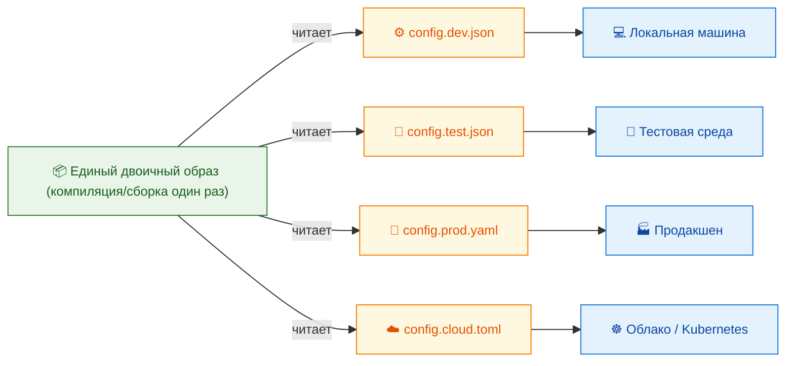
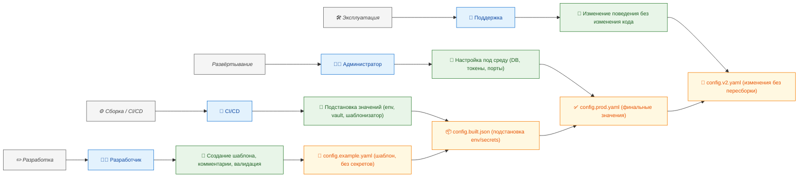

---
tags:
  - all
  - required
  - beginner
title: Конфигурационные файлы
description: "Конфигурация программного обеспечения — это совокупность параметров, определяющих поведение приложения, его взаимодействие с окружением, а также условия функционирования в рамках конкретной."
  параметров и как избегать ошибок при настройке окружений.
---

import AppConfigStackPlay from '@site/src/components/AppConfigStackPlay.jsx';

# Конфигурационные файлы

<div class="article-tags">
  <span class="tag tag-required">ОБЯЗАТЕЛЬНО</span>
  <span class="tag tag-beginner">ДЛЯ НОВИЧКОВ</span>
</div>

<span class="complexity-badge">Всем</span>

## Конфигурационные файлы

### Что такое конфигурация?

**Конфигурация программного обеспечения** — это совокупность параметров, определяющих поведение приложения, его взаимодействие с окружением, а также условия функционирования в рамках конкретной вычислительной системы. 

В отличие от алгоритмической логики, которая закреплена в исходном коде и редко меняется в процессе эксплуатации, конфигурация предназначена для адаптации приложения без внесения изменений в исполняемый код. 

Это достигается посредством вынесения настроек во внешние ресурсы, среди которых наиболее распространённым и технологически устойчивым решением являются конфигурационные файлы.

---

### Конфигурационный файл

<AppConfigStackPlay />

**Конфигурационный файл** — это обычный текстовый документ, созданный и интерпретируемый программой в соответствии с заранее оговорённой структурой и семантикой. 

Его основная функция — хранение значений, которые программа считывает при старте или в процессе работы, чтобы определить, как именно ей следует функционировать в данном окружении. Эти файлы позволяют отделить специфические для среды эксплуатации параметры от логики приложения. Благодаря этому один и тот же двоичный образ может использоваться на множестве машин: на локальном компьютере разработчика, в тестовой среде, в продакшене, в контейнере или в облачном кластере — при условии, что каждая из этих сред снабжена соответствующей конфигурацией.



Конфигурационный файл не содержит инструкций процессора и не участвует непосредственно в вычислениях. Он служит исключительно источником данных для приложения. Однако неправильно составленная конфигурация может привести к неработоспособности системы — иногда с последствиями, сравнимыми с ошибками в коде, а в ряде случаев и более тяжёлыми, поскольку конфигурационные файлы зачастую влияют на системные компоненты, сетевое взаимодействие, права доступа и целостность данных. Поэтому точность, проверяемость и воспроизводимость конфигурации являются критически важными атрибутами инженерной практики.

---

### Роль конфигурационных файлов

Исторически первые конфигурационные файлы возникли в операционных системах UNIX. Они были реализованы в виде простых текстовых файлов с ключами и значениями, разделяемыми знаком равенства или пробелом, без строгой типизации и без вложенной структуры. Такие файлы легко правились вручную с помощью любого текстового редактора, например `vi` или `nano`, и не требовали специализированных инструментов. 

С ростом сложности приложений и расширением спектра задач, которые возлагались на конфигурацию, возникла потребность в более выразительных, структурированных и человекочитаемых форматах. Появились форматы на основе деревьев и иерархических структур — сначала INI-подобные, затем XML, далее JSON и YAML. 

Каждый из этих форматов отвечал на определённые проблемы эпохи: 
- XML позволял строго описывать схемы и проверять валидность через XSD; 
- JSON обеспечил лёгкость интеграции с веб-технологиями благодаря встроенной поддержке в JavaScript; 
- YAML стал де-факто стандартом при описании инфраструктурного кода благодаря возможности вложения, поддержке комментариев и относительной устойчивости к человеческим ошибкам при условии соблюдения отступов.

С точки зрения жизненного цикла приложения, конфигурационные файлы участвуют в следующих этапах:

- **Разработка** — разработчик создаёт шаблоны конфигурации (часто с суффиксом `.example` или в папке `config/defaults/`), указывает обязательные и опциональные параметры, поясняет их смысл в комментариях. Эти файлы обычно включаются в репозиторий исходного кода, но не содержат чувствительных данных.
- **Сборка и упаковка** — в процессе CI/CD в конфигурацию могут внедряться значения, полученные из переменных окружения, секретов или внешних источников. Например, в Docker-образе конфигурационный файл может монтироваться как volume или генерироваться на лету скриптом на основе шаблона.
- **Развёртывание** — администратор или автоматизированная система подставляет окончательные значения: адреса баз данных, токены аутентификации, порты, пути к логам — всё то, что специфично для целевой среды.
- **Эксплуатация и поддержка** — при изменении требований (например, переносе сервиса на другой хост или подключении нового хранилища) изменения вносятся именно в конфигурацию, а не в код. Это позволяет проводить такие модификации без повторной компиляции и минимизировать риски, связанные с разработкой.




Ключевое преимущество такого подхода — разделение ответственности. Разработчик отвечает за *как*, системный администратор — за *где* и *для кого*. Код остаётся стабильным, проверенным, покрытым тестами и аудитом, тогда как конфигурация становится гибким инструментом адаптации, управляемым инфраструктурной командой.

Однако такая гибкость накладывает серьёзные требования на саму практику работы с конфигурацией. Во-первых, конфигурационные файлы должны быть *документированы*. Необходимо чётко указывать назначение каждого параметра, допустимые диапазоны значений, зависимости между ними, а также последствия их изменения. Во-вторых, конфигурация должна быть *версионирована*. Изменения в настройках — это такие же изменения системы, как и в коде. Без контроля версий конфигураций практически невозможно провести отладку инцидентов, отменить некорректное развёртывание или обеспечить воспроизводимость окружения. В-третьих, конфигурационные файлы, содержащие секреты (пароли, ключи API, сертификаты), должны обрабатываться с соблюдением принципов информационной безопасности: исключаться из публичных репозиториев, шифроваться при хранении и передаче, и, по возможности, заменяться на ссылки на внешние хранилища секретов (например, HashiCorp Vault, AWS Secrets Manager, Azure Key Vault).

Существует также принцип *конфигурации как кода* (Configuration as Code, CaC), который рассматривает конфигурационные файлы как полноценный элемент программной системы. В рамках этого подхода конфигурации подвергаются тем же процедурам, что и программный код: проверке статическими анализаторами, модульным и интеграционным тестам, ревью перед слиянием, автоматическому развёртыванию по триггерам. Это позволяет достичь высокой степени предсказуемости и надёжности инфраструктуры.

Отдельного внимания заслуживает вопрос *форматов конфигурационных файлов*. Несмотря на то что с технической точки зрения любой текстовый формат может быть использован для передачи настроек, на практике сложилась устойчивая экосистема стандартов, каждый из которых получил распространение в определённых доменах. Выбор формата обусловлен техническими возможностями (вложенность, типизация, поддержка комментариев), историческими причинами, зрелостью инструментария, наличием парсеров в целевых языках и принятыми в сообществе соглашениями.

---

### Форматы конфигурационных файлов

#### Файл с расширением `.conf`

Расширение `.conf` (от *configuration*) исторически ассоциируется с UNIX- и Linux-ориентированными системами и службами. Сам по себе `.conf` не является форматом в смысле стандартизированной грамматики, а скорее соглашением о назначении файла. Синтаксис конфигурационных файлов с этим расширением определяется конкретной программой и может варьироваться от простейших пар «ключ = значение» до сложных блочных структур с директивами, вложенными секциями и условными операторами.

Классическим примером является `nginx.conf` — основной конфигурационный файл сервера Nginx. Минимальный фрагмент:

```nginx
http {
    server {
        listen 8080;
        location / {
            root /var/www/html;
        }
    }
}
```

В нём используется иерархическая структура, построенная на директивах и контекстах. Контексты (например, `http`, `server`, `location`) задают область действия директив, что позволяет гибко управлять поведением сервера на разных уровнях: глобальном, виртуального хоста, отдельного пути URI. Синтаксис близок к C-подобному: директивы завершаются точкой с запятой, блоки группируются фигурными скобками, комментарии начинаются с символа `#`. Такая структура обеспечивает читаемость даже при большом объёме настроек и легко поддаётся автоматической генерации и проверке.

Важной особенностью конфигураций в стиле `.conf` является их *императивность по отношению к состоянию системы*. Некоторые директивы предписывают конкретные действия: например, `include /etc/nginx/sites-enabled/*;` — это команда загрузить все файлы из указанной директории и встроить их содержимое в текущий конфигурационный контекст. Это отличает их от декларативных форматов вроде YAML, где описывается *что*, а не *как*.

Ещё один распространённый пример — `postgresql.conf`. Здесь преобладает плоская структура: почти каждая строка представляет собой отдельный параметр вида `ключ = значение`, часто сопровождаемый комментарием, поясняющим назначение и допустимые диапазоны. Для сложных параметров (например, `shared_preload_libraries`) допускается перечисление значений через запятую. Такой подход ориентирован на максимальную простоту редактирования вручную и минимизацию синтаксических ошибок.

Следует отметить, что в Linux-экосистеме `.conf`-файлы часто размещаются в каталогах `/etc/`, `/etc/<имя_сервиса>/`, `/usr/local/etc/` — в соответствии с иерархией файловой системы Filesystem Hierarchy Standard (FHS). Это способствует предсказуемости расположения и упрощает администрирование.

#### Файл с расширением `.cfg`

Расширение `.cfg` (от *configuration* или *config*) используется более широко и менее формализованно, чем `.conf`. Оно встречается как в UNIX-подобных системах, так и в кроссплатформенном ПО, особенно в приложениях, написанных на языках с высоким уровнем переносимости — например, Python, Java, C#. Многие игровые движки, десктопные утилиты и встраиваемые системы также прибегают к `.cfg` по соображениям нейтральности и узнаваемости.

Синтаксис `.cfg`-файлов чаще всего основан на формате INI — одном из самых ранних и простых структурированных текстовых форматов. INI предусматривает разделение параметров по именованным секциям, заключённым в квадратные скобки, например:

```
[database]
host = localhost
port = 5432
user = app_user
password = secret
timeout = 30

[logging]
level = info
file = /var/log/app.log
rotate = true
```

Такая структура позволяет избежать коллизий имён параметров в разных подсистемах и делает файл интуитивно понятным даже без документации. При этом формат остаётся легко парсимым: большинство языков предоставляют встроенные или сторонние библиотеки для чтения INI (например, `configparser` в Python, `java.util.Properties` — с оговорками, `ini` в Node.js).

Однако INI имеет ограничения: он не поддерживает вложенные структуры сложнее одного уровня (секция → параметр), не имеет встроенной типизации (все значения — строки, преобразование типов возлагается на приложение), и отсутствует стандарт на комментарии (хотя почти везде принято использовать `;` или `#`). Эти недостатки привели к появлению расширенных диалектов: например, TOML — формат, разработанный как «INI, исправленный и дополненный», с поддержкой массивов, дат, булевых значений и чёткой спецификацией. Несмотря на это, `.cfg` по-прежнему остаётся устойчивым обозначением для любого текстового файла, содержащего настройки, даже если его внутренний формат — JSON или YAML.

Практически важно то, что `.cfg`-файлы часто используются в средах, где требуется минимальная зависимость от внешних библиотек. Например, в микроконтроллерах или embedded-устройствах, где память ограничена, разработчики предпочитают простой парсер для INI-подобного синтаксиса вместо полноценного YAML-парсера.

#### Файлы с расширением `.yml` и `.yaml`

Формат YAML (YAML Ain’t Markup Language) изначально задумывался как человекочитаемая альтернатива XML для описания данных. Его ключевая особенность — использование отступов для обозначения вложенности, что делает структуру визуально очевидной, но одновременно требует строгого соблюдения правил форматирования. Даже один лишний или недостающий пробел может привести к тому, что парсер не распознает структуру, и приложение завершится с ошибкой ещё до запуска основной логики.

Пример `config.example.yaml`:

```yaml
server:
  host: 0.0.0.0
  port: 8080
logging:
  level: info
  file: /var/log/app.log
database:
  host: localhost
  port: 5432
```

Проверить синтаксис без запуска приложения:

```bash
python -c "import yaml; yaml.safe_load(open('config.example.yaml'))"
# или: yamllint config.example.yaml
```

YAML поддерживает богатый набор типов данных: скаляры (строки, числа, булевы значения), последовательности (массивы, списки) и отображения (ассоциативные массивы, словари, объекты). При этом типизация в большинстве реализаций — *динамическая и неявная*: интерпретатор пытается определить тип по внешнему виду значения. Например, строка `true` будет распознана как логическое `true`, а `2025-11-26` — как дата. Это удобно, но может приводить к неожиданностям: строка `yes` в старых версиях парсеров иногда интерпретировалась как `true`, что вызывало ошибки в конфигурациях.

Широкое распространение YAML получил в инфраструктурных инструментах: Docker Compose, Kubernetes, Ansible, Helm, GitLab CI/CD. Причина — в балансе между выразительностью и читаемостью. Например, в `docker-compose.yml` можно описать целую систему из нескольких взаимодействующих сервисов, сетей и томов, используя вложенность, ссылки (`&anchor`, `*alias`) и подстановки переменных (`${VAR}`), при этом файл остаётся легко воспринимаемым. В Kubernetes манифесты в формате YAML позволяют декларативно описать желаемое состояние кластера: сколько подов должно быть запущено, какие образы использовать, какие тома примонтировать, какие политики сети применить.

Важно: YAML — это не язык программирования. Он не поддерживает логические операторы, циклы, функции. Для подстановки значений из окружения используют шаблоны и утилиты (`envsubst`, `yq`, Helm), а не «магию» внутри самого YAML.

#### Файл с расширением `.json`

JSON (*JavaScript Object Notation*) — компактный формат «ключ → значение» с вложенными объектами и массивами. Комментарии в стандарте JSON **не предусмотрены**.

Пример `appsettings.json` (типично для .NET и многих веб-сервисов):

```json
{
  "Logging": {
    "LogLevel": {
      "Default": "Information"
    }
  },
  "Database": {
    "Host": "localhost",
    "Port": 5432
  }
}
```

#### Файл с расширением `.reg`

Формат `.reg` специфичен для операционной системы Microsoft Windows и представляет собой текстовое представление фрагмента системного реестра. Реестр — иерархическая база данных параметров, используемая Windows для хранения настроек ядра, драйверов, системных служб и приложений. `.reg`-файлы предназначены для импорта и экспорта записей реестра вручную или автоматически.

Структура `.reg`-файла проста, но требует точности. Первая строка всегда содержит сигнатуру версии: `Windows Registry Editor Version 5.00`. Далее следуют пути к разделам реестра в квадратных скобках, например `[HKEY_CURRENT_USER\Software\MyApp]`. Внутри раздела перечисляются параметры вида `"имя"=тип:значение`. Типы включают `REG_SZ` (строка), `REG_DWORD` (32-битное число), `REG_BINARY` (байтовый массив) и другие. Например:

```
[HKEY_CURRENT_USER\Environment]
"JAVA_HOME"="C:\\Program Files\\Java\\jdk-17"
"Path"=hex(2):25,00,53,00,59,00,53,00,54,00,45,00,4d,00,52,00,4f,00,4f,00,54,00,25,00,00,00
```

Особую осторожность требует работа с `.reg`-файлами по двум причинам. 

Во-первых, изменения в реестре влияют на глобальное состояние системы. Некорректная запись может сделать приложение неработоспособным, а в худших случаях — нарушить загрузку ОС. 

Во-вторых, `.reg`-файлы легко использовать в злонамеренных целях: поскольку они могут содержать произвольные команды при импорте, их распространение вне доверенной среды представляет угрозу безопасности. Поэтому современные версии Windows запрашивают явное подтверждение перед выполнением импорта, а антивирусные системы сканируют такие файлы на предмет подозрительных ключей.

Несмотря на риски, `.reg` остаётся важным инструментом для системных администраторов при массовом развёртывании настроек, особенно в доменных средах, где групповые политики (GPO) в итоге транслируются в изменения реестра.

#### `Web.config` и `App.config` (ASP.NET)

В экосистеме Microsoft конфигурация классических приложений на **ASP.NET Framework** хранится в XML-файлах `Web.config` (веб) и `App.config` (десктоп). Расширение `.aspx` к конфигурации не относится — это страницы с кодом на C#/VB.NET.

```xml
<connectionStrings>
  <add name="DefaultConnection" 
       connectionString="Server=.;Database=MyApp;Trusted_Connection=True;" 
       providerName="System.Data.SqlClient" />
</connectionStrings>
```

В **ASP.NET Core** основным форматом стал `appsettings.json`; XML остаётся для обратной совместимости.

---


### Принципы проектирования конфигурационных файлов

Конфигурация, несмотря на внешнюю простоту, является неотъемлемой частью архитектуры программного обеспечения. Её качество напрямую влияет на сопровождаемость, воспроизводимость и безопасность системы. Существует ряд устоявшихся принципов, соблюдение которых позволяет избежать множества проблем на всех этапах жизненного цикла.

**Принцип явного указания значений (Explicit over Implicit)**  
Приложение должно считывать все критически важные параметры из конфигурации, даже если для них существует разумное значение по умолчанию. Значения по умолчанию допустимы для *второстепенных* параметров, влияющих на производительность, логирование или поведение в граничных условиях, но недопустимы для параметров, определяющих *семантику работы*: адрес базы данных, идентификатор клиента, режим шифрования, политика доступа. Явное указание делает поведение предсказуемым, исключает неожиданное переключение режимов при обновлении библиотек и упрощает аудит.

**Принцип идемпотентности и декларативности**  
Конфигурация должна описывать *желаемое состояние*, а не последовательность действий для его достижения. Например, вместо директивы `restart_service_if_port_occupied = true` предпочтительнее указать `port = 8080` и позволить программе самой решить, как обеспечить прослушивание этого порта (перезапустить, выбрать другой, завершить работу с ошибкой). Это упрощает понимание, позволяет инструментам проводить валидацию *до* применения и делает конфигурацию совместимой с системами управления состоянием (например, Kubernetes, Terraform).

**Принцип минимизации поверхности конфигурации**  
Число настраиваемых параметров должно быть минимально достаточным. Каждый новый параметр увеличивает комбинаторную сложность, усложняет тестирование, повышает риск некорректных комбинаций и затрудняет документирование. Если параметр используется только в одном из десяти сценариев — возможно, его стоит вынести в отдельный профиль конфигурации или заменить на логику, вычисляемую приложением на основе контекста (например, по имени хоста или тегам в облаке).

**Принцип обратной совместимости**  
Изменения в конфигурации должны проводиться с учётом существующих развёртываний. Если параметр устаревает, он не удаляется мгновенно: вводится новый параметр, старый сохраняется с пометкой deprecated, логируется предупреждение при его использовании, и только через несколько версий он исключается. Это даёт администраторам время на миграцию и исключает аварийные отказы при обновлении.

**Принцип документирования в самом файле**  
Каждый параметр, особенно неочевидный, должен сопровождаться комментарием прямо в конфигурационном файле. Комментарий должен включать: назначение параметра, допустимые значения (или диапазон), единицы измерения (если применимо), последствия изменения, ссылку на документацию. Это особенно важно для распределённых команд, где разработчик и администратор — разные люди, а контекст принятия решения может быть утерян со временем.

---

### Порядок загрузки конфигурации

Современные приложения редко полагаются на единственный источник настроек. Вместо этого используется *многоуровневая модель загрузки*, где значения из разных источников объединяются по заранее определённым правилам приоритета. Такой подход обеспечивает гибкость: базовые значения задаются разработчиком, специфичные для среды — администратором, а временные переопределения — оператором при запуске.

Типичная иерархия (от низшего приоритета к высшему):

1. **Значения по умолчанию**, зашитые в код. Это «аварийный» уровень: если ни один внешний источник не предоставил значение, приложение использует безопасный минимум. Такие значения не должны содержать секретов и не должны предполагать конкретную среду (например, `host = "localhost"` допустимо, `database_url = "prod-db.internal"` — нет).

2. **Конфигурационный файл по умолчанию**, поставляемый с приложением (например, `appsettings.json` в папке проекта). Он содержит общие настройки, пригодные для локальной разработки. Обычно включается в систему контроля версий.

3. **Основной конфигурационный файл**, размещённый в стандартном системном каталоге (например, `/etc/myapp/config.yml`, `C:\ProgramData\MyApp\settings.conf`). Этот файл подменяет значения из предыдущего уровня и предназначен для системного администратора.

4. **Переопределение через переменные окружения**. Переменные окружения имеют более высокий приоритет, чем файлы, и позволяют быстро скорректировать поведение без изменения файлов — что особенно ценно в контейнерных средах (Docker, Kubernetes) и при использовании PaaS-платформ. Соглашение об именовании: иерархические ключи транслируются в плоские имена с разделителями (например, `LOG_LEVEL` для `logging.level`, `DB__HOST` для `database.host` — двойное подчёркивание часто используется для имитации вложенности).

5. **Аргументы командной строки**. Наивысший приоритет. Позволяют оператору мгновенно переопределить любую настройку при запуске. Используется для отладки, однократных экспериментов, аварийного вмешательства. Однако чрезмерное использование аргументов усложняет воспроизводимость — запуск из скрипта должен фиксировать все переданные флаги.

Важно: порядок объединения значений зависит от *типа данных*. Для скалярных параметров (строки, числа) действует правило «последнее значение побеждает». Для сложных структур (массивы, словари) поведение может отличаться: одни фреймворки полностью заменяют структуру, другие — объединяют или дополняют. Это необходимо документировать и тестировать. Например, в .NET Core массивы по умолчанию *замещаются*, а не объединяются; в Spring Boot — настраивается поведение с помощью аннотаций.

Некоторые системы (например, HashiCorp Vault, Consul) поддерживают *динамические конфигурации*: приложение периодически опрашивает внешний источник и перечитывает настройки без перезапуска. Это требует от приложения устойчивости к изменению конфигурации «на лету» — например, корректного пересоздания пулов соединений или обновления маршрутов.

---

### Инструменты и экосистема

Работа с конфигурацией в промышленном масштабе невозможна без специализированных инструментов. Они охватывают весь путь: от написания и проверки до развёртывания и мониторинга. Важно понимать, что инструмент не заменяет инженерное суждение — он лишь усиливает дисциплину и автоматизирует рутину. Выбор инструмента должен основываться на трёх критериях:  
- соответствие формату и сложности конфигурации,  
- интеграция в существующий CI/CD-конвейер,  
- наличие механизмов проверки и отката.

#### Парсеры и библиотеки для чтения конфигурации

На уровне приложения конфигурация обрабатывается с помощью *парсеров* — компонентов, преобразующих текстовый файл в структуры данных языка программирования. Современные фреймворки предоставляют встроенные решения, но их возможности и поведение различаются.

В **C# (.NET)** основной инструмент — `Microsoft.Extensions.Configuration`. Это единый интерфейс, объединяющий источники: JSON-файлы (`AddJsonFile`), переменные окружения (`AddEnvironmentVariables`), аргументы командной строки (`AddCommandLine`), а также кастомные провайдеры (например, для Azure Key Vault). Ключевые особенности:  
- поддержка привязки к strongly-typed объектам (`IOptions<T>`),  
- иерархическая структура ключей через двойную двоеточку (`Section:SubSection:Key`),  
- автоматическое преобразование типов (строка → `int`, `bool`, `TimeSpan`).  
Ограничение: массивы объединяются не по умолчанию; для замещения требуется явное указание провайдера с флагом `reloadOnChange: false`.

В **Java (Spring Boot)** используется `@ConfigurationProperties`, интегрированный с `application.properties`/`application.yml`. Spring поддерживает профили (`application-prod.yml`), внешние локации (`--spring.config.location`), и криптографию через `jasypt`. Особое внимание уделяется валидации: аннотации `@Valid`, `@Min`, `@Pattern` позволяют проверять значения при привязке. Однако Spring не проверяет *наличие* обязательных полей — это требует дополнительной логики.

В **Python** нет единого стандарта, но распространены:  
- `configparser` — для INI-подобных файлов, встроенный, лёгкий, поддерживает интерполяцию переменных,  
- `PyYAML` — для YAML, требует осторожности с безопасностью (по умолчанию разрешает выполнение кода через теги `!!python/object` — следует использовать `yaml.safe_load`),  
- `python-decouple` или `dynaconf` — для многоуровневой загрузки (`.env` → файл → env → default), с поддержкой кастомизации и валидации.

В **Go** популярны `viper` и `koanf`. `Viper` поддерживает множество форматов (JSON, TOML, YAML, HCL, env, flags), позволяет сливать источники, предоставляет механизм «обсервера» для перезагрузки конфигурации. Слабое место — отсутствие встроенной валидации; её приходится реализовывать вручную или через сторонние библиотеки (`govalidator`, `ozzo-validation`).

Общая тенденция — переход от *монолитных парсеров* к *композитным провайдерам*, где каждый источник инкапсулируется и может быть заменён или расширен без изменения основной логики.

#### Инструменты командной строки для манипуляции конфигурацией

В автоматизированных процессах (CI, сборка образов, развёртывание) часто требуется *изменять* конфигурацию без ручного редактирования. Здесь незаменимы утилиты, работающие в конвейере (pipeline) через стандартные потоки ввода-вывода.

`jq` — стандарт де-факто для работы с JSON. Позволяет выбирать, фильтровать, преобразовывать, обновлять поля. Например, подстановка значения из переменной окружения:  
```bash
jq --arg host "$DB_HOST" '.database.host = $host' config.json > config.new.json
```  
Поддерживает сложные трансформации, но требует изучения собственного языка выражений.

`yq` — аналог `jq` для YAML и XML. Реализован на Go, сохраняет структуру отступов и комментарии (в отличие от конвертации YAML→JSON→YAML через `jq`). Пример замены:  
```bash
yq e '.server.port = env(DB_PORT)' -i config.yml
```  
Флаг `-i` обеспечивает редактирование файла «на месте».

`envsubst` — утилита из пакета `gettext`, подставляет значения переменных окружения в шаблон. Синтаксис: `${VAR}` или `$VAR`.

Шаблон `config.template.yml`:

```yaml
database:
  host: ${DB_HOST}
  port: ${DB_PORT}
```

Подстановка перед запуском:

```bash
export DB_HOST=db.internal
export DB_PORT=5432
envsubst < config.template.yml > config.yml
```

Ограничение: `envsubst` не умеет условную логику — для сложных шаблонов нужны Helm, `confd` или скрипт на Python.

`confd` и `consul-template` — инструменты для *динамической генерации* конфигурации на основе данных из распределённых хранилищ (Consul, etcd, Vault). Они опрашивают хранилище, применяют шаблон (в синтаксисе Go templates), и перезаписывают конфигурационный файл при изменении данных. После генерации может быть запущен `reload` сервиса (например, `nginx -s reload`). Это позволяет реализовать паттерн *service discovery without client-side libraries* — сервис получает актуальные адреса бэкендов через файл, а не через API.

#### Валидация

Валидация — неотъемлемая часть надёжной работы с конфигурацией. Существует два основных подхода:

1. **Схемы (Schema)** — декларативное описание структуры и типов.  
   - Для JSON — JSON Schema. Файлы `.schema.json` могут быть связаны с конфигурацией через `$schema`, что включает поддержку в редакторах (VS Code, IntelliJ). Проверка выполняется утилитами вроде `ajv` (Another JSON Schema Validator).  
   - Для YAML — схемы обычно задаются в формате JSON Schema, так как YAML сам по себе не имеет стандарта схем. Инструменты вроде `kubeval` используют предопределённые схемы OpenAPI для валидации Kubernetes-манифестов.  
   - Для XML — XSD (XML Schema Definition). Поддерживается большинством IDE и утилитами вроде `xmllint`.

2. **Статический анализ** — проверка на соответствие стилю, наличие уязвимостей, устаревших конструкций.  
   - `yamllint` — проверяет отступы, длину строк, использование потоковых/блочных стилей, избыточные ключи.  
   - `checkov`, `tfsec` — анализируют конфигурации инфраструктуры (Terraform, CloudFormation) на соответствие политикам безопасности.  
   - `conftest` — универсальный инструмент, использующий язык политик Rego (из Open Policy Agent). Позволяет писать кастомные правила: например, «все образы Docker должны быть из внутреннего registry», «порт не должен быть 22».

Важно: валидация должна выполняться *до* применения конфигурации — на этапе сборки или в pre-commit hook. Это предотвращает попадание некорректных настроек в production.

#### Системы управления секретами и конфигурацией

Когда речь заходит о масштабировании, встаёт вопрос централизованного управления. Отдельные файлы на каждом сервере становятся неуправляемыми. Решение — выделенные системы.

**HashiCorp Vault** — наиболее зрелое решение для управления секретами. Позволяет:  
- динамически генерировать учётные данные (например, временные токены БД),  
- шифровать/расшифровывать данные «на лету» (transit secrets engine),  
- интегрироваться с Kubernetes через sidecar-контейнеры или CSI-драйвер.  
Vault не хранит конфигурацию как таковую, но предоставляет безопасный канал для получения чувствительных значений, которые затем подставляются в конфиг.

**etcd / Consul KV** — распределённые key-value хранилища, используемые для хранения *нечувствительной* конфигурации (флаги включения функций, пороговые значения, адреса сервисов). Их преимущество — консистентность, watch-механизмы для оповещения об изменениях. Часто применяются в связке с `confd`.

**Kubernetes-native подходы**  
В экосистеме Kubernetes конфигурация и секреты вынесены в отдельные объекты:  
- `ConfigMap` — для несекретных данных (YAML, properties, текст),  
- `Secret` — для чувствительных данных (base64-encoded, но не зашифрованных по умолчанию; для шифрования требуется настройка `EncryptionConfiguration`).  
Они монтируются в поды как volume или передаются как переменные окружения. Это позволяет разделять жизненные циклы приложения и его настроек: конфиг можно обновить без пересборки образа.

Однако Kubernetes не решает проблему *управления версиями* ConfigMap/Secret. Для этого используются GitOps-подходы: Argo CD или Flux отслеживают изменения в Git-репозитории и синхронизируют их с кластером, обеспечивая аудит и откат.

#### Автоматическая генерация документации

Конфигурация без документации быстро становится техническим долгом. Решение — генерация справочника на основе схемы или аннотаций в коде.

- В **Spring Boot** утилита `spring-boot-configuration-processor` генерирует `META-INF/spring-configuration-metadata.json` на этапе компиляции. Этот файл используется IDE для подсказок и может быть преобразован в Markdown (например, через `spring-auto-restdocs`).  
- В **.NET** можно использовать рефлексию над классами `IOptions<T>` и `OptionAttribute`, чтобы сформировать таблицу параметров с описаниями.  
- В **Python** библиотека `sphinx-click` или кастомные скрипты на основе `dataclasses` позволяют извлекать docstrings и типы.

Идеальный результат — единый HTML-документ, встроенный в веб-интерфейс приложения (например, `/actuator/configprops` в Spring Boot) или публикуемый в Confluence/Docusaurus. Это закрывает цикл: конфигурация проектируется, тестируется, развёртывается и документируется в рамках единой дисциплины.

---
