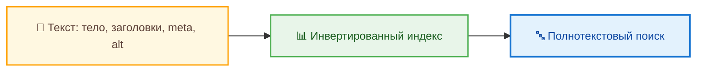
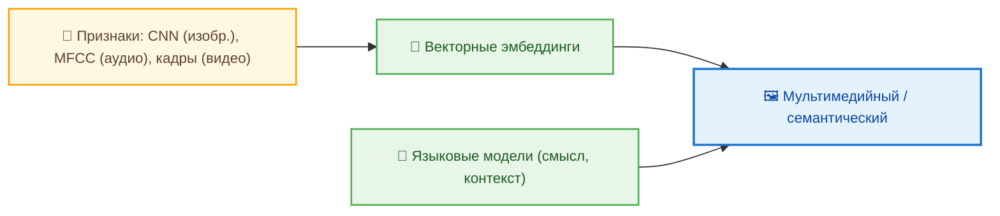
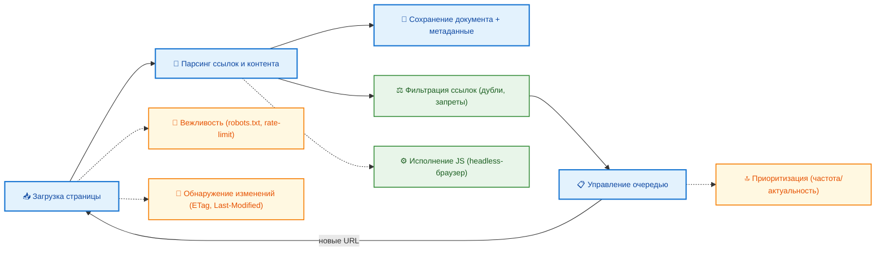
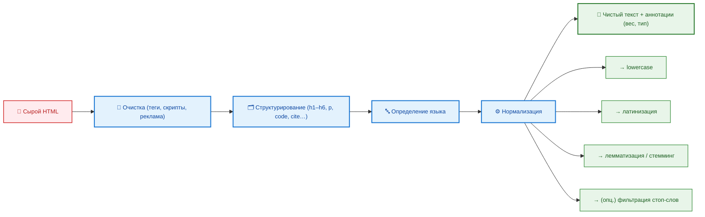
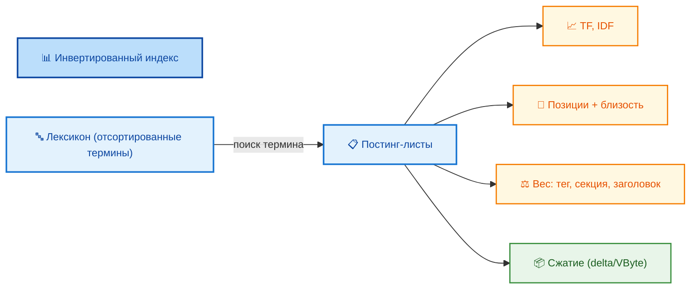
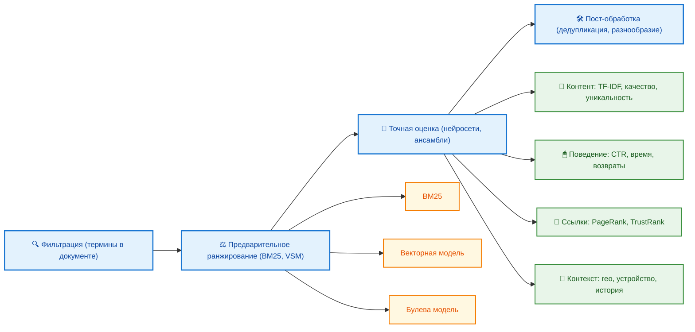
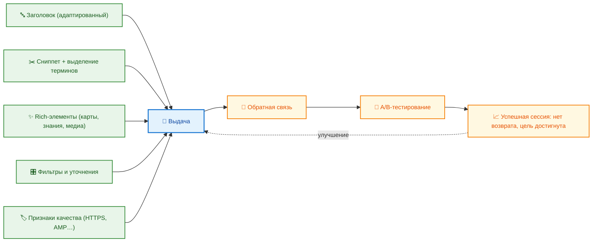
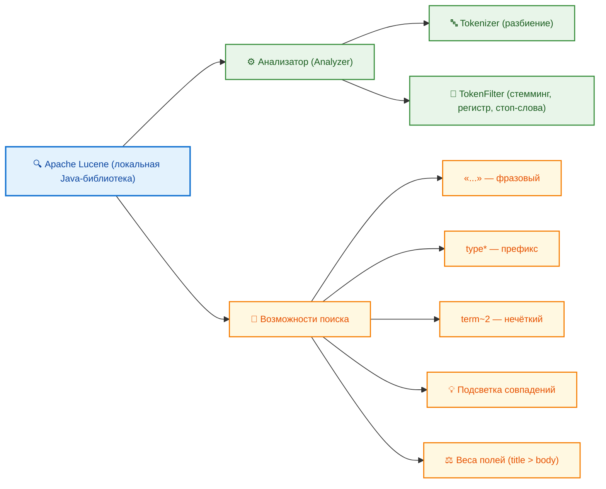
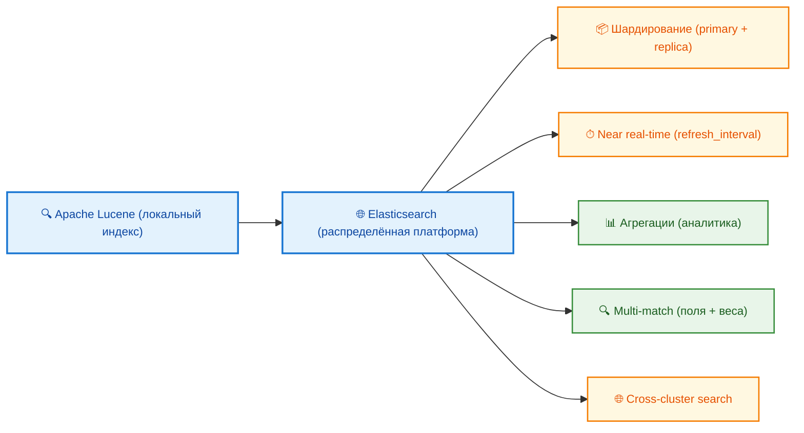
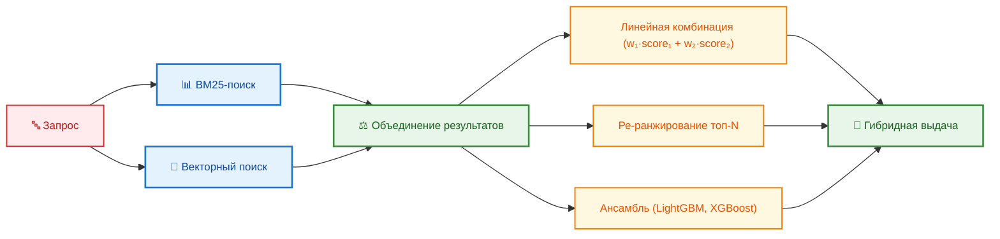

# Поисковые системы

<div class="article-tags">
  <span class="tag tag-required">ОБЯЗАТЕЛЬНО</span>
  <span class="tag tag-beginner">ДЛЯ НОВИЧКОВ</span>
</div>

<span class="complexity-badge">Всем</span>

## Технологии поиска

### Что такое информационный поиск?

Информационный поиск (англ. *Information Retrieval*, IR) — это дисциплина, изучающая методы, алгоритмы и системы, обеспечивающие извлечение информации из больших коллекций данных по заданному критерию. 

В отличие от баз данных, где поиск осуществляется по строго определённым полям и с точными условиями (например, `SELECT * FROM users WHERE age > 30`), информационный поиск ориентирован на **неточные, семантически насыщенные, часто неоднозначные запросы**, где заранее неизвестно, какие именно документы содержат нужное знание. Важнейшая цель IR — выделить те документы, которые **наиболее полезны, достоверны и соответствуют намерению пользователя**.

Человечество сегодня оперирует информацией в объёмах, недоступных индивидуальному восприятию. По состоянию на 2025 год, индексируемая часть Всемирной паутины превышает **60 триллионов** уникальных веб-страниц. Каждую секунду публикуются десятки тысяч новых документов: статьи, технические спецификации, отчёты, документации, блоги, форумные обсуждения. При этом значительная доля информации не структурирована, не классифицирована и не снабжена явными метками, облегчающими навигацию. В таких условиях поиск информации перестаёт быть простым актом обращения к поисковой строке — он становится **процессом с многоуровневой архитектурой**, включающей этапы формулирования запроса, его трансформации, сопоставления с индексированными данными, оценки релевантности и интерпретации результатов.

---

### Классификация поисковых задач  

Прежде чем перейти к архитектуре поисковых систем, важно различать **типы поиска**, поскольку они определяют выбор технологий и методов обработки.


#### Полнотекстовый поиск  

Это наиболее распространённая форма поиска в веб-среде. Полнотекстовый поиск предполагает сканирование **всего текстового содержимого** документа — заголовков, основного тела, примечаний, подписей к изображениям (если они прописаны в `alt`), а также часто — скрытых метатегов (`<meta name="description">`). Важно: поиск не ограничивается заголовками или именами файлов; он охватывает *всю извлекаемую лексическую единицу*.



Для обеспечения приемлемой производительности при работе с триллионами документов полнотекстовый поиск *никогда* не выполняется «на лету», т.е. путём одновременного чтения и анализа всех страниц при каждом новом запросе. Вместо этого используются **индексы** — предварительно построенные структуры данных, в которых информация организована так, чтобы отклик на запрос происходил за время, пропорциональное *длине результата*, а не *размеру коллекции*. Индексирование — это этап подготовки, аналогичный созданию оглавления или предметного указателя для многотомного издания. Без индекса поиск в массиве данных сопоставим по сложности с листанием всех страниц энциклопедии в поиске одной фразы.

#### Поиск по метаданным  

Метаданные — это данные о данных. Они не содержат содержательного смысла основного документа, но описывают его свойства:  
- имя файла или URI-путь;  
- MIME-тип (например, `text/html`, `application/pdf`);  
- дата последнего изменения;  
- размер в байтах;  
- автор, организация, лицензия (если указаны в `<meta>` или EXIF/XMP);  
- структурные признаки (например, наличие таблиц, кодовых блоков, заголовков определённого уровня).  


Поиск по метаданным применяется повсеместно: в файловых менеджерах (`find . -name "*.md" -mtime -7`), в цифровых архивах, в системах управления документами (СУД), в библиотечных каталогах. Его преимущество — высокая точность и скорость, поскольку метаданные компактны и однозначно интерпретируемы. Недостаток — ограниченная выразительность: даже самый точный запрос по автору и дате не гарантирует, что *содержание* документа соответствует ожиданиям.

#### Мультимедийный и семантический поиск  

Традиционные текстовые методы неприменимы к изображениям, аудио и видео. Решение — преобразование мультимедиа в признаковое описание, допускающее сравнение.  



Для изображений используются:  
- **цветовые гистограммы** (распределение оттенков);  
- **ключевые точки и дескрипторы** (SIFT, SURF, ORB);  
- **эмбеддинги**, полученные с помощью свёрточных нейронных сетей (CNN), например, ResNet или EfficientNet. Такие эмбеддинги кодируют семантическое содержание: изображения кошки и котёнка окажутся ближе в векторном пространстве, чем кошка и автомобиль.  

Поиск по изображению («обратный поиск») строится на сравнении векторных представлений: система получает запрос-изображение, извлекает его признаковый вектор, затем ищет в базе наиболее близкие по косинусной или евклидовой метрике. Аналогичный подход применяется для аудио (MFCC, спектрограммы), видео (кадровые эмбеддинги + временные зависимости) и даже 3D-моделей.

Отдельно стоит выделить **семантический поиск**, который выходит за рамки поверхностного совпадения слов. Он стремится понять *смысл запроса*, а не только его лексическую форму. Например, запрос *«как сохранить состояние между HTTP-запросами»* семантически эквивалентен *«способы хранения сессии в веб-приложении»*, хотя общих слов почти нет. Такой поиск опирается на языковые модели, обученные на корпусах текстов, и способен выявлять синонимию, гиперонимию и контекстуальные связи.

---

### Архитектура поисковой системы 

Поисковая система — это распределённая программно-аппаратная инфраструктура, состоящая из нескольких крупных подсистем, работающих независимо, но согласованно.

#### Сбор данных 

Краулер (от англ. *to crawl* — ползать) — это программа, автоматически посещающая веб-страницы по гиперссылкам и загружающая их содержимое для дальнейшей обработки. Процесс начинается с так называемых **семен** (*seeds*) — начального набора известных URL (например, главные страницы популярных сайтов). При посещении страницы краулер:  
- извлекает HTML-разметку;  
- парсит все ссылки (`<a href="...">`);  
- фильтрует их по правилам (исключает `javascript:`, `mailto:`, дубликаты, запрещённые домены);  
- добавляет новые URL в очередь обхода;  
- сохраняет исходный документ и метаданные (время ответа, HTTP-статус, размер, TLS-версия).




Краулеры работают в условиях жёстких ограничений:  
- **вежливость** — соблюдение `robots.txt`, ограничение частоты запросов к одному хосту;  
- **приоритизация** — часто обновляемые ресурсы (новостные порталы) сканируются чаще;  
- **обнаружение изменений** — сравнение хешей (ETag, Last-Modified) позволяет не перезагружать неизменившиеся страницы;  
- **обработка динамики** — современные краулеры способны исполнять JavaScript (с помощью headless-браузеров), чтобы получать контент, рендерящийся на клиенте.

Одновременно в сети может работать **миллионы** краулеров, распределённых по дата-центрам. Индекс Google обновляется непрерывно: наиболее важные страницы — в течение минут; менее посещаемые — раз в несколько дней или недель.

#### Парсинг и нормализация  

Сырой HTML не пригоден для индексации: он содержит разметку, скрипты, стили, служебные блоки (шапки, футеры, реклама). На этапе парсинга выполняется:  
- **очистка** — удаление тегов, оставление только текстового содержания;  
- **структурирование** — выделение заголовков (`<h1>`–`<h6>`), абзацев, списков, цитат, кодовых блоков;  
- **языковое определение** — автоопределение языка (по n-граммам, стоп-словам, модели);  
- **нормализация текста**:  
  - приведение к нижнему регистру;  
  - удаление диакритических знаков (латинизация);  
  - лемматизация или стемминг (приведение слов к основе: *«работал» → «работать»*, *«running» → «run»*);  
  - удаление стоп-слов (предлоги, союзы, местоимения), хотя в современных системах это не всегда делается — многие стоп-слова несут семантическую нагрузку (*«не работает» ≠ «работает»*).



Результат — «чистый» текст с аннотациями о структуре и весе элементов (например, слова в `<h1>` получают повышенный вес при ранжировании).

#### Индексирование 

Индекс — это специально спроектированная **инвертированная структура** (*inverted index*), построенная по принципу: *слово → список документов, где оно встречается*.

Рассмотрим упрощённый пример. Пусть есть три документа:  
- D1: *«кошка спит на диване»*  
- D2: *«собака гоняется за кошкой»*  
- D3: *«диван старый, кошка новая»*

После токенизации и нормализации (удаление стоп-слов *«на»*, *«за»*, *«старый»*, *«новая»* — опционально) получаем:

| Токен   | Документы      | Позиции в документе      |
|---------|----------------|--------------------------|
| кошка   | D1, D2, D3     | [1], [3], [2]            |
| спит    | D1             | [2]                      |
| диван   | D1, D3         | [4], [1]                 |
| собака  | D2             | [1]                      |
| гоняется| D2             | [2]                      |

В реальных системах индекс содержит значительно больше информации:  
- частота термина в документе (TF);  
- количество документов, содержащих термин (IDF);  
- вес позиции (в заголовке — выше, в комментариях — ниже);  
- вес по типу тега (`<title>` > `<h1>` > `<p>` > `<footer>`);  
- информация о близости терминов («кошка» и «диван» близки в D1 — это повышает релевантность запроса *«кошка на диване»*).



Индекс хранится в *разделённом виде*:  
- **лексикон** — отсортированный список всех уникальных терминов;  
- **постинг-листы** — для каждого термина — сжатый список (документ, позиции, веса).

Сжатие (например, delta-кодирование, Variable Byte Coding) позволяет уменьшить объём в 4–10 раз. Обновление индекса происходит по мере поступления новых данных: для часто меняющихся ресурсов используют *real-time индексацию* (в памяти), для архивных — *batch-перестроение* (раз в сутки).

#### Ранжирование

Наличие термина в документе — лишь необходимое, но недостаточное условие для его попадания в топ выдачи. Ранжирование — это оценка **полезности документа для конкретного запроса и конкретного пользователя**.

Классические модели ранжирования:  
- **Булева модель** — чёрно-белая: документ либо удовлетворяет запросу (все термины есть), либо нет. Используется в юридических и технических базах, где нужна полнота, а не точность.  
- **Векторная модель** (*Vector Space Model*) — документ и запрос представляются как векторы в многомерном пространстве (по осям — термины), а релевантность — как косинус угла между ними. Популярна благодаря интуитивной ясности и эффективности.  
- **Вероятностная модель** (*BM25*) — уточнённая версия, учитывающая длину документа, частоту термина и IDF. BM25 остаётся «золотым стандартом» в open-source поисковых движках (Elasticsearch, Whoosh, Lucene).



Современные поисковики используют **ансамбли моделей**, включающие сотни сигналов:  
1. **Контент-сигналы**:  
   - соответствие запросу (TF-IDF, BM25);  
   - качество текста (орфография, грамматика, глубина);  
   - мультимедийное наполнение (наличие схем, таблиц, видео);  
   - уникальность (проверка на дубликаты и плагиат).  

2. **Поведенческие сигналы**:  
   - CTR (click-through rate) — как часто пользователи кликают на этот документ при таком запросе;  
   - время на странице, глубина просмотра;  
   - возвраты (pogo-sticking — пользователь быстро вернулся к выдаче);  
   - доля мобильных/настольных просмотров.  

3. **Ссылочные сигналы** (PageRank и его модификации):  
   - количество и качество входящих ссылок;  
   - авторитетность домена (TrustRank, SpamRank);  
   - тематическая близость источника и цели ссылки.  

4. **Контекст пользователя**:  
   - геолокация (результаты для «аптека» будут локальными);  
   - язык интерфейса и предпочтения;  
   - история поиска и просмотров (если включена персонализация);  
   - устройство (мобильный/ПК), время суток.

Ранжирование — это конвейер: сначала фильтрация (оставляются только документы, содержащие ключевые термины), затем предварительное ранжирование (простые модели, например, BM25), затем точная оценка (нейросетевые модели, например, Google’s *Neural Matching*), и, наконец, пост-обработка (дедубликация, разнообразие тем, демографические ограничения).

#### Выдача и её адаптация  

Результат поиска — **структурированный интерфейс**, включающий:  
- заголовок (часто переформулированный на основе `<title>` и контента);  
- сниппет — краткое описание, выделенное из текста с учётом запроса (жирным выделяются совпадающие термины);  
- rich-элементы: карточки знаний, изображения, карты, цитаты, калькуляторы, таблицы;  
- фильтры и уточнения (время, тип документа, регион);  
- признаки качества («HTTPS», «AMP», «архивная копия»).



Система постоянно анализирует эффективность выдачи по A/B-тестам: если новая версия алгоритма повышает долю успешных сессий (пользователь нашёл нужное и не вернулся), она постепенно внедряется.

---

### Эволюция  

Традиционный поиск работает по принципу *запрос → документы*. Но с 2023 года крупные поисковики начали внедрять **гибридные режимы**, где результатом становится **непосредственный ответ**, сгенерированный языковой моделью на основе проиндексированных источников.

#### Режим ИИ в Google Search (SGE — Search Generative Experience)  

Google SGE — надстройка над классическим индексом. При включении режима ИИ:  
1. Пользовательский запрос сначала обрабатывается традиционным конвейером (парсинг, расширение, предварительный отбор документов);  
2. Топ-документы (обычно 10–20) передаются в крупную языковую модель (LLM, например, PaLM 2 или Gemini);  
3. LLM генерирует **структурированный ответ**, включающий:  
   - краткое пояснение;  
   - ключевые факты (часто в виде маркированных пунктов, но без формул);  
   - прямые ссылки на источники (с подписями: *«согласно документации MDN»*, *«как указано в RFC 7231»*);  
   - альтернативные формулировки запроса («возможно, вы имели в виду…»);  
   - уточняющие вопросы («хотите сравнить подходы в C# и Java?»).  

Модель **не выдумывает**. Она обучена на огромных корпусах, но при генерации отчёта ссылается *только* на проиндексированные и ранжированные документы. Это обеспечивает проверяемость и снижает риски галлюцинаций.  

SGE особенно эффективен для:  
- комплексных, многоаспектных запросов (*«как реализовать OAuth 2.0 в микросервисной архитектуре»*);  
- запросов, требующих синтеза из нескольких источников;  
- образовательных и исследовательских задач, где важно понимание.

#### Алиса в Яндекс.Поиске  

Яндекс интегрирует голосового ассистента Алиса напрямую в поисковую выдачу. При запросе в строке поиска Алиса может:  
- дать голосовой или текстовый ответ до загрузки страницы результатов;  
- использовать знания из Яндекс.Знатока (верифицированная экспертная база);  
- обращаться к API сервисов (перевод, курсы валют, расписание);  
- строить цепочки рассуждений:  
  *Запрос: «сколько памяти нужно для PostgreSQL с 10 млн строк?»*  
  → Алиса:  
  1. Оценивает средний размер строки (по типам колонок);  
  2. Учитывает накладные расходы (индексы, MVCC, WAL);  
  3. Ссылается на официальную документацию и бенчмарки;  
  4. Даёт диапазон: *«Ориентировочно 2–5 ГБ, но рекомендуется протестировать на реальных данных»*.

Алиса также поддерживает **многоходовые диалоги**: уточняющие вопросы сохраняются в контексте сессии, что позволяет строить запросы в естественной форме:  
— *«Как настроить CORS в Express?»*  
— *«А если нужно разрешить только GET и POST?»*  
— *«А с куками?»*

Ключевое отличие от SGE — более тесная интеграция с экосистемой Яндекса (Карты, Маркет, Музыка), что делает её сильной в локальных и сервисных задачах.

---

### Технологии поиска

Поисковые системы строятся на стеке технологий, где каждый уровень решает свою задачу: от хранения и индексации до моделирования смысла. Ниже рассматриваются ключевые компоненты, как open-source, так и проприетарные, с акцентом на их принципы работы, а не на API или синтаксис.

#### Apache Lucene 

Lucene — **библиотека индексации и поиска на Java**, лежащая в основе таких решений, как Elasticsearch, Solr, OpenSearch. Её сила — в отлаженной архитектуре инвертированного индекса и гибкой модели анализа текста.



Lucene оперирует понятием **анализатора** (*Analyzer*) — конвейера, преобразующего текст в токены:  
- `Tokenizer` разбивает строку на лексемы (по пробелам, пунктуации, границам слов);  
- `TokenFilter` применяет преобразования: стемминг (с помощью Snowball), синонимизация, преобразование регистра, фильтрация стоп-слов.  

Например, для русского языка часто используется `RussianAnalyzer`, который включает морфологический словарь — он способен распознать, что *«запускаем»*, *«запустил»*, *«запуск»* — формы одного корня, и индексировать их как единый термин.

Lucene поддерживает:  
- **фразовый поиск** (`"строгая типизация"` — только полное совпадение порядка);  
- **поиск по префиксу** (`type*` → *type*, *types*, *typescript*);  
- **нечёткий поиск** (Levenshtein distance: `~2` допускает до двух замен/вставок/удалений);  
- **поля с весами** (например, заголовок в 5 раз важнее тела);  
- **подсветку совпадений** (возвращаются также позиции совпадающих терминов для формирования сниппета).

Важно: Lucene — *локальный* движок. Он не распределяет данные по кластеру, не обеспечивает отказоустойчивость, не имеет HTTP-интерфейса. Для этого созданы надстройки.

#### Elasticsearch и OpenSearch

Elasticsearch (ES) — распределённая, масштабируемая надстройка над Lucene, превращающая его в полноценную поисковую платформу. 


Основные свойства:  
- **шардирование** — индекс делится на шарды (primary + replicas), размещаемые на разных узлах;  
- **near real-time search** — задержка между индексацией и доступностью документа — от 1 секунды (по умолчанию) до мгновенной (с `refresh_interval=-1`, но с потерей производительности);  
- **агрегации** — аналитика поверх поиска: гистограммы, терм-облака, вложенные группировки;  
- **multi-match** — поиск по нескольким полям с разными весами;  
- **cross-cluster search** — запросы к нескольким кластерам одновременно.

Elasticsearch широко используется для:  
- логирования (ELK-стек: Elasticsearch, Logstash, Kibana);  
- мониторинга метрик (APM, инфраструктурные показатели);  
- поиска в кодовых базах (Sourcegraph, CodeClimate);  
- электронной документации (Read the Docs, GitBook — backend на ES).

OpenSearch — форк Elasticsearch 7.10, созданный Amazon после смены лицензии Elastic. Совместим с ES по API, но развивается независимо. Обе системы поддерживают плагины: для морфологии (`morfologik`), для векторного поиска (`k-NN plugin`), для синонимов из внешних источников.

#### Векторный поиск и эмбеддинги  

Когда совпадение по словам перестаёт быть достаточным, на сцену выходит **семантический поиск через векторы**. Суть: каждый документ (или его фрагмент) преобразуется в числовой вектор фиксированной длины (например, 768 или 1024 измерений), отражающий его смысл. Близость векторов ≈ близость смысла.

Процесс:  
1. **Эмбеддинг-модель** (например, `all-MiniLM-L6-v2`, `multilingual-e5`, `text-embedding-3-small`) получает текст и выдаёт вектор;  
2. Векторы всех документов сохраняются в **векторной базе данных** (FAISS, HNSWlib, Milvus, Qdrant, Weaviate);  
3. При запросе — его вектор сравнивается с базой по метрике (косинусная близость, L2-норма);  
4. Возвращаются *k* ближайших соседей (k-NN search).


Преимущества:  
- запрос *«как избежать утечки памяти в C#»* находит документы с *«IDisposable»*, *«using», «Finalize»*, даже если слово *«утечка»* не встречается;  
- поддержка многоязычности — один и тот же вектор может представлять фразу на русском и английском, если модель обучена на параллельных корпусах;  
- совместимость с LLM: векторный поиск часто служит *retriever* в RAG-архитектуре (Retrieval-Augmented Generation).

Недостатки:  
- необходимость предварительной обработки всей коллекции;  
- отсутствие прозрачности — невозможно точно сказать, *почему* документ попал в выдачу (в отличие от TF-IDF);  
- ресурсоёмкость хранения и поиска (миллиарды векторов требуют GPU-ускорения или специализированного железа, например, NVIDIA RAPIDS).

#### Гибридный поиск  

Современные системы всё чаще используют **гибридный подход**:  
- сначала выполняется классический BM25-поиск (быстро, детерминированно);  
- параллельно — векторный поиск (семантически богаче);  
- результаты объединяются по правилам:  
  - **линейная комбинация весов** (0.6 × BM25 + 0.4 × cos_sim);  
  - **ре-ранжирование** — топ-100 по BM25 оцениваются векторной моделью, затем сортируются;  
  - **ансамблирование** — отдельная модель (например, LightGBM) обучается на комбинации признаков из обеих подсистем.
 


Hybrid search — стандарт де-факто в enterprise-поиске: в Confluence, Notion, GitBook, внутренних корпоративных базах знаний. Он обеспечивает баланс: не упускает точные совпадения (важно для API-документации), но находит и семантически релевантные материалы (важно для исследований).

---

### Cтратегии и синтаксис  

Знание архитектуры бессмысленно без умения формулировать запрос. Эффективный поиск — это **диалог с системой**, в котором пользователь управляет уровнем точности и охвата.

#### Основные операторы поиска (Google/Яндекс)  

| Оператор        | Назначение | Пример | Эффект |
|-----------------|------------|--------|--------|
| `"`…`"`         | Точное совпадение фразы | `"dependency injection"` | Находит только страницы с этой последовательностью слов. Без кавычек — документы, где слова могут быть разнесены. |
| `site:`         | Ограничение домена | `site:github.com CORS` | Ищет только на GitHub. Полезно для поиска в документации ( `site:docs.microsoft.com C# async` ). |
| `intitle:`      | Слово в заголовке | `intitle:Безопасность HTTP` | Повышает релевантность: заголовок — один из самых весомых сигналов. |
| `inurl:`        | Слово в URL | `inurl:wiki REST` | Часто указывает на структуру ресурса (например, `/docs/`, `/api/`). |
| `-`             | Исключение термина | `Java -JavaScript` | Убирает документы, где встречается «JavaScript». Критично при омонимии. |
| `OR` (заглавными) | Альтернатива | `POST OR PUT` | Находит документы с любым из терминов. Без OR — подразумевается AND. |
| `*`             | Подстановка слова | `"as * as possible"` | Находит *«as fast as possible»*, *«as simple as possible»*. |
| `..`            | Диапазон чисел | `HTTP 200..299` | Коды успешных ответов. Работает для дат: `2020..2023`. |

Обратите внимание:  
- Google чаще игнорирует стоп-слова в кавычках (*«how to»* → *«how to»* сохраняется, но *«the»*, *«a»* могут быть опущены);  
- Яндекс чувствителен к регистру в операторах (`or` ≠ `OR`);  
- В техническом поиске лучше избегать вопросительных форм — *«что такое REST»* → *`REST API определение`*.

#### Расширение и сужение запроса  

- **Расширение** (увеличение охвата):  
  - замена узкого термина на общий: *«Entity Framework Core»* → *«ORM»*;  
  - добавление синонимов через `OR`: `cache OR caching`;  
  - использование общих шаблонов: `*.config`, `docker-compose.*`.  

- **Сужение** (повышение точности):  
  - спецификация контекста: *«callback hell» async/await*;  
  - указание версии: *«TypeScript 5 decorators»*;  
  - исключение шумов: `-forum -youtube -reddit`.  

Стратегия «от общего к частному»:  
1. Запрос без кавычек, без операторов. Оценить общий ландшафт.  
2. Выбрать 2–3 релевантных домена через `site:` — например, MDN, Stack Overflow, официальная документация.  
3. Уточнить термины по сниппетам — какие слова используют эксперты?  
4. Сформулировать узкий запрос с `intitle:`, `"..."`, `-`.

#### Поиск в API-документации и стандартах  

Официальная документация — самый надёжный источник, но её структура часто мешает поиску. Рекомендации:  
- Использовать встроенный поиск (он чаще всего на Elasticsearch или Algolia и точнее внешнего);  
- Если встроенного нет — искать через `site:` + `filetype:pdf` или `filetype:md`;  
- Для RFC и стандартов — `site:ietf.org rfc http/2` или `site:w3.org CORS`;  
- Для GitHub-репозиториев — использовать вкладку *Code*, а не *Issues*: `repo:microsoft/TypeScript path:src compiler`  

Особый случай — **поиск по коду**. GitHub Search поддерживает:  
- `language:C#`, `extension:.ts`;  
- `path:src`, `filename:docker-compose.yml`;  
- `symbol:` — поиск по объявлениям (только в paid-версии).  
Альтернатива — Sourcegraph, который индексирует публичные и приватные репозитории с полнотекстовым и семантическим поиском.

#### Поиск в научных и технических публикациях  

- **Google Scholar** — индексирует научные статьи, патенты, диссертации. Операторы: `author:"A. Tanenbaum"`, `allintitle: microkernel`.  
- **arXiv.org** — препринты по CS, math, physics. Поиск по категориям (`cs.SE` — Software Engineering).  
- **IEEE Xplore**, **ACM DL** — платные, но часто доступны через университетские подписки.  
- **Semantic Scholar** — семантический поиск в научных текстах с выделением цитирований и методологий.

Ключевая тактика — **поиск по цитированию**: если вы нашли одну хорошую статью, посмотрите, *кто на неё ссылается* (cited by) — это путь к более новым исследованиям.

---

### Поиск в специализированных доменах  

#### Поиск в исходном коде  

Код — это текст, но с особыми свойствами:  
- высокая плотность терминов;  
- жёсткая структура (имена переменных, сигнатуры методов);  
- контекстная зависимость (одно имя в разных модулях — разные сущности).

Эффективные практики:  
- Искать **имена классов/интерфейсов**, а не описания: *`HttpClientHandler`*, а не *«клиент для HTTP»*;  
- Использовать **полные пути**: *`System.Net.Http.HttpClient`*;  
- Для шаблонов — **фрагменты сигнатур**: `async Task<T> Get*(`;  
- В репозитории — искать через **git grep**:  
  ```bash
  git grep -n "ConfigureAwait(false)" -- "*.cs"
  ```

#### Поиск в логах и мониторинге  

В ELK-стеке:  
- Фильтрация по `level:ERROR`;  
- Поиск по `trace_id` для сборки цепочки вызовов;  
- Использование Kibana Discover для визуального построения запросов.  

В Jaeger/Zipkin — трассировка по `span name`, `service name`, `duration > 100ms`.

#### Поиск в корпоративных базах знаний  

Часто страдает от:  
- дублирования;  
- устаревших статей;  
- отсутствия таксономии.  

Рекомендации:  
- Вводить **теги по ГОСТ 19.103-77** (например, `ТИП: инструкция`, `СТАДИЯ: производство`);  
- Использовать **онтологии** — фиксированный набор понятий («микросервис», «инцидент», «SLA») с чёткими определениями;  
- Внедрять **циклический аудит** — автоматическая проверка на актуальность (например, статья без изменений > 1 года — требует ревизии).

---