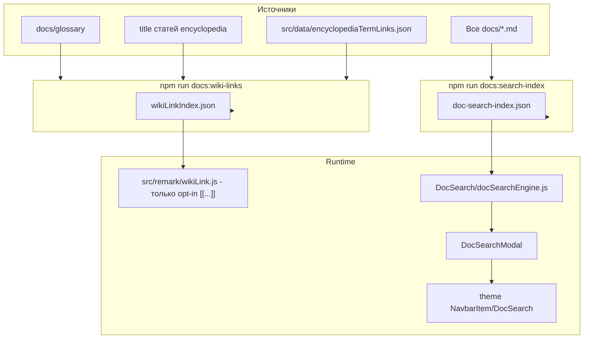

---
tags:
  - all
  - required
  - beginner
title: Эффективный поиск в интернете
description: "Поиск информации в интернете — одна из самых востребованных повседневных и профессиональных практик."
related:
  - title: "Поисковые системы"
    doc: encyclopedia/1-basics/1-21-poisk-informatsii/1
  - title: "Цифровая коммуникация"
    doc: encyclopedia/1-basics/1-22-kommunikatsiya-i-obschenie/1
  - title: "Родительский контроль"
    doc: encyclopedia/1-basics/1-12-sovety-dlya-novichka/111
  - title: "Потребительская грамотность в цифровой среде"
    doc: encyclopedia/1-basics/1-28-marketing-i-rasprostranenie/3
---

import SearchQueryLab from '@site/src/components/SearchQueryLab.jsx';

# Эффективный поиск в интернете

<div class="article-tags">
  <span class="tag tag-required">ОБЯЗАТЕЛЬНО</span>
  <span class="tag tag-beginner">ДЛЯ НОВИЧКОВ</span>
</div>

<span class="complexity-badge">Всем</span>

<SearchQueryLab />

---

## Как правильно гуглить?

### Плавный старт — с чего начать прямо сейчас

Хороший поиск состоит из двух циклов: сначала быстро получить рабочую картину, потом уточнить и проверить. На первом шаге достаточно короткого запроса из 2–4 ключевых сущностей. На втором шаге подключаются операторы, ограничения по дате, домену и формату.

Минимальный сценарий:

1. Сформулировать запрос в формате "объект + действие + контекст".
2. Просмотреть 3–5 источников разных типов.
3. Зафиксировать рабочий ответ и ссылку на первоисточник.
4. Вернуться и уточнить запрос, если ответ частичный.

Для понимания того, как поисковик принимает решения внутри конвейера, полезно читать параллельно [Поисковые системы](/encyclopedia/1-basics/1-21-poisk-informatsii/1). Для сложных фильтров в БД и хранилищах продолжайте в [Языки поисковых запросов](/encyclopedia/1-basics/1-21-poisk-informatsii/2).

---

### Что такое гуглить?

**Поиск** информации в интернете — одна из самых востребованных повседневных и профессиональных практик. При этом эффективность поиска зависит не столько от возможностей поисковых систем, сколько от навыков пользователя в формулировании запросов и оценке результатов. 

На первый взгляд, достаточно ввести вопрос — и система выдаст ответ. Однако это иллюзия: современные поисковые системы, включая Google, индексируют и ранжируют миллиарды документов, и задача пользователя — максимально точно указать, какой из этих документов соответствует его потребности.

Слово *"гуглить"*, укоренившееся в русскоязычной среде как синоним поиска в интернете, уводит от сути: речь о взаимодействии с любой поисковой системой (Google, Яндекс, Bing, DuckDuckGo, SearX и др.), которая реализует аналогичный цикл обработки запроса: анализ ключевых слов, сопоставление с индексом, применение алгоритмов ранжирования и выдача результатов. 

Даже если за фасадом поисковика работает ИИ — например, Google теперь использует крупные языковые модели для переформулировки запросов и генерации кратких ответов *в дополнение к традиционному поиску* — ядро процесса остаётся прежним: требуется точный, чёткий, лаконичный запрос.

---

### Что происходит внутри поисковика

Когда пользователь вводит строку в поисковую форму, она проходит несколько этапов обработки:

1. **Токенизация и нормализация**.  
   Запрос разбивается на отдельные слова (токены). Пробелы, знаки препинания, падежи и числа — всё подвергается нормализации: слова приводятся к начальной форме ("установил" → "установить"), регистр игнорируется, опечатки корректируются с помощью вероятностных моделей (расстояние Левенштейна и др.).

2. **Учёт синтаксиса и операторов**.  
   Поисковик распознаёт специальные символы и конструкции (`"..."`, `-`, `site:`, `filetype:` и др.) и интерпретирует их как инструкции по сужению или уточнению области поиска.

3. **Формирование вектора запроса**.  
   Современные системы используют эмбеддинги — числовые представления смысла запроса в многомерном пространстве. Это позволяет находить документы с близким семантическим смыслом (например, запрос *"почему греется ноутбук"* может вернуть статьи про *"перегрев системы охлаждения"*).

4. **Обращение к индексу**.  
   Поисковик не сканирует интернет "в реальном времени". Все проиндексированные страницы хранятся в гигантских базах данных, где для каждого документа сохранены: метаданные (заголовок, URL, дата), ключевые слова, внутренние ссылки, текст с весами по релевантности. По вектору запроса система ищет наиболее близкие векторы документов.

5. **Ранжирование**.  
   Результаты сортируются по множеству факторов: релевантность текста, авторитет источника (PageRank, Yandex ИКС), свежесть, география пользователя, поведенческие метрики (кликабельность, время на странице), наличие структурированных данных (Schema.org), соответствие интенту (информационный, навигационный, транзакционный). Рекламные объявления, несмотря на их позицию "сверху", исключаются из основного потока ранжирования — они отбираются по отдельному алгоритму контекстной рекламы (Google Ads, Яндекс Директ).

6. **Генерация ответа (опционально)**.  
   При включённых AI-функциях (например, *Google AI Overviews*, ранее *SGE*) система может сформировать краткое резюме по нескольким топовым источникам. Такой блок **не заменяет** проверку по ссылкам: ответ может быть неточным или неполным.

> Подробнее о конвейере краулинга, индексации и BM25 — в статье [Поисковые системы](/encyclopedia/1-basics/1-21-poisk-informatsii/1).

```mermaid
%%{init: {
  "theme": "default",
  "themeVariables": {
    "fontSize": "13px",
    "fontFamily": "Segoe UI, Tahoma, sans-serif"
  }
}}%%

flowchart TD
    classDef stage fill:#e3f2fd,stroke:#1976d2,stroke-width:2px,color:#0d47a1;
    classDef detail fill:#e8f5e9,stroke:#388e3c,stroke-width:1.5px,color:#1b5e20;
    classDef ai fill:#fff8e1,stroke:#f57c00,stroke-width:1.5px,color:#e65100;
    classDef user fill:#ffebee,stroke:#d32f2f,stroke-width:1.5px,color:#b71c1c;

    INPUT["🔤 Ввод запроса (пользователь)"]:::user
    TOKEN["🧹 Токенизация и нормализация"]:::stage
    SYNTAX["⚙️ Обработка синтаксиса ("...", site:, -term)"]:::stage
    VECTOR["🧠 Формирование вектора запроса (эмбеддинги)"]:::stage
    INDEX["🗃 Обращение к индексу (вектор + TF-IDF)"]:::stage
    RANK["⚖️ Ранжирование (релевантность, авторитет, поведение…)"]:::stage
    OUTPUT["📄 Выдача: сниппеты, rich-результаты"]:::stage
    AI_SUM["🤖 ИИ-ответ (AI Overviews, опционально)"]:::ai

    LEV["→ Левенштейн, лемматизация"]:::detail
    OPER["→ Операторы: -, site:, filetype:"]:::detail
    EMB["→ Модели: e5, text-embedding-3"]:::detail
    DOC["→ Документы: вес, TF-IDF, вектор, метаданные"]:::detail
    FACTORS["→ PageRank, CTR, гео, тип интента"]:::detail

    INPUT --> TOKEN
    TOKEN --> SYNTAX
    SYNTAX --> VECTOR
    VECTOR --> INDEX
    INDEX --> RANK
    RANK --> OUTPUT
    OUTPUT --> AI_SUM

    TOKEN --> LEV
    SYNTAX --> OPER
    VECTOR --> EMB
    INDEX --> DOC
    RANK --> FACTORS

    class INPUT user
    class TOKEN,SYNTAX,VECTOR,INDEX,RANK,OUTPUT stage
    class LEV,OPER,EMB,DOC,FACTORS detail
    class AI_SUM ai

```

Этот процесс происходит за доли секунды. Однако пользователь может и должен влиять на каждый этап — в первую очередь через качество входного запроса.

---

### Формулировка запроса

Люди склонны формулировать поисковые запросы как вопросы: *"Как настроить Wi-Fi на ноутбуке?"*, *"Почему не работает принтер HP?"*. Это естественно, но неэффективно. Поисковая система не отвечает на вопросы как собеседник — она ищет документы, в которых встречаются определённые термины в определённой структуре.

**Тип интента** (намерения) помогает выбрать форму запроса:

| Интент | Пример | Что искать |
|--------|--------|------------|
| Информационный | `REST API principles` | статьи, документация, обзоры |
| Навигационный | `MDN fetch API` | конкретный сайт или раздел |
| Транзакционный | `Visual Studio Community download` | страница загрузки, установки |

Разговорные обороты добавляют "шум":  
- Слова *"как"*, *"почему"*, *"что такое"*, *"можно ли"* часто не несут смысловой нагрузки для поиска и могут снизить релевантность.  
- Лишние детали (*"на моём ноутбуке дома"*) не учитываются системой — геолокация и устройство определяются автоматически, если пользователь не отключил передачу данных.

Вместо этого рекомендуется переводить интент в набор ключевых сущностей:  
- Определите **объект** (о чём речь?): *Wi-Fi, принтер HP LaserJet 1020, ошибка 0x80070005*  
- Уточните **действие/проблему**: *настройка, не подключается, драйвер, установка*  
- Добавьте **контекст**, если он критичен: *Windows 11, Ubuntu 22.04, Python 3.11, Docker*

Примеры корректной переформулировки:  

| Разговорный запрос | Эффективный запрос |
|--------------------|---------------------|
| "Что такое REST API?" | `REST API` |
| "Как исправить синий экран смерти в Windows 10?" | `синий экран смерти Windows 10 ошибка 0x0000007B` |
| "Где скачать Visual Studio бесплатно?" | `Visual Studio Community download` |

Обратите внимание:  
- Не требуется указывать *"скачать"*, если вы ищете официальную страницу — по умолчанию сайт Microsoft выдаст ссылку на установку.  
- Указание *Community* сразу фильтрует коммерческие редакции.  
- Слово *download* — стандартный ключ для поиска прямых ссылок на дистрибутивы.

---

### Специальные операторы

Полнотекстовые поисковые системы поддерживают расширенный синтаксис — набор команд, позволяющих точно задать границы поиска. Эти операторы работают в Google, Яндексе, Bing и во многих специализированных поисковиках (например, GitHub Search). Они не зависят от ИИ-улучшений и остаются стабильными во времени.

---

#### Кавычки — поиск точной фразы

Запрос без кавычек — логическое ИЛИ по умолчанию:  
`как установить Windows` → страницы, содержащие любое из слов *как*, *установить*, *Windows*, в любом порядке.  
`"как установить Windows"` → страницы, где эти три слова идут *строго подряд*, без вставок.  

Это критично при поиске:  
- точных формулировок ошибок (`"Could not load file or assembly 'System.Core'"`),  
- цитат (`"Время — деньги" Бенджамин Франклин`),  
- названий процедур или команд (`"git rebase --interactive"`).

---

#### Минус — исключение нерелевантных терминов

В русском языке особенно много омонимов. Например, *"окна"* может означать проёмы в стене или операционную систему *Windows*.  
`Windows -окна` вернёт только технические статьи, исключив строительные.  
Аналогично: `Java -кофе`, `Python -змея`, `C# -нота`.

---

#### `site:` — поиск внутри домена 

Позволяет использовать мощь Google как внутренний поисковик любого сайта:  
- `site:docs.microsoft.com PowerShell remoting` — поиск в официальной документации Microsoft,  
- `site:github.com/api/v3 authentication` — поиск по API GitHub (полезно, так как внутренний поиск GitHub часто не справляется),  
- `site:stackoverflow.com C# async deadlock` — фильтрация только по Stack Overflow.

Можно указывать поддомены (`site:dev.mysql.com`) или использовать маски (`site:.gov.ru` — все госсайты РФ).

---

#### `filetype:` — поиск по формату 

Полезен при необходимости найти документацию в виде PDF, презентации, спецификации:  
- `filetype:pdf ISO/IEC 27001:2022` — официальный стандарт,  
- `filetype:pptx REST API best practices` — слайды с конференций,  
- `filetype:md CONTRIBUTING` — файлы правил участия в open source.

Поддерживаемые типы: `pdf`, `doc`, `docx`, `xls`, `xlsx`, `ppt`, `pptx`, `txt`, `rtf`, `odt`, `ods`, `md`, `json`, `xml`, `csv`.

---

#### `intitle:` и `inurl:` — поиск по метаданным  

- `intitle:error site:stackoverflow.com` — страницы, в заголовке которых есть слово *error*,  
- `inurl:/issues/ github docker` — ссылки, содержащие `/issues/`, что почти всегда указывает на баг-трекер.

Можно комбинировать: `intitle:"404" inurl:nginx` — страницы с заголовком, содержащим *404*, и URL, включающим *nginx*.

---

#### Звёздочка `*` — маска для неизвестного слова  

Работает *только внутри кавычек*:  
`"best practices for * in microservices"` может вернуть:  
- *Безопасность*,  
- *logging*,  
- *circuit breaking*,  
- *distributed tracing*.

Это мощный инструмент для обнаружения устойчивых фраз, когда вы помните структуру, но не помните конкретный термин.

---

#### `OR` — логическое ИЛИ  

По умолчанию поисковик использует И, поэтому `C# async` означает *C# И async*. Чтобы расширить, нужно указать:  
`(C# OR TypeScript) async await` — вернёт статьи по обоим языкам.  
Скобки обязательны, иначе приоритет нарушится.

---

#### `after:` и `before:` — временные границы 

Синтаксис: `after:2023-01-01`, `before:2020-12-31`.  
Примеры:  
- `Deno 2.0 after:2024-06-01` — только свежие анонсы,  
- `IE11 deprecation before:2022` — архивные обсуждения до официального завершения поддержки.

> **Важно**: эти операторы интерпретируются по дате *индексации*, а не по дате публикации в статье. Иногда страница обновляется, но дата в теле остаётся старой — в таких случаях надёжнее искать явно: `"опубликовано в 2025 году"`.

---

### Оценка источников

Получение результатов — лишь первый этап. Куда важнее — их критическая оценка. В отличие от библиотечной среды XX века, где доступ к информации контролировался редакторами, издателями и рецензентами, интернет по умолчанию демократичен: любой может опубликовать текст, и поисковик не различает научную статью и SEO-оптимизированный кликбейт, если он технически соответствует запросу.

**Краткий чеклист перед тем, как доверять странице:**

1. **Домен** — официальный (`docs.*`, `.gov`, корпоративный) или вторичный (блог, агрегатор)?
2. **Дата** — указана ли версия продукта / дата обновления?
3. **Автор** — есть ли имя, должность, ссылка на профиль?
4. **Первичный источник** — ссылки на RFC, репозиторий, спецификацию?
5. **Триангуляция** — совпадает ли вывод с ещё двумя независимыми источниками?

Первые 3–5 позиций в выдаче Google означают лишь "самые релевантные с точки зрения алгоритма". Релевантность — функция трёх основных компонентов:  
1. **Текстовая близость** — насколько часто и в каком контексте встречаются искомые термины,  
2. **Ссылочная масса** — сколько авторитетных ресурсов ссылаются на страницу (PageRank и его аналоги),  
3. **Поведенческие сигналы** — кликают ли пользователи, остаются ли на странице, возвращаются ли к поиску.

Ни один из этих критериев не включает фактологическую проверку. Таким образом, высокий ранг ≠ достоверность.

---

#### Стратегия многоисточникового сопоставления

Для подтверждения информации рекомендуется применять **метод триангуляции**: искать подтверждение в трёх независимых источниках разного типа. Пример:

> Запрос: `разница между REST и gRPC`  
> — Источник 1: официальная документация Google по gRPC (`site:grpc.io`)  
> — Источник 2: статья на MDN Web Docs (`site:developer.mozilla.org rest`)  
> — Источник 3: обзор на *Martin Fowler’s Blog* или *ThoughtWorks Technology Radar*  

Если во всех трёх описывается одно и то же — вероятность ошибки минимальна. Если расхождения — требуется анализ причин: возможно, речь о разных версиях протоколов, контекстах применения (веб vs. микросервисы), или один из источников устарел.

---

#### Признаки авторитетного источника

1. **Домен верхнего уровня и принадлежность**  
   - `.gov`, `.edu`, `.ac.uk`, `.go.jp` — как правило, принадлежат государственным или академическим структурам. Однако это не гарантия: отдельные университеты размещают студенческие проекты без рецензирования.  
   - `.org` — некоммерческие организации, но может использоваться и коммерческими проектами (например, `mozilla.org`).  
   - `github.com`, `gitlab.com`, `npmjs.com`, `pypi.org` — авторитетны в контексте open source (исходный код, документация, issue-трекеры).  
   - Корпоративные домены (`microsoft.com`, `oracle.com`, `docker.com`) — наиболее надёжны для спецификаций, API, руководств по установке.

2. **Структура URL**  
   Наличие `/docs/`, `/learn/`, `/api/`, `/reference/` часто указывает на техническую документацию, а не на маркетинговые или новостные разделы.  
   Например:  
   - `https://docs.docker.com/engine/reference/commandline/build/` — каноничная справка по команде `docker build`,  
   - `https://www.docker.com/blog/…` — новостной блог, может содержать анонсы, но не спецификации.

3. **Дата публикации и обновления**  
   В IT средний срок полураспада знаний — 2–3 года. Версия языка, фреймворка, API может кардинально изменить валидность совета.  
   - Ищите явные указания: *"Обновлено: 15 мая 2025 г."*, *"Для React 18.3"*.  
   - Проверяйте дату коммита в GitHub (`Last updated on commit abc123d`),  
   - На Stack Overflow смотрите дату ответа и наличие комментариев *"This no longer works in v4.2"*.

4. **Автор и его позиция**  
   Подпись под статьёй — не формальность. Имя, ссылка на профиль, должность ("Principal Engineer at Google", "Core Contributor to Django") дают контекст.  
   Сравните:  
   - *"Автор: John Doe, 14-летний школьник"* — может быть гениальным, но требует проверки,  
   - *"Автор: Anders Hejlsberg, создатель C# и TypeScript"* — первичный источник для вопросов по этим языкам.

5. **Наличие ссылок на первичные источники**  
   Качественные материалы ссылаются на:  
   - RFC (Request for Comments),  
   - спецификации W3C, IETF, ECMA,  
   - официальные репозитории на GitHub,  
   - научные публикации (DOI, arXiv).  
   Отсутствие ссылок — красный флаг: возможно, информация взята "из головы" или перефразирована из вторичных источников.

> **Замечание**: SEO-статьи часто имитируют признаки авторитетности:  
> - Подпись "Экспертный обзор подготовлен командой IT-специалистов",  
> - Указание даты "Обновлено в 2025 г." (но содержание дословно скопировано из статьи 2020 года),  
> - Вставка цитат без указания источника.  
> Такие материалы легко выявить по стилю: избыток общих фраз (*"в современном мире цифровых технологий"*), отсутствие конкретных команд, версий, кода, схем.

---

### Поиск ошибок

Ошибки — неотъемлемая часть разработки, эксплуатации и администрирования. Их поиск — особый режим работы с поисковой системой, требующий дисциплины и системного подхода.

---

#### Шаг 1. Точное копирование текста ошибки

Большинство систем выводят диагностическое сообщение — stack trace, код ошибки, описание. Ключевой принцип: **копировать дословно, включая регистр, пунктуацию, пробелы, номера строк**.

Пример плохого запроса:  
`не работает подключение к базе`  
→ слишком обобщённо, тысячи возможных причин.

Хороший запрос:  
`"Failed to connect to localhost:5432. Connection refused"`  
→ точная фраза, обрамлённая кавычками. Google найдёт именно этот текст — а значит, и людей, сталкивавшихся с идентичной проблемой.

Если ошибка многострочная — копируйте только первую непустую строку или уникальный идентификатор (например, `Error: ENOENT: no such file or directory, open '/app/config.yaml'`). Длинные stack trace’ы содержат много шума (внутренние пути, версии npm-пакетов), что снижает точность.

---

#### Шаг 2. Добавление контекстных меток

К одному и тому же тексту ошибки может привести множество ситуаций. Чтобы сузить поиск, добавьте 2–3 ключевых параметра:

- **Язык/стек**: `C#`, `Python pandas`, `Node.js Express`, `Java Spring Boot`,  
- **Среда**: `Docker`, `Ubuntu 24.04`, `Windows Server 2022`, `AWS EC2`,  
- **Версия**: `PostgreSQL 16`, `.NET 8`, `React 18.3`, `nginx 1.26`.

Пример:  
`"Could not load type 'Microsoft.AspNetCore.Mvc.ApiControllerAttribute'" C# .NET 6`  
→ без указания `.NET 6` система могла бы вернуть решения для .NET Core 3.1, где атрибут находился в другом сборке.

---

#### Шаг 3. Целевые площадки для поиска ошибок

Не все сайты одинаково полезны. Для ошибок приоритетны:

- **Stack Overflow** (`site:stackoverflow.com`) — наиболее структурированное сообщество. Вопросы с высоким рейтингом и принятым ответом — золотой стандарт.  
- **GitHub Issues** (`site:github.com/*/issues`) — прямая линия к разработчикам. Запрос: `"error 0x80070005" site:github.com/microsoft/PowerToys/issues`.  
- **Reddit (r/programming, r/devops, r/docker)** — менее формально, но часто содержат "живые" кейсы, не попавшие в SO.  
- **Discord/Slack-сообщества** — не индексируются Google, но если у вас есть доступ — ищите через встроенный поиск (`Ctrl+K` → ввод фразы).  
- **Официальные форумы** (например, forum.vuejs.org, discourse.nixos.org) — высокая квалификация участников.

> Обратите внимание: на GitHub есть отдельный **Code Search**, но он не заменяет Issue Search — ошибки редко попадают в исходный код, зато активно обсуждаются в issue-трекерах.

---

#### Шаг 4. Анализ найденных решений

Не применяйте первое попавшееся решение "как есть". Проверьте:

- **Соответствие контексту**: совпадают ли ОС, версии, конфигурация?  
- **Механизм решения**: исправляет ли оно корень проблемы или лишь маскирует симптомы? (например, `chmod 777` вместо настройки правильных ACL),  
- **Побочные эффекты**: отключает ли решение безопасность (`--insecure-registry`), ломает ли обратную совместимость?  
- **Альтернативы**: в комментариях часто предлагаются более элегантные подходы.

Если ни один из вариантов не помогает — переходите к следующему этапу: самостоятельному запросу в сообщество.

---

#### Мини-чеклист перед публикацией вопроса

- Есть точный текст ошибки в кавычках "".
- Указаны версия, ОС и ключевой компонент.
- Добавлен минимальный воспроизводимый пример.
- Показано, что уже проверили 2–3 источника и что именно не сработало.
- В вопросе есть чёткий ожидаемый результат.

Такой формат заметно повышает шанс получить точный ответ и экономит время всем участникам обсуждения.

---

### Быстрые сценарии поиска

#### Сценарий 1 — найти официальную документацию

- используйте `site:docs.*` или домен вендора;
- добавьте версию технологии;
- проверяйте дату обновления страницы.

Пример: `site:learn.microsoft.com asp.net core 8 authentication`.

---

#### Сценарий 2 — устранить ошибку из логов

- копируйте ошибку дословно в кавычках "";
- добавляйте стек и версию;
- сначала смотрите issue-трекер и accepted-ответы.

Пример: `"Connection refused" PostgreSQL 16 docker compose`.

---

#### Сценарий 3 — найти причину падения трафика сайта

Поисковый запрос в Google или Яндексе показывает внешнюю картину. Для диагностики собственного сайта нужны данные самих поисковых систем.

Быстрый маршрут:

1. Откройте [Google Search Console](https://search.google.com/search-console) и [Яндекс.Вебмастер](https://webmaster.yandex.ru/welcome/).
2. Сравните динамику **показов**, **кликов**, **CTR** и **средней позиции** за одинаковые периоды.
3. Проверьте, в каких разделах упали показы: отдельные URL, типы страниц, устройства, регионы.
4. Посмотрите технические отчёты: ошибки индексации, исключённые страницы, проблемы `sitemap.xml`, `robots.txt`, мобильной версии.
5. Зафиксируйте гипотезу и проверьте её через точечный запрос `site:ваш-домен.ru` и проверку URL в инструментах вебмастеров.

Если в GSC и Вебмастере показы стабильны, а визиты падают, причина часто в кликабельности сниппета или в качестве трафика после перехода. Тогда дополнительно смотрят поведение пользователей в Яндекс.Метрике или Google Analytics.

---

### FAQ по интернет-поиску

**Нужно ли всегда писать запрос на английском?**  
Для технических тем это часто даёт более полный результат, затем полезно проверить русскоязычную адаптацию.

**Почему оператор `site:` иногда пропускает нужную страницу?**  
Страница могла не индексироваться, быть закрытой robots-правилами или удалённой из кэша.

**Когда использовать ИИ-ответы в выдаче?**  
Для быстрого обзора темы. Для решений в работе и учёбе сверяйтесь с первоисточниками по ссылкам.

---

### Этический и этикетный аспект

Открытые сообщества (форумы, issue-трекеры, чаты) работают на энтузиазме. Никто не обязан отвечать на ваш вопрос — но вы можете значительно повысить вероятность помощи, соблюдая минимальные нормы технического этикета.

---

#### Подготовка вопроса

Стандарт де-факто — **Minimal Reproducible Example (MRE)**. Он включает:

- **Чёткое описание цели**: *"Хочу отправить POST-запрос с JSON-телом через HttpClient в .NET"*,  
- **Конкретная ошибка**: копия текста, код, скриншот (если GUI), код статуса,  
- **Что уже пробовали**: перечень действий с результатами (*"Попробовал добавить [FromBody], не помогло; проверил Content-Type — application/json"*),  
- **Окружение**: ОС, версия runtime, зависимости (например, `dotnet --info`, `pip list | grep requests`),  
- **Код**: только та часть, что необходима для воспроизведения. Удалите приватные данные, упростите структуру.  
  Хорошо:  
```csharp
  var client = new HttpClient();
  var json = JsonSerializer.Serialize(new { name = "test" });
  var content = new StringContent(json, Encoding.UTF8, "application/json");
  var res = await client.PostAsync("https://httpbin.org/post", content);
```
  Плохо:  
  *"Вот весь мой контроллер на 300 строк, там где-то ошибка"*.

---

#### Формулировка заголовка

Заголовок — фильтр для экспертов. Он должен быть:  
- конкретным (*"HttpClient возвращает 400 при POST с JSON"*, а не *"Не работает HTTP"*),  
- содержать ключевые технологии (*"C# HttpClient .NET 8 JSON 400"*),  
- избегать эмоций (*"СРОЧНО! ПОМОГИТЕ!"* снижает шансы на ответ).

---

#### Поведение после получения ответа

- **Поблагодарите**, даже если решение не сработало — потрачено время.  
- **Уточните**, если что-то непонятно — но покажите, что вы попытались разобраться (*"Пробовал использовать AddJsonOptions, но ошибка осталась. Прилагаю код конфигурации"*).  
- **Отметьте решение**, если оно помогло (на SO — "принять ответ", в GitHub — закрыть issue с комментарием).  
- **Опубликуйте итог**, если решили проблему самостоятельно — это поможет другим.

---

#### Что категорически недопустимо

- Писать в несколько мест одновременно один и тот же вопрос ("спам по каналам"),  
- Требовать срочности (*"Ответьте за 5 минут, иначе проект стоит"*),  
- Игнорировать шаблоны issue ("Bug Report", "Feature Request"),  
- Вставлять скриншоты кода вместо текста (нарушает доступность, не индексируется, не копируется).

---

### Яндекс

Хотя термин *"гуглить"* укоренился как универсальный, в русскоязычном сегменте интернета значительную долю поискового трафика обрабатывает **Яндекс** — поисковая система, разработанная с учётом морфологической сложности русского языка и особенностей поведения локальной аудитории. Игнорировать его — значит упускать доступ к уникальному корпусу информации: государственным реестрам, региональным СМИ, русскоязычным open-source-проектам, технической документации на русском, а также контенту, не проиндексированному Google из-за географических или политических ограничений.

---

#### Морфологическая обработка

Яндекс использует собственную **морфологическую базу** и **синтаксический анализатор**, разработанные в рамках проекта *Yandex.Morphology*. Это позволяет системе:

- Корректно обрабатывать падежи, числа, залоги, виды глаголов без необходимости нормализации запроса вручную.  
  Пример: запрос *"установить Windows"* автоматически включает варианты *"устанавливаю Windows"*, *"установка Windows"*, *"как установить Windows"*.  
- Распознавать составные термины: *"виртуальная машина"* ≠ *"виртуальная" + "машина"*, а отдельная лексема, что снижает шум от нерелевантных совпадений.  
- Учитывать омонимию по контексту: *"Java"* в запросе *"Java кофе рецепты"* будет интерпретирована как напиток, а в *"Java Spring Boot"* — как язык программирования.

Это даёт преимущество при поиске по естественно сформулированным фразам — в отличие от Google, где всё ещё выгодно упрощать запрос до ключевых сущностей.

---

#### Операторы Яндекса — сходства и отличия

Большинство базовых операторов совместимы с Google (`"..."`, `-`, `site:`, `filetype:`), но есть важные нюансы:

| Оператор | Google | Яндекс | Комментарий |
|---------|--------|--------|-------------|
| `"точная фраза"` | Поддерживается | Поддерживается | В Яндексе кавычки строже: даже один лишний пробел ломает совпадение. |
| `-слово` | Исключает | Исключает | В Яндексе можно исключать целые фразы: `-"видео на YouTube"`. |
| `site:` | Поддерживается | Поддерживается | В Яндексе работает с поддоменами (`site:habr.com` включает `habr.com`, `habrastorage.org`). |
| `filetype:` | Поддерживается | Поддерживается | В Яндексе больше поддерживаемых форматов: `djvu`, `fb2`, `epub`. |
| `*` (маска) | Только в кавычках | Только в кавычках | Поведение идентично. |
| `OR` | Требует заглавных букв | Допускает `|` ("или") | `C# | C++` эквивалентно `(C# OR C++)`. |
| `&` (И) | Не нужен (по умолчанию) | Явный оператор | В Яндексе можно писать `Python & Django`, но это избыточно — И подразумевается. |

---

#### Уникальные возможности Яндекса

1. **Поиск по параметрам ("Умный поиск")**  
   В расширенном интерфейсе (на странице `yandex.ru/search/advanced`) доступны фильтры:  
   - По региону публикации (полезно для локальных нормативов: *"Приказ Минцифры РФ 2024"*),  
   - По типу сайта (блоги, новости, госструктуры, форумы),  
   - По наличию изображений/таблиц/видео на странице,  
   - По уровню "доверия" (Яндекс оценивает репутацию домена на основе поведенческих метрик).

2. **Интеграция с Яндекс.Диском и Яндекс.Картами**  
   Запрос вида `site:yadi.sk документация по ELMA365` может вернуть файлы, загруженные пользователями (например, внутренние методички, неопубликованные на сайтах).  
   Аналогично: *"офис МТС на Арбате"* → автоматический переход к Картам с фильтром "офисы".

3. **Поиск по ГОСТ, ОКВЭД, ОКПД2**  
   Яндекс индексирует официальные реестры:  
   - `ГОСТ Р 57580.2-2017` → прямая ссылка на текст стандарта на `docs.cntd.ru`,  
   - `ОКВЭД 62.01` → расшифровка вида деятельности,  
   - `Приказ 155н Минздрава` → полный текст приказа на `rosminzdrav.gov.ru`.

> **Практический совет**: при работе с регуляторикой (ГОСТ, приказы, технические регламенты) начинайте поиск именно в Яндексе — его индекс российских госресурсов шире и свежее.

---

#### Реклама и "особые" блоки

В Яндексе рекламные объявления помечаются как **"Реклама"** (не *"Ad"*), но есть и специфические промо-блоки:

- **"Популярное"** — агрегация новостей и постов из соцсетей, часто доминирует над органической выдачей,  
- **"Карты"**, **"Маркет"**, **"Новости"**, **"Видео"** — вертикальные результаты, автоматически встраиваемые при распознавании интента.  
  Пример: запрос *"цена iPhone 16"* → сверху — блок "Маркет" с ценами в магазинах.

Эти блоки удобны для бытовых запросов, но при техническом поиске их стоит игнорировать — они редко содержат первичную информацию.

---

### Языковые аспекты

В IT-сфере английский язык выполняет функцию **лингва франка**. Это связано с историей развития отрасли, географией разработки и структурой знаний.

Лингва франка — это язык или диалект, который используется для общения между людьми, чьи родные языки отличаются. 

---

#### Причины превалирования английского

1. **Происхождение технологий**  
   Основные языки программирования (C, C++, Java, Python, JavaScript), операционные системы (Unix, Linux, Windows NT), протоколы (HTTP, TCP/IP, DNS), стандарты (RFC, POSIX, IEEE) создавались в англоязычной среде — в университетах США, в корпорациях (Bell Labs, MIT, Sun, Microsoft), в рабочих группах IETF/W3C.

2. **Документация как первичный источник**  
   Официальные руководства, спецификации, changelog’и, issue-трекеры ведутся на английском. Переводы — вторичны, часто отстают на месяцы или годы, а в open source их может не быть вовсе.  
   Пример: документация к Rust (`rust-lang.org`) обновляется мгновенно после релиза; русская версия — через 2–3 месяца, и не всегда полная.

3. **Сообщество экспертов**  
   На Stack Overflow 86 % вопросов задано на английском (по данным 2024 г.). Чем уже и сложнее тема — тем выше доля англоязычных обсуждений. Вопрос по *"zero-knowledge proofs в Ethereum"* на русском, скорее всего, останется без ответа.

4. **Семантическая точность**  
   Технические термины часто не имеют устоявшегося перевода или перевод вводит неоднозначность:  
   - *"deployment"* → *"развёртывание"* (корректно), но в разговорной речи часто говорят *"запуск"*, *"установка"*, *"внедрение"*,  
   - *"middleware"* → нет устоявшегося аналога, чаще оставляют как есть,  
   - *"race condition"* → *"состояние гонки"* (официально), но в коде — `race_condition`, в логах — `race detected`.

---

#### Стратегия многоязычного поиска

Это не означает, что русскоязычный поиск бесполезен. Рекомендуется **гибридный подход**:

1. Сначала ищите на **английском** — для получения первичных источников, актуальных решений, обсуждений в сообществе.  
2. Затем — на **русском** — для адаптации:  
   - локализованные инструкции (например, настройка КриптоПро на Windows),  
   - разборы отечественных регуляторных требований (152-ФЗ, 187-ФЗ),  
   - кейсы российских компаний ("как МТС мигрировал на Kubernetes").

Пример эффективного запроса:  
`"Connection reset by peer" Python requests site:stackoverflow.com` → найти решение,  
затем: `"Connection reset by peer" Python requests site:habr.com` → найти русскоязычное объяснение или адаптацию.

---

#### Как работать с английским, если он не родной

- Используйте **встроенный переводчик** (Google Translate, Яндекс.Переводчик), но **не переводите запрос целиком** — только отдельные термины.  
- Копируйте код и ошибки **без перевода** — они неизменны во всех локалях.  
- Настройте расширение **Google Dictionary** или **LinguaLeo** для быстрого просмотра значений при наведении.

---

### Альтернативные поисковые системы

Google и Яндекс — инструменты общего назначения. Для узких задач существуют специализированные поисковые движки, оптимизированные под конкретный тип контента. Их использование повышает точность и экономит время.

| Система | Назначение | Особенности | Пример запроса |
|--------|-------------|-------------|----------------|
| **Google Scholar** | Научные публикации, патенты, тезисы | Индексирует peer-reviewed статьи, книги, технические отчёты. Показывает цитируемость, связанные работы, версии препринтов. | `"attention is all you need" transformer` |
| **Google Books** | Книги (частичный/полный просмотр) | Позволяет искать по содержимому книг, включая устаревшие издания. Полезен для исторического контекста. | `"The Art of Computer Programming" Knuth site:books.google.com` |
| **Google Patents** | Патенты (USPTO, EPO, WIPO) | Поиск по описанию, формулам, чертежам. Можно скачать PDF патента. | `neural Network image recognition patent` |
| **Google News** | Новости (последние 30 дней) | Агрегирует СМИ, группирует по темам, позволяет фильтровать по региону и изданию. | `AI regulation EU 2025` |
| **arXiv.org** | Препринты (физика, математика, CS) | Открытый архив. Все публикации — до рецензирования, но с высокой скоростью выхода. | `cs.CR` (категория: криптография) |
| **Semantic Scholar** | Научные статьи с AI-аннотациями | Использует ИИ для извлечения методов, результатов, цитирований. Показывает "влиятельные цитаты". | `large language models fine-tuning` |
| **GitHub Search** | Код, issue, pull requests | Поиск по репозиториям: язык, звёзды, обновления, содержимое файлов (`filename:`, `extension:`). | `filename:Dockerfile postgresql` |

> **Важно**: эти системы часто **не пересекаются с основным индексом Google**. Статья из IEEE Xplore может быть в Scholar, но не в общей выдаче. Код из приватного репозитория — недоступен в GitHub Search, но может обсуждаться в issue публичного форка.

---

<span id="poisk-po-vselennoy-it"></span>

### Быстрый поиск по "Вселенной IT"

На сайте ["Вселенная IT"](https://spirzen.ru) поиск по материалам устроен **легко и быстро**: при `npm run build` (и перед `npm start`) скрипт один раз проходит все `docs/*.md`, вытаскивает из frontmatter заголовок, краткое `description`, раздел sidebar, теги и ограниченный набор подзаголовков `##`/`###` — **без** отдельного поискового движка, **без** индексации полного текста каждой статьи и **без** облачного Algolia (в конфиге Docusaurus он отключён). Результат — компактный `static/doc-search-index.json`, который в браузере подгружает React-компонент в шапке (`Ctrl+K`).

Параллельно на сборке строится индекс wiki-ссылок `[[термин]]` — это отдельная цепочка для opt-in перекрёстных ссылок в MDX, а не для строки поиска.



| Этап | Команда / файл | Задача |
| :--- | :--- | :--- |
| Скан при сборке | `npm run docs:search-index` → `scripts/build-doc-search-index.mjs` | обойти `docs/`, собрать метаданные и усечённые подзаголовки в JSON |
| Статика | `static/doc-search-index.json` | отдаётся как обычный файл сайта (GitHub Pages) |
| Клиент | `docSearchEngine.js` | `fetch` индекса, ранжирование по введённой строке в памяти |
| UI | `DocSearchModal` + `NavbarItem/DocSearch` | модальное окно и кнопка в navbar |

После правок контента локально пересоберите индекс (`npm run docs:search-index`) или запустите `npm start` — скрипт вызывается автоматически. Общая архитектура репозитория, SSG и деплой — в ["Как устроен проект технически"](/about/project#arhitektura-proekta) и в статье [как работают сайты — SSG на примере проекта](/encyclopedia/2-system-network/2-04-kak-rabotayut-sayty-i-veb-sayty/114#живой-пример--ssg-и-цепочка-публикации).

{/* sidebar-collections */}

---

## В подборках

Статья входит в тематические маршруты из меню **Подборки** и блока "С чего начать?" на главной. Соседние шаги того же маршрута:

**Цифровая грамотность** — [Поисковые системы](/encyclopedia/1-basics/1-21-poisk-informatsii/1), [Цифровая коммуникация](/encyclopedia/1-basics/1-22-kommunikatsiya-i-obschenie/1), [Родительский контроль](/encyclopedia/1-basics/1-12-sovety-dlya-novichka/111), [Потребительская грамотность в цифровой среде](/encyclopedia/1-basics/1-28-marketing-i-rasprostranenie/3), [Настройка Windows](/encyclopedia/1-basics/1-12-sovety-dlya-novichka/11), [Государство и цифровая экономика](/encyclopedia/1-basics/1-29-gosudarstvo-i-biznes/1).

{/* /sidebar-collections */}

---
