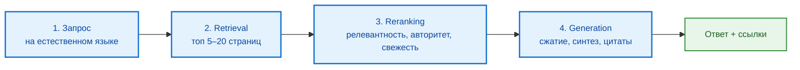

---
tags:
  - all
  - required
  - beginner
title: "ИИ-инструменты в поисковиках"
description: >-
  Google AI Overviews, Нейро в Яндексе, DuckDuckGo AI Chat и принцип RAG в поисковой выдаче.
  GEO (Generative Engine Optimization), отличие от SEO и риски манипуляции нейроответами.
related:
  - title: "Поисковые системы"
    doc: encyclopedia/1-basics/1-21-poisk-informatsii/1
  - title: "Эффективный поиск в интернете"
    doc: encyclopedia/1-basics/1-21-poisk-informatsii/3
  - title: "Популярные поисковые системы"
    doc: encyclopedia/1-basics/1-21-poisk-informatsii/4
  - title: "ИИ для новичка"
    doc: encyclopedia/1-basics/1-21-poisk-informatsii/5
  - title: "RAG, MCP и агенты"
    doc: encyclopedia/6-ai/6-04-modeli-i-instrumenty/121
---

# ИИ-инструменты в поисковиках

  ОБЯЗАТЕЛЬНО
  ДЛЯ НОВИЧКОВ

Всем

  
Главное

  

  Поисковый ИИ <strong>не заменяет</strong> список ссылок — он <strong>сжимает</strong> несколько страниц в один ответ. Ответ опирается на то, что нашёл в выдаче. Цитаты открывайте сами: релевантность страницы ≠ достоверность факта. Подробнее про проверку — <a href="/encyclopedia/1-basics/1-21-poisk-informatsii/3#оценка-источников">оценка источников</a>.
  

**ИИ-инструменты в поисковых системах** меняют привычный формат: вместо только списка синих ссылок пользователь часто видит **готовый синтезированный текст** — краткий ответ, собранный из десятков веб-страниц. Это не магия «всезнания», а промышленная схема **RAG** (*Retrieval-Augmented Generation*, генерация с дополнением поиском): сначала retrieval по индексу, потом формулировка ответа языковой моделью.

Как устроены индекс и ранжирование классического поиска — в [Поисковых системах](/encyclopedia/1-basics/1-21-poisk-informatsii/1). Как пользоваться чатами вроде ChatGPT отдельно от браузера — в [ИИ для новичка](/encyclopedia/1-basics/1-21-poisk-informatsii/5). Здесь — **встроенные** ИИ-режимы в Google, Яндексе и DuckDuckGo и риски, которые с ними приходят.

---

## Зачем поисковикам генеративный ИИ

| Было | Стало с ИИ-блоком |
|------|-------------------|
| Пользователь читает 5–10 сниппетов и сам сравнивает | Система сжимает выводы в один абзац |
| Сложный запрос на естественном языке плохо матчится с ключевыми словами | Запрос разбирается на параметры и перефразируется для поиска |
| Многоаспектные вопросы («тур на 3 дня + дети + бюджет») требуют нескольких сессий | Один ответ синтезирует плюсы с разных сайтов |

Выгода для пользователя — **скорость** на простых и комплексных запросах: рецепты, инструкции, сравнение товаров, планирование поездки. Ограничение — ответ **наследует слабости выдачи**: SEO-спам, устаревшие статьи и намеренно подложенный контент попадают в синтез так же легко, как в топ-10 ссылок.

---

## Google AI Overviews (ИИ-обзоры)

**AI Overviews** (ранее эксперимент *Search Generative Experience*, **SGE**) — блок с краткой сводкой **над** органической выдачей Google. Появляется не на каждый запрос: система оценивает, нужен ли синтез, и отключает блок на части чувствительных тем.

### Как работает

1. Запрос обрабатывается обычным поиском Google (парсинг, расширение, предварительный отбор документов).
2. В языковую модель (семейство **Gemini**) передаются фрагменты из **топа выдачи** — обычно 10–20 страниц.
3. Модель формирует связный ответ; рядом с текстом или внутри него — **карточки-ссылки** на источники из индекса.

Техническая схема того же класса задач — в [Поисковых системах](/encyclopedia/1-basics/1-21-poisk-informatsii/1).

### Сильные стороны

- Экономия времени на «обзорных» запросах без углубления в каждую ссылку.
- Синтез **разных мнений** (плюсы с одного сайта, минусы — с другого) в один текст.
- Сложные комплексные формулировки: *«спланируй 3-дневный тур по Казани для семьи с детьми»*.

### Ограничения

- Блок **не гарантирован**: на медицину, финансы, юридические темы и часть политически чувствительных запросов Google часто показывает только классическую выдачу — ради безопасности и compliance.
- Цитата в обзоре ≠ проверенный факт: модель может неверно **сжать** или **склеить** фрагменты.
- Рекламные и SEO-оптимизированные страницы из топа попадают в синтез наравне с авторитетными.

---

## Нейро в Яндексе

Яндекс объединил традиционный поиск и генеративные модели в режим **«Нейро»** — в связке с голосовым помощником **Алисой**. Развитие линии «ответ в выдаче до списка ссылок»; подробнее про экосистему — в [Поисковых системах](/encyclopedia/1-basics/1-21-poisk-informatsii/1) и [Популярных поисковиках](/encyclopedia/1-basics/1-21-poisk-informatsii/4).

### Как работает

Модель анализирует страницы из **выдачи Яндекса**, выделяет суть и формулирует **один ёмкий ответ** со ссылками на сайты-источники. Дополнительно доступны знания из сервисов экосистемы (Карты, Маркет, расписания) — это усиливает локальные и прикладные запросы по сравнению с «чистым» веб-синтезом.

### Сильные стороны

| Возможность | Пример |
|-------------|--------|
| **Мультимодальность** | Прикрепить фото детали и спросить: «Где купить такой болт?» |
| **Диалоговый режим** | Уточняющие вопросы в чате с сохранением контекста сессии |
| **Локальный контекст** | Маршруты, сервисы и товары в рунете |

### Ограничения

Те же, что у Google AI Overviews: качество ответа ограничено качеством **найденных** страниц; на чувствительные темы действуют фильтры и политики сервиса.

---

## DuckDuckGo AI Chat

**DuckDuckGo** изначально позиционировался как поисковик с упором на **конфиденциальность** — без долгоживущих профилей и персонализированного пузыря. ИИ-инструменты здесь развиваются **иначе**, чем у Google и Яндекса: акцент на приватный доступ к моделям, а не на глубокую интеграцию синтеза в каждую выдачу.

### Как работает

- **DuckDuckGo AI Chat** — доступ к популярным моделям (например, GPT-4o mini, Claude 3 Haiku, Llama 3) в интерфейсе DDG. Запросы проксируются так, чтобы провайдер модели **не получал** ваш реальный IP и идентификаторы сессии DuckDuckGo.
- **DuckAssist** — быстрые ответы на основе **Википедии** и партнёрских источников (аналог «мини-RAG» с узким корпусом).

Подробнее про архитектуру приватного поиска DDG — в [Популярных поисковых системах](/encyclopedia/1-basics/1-21-poisk-informatsii/4).

### Сильные стороны

- **Анонимность относительно вендора LLM**: запросы не должны использоваться для дообучения модели (по политике сервиса; уточняйте на сайте DDG).
- Выбор модели под задачу без отдельной регистрации у OpenAI или Anthropic.
- Согласованность с философией DDG: минимум трекинга.

### Ограничения

- AI Chat — скорее **изолированный чат**, чем полноценный «нейроответ над каждой выдачей», как у Google и Яндекса.
- Полнота веб-покрытия у DDG ниже, чем у Google (гибридный индекс на API партнёров); для глубокого технического поиска часто нужны операторы и [эффективный поиск](/encyclopedia/1-basics/1-21-poisk-informatsii/3).
- DuckAssist опирается на ограниченный корпус — для нишевых IT-вопросов недостаточен.

---

## Сравнение режимов

| Сервис | Где виден ИИ | Источник фактов | Диалог | Приватность |
|--------|--------------|-----------------|--------|-------------|
| **Google AI Overviews** | Блок над выдачей | Топ органической выдачи Google | Ограниченно (уточнения в Search) | Политика Google-аккаунта |
| **Нейро / Алиса (Яндекс)** | Выдача + чат | Выдача Яндекса + сервисы экосистемы | Да, многоходовый | Политика Яндекса |
| **DuckDuckGo AI Chat** | Отдельный режим чата | Выбранная LLM; DuckAssist — Wikipedia | Да | Упор на прокси и минимум логов |
| **Perplexity** (см. [ИИ для новичка](/encyclopedia/1-basics/1-21-poisk-informatsii/5)) | Отдельный сервис | Веб-retrieval + цитаты | Да | Зависит от тарифа |

**Microsoft Copilot** в Bing — ещё один вариант: чат и сводки в связке с выдачей Bing; логика та же (retrieval + generation). Обзор — в [Популярных поисковиках](/encyclopedia/1-basics/1-21-poisk-informatsii/4).

---

## RAG в поисковике: четыре этапа

В отличие от «голого» ChatGPT без поиска, который опирается на **веса модели** (память обучения с датой отсечения), поисковый ИИ сначала **ищет свежие документы**, потом генерирует ответ. Весь конвейер от клика до текста на экране обычно укладывается в **секунды**.

Теория RAG для разработчиков — [RAG, MCP и агенты](/encyclopedia/6-ai/6-04-modeli-i-instrumenty/121).

### 1. Анализ и переформатирование запроса

Сложный вопрос вроде *«какой велосипед купить для города, если рост 180 и бюджет 30к»* разбирается на параметры: тип использования, рост, цена. Система строит **один или несколько** классических поисковых запросов — превращает «живой язык» в то, что хорошо работает с индексом.

### 2. Сбор информации (Retrieval)

Модель **не** пишет ответ «из головы». Запускается обычный поиск; из топа выдачи (часто 5–20 URL) извлекается текст — без рекламных блоков, навигации и шаблонного «мусора» страницы. Это тот же корпус, который вы увидели бы в списке ссылок, только в виде фрагментов для модели.

### 3. Ранжирование фрагментов (Reranking)

Отобранные абзацы оцениваются по критериям, близким к классическому ранжированию:

| Критерий | Вопрос алгоритма |
|----------|------------------|
| **Релевантность** | Отвечает ли фрагмент именно на ваш запрос? |
| **Авторитетность** | Доверяем ли мы домену и автору? |
| **Свежесть** | Актуальна ли дата и версия продукта? |

Важно: «авторитетность» здесь — **технический сигнал** (ссылки, репутация домена, поведение пользователей), а не фактологическая экспертиза. Высокий ранг страницы не означает истину — см. [оценку источников](/encyclopedia/1-basics/1-21-poisk-informatsii/3#оценка-источников).

### 4. Генерация и цитирование (Generation & Citation)

Отобранные фрагменты передаются в **LLM**. Модель выполняет три задачи:

1. **Сжатие (саммаризация)** — убрать воду, оставить суть.
2. **Синтез** — объединить разные источники в связный текст.
3. **Цитирование** — привязать утверждения к ссылкам, чтобы пользователь мог перепроверить.

На этом этапе возможны **галлюцинации**: модель может исказить смысл фрагмента, «достроить» вывод или привязать факт к неверному URL. Поэтому правило из [ИИ для новичка](/encyclopedia/1-basics/1-21-poisk-informatsii/5) остаётся в силе: **открывайте цитаты**, а не доверяйте только абзацу в выдаче.

---

## Чат с поиском и поиск с ИИ: в чём разница

| | Чат LLM без поиска | Поисковый ИИ (RAG) |
|--|-------------------|-------------------|
| Источник знаний | Веса модели + опционально browse | Индекс поисковика / retrieval |
| Свежесть | Ограничена датой обучения | Зависит от индекса и crawl |
| Цитаты | Часто выдуманные | Обычно реальные URL из выдачи |
| Риск ошибки | Галлюцинация «из памяти» | Ошибка retrieval + искажение при синтезе |

Оба режима требуют [триангуляции](/encyclopedia/1-basics/1-21-poisk-informatsii/3#стратегия-многоисточникового-сопоставления): минимум два–три независимых источника для важных решений.

---

## GEO: оптимизация под ответы ИИ

**GEO** (*Generative Engine Optimization*, оптимизация под генеративные движки) — подход к продвижению контента, ориентированный не только на топ классической выдачи, но на **цитирование в ответах ИИ**: Google AI Overviews, Яндекс Нейро, Perplexity и аналоги. Цель — чтобы ассистент выбрал ваш сайт как **фрагмент для синтеза** и показал ссылку рядом с формулировкой.

GEO не отменяет **SEO** (*Search Engine Optimization*): страница по-прежнему должна попасть в retrieval (топ выдачи), иначе RAG её не увидит. Меняется акцент: нейросеть опирается не столько на плотность ключевых слов, сколько на **ясные факты, структуру и сигналы экспертности**.

  
Кому это важно

  

  <ul>
    <li><strong>Читателю</strong> — понимать, почему в нейроответе оказался именно этот сайт и насколько ему можно доверять.</li>
    <li><strong>Автору блога или документации</strong> — оформлять материал так, чтобы полезный контент находили и люди, и ИИ.</li>
    <li><strong>Маркетологу</strong> — см. также <a href="/encyclopedia/1-basics/1-28-marketing-i-rasprostranenie/intro">маркетинг и распространение</a>; ниже — только поисковый контекст.</li>
  </ul>
  

### GEO и классическое SEO

| Критерий | Классическое SEO | GEO (оптимизация под ИИ) |
|----------|------------------|---------------------------|
| **Главный ориентир** | Ключевые слова, релевантность текста запросу | Полезность, факты, авторитетность фрагмента |
| **Формат контента** | Длинные статьи (лонгриды) с вхождениями ключевиков | Ёмкие абзацы, списки, готовые выводы под вопрос |
| **Ссылки** | Массовый линкбилдинг, биржи ссылок | Упоминания экспертами, цитирование в авторитетных источниках |
| **Цель** | Попасть в топ-10 синих ссылок | Стать **первоисточником** для фрагмента в нейроответе |
| **Как оценивает система** | BM25, PageRank, поведение в SERP | То же для retrieval + удобство извлечения факта для LLM |

Оба подхода могут сосуществовать на одной странице: SEO выводит URL в топ, GEO повышает шанс, что именно **ваш абзац** попадёт в AI Overview.

### Пять распространённых приёмов GEO

Ниже — то, что делают сайты, чтобы повысить «цитируемость» в RAG-поиске. Те же приёмы в руках недобросовестных авторов усиливают и **фейковый** контент — см. [манипуляцию корпуса](#manipulyatsiya-i-otravlenie-korpusa) ниже.

#### 1. Контент с опорой на источники (Citation-Backed Content)

ИИ-модели и ранжировщики **штрафуют голословие**: тексты с цифрами, ссылками на исследования и первоисточники чаще попадают в синтез.

**На практике сайты:**

- вставляют точную статистику, даты, результаты опросов;
- дают ссылки на госструктуры, научные базы, официальную документацию;
- избегают абзацев без проверяемого утверждения.

Для читателя это плюс, если ссылки настоящие; для проверки — [триангуляция](/encyclopedia/1-basics/1-21-poisk-informatsii/3#стратегия-многоисточникового-сопоставления).

#### 2. Структура «вопрос — прямой ответ»

Retrieval ищет фрагмент, который **прямо отвечает** на формулировку пользователя. Саммаризатору удобно взять 2–3 предложения под заголовком-вопросом, чем выковыривать смысл из длинного лонгрида.

**На практике сайты:**

- оформляют подзаголовки H2/H3 как популярные вопросы (*«Какой смартфон выбрать в 2026 году с хорошей камерой?»*);
- сразу под заголовком — короткий ответ без вводной «воды»;
- используют маркированные и нумерованные списки, таблицы сравнения.

Формат совпадает с тем, как люди спрашивают у Нейро и AI Overviews в **разговорном** стиле.

#### 3. Сигналы E-E-A-T и темы YMYL

**E-E-A-T** (*Experience, Expertise, Authoritativeness, Trustworthiness* — опыт, экспертиза, авторитетность, надёжность) — критерии качества, на которые опираются поисковики при настройке ИИ-блоков. В темах **YMYL** (*Your Money or Your Life* — «кошелёк или жизнь»: медицина, финансы, право, безопасность) планка выше: модель чаще цитирует страницы с явной экспертизой.

**На практике сайты:**

- добавляют карточки авторов (опыт, образование, ссылки на профили);
- привлекают рецензентов по профилю темы;
- публикуют уникальный опыт (тест-драйв, разбор кейса), а не пересказ характеристик с чужого сайта.

Для учебника ITUniverse это ближе к [оценке источников](/encyclopedia/1-basics/1-21-poisk-informatsii/3#оценка-источников), чем к маркетинговой упаковке.

#### 4. Микроразметка Schema.org

Структурированные данные помогают роботу понять тип страницы: товар, рецепт, FAQ, отзыв. ИИ-конвейер быстрее извлекает цену, рейтинг, шаги алгоритма.

**На практике сайты** настраивают разметку (часто **JSON-LD**):

| Тип Schema.org | Зачем |
|----------------|-------|
| `FAQPage` | Блок вопрос–ответ для нейроответа |
| `Product` | Цена, наличие, рейтинг |
| `Recipe` | Ингредиенты и шаги |
| `Review` | Оценки и выводы |
| `Article` | Автор, дата, издатель |

Подробнее — [JSON Schema, OpenAPI и Schema.org](/encyclopedia/3-data-markup/3-04-konfiguratsii-i-dannye/220). В классическом SEO Schema.org уже влияла на расширенные сниппеты; в GEO тот же слой данных облегчает **выбор фрагмента** для LLM.

#### 5. Разговорные и длинные запросы (Conversational Keywords)

К ИИ обращаются как к собеседнику — особенно голосом: длинные фразы вместо «купить смартфон спб». Контент, написанный под такие формулировки, лучше матчится с запросом на этапе переформатирования (см. [этап 1 RAG](#etap-1-zapros)).

**На практике сайты:**

- включают в текст естественные вопросы целиком;
- покрывают **long-tail** — узкие сочетания («недорогой ноутбук для программирования на Python 16 ГБ RAM»);
- дублируют синонимы и контекст (город, год, сценарий использования).

Связь с [эффективным поиском](/encyclopedia/1-basics/1-21-poisk-informatsii/3): пользователю тоже выгоднее формулировать сущности и версии, а не только разговорный вопрос — но для нейроответа длинная фраза работает.

---

## Манипуляция и отравление корпуса

Легитимный GEO повышает видимость **полезного** контента. Та же механика открывает и злоупотребления: цель — не помочь читателю, а **подложить факты** в корпус, из которого ИИ цитирует.

### Схема атаки

1. Злоумышленник или маркетинговое агентство публикует нужные «факты» на площадках с высоким авторитетом в retrieval: **Reddit**, **Хабр**, Q&A-сайты, форумы, агрегаторы отзывов — иногда с имитацией E-E-A-T и структуры «вопрос–ответ».
2. Страницы индексируются поисковиком и попадают в топ по целевым запросам.
3. RAG-конвейер подтягивает фрагменты → LLM формулирует уверенный ответ → пользователь видит **синтез лжи** со ссылками на реальные URL.

Взлома модели не требуется: достаточно **засеять корпус**, из которого система и так честно цитирует. Журналистские эксперименты (в том числе публикации на Habr) показывали, что за **десятки минут** можно добиться того, что ChatGPT, Gemini и Google AI Overviews начинают повторять выдуманную биографию — если фейк уже лежит в индексируемых источниках.

### Почему целят форумы и UGC

| Причина | Пояснение |
|---------|-----------|
| Высокий «вес» в поиске | Обсуждения хорошо ранжируются по длинным естественным формулировкам |
| Доверие пользователей | Ответ «с Reddit» воспринимается как опыт людей |
| Слабая модерация | Массовый залив контента быстрее, чем реакция модераторов |
| Формат Q&A | Совпадает с тем, как люди спрашивают у нейросети |

Пример реального вреда: на зарубежных сабреддитах вроде r/Biohackers компании насыщали темы контентом о **пептидах для роста** подросткам — чтобы ИИ-ответы и поиск рекомендовали опасные схемы. Модераторы закрывали целые ветки; проблема не в «глупости нейросети», а в **отравленном корпусе**.

### Масштаб: боты и спам в индексе

Доля **бот-трафика** в открытом вебе растёт: по отраслевым отчётам 2025–2026 годов значительная часть HTML-запросов идёт не от людей, а от краулеров, парсеров и автоматизированных публикаторов. Это ускоряет засорение индекса контентом «под ИИ» и усложняет отличие органики от кампании.

  
Не путать два типа ошибок

  

  <ul>
    <li><strong>Галлюцинация</strong> — модель выдумала факт или ссылку «из головы».</li>
    <li><strong>Повторение подложенного</strong> — модель нашла ложь в сети и честно её процитировала.</li>
  </ul>
  Второй случай лечится только <strong>проверкой источников</strong>, а не повторным запросом к той же нейросети.
  

### Как защититься

1. **Открывайте каждую цитату** из AI Overview / Нейро — читайте абзац в контексте, проверяйте автора и дату.
2. **Триангуляция** — тот же факт в официальной документации, учебнике или двух независимых экспертных источниках.
3. **Подозрение к «факту только с форума»** — особенно в медицине, финансах, безопасности и праве.
4. **Задайте тот же вопрос другой системе** — расхождение сигнализирует о необходимости ручной проверки.
5. На чувствительные темы опирайтесь на [когда нельзя доверять слепо](/encyclopedia/1-basics/1-21-poisk-informatsii/5#когда-нельзя-доверять-слепо) и первичные источники.

Для разработчиков корпоративных RAG-систем угроза похожа по механизму (**отравление индекса**), но защита другая — ACL, provenance, red team: [Безопасность RAG и MCP](/encyclopedia/6-ai/6-10-bezopasnost-pri-rabote-s-ii/3).

### Этика

Намеренно публиковать ложные ответы, заводить сотни аккаунтов или спамить форумы ради попадания в нейроответ — **манипуляция сообществом и поиском**. Это нарушает правила площадок и нормы из [эффективного поиска](/encyclopedia/1-basics/1-21-poisk-informatsii/3) и [социальных норм](/encyclopedia/9-spinoff/9-10-internet-kultura/113). Рабочий путь для честного вопроса на форуме — воспроизводимый пример, указание уже проверенных источников и уважение к времени респондентов.

---

## Практический чек-лист

- [ ] Понимаю, что ИИ-блок в поиске — это **RAG**, а не «всезнание».
- [ ] На важные факты открываю **цитаты**, а не останавливаюсь на синтезе.
- [ ] Знаю разницу между Google AI Overviews, Нейро и изолированным чатом DDG.
- [ ] Понимаю **GEO**: отличие от SEO и зачем сайты пишут «вопрос — ответ» и Schema.org.
- [ ] Помню: топ выдачи и цитаты можно **подготовить** — в том числе недобросовестно.
- [ ] Для учёбы и работы комбинирую нейроответ с [операторами поиска](/encyclopedia/1-basics/1-21-poisk-informatsii/3) и официальной документацией.

---

## Куда идти дальше

| Тема | Статья |
|------|--------|
| Операторы, триангуляция, SEO-имитация | [Эффективный поиск в интернете](/encyclopedia/1-basics/1-21-poisk-informatsii/3) |
| Микроразметка Schema.org | [JSON Schema, OpenAPI и Schema.org](/encyclopedia/3-data-markup/3-04-konfiguratsii-i-dannye/220) |
| Индекс, BM25, векторный поиск | [Поисковые системы](/encyclopedia/1-basics/1-21-poisk-informatsii/1) |
| ChatGPT, приватность, галлюцинации | [ИИ для новичка](/encyclopedia/1-basics/1-21-poisk-informatsii/5) |
| RAG в архитектуре ИИ | [RAG, MCP и агенты](/encyclopedia/6-ai/6-04-modeli-i-instrumenty/121) |
| Критический разбор ответов ИИ | [Критический анализ результатов ИИ](/encyclopedia/6-ai/6-06-primenenie-ii/114) |

Итоги раздела — [FAQ](/encyclopedia/1-basics/1-21-poisk-informatsii/98) и [чек-лист](/encyclopedia/1-basics/1-21-poisk-informatsii/99).

---
