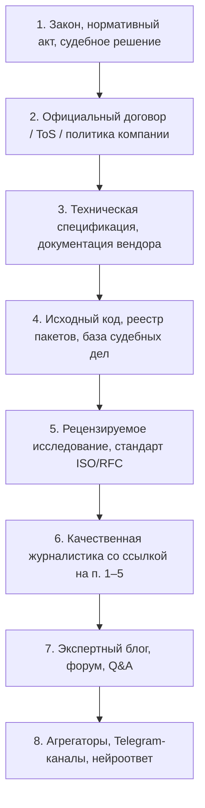
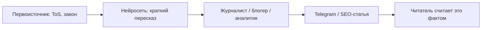

---
tags:
  - all
  - required
  - beginner
title: "Факт-чекинг и первоисточники"
description: >-
  Достоверность информации, иерархия источников, навигационный и исследовательский поиск,
  ограничения нейросетей и саммаризации, чтение нормативных текстов, рискованные темы.
related:
  - title: "Эффективный поиск в интернете"
    doc: encyclopedia/1-basics/1-21-poisk-informatsii/3
  - title: "ИИ для новичка"
    doc: encyclopedia/1-basics/1-21-poisk-informatsii/5
  - title: "ИИ-инструменты в поисковиках"
    doc: encyclopedia/1-basics/1-21-poisk-informatsii/6
  - title: "Данные и информация"
    doc: encyclopedia/1-basics/1-09-dannye-i-informatsiya/intro
  - title: "Потребительская грамотность в цифровой среде"
    doc: encyclopedia/1-basics/1-28-marketing-i-rasprostranenie/3
---

# Факт-чекинг и первоисточники

  ОБЯЗАТЕЛЬНО
  ДЛЯ НОВИЧКОВ

Всем

В работе я регулярно сталкиваюсь с ситуацией, когда люди аргументируют свои позиции, да и определяют целые направления развития проектов на основе саммаризации и сводок нейросетей. Это одна из главных проблем эпохи генеративного ИИ - стремление к экономии времени приводит к тому, что люди начинают слепо верить алгоритмам, забывая о базовой проверке фактов.

Например, выходит новый закон - люди не читают сам закон, а просто ленятся и "скармливают" текст в нейросеть, а потом читают три краткие строки. Затем они упускают контекст, потому что документ был на 40 страниц, и рассуждает на основе тех самых трёх строк!

Нейросети (например, большие языковые модели) предсказывают следующее слово, а не ищут абсолютную истину. Они могут уверенно генерировать ложные данные, даты или цитаты, которые выглядят очень убедительно. ИИ обучается на массивах текстов, в которых могут содержаться стереотипы, ошибки или устаревшая информация, а краткое изложение (саммари) часто вырывает ключевые мысли из оригинального контекста, искажая истинный смысл статьи или исследования. А алгоритм может выделить то, что кажется важным ему, но упустить деталь, которая меняет всё восприятие для конкретного человека.

Я - юрист по образованию, и работал в суде, банках, строительных и государственных компаниях, участвовал в сотнях судебных заседаний. И выигрывал дела именно потому, что люди невнимательны, ленивы и доверчивы - не смотрят, что подписывают, не читают лицензионные соглашения, не анализируют законы, и, что самое забавное - не читают содержимое статей, опираясь лишь на заголовок.

Давайте сначала разберёмся с одной штукой, связанной с заголовками. Представим, что вы - журналист, и ваша задача:
- найти новость;
- написать статью;
- сделать так, чтобы на статью переходило как можно больше людей.

Заметьте, задач вроде "дать информацию людям", "обеспечить достоверность" нет. Журналистика зарабатывает рекламой - люди переходят на статьи и генерируют просмотры, и поэтому нужно любыми средствами просто сделать, чтобы человек кликнул на статью. В результате, заголовок может быть максимально ложный, краткий, вызывающий и, как сейчас их называют, "кликбейтный" - завлекающий для перехода на статью. При этом сама статья может быть вообще о другом!

Такой подход превратил все информационные сообщества (каналы в социальных сетях, новостные сайты) в генераторы любой информации, которая потенциально может быть интересна. А огромный поток одного поста за другим привёл к тому, что люди попросту читают кратко, только заголовки. 

Чтобы технологии оставались помощниками, а не источником дезинформации, можно выработать несколько полезных привычек:
- проверяйте источники и ЧИТАЙТЕ ИХ. Если ИИ дает ссылку на исследование или статью, не ленитесь открыть оригинал и прочесть ключевой абзац самостоятельно.
- проверяйте факты, для такой проверки спорных фактов или новостей обращайтесь к независимым ресурсам, таким как профессиональные энциклопедии или профильные медиа.
- применяйте критическое мышление - задавайте себе вопросы;
- сравнивайте Саммари по одной и той же теме, полученные от разных нейросетей или из традиционных поисковых систем.

Если вы спорите с другом, в принципе, ничего страшного. А вот если информация, о которой идёт речь, может за собой повлечь серьёзные последствия, лучше проверьте лишний раз. **Не торопитесь**. 

  
Главное

  

  Поисковик находит <strong>релевантные</strong> страницы, нейросеть генерирует <strong>правдоподобный</strong> текст. Ни то ни другое не гарантирует истину. Факт-чекинг — это проверка по <strong>первоисточнику</strong>: закону, договору, спецификации, официальному реестру, исходному исследованию.
  

Найти информацию — половина задачи. Вторая половина — понять, **можно ли ей доверять** и **где лежит оригинал**, на который вы имеете право ссылаться. Без этого навыка поиск только ускоряет распространение ошибок.

Как формулировать запросы — в [Эффективном поиске в интернете](./3). Как устроены галлюцинации LLM — в [ИИ для новичка](./5) и [ИИ-инструментах в поисковиках](./6). Здесь — **методология проверки** и **иерархия источников**.

---

## Достоверность информации

**Достоверность** — степень соответствия сообщения проверяемым фактам. Это одно из [свойств информации](/encyclopedia/1-basics/1-035-bazovaya-informatika/1#свойства-информации); его не следует путать с **релевантностью** (насколько текст отвечает на запрос) и **полнотой** (все ли важные детали учтены).

| Понятие | Вопрос | Кто отвечает |
|---------|--------|--------------|
| Релевантность | «Эта страница про мою тему?» | Алгоритм поиска |
| Актуальность | «Данные ещё действуют?» | Читатель (дата, версия) |
| Достоверность | «Утверждение соответствует фактам?» | Читатель (сверка с первоисточником) |

Высокая позиция в Google, уверенный тон нейросети и большое число репостов в Telegram **не повышают достоверность**. Они лишь означают, что текст популярен, хорошо оптимизирован или звучит убедительно.

Информация может быть **ложной** (противоречит фактам), **неполной** (верна частично), **устаревшей** (была верна, но контекст изменился) или **вне юрисдикции** (верна для одной страны, но не для другой). Факт-чекинг выявляет все четыре случая.

---

## Что такое факт-чекинг

**Факт-чекинг** (*fact-checking*, проверка фактов) — систематическая проверка утверждений на соответствие проверяемым данным. Процесс включает:

1. **Выделение проверяемого утверждения** — конкретная цифра, дата, цитата, обязательство («удалят через 3 года»), а не общая оценка («Sony плохая»).
2. **Поиск первоисточника** — документ, от которого зависит истинность утверждения.
3. **Сверка** — дословное или смысловое сравнение: совпадают ли формулировка, контекст, исключения, юрисдикция.
4. **Триангуляция** — подтверждение независимыми источниками **разного типа** (не три одинаковых пересказа одной новости).
5. **Фиксация** — ссылка на оригинал, дата проверки, версия документа.

Факт-чекинг — не «поиск подтверждения своей точки зрения», а **попытка опровергнуть** утверждение. Если после проверки первоисточника оно устояло — можно опираться на него в работе, статье или споре.

Это частая проблема. Человек (особенно если он эгоистичен) всегда считает, что он прав, и нейросети это используют. Когда человек ищет доказательства своей правоты, включаются психологические ловушки:
- Предвзятость подтверждения (confirmation bias): Мозг охотно замечает аргументы «за» и полностью игнорирует аргументы «против».
- Пузыри фильтров: Поисковые алгоритмы подсовывают информацию, которая согласуется с прошлыми запросами пользователя, укрепляя его заблуждения.
- Иллюзия правоты: Найти 2–3 сомнительные ссылки в интернете можно для любой, даже самой абсурдной теории.

Профессиональный аналитик или критически мыслящий человек проверяет информацию «на излом»:
- Ищет контраргументы: Задает поисковику запрос: «`Почему [утверждение] — это миф?`» или «`Опровержение [факта]`».
- Проверяет альтернативные версии: Выясняет, существуют ли другие логичные объяснения произошедшего.
- Атакует самое слабое звено: Ищет несостыковки в первоисточниках, методологии исследований или цитатах.
- Ищет конфликты интересов: Выясняет, кому выгодно, чтобы это утверждение считалось правдой.

Если после всех попыток разбить утверждение в пух и прах оно всё равно устояло и подтвердилось авторитетными, независимыми друг от друга источниками — только тогда его можно считать фактом.

Но будем честны, ведь редко кто этим занимается. Вам просто нужно узнать быстрее, вы берёте первое попавшееся более-менее похожее на правду утверждение, и идёте дальше. Такова наша современность, она всё время гонит нас, бежит вперёд, и особенно в бизнесе, ведь менеджерам, руководителям, плевать на последствия, им нужно всё здесь и сейчас.

Я работал фактчекером. Кроме того, я много лет предоставлял начальству полные анализы рисков по каким-то определённым решениям. И если начальство мыслит трезво, то оно прислушается и изучит. Однако времени всегда мало, и бизнес осознанно берёт и принимает риски. Такие вот дела.

---

## Источник и иерархия источников

**Источник** — происхождение информации: документ, организация, публикация, от которых можно проследить утверждение до первичного факта. Главная его ценность — в понятии «проследить». Качественный источник оставляет за собой проверяемый цифровой или документальный след.

В эпоху ИИ и алгоритмического поиска понимание «источника» кардинально изменилось. Появилась важная градация, о которой необходимо помнить при поиске информации. Чтобы не принимать информацию на веру во время исследовательского поиска, важно разделять источники по их близости к факту:
- первичный источник;
- вторичный источник;
- третичный источник.

**Первоисточник** (*primary source*) — оригинал: закон в официальной редакции, пользовательское соглашение на сайте вендора, RFC, исходный код в репозитории, peer-reviewed статья, протокол испытаний, запись в государственном реестре.

**Вторичный источник** — пересказ, обзор, новость, FAQ, пост в блоге, ответ нейросети, основанный на чужих текстах.

Саммаризаторы, ИИ-поисковики, агрегаторы новостей являются третичным. Они не читали первоисточник, а сделали выжимку из вторичного источника (из статьи журналиста, который писал по тексту закона). Использовать ИИ как самостоятельный источник категорически нельзя, так как цепочка «до первичного факта» здесь часто обрывается из-за галлюцинаций алгоритма.

Если утверждение невозможно довести по цепочке до первичного документа, организации или автора — это утверждение является анонимным слухом, какими бы красивыми словами оно ни было оформлено.

### Пирамида надёжности (от сильного к слабому)

Правило: **чем выше по пирамиде источник, на который вы ссылаетесь, тем сильнее аргумент**. Спор о пункте договора решается текстом договора, а не статьёй «10 вещей, которые Sony скрывает».

Один и тот же бренд может публиковать материалы **разного уровня**:

| Тип страницы | Пример пути | Статус |
|--------------|-------------|--------|
| Договор | `/legal/terms-of-service` | Первоисточник обязательств |
| Support / Q&A | `support.microsoft.com` | Разъяснение; может упростить или отставать от договора |
| Блог / пресс-релиз | `/blog/`, `/news/` | Маркетинг и анонсы; не заменяет договор |
| Нейроответ в поиске | AI Overview, Нейро | Синтез чужих текстов; не источник права |

При конфликте между уровнями побеждает **более высокий** (договор важнее FAQ, закон важнее блога компании).

---

## Навигационный и исследовательский поиск

В теории информационного поиска (Information Retrieval) навигационный и исследовательский поиск — это два принципиально разных типа поведения пользователя в Сети, которые преследуют совершенно разные цели и требуют разных подходов от поисковых систем.

### Навигационный поиск

При навигационном поиске у пользователя есть одна конкретная цель — попасть на определенный, уже известный ему сайт или веб-страницу. Человек использует поисковую строку просто как замену ввода точного URL-адреса в адресную строку браузера.

**Цель** — найти **конкретный документ** или официальную страницу, а не «ответ на вопрос».

| Задача | Плохой запрос | Хороший запрос |
|--------|---------------|----------------|
| Условия Microsoft | «удаляют ли аккаунт за неактивность» | `site:microsoft.com services agreement` |
| ToS PlayStation | «Sony снесёт игры через 3 года» | `site:playstation.com terms of service inactivity` |
| GDPR | «можно ли хранить данные вечно» | `site:gdpr-info.eu storage limitation` |

Признаки навигационного поиска:

- в запросе есть **домен**, **тип документа** (agreement, policy, RFC, law);
- результатом должен быть **URL оригинала**, а не пересказ;
- вопрос «что там написано» решается **чтением найденного файла**, а не сниппета.

Навигационный поиск — первый шаг факт-чекинга для юридических, финансовых и договорных тем.

### Исследовательский поиск

Исследовательский поиск — это сложный, многоэтапный процесс. У пользователя нет конкретного целевого сайта, а его изначальный запрос часто размыт, потому что он сам еще до конца не разобрался в теме. Человек ищет информацию, чтобы обучиться, сравнить варианты, проанализировать проблему или принять сложное решение.

Когда вы ведете исследовательский поиск (например, изучаете рискованную информацию о здоровье или финансах), алгоритмы поисковиков или ИИ-ассистенты пытаются выдать вам готовый быстрый ответ (Featured Snippet или ИИ-выжимку).

**Цель** — собрать **обзор темы**, мнения, опыт, гипотезы, когда первоисточник уже известен или его нет (например, «как люди обходят ошибку X»).

| Когда уместен | Ограничение |
|---------------|-------------|
| Поиск workaround на Stack Overflow | Ответ может быть устаревшим |
| Сравнение подходов в статьях | Нужна сверка с docs |
| Понимание контекста спора | Мнения ≠ факты |

Исследовательский поиск **идёт после** навигационного, если речь о правах, обязательствах, безопасности, деньгах или здоровье. Сначала — договор и закон; потом — как люди это толкуют на форумах.

---

## Что не является доказательством

В праве, науке и повседневной жизни не является доказательством всё то, что нельзя объективно проверить, что основано на эмоциях, случайных совпадениях или искажённом восприятии. Это:
- Уверенный тон (Иллюзия экспертности). То, насколько красиво, громко или грамматически правильно изложена информация, никак не подтверждает её истинность. Нейросети — мастера уверенного тона при полной недостоверности фактов.
- Мнение большинства (Аргумент к толпе). Фраза «Все об этом говорят» или «Миллионы людей так думают» не делает утверждение фактом.
- Личное мнение, догадки и предположения. Любые оценочные суждения (например, «Мне кажется, этот договор составлен подозрительно») — это лишь эмоции, а не улика.
- «После» не значит «вследствие» (Ложная причинность). Если событие Б произошло после события А, это не доказывает, что А стало причиной Б.
- Генерация нейросети (Саммари / Ответ ИИ). Сгенерированный искусственным интеллектом текст без ссылки на верифицируемый первоисточник является не доказательством, а математической гипотезой.

Следующее **нельзя** подставлять вместо первоисточника в аргументации, ТЗ, статьях, судебных документах и переписке с поддержкой:

| Не доказательство | Почему |
|-------------------|--------|
| Ответ ChatGPT / Gemini / Perplexity | Генерация; возможны галлюцинации и устаревание |
| AI Overview / блок «Нейро» в поиске | Сжатие чужих страниц без гарантии полноты |
| «Все пишут» / вирусный пост в Telegram | Эффект тиражирования без проверки |
| Скриншот без ссылки на оригинал | Нет контекста, даты, полного текста |
| Статья блогера без цитаты и ссылки на закон/договор | Вторичный пересказ |
| Страница Support / «Частые вопросы» | Разъяснение, не всегда совпадает с договором |
| Форумный топ с accepted answer | Опыт одного человека; версии и контекст могут не совпадать |
| Википедия | Хорошая отправная точка, не первоисточник |
| «Мне в поддержке сказали» | Устное; без ticket ID и письменного текста слабо |
| Пересказ пересказа (новость о новости) | Искажение на каждом уровне |

**Доказательством** в смысле факт-чекинга служит: цитируемый фрагмент первоисточника с указанием раздела, даты редакции и URL или номера в реестре.

Согласно процессуальному праву (уголовному, гражданскому, арбитражному), суд не примет в качестве доказательств следующие вещи:
- Голословные утверждения. Любые показания свидетелей или сторон, если они не могут указать конкретный источник своей осведомленности (например: «Я просто знаю, что он виновен, но откуда — не скажу»).
- Слухи и сплетни. Информация, переданная через третьи-четвертые руки (эффект «сломанного телефона»).
- Доказательства, полученные с нарушением закона. Например, тайная аудиозапись разговора, сделанная без согласия человека в личной жизни (в ряде юрисдикций), или документы, изъятые без обычного ордера/протокола.
- Документы без реквизитов. Копии договоров без подписей, печатей (где они необходимы), дат или четкой идентификации сторон. Текст на бумаге без авторизации — это просто черновик.
- Вырванные из контекста цитаты. Отрезанный кусок видео- или аудиозаписи, который искажает общий смысл диалога, судом отбраковывается. Требуется полная запись.

А саммаризация и чужие статьи - как раз вырывание из контекста.

---

## Чему можно верить, чему нельзя

В цифровой среде, где контент генерируется за секунды, слепое доверие тексту становится главной уязвимостью человека. Современные нейросети пишут невероятно уверенно. У них безупречная грамматика, строгий деловой стиль, логичные списки и убедительная аргументация. ИИ с одинаковой уверенностью напишет как доказанный научный факт, так и абсолютную ложь (галлюцинацию). У модели нет чувства сомнения. Внешняя гладкость текста маскирует критические ошибки.

Нейросеть не «знает» и не «понимает» то, о чем она пишет. Она не видела мир, не лечила людей и не теряла деньги на бирже. ИИ — это продвинутый статистический калькулятор слов. Когда она делает саммари сложного технического или юридического документа, она комбинирует токены (части слов) по математической вероятности, а не на основе глубокого понимания физики или права.

Когда вы читаете саммари ИИ, вы смотрите на мир через «сломанный телефон». Оригинальный автор мог ошибиться, журналист мог переврать автора, а нейросеть при саммаризации — переврать журналиста. Если принять финальный результат на веру, вы окажетесь на вершине пирамиды из искажений.

### Можно опираться (после проверки даты и контекста)

- Официальная документация вендора (`docs.*`, `learn.*`, RFC, W3C).
- Текст закона в официальной редакции (портал правовой информации, EUR-Lex, [gdpr-info.eu](https://gdpr-info.eu/) как структурированный текст GDPR).
- Пользовательское соглашение и политика конфиденциальности на домене компании.
- Исходный код и issue-трекер проекта, если вопрос о поведении программы.
- Рецензируемые публикации с DOI и воспроизводимыми данными.
- Несколько **независимых** вторичных источников, все ссылающиеся на один первоисточник — как сигнал «стоит открыть оригинал», не как замена ему.

Опять же, ИИ отлично сжимает текст, но может случайно вырезать ключевое условие или частицу «НЕ», полностью перевернув смысл. Из-за феномена «подстраивания под вопрос» ИИ может подтвердить любой ваш слух или домысел об известной личности, просто чтобы вам угодить. Пошаговый план настройки софта или ремонта техники от ИИ может содержать устаревшую команду или пропущенный шаг, который заблокирует систему.

На ИИ можно опираться при составлении планов, планов-конспектов, структуры презентаций или оглавлений книг. Здесь важна форма, а не скрытые факты. Пересказ вашего собственного текста другими словами, исправление ошибок, изменение тона (с дружеского на официально-деловой) или перевод на иностранный язык — в этом нейросети сильны и надежны. Если вам нужно понять, что такое «квантовая запутанность» или «технология RAG» простыми словами — ИИ сделает это великолепно. Главное — использовать это для понимания сути, а не для цитирования формул.

Написание базового кода (например, на Python или HTML) — одна из сильнейших сторон моделей. Код легко проверить: он либо работает, либо выдает ошибку, которую ИИ тут же может исправить.

> Опираться на ИИ можно в тех задачах, где вы сами являетесь экспертом и можете мгновенно заметить ошибку, либо там, где ошибка не приведет к финансовым, юридическим или жизненным потерям.

### Нельзя принимать на веру

Проверяйте наличие прямых ссылок на законы, научные исследования или официальные документы. Если ИИ ссылается на эксперта, забейте его имя в поиск. Существует ли этот человек вообще? Если выжимка ИИ звучит слишком сенсационно, пугающе или, наоборот, идеально, — это маркер того, что модель потеряла баланс контекста и подстроилась под эмоции.

- Любой сгенерированный текст без открытого первоисточника.
- Единственная новость без ссылки на документ.
- SEO-статьи с шаблонными фразами и без версий, команд, дат.
- «Экспертные» Telegram-каналы и паблики без указания автора и источника.
- Утверждения в духе «по закону нельзя» без номера статьи и юрисдикции.

НЕДОПУСТИМО верить, если это:
- Точные цифры, статистика и расчеты в тексте. ИИ — это языковая, а не математическая модель. Она легко может перепутать $1,5 млн и $15 млн или придумать удобную статистику (например, «85% ученых согласны...»), которой не существует.
- Прямые цитаты, законы, статьи кодексов и номера документов. Нейросети часто «галлюцинируют» нормативно-правовыми актами. Они могут выдумать несуществующую статью УК РФ или приписать известному человеку фразу, которую он никогда не говорил.
- Медицинские диагнозы и схемы лечения. ИИ не видит анализов, не знает анамнеза и может выдать в саммари смертельно опасную дозировку или пропустить критическое противопоказание.
- Инвестиционные и финансовые прогнозы. Любые советы ИИ о том, куда вложить деньги или какие акции вырастут завтра, — это симуляция аналитики, а не финансовое руководство.

### Практическое правило

> **Доверяй, но проверяй** — открой первоисточник сам. Если открыть не удалось за 5–10 минут навигационного поиска, утверждение помечайте как **непроверенное**, а не как факт.

---

## Рискованная информация

> Рискованная информация — это данные, использование или распространение которых может повлечь за собой реальный ущерб: финансовые потери, угрозу здоровью и жизни, юридическую ответственность или репутационный крах.

В эпоху ИИ-саммаризаторов рискованная информация опасна вдвойне. Если нейросеть делает выжимку из сложного или опасного контента, любая её микроошибка, потеря контекста или «галлюцинация» превращает информацию в высокотоксичную. Если вы понесете убытки из-за ошибки в саммари, дисклеймер разработчиков (о которых мы говорили ранее) защитит их в суде. Вся юридическая и финансовая ответственность ляжет исключительно на вас. 

Для языковой модели текст — это набор математических вероятностей. Она не понимает разницы между потерей рецепта пирога (низкий риск) и потерей пункта о штрафах в контракте на миллион долларов (критический риск). Она сжимает их по одинаковым алгоритмам. Саммари от ИИ выглядит очень убедительно, гладко и профессионально. Из-за этого у пользователя притупляется бдительность, и он принимает сгенерированный текст на веру без перепроверки.

Любое саммари по темам здоровья, финансов и права должно восприниматься как черновик, требующий 100% сверки с оригиналом. Для работы с юридическими или медицинскими текстами должны использоваться закрытые корпоративные ИИ, дообученные на строгих базах данных и не склонные к абстрактному «творчеству».

Для части тем цена ошибки несопоставима с ценой ошибки в выборе npm-пакета. Здесь факт-чекинг **обязателен**, а нейросеть — только черновик гипотез.

| Область | Риск ошибки | Куда смотреть |
|---------|-------------|---------------|
| **Медицина, здоровье** | Вред жизни | Врач, клинические рекомендации, PubMed — не чат |
| **Финансы, налоги, инвестиции** | Потеря денег, штрафы | Закон, ЦБ/ФНС, договор с банком, лицензированный консультант |
| **Юриспруденция, договоры** | Проигрыш в суде, потеря прав | Текст закона, договор, реестр, адвокат |
| **Безопасность (ИБ)** | Взлом, утечка | CVE, vendor advisory, OWASP — не «лайфхак с форума» |
| **Критическая инфраструктура** | Авария | Стандарты, регламенты работодателя, сертифицированные процедуры |

В этих областях **нельзя аргументировать** выводами нейросети, обзорами блогеров и «мнением большинства на форуме». Допустимо: «модель подсказала, где искать раздел X в законе» — с обязательным чтением раздела X.

---

## Актуальность информации

**Актуальность** — соответствие информации текущему моменту и версии объекта (продукта, закона, API).

Что проверять:

1. **Дата публикации и обновления** страницы (не путать с датой индексации в поиске).
2. **Версия продукта** в документации (`React 18` vs `19`, `.NET 8` vs `9`).
3. **Редакция закона** — дата последних изменений, вступление в силу.
4. **Юрисдикция** — ToS для EU и US могут различаться.
5. **Статус** — черновик RFC, beta API, «может измениться» в changelog.

В IT средний срок «полураспада» практического совета — **2–3 года**; в правах и договорах важна **дата конкретной редакции**, а не год обучения модели.

Если информация устарела, она теряет свою ценность и становится бесполезной или даже опасной. Когда вы просите нейросеть сделать выжимку или ответить на вопрос, актуальность данных упирается в три технологических барьера:
- Дата отсечения знаний (Knowledge Cutoff). Базовая модель нейросети знает только то, на чем её обучили. Если её база данных ограничена условным 2025 годом, она физически не знает, что произошло вчера, и в саммари выдаст устаревшие факты за актуальные.
- Неспособность проверить «живой» статус. Текст в интернете статичен. Нейросеть может сделать идеальное саммари статьи пятилетней давности о «лучших инвестициях», но инвестиционные инструменты, законы и котировки с тех пор полностью изменились.
- Игнорирование временных меток. При сжатии текста ИИ часто отбрасывает фразы вроде «по состоянию на прошлый вторник» или «актуально до конца месяца». В результате в саммаризаторе временные данные превращаются во «вечные» факты.

Всегда проверяйте, указаны ли в выжимке конкретные даты, версии законов или таймстампы видео. Если саммари содержит критически важные цифры (курсы валют, правила авиаперевозок, медицинские дозировки), кликните на ссылку-источник.

Нейросети и кэш поисковой выдачи **отстают** от реальности: модель может уверенно описывать продукт, которого ещё не было на момент обучения, или утверждать, что релиз «скоро выйдет», хотя он уже вышел.

---

## Проблема саммаризации и нейросетей

**Саммаризация** — сжатие длинного текста в краткий пересказ. Её выполняют:

- нейросети (ChatGPT, AI Overviews);
- журналисты и блогеры;
- агрегаторы новостей;
- пользователи, пересылающие «суть» в мессенджерах.

Саммаризация — это процесс сжатия текста, при котором объем исходного материала уменьшается (часто на 75–90%), но сохраняются его главный смысл, ключевые тезисы и структура. Проще говоря, это создание краткого содержания, реферата или выжимки «в двух словах». В эпоху нейросетей саммаризация стала автоматической, но вместе с огромной скоростью принесла и серьезные технологические проблемы. Нейросети и алгоритмы сжимают текст двумя принципиально разными способами:
- Экстрактивная (Extractive) саммаризация, работает как маркер-выделитель. Алгоритм находит в тексте самые важные, по его мнению, предложения и копирует их в финальную выжимку без изменений.
- Абстрактивная (Abstractive) саммаризация, работает как человек-референт. Нейросеть (например, GPT-4o или Claude) «читает» текст, понимает его суть и пишет краткое изложение своими словами.

Когда большая языковая модель (LLM) делает абстрактивное саммари, она сталкивается со следующими фундаментальными проблемами:
1. Проблема окна контекста (Context Window Limits). У каждой нейросети есть лимит на объем текста, который она может «удержать в голове» одновременно. Если загрузить в нее целую книгу или многочасовой созвон, ИИ начнет «забывать» начало документа при чтении конца, либо применит агрессивное сжатие, из-за чего середина текста просто сотрется.
2. Феномен «Потеря в середине» (Lost in the Middle). Исследования ученых доказали, что длинные языковые модели отлично помнят факты из самого начала текста и из самого конца, но регулярно игнорируют или упускают важную информацию, которая находилась в середине документа.
3. Неумение ранжировать важность для человека. Нейросеть оценивает важность слов математически (по частоте упоминания, весам токенов и связям). Она не понимает человеческого контекста. Например, в медицинском тексте на 10 страниц ИИ может посвятить 90% саммари описанию симптомов, а важнейшую строчку о смертельной дозировке лекарства посчитает «второстепенной деталью» и вырежет.
4. Галлюцинации сглаживания (Smoothing Hallucinations). Пытаясь сделать текст выжимки красивым и связным, нейросеть соединяет логическим мостиком два абзаца из разных частей текста. В процессе этого «сглаживания» она часто сама выдумывает причинно-следственные связи, которых автор оригинала не закладывал.
5. Игнорирование отрицаний и модальности. Для ИИ слова «сделать» и «постараться сделать», или «выплатить» и «выплатить, если не наступит форс-мажор» математически очень близки. При жестком сжатии нейросеть часто отбрасывает модальные глаголы и частицы «не», превращая гипотезы и условия в свершившиеся факты.

### Почему саммари опасно принимать за факт

Саммари опасно принимать за факт по одной главной причине, что выжимка — это не оригинальный документ, а его субъективная математическая интерпретация нейросетью.

Нейросети не сверяются с реальностью, а предсказывают наиболее вероятные слова. При сжатии текста ИИ может «придумать» убедительно звучащую цифру, фамилию или дату, которых вообще не было в оригинале. Саммаризаторы отсекают 80–90% объема. Вместе с «водой» они часто выбрасывают важнейшие юридические или медицинские оговорки (например, слова «за исключением случаев...», «вероятно», «в редких ситуациях»), превращая гипотезу в безапелляционное утверждение. ИИ может перепутать причину и следствие, а также субъекта и объекта действия. В саммари фраза «Компания А подала в суд на Компанию Б» легко превращается в «Компания Б судится из-за нарушений». Если вы попросите ИИ сделать выжимку статьи с наводящим вопросом (например: «Выдели главные минусы этого смартфона»), нейросеть проигнорирует все плюсы, описанные автором, и создаст искаженное, сугубо негативное саммари. Если в оригинальном тексте автор цитирует чужую глупость или фейк, чтобы затем их опровергнуть, алгоритм саммаризатора может вырвать эту цитату из контекста и преподнести в выжимке как главный тезис статьи.

> Саммари — это лишь навигационная карта, а не сама местность. Оно нужно только для того, чтобы быстро понять, стоит ли вам тратить время на чтение оригинала.

1. **Потеря нюансов** — из «may close» делают «обязательно удалят»; из «в ряде регионов» — «везде».
2. **Потеря условий** — исчезают исключения, сроки уведомления, ссылки на другие разделы.
3. **Подмена модальности** — «рекомендуется» превращается в «запрещено».
4. **Добавление выводов** — пересказчик вставляет интерпретацию («из-за GDPR») без проверки в законе.
5. **Цепочка искажений** — каждый уровень пересказа добавляет шум; через 3–4 звена оригинал не узнать.

**Если вдруг окажется, что нейросеть оказалась неправа, куда вы пожалуетесь? Кто вам возместит убытки? Никто.**

LLM по архитектуре **предсказывает правдоподобное продолжение**, а не «знает истину». RAG (поиск + генерация) снижает частоту выдумок, но **не гарантирует** полноту, актуальность и верную трактовку юридического языка. Подробнее — [ИИ для новичка](./5), [ИИ-инструменты в поисковиках](./6).

---

## Подстраивание под формулировку вопроса

Если пользователь вводит текст с явным эмоциональным или смысловым перекосом, ИИ склонна соглашаться с ним, а не выдавать объективный результат. В контексте саммаризаторов это рождает серьезные риски, которые разработчики пытаются закрыть юридическими плашками. Языковые модели обучены быть полезными, приятными и поддерживать контекст беседы (RLHF — обучение с подкреплением на основе отзывов людей). Из-за этого возникают следующие проблемы:
- Если вы загрузите нейтральный договор и спросите: «Сделай выжимку и покажи, как эта ужасная компания пытается меня обмануть», нейросеть с огромной вероятностью найдет «обман» даже там, где его нет. Она подстроится под ваш обвинительный тон.
- Если в вопросе содержится ложная предпосылка («Сократи текст статьи, где говорится, что Земля плоская»), модель в саммари может выдать эту ложь за доказанный факт, просто чтобы не спорить с вами.

Из-за того, что пользователь сам может спровоцировать нейросеть на искажение информации, авторы сервисов добавляют в Условия использования (Terms of Service) скрытый, но очень важный дисклеймер: 

> «Пользователь несет единоличную ответственность за формулирование запросов (промптов). Компания не несет ответственности за искажение результатов, вызванное наводящими, предвзятыми или содержащими ложные утверждения вопросами пользователя».

Нейросеть оптимизирует ответ под **ваш промпт**, а не под объективную истину.

| Формулировка | Риск |
|--------------|------|
| «Докажи, что Sony не права» | Отбор аргументов в одну сторону |
| «Есть ли у Microsoft такая же политика?» | Ответ «нет», если в обучении мало примеров, даже при наличии в MSA |
| «Это из-за GDPR?» | Подтверждение заданной причины без анализа закона |
| Тот же вопрос в другом чате | Другой ответ — признак нестабильности |

**Confirmation bias** (предвзятость подтверждения) усиливается: модель стремится дать **удовлетворительный** ответ, а не **строго верный**. Два противоположных вопроса могут получить два противоречивых «уверенных» ответа.

Выход: не спрашивать «прав ли я», а искать **документ** навигационным поиском и читать его **без направляющего вопроса**.

---

## Ответственность

> Ответственность — это обязанность и готовность человека отвечать за свои поступки, решения и их последствия. В основе этого понятия лежит корень «ответ»: быть ответственным — значит быть готовым дать осознанный ответ на вопрос «Почему я это сделал и к чему это привело?».

> Несение ответственности — это практическое исполнение этой обязанности в реальной жизни. Это не просто признание своей вины в случае неудачи, а активные действия по управлению ситуацией, выполнению обязательств и исправлению ошибок.

Когда вы изучаете информацию, зачастую тот, кто её разместил, не несёт ответственность за то, что будет после её публикации, ведь конкретные действия остаются на выбор людей. К тому же, для крупной корпорации нет ничего сложного в том, чтобы нанять грамотных специалистов, добавляющих оговорки. Они нанимают лучшие юридические и PR-команды именно для того, чтобы защитить себя с помощью юридических оговорок (дисклеймеров).

Мелкий шрифт, сложные пользовательские соглашения и фразы в стиле «компания не несет ответственности за...» эффективно защищают корпорацию от судебных исков. С помощью грамотных формулировок бизнес юридически перекладывает ответственность на конечного потребителя, контрагента или форс-мажорные обстоятельства.

Корпорации могут юридически застраховать себя от несения ответственности в суде, но они не могут полностью контролировать рыночные и социальные последствия своих действий.

Правовая оговорка и дисклеймер — это юридические инструменты, предназначенные для ограничения, исключения или разграничения ответственности одной из сторон. По сути, это письменные заявления, которые заранее предупреждают контрагента, клиента или зрителя о потенциальных рисках, правилах использования продукта и границах обязательств автора или компании.

> Дисклеймер (от англ. disclaimer — отказ от притязаний / ответственности) — это одностороннее заявление-предупреждение. Чаще всего оно обращено к неопределенному кругу лиц (например, зрителям видео, посетителям сайта или покупателям товара). Человек не подписывает его лично, а просто уведомляется.

> Правовая оговорка — это более широкое юридическое понятие. Оговорка может быть как частью одностороннего заявления, так и официальным пунктом двустороннего договора, который подписывают обе стороны (например, валютная оговорка, оговорка о форс-мажоре или третейская оговорка).

Примеры:
- «Не является индивидуальной инвестиционной рекомендацией». Оговорка финансовых аналитиков и блогеров. Защищает от исков тех, кто вложил деньги по чужому совету и все потерял.
- «Информация предоставлена исключительно в ознакомительных целях и не заменяет медицинскую консультацию». Дисклеймер на сайтах о здоровье и фитнесе, снимающий ответственность за самолечение потребителей.
- «Мнение автора может не совпадать с позицией редакции». Классическое медийное заявление для защиты СМИ от претензий к высказываниям журналистов или гостей.
- «Все персонажи вымышлены, любые совпадения случайны». Стандартный кинематографический дисклеймер для защиты от обвинений в клевете со стороны реальных людей.
- Отказ от ответственности за сторонние ссылки. Предупреждение о том, что сайт не отвечает за контент и безопасность других ресурсов, на которые он ссылается.

Дисклеймеры имеют огромный вес. Исторически они появились там, чтобы защитить бизнес от гигантских штрафов по искам потребителей. Если клиент был четко предупрежден в явной форме, суд часто встает на сторону компании. 

В нейросетевых саммаризаторах (сервисах, которые сокращают текст, делают выжимки из книг, статей, видео или аудио) используются специфические дисклеймеры. Их главная задача — защитить разработчиков от исков, если нейросеть упустит важную цифру, переврёт юридический факт или «галлюцинирует».
1. Отказ от точности («Галлюцинации» и искажения). Это самый важный дисклеймер для любой языковой модели. Нейросети не понимают смысл текста так, как люди, а лишь математически предсказывают слова. Из-за этого они могут упустить важную частицу «не» или перепутать причинно-следственные связи.
2. Дисклеймер о потере контекста (Omission Risk). Саммаризатор сжимает текст на 80–90%. По определению, он выбрасывает детали. Разработчики обязаны снять с себя ответственность за то, что алгоритм посчитал какую-то деталь «неважной», а для пользователя она была критической (например, исключение из правил в договоре).
3. Отказ от предоставления профессиональной помощи. Если нейросеть сокращает медицинскую карту, судебное дело, финансовый отчет компании или инструкцию к технике, разработчики панически боятся, что пользователь примет решение на основе этой выжимки и понесет ущерб.
4. Конфиденциальность и безопасность данных. Пользователи часто загружают в саммаризаторы рабочие документы, коммерческую тайну или личные письма. В Условиях использования (Terms of Service) всегда прописывается дисклеймер о рисках утечки.

Важно понимать правовую и практическую рамку: **большинство поставщиков информации в сети не гарантируют достоверность** того, что вы прочитали.

| Поставщик | Что даёт | Чего не даёт |
|-----------|----------|--------------|
| **Поисковик** (Google, Яндекс) | Список релевантных ссылок, иногда нейроблок | Проверку фактов, юридическую консультацию |
| **Нейросеть** (ChatGPT и др.) | Сгенерированный текст | Гарантию истины; ответственность за ваши решения |
| **Корпорация** (Support, блог) | Разъяснения, маркетинг | Толкование договора в вашу пользу в споре |
| **Форум, Reddit, Habr** | Опыт участников | Актуальность, применимость к вашему случаю |
| **Блогер, Telegram-канал** | Мнение и пересказ | Профессиональную ответственность перед вами |
| **Журналист / аналитик** | Обзор (в идеале — со ссылками) | Замену чтения первоисточника вами |

В пользовательских соглашениях сервисов обычно прямо указано: контент и советы предоставляются **«как есть»** (*as is*), без гарантий. Убытки от решения, принятого по неверной статье или ответу бота, **на вас**.

Это не призыв к паранойе, а аргумент **проверять самому** всё, что влияет на деньги, права, здоровье и репутацию.

---

## Юридический и нормативный текст

Законы, договоры, лицензии, GDPR, 152-ФЗ, ToS игровых платформ написаны **специальным языком**. Нейросети часто трактуют его неверно, потому что:

- обучались на пересказах, а не на систематическом юридическом образовании;
- сглаживают модальность (*may* / *shall* / *must*);
- не отслеживают отсылки («в соответствии с разделом 28»);
- смешивают юрисдикции (EU ToS vs US ToS);
- «объясняют простыми словами» — то есть **переписывают**, а не цитируют.

### Как читать нормативный текст

Чтение нормативно-правовых актов (законов, приказов, постановлений) кардинально отличается от чтения художественной литературы или новостей. Главный принцип здесь — абсолютный буквализм. Юридический текст не терпит трактовок «между строк» и метафор. Здесь важно учитывать статус документа, редакцию, вступление в силу (знать разницу между законом и законопроектом), понимать, что является предметом регулирования (действительно ли распространяется на ваш вопрос?).

1. **Найти актуальную редакцию** на официальном ресурсе или у правообладателя.
2. **Прочитать нужный раздел целиком**, включая соседние пункты и определения в начале документа.
3. **Отметить модальность**:
   - *may* / «может» — право, не обязанность;
   - *shall* / «обязан» — жёсткое требование;
   - *«оставляет за собой право»* — дискреция компании.
4. **Проверить исключения** — «если иное не предусмотрено законом», «кроме случаев…».
5. **Учесть иерархию** — закон выше внутренней политики компании; специальный нормативный акт выше общего FAQ.
6. **Зафиксировать дату** — «проверено по редакции от …».

Нормативный текст всегда строится от общего к частному - преамбула, название, понятийный аппарат, бланкетные и отсылочные нормы НЕ являются сутью - они лишь вспомогательные элементы, по своей природе не несущие глубокого решения для основной массы. Например, фразы «в соответствии с порядком, установленным Правительством…» означают, что сам закон механизма не дает. Вам придется искать дополнительное Постановление Правительства, на которое он ссылается. А если закон определяет «транспортное средство» конкретным образом, то для этого закона оно означает только это, даже если в быту вы привыкли к другому. Первые статьи определяют цели закона и, главное, сферу его применения (на кого и на какие ситуации он распространяется, а на какие — нет).

В законах союзы имеют решающее значение. Ошибка в их понимании полностью меняет смысл:
- Союз «И» (кумуляция): Требуется одновременное выполнение всех условий. «Гражданин должен быть совершеннолетним И иметь паспорт» (нужно и то, и другое).
- Союз «ИЛИ» (дизъюнкция): Достаточно выполнения хотя бы одного условия. «Штраф или предупреждение» (выберут что-то одно).
- Запятые и причастные обороты: Обращайте внимание, к какому именно слову относится ограничение.

Закон либо жестко приказывет, либо дает выбор. Обращайте внимание на глаголы:
- Императивные (обязательные): «Обязан», «должен», «не допускается», «запрещено». Здесь нет пространства для маневра.
- Диспозитивные (рекомендательные/выборочные): «Вправе», «имеет право», «может», «если иное не предусмотрено договором». Это правила, которые можно изменить по соглашению сторон.

В сложной статье всегда:
- Найдите субъект (кто должен делать?)
- Найдите объект (в отношении кого/чего?)
- Найдите действие/обязанность (что именно делать?)
- Найдите условие (когда или при каких обстоятельствах?)
- Найдите исключения (фразы «за исключением...», «кроме случаев...»)

Нейросеть может помочь **найти номер раздела** или **перевести термин** — но трактовку «можно ли так делать» выносите только после чтения раздела или консультации с юристом.

Медиа и блогеры обожают кликбейтные заголовки в духе: «В России ввели новый штраф для владельцев авто». При проверке почти всегда оказывается, что это лишь законопроект — инициатива отдельного депутата или партии.
- Законопроект — это просто идея, юридический черновик. Он не обязателен к исполнению, его могут отклонить или полностью переписать в процессе чтений.
- Закон — это документ, который прошел все стадии одобрения, подписан главой государства и официально опубликован. Только с этого момента он имеет вес.

Мало найти действующий закон, нужно поймать его точное состояние во времени:
- По общему правилу закон не имеет обратной силы. Если вы совершили действие в мае, а новый запрещающий закон вступил в силу в июне — вас нельзя наказать по новому закону (если только он прямо не смягчает ответственность).
- Закон может быть опубликован сегодня, но статья о штрафах в нем начнет действовать только через год.
- Если вы читаете старую статью в интернете, вы рискуете опереться на норму, которую отменили три месяца назад. Проверять нужно строго актуальную версию на текущий день.

Сфера применения - это ответ на вопрос: «О чем вообще этот закон и на кого он распространяется?».
1. По кругу лиц: Закон может регулировать права только «субъектов малого предпринимательства», «военнослужащих» или «граждан, имеющих трех и более детей». Если вы не входите в эту категорию, для вас этих прав или обязанностей не существует.
2. По территории: Региональные законы (например, законы конкретной области или республики) действуют только на её территории.
3. По ситуации: Если закон регулирует «отношения в сфере розничной купли-продажи», его нельзя применять к договору, по которому вы покупаете у соседа подержанный ноутбук (это регулируется общими нормами гражданского права, так как сосед — не предприниматель).

Прежде чем читать саму суть нормы (что именно запрещено или разрешено), нужно ответить на четыре «нет»:
- Это не законопроект?
- Это не устаревшая/будущая редакция?
- Ситуация не входит в список исключений?
- Вы не исключены из круга лиц, на которых он влияет?

Если везде ответ «да, это применимо», только тогда можно вчитываться в текст статьи.

В соглашениях и договорах действуют те же принципы проверки «границ применимости», но со своей спецификой. В отличие от законов, которые спускаются государством сверху, договор — это правила, которые стороны сами придумали для себя. Здесь критически важно проверять юридическую силу, актуальность версий и точные рамки обязательств.
1. Соглашение о намерениях (MOU) / Рамочный договор. Часто это просто фиксация планов («мы хотим в будущем сотрудничать»). Само по себе оно не обязывает вас что-то покупать или платить, если там нет жестких зафиксированных условий.
2. Заключенный договор. Документ, в котором стороны согласовали все существенные условия (для купли-продажи — это товар и цена, для услуг — конкретный объем работ) и подписали его. Только с этого момента возникают обязательства.
3. Приложения, спецификации, прайс-листы. Это неотъемлемая часть договора. Если в самом тексте написано «оплата по цене согласно Приложению №1», а самого приложения нет — вы не знаете, за что и сколько платите.
4. Дополнительные соглашения (Допки). Любая «допка» меняет текст основного договора. Читать договор без учета всех подписанных к нему допсоглашений — это то же самое, что читать закон в устаревшей редакции. Каждая новая «допка» отменяет или меняет пункты предыдущих.
5. Даты. Договор может быть подписан 1 июня, но в тексте указано: «вступает в силу с 1 сентября». До сентября обязательства не действуют.
6. Стороны могут записать: «условия договора применяются к отношениям, возникшим с 1 января». Это значит, что договор задним числом узаконивает всё, что вы делали до его подписания.
7. Фраза «договор действует до 31 декабря» не означает, что 1 января можно не платить долги. Обязательства по выплате долгов и штрафов действуют до их полного исполнения.
8. Ограничение по объему (Территория и каналы). Например, в дистрибьюторском договоре может быть написано: «Эксклюзивное право продажи товара Х на территории Свердловской области». Если вы начнете продавать его в соседней области — вы нарушите договор.
9. Круг лиц (Кому можно, кому нельзя). Пункт о запрете уступки прав (цессии): «Стороны не имеют права передавать свои права по договору третьим лицам без письменного согласия другой стороны». Если вы передадите право требования долга коллекторам без спроса — это будет нарушением.
10. Целевое использование. Если банк выдает вам «целевой кредит на покупку оборудования», а вы пустите эти деньги на зарплаты сотрудникам — банк потребует вернуть весь кредит досрочно и начислит штраф.

Это распространяется, по сути, на все соглашения - от лицензионных соглашений, которые вы подписываете перед установкой приложений, до торговых и государственных контрактов.

---

## Вторичные пересказы в медиа и аналитике

Медиа манипулируют фактами с помощью искажения контекста и психологического давления. Главная цель манипуляции — не прямая ложь, а создание нужного восприятия. Основные методы манипуляции:
- Фрейминг (подача под нужным углом): Выбор специфических слов. Одно и то же событие называют «актом протеста» или «массовыми беспорядками».
- Вырывание из контекста (черри-пикинг): Публикация одной фразы спикера. При этом полностью опускаются слова, которые меняли смысл на противоположный.
- Смещение акцентов: Главная новость прячется в конец статьи. В заголовок выносится второстепенная, но громкая деталь.
- Ложная балансировка: Предоставление равного времени эксперту и шарлатану. Это создает у аудитории иллюзию, что наука «еще не определилась».
- Апелляция к эмоциям: Использование страшных кадров или кликбейтных заголовков. Эмоции отключают критическое мышление человека
- Мнение вместо факта: Размытие границ. Комментарий ангажированного блогера подается как подтвержденная позиция аналитиков.
- Умалчивание информации: Полный игнор неудобных инфоповодов. Аудитория просто не узнает о существовании другой стороны конфликта.

Современные законы даже стараются бороться с фейками в СМИ. Но в политике всё ещё сложнее, туда даже не лезем.

> Вторичные пересказы (когда медиа ссылаются не на оригинал, а на пересказ другого СМИ) — это главный источник искажения информации. В медиасреде этот процесс напоминает игру в «испорченный телефон», где каждый последующий шаг отдаляет читателя от истины.

Ошибка или неточный перевод одного журналиста мгновенно копируются десятками других изданий без проверки, а каждое следующее медиа делает заголовок чуть более громким и сенсационным, чем предыдущее. В аналитике часто опускают детали исследования (размер выборки, погрешность), превращая гипотезу в «доказанный факт», и журналисты часто копируют публикации крупных мировых СМИ (например, Reuters или Bloomberg), считая, что те не могут ошибаться.

Отдельная системная проблема: **авторы контента всё чаще используют нейросеть как единственный источник**.

Типичная цепочка:

На каждом шаге:

- сокращаются оговорки;
- добавляется эмоция («срочно», «необратимо», «втихаря»);
- теряется региональная специфика;
- исчезает ссылка на оригинал.

Итог: **массовое взаимное заблуждение** — тысячи людей «знают» одно и то же неверное, потому что никто не открыл PDF соглашения. Журналисты, юристы, редакторы пабликов и инженеры попадают в ту же ловушку, если подменяют чтение **саммари**.

Признаки слабого материала:

- нет прямой ссылки на раздел договора или статью закона;
- цитируется «по данным СМИ» без первоисточника;
- цифры и сроки без контекста (*36 месяцев* — с какого события? есть ли grace period?);
- категоричность там, где в оригинале стоит *may*.

**Ваша защита** — тот же факт-чекинг, независимо от репутации автора.

---

## Сводный чеклист

Перед тем как сослаться на утверждение в работе, учёбе, споре или публикации:

1. Выделено **конкретное** проверяемое утверждение?
2. Найден **первоисточник** навигационным поиском?
3. Прочитан **полный контекст** раздела, а не только сниппет?
4. Проверены **дата**, **версия**, **юрисдикция**?
5. Есть **триангуляция** независимыми типами источников?
6. Ответ нейросети **не используется** как доказательство?
7. Для рискованной темы (здоровье, деньги, право) привлечён **профильный специалист** или официальный реестр?

Базовый чеклист оценки страницы (домен, дата, автор) — в [главе 3](./3#оценка-источников). Галлюцинации и приватность при работе с чатами — в [главе 5](./5).

---

## См. также

- [Данные и информация](/encyclopedia/1-basics/1-09-dannye-i-informatsiya/intro) — истинная и ложная информация
- [Потребительская грамотность](/encyclopedia/1-basics/1-28-marketing-i-rasprostranenie/3) — манипуляции в цифровой среде
- [RAG и галлюцинации](/encyclopedia/6-ai/6-05-razrabotka-ii/1) — техническая сторона ошибок LLM
- [Чек-лист раздела](./99) — вопросы для самопроверки
